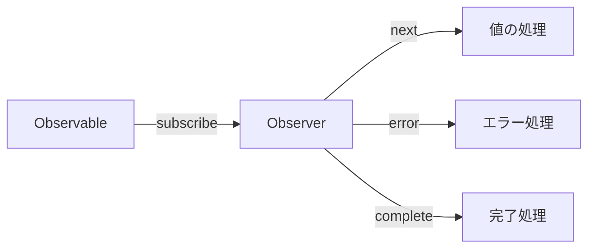

# CLAUDE.md

This file provides guidance to Claude Code (claude.ai/code) when working with code in this repository.

## Project Overview

This is a Japanese-language educational documentation site for learning RxJS with TypeScript, built with VitePress. It's a collaborative project between human engineers (@shuji-bonji) and AI (ChatGPT, Claude) aiming to be a model case for "human-AI co-created educational materials."

**Project Characteristics**:
- Educational material for TypeScript programmers learning RxJS
- Practical learning through code examples and tests
- Model case for human-AI co-created educational content
- VitePress-based static documentation site

**Language**: All documentation content is in Japanese (ja).

**Key Technologies**:
- VitePress 1.6.3 (static site generator)
- TypeScript 5.x+
- Mermaid 11.6.0 (diagrams via vitepress-plugin-mermaid)
- markdown-it-footnote 4.0.0 (for footnotes)

**Developer Context**:
- Primary developer (@shuji-bonji) has experience with Angular, RxJS, TypeScript, and Jasmine testing
- Learning focus areas: WebSocket integration, PWA, Web Components

## Development Environment

**Requirements**:
- Node.js 20 or higher
- npm or yarn
- TypeScript 5.x or higher

**Dependency Management**:
```bash
# Check outdated dependencies
npm outdated

# Safe update
npm update

# Major version updates (use with caution)
npm install <package>@latest
```

## Development Commands

### Local Development
```bash
# Install dependencies
npm install

# Start dev server with hot reload
npm run docs:dev
# Starts VitePress dev server at http://localhost:5173
# Use this for live editing of documentation
```

### Building
```bash
npm run docs:build
# Builds the site for production
# Output: docs/.vitepress/dist/
```

### Preview Built Site
```bash
# Option 1: Preview with Vite server (recommended for pre-deploy checks)
npm run docs:preview

# Option 2: Serve static files (lightweight, faster, no hot reload)
npm run docs:serve
```

## Architecture

### Directory Structure

```
docs/
├── .vitepress/
│   ├── config.ts           # Main VitePress configuration
│   ├── theme/
│   │   ├── index.ts        # Theme customization (uses default VitePress theme)
│   │   └── custom.css      # Custom styles
│   └── dist/               # Build output (generated)
├── index.md                # Homepage
└── guide/                  # Documentation content organized by topic
    ├── introduction.md
    ├── basics/             # RxJS fundamentals
    ├── observables/        # Observable concepts
    ├── subjects/           # Subject and multicasting
    ├── operators/          # Operator categories (transformation, filtering, etc.)
    ├── error-handling/     # Error handling strategies
    ├── schedulers/         # Scheduler usage
    ├── testing/            # Testing techniques
    └── typescript-advanced/ # Advanced TypeScript integration
```

### Content Organization

Documentation follows a structured 14-chapter curriculum:

1. **RxJS入門** (Introduction) - Basics and streams
2. **Observableの基礎** (Observable Basics) - Observable fundamentals, lifecycle, cold/hot
3. **Creation Functions** - Observable creation and combination functions (concat, merge, combineLatest, zip, race, forkJoin, partition)
4. **オペレーターの理解** (Operators) - Pipeable operators categorized by type:
   - Transformation operators (map, mergeMap, switchMap, etc.)
   - Filtering operators (filter, debounceTime, throttleTime, etc.)
   - Combination operators (concatWith, mergeWith, withLatestFrom, etc.)
   - Utility operators (tap, delay, retry, etc.)
   - Conditional operators (iif, defer, etc.)
   - Multicasting operators (share, shareReplay, etc.)
5. **Subjectとマルチキャスト** (Subject & Multicasting) - Subject types and usage
6. **エラーハンドリング** (Error Handling) - Error strategies, retry, catchError
7. **スケジューラーの活用** (Schedulers) - Async control and scheduler types
8. **RxJSのデバッグ手法** (Debugging) - Debugging strategies, common scenarios, and tools
9. **テスト手法** (Testing) - Unit tests, TestScheduler, marble testing
10. **RxJSアンチパターン集** (Anti-patterns) - Common mistakes and solutions
11. **TypeScriptとRxJSの高度な連携** (Advanced TypeScript Integration) - Placeholder
12. **実践パターン** (Practical Patterns) - Placeholder
13. **パフォーマンス最適化** (Performance Optimization) - Placeholder
14. **フレームワークとの統合** (Framework Integration) - Placeholder

Each operator/concept page typically includes practical use cases in a `practical-use-cases.md` file.

### Configuration Details

**VitePress Config** (`docs/.vitepress/config.ts`):
- Uses `withMermaid()` wrapper for Mermaid diagram support
- Base path: `/RxJS-with-TypeScript/` (GitHub Pages deployment)
- Configured with Open Graph and Twitter Card metadata
- Local search enabled
- Sidebar structure mirrors the curriculum
- Footer: CC-BY-4.0 license, Copyright 2025 shuji-bonji

**Theme**: Uses default VitePress theme with minimal customization in `theme/index.ts` and `custom.css`.

**Markdown Extensions**:
- Footnotes via markdown-it-footnote
- Mermaid diagrams via vitepress-plugin-mermaid

## Deployment

Automated via GitHub Actions (`.github/workflows/deploy.yml`):
- Triggers on push to `main` branch or manual workflow dispatch
- Builds site with `npm run docs:build`
- Deploys to GitHub Pages using peaceiris/actions-gh-pages@v4
- Published to: https://shuji-bonji.github.io/RxJS-with-TypeScript/

## Content Guidelines

### 1. TypeScript-First Approach

**All code examples must be written in TypeScript**:
- Clearly specify type definitions, emphasize type safety
- Provide practical examples using generics and type inference
- Minimize use of `any` - maintain type safety

Example of good TypeScript code:
```typescript
import { Observable } from 'rxjs';
import { map, filter } from 'rxjs/operators';

interface User {
  id: number;
  name: string;
  email: string;
  isActive: boolean;
}

const users$: Observable<User[]> = getUsersFromAPI();

const activeUsers$ = users$.pipe(
  map(users => users.filter(user => user.isActive)),
  // Use type inference, add type annotations when necessary
  filter((users): users is User[] => users.length > 0)
);
```

### 2. RxJS Version and Latest Developments

**Current RxJS Status (as of October 2025)**:
- **Stable**: RxJS 7.8.2 (released February 2025)
- **In Development**: RxJS v8 (master branch)
- **Important Changes**:
  - Enhanced TypeScript support
  - Optimized bundle size
  - Improved performance
  - More intuitive API

**Import Method** (RxJS 7.2+):
```typescript
// Recommended import method
import { Observable, of, from } from 'rxjs';
import { map, filter, catchError } from 'rxjs/operators';
```

### 3. Angular Integration Considerations

Developer (@shuji-bonji) has Angular experience:
- Include Angular-specific implementation examples where appropriate
- **Framework-agnostic content should be the foundation**
- Appropriately explain comparisons with Angular-specific features (Signals, etc.)
- Angular 19+ integrates Signals and RxJS, allowing interoperability

### 4. Content Structure

Each section should include:
1. **Overview** - Concise explanation of concepts
2. **Basic Usage** - Simple TypeScript code
3. **Practical Examples** - Real-world application examples
4. **Test Code** - Test examples using Jasmine (leveraging developer's experience)
5. **Notes and Best Practices**
6. **Memory Leak Prevention** (where applicable)

### 5. Operator Guidelines

Pay special attention to these operator patterns:
- **Higher-order mapping operators** (mergeMap, switchMap, concatMap, exhaustMap) - usage differences
- **Backpressure control** (throttleTime, debounceTime)
- **Error handling patterns** (catchError, retry, retryWhen)

### 6. Writing Style

**Japanese Language**:
- Technical terms remain in English (Observable, Subject, etc.)
- Explanations in clear Japanese
- Comments use appropriate mix of Japanese and English

**Visual Diagrams with Mermaid**:
Visualize complex concepts with diagrams:


### 7. Quality Assurance

**Code Verification**:
1. All code examples must be actually tested
2. TypeScript compiler type checking
3. Provide test code wherever possible

**Performance Considerations**:
- Explicitly show patterns to prevent memory leaks
- Proper unsubscription methods
- Efficient operator selection

### 8. Documentation Enhancement Guidelines

**Purpose**: Improve readability and understanding by adding contextual explanations to all documentation pages (140+ pages planned).

**Completed Examples**:
- `docs/guide/anti-patterns/flag-management.md` - Demonstrates comprehensive explanation structure
- `docs/guide/overcoming-difficulties/index.md` - Shows how to enhance index pages

#### 8.1. Article Introduction

Every article should start with a clear introduction that:
- Explains **what the article covers** and **why it matters**
- Provides context for the reader's current situation
- Previews the main topics to be discussed

**Example**:
```markdown
# 状態管理フラグの乱立

RxJSを導入したプロジェクトでも、コンポーネント内に大量のbooleanフラグが乱立する問題がよく見られます。この記事では、17個ものフラグが存在する実際の事例を元に、その原因と改善方法を解説します。
```

#### 8.2. Section Headings

Each major section (##) should include a 1-2 sentence explanation of:
- **What** the section discusses
- **Why** it's important
- **How** it relates to the overall topic

**Example**:
```markdown
## なぜフラグが乱立するのか

フラグが乱立する背景には、技術的な問題だけでなく、開発者の思考パターンや組織の進化過程が関係しています。以下、5つの主要な原因を分析します。
```

#### 8.3. Code Block Context

**Before Code Blocks**:
- Explain what the code demonstrates
- Highlight the key point readers should notice
- Provide context for when this pattern applies

**After Code Blocks**:
- Use VitePress callouts (`> [!TIP]`, `> [!WARNING]`, `> [!IMPORTANT]`) for key points
- Summarize the main takeaway
- List concrete benefits or problems

**Example**:
```markdown
以下の例で、問題のあるフラグと適切なフラグの違いを比較します。

[CODE BLOCK]

> [!WARNING] 問題点
> - 状態が「宣言的」でなく「手続き的」
> - 状態変更のタイミングが散在
> - フラグ間の整合性を開発者が手動保証
```

#### 8.4. Transition Sentences

Connect sections smoothly with transition sentences:
- Between major sections: Explain how topics relate
- Before lists/tables: State what the list contains and how to use it
- Before diagrams: Explain what the diagram illustrates

**Example**:
```markdown
### 改善戦略

フラグ乱立問題を解決するには、以下の3ステップで段階的にリファクタリングを進めます。

### Step 1: 状態の棚卸し

まず、現在のフラグをすべて列挙し、責務ごとに分類します。これにより、どのフラグが統合可能かが見えてきます。
```

#### 8.5. Practical Examples

When showing Before/After comparisons:
- **Before**: Explain the problem concretely
- **After**: Highlight what improved and why
- **Comparison**: Use tables or side-by-side format when helpful

#### 8.6. Conclusion Sections

Every article should end with:
1. **Summary** - Key points recap
2. **Important Principles** - Core takeaways (using callouts)
3. **Related Sections** - Links with brief descriptions
4. **References** - External resources with context

**Example**:
```markdown
## 参考リソース

RxJSの公式ドキュメントや学習リソースで、さらに深く学習できます：

- [RxJS公式ドキュメント](https://rxjs.dev/) - 公式のAPIリファレンスとガイド
- [Learn RxJS](https://www.learnrxjs.io/) - オペレーター別の実践的な例
- [RxJS Marbles](https://rxmarbles.com/) - ビジュアルでオペレーターの動作を理解
```

#### 8.7. Enhancement Checklist

When enhancing any documentation page, verify:
- [ ] Article has clear introduction (what, why, how)
- [ ] Each section has contextual explanation
- [ ] Code blocks have before/after context
- [ ] VitePress callouts used for key points (`> [!TIP]`, `> [!WARNING]`, etc.)
- [ ] Transitions between sections are smooth
- [ ] Tables/lists have introductory sentences
- [ ] Diagrams have explanatory text
- [ ] Conclusion summarizes key points
- [ ] Related links include descriptions
- [ ] Language is accessible to target audience (TypeScript developers learning RxJS)

#### 8.8. Implementation Process

For each page:
1. **Read through** - Understand the existing content
2. **Identify gaps** - Note sections lacking context
3. **Add introductions** - Start with article and section intros
4. **Contextualize code** - Add before/after explanations
5. **Enhance transitions** - Connect sections smoothly
6. **Verify build** - Run `npm run docs:build` to test
7. **Review readability** - Ensure natural flow

**Progress Tracking** (as of 2025-10-20):
- ✅ `docs/guide/anti-patterns/flag-management.md` - Complete
- ✅ `docs/guide/overcoming-difficulties/index.md` - Complete
- 🔲 Remaining: ~140 pages to enhance

#### 8.9. Writing Tips

- **Use concrete examples** - "17個のフラグ" is better than "たくさんのフラグ"
- **Explain the "why"** - Don't just show code, explain reasoning
- **Progressive disclosure** - Start simple, then add complexity
- **Reader empathy** - Anticipate confusion points
- **Consistent terminology** - Use the same terms throughout

### 9. General Guidelines

When editing documentation:
- All content should be in Japanese
- Maintain the established curriculum structure
- Each operator/concept page should include code examples with TypeScript
- Use Mermaid diagrams where helpful for visualizing streams
- Include practical use cases for each operator category
- Follow the collaborative human-AI creation approach
- Respect the CC-BY-4.0 license for content
- Reference official RxJS and TypeScript documentation (both Apache 2.0 licensed)

## Content Priorities and TODO

### High Priority
1. **RxJS v8 Preparation**
   - Research and document new features
   - Create migration guide
2. **Add Practical Use Cases**
   - WebSocket integration (developer's learning focus)
   - PWA application examples
   - Web Components integration
3. **Expand Testing Section**
   - Concrete examples using Jasmine
   - Detailed marble testing explanation

### Medium Priority
1. Add interactive code examples
2. Expand performance optimization section
3. Common mistakes and their solutions

### Low Priority
1. Consider video tutorials
2. Add practice exercises
3. Community contribution guidelines

---

## Completed Releases

### ✅ Third Release: New Chapters (Completed)

The following new chapters have been added or are planned for future releases.

#### ✅ Chapter 3: Creation Functions (Added in restructuring)

**Purpose:**
- Clearly separate creation functions from pipeable operators
- Teach Observable creation and combination before manipulation
- Explain the relationship between creation functions (concat, merge) and pipeable operators (concatWith, mergeWith)

**Placement:** After Observable basics, before Pipeable Operators
- Natural progression: Basic creation (of, from) → **Advanced creation/combination** → Manipulation (operators) → Sharing (Subject)

**Structure:**
```
3. Creation Functions
├── Creation Functions とは
│   ├── Pipeable Operator との違い
│   └── 使い分けの基準
├── 基本的な Creation Functions（2章の復習）
│   └── of, from, interval, timer
├── 結合系 Creation Functions
│   ├── concat - 順次結合
│   ├── merge - 並行結合
│   ├── combineLatest - 最新値の組み合わせ
│   ├── zip - 対応する値のペア化
│   ├── race - 最速のストリームを採用
│   ├── forkJoin - すべての完了を待つ
│   └── partition - 条件で分割
└── Pipeable Operator との対応関係
```

#### ✅ Chapter 8: RxJSのデバッグ手法 (Structure created, content TBD)

**Why Critical:**
- RxJS debugging is one of the most challenging aspects for learners
- Essential skill for real-world development
- Complements existing testing and anti-patterns chapters

**Proposed Structure:**
```
8. RxJSのデバッグ手法
├── デバッグの基本戦略
│   ├── tap オペレーターでのログ出力
│   ├── 開発者ツールでの確認
│   └── RxJS DevTools の活用
├── よくあるデバッグシナリオ
│   ├── 値が流れてこない
│   ├── 期待と異なる値が出力される
│   ├── 購読が完了しない（無限ストリーム）
│   ├── メモリリーク（購読解除忘れ）
│   └── エラーが発生しているのに気づかない
├── デバッグツール
│   ├── rxjs-spy の使い方
│   ├── RxJS DevTools（ブラウザ拡張）
│   └── カスタムデバッグオペレーターの作成
└── パフォーマンスデバッグ
    ├── 購読数の確認
    ├── 不要な再評価の検出
    └── メモリ使用量の監視
```

**Placement:** Between Chapter 7 (Schedulers) and Chapter 9 (Testing)
- Natural progression: Implementation → Error Handling → Schedulers → **Debugging** → Testing → Anti-patterns

#### ✅ Chapter 11: RxJS困難点克服 (Completed)

**Purpose:**
- Address common difficulties that experienced developers face when working with RxJS
- Provide actionable guidance to overcome RxJS-specific conceptual and practical barriers
- Bridge the gap between theory (Chapters 1-10) and practice (Chapter 13)

**Structure:**
```
11. RxJS困難点克服
├── index.md                        # なぜRxJSは難しいのか（経験者でも）
├── conceptual-understanding.md     # 概念理解の壁
├── lifecycle-management.md         # ライフサイクル管理の壁
├── operator-selection.md           # オペレーター選択の迷い
├── timing-and-order.md             # タイミングと順序の理解
├── state-and-sharing.md            # 状態管理の難しさ
├── stream-combination.md           # 複数ストリーム組み合わせ
└── debugging-guide.md              # デバッグの壁
```

**Implementation Status:** ✅ All 7 pages completed (Q1 2025)

---

## Active Development

#### 🔄 Medium Priority: Chapter 15 Enhancement - フレームワークとの統合

**Phased Approach:**

**Phase 1: Basic Framework Integration (15.1)**
- Quick start guides for each framework (5-10 min read)
- Focus on basic RxJS usage patterns
- Heavy use of external documentation links
- Frameworks: Angular, React, Vue, Svelte

**Phase 2: State Management Integration (15.2)** ⭐ Main Enhancement
```
14.2 状態管理との統合
├── RxJS + NgRX (Angular)
│   ├── 基本的なパターン
│   ├── Effects と Observables
│   └── 実践例：非同期処理の管理
├── RxJS + Signals (Angular 19+)
│   ├── Signals と RxJS の相互運用
│   ├── toSignal / toObservable
│   └── 実践例：リアクティブフォーム
├── RxJS + Runes (Svelte 5)
│   ├── $state と Observable の連携
│   ├── $derived と RxJS パイプライン
│   └── 実践例：リアルタイムデータ
└── RxJS + 他の状態管理
    ├── Redux Toolkit
    ├── Zustand
    └── Jotai
```

**Phase 3: Web API Integration (15.3)**
- WebSocket (developer's focus area)
- Server-Sent Events
- IndexedDB

**Implementation Strategy:**
1. Start with NgRX + RxJS (leverage developer's Angular experience)
2. Keep each topic at "introduction" level
3. Provide rich external documentation links
4. Add based on user feedback

**Considerations:**
- ⚠️ Maintain framework-agnostic foundation
- ⚠️ Avoid scope creep (don't become a state management tutorial)
- ⚠️ Maintenance overhead for framework updates
- ✅ Provides unique value vs other RxJS resources
- ✅ Reflects 2024-2025 trends (Signals, Runes)

**Priority-term**: Chapter 14.1 基本的なフレームワーク連携
2. **Medium-term**: Chapter 14.2 状態管理との統合 (starting with NgRX)

--- Order:**
1. **Short

#### 🔴 High Priority: Chapter 13 - 実践パターン集 (Planned)

**Purpose:**
- Provide real-world implementation patterns for common use cases
- Show how to apply RxJS knowledge in practical scenarios
- Address the gap between "knowing operators" and "building features"

**Structure:**
```
13. 実践パターン集
├── index.md                        # 実践パターンの概要
│   ├── パターン一覧
│   ├── 使い方ガイド
│   └── 実装時の考え方
├── ui-events.md                    # UIイベント処理パターン
│   ├── クリックイベントの制御（throttle, debounce, distinct）
│   ├── ドラッグ&ドロップ
│   ├── スクロールイベント処理
│   ├── キーボード入力（オートコンプリート）
│   └── マルチタッチ対応
├── api-calls.md                    # API呼び出しパターン
│   ├── 基本的なGET/POST
│   ├── 並列リクエスト（forkJoin）
│   ├── 直列リクエスト（concatMap）
│   ├── 依存関係のあるリクエスト（switchMap）
│   ├── リトライとエラーハンドリング
│   ├── タイムアウト処理
│   └── キャンセル処理（takeUntil）
├── form-handling.md                # フォーム処理パターン
│   ├── リアルタイムバリデーション
│   ├── 自動保存（debounce + distinctUntilChanged）
│   ├── 複数フィールドの組み合わせ（combineLatest）
│   ├── 条件付きフィールド表示
│   ├── サブミット処理（exhaustMap で二重送信防止）
│   └── エラー表示とリセット
├── real-time-data.md               # リアルタイムデータ処理
│   ├── WebSocket 統合
│   ├── Server-Sent Events (SSE)
│   ├── Polling パターン
│   ├── 接続管理とリトライ
│   ├── データのマージと更新
│   └── 通知システム
├── caching-strategies.md           # キャッシュ戦略
│   ├── shareReplay でのキャッシュ
│   ├── 手動リフレッシュパターン
│   ├── TTL（有効期限）付きキャッシュ
│   ├── キャッシュ無効化戦略
│   ├── ローカルストレージ連携
│   └── オフライン対応
├── error-handling-patterns.md      # エラーハンドリング実践パターン
│   ├── API呼び出しでのエラーハンドリング
│   ├── ユーザー通知とフォールバック戦略
│   ├── リトライ戦略（指数バックオフ）
│   ├── グローバルエラーハンドリング
│   ├── エラー境界の設計
│   └── ログとモニタリング
└── subscribe-branching.md          # subscribe内の条件分岐パターン
    ├── 問題：subscribe内で複雑な条件分岐
    ├── パターン1: パイプラインでの分岐（filter + tap）
    ├── パターン2: partition による分岐
    ├── パターン3: switchMap + iif による動的分岐
    ├── パターン4: 関数化 + map による変換（推奨）
    ├── 実践例：APIレスポンス処理
    └── 選択のガイドライン
```

**Content Characteristics:**
- 実務で即座に使えるコード例
- Before/After での比較
- パフォーマンスとメモリ考慮
- テストコード付き
- TypeScript での型安全性

**Integration with Existing Content:**
- Chapter 6（エラーハンドリング）の基礎を実践で応用
- Chapter 10（アンチパターン）で学んだことを避けるパターン
- Chapter 11（学習の壁）で克服した知識を実践

**Implementation Strategy:**
1. **Phase 1**: Core patterns (ui-events, api-calls, form-handling)
2. **Phase 2**: Advanced patterns (real-time-data, caching-strategies)
3. **Phase 3**: Specialized patterns (error-handling, subscribe-branching)

**Developer Focus Areas:**
- WebSocket integration (developer's learning focus) → `real-time-data.md`
- PWA application examples → `caching-strategies.md`
- Web Components integration → `ui-events.md`

**Timeline:**
- **Q2-Q3 2025**: Chapter 13 implementation (7 pages)
- **Q4 2025**: Integration and cross-referencing

---

## Future Enhancements

The following enhancements are planned for future releases to keep the documentation current with the latest RxJS developments and ecosystem trends.

#### 🔴 High Priority: RxJS v8 Full Migration

**Purpose:**
- Provide comprehensive migration guide from RxJS v7 to v8
- Document all breaking changes and new features
- Update all code examples to v8 best practices

**Structure:**
```
RxJS v8 Migration Guide
├── Breaking Changes Overview
│   ├── Removed operators and their replacements
│   ├── API signature changes
│   └── Import path updates
├── New Features and Improvements
│   ├── Performance enhancements
│   ├── Bundle size optimizations
│   └── New operator additions
├── Migration Strategy
│   ├── Step-by-step migration process
│   ├── Automated migration tools
│   └── Testing migration results
└── Updated Code Examples
    ├── Before/After comparisons
    └── Best practices for v8
```

**Implementation Tasks:**
1. Monitor RxJS v8 stable release
2. Review official migration guide
3. Update all existing documentation examples
4. Create dedicated migration guide page
5. Add version badges throughout documentation

**Timeline:** Upon RxJS v8 stable release

---

#### 🔴 High Priority: Observable と Signal の統合 (Deep Dive)

**Purpose:**
- Provide comprehensive guide on Observable-Signal interoperability
- Show practical patterns for modern reactive applications
- Cover both Angular Signals and framework-agnostic approaches

**Structure:**
```
Observable と Signal の統合
├── Angular Signals との統合 (詳細版)
│   ├── toSignal / toObservable の詳細
│   ├── Signal based Inputs と RxJS
│   ├── computedとObservableの組み合わせ
│   ├── effectとObservableの連携
│   └── 実践例：リアクティブフォームの最新パターン
├── 他のフレームワークのSignals
│   ├── Solid.js Signals
│   ├── Preact Signals
│   └── Vue 3 Composition API
├── Observable vs Signal の使い分け
│   ├── それぞれの強み・弱み
│   ├── パフォーマンス比較
│   └── 選択のガイドライン
└── 実践パターン集
    ├── フォーム処理
    ├── 状態管理
    └── 非同期データフロー
```

**Implementation Tasks:**
1. Expand Chapter 14.2 content significantly
2. Add standalone chapter option if content grows large
3. Include framework-agnostic Signal concepts
4. Provide migration patterns from pure RxJS to Signal-hybrid approaches
5. Add performance benchmarks and trade-off analysis

**Placement Options:**
- **Option 1**: Expand Chapter 14.2 (State Management Integration)
- **Option 2**: Create standalone Chapter 12.5 (Advanced TypeScript Integration subsection)

**Timeline:** Q2-Q3 2025

---

#### 🟡 Medium Priority: TestScheduler 活用ガイド (拡張)

**Purpose:**
- Expand Chapter 9 testing section with comprehensive TestScheduler guide
- Provide advanced marble testing techniques
- Show real-world testing scenarios

**Structure:**
```
TestScheduler 活用ガイド（拡張）
├── TestScheduler の基礎（復習）
│   ├── 基本的な使い方
│   └── Marble Diagram 記法
├── 高度な TestScheduler テクニック
│   ├── 複雑な時間制御のテスト
│   ├── Higher-order Observable のテスト
│   ├── エラーハンドリングのテスト
│   └── リトライ・タイムアウトのテスト
├── 実践的なテストパターン
│   ├── API呼び出しのテスト
│   ├── フォーム処理のテスト
│   ├── WebSocket 通信のテスト
│   └── キャッシュ戦略のテスト
├── デバッグとトラブルシューティング
│   ├── よくあるテストの失敗原因
│   ├── Marble Diagram のデバッグ方法
│   └── 非同期処理のデバッグ
└── CI/CD との統合
    ├── テスト環境のセットアップ
    ├── カバレッジ測定
    └── パフォーマンステスト
```

**Implementation Tasks:**
1. Expand existing Chapter 9 testing content
2. Add dedicated TestScheduler subsection (Chapter 9.3)
3. Provide downloadable test code examples
4. Include video tutorials for complex scenarios
5. Cross-reference with Chapter 13 practical patterns

**Placement:** Chapter 9.3 (new subsection within existing Testing chapter)

**Timeline:** Q3-Q4 2025

---

**Priority Summary:**
1. **RxJS v8 Full Migration** - Critical for staying current (wait for stable release)
2. **Observable と Signal の統合** - High demand, reflects 2025 ecosystem trends
3. **TestScheduler 活用ガイド** - Important for production quality, less urgent

**Dependencies:**
- **RxJS v8 Migration**: Depends on official v8 stable release
- **Observable-Signal integration**: Can start now with Angular 19+ examples
- **TestScheduler guide**: Can start anytime, complements existing content

## Reference Resources

- [RxJS Official Documentation](https://rxjs.dev)
- [RxJS GitHub](https://github.com/ReactiveX/rxjs)
- [TypeScript Official Documentation](https://www.typescriptlang.org)
- [Learn RxJS](https://www.learnrxjs.io/)
- [RxJS Marbles](https://rxmarbles.com/)

**Track Latest RxJS Information**:
1. Monitor official repository for release notes and breaking changes
2. Follow community trends - RxJS v8 new features, TypeScript integration
3. Update dependencies regularly (see Development Environment section)

## Important Notes

1. **Never sacrifice type safety** - Minimize use of `any`
2. **Thorough subscription management** - Proper use of unsubscribe or takeUntil
3. **Follow latest developments** - RxJS v8, TypeScript 5.x new features
4. **Be practical** - Emphasize real-world examples, not just theory
5. **Prevent memory leaks** - Always include proper cleanup patterns

## Collaboration Guidelines

**Working with AI Assistants**:
- Prioritize technical accuracy
- Provide practical, working code examples
- Reflect latest best practices
- Create content leveraging developer's experience (Angular, RxJS, TypeScript)

**Content Review Perspectives**:
1. **Technical Accuracy** - Compliant with specifications
2. **Practicality** - Usable in real work
3. **Clarity** - Understandable for beginners
4. **Currency** - Compliant with latest RxJS/TypeScript specifications
5. **Completeness** - Includes important notes like memory leak prevention

## License

Content: CC-BY-4.0 (Creative Commons Attribution 4.0 International)
