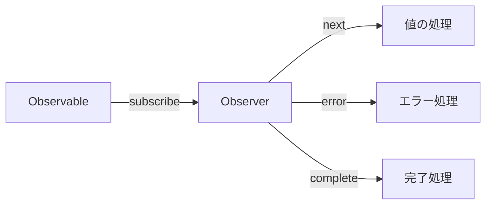

# CLAUDE.md

This file provides guidance to Claude Code (claude.ai/code) when working with code in this repository.

## Project Overview

This is a Japanese-language educational documentation site for learning RxJS with TypeScript, built with VitePress. It's a collaborative project between human engineers (@shuji-bonji) and AI (ChatGPT, Claude) aiming to be a model case for "human-AI co-created educational materials."

**Project Characteristics**:
- Educational material for TypeScript programmers learning RxJS
- Practical learning through code examples and tests
- Model case for human-AI co-created educational content
- VitePress-based static documentation site

**Language**: All documentation content is in Japanese (ja).

**Key Technologies**:
- VitePress 1.6.3 (static site generator)
- TypeScript 5.x+
- Mermaid 11.6.0 (diagrams via vitepress-plugin-mermaid)
- markdown-it-footnote 4.0.0 (for footnotes)

**Developer Context**:
- Primary developer (@shuji-bonji) has experience with Angular, RxJS, TypeScript, and Jasmine testing
- Learning focus areas: WebSocket integration, PWA, Web Components

## Development Environment

**Requirements**:
- Node.js 20 or higher
- npm or yarn
- TypeScript 5.x or higher

**Dependency Management**:
```bash
# Check outdated dependencies
npm outdated

# Safe update
npm update

# Major version updates (use with caution)
npm install <package>@latest
```

## Development Commands

### Local Development
```bash
# Install dependencies
npm install

# Start dev server with hot reload
npm run docs:dev
# Starts VitePress dev server at http://localhost:5173
# Use this for live editing of documentation
```

### Building
```bash
npm run docs:build
# Builds the site for production
# Output: docs/.vitepress/dist/
```

### Preview Built Site
```bash
# Option 1: Preview with Vite server (recommended for pre-deploy checks)
npm run docs:preview

# Option 2: Serve static files (lightweight, faster, no hot reload)
npm run docs:serve
```

## Architecture

### Directory Structure

```
docs/
├── .vitepress/
│   ├── config.ts           # Main VitePress configuration
│   ├── theme/
│   │   ├── index.ts        # Theme customization (uses default VitePress theme)
│   │   └── custom.css      # Custom styles
│   └── dist/               # Build output (generated)
├── index.md                # Homepage
└── guide/                  # Documentation content organized by topic
    ├── introduction.md
    ├── basics/             # RxJS fundamentals
    ├── observables/        # Observable concepts
    ├── subjects/           # Subject and multicasting
    ├── operators/          # Operator categories (transformation, filtering, etc.)
    ├── error-handling/     # Error handling strategies
    ├── schedulers/         # Scheduler usage
    ├── testing/            # Testing techniques
    └── typescript-advanced/ # Advanced TypeScript integration
```

### Content Organization

Documentation follows a structured 14-chapter curriculum:

1. **RxJS入門** (Introduction) - Basics and streams
2. **Observableの基礎** (Observable Basics) - Observable fundamentals, lifecycle, cold/hot
3. **Creation Functions** - Observable creation and combination functions (concat, merge, combineLatest, zip, race, forkJoin, partition)
4. **オペレーターの理解** (Operators) - Pipeable operators categorized by type:
   - Transformation operators (map, mergeMap, switchMap, etc.)
   - Filtering operators (filter, debounceTime, throttleTime, etc.)
   - Combination operators (concatWith, mergeWith, withLatestFrom, etc.)
   - Utility operators (tap, delay, retry, etc.)
   - Conditional operators (iif, defer, etc.)
   - Multicasting operators (share, shareReplay, etc.)
5. **Subjectとマルチキャスト** (Subject & Multicasting) - Subject types and usage
6. **エラーハンドリング** (Error Handling) - Error strategies, retry, catchError
7. **スケジューラーの活用** (Schedulers) - Async control and scheduler types
8. **RxJSのデバッグ手法** (Debugging) - Debugging strategies, common scenarios, and tools
9. **テスト手法** (Testing) - Unit tests, TestScheduler, marble testing
10. **RxJSアンチパターン集** (Anti-patterns) - Common mistakes and solutions
11. **TypeScriptとRxJSの高度な連携** (Advanced TypeScript Integration) - Placeholder
12. **実践パターン** (Practical Patterns) - Placeholder
13. **パフォーマンス最適化** (Performance Optimization) - Placeholder
14. **フレームワークとの統合** (Framework Integration) - Placeholder

Each operator/concept page typically includes practical use cases in a `practical-use-cases.md` file.

### Configuration Details

**VitePress Config** (`docs/.vitepress/config.ts`):
- Uses `withMermaid()` wrapper for Mermaid diagram support
- Base path: `/RxJS-with-TypeScript/` (GitHub Pages deployment)
- Configured with Open Graph and Twitter Card metadata
- Local search enabled
- Sidebar structure mirrors the curriculum
- Footer: CC-BY-4.0 license, Copyright 2025 shuji-bonji

**Theme**: Uses default VitePress theme with minimal customization in `theme/index.ts` and `custom.css`.

**Markdown Extensions**:
- Footnotes via markdown-it-footnote
- Mermaid diagrams via vitepress-plugin-mermaid

## Deployment

Automated via GitHub Actions (`.github/workflows/deploy.yml`):
- Triggers on push to `main` branch or manual workflow dispatch
- Builds site with `npm run docs:build`
- Deploys to GitHub Pages using peaceiris/actions-gh-pages@v4
- Published to: https://shuji-bonji.github.io/RxJS-with-TypeScript/

## Content Guidelines

### 1. TypeScript-First Approach

**All code examples must be written in TypeScript**:
- Clearly specify type definitions, emphasize type safety
- Provide practical examples using generics and type inference
- Minimize use of `any` - maintain type safety

Example of good TypeScript code:
```typescript
import { Observable } from 'rxjs';
import { map, filter } from 'rxjs/operators';

interface User {
  id: number;
  name: string;
  email: string;
  isActive: boolean;
}

const users$: Observable<User[]> = getUsersFromAPI();

const activeUsers$ = users$.pipe(
  map(users => users.filter(user => user.isActive)),
  // Use type inference, add type annotations when necessary
  filter((users): users is User[] => users.length > 0)
);
```

### 2. RxJS Version and Latest Developments

**Current RxJS Status (as of October 2025)**:
- **Stable**: RxJS 7.8.2 (released February 2025)
- **In Development**: RxJS v8 (master branch)
- **Important Changes**:
  - Enhanced TypeScript support
  - Optimized bundle size
  - Improved performance
  - More intuitive API

**Import Method** (RxJS 7.2+):
```typescript
// Recommended import method
import { Observable, of, from } from 'rxjs';
import { map, filter, catchError } from 'rxjs/operators';
```

### 3. Angular Integration Considerations

Developer (@shuji-bonji) has Angular experience:
- Include Angular-specific implementation examples where appropriate
- **Framework-agnostic content should be the foundation**
- Appropriately explain comparisons with Angular-specific features (Signals, etc.)
- Angular 19+ integrates Signals and RxJS, allowing interoperability

### 4. Content Structure

Each section should include:
1. **Overview** - Concise explanation of concepts
2. **Basic Usage** - Simple TypeScript code
3. **Practical Examples** - Real-world application examples
4. **Test Code** - Test examples using Jasmine (leveraging developer's experience)
5. **Notes and Best Practices**
6. **Memory Leak Prevention** (where applicable)

### 5. Operator Guidelines

Pay special attention to these operator patterns:
- **Higher-order mapping operators** (mergeMap, switchMap, concatMap, exhaustMap) - usage differences
- **Backpressure control** (throttleTime, debounceTime)
- **Error handling patterns** (catchError, retry, retryWhen)

### 6. Writing Style

**Japanese Language**:
- Technical terms remain in English (Observable, Subject, etc.)
- Explanations in clear Japanese
- Comments use appropriate mix of Japanese and English

**Visual Diagrams with Mermaid**:
Visualize complex concepts with diagrams:


### 7. Quality Assurance

**Code Verification**:
1. All code examples must be actually tested
2. TypeScript compiler type checking
3. Provide test code wherever possible

**Performance Considerations**:
- Explicitly show patterns to prevent memory leaks
- Proper unsubscription methods
- Efficient operator selection

### 8. General Guidelines

When editing documentation:
- All content should be in Japanese
- Maintain the established curriculum structure
- Each operator/concept page should include code examples with TypeScript
- Use Mermaid diagrams where helpful for visualizing streams
- Include practical use cases for each operator category
- Follow the collaborative human-AI creation approach
- Respect the CC-BY-4.0 license for content
- Reference official RxJS and TypeScript documentation (both Apache 2.0 licensed)

## Content Priorities and TODO

### Immediate Priority: Technical Corrections for RxJS v7-v8 Compliance

Based on technical review, the following items need updates to align with current RxJS best practices:

1. **✅ `share()` operator explanation update**
   - Status: Completed
   - Issue: "内部的には `multicast()` と `refCount()` の組み合わせ" is outdated
   - Action: Update to reflect that `multicast/publish/refCount` are deprecated in v7, removed in v8
   - Details: Explain `share` now accepts options like `connector`, and can replace `shareReplay` behavior
   - Reference: https://rxjs.dev/deprecations/multicasting
   - Files: `docs/guide/operators/multicasting/share.md`

2. **✅ Import path modernization**
   - Status: Completed (107 files updated)
   - Issue: Many examples use `import { X } from 'rxjs/operators'`
   - Action: Change all imports to top-level `import { X } from 'rxjs'`
   - Details: `'rxjs/operators'` exports are deprecated since v7.2+, will be removed in future
   - Reference: https://rxjs.dev/guide/importing
   - Files: All operator documentation pages (bulk updated via sed)

3. **✅ Deprecated operator badges in index/TOC**
   - Status: Completed (Partially - index.md updated, config.ts pending)
   - Issue: `pluck`, `mapTo`, `*MapTo` not clearly marked as deprecated in overview pages
   - Action: Add "⚠️ 非推奨" badges in `docs/guide/operators/index.md` table
   - Details: `pluck` removed in v8, `mapTo/mergeMapTo/concatMapTo/switchMapTo` removed in v9
   - Alternative: Use `map(() => value)` / `mergeMap(() => inner$)` etc.
   - Reference: https://rxjs.dev/api/operators/pluck
   - Files: `docs/guide/operators/index.md`, sidebar in `config.ts`

4. **✅ `subscribe()` three-argument form deprecation**
   - Status: Completed (2 instances fixed)
   - Issue: Check if any examples use `subscribe(next, error, complete)`
   - Action: Replace with observer object `{ next, error, complete }` or single function
   - Reference: https://rxjs.dev/deprecations/subscribe-arguments
   - Files: `observable-lifecycle.md`, `pairwise.md`

5. **✅ `reduce` operator warning for infinite streams**
   - Status: Completed
   - Issue: Missing warning that `reduce` requires `complete()` to emit
   - Action: Add prominent note that infinite streams never emit, suggest `scan` + `takeLast(1)` alternative
   - Reference: https://rxjs.dev/api/index/function/reduce
   - Files: `docs/guide/operators/transformation/reduce.md`

6. **✅ Modern `share()` configuration examples**
   - Status: Completed
   - Issue: Multicasting chapter lacks modern `share({...})` recipes
   - Action: Add example showing `share({ connector: () => new ReplaySubject(1), ... })` pattern
   - Details: Show how to replace `shareReplay` behavior with explicit config
   - Reference: https://rxjs.dev/deprecations/multicasting
   - Files: `docs/guide/operators/multicasting/share.md`, `docs/guide/subjects/multicasting.md`

7. **✅ Promise conversion API update**
   - Status: Completed (1 reference updated)
   - Issue: Check if `toPromise()` is used anywhere
   - Action: Replace with `firstValueFrom()` / `lastValueFrom()` with default value examples
   - Reference: https://kylenazario.com/blog/rxjs-7-changes
   - Files: `unit-tests.md` (deprecated method reference removed), `promise-vs-rxjs.md` (already has deprecation warning)

**Implementation Status: ✅ All 7 items completed**

Summary of changes:
- **share.md**: Updated multicast/refCount explanation, added modern connector examples, added deprecation warnings
- **reduce.md**: Added WARNING callout about infinite streams with 3 alternative strategies
- **index.md**: Added deprecated badges (⚠️ 非推奨) for pluck, mapTo with version info and alternatives
- **107 files**: Bulk updated imports from `'rxjs/operators'` to `'rxjs'` using sed
- **2 files**: Fixed subscribe() three-argument form to modern observer object syntax
- **1 file**: Removed toPromise() reference, replaced with firstValueFrom/lastValueFrom
- All changes comply with RxJS v7-v8 best practices and deprecation guidelines

### High Priority
1. **RxJS v8 Preparation**
   - Research and document new features
   - Create migration guide
2. **Add Practical Use Cases**
   - WebSocket integration (developer's learning focus)
   - PWA application examples
   - Web Components integration
3. **Expand Testing Section**
   - Concrete examples using Jasmine
   - Detailed marble testing explanation

### Medium Priority
1. Add interactive code examples
2. Expand performance optimization section
3. Common mistakes and their solutions

### Low Priority
1. Consider video tutorials
2. Add practice exercises
3. Community contribution guidelines

### Second Release: Additional Operators

The following operators are planned for the second documentation release, prioritized by usage frequency and practical importance.

#### ✅ Completed Operators

**Transformation Operators:**
- ✅ `buffer` - Basic buffer operator (docs/guide/operators/transformation/buffer.md)
- ✅ `bufferToggle` - Independent start/end control buffering (docs/guide/operators/transformation/bufferToggle.md)
- ✅ `bufferWhen` - Dynamic closing control buffering (docs/guide/operators/transformation/bufferWhen.md)
- ✅ `expand` - Recursive expansion (docs/guide/operators/transformation/expand.md)
- ✅ `reduce` - Aggregation processing (docs/guide/operators/transformation/reduce.md)
- ✅ `pairwise` - Process consecutive pairs of values (docs/guide/operators/transformation/pairwise.md)
- ✅ `groupBy` - Group emissions by key (docs/guide/operators/transformation/groupBy.md)
- ✅ `mergeScan` - Accumulation with merging (docs/guide/operators/transformation/mergeScan.md)
- ✅ `window` - Split by Observable trigger (docs/guide/operators/transformation/window.md)
- ✅ `windowCount` - Split by count (docs/guide/operators/transformation/windowCount.md)
- ✅ `windowToggle` - Independent start/end control windowing (docs/guide/operators/transformation/windowToggle.md)
- ✅ `windowWhen` - Dynamic closing control windowing (docs/guide/operators/transformation/windowWhen.md)

**Filtering Operators:**
- ✅ `distinct` - Remove all duplicates (docs/guide/operators/filtering/distinct.md)
- ✅ `skip` - Skip first N emissions (docs/guide/operators/filtering/skip.md)
- ✅ `skipLast` - Skip last N emissions (docs/guide/operators/filtering/skipLast.md)
- ✅ `skipWhile` - Skip while condition is true (docs/guide/operators/filtering/skipWhile.md)
- ✅ `skipUntil` - Ignore emissions until another Observable emits (docs/guide/operators/filtering/skipUntil.md)
- ✅ `takeLast` - Take last N emissions (docs/guide/operators/filtering/takeLast.md)
- ✅ `takeWhile` - Take emissions while condition is true (docs/guide/operators/filtering/takeWhile.md)
- ✅ `elementAt` - Get emission at specific index (docs/guide/operators/filtering/elementAt.md)
- ✅ `find` - Find first emission matching predicate (docs/guide/operators/filtering/find.md)
- ✅ `findIndex` - Find index of first matching emission (docs/guide/operators/filtering/findIndex.md)
- ✅ `auditTime` - Emit last value after specified time (docs/guide/operators/filtering/auditTime.md)
- ✅ `audit` - Custom Observable-controlled timing (docs/guide/operators/filtering/audit.md)
- ✅ `sampleTime` - Sample emissions at fixed intervals (docs/guide/operators/filtering/sampleTime.md)
- ✅ `ignoreElements` - Ignore all emissions, only complete/error (docs/guide/operators/filtering/ignoreElements.md)

**Creation Functions:**
- ✅ `partition` - Split stream by condition (docs/guide/creation-functions/partition.md)

**Combination Operators (Pipeable):**
- ✅ `concatWith` - Sequential combination in pipeline (docs/guide/operators/combination/concatWith.md)
- ✅ `mergeWith` - Parallel combination in pipeline (docs/guide/operators/combination/mergeWith.md)
- ✅ `combineLatestWith` - Combine latest values in pipeline (docs/guide/operators/combination/combineLatestWith.md)
- ✅ `zipWith` - Pair corresponding values in pipeline (docs/guide/operators/combination/zipWith.md)
- ✅ `raceWith` - Race to first emission in pipeline (docs/guide/operators/combination/raceWith.md)
- ✅ `mergeAll` - Flatten Higher-order Observable in parallel (docs/guide/operators/combination/mergeAll.md)
- ✅ `concatAll` - Flatten Higher-order Observable sequentially (docs/guide/operators/combination/concatAll.md)
- ✅ `switchAll` - Switch to latest Higher-order Observable (docs/guide/operators/combination/switchAll.md)
- ✅ `exhaustAll` - Ignore new Higher-order Observable while executing (docs/guide/operators/combination/exhaustAll.md)
- ✅ `combineLatestAll` - Combine latest values from all inner Observables (docs/guide/operators/combination/combineLatestAll.md)
- ✅ `zipAll` - Pair corresponding values from inner Observables (docs/guide/operators/combination/zipAll.md)

**Utility Operators:**
- ✅ `delayWhen` - Delay each emission by Observable (docs/guide/operators/utility/delayWhen.md)
- ✅ `materialize` - Convert notifications to Notification objects (docs/guide/operators/utility/materialize.md)
- ✅ `dematerialize` - Convert Notification objects back to notifications (docs/guide/operators/utility/dematerialize.md)
- ✅ `observeOn` - Control emission timing with scheduler (docs/guide/operators/utility/observeOn.md)
- ✅ `subscribeOn` - Control subscription timing with scheduler (docs/guide/operators/utility/subscribeOn.md)
- ✅ `timestamp` - Add time metadata to each emission (docs/guide/operators/utility/timestamp.md)
- ~~`repeatWhen`~~ → **削除済み** (RxJS v8で削除。代わりに `repeat` の `delay` オプションを使用)
- ~~`timeoutWith`~~ → **削除済み** (RxJS公式から削除。代わりに `timeout` の `with` オプションを使用)

#### 🔴 High Priority Operators (Remaining)

**None remaining - all high priority operators completed!**

#### 🟡 Medium Priority Operators (Used in specific scenarios)

**None remaining - all medium priority operators completed!**


**Note on Deprecated Operators:**
The following operators are deprecated/removed in RxJS and have been excluded from documentation:
- ~~`pluck`~~ → **削除済み** (v8で削除。代わりに `map` with optional chaining を使用)
- ~~`mapTo`~~ → **削除済み** (v9で削除予定。代わりに `map(() => value)` を使用)
- ~~`switchMapTo`~~, ~~`mergeMapTo`~~ →  **削除済み**  (Use base operators with constant function)
- ~~`repeatWhen`~~ → **削除済み** (RxJS v8で削除。代わりに `repeat` の `delay` オプションを使用)
- ~~`timeoutWith`~~ → **削除済み** (RxJS公式から削除。代わりに `timeout` の `with` オプションを使用)

These deprecated operators have been removed from all documentation.

### Third Release: New Chapters

The following new chapters have been added or are planned for future releases.

#### ✅ Chapter 3: Creation Functions (Added in restructuring)

**Purpose:**
- Clearly separate creation functions from pipeable operators
- Teach Observable creation and combination before manipulation
- Explain the relationship between creation functions (concat, merge) and pipeable operators (concatWith, mergeWith)

**Placement:** After Observable basics, before Pipeable Operators
- Natural progression: Basic creation (of, from) → **Advanced creation/combination** → Manipulation (operators) → Sharing (Subject)

**Structure:**
```
3. Creation Functions
├── Creation Functions とは
│   ├── Pipeable Operator との違い
│   └── 使い分けの基準
├── 基本的な Creation Functions（2章の復習）
│   └── of, from, interval, timer
├── 結合系 Creation Functions
│   ├── concat - 順次結合
│   ├── merge - 並行結合
│   ├── combineLatest - 最新値の組み合わせ
│   ├── zip - 対応する値のペア化
│   ├── race - 最速のストリームを採用
│   ├── forkJoin - すべての完了を待つ
│   └── partition - 条件で分割
└── Pipeable Operator との対応関係
```

#### ✅ Chapter 8: RxJSのデバッグ手法 (Structure created, content TBD)

**Why Critical:**
- RxJS debugging is one of the most challenging aspects for learners
- Essential skill for real-world development
- Complements existing testing and anti-patterns chapters

**Proposed Structure:**
```
8. RxJSのデバッグ手法
├── デバッグの基本戦略
│   ├── tap オペレーターでのログ出力
│   ├── 開発者ツールでの確認
│   └── RxJS DevTools の活用
├── よくあるデバッグシナリオ
│   ├── 値が流れてこない
│   ├── 期待と異なる値が出力される
│   ├── 購読が完了しない（無限ストリーム）
│   ├── メモリリーク（購読解除忘れ）
│   └── エラーが発生しているのに気づかない
├── デバッグツール
│   ├── rxjs-spy の使い方
│   ├── RxJS DevTools（ブラウザ拡張）
│   └── カスタムデバッグオペレーターの作成
└── パフォーマンスデバッグ
    ├── 購読数の確認
    ├── 不要な再評価の検出
    └── メモリ使用量の監視
```

**Placement:** Between Chapter 7 (Schedulers) and Chapter 9 (Testing)
- Natural progression: Implementation → Error Handling → Schedulers → **Debugging** → Testing → Anti-patterns

#### 🔄 Medium Priority: Chapter 14 Enhancement - フレームワークとの統合

**Phased Approach:**

**Phase 1: Basic Framework Integration (14.1)**
- Quick start guides for each framework (5-10 min read)
- Focus on basic RxJS usage patterns
- Heavy use of external documentation links
- Frameworks: Angular, React, Vue, Svelte

**Phase 2: State Management Integration (14.2)** ⭐ Main Enhancement
```
14.2 状態管理との統合
├── RxJS + NgRX (Angular)
│   ├── 基本的なパターン
│   ├── Effects と Observables
│   └── 実践例：非同期処理の管理
├── RxJS + Signals (Angular 19+)
│   ├── Signals と RxJS の相互運用
│   ├── toSignal / toObservable
│   └── 実践例：リアクティブフォーム
├── RxJS + Runes (Svelte 5)
│   ├── $state と Observable の連携
│   ├── $derived と RxJS パイプライン
│   └── 実践例：リアルタイムデータ
└── RxJS + 他の状態管理
    ├── Redux Toolkit
    ├── Zustand
    └── Jotai
```

**Phase 3: Web API Integration (14.3)**
- WebSocket (developer's focus area)
- Server-Sent Events
- IndexedDB

**Implementation Strategy:**
1. Start with NgRX + RxJS (leverage developer's Angular experience)
2. Keep each topic at "introduction" level
3. Provide rich external documentation links
4. Add based on user feedback

**Considerations:**
- ⚠️ Maintain framework-agnostic foundation
- ⚠️ Avoid scope creep (don't become a state management tutorial)
- ⚠️ Maintenance overhead for framework updates
- ✅ Provides unique value vs other RxJS resources
- ✅ Reflects 2024-2025 trends (Signals, Runes)

**Priority Order:**
1. **Immediate**: Chapter 8 RxJSのデバッグ手法 (structure created, content TBD)
2. **Short-term**: Chapter 14.1 基本的なフレームワーク連携
3. **Medium-term**: Chapter 14.2 状態管理との統合 (starting with NgRX)

---

### Fourth Release: New Chapters for Overcoming Learning Difficulties

Based on discussion with the developer, two new chapters are planned to address common learning challenges and provide practical patterns.

#### 🔴 High Priority: Chapter 11 - RxJS困難点克服

**Purpose:**
- Address common difficulties that experienced developers face when working with RxJS
- Provide actionable guidance to overcome RxJS-specific conceptual and practical barriers
- Bridge the gap between theory (Chapters 1-10) and practice (Chapter 13)

**Target Audience:**
- Developers with TypeScript experience
- Developers with professional programming experience
- Those who understand RxJS basics but struggle with practical implementation

**Structure:**
```
11. RxJS困難点克服
├── index.md                        # なぜRxJSは難しいのか（経験者でも）
│   ├── 学習者が直面する主な困難点
│   ├── 各セクションの使い方
│   └── 学習ロードマップ
├── conceptual-understanding.md     # 概念理解の壁
│   ├── Observable vs Promise の本質的違い
│   ├── Cold vs Hot の直感的理解
│   ├── 宣言的プログラミングへの思考転換
│   └── 実験して理解する（Starter Kit活用）
├── lifecycle-management.md         # ライフサイクル管理の壁
│   ├── いつ subscribe すべきか
│   ├── いつ unsubscribe すべきか
│   ├── メモリリークを防ぐパターン
│   ├── takeUntil パターンの完全ガイド
│   └── Subscription管理のベストプラクティス
├── operator-selection.md           # オペレーター選択の迷い
│   ├── 100以上のオペレーターから選ぶ基準
│   ├── カテゴリ別選択フローチャート
│   ├── よく使うオペレーター20選
│   ├── switchMap vs mergeMap vs concatMap vs exhaustMap
│   └── 実践での判断基準
├── timing-and-order.md             # タイミングと順序の理解
│   ├── いつ値が流れるのか
│   ├── 同期 vs 非同期の理解
│   ├── Scheduler の役割
│   ├── Marble Diagram の読み方
│   └── デバッグで確認する方法
├── state-and-sharing.md            # 状態管理の難しさ
│   ├── Subject vs BehaviorSubject vs ReplaySubject
│   ├── いつ share/shareReplay を使うか
│   ├── Hot/Cold の実践的使い分け
│   ├── 状態の一元管理パターン
│   └── よくある落とし穴
├── stream-combination.md           # 複数ストリーム組み合わせ
│   ├── combineLatest vs zip vs forkJoin
│   ├── withLatestFrom の使いどころ
│   ├── Higher-order Observable の理解
│   ├── ネストを避けるパターン
│   └── 実践例：フォーム + API
└── debugging-guide.md              # デバッグの壁
    ├── 値が流れてこない時の対処
    ├── tap でのデバッグテクニック
    ├── RxJS DevTools の活用
    ├── よくあるエラーメッセージと対処
    └── Marble Testing での検証
```

**Content Characteristics:**
- ❌ 悪い例 → ✅ 良い例 → 💡 解説 → 🎯 練習問題
- Marble Diagram での視覚化
- Starter Kit で即座に実行可能なコード例
- 理解度チェックリスト
- 既存章へのクロスリファレンス

**Implementation Notes:**
- Chapter 10（アンチパターン）との連携を重視
- 「なぜそのアンチパターンに陥るか」を深掘り
- Chapter 8（デバッグ）の内容を学習者視点で再構成

---

#### 🔴 High Priority: Chapter 13 - 実践パターン集

**Purpose:**
- Provide real-world implementation patterns for common use cases
- Show how to apply RxJS knowledge in practical scenarios
- Address the gap between "knowing operators" and "building features"

**Structure:**
```
13. 実践パターン集
├── index.md                        # 実践パターンの概要
│   ├── パターン一覧
│   ├── 使い方ガイド
│   └── 実装時の考え方
├── ui-events.md                    # UIイベント処理パターン
│   ├── クリックイベントの制御（throttle, debounce, distinct）
│   ├── ドラッグ&ドロップ
│   ├── スクロールイベント処理
│   ├── キーボード入力（オートコンプリート）
│   └── マルチタッチ対応
├── api-calls.md                    # API呼び出しパターン
│   ├── 基本的なGET/POST
│   ├── 並列リクエスト（forkJoin）
│   ├── 直列リクエスト（concatMap）
│   ├── 依存関係のあるリクエスト（switchMap）
│   ├── リトライとエラーハンドリング
│   ├── タイムアウト処理
│   └── キャンセル処理（takeUntil）
├── form-handling.md                # フォーム処理パターン
│   ├── リアルタイムバリデーション
│   ├── 自動保存（debounce + distinctUntilChanged）
│   ├── 複数フィールドの組み合わせ（combineLatest）
│   ├── 条件付きフィールド表示
│   ├── サブミット処理（exhaustMap で二重送信防止）
│   └── エラー表示とリセット
├── real-time-data.md               # リアルタイムデータ処理
│   ├── WebSocket 統合
│   ├── Server-Sent Events (SSE)
│   ├── Polling パターン
│   ├── 接続管理とリトライ
│   ├── データのマージと更新
│   └── 通知システム
├── caching-strategies.md           # キャッシュ戦略
│   ├── shareReplay でのキャッシュ
│   ├── 手動リフレッシュパターン
│   ├── TTL（有効期限）付きキャッシュ
│   ├── キャッシュ無効化戦略
│   ├── ローカルストレージ連携
│   └── オフライン対応
├── error-handling-patterns.md      # エラーハンドリング実践パターン
│   ├── API呼び出しでのエラーハンドリング
│   ├── ユーザー通知とフォールバック戦略
│   ├── リトライ戦略（指数バックオフ）
│   ├── グローバルエラーハンドリング
│   ├── エラー境界の設計
│   └── ログとモニタリング
└── subscribe-branching.md          # subscribe内の条件分岐パターン
    ├── 問題：subscribe内で複雑な条件分岐
    ├── パターン1: パイプラインでの分岐（filter + tap）
    ├── パターン2: partition による分岐
    ├── パターン3: switchMap + iif による動的分岐
    ├── パターン4: 関数化 + map による変換（推奨）
    ├── 実践例：APIレスポンス処理
    └── 選択のガイドライン
```

**Content Characteristics:**
- 実務で即座に使えるコード例
- Before/After での比較
- パフォーマンスとメモリ考慮
- テストコード付き
- TypeScript での型安全性

**Integration with Existing Content:**
- Chapter 6（エラーハンドリング）の基礎を実践で応用
- Chapter 10（アンチパターン）で学んだことを避けるパターン
- Chapter 11（学習の壁）で克服した知識を実践

**Implementation Strategy:**
1. **Phase 1**: Core patterns (ui-events, api-calls, form-handling)
2. **Phase 2**: Advanced patterns (real-time-data, caching-strategies)
3. **Phase 3**: Specialized patterns (error-handling, subscribe-branching)

**Developer Focus Areas:**
- WebSocket integration (developer's learning focus) → `real-time-data.md`
- PWA application examples → `caching-strategies.md`
- Web Components integration → `ui-events.md`

---

**Updated Chapter Structure After Implementation:**
```
10. RxJSアンチパターン集
11. 学習の壁を越える           ← NEW (Fourth Release)
12. TypeScriptとRxJSの高度な連携
13. 実践パターン集             ← NEW (Fourth Release)
14. パフォーマンス最適化
15. フレームワークとの統合
```

**Timeline:**
- **Q2 2025**: Chapter 11 implementation (6-8 pages)
- **Q3 2025**: Chapter 13 implementation (7 pages)
- **Q4 2025**: Integration and cross-referencing

## Reference Resources

- [RxJS Official Documentation](https://rxjs.dev)
- [RxJS GitHub](https://github.com/ReactiveX/rxjs)
- [TypeScript Official Documentation](https://www.typescriptlang.org)
- [Learn RxJS](https://www.learnrxjs.io/)
- [RxJS Marbles](https://rxmarbles.com/)

**Track Latest RxJS Information**:
1. Monitor official repository for release notes and breaking changes
2. Follow community trends - RxJS v8 new features, TypeScript integration
3. Update dependencies regularly (see Development Environment section)

## Important Notes

1. **Never sacrifice type safety** - Minimize use of `any`
2. **Thorough subscription management** - Proper use of unsubscribe or takeUntil
3. **Follow latest developments** - RxJS v8, TypeScript 5.x new features
4. **Be practical** - Emphasize real-world examples, not just theory
5. **Prevent memory leaks** - Always include proper cleanup patterns

## Collaboration Guidelines

**Working with AI Assistants**:
- Prioritize technical accuracy
- Provide practical, working code examples
- Reflect latest best practices
- Create content leveraging developer's experience (Angular, RxJS, TypeScript)

**Content Review Perspectives**:
1. **Technical Accuracy** - Compliant with specifications
2. **Practicality** - Usable in real work
3. **Clarity** - Understandable for beginners
4. **Currency** - Compliant with latest RxJS/TypeScript specifications
5. **Completeness** - Includes important notes like memory leak prevention

## License

Content: CC-BY-4.0 (Creative Commons Attribution 4.0 International)
