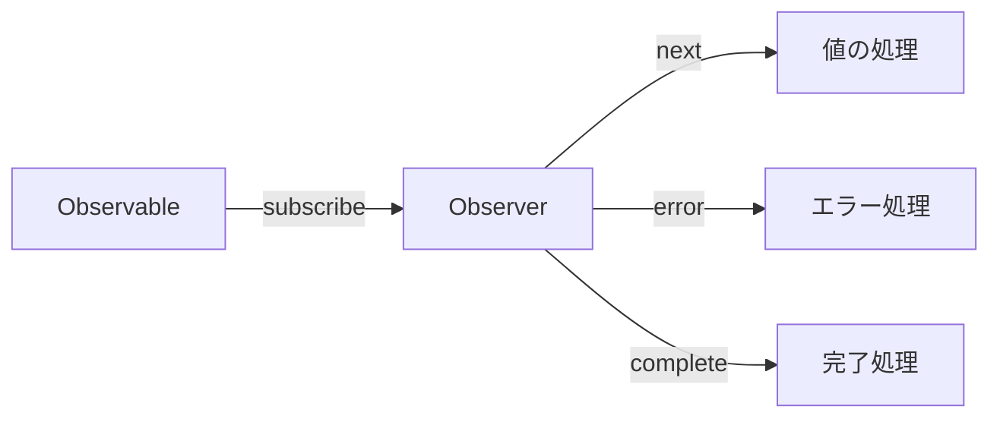

# CLAUDE.md

This file provides guidance to Claude Code (claude.ai/code) when working with code in this repository.

## Project Overview

This is a **multilingual educational documentation site** for learning RxJS with TypeScript, built with VitePress. It's a collaborative project between human engineers (@shuji-bonji) and AI (ChatGPT, Claude) aiming to be a model case for "human-AI co-created educational materials."

**Project Characteristics**:
- Educational material for TypeScript programmers learning RxJS
- Practical learning through code examples and tests
- Model case for human-AI co-created educational content
- VitePress-based static documentation site
- **Multilingual support**: Japanese (primary) and English

**Languages**:
- **Japanese (ja)**: Primary language at `/guide/` (root locale)
- **English (en)**: Secondary language at `/en/guide/`

**Key Technologies**:
- VitePress 1.6.3 (static site generator)
- TypeScript 5.x+
- Mermaid 11.6.0 (diagrams via vitepress-plugin-mermaid)
- markdown-it-footnote 4.0.0 (for footnotes)

**Developer Context**:
- Primary developer (@shuji-bonji) has experience with Angular, RxJS, TypeScript, and Jasmine testing
- Learning focus areas: WebSocket integration, PWA, Web Components

## Development Environment

**Requirements**:
- Node.js 20 or higher
- npm or yarn
- TypeScript 5.x or higher

**Dependency Management**:
```bash
# Check outdated dependencies
npm outdated

# Safe update
npm update

# Major version updates (use with caution)
npm install <package>@latest
```

## Development Commands

### Local Development
```bash
# Install dependencies
npm install

# Start dev server with hot reload
npm run docs:dev
# Starts VitePress dev server at http://localhost:5173
# Use this for live editing of documentation
```

### Building
```bash
npm run docs:build
# Builds the site for production
# Output: docs/.vitepress/dist/
```

### Preview Built Site
```bash
# Option 1: Preview with Vite server (recommended for pre-deploy checks)
npm run docs:preview

# Option 2: Serve static files (lightweight, faster, no hot reload)
npm run docs:serve
```

## Architecture

### Directory Structure

```
docs/
├── .vitepress/
│   ├── config/
│   │   ├── index.ts        # Main VitePress configuration
│   │   ├── ja.ts           # Japanese locale config
│   │   └── en.ts           # English locale config
│   ├── theme/
│   │   ├── index.ts        # Theme customization (uses default VitePress theme)
│   │   └── custom.css      # Custom styles
│   └── dist/               # Build output (generated)
├── index.md                # Homepage (Japanese)
├── guide/                  # Japanese documentation (root locale)
│   ├── introduction.md
│   ├── basics/             # RxJS fundamentals
│   ├── observables/        # Observable concepts
│   ├── subjects/           # Subject and multicasting
│   ├── operators/          # Operator categories (transformation, filtering, etc.)
│   ├── error-handling/     # Error handling strategies
│   ├── schedulers/         # Scheduler usage
│   ├── testing/            # Testing techniques
│   └── typescript-advanced/ # Advanced TypeScript integration
└── en/                     # English documentation
    ├── index.md            # Homepage (English)
    └── guide/              # Mirror structure of Japanese content
        ├── introduction.md
        ├── basics/
        ├── observables/
        └── ... (180 total files)
```

### Content Organization

Documentation follows a structured 14-chapter curriculum:

1. **RxJS入門** (Introduction) - Basics and streams
2. **Observableの基礎** (Observable Basics) - Observable fundamentals, lifecycle, cold/hot
3. **Creation Functions** - Observable creation and combination functions across 7 categories:
   - 基本作成系 (Basic creation): of, from, fromEvent, interval, timer
   - ループ生成系 (Loop generation): range, generate
   - HTTP通信系 (HTTP communication): ajax, fromFetch
   - 結合系 (Combination): concat, merge, combineLatest, zip, forkJoin
   - 選択・分割系 (Selection/Partition): race, partition
   - 条件分岐系 (Conditional): iif, defer
   - 制御系 (Control): scheduled, using
4. **オペレーターの理解** (Operators) - Pipeable operators categorized by type:
   - Transformation operators (map, mergeMap, switchMap, etc.)
   - Filtering operators (filter, debounceTime, throttleTime, etc.)
   - Combination operators (concatWith, mergeWith, withLatestFrom, etc.)
   - Utility operators (tap, delay, retry, etc.)
   - Conditional operators (iif, defer, etc.)
   - Multicasting operators (share, shareReplay, etc.)
5. **Subjectとマルチキャスト** (Subject & Multicasting) - Subject types and usage
6. **エラーハンドリング** (Error Handling) - Error strategies, retry, catchError
7. **スケジューラーの活用** (Schedulers) - Async control and scheduler types
8. **RxJSのデバッグ手法** (Debugging) - Debugging strategies, common scenarios, and tools
9. **テスト手法** (Testing) - Unit tests, TestScheduler, marble testing
10. **RxJSアンチパターン集** (Anti-patterns) - Common mistakes and solutions
11. **TypeScriptとRxJSの高度な連携** (Advanced TypeScript Integration) - Placeholder
12. **実践パターン** (Practical Patterns) - Placeholder
13. **パフォーマンス最適化** (Performance Optimization) - Placeholder
14. **フレームワークとの統合** (Framework Integration) - Placeholder

Each operator/concept page typically includes practical use cases in a `practical-use-cases.md` file.

### Configuration Details

**VitePress Config** (modular structure in `docs/.vitepress/config/`):

**`config/index.ts`** (Main configuration):
- Uses `withMermaid()` wrapper for Mermaid diagram support
- Base path: `/RxJS-with-TypeScript/` (GitHub Pages deployment)
- Multi-language support with `locales` configuration:
  - Root locale: Japanese (ja) at `/`
  - English locale (en) at `/en/`
- Root-level `themeConfig.search` with locale-specific translations
- Configured with Open Graph and Twitter Card metadata
- Footer: CC-BY-4.0 license, Copyright 2025 shuji-bonji

**`config/ja.ts`** (Japanese locale):
- Japanese sidebar structure mirroring the curriculum
- Japanese nav links and labels
- SEO metadata with hreflang tags

**`config/en.ts`** (English locale):
- English sidebar structure (mirror of Japanese)
- English nav links and labels
- SEO metadata with hreflang tags

**Theme**: Uses default VitePress theme with minimal customization in `theme/index.ts` and `custom.css`.

**Markdown Extensions**:
- Footnotes via markdown-it-footnote
- Mermaid diagrams via vitepress-plugin-mermaid

## Deployment

Automated via GitHub Actions (`.github/workflows/deploy.yml`):
- Triggers on push to `main` branch or manual workflow dispatch
- Builds site with `npm run docs:build`
- Deploys to GitHub Pages using peaceiris/actions-gh-pages@v4
- Published to:
  - Japanese: https://shuji-bonji.github.io/RxJS-with-TypeScript/
  - English: https://shuji-bonji.github.io/RxJS-with-TypeScript/en/

## Content Guidelines

### 1. TypeScript-First Approach

**All code examples must be written in TypeScript**:
- Clearly specify type definitions, emphasize type safety
- Provide practical examples using generics and type inference
- Minimize use of `any` - maintain type safety

Example of good TypeScript code:
```typescript
import { Observable, map, filter } from 'rxjs';

interface User {
  id: number;
  name: string;
  email: string;
  isActive: boolean;
}

const users$: Observable<User[]> = getUsersFromAPI();

const activeUsers$ = users$.pipe(
  map(users => users.filter(user => user.isActive)),
  // Use type inference, add type annotations when necessary
  filter((users): users is User[] => users.length > 0)
);
```

### 2. RxJS Version and Latest Developments

**Current RxJS Status (as of October 2025)**:
- **Stable**: RxJS 7.8.2 (released February 2025)
- **In Development**: RxJS v8 (master branch)
- **Important Changes**:
  - Enhanced TypeScript support
  - Optimized bundle size
  - Improved performance
  - More intuitive API

**Import Method** (RxJS 7.2+):
```typescript
// Recommended import method - all from 'rxjs'
import { Observable, of, from, map, filter, catchError } from 'rxjs';

// DEPRECATED (RxJS < 7.2):
// import { Observable, of, from } from 'rxjs';
// import { map, filter, catchError } from 'rxjs/operators';
```

### 3. Angular Integration Considerations

Developer (@shuji-bonji) has Angular experience:
- Include Angular-specific implementation examples where appropriate
- **Framework-agnostic content should be the foundation**
- Appropriately explain comparisons with Angular-specific features (Signals, etc.)
- Angular 19+ integrates Signals and RxJS, allowing interoperability

### 4. Content Structure

Each section should include:
1. **Overview** - Concise explanation of concepts
2. **Basic Usage** - Simple TypeScript code
3. **Practical Examples** - Real-world application examples
4. **Test Code** - Test examples using Jasmine (leveraging developer's experience)
5. **Notes and Best Practices**
6. **Memory Leak Prevention** (where applicable)

### 5. Operator Guidelines

Pay special attention to these operator patterns:
- **Higher-order mapping operators** (mergeMap, switchMap, concatMap, exhaustMap) - usage differences
- **Backpressure control** (throttleTime, debounceTime)
- **Error handling patterns** (catchError, retry, retryWhen)

### 6. Writing Style

**Multi-language Documentation**:
- Primary content in Japanese (root locale at `/guide/`)
- English translations at `/en/guide/`
- Technical terms remain in English in both languages (Observable, Subject, etc.)
- Code examples use English comments in English documentation
- Code examples use appropriate mix of Japanese and English comments in Japanese documentation

**Japanese Documentation Style**:
- Technical terms remain in English (Observable, Subject, etc.)
- Explanations in clear Japanese
- Comments use appropriate mix of Japanese and English

**English Documentation Style**:
- Clear, accessible explanations for TypeScript developers
- Technical terms in English (Observable, Subject, etc.)
- All code comments in English
- Mermaid diagrams with English labels

**Visual Diagrams with Mermaid**:
Visualize complex concepts with diagrams. Example from Japanese documentation:


In English documentation, diagram text is translated to English.

### 7. Quality Assurance

**Code Verification**:
1. All code examples must be actually tested
2. TypeScript compiler type checking
3. Provide test code wherever possible

**Performance Considerations**:
- Explicitly show patterns to prevent memory leaks
- Proper unsubscription methods
- Efficient operator selection

### 8. Documentation Enhancement Guidelines

**Purpose**: Improve readability and understanding by adding contextual explanations to all documentation pages (140+ pages planned).

**Completed Examples**:
- `docs/guide/anti-patterns/flag-management.md` - Demonstrates comprehensive explanation structure
- `docs/guide/overcoming-difficulties/index.md` - Shows how to enhance index pages

#### 8.1. Article Introduction

Every article should start with a clear introduction that:
- Explains **what the article covers** and **why it matters**
- Provides context for the reader's current situation
- Previews the main topics to be discussed

**Example**:
```markdown
# 状態管理フラグの乱立

RxJSを導入したプロジェクトでも、コンポーネント内に大量のbooleanフラグが乱立する問題がよく見られます。この記事では、17個ものフラグが存在する実際の事例を元に、その原因と改善方法を解説します。
```

#### 8.2. Section Headings

Each major section (##) should include a 1-2 sentence explanation of:
- **What** the section discusses
- **Why** it's important
- **How** it relates to the overall topic

**Example**:
```markdown
## なぜフラグが乱立するのか

フラグが乱立する背景には、技術的な問題だけでなく、開発者の思考パターンや組織の進化過程が関係しています。以下、5つの主要な原因を分析します。
```

#### 8.3. Code Block Context

**Before Code Blocks**:
- Explain what the code demonstrates
- Highlight the key point readers should notice
- Provide context for when this pattern applies

**After Code Blocks**:
- Use VitePress callouts (`> [!TIP]`, `> [!WARNING]`, `> [!IMPORTANT]`) for key points
- Summarize the main takeaway
- List concrete benefits or problems

**Example**:
```markdown
以下の例で、問題のあるフラグと適切なフラグの違いを比較します。

[CODE BLOCK]

> [!WARNING] 問題点
> - 状態が「宣言的」でなく「手続き的」
> - 状態変更のタイミングが散在
> - フラグ間の整合性を開発者が手動保証
```

#### 8.4. Transition Sentences

Connect sections smoothly with transition sentences:
- Between major sections: Explain how topics relate
- Before lists/tables: State what the list contains and how to use it
- Before diagrams: Explain what the diagram illustrates

**Example**:
```markdown
### 改善戦略

フラグ乱立問題を解決するには、以下の3ステップで段階的にリファクタリングを進めます。

### Step 1: 状態の棚卸し

まず、現在のフラグをすべて列挙し、責務ごとに分類します。これにより、どのフラグが統合可能かが見えてきます。
```

#### 8.5. Practical Examples

When showing Before/After comparisons:
- **Before**: Explain the problem concretely
- **After**: Highlight what improved and why
- **Comparison**: Use tables or side-by-side format when helpful

#### 8.6. Conclusion Sections

Every article should end with:
1. **Summary** - Key points recap
2. **Important Principles** - Core takeaways (using callouts)
3. **Related Sections** - Links with brief descriptions
4. **References** - External resources with context

**Example**:
```markdown
## 参考リソース

RxJSの公式ドキュメントや学習リソースで、さらに深く学習できます。

- [RxJS公式ドキュメント](https://rxjs.dev/) - 公式のAPIリファレンスとガイド
- [Learn RxJS](https://www.learnrxjs.io/) - オペレーター別の実践的な例
- [RxJS Marbles](https://rxmarbles.com/) - ビジュアルでオペレーターの動作を理解
```

#### 8.7. Enhancement Checklist

When enhancing any documentation page, verify:
- [ ] Article has clear introduction (what, why, how)
- [ ] Each section has contextual explanation
- [ ] Code blocks have before/after context
- [ ] VitePress callouts used for key points (`> [!TIP]`, `> [!WARNING]`, etc.)
- [ ] Transitions between sections are smooth
- [ ] Tables/lists have introductory sentences
- [ ] Diagrams have explanatory text
- [ ] Conclusion summarizes key points
- [ ] Related links include descriptions
- [ ] Language is accessible to target audience (TypeScript developers learning RxJS)

#### 8.8. Implementation Process

For each page:
1. **Read through** - Understand the existing content
2. **Identify gaps** - Note sections lacking context
3. **Add introductions** - Start with article and section intros
4. **Contextualize code** - Add before/after explanations
5. **Enhance transitions** - Connect sections smoothly
6. **Verify build** - Run `npm run docs:build` to test
7. **Review readability** - Ensure natural flow

**Progress Tracking** (as of 2025-10-20):
- ✅ `docs/guide/anti-patterns/flag-management.md` - Complete
- ✅ `docs/guide/overcoming-difficulties/index.md` - Complete
- 🔲 Remaining: ~140 pages to enhance

#### 8.9. Writing Tips

- **Use concrete examples** - "17個のフラグ" is better than "たくさんのフラグ"
- **Explain the "why"** - Don't just show code, explain reasoning
- **Progressive disclosure** - Start simple, then add complexity
- **Reader empathy** - Anticipate confusion points
- **Consistent terminology** - Use the same terms throughout

### 9. General Guidelines

When editing documentation:
- **Multi-language content**: Maintain both Japanese (root locale) and English (`/en/`) versions
- When editing Japanese content, consider updating English translation if changes are substantial
- When adding new content, create both Japanese and English versions
- Maintain the established curriculum structure across both languages
- Each operator/concept page should include code examples with TypeScript
- Use Mermaid diagrams where helpful for visualizing streams (translate diagram text for English version)
- Include practical use cases for each operator category
- Follow the collaborative human-AI creation approach
- Respect the CC-BY-4.0 license for content
- Reference official RxJS and TypeScript documentation (both Apache 2.0 licensed)

## Content Priorities and TODO

### High Priority
1. **RxJS v8 Preparation**
   - Research and document new features
   - Create migration guide
2. **Add Practical Use Cases**
   - WebSocket integration (developer's learning focus)
   - PWA application examples
   - Web Components integration
3. **Expand Testing Section**
   - Concrete examples using Jasmine
   - Detailed marble testing explanation

### Medium Priority
1. Add interactive code examples
2. Expand performance optimization section
3. Common mistakes and their solutions

### Low Priority
1. Consider video tutorials
2. Add practice exercises
3. Community contribution guidelines

---

## Completed Releases

### ✅ Third Release: New Chapters (Completed)

The following new chapters have been added or are planned for future releases.

#### ✅ Chapter 3: Creation Functions (Added in restructuring)

**Purpose:**
- Clearly separate creation functions from pipeable operators
- Teach Observable creation and combination before manipulation
- Explain the relationship between creation functions (concat, merge) and pipeable operators (concatWith, mergeWith)

**Placement:** After Observable basics, before Pipeable Operators
- Natural progression: Basic creation (of, from) → **Advanced creation/combination** → Manipulation (operators) → Sharing (Subject)

**Structure:**
```
3. Creation Functions
├── Creation Functions とは
│   ├── Pipeable Operator との違い
│   └── 使い分けの基準
├── 基本的な Creation Functions（2章の復習）
│   └── of, from, interval, timer
├── 結合系 Creation Functions
│   ├── concat - 順次結合
│   ├── merge - 並行結合
│   ├── combineLatest - 最新値の組み合わせ
│   ├── zip - 対応する値のペア化
│   ├── race - 最速のストリームを採用
│   ├── forkJoin - すべての完了を待つ
│   └── partition - 条件で分割
└── Pipeable Operator との対応関係
```

#### ✅ Chapter 8: RxJSのデバッグ手法 (Structure created, content TBD)

**Why Critical:**
- RxJS debugging is one of the most challenging aspects for learners
- Essential skill for real-world development
- Complements existing testing and anti-patterns chapters

**Proposed Structure:**
```
8. RxJSのデバッグ手法
├── デバッグの基本戦略
│   ├── tap オペレーターでのログ出力
│   ├── 開発者ツールでの確認
│   └── RxJS DevTools の活用
├── よくあるデバッグシナリオ
│   ├── 値が流れてこない
│   ├── 期待と異なる値が出力される
│   ├── 購読が完了しない（無限ストリーム）
│   ├── メモリリーク（購読解除忘れ）
│   └── エラーが発生しているのに気づかない
├── デバッグツール
│   ├── rxjs-spy の使い方
│   ├── RxJS DevTools（ブラウザ拡張）
│   └── カスタムデバッグオペレーターの作成
└── パフォーマンスデバッグ
    ├── 購読数の確認
    ├── 不要な再評価の検出
    └── メモリ使用量の監視
```

**Placement:** Between Chapter 7 (Schedulers) and Chapter 9 (Testing)
- Natural progression: Implementation → Error Handling → Schedulers → **Debugging** → Testing → Anti-patterns

#### ✅ Chapter 11: RxJS困難点克服 (Completed)

**Purpose:**
- Address common difficulties that experienced developers face when working with RxJS
- Provide actionable guidance to overcome RxJS-specific conceptual and practical barriers
- Bridge the gap between theory (Chapters 1-10) and practice (Chapter 13)

**Structure:**
```
11. RxJS困難点克服
├── index.md                        # なぜRxJSは難しいのか（経験者でも）
├── conceptual-understanding.md     # 概念理解の壁
├── lifecycle-management.md         # ライフサイクル管理の壁
├── operator-selection.md           # オペレーター選択の迷い
├── timing-and-order.md             # タイミングと順序の理解
├── state-and-sharing.md            # 状態管理の難しさ
├── stream-combination.md           # 複数ストリーム組み合わせ
└── debugging-guide.md              # デバッグの壁
```

**Implementation Status:** ✅ All 7 pages completed (Q1 2025)

#### ✅ Chapter 3: Creation Functions - Full Expansion (Completed Q4 2025)

**Purpose:**
- Provide comprehensive, dedicated pages for all major Creation Functions
- Move detailed explanations from Chapter 2 to Chapter 3 where they belong
- Maintain Chapter 2 as a quick reference with links to Chapter 3 detailed pages
- Complete the Creation Functions documentation with consistent depth across all functions

**Final Status:**
- Chapter 3 has been fully expanded to include **7 categories** with comprehensive documentation
- Total of **28 pages** created (1 main index + 7 category indices + 20 detailed function pages)
- Chapter 2 (Observableの作成方法) now serves as quick reference with cross-links to Chapter 3 detailed pages
- All Creation Functions now have consistent documentation depth

**Completed Structure:**

```
3. Creation Functions (COMPLETED)
├── index.md (main index with comprehensive table)
├── 基本作成系 (6 pages)
│   ├── index.md
│   ├── of.md - 指定した値を順番に発行
│   ├── from.md - 配列、Promise等から変換
│   ├── fromEvent.md - イベントをObservableに変換
│   ├── interval.md - 指定間隔で連続発行
│   └── timer.md - 遅延後に発行開始
├── ループ生成系 (3 pages)
│   ├── index.md
│   ├── range.md - 数値の範囲を生成
│   └── generate.md - ループ的な生成（for文のような動作）
├── HTTP通信系 (3 pages) - Renamed from "変換系"
│   ├── index.md
│   ├── ajax.md - Ajax/HTTPリクエスト
│   └── fromFetch.md - Fetch APIのラッパー
├── 結合系 (6 pages) - Previously existing
│   ├── index.md
│   ├── concat.md, merge.md, combineLatest.md
│   ├── zip.md, forkJoin.md
├── 選択・分割系 (3 pages) - Previously existing
│   ├── index.md
│   ├── race.md, partition.md
├── 条件分岐系 (3 pages) - Previously existing
│   ├── index.md
│   ├── iif.md, defer.md
└── 制御系 (3 pages)
    ├── index.md
    ├── scheduled.md - スケジューラーを指定してObservableを生成
    └── using.md - リソース制御付きObservable
```

**Total Pages Created:** 28 pages across 7 categories

**Key Implementation Decisions:**

1. **Category Renaming:**
   - "変換系" renamed to "HTTP通信系" for accuracy
   - Reason: ajax/fromFetch are HTTP-specific, not general conversion functions

2. **Function Placement:**
   - `bindCallback` and `bindNodeCallback` kept in Chapter 2 only
   - Reason: Not classified as Creation operators in Learn RxJS documentation
   - Chapter 2 provides detailed coverage, avoiding duplication

3. **Cross-Referencing:**
   - Chapter 2 (creation.md) updated with cross-links to all Chapter 3 detailed pages
   - Chapter 2 maintained as quick reference guide
   - All functions accessible from both chapters

4. **Documentation Consistency:**
   - All pages follow Section 8 documentation enhancement guidelines
   - Each page includes: introduction, TypeScript examples, practical use cases, marble diagrams
   - Emoji removed from level 1-3 headings for consistency
   - Main index page uses comprehensive table format with clickable links

5. **Navigation Updates:**
   - `docs/.vitepress/config.ts` sidebar fully updated
   - `docs/guide/index.md` updated with all 7 categories
   - Dead links fixed (error-handling, schedulers pages)

**Completed Implementation Steps:**

- ✅ Created directory structure (basic, loop, http-communication, control)
- ✅ Created 7 category index pages with overviews and comparison tables
- ✅ Created 20 detailed function pages with comprehensive examples
- ✅ Updated Chapter 2 with cross-links to Chapter 3
- ✅ Updated main Creation Functions index with table format
- ✅ Updated navigation (config.ts, guide/index.md)
- ✅ Removed emoji from level 1-3 headings across all pages
- ✅ Fixed dead links and verified build
- ✅ Updated terminology (removed "新しい" from Creation Functions description)

**Impact:**
- Complete Creation Functions documentation with 7 categories
- Improved learning experience with dedicated, comprehensive pages
- Clear separation between quick reference (Chapter 2) and detailed guides (Chapter 3)
- Consistent documentation style across all 28 pages

---

## Completed Releases

### ✅ Fourth Release: Multi-language Support (Completed January 2025)

**Purpose:**
- Add English translation to make content accessible to international audience
- Maintain Japanese as primary language with English as secondary
- Establish scalable translation workflow for potential future languages

**Status:** ✅ **COMPLETED** - All 180 pages fully translated and deployed

**Implementation Summary:**

**Directory Structure:**
```
docs/
├── .vitepress/
│   ├── config/
│   │   ├── index.ts        # Main configuration with root-level search
│   │   ├── ja.ts           # Japanese locale config
│   │   └── en.ts           # English locale config
├── guide/                   # Japanese content (root locale)
│   ├── introduction.md
│   ├── observables/
│   └── ... (180 files)
├── en/                      # English content
│   ├── guide/
│   │   ├── introduction.md
│   │   ├── observables/
│   │   └── ... (180 files)
├── public/
└── index.md
```

**Completed Implementation:**

**Phase 0: Investigation & Design** ✅
- ✅ Base path handling (`/RxJS-with-TypeScript/` + i18n) verified
- ✅ VitePress native i18n support implemented
- ✅ DeepL MCP Server API workflow established
- ✅ SEO requirements evaluated (hreflang tags, meta descriptions)
- ✅ VitePress local search selected (built-in multi-language support)
- ✅ Language switcher using VitePress native UI

**Phase 1: Foundation Setup** ✅
- ✅ Directory structure created (`docs/.vitepress/config/`, `docs/en/guide/`)
- ✅ config.ts split into modular structure (index.ts, ja.ts, en.ts)
- ✅ VitePress locales configured with base path
- ✅ Local search setup with multi-language support (root themeConfig)
- ✅ hreflang tags added for SEO
- ✅ Build verified and routing tested

**Phase 2-5: Complete Translation** ✅
- ✅ All 180 markdown files translated using DeepL MCP Server API
- ✅ Code comments and console.log messages translated
- ✅ Mermaid diagrams translated (all text elements)
- ✅ Internal links updated (`/guide/` → `/en/guide/`)
- ✅ URL anchors translated to English
- ✅ Meta descriptions optimized (150-160 chars per Bing Webmaster Tools)
- ✅ All sections completed:
  - Introduction, Basics, Observables
  - Creation Functions (7 categories, 28 pages)
  - Operators (Transformation, Filtering, Combination, Utility, etc.)
  - Subjects and Multicasting
  - Error Handling
  - Schedulers
  - Debugging Techniques
  - Testing Methods
  - Anti-patterns
  - Overcoming Difficulties
  - Appendix (Reactive Architecture, Ecosystem, etc.)

**Technical Implementation:**

1. **Translation Workflow**
   - Used DeepL MCP Server API (`targetLangCode: "en-US"`)
   - Systematic section-by-section translation (100-200 lines)
   - Verification with grep for Japanese characters
   - Final check: Zero Japanese characters in English files

2. **Search Configuration**
   - Root-level themeConfig with locale-specific translations
   - Fixed search button rendering issue
   - Both Japanese and English search fully functional

3. **SEO Optimization**
   - hreflang tags configured in ja.ts and en.ts
   - All meta descriptions 150-160 characters
   - Proper frontmatter with quoted descriptions containing colons

4. **Quality Assurance**
   - All builds successful without errors
   - Internal links verified
   - Mermaid diagrams render correctly
   - Language switcher navigates properly

**Success Metrics Achieved:**
- ✅ English pages build without errors
- ✅ All internal links work correctly
- ✅ Search works in both languages
- ✅ Language switcher navigates correctly
- ✅ SEO tags properly configured
- ✅ Mermaid diagrams render in both languages
- ✅ Zero Japanese characters remaining in English version

**Translation Statistics:**
- **Total files translated:** 180 markdown files
- **Total content:** ~50,000+ lines of documentation
- **Translation method:** DeepL MCP Server API
- **Code examples:** All TypeScript code comments translated
- **Diagrams:** All Mermaid diagrams translated
- **Meta descriptions:** 20 files optimized for SEO

**Deployment:**
- Japanese site: https://shuji-bonji.github.io/RxJS-with-TypeScript/
- English site: https://shuji-bonji.github.io/RxJS-with-TypeScript/en/

---

## Active Development

---

#### 🔄 Medium Priority: Chapter 15 Enhancement - フレームワークとの統合

**Phased Approach:**

**Phase 1: Basic Framework Integration (15.1)**
- Quick start guides for each framework (5-10 min read)
- Focus on basic RxJS usage patterns
- Heavy use of external documentation links
- Frameworks: Angular, React, Vue, Svelte

**Phase 2: State Management Integration (15.2)** ⭐ Main Enhancement
```
14.2 状態管理との統合
├── RxJS + NgRX (Angular)
│   ├── 基本的なパターン
│   ├── Effects と Observables
│   └── 実践例：非同期処理の管理
├── RxJS + Signals (Angular 19+)
│   ├── Signals と RxJS の相互運用
│   ├── toSignal / toObservable
│   └── 実践例：リアクティブフォーム
├── RxJS + Runes (Svelte 5)
│   ├── $state と Observable の連携
│   ├── $derived と RxJS パイプライン
│   └── 実践例：リアルタイムデータ
└── RxJS + 他の状態管理
    ├── Redux Toolkit
    ├── Zustand
    └── Jotai
```

**Phase 3: Web API Integration (15.3)**
- WebSocket (developer's focus area)
- Server-Sent Events
- IndexedDB

**Implementation Strategy:**
1. Start with NgRX + RxJS (leverage developer's Angular experience)
2. Keep each topic at "introduction" level
3. Provide rich external documentation links
4. Add based on user feedback

**Considerations:**
- ⚠️ Maintain framework-agnostic foundation
- ⚠️ Avoid scope creep (don't become a state management tutorial)
- ⚠️ Maintenance overhead for framework updates
- ✅ Provides unique value vs other RxJS resources
- ✅ Reflects 2024-2025 trends (Signals, Runes)

**Priority-term**: Chapter 14.1 基本的なフレームワーク連携
2. **Medium-term**: Chapter 14.2 状態管理との統合 (starting with NgRX)

--- Order:**
1. **Short

#### 🔴 High Priority: Chapter 13 - 実践パターン集 (Planned)

**Purpose:**
- Provide real-world implementation patterns for common use cases
- Show how to apply RxJS knowledge in practical scenarios
- Address the gap between "knowing operators" and "building features"

**Structure:**
```
13. 実践パターン集
├── index.md                        # 実践パターンの概要
│   ├── パターン一覧
│   ├── 使い方ガイド
│   └── 実装時の考え方
├── ui-events.md                    # UIイベント処理パターン
│   ├── クリックイベントの制御（throttle, debounce, distinct）
│   ├── ドラッグ&ドロップ
│   ├── スクロールイベント処理
│   ├── キーボード入力（オートコンプリート）
│   └── マルチタッチ対応
├── api-calls.md                    # API呼び出しパターン
│   ├── 基本的なGET/POST
│   ├── 並列リクエスト（forkJoin）
│   ├── 直列リクエスト（concatMap）
│   ├── 依存関係のあるリクエスト（switchMap）
│   ├── リトライとエラーハンドリング
│   ├── タイムアウト処理
│   └── キャンセル処理（takeUntil）
├── form-handling.md                # フォーム処理パターン
│   ├── リアルタイムバリデーション
│   ├── 自動保存（debounce + distinctUntilChanged）
│   ├── 複数フィールドの組み合わせ（combineLatest）
│   ├── 条件付きフィールド表示
│   ├── サブミット処理（exhaustMap で二重送信防止）
│   └── エラー表示とリセット
├── real-time-data.md               # リアルタイムデータ処理
│   ├── WebSocket 統合
│   ├── Server-Sent Events (SSE)
│   ├── Polling パターン
│   ├── 接続管理とリトライ
│   ├── データのマージと更新
│   └── 通知システム
├── caching-strategies.md           # キャッシュ戦略
│   ├── shareReplay でのキャッシュ
│   ├── 手動リフレッシュパターン
│   ├── TTL（有効期限）付きキャッシュ
│   ├── キャッシュ無効化戦略
│   ├── ローカルストレージ連携
│   └── オフライン対応
├── error-handling-patterns.md      # エラーハンドリング実践パターン
│   ├── API呼び出しでのエラーハンドリング
│   ├── ユーザー通知とフォールバック戦略
│   ├── リトライ戦略（指数バックオフ）
│   ├── グローバルエラーハンドリング
│   ├── エラー境界の設計
│   └── ログとモニタリング
├── subscribe-branching.md          # subscribe内の条件分岐パターン
│   ├── 問題：subscribe内で複雑な条件分岐
│   ├── パターン1: パイプラインでの分岐（filter + tap）
│   ├── パターン2: partition による分岐
│   ├── パターン3: switchMap + iif による動的分岐
│   ├── パターン4: 関数化 + map による変換（推奨）
│   ├── 実践例：APIレスポンス処理
│   └── 選択のガイドライン
└── advanced-form-patterns.md       # JSON Patchを使った高度なフォームパターン
    ├── 大規模フォームの自動保存とUndo/Redo
    │   ├── JSON Patch/Pointer の基礎 (RFC 6902/6901)
    │   ├── 差分検出とパッチ生成（pairwise + fast-json-patch）
    │   ├── 自動保存（バッチング + 順序保証 with concatMap）
    │   ├── 楽観的UI更新（scan による即時反映）
    │   ├── Undo/Redo実装（逆パッチによる履歴管理）
    │   ├── オフライン対応（IndexedDB キュー）
    │   └── パフォーマンス最適化（パッチ圧縮、分割送信）
    └── 共同編集のリアルタイム同期
        ├── Operational Transform (OT) / CRDT の基礎
        ├── WebSocket + RxJS統合（双方向通信）
        ├── バージョン管理（Vector Clock / Lamport Timestamp）
        ├── プレゼンス管理（カーソル位置、アクティブユーザー）
        ├── 競合解決の実践（OT変換、送信バッファ管理）
        ├── ライブラリ選択（ShareDB vs Yjs）
        └── エラーハンドリング（再接続、状態同期）
```

**Content Characteristics:**
- 実務で即座に使えるコード例
- Before/After での比較
- パフォーマンスとメモリ考慮
- テストコード付き
- TypeScript での型安全性
- 標準技術優先（RFC準拠、W3C標準）
- **実行可能なコード例**（HTML準備不要、そのまま動作）

**Executable Code Examples (Chapter 13 Required):**

All code examples in Chapter 13 must be **immediately executable** without requiring pre-existing HTML markup. This allows learners to:
- Copy/paste code and see it work instantly
- Run examples in browser console or CodeSandbox/StackBlitz
- Focus on RxJS patterns without HTML setup overhead

**Guidelines:**

1. **Create DOM elements dynamically** instead of querying existing elements
2. **Append elements to document.body** to make them visible
3. **Comment out querySelector** to show the traditional approach (educational)
4. **Include cleanup code** where appropriate (removeEventListener, element removal)

**Example Pattern:**

```typescript
// ❌ Bad: Requires pre-existing HTML
const button = document.querySelector<HTMLButtonElement>('#submit-button');
if (button) {
  fromEvent(button, 'click').pipe(
    throttleTime(1000)
  ).subscribe(() => {
    console.log('送信処理実行');
  });
}

// ✅ Good: Creates element dynamically (immediately executable)
import { fromEvent, throttleTime } from 'rxjs';

// Traditional approach (commented for reference)
// const button = document.querySelector<HTMLButtonElement>('#submit-button');

// Self-contained: creates button dynamically
const button = document.createElement('button');
button.id = 'submit-button';
button.innerText = 'Submit';
button.style.padding = '10px 20px';
button.style.margin = '10px';
document.body.appendChild(button);

fromEvent(button, 'click').pipe(
  throttleTime(1000) // 1秒間に1回のみ処理
).subscribe(() => {
  console.log('送信処理実行');
  submitForm();
});

function submitForm(): void {
  console.log('フォーム送信中...');
  // API呼び出し等
}

// Optional: Cleanup example
// button.remove(); // or document.body.removeChild(button);
```

**When to Apply:**

- ✅ **Required**: All Chapter 13 examples (ui-events, form-handling, etc.)
- ✅ **Required**: Examples meant for CodeSandbox/StackBlitz embedding
- ✅ **Recommended**: Any code example demonstrating DOM interactions
- ⚠️ **Optional**: Simple operator examples without DOM (map, filter, etc.)

**Additional DOM Element Examples:**

```typescript
// Input field
const input = document.createElement('input');
input.type = 'text';
input.placeholder = 'Enter text...';
input.style.padding = '8px';
input.style.margin = '10px';
document.body.appendChild(input);

// Div for output
const output = document.createElement('div');
output.id = 'output';
output.style.padding = '10px';
output.style.border = '1px solid #ccc';
output.style.margin = '10px';
document.body.appendChild(output);

// Form
const form = document.createElement('form');
form.innerHTML = `
  <input type="text" name="username" placeholder="Username" />
  <input type="email" name="email" placeholder="Email" />
  <button type="submit">Submit</button>
`;
form.style.padding = '10px';
document.body.appendChild(form);
```

**Style Guidelines:**

1. **Add basic styling** to make elements visible and usable
   - padding, margin for buttons/inputs
   - border for containers
   - Don't overdo styling (focus on RxJS, not CSS)

2. **Use semantic element names**
   - `submitButton`, `emailInput`, `resultDiv`

3. **Include element cleanup** for long-running examples
   ```typescript
   // At the end of examples with subscriptions
   subscription.add(() => {
     button.remove(); // Clean up DOM
   });
   ```

4. **Show traditional approach** in comments
   - Helps learners understand real-world usage
   - Shows migration path from static HTML

**Benefits:**

- ✅ Zero HTML setup required
- ✅ Works in browser console immediately
- ✅ Perfect for CodeSandbox/StackBlitz embedding
- ✅ Easy to copy/paste and experiment
- ✅ Focus stays on RxJS patterns, not HTML boilerplate

**Integration with Existing Content:**
- Chapter 6（エラーハンドリング）の基礎を実践で応用
- Chapter 10（アンチパターン）で学んだことを避けるパターン
- Chapter 11（学習の壁）で克服した知識を実践

**Implementation Strategy:**
1. **Phase 1**: Core patterns (ui-events, api-calls, form-handling)
2. **Phase 2**: Advanced patterns (real-time-data, caching-strategies)
3. **Phase 3**: Specialized patterns (error-handling, subscribe-branching)
4. **Phase 4**: JSON Patch patterns (advanced-form-patterns) - 詳細は下記参照

**Developer Focus Areas:**
- WebSocket integration (developer's learning focus) → `real-time-data.md`
- PWA application examples → `caching-strategies.md`
- Web Components integration → `ui-events.md`

**Timeline:**
- **Q2-Q3 2025**: Chapter 13 implementation (Phase 1-3: 7 pages)
- **Q3-Q4 2025**: Phase 4 implementation (advanced-form-patterns.md)
- **Q4 2025**: Integration and cross-referencing

### Supporting Infrastructure: JSON Patch Examples Repository

**Purpose:**
Provide executable code examples for JSON Patch patterns since no public APIs support JSON Patch operations.

**Problem:**
- No public testing APIs (like JSONPlaceholder) support JSON Patch (RFC 6902)
- Learners need hands-on environment to understand JSON Patch + RxJS patterns
- Server-side implementation is required for complete demonstrations

**Solution: Multi-Phase Approach**

#### Phase 1: Embedded Demos (Immediate - Priority 1)

**Goal:** Enable learners to try patterns instantly without setup

**Approach:**
- Create StackBlitz/CodeSandbox projects with MSW (Mock Service Worker)
- Embed interactive demos directly in documentation pages
- Use browser-based mocking (no server required)

**Stack:**
```json
{
  "frontend": {
    "rxjs": "^7.8.2",
    "fast-json-patch": "^3.1.1",
    "msw": "^2.0.0",
    "vite": "^5.0.0",
    "typescript": "^5.3.0"
  }
}
```

**Deliverables:**
1. Large Form Autosave Demo (StackBlitz)
   - JSON Patch generation with `pairwise()` + `fast-json-patch`
   - Auto-save with `bufferTime()` + `concatMap()`
   - Undo/Redo with inverse patches
   - MSW handlers for `/api/forms/:id/patches`

2. Collaborative Editing Demo (StackBlitz)
   - Yjs integration (uses public Yjs WebSocket server)
   - Real-time sync demonstration
   - Presence management (cursor positions)

**Documentation Integration:**
```markdown
## 実際に試してみる

<iframe src="https://stackblitz.com/edit/rxjs-json-patch-autosave?embed=1&file=src/main.ts"
  style="width:100%; height:500px; border:0; border-radius: 4px; overflow:hidden;"
></iframe>

[新しいタブで開く →](https://stackblitz.com/edit/rxjs-json-patch-autosave)
```

**Estimated Effort:** 2-3 hours per demo × 2 demos = 4-6 hours

---

#### Phase 2: Starter Kit Repository (Short-term - Priority 2)

**Goal:** Provide comprehensive, runnable codebase with frontend and backend

**Repository:** `https://github.com/shuji-bonji/rxjs-json-patch-examples`

**Structure:**
```
rxjs-json-patch-examples/
├── README.md
├── package.json (workspaces root)
├── docker-compose.yml
│
├── examples/
│   ├── 01-basic-patch/              # JSON Patch基礎
│   │   ├── frontend/
│   │   ├── backend/ (optional)
│   │   └── README.md
│   │
│   ├── 02-large-form-autosave/      # 大規模フォーム
│   │   ├── frontend/
│   │   │   ├── src/
│   │   │   │   ├── lib/
│   │   │   │   │   ├── patch-generator.ts
│   │   │   │   │   ├── auto-saver.ts
│   │   │   │   │   └── history-manager.ts
│   │   │   │   ├── mocks/handlers.ts (MSW)
│   │   │   │   └── main.ts
│   │   │   ├── package.json
│   │   │   └── vite.config.ts
│   │   │
│   │   ├── backend/
│   │   │   ├── src/
│   │   │   │   ├── server.ts (Express or Hono)
│   │   │   │   ├── routes/form.ts
│   │   │   │   └── services/patch.ts
│   │   │   └── package.json
│   │   │
│   │   └── README.md
│   │
│   ├── 03-collaborative-editing/    # 共同編集
│   │   ├── frontend/ (Yjs integration)
│   │   ├── backend/ (y-websocket server)
│   │   └── README.md
│   │
│   └── 04-offline-queue/            # オフライン対応
│       ├── frontend/ (IndexedDB)
│       └── README.md
│
├── shared/
│   └── types.ts (共通型定義)
│
└── docs/
    ├── GETTING_STARTED.md
    ├── MSW_SETUP.md
    └── DEPLOYMENT.md
```

**Technology Stack:**

Frontend (共通):
- RxJS 7.8.x
- TypeScript 5.x
- fast-json-patch 3.x
- MSW 2.x (mock mode)
- Vite 5.x

Backend (optional):
- Express 4.x or Hono (lightweight)
- ws 8.x (WebSocket)
- fast-json-patch 3.x
- better-sqlite3 9.x (lightweight DB)

**Startup Commands:**
```bash
# Clone and install all workspaces
git clone https://github.com/shuji-bonji/rxjs-json-patch-examples
cd rxjs-json-patch-examples
npm run install:all

# Run frontend only (MSW mock)
npm run dev:form
# → http://localhost:5173

# Run with backend (Docker)
npm run dev:with-backend
# → Frontend: http://localhost:5173
# → Backend: http://localhost:3000
```

**Design Principles (per discussion):**

Frontend Responsibilities:
- 操作（コマンド）の生成と整列
- 楽観的UI反映 (scan による即時適用)
- Undo/Redoスタック管理 (逆パッチによる履歴)
- 送信キュー管理 (concatMap で順序保証)
- バッチング (bufferTime + 圧縮)

Backend Responsibilities (API仕様として記載):
- バージョン管理 (Vector Clock / タイムスタンプ)
- 冪等性保証 (Request ID による重複検出)
- 競合解決とマージ (Last Write Wins or OT)
- 永続化と監査ログ

**Deliverables:**
1. 4 complete examples with frontend + backend
2. MSW handlers for mock mode
3. Docker Compose setup for easy backend startup
4. Comprehensive README with setup instructions
5. TypeScript types shared between frontend/backend

**Documentation Links:**
```markdown
## コード例を試す

### 方法1: ブラウザで即座に試す（推奨）
[StackBlitzで開く →](https://stackblitz.com/github/shuji-bonji/rxjs-json-patch-examples/tree/main/examples/02-large-form-autosave)

### 方法2: ローカルで試す
\`\`\`bash
git clone https://github.com/shuji-bonji/rxjs-json-patch-examples
cd examples/02-large-form-autosave
npm install
npm run dev
\`\`\`

### 方法3: バックエンド含めて試す
\`\`\`bash
docker-compose up
\`\`\`
```

**Estimated Effort:** 1-2 weeks (10-15 hours)

---

#### Phase 3: Public API (Optional - Long-term)

**Goal:** Deploy live backend API for documentation testing

**Not Priority** - Requires:
- Infrastructure setup (Vercel/Railway)
- Maintenance overhead
- Rate limiting / abuse prevention
- SSL certificates
- Monitoring

**Decision:** Phase 1 + Phase 2 provide sufficient learning environment. Phase 3 can be reconsidered based on user feedback.

---

### Implementation Tasks

**Prerequisites:**
- Chapter 13 Phase 1-3 pages completed
- `advanced-form-patterns.md` content drafted

**Phase 1 Tasks (Immediate - after Chapter 13 Phase 1-3):**
1. Create StackBlitz project: Large Form Autosave
   - Setup Vite + RxJS + fast-json-patch + MSW
   - Implement patch generation (pairwise)
   - Implement auto-save (bufferTime + concatMap)
   - Implement Undo/Redo (inverse patches)
   - Create MSW handlers
   - Test and verify
2. Create StackBlitz project: Collaborative Editing
   - Setup Vite + RxJS + Yjs
   - Connect to public Yjs WebSocket server
   - Implement presence management
   - Test and verify
3. Update `advanced-form-patterns.md` with embedded demos
4. Test embedded iframes in VitePress build

**Phase 2 Tasks (Short-term - 1-2 weeks after Phase 1):**
1. Setup repository structure
   - Create `rxjs-json-patch-examples` repo
   - Setup npm workspaces
   - Configure TypeScript projects
2. Implement Example 01: Basic Patch
   - Simple patch generation demo
   - Frontend only (MSW)
3. Implement Example 02: Large Form Autosave
   - Complete frontend implementation
   - Backend API (Express + SQLite)
   - Docker Compose setup
   - MSW handlers for mock mode
4. Implement Example 03: Collaborative Editing
   - Frontend with Yjs
   - Backend with y-websocket
   - Docker setup
5. Implement Example 04: Offline Queue
   - IndexedDB integration
   - Sync manager
6. Documentation
   - Main README with quick start
   - Individual example READMEs
   - Setup guides (MSW, Docker, deployment)
7. Cross-reference from main documentation
   - Update `advanced-form-patterns.md` with links
   - Add "実際に試す" sections

**Phase 3 Tasks (Optional - based on feedback):**
- Deploy backend to Vercel/Railway
- Setup monitoring and rate limiting
- Update documentation with live API endpoints

---

### Success Criteria

**Phase 1:**
- [ ] Learners can try JSON Patch patterns within 30 seconds (no setup)
- [ ] Embedded demos work in all major browsers
- [ ] StackBlitz projects can be forked and modified

**Phase 2:**
- [ ] Developers can clone and run locally in < 5 minutes
- [ ] All examples include both MSW mock and real backend
- [ ] Docker Compose starts full stack with single command
- [ ] TypeScript types are shared and type-safe
- [ ] Examples follow design principles (frontend/backend responsibilities)

**Phase 3 (if implemented):**
- [ ] Live API has 99% uptime
- [ ] Rate limiting prevents abuse
- [ ] Monitoring alerts on errors

---

### Dependencies and Risks

**Dependencies:**
- Chapter 13 Phase 1-3 content completion
- `advanced-form-patterns.md` content
- StackBlitz/CodeSandbox availability (free tier)

**Risks:**
- StackBlitz free tier limitations (project size, uptime)
- MSW breaking changes in future versions
- Yjs public server availability for demos

**Mitigation:**
- Provide multiple demo hosting options (StackBlitz + CodeSandbox)
- Pin MSW version in examples
- Include instructions for self-hosted Yjs server

---

## Future Enhancements

The following enhancements are planned for future releases to keep the documentation current with the latest RxJS developments and ecosystem trends.

#### 🔴 High Priority: RxJS v8 Full Migration

**Purpose:**
- Provide comprehensive migration guide from RxJS v7 to v8
- Document all breaking changes and new features
- Update all code examples to v8 best practices

**Structure:**
```
RxJS v8 Migration Guide
├── Breaking Changes Overview
│   ├── Removed operators and their replacements
│   ├── API signature changes
│   └── Import path updates
├── New Features and Improvements
│   ├── Performance enhancements
│   ├── Bundle size optimizations
│   └── New operator additions
├── Migration Strategy
│   ├── Step-by-step migration process
│   ├── Automated migration tools
│   └── Testing migration results
└── Updated Code Examples
    ├── Before/After comparisons
    └── Best practices for v8
```

**Implementation Tasks:**
1. Monitor RxJS v8 stable release
2. Review official migration guide
3. Update all existing documentation examples
4. Create dedicated migration guide page
5. Add version badges throughout documentation

**Timeline:** Upon RxJS v8 stable release

---

#### 🔴 High Priority: Observable と Signal の統合 (Deep Dive)

**Purpose:**
- Provide comprehensive guide on Observable-Signal interoperability
- Show practical patterns for modern reactive applications
- Cover both Angular Signals and framework-agnostic approaches

**Structure:**
```
Observable と Signal の統合
├── Angular Signals との統合 (詳細版)
│   ├── toSignal / toObservable の詳細
│   ├── Signal based Inputs と RxJS
│   ├── computedとObservableの組み合わせ
│   ├── effectとObservableの連携
│   └── 実践例：リアクティブフォームの最新パターン
├── 他のフレームワークのSignals
│   ├── Solid.js Signals
│   ├── Preact Signals
│   └── Vue 3 Composition API
├── Observable vs Signal の使い分け
│   ├── それぞれの強み・弱み
│   ├── パフォーマンス比較
│   └── 選択のガイドライン
└── 実践パターン集
    ├── フォーム処理
    ├── 状態管理
    └── 非同期データフロー
```

**Implementation Tasks:**
1. Expand Chapter 14.2 content significantly
2. Add standalone chapter option if content grows large
3. Include framework-agnostic Signal concepts
4. Provide migration patterns from pure RxJS to Signal-hybrid approaches
5. Add performance benchmarks and trade-off analysis

**Placement Options:**
- **Option 1**: Expand Chapter 14.2 (State Management Integration)
- **Option 2**: Create standalone Chapter 12.5 (Advanced TypeScript Integration subsection)

**Timeline:** Q2-Q3 2025

---

#### 🟡 Medium Priority: TestScheduler 活用ガイド (拡張)

**Purpose:**
- Expand Chapter 9 testing section with comprehensive TestScheduler guide
- Provide advanced marble testing techniques
- Show real-world testing scenarios

**Structure:**
```
TestScheduler 活用ガイド（拡張）
├── TestScheduler の基礎（復習）
│   ├── 基本的な使い方
│   └── Marble Diagram 記法
├── 高度な TestScheduler テクニック
│   ├── 複雑な時間制御のテスト
│   ├── Higher-order Observable のテスト
│   ├── エラーハンドリングのテスト
│   └── リトライ・タイムアウトのテスト
├── 実践的なテストパターン
│   ├── API呼び出しのテスト
│   ├── フォーム処理のテスト
│   ├── WebSocket 通信のテスト
│   └── キャッシュ戦略のテスト
├── デバッグとトラブルシューティング
│   ├── よくあるテストの失敗原因
│   ├── Marble Diagram のデバッグ方法
│   └── 非同期処理のデバッグ
└── CI/CD との統合
    ├── テスト環境のセットアップ
    ├── カバレッジ測定
    └── パフォーマンステスト
```

**Implementation Tasks:**
1. Expand existing Chapter 9 testing content
2. Add dedicated TestScheduler subsection (Chapter 9.3)
3. Provide downloadable test code examples
4. Include video tutorials for complex scenarios
5. Cross-reference with Chapter 13 practical patterns

**Placement:** Chapter 9.3 (new subsection within existing Testing chapter)

**Timeline:** Q3-Q4 2025

---

**Priority Summary:**
1. **RxJS v8 Full Migration** - Critical for staying current (wait for stable release)
2. **Observable と Signal の統合** - High demand, reflects 2025 ecosystem trends
3. **TestScheduler 活用ガイド** - Important for production quality, less urgent

**Dependencies:**
- **RxJS v8 Migration**: Depends on official v8 stable release
- **Observable-Signal integration**: Can start now with Angular 19+ examples
- **TestScheduler guide**: Can start anytime, complements existing content

## Reference Resources

- [RxJS Official Documentation](https://rxjs.dev)
- [RxJS GitHub](https://github.com/ReactiveX/rxjs)
- [TypeScript Official Documentation](https://www.typescriptlang.org)
- [Learn RxJS](https://www.learnrxjs.io/)
- [RxJS Marbles](https://rxmarbles.com/)

**Track Latest RxJS Information**:
1. Monitor official repository for release notes and breaking changes
2. Follow community trends - RxJS v8 new features, TypeScript integration
3. Update dependencies regularly (see Development Environment section)

## Important Notes

1. **Never sacrifice type safety** - Minimize use of `any`
2. **Thorough subscription management** - Proper use of unsubscribe or takeUntil
3. **Follow latest developments** - RxJS v8, TypeScript 5.x new features
4. **Be practical** - Emphasize real-world examples, not just theory
5. **Prevent memory leaks** - Always include proper cleanup patterns

## Collaboration Guidelines

**Working with AI Assistants**:
- Prioritize technical accuracy
- Provide practical, working code examples
- Reflect latest best practices
- Create content leveraging developer's experience (Angular, RxJS, TypeScript)

**Content Review Perspectives**:
1. **Technical Accuracy** - Compliant with specifications
2. **Practicality** - Usable in real work
3. **Clarity** - Understandable for beginners
4. **Currency** - Compliant with latest RxJS/TypeScript specifications
5. **Completeness** - Includes important notes like memory leak prevention

## License

Content: CC-BY-4.0 (Creative Commons Attribution 4.0 International)
