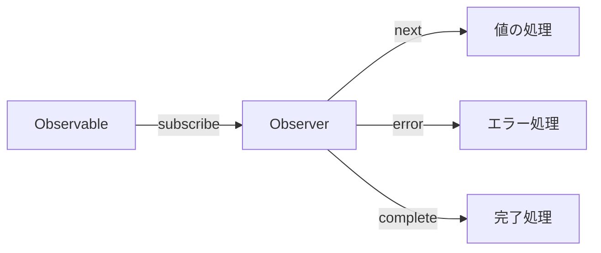

# CLAUDE.md

This file provides guidance to Claude Code (claude.ai/code) when working with code in this repository.

## Project Overview

This is a **multilingual educational documentation site** for learning RxJS with TypeScript, built with VitePress. It's a collaborative project between human engineers (@shuji-bonji) and AI (ChatGPT, Claude) aiming to be a model case for "human-AI co-created educational materials."

**Project Characteristics**:
- Educational material for TypeScript programmers learning RxJS
- Practical learning through code examples and tests
- Model case for human-AI co-created educational content
- VitePress-based static documentation site
- **Multilingual support**: 7 languages — Japanese (primary), English, French, German, Italian, Spanish, Dutch, Portuguese

**Languages**:
- **Japanese (ja)**: Primary language at `/guide/` (root locale)
- **English (en)**: `/en/guide/`
- **French (fr)**: `/fr/guide/`
- **German (de)**: `/de/guide/`
- **Italian (it)**: `/it/guide/`
- **Spanish (es)**: `/es/guide/`
- **Dutch (nl)**: `/nl/guide/`
- **Portuguese (pt)**: `/pt/guide/`

**Key Technologies**:
- VitePress 1.6.3 (static site generator)
- TypeScript 5.x+
- Mermaid 11.6.0 (diagrams via vitepress-plugin-mermaid)
- markdown-it-footnote 4.0.0 (for footnotes)

**Developer Context**:
- Primary developer (@shuji-bonji) has experience with Angular, RxJS, TypeScript, and Jasmine testing
- Learning focus areas: WebSocket integration, PWA, Web Components

## Development Environment

**Requirements**:
- Node.js 20 or higher
- npm or yarn
- TypeScript 5.x or higher

**Dependency Management**:
```bash
# Check outdated dependencies
npm outdated

# Safe update
npm update

# Major version updates (use with caution)
npm install <package>@latest
```

## Development Commands

### Local Development
```bash
# Install dependencies
npm install

# Start dev server with hot reload
npm run docs:dev
# Starts VitePress dev server at http://localhost:5173
# Use this for live editing of documentation
```

### Building
```bash
npm run docs:build
# Builds the site for production
# Output: docs/.vitepress/dist/
```

### Preview Built Site
```bash
# Option 1: Preview with Vite server (recommended for pre-deploy checks)
npm run docs:preview

# Option 2: Serve static files (lightweight, faster, no hot reload)
npm run docs:serve
```

### Code Example Validation
```bash
# Validate all code examples in the guide
node scripts/validate-code-examples.cjs

# Validate specific directory
node scripts/validate-code-examples.cjs --dir docs/guide/operators/transformation

# Validate with verbose output
node scripts/validate-code-examples.cjs --verbose

# Generate JSON report (saved to scripts/code-validation-report.json)
node scripts/validate-code-examples.cjs --report
```

**Note:** The report file `scripts/code-validation-report.json` is gitignored as it's a generated artifact.

## Architecture

### Directory Structure

```
docs/
├── .vitepress/
│   ├── config/
│   │   ├── index.ts        # Main VitePress configuration
│   │   ├── ja.ts           # Japanese locale config
│   │   └── en.ts           # English locale config
│   ├── theme/
│   │   ├── index.ts        # Theme customization (uses default VitePress theme)
│   │   └── custom.css      # Custom styles
│   └── dist/               # Build output (generated)
├── index.md                # Homepage (Japanese)
├── guide/                  # Japanese documentation (root locale)
│   ├── introduction.md
│   ├── basics/             # RxJS fundamentals
│   ├── observables/        # Observable concepts
│   ├── subjects/           # Subject and multicasting
│   ├── operators/          # Operator categories (transformation, filtering, etc.)
│   ├── error-handling/     # Error handling strategies
│   ├── schedulers/         # Scheduler usage
│   ├── testing/            # Testing techniques
│   └── typescript-advanced/ # Advanced TypeScript integration
└── en/                     # English documentation
    ├── index.md            # Homepage (English)
    └── guide/              # Mirror structure of Japanese content
        ├── introduction.md
        ├── basics/
        ├── observables/
        └── ... (180 total files)
```

### Content Organization

Documentation follows a structured curriculum with 15 chapters (Chapters 12, 14, 15 are planned for future releases):

**✅ Completed Chapters (1-11, 13):**

1. **RxJS入門** (Introduction) - Basics and streams
2. **Observableの基礎** (Observable Basics) - Observable fundamentals, lifecycle, cold/hot
3. **Creation Functions** - Observable creation and combination functions across 7 categories:
   - 基本作成系 (Basic creation): of, from, fromEvent, interval, timer
   - ループ生成系 (Loop generation): range, generate
   - HTTP通信系 (HTTP communication): ajax, fromFetch
   - 結合系 (Combination): concat, merge, combineLatest, zip, forkJoin
   - 選択・分割系 (Selection/Partition): race, partition
   - 条件分岐系 (Conditional): iif, defer
   - 制御系 (Control): scheduled, using
4. **オペレーターの理解** (Operators) - Pipeable operators categorized by type:
   - Transformation operators (map, mergeMap, switchMap, etc.)
   - Filtering operators (filter, debounceTime, throttleTime, etc.)
   - Combination operators (concatWith, mergeWith, withLatestFrom, etc.)
   - Utility operators (tap, delay, retry, etc.)
   - Conditional operators (iif, defer, etc.)
   - Multicasting operators (share, shareReplay, etc.)
5. **Subjectとマルチキャスト** (Subject & Multicasting) - Subject types and usage
6. **エラーハンドリング** (Error Handling) - Error strategies, retry, catchError
7. **スケジューラーの活用** (Schedulers) - Async control and scheduler types
8. **RxJSのデバッグ手法** (Debugging) - Debugging strategies, common scenarios, and tools
9. **テスト手法** (Testing) - Unit tests, TestScheduler, marble testing
10. **RxJSアンチパターン集** (Anti-patterns) - Common mistakes and solutions
11. **RxJS困難点克服** (Overcoming Difficulties) - Conceptual barriers, lifecycle management, operator selection (7 pages)
13. **実践パターン集** (Practical Patterns) - Real-world implementation patterns (9 pages: ui-events, api-calls, form-handling, real-time-data, caching-strategies, error-handling-patterns, subscribe-branching, advanced-form-patterns)

**🔲 Planned Chapters (12, 14, 15):**

12. **TypeScriptとRxJSの高度な連携** (Advanced TypeScript Integration) - Type safety, generics, custom operators (Placeholder)
14. **パフォーマンス最適化** (Performance Optimization) - Subscription management, operator selection (Placeholder)
15. **フレームワークとの統合** (Framework Integration) - Angular, React, Vue, Web APIs (Placeholder)

Each operator/concept page typically includes practical use cases in a `practical-use-cases.md` file.

### Configuration Details

**VitePress Config** (modular structure in `docs/.vitepress/config/`):

**`config/index.ts`** (Main configuration):
- Uses `withMermaid()` wrapper for Mermaid diagram support
- Base path: `/RxJS-with-TypeScript/` (GitHub Pages deployment)
- Multi-language support with `locales` configuration:
  - Root locale: Japanese (ja) at `/`
  - English locale (en) at `/en/`
- Root-level `themeConfig.search` with locale-specific translations
- Configured with Open Graph and Twitter Card metadata
- Footer: CC-BY-4.0 license, Copyright 2025 shuji-bonji

**`config/ja.ts`** (Japanese locale):
- Japanese sidebar structure mirroring the curriculum
- Japanese nav links and labels
- SEO metadata with hreflang tags

**`config/en.ts`** (English locale):
- English sidebar structure (mirror of Japanese)
- English nav links and labels
- SEO metadata with hreflang tags

**Theme**: Uses default VitePress theme with minimal customization in `theme/index.ts` and `custom.css`.

**Markdown Extensions**:
- Footnotes via markdown-it-footnote
- Mermaid diagrams via vitepress-plugin-mermaid

## Deployment

Automated via GitHub Actions (`.github/workflows/deploy.yml`):
- Triggers on push to `main` branch or manual workflow dispatch
- Builds site with `npm run docs:build`
- Deploys to GitHub Pages using peaceiris/actions-gh-pages@v4
- Published to:
  - Japanese: https://shuji-bonji.github.io/RxJS-with-TypeScript/
  - English: https://shuji-bonji.github.io/RxJS-with-TypeScript/en/

## Content Guidelines

### 1. TypeScript-First Approach

**All code examples must be written in TypeScript**:
- Clearly specify type definitions, emphasize type safety
- Provide practical examples using generics and type inference
- Minimize use of `any` - maintain type safety

Example of good TypeScript code:
```typescript
import { Observable, map, filter } from 'rxjs';

interface User {
  id: number;
  name: string;
  email: string;
  isActive: boolean;
}

const users$: Observable<User[]> = getUsersFromAPI();

const activeUsers$ = users$.pipe(
  map(users => users.filter(user => user.isActive)),
  // Use type inference, add type annotations when necessary
  filter((users): users is User[] => users.length > 0)
);
```

### 2. RxJS Version and Latest Developments

**Current RxJS Status (as of October 2025)**:
- **Stable**: RxJS 7.8.2 (released February 2025)
- **In Development**: RxJS v8 (master branch)
- **Important Changes**:
  - Enhanced TypeScript support
  - Optimized bundle size
  - Improved performance
  - More intuitive API

**Import Method** (RxJS 7.2+):
```typescript
// Recommended import method - all from 'rxjs'
import { Observable, of, from, map, filter, catchError } from 'rxjs';

// DEPRECATED (RxJS < 7.2):
// import { Observable, of, from } from 'rxjs';
// import { map, filter, catchError } from 'rxjs/operators';
```

### 3. Angular Integration Considerations

Developer (@shuji-bonji) has Angular experience:
- Include Angular-specific implementation examples where appropriate
- **Framework-agnostic content should be the foundation**
- Appropriately explain comparisons with Angular-specific features (Signals, etc.)
- Angular 19+ integrates Signals and RxJS, allowing interoperability

### 4. Content Structure

Each section should include:
1. **Overview** - Concise explanation of concepts
2. **Basic Usage** - Simple TypeScript code
3. **Practical Examples** - Real-world application examples
4. **Test Code** - Test examples using Jasmine (leveraging developer's experience)
5. **Notes and Best Practices**
6. **Memory Leak Prevention** (where applicable)

### 5. Operator Guidelines

Pay special attention to these operator patterns:
- **Higher-order mapping operators** (mergeMap, switchMap, concatMap, exhaustMap) - usage differences
- **Backpressure control** (throttleTime, debounceTime)
- **Error handling patterns** (catchError, retry, retryWhen)

### 6. Writing Style

**Multi-language Documentation**:
- Primary content in Japanese (root locale at `/guide/`)
- English translations at `/en/guide/`
- Technical terms remain in English in both languages (Observable, Subject, etc.)
- Code examples use English comments in English documentation
- Code examples use appropriate mix of Japanese and English comments in Japanese documentation

**Japanese Documentation Style**:
- Technical terms remain in English (Observable, Subject, etc.)
- Explanations in clear Japanese
- Comments use appropriate mix of Japanese and English

**English Documentation Style**:
- Clear, accessible explanations for TypeScript developers
- Technical terms in English (Observable, Subject, etc.)
- All code comments in English
- Mermaid diagrams with English labels

**Visual Diagrams with Mermaid**:
Visualize complex concepts with diagrams. Example from Japanese documentation:

```mermaid
graph LR
    A[Observable] -->|subscribe| B[Observer]
    B -->|next| C[値の処理]
    B -->|error| D[エラー処理]
    B -->|complete| E[完了処理]
```

In English documentation, diagram text is translated to English.

### 7. Quality Assurance

**Code Verification**:
1. All code examples must be actually tested
2. TypeScript compiler type checking
3. Provide test code wherever possible

**Performance Considerations**:
- Explicitly show patterns to prevent memory leaks
- Proper unsubscription methods
- Efficient operator selection

### 8. Documentation Enhancement Guidelines

**Purpose**: Improve readability and understanding by adding contextual explanations to all documentation pages (140+ pages planned).

**Completed Examples**:
- `docs/guide/anti-patterns/flag-management.md` - Demonstrates comprehensive explanation structure
- `docs/guide/overcoming-difficulties/index.md` - Shows how to enhance index pages

#### 8.1. Article Introduction

Every article should start with a clear introduction that:
- Explains **what the article covers** and **why it matters**
- Provides context for the reader's current situation
- Previews the main topics to be discussed

**Example**:
```markdown
# 状態管理フラグの乱立

RxJSを導入したプロジェクトでも、コンポーネント内に大量のbooleanフラグが乱立する問題がよく見られます。この記事では、17個ものフラグが存在する実際の事例を元に、その原因と改善方法を解説します。
```

#### 8.2. Section Headings

Each major section (##) should include a 1-2 sentence explanation of:
- **What** the section discusses
- **Why** it's important
- **How** it relates to the overall topic

**Example**:
```markdown
## なぜフラグが乱立するのか

フラグが乱立する背景には、技術的な問題だけでなく、開発者の思考パターンや組織の進化過程が関係しています。以下、5つの主要な原因を分析します。
```

#### 8.3. Code Block Context

**Before Code Blocks**:
- Explain what the code demonstrates
- Highlight the key point readers should notice
- Provide context for when this pattern applies

**After Code Blocks**:
- Use VitePress callouts (`> [!TIP]`, `> [!WARNING]`, `> [!IMPORTANT]`) for key points
- Summarize the main takeaway
- List concrete benefits or problems

**Example**:
```markdown
以下の例で、問題のあるフラグと適切なフラグの違いを比較します。

[CODE BLOCK]

> [!WARNING] 問題点
> - 状態が「宣言的」でなく「手続き的」
> - 状態変更のタイミングが散在
> - フラグ間の整合性を開発者が手動保証
```

#### 8.4. Transition Sentences

Connect sections smoothly with transition sentences:
- Between major sections: Explain how topics relate
- Before lists/tables: State what the list contains and how to use it
- Before diagrams: Explain what the diagram illustrates

**Example**:
```markdown
### 改善戦略

フラグ乱立問題を解決するには、以下の3ステップで段階的にリファクタリングを進めます。

### Step 1: 状態の棚卸し

まず、現在のフラグをすべて列挙し、責務ごとに分類します。これにより、どのフラグが統合可能かが見えてきます。
```

#### 8.5. Practical Examples

When showing Before/After comparisons:
- **Before**: Explain the problem concretely
- **After**: Highlight what improved and why
- **Comparison**: Use tables or side-by-side format when helpful

#### 8.6. Conclusion Sections

Every article should end with:
1. **Summary** - Key points recap
2. **Important Principles** - Core takeaways (using callouts)
3. **Related Sections** - Links with brief descriptions
4. **References** - External resources with context

**Example**:
```markdown
## 参考リソース

RxJSの公式ドキュメントや学習リソースで、さらに深く学習できます。

- [RxJS公式ドキュメント](https://rxjs.dev/) - 公式のAPIリファレンスとガイド
- [Learn RxJS](https://www.learnrxjs.io/) - オペレーター別の実践的な例
- [RxJS Marbles](https://rxmarbles.com/) - ビジュアルでオペレーターの動作を理解
```

#### 8.7. Enhancement Checklist

When enhancing any documentation page, verify:
- [ ] Article has clear introduction (what, why, how)
- [ ] Each section has contextual explanation
- [ ] Code blocks have before/after context
- [ ] VitePress callouts used for key points (`> [!TIP]`, `> [!WARNING]`, etc.)
- [ ] Transitions between sections are smooth
- [ ] Tables/lists have introductory sentences
- [ ] Diagrams have explanatory text
- [ ] Conclusion summarizes key points
- [ ] Related links include descriptions
- [ ] Language is accessible to target audience (TypeScript developers learning RxJS)

#### 8.8. Implementation Process

For each page:
1. **Read through** - Understand the existing content
2. **Identify gaps** - Note sections lacking context
3. **Add introductions** - Start with article and section intros
4. **Contextualize code** - Add before/after explanations
5. **Enhance transitions** - Connect sections smoothly
6. **Verify build** - Run `npm run docs:build` to test
7. **Review readability** - Ensure natural flow

**Progress Tracking** (as of 2025-10-20):
- ✅ `docs/guide/anti-patterns/flag-management.md` - Complete
- ✅ `docs/guide/overcoming-difficulties/index.md` - Complete
- 🔲 Remaining: ~140 pages to enhance

#### 8.9. Writing Tips

- **Use concrete examples** - "17個のフラグ" is better than "たくさんのフラグ"
- **Explain the "why"** - Don't just show code, explain reasoning
- **Progressive disclosure** - Start simple, then add complexity
- **Reader empathy** - Anticipate confusion points
- **Consistent terminology** - Use the same terms throughout

### 9. General Guidelines

When editing documentation:
- **Multi-language content**: Maintain both Japanese (root locale) and English (`/en/`) versions
- When editing Japanese content, consider updating English translation if changes are substantial
- When adding new content, create both Japanese and English versions
- Maintain the established curriculum structure across both languages
- Each operator/concept page should include code examples with TypeScript
- Use Mermaid diagrams where helpful for visualizing streams (translate diagram text for English version)
- Include practical use cases for each operator category
- Follow the collaborative human-AI creation approach
- Respect the CC-BY-4.0 license for content
- Reference official RxJS and TypeScript documentation (both Apache 2.0 licensed)

## Content Priorities and TODO

### 🔴 High Priority

1. **Issue #34 残作業: 横断スコープ深刻ファイルの DeepL 補完** (進行中)
   - 残り 7 ファイル × 6 言語 = 約 210 DeepL call、約 550K 文字消費見込み
   - 対象: `elementAt`, `find`, `findIndex`, `ignoreElements`, `sampleTime`, `auditTime`, `takeLast`
   - ローカル Python スクリプト `scripts/translate_files.py` の作成が前提
   - Skill `rxjs-vitepress-i18n` + `rxjs-glossary` を参照

2. **audit.md の de/it/es/nl/pt 本文段落修正** (Issue #34 関連)
   - 現状: 本文段落が fr 流用状態
   - 対応: ローカルスクリプト稼働後に DeepL から取得済みの各言語翻訳を正しく反映

3. **Issue #33: XCOMET MCP 翻訳検証** (Issue #34 完了後)
   - 全 7 言語の翻訳精度を XCOMET MCP で検証
   - 低スコア箇所を DeepL で再翻訳

4. **Chapter 14: パフォーマンス最適化** (Unimplemented)
   - Subscription lifecycle management and memory leak prevention
   - Operator selection for performance optimization
   - Stream architecture patterns for scalability

5. **Chapter 15: フレームワークとの統合** (Unimplemented)
   - Angular, React, Vue framework integrations
   - State management patterns (NgRX, Signals, Redux Toolkit)
   - Web API integration (WebSocket, SSE, IndexedDB)

6. **RxJS v8 Migration Guide** (Wait for stable release)
   - Research and document new features
   - Create migration guide
   - Update all code examples

### 🟡 Medium Priority

1. **Chapter 12: TypeScriptとRxJSの高度な連携** (Unimplemented)
   - Advanced type safety patterns
   - Custom operator creation with proper typing
   - Conditional types and mapped types

2. **TestScheduler Advanced Guide** (Chapter 9 expansion)
   - Comprehensive TestScheduler techniques
   - Real-world testing scenarios
   - Cross-reference with Chapter 13 patterns

3. **Observable と Signal 統合** (Deep Dive)
   - Angular Signals interoperability (toSignal/toObservable)
   - Framework-agnostic Signal concepts
   - Performance benchmarks and trade-offs

### 🟢 Low Priority

1. Add interactive code examples (CodeSandbox/StackBlitz embedding)
2. Consider video tutorials
3. Add practice exercises
4. Community contribution guidelines
5. JSON Patch Examples Repository (optional supporting infrastructure)

---

## 過去のリリース履歴

詳細な完成済みリリース履歴は [CHANGELOG.md](./CHANGELOG.md) を参照してください。

- **[Fifth Release] - 2026-05**: 6 言語追加 + RxJS MCP 監査適用 (Phase 1〜3、337 ファイル)
- **[Fourth Release] - 2025-01**: Multi-language Support (en 翻訳、180 ファイル)
- **[Third Release] - 2025**: New Chapters (Chapter 3 Creation Functions 28 ページ、Chapter 13 実践パターン 9 ページ)

---


## Translation Workflow & i18n Maintenance (Issues #32-#34)

7 言語ドキュメントの品質向上を 3 つの Issue で段階的に進める。各 Issue は独立した役割を持ち、**Issue #32 → #34 → #33** の順で進める。

### ✅ Issue #32: RxJS MCP 監査レポート（完了）

`rxjs-mcp-server` v0.4.1 で日本語版を機械検査し、検出された問題を 3 Phase に分けて全 7 言語に適用済み。

- **Phase 1（高優先度・error レベル）**: shareReplay/retryWhen/mapTo/takeUntil 修正
- **Phase 2（型注釈一括強化）**: `catchError((error: unknown) => ...)` への変換
- **Phase 2.5（error.message ガード）**: `error instanceof Error ? error.message : String(error)` のインラインガード
- **Phase 3（教材表現の調整）**: fromEvent サンプルへの WARNING callout 追加、`retry({ count, delay })` への移行案内

**成果**: 6 言語 + JA で 337 ファイル変更（fr 60 + de 62 + it 54 + es 55 + nl 53 + pt 53、加えて JA 原本と en 同期分）。修正 commit: `046e0057` (JA→EN), Phase 1〜3 の言語別 commit。

詳細レポート: `audit/details/report-group-*.md`, `audit/rxjs-mcp-audit-2026-05-17.md`

### 🟡 Issue #34: 未翻訳箇所の精査（進行中）

JA と各言語版の行数・セクション構造を比較し、(a) 翻訳不足、(b) JA にないコンテンツ（削除し忘れ等）の両方向ギャップを検出。XCOMET の死角を埋める前段ステップ。

**現状**:
- 全 7 言語 × 181 ファイルでファイル存在は一致（削除し忘れ無し ✅）
- 行数・セクション比較で 115 ギャップを検出（深刻度別レポート: `audit/issue34-coverage-report.md`）
- 横断的に問題のあるファイル 14 件中、**2 ファイル分の補完が完了**:
  - ✅ `creation-functions/combination/forkJoin-vs-combineLatest.md` (6 言語完全翻訳)
  - ⚠️ `operators/filtering/audit.md` (fr のみ完全、他 5 言語は本文段落が fr 流用残存)

**残作業**: 残り 7 ファイル × 6 言語 (`elementAt`/`find`/`findIndex`/`ignoreElements`/`sampleTime`/`auditTime`/`takeLast`) は、ローカル Python スクリプト + DeepL API 直叩きに移行して対応する方針。

### 🔵 Issue #33: XCOMET MCP による翻訳検証（保留中）

Issue #34 で完全なペアを揃えた後に着手。各言語の翻訳精度を XCOMET MCP で検証し、低スコア箇所を DeepL で再翻訳。Discussion #23 を参照。

### 翻訳ワークフローの推奨実行環境

**Claude 駆動 (MCP 経由) は非推奨**: 1 ファイル/セッションが限界（コンテキスト窓圧迫）。残り 7 ファイル × 6 言語 = 約 210 DeepL call は 1 セッションで完了不可。

**ローカル Python スクリプト + DeepL API 直叩きを推奨**:
- `scripts/translate_files.py`（次セッションで作成予定）
- `pip install deepl` + 環境変数 `DEEPL_AUTH_KEY`
- ファイル/言語ごとにアトミックに処理
- 詳細手順は Skill `rxjs-vitepress-i18n` を参照

## Skills for this project

このリポジトリ固有の Skill を `.claude/skills/` 配下に配置している。Claude セッションで翻訳作業や監査作業を行う際、自動的に参照される。

### 配置済み Skills

| Skill | 用途 |
|-------|------|
| `.claude/skills/rxjs-vitepress-i18n/` | VitePress 多言語ドキュメントの DeepL 翻訳ワークフロー。コードブロック・Mermaid・テーブル・frontmatter・callout を保護してから翻訳し、後処理で組み立てる手順 |
| `.claude/skills/rxjs-glossary/` | 翻訳用語集。固有名詞（翻訳しない用語）と、6 言語の定型訳テーブル（テーブルヘッダー、よく出るフレーズ、コード内日本語フラグメント）。`glossary.json` をローカルスクリプトから直接読み込み可能 |

### Skills 運用方針

- **更新時**: 翻訳作業中に新しい用語パターンが見つかったら、`rxjs-glossary` の `glossary.json` に追記する。学習・蓄積していくことで DeepL 消費を抑える
- **共有**: リポジトリにコミットすることで他デバイス・他セッションからも参照可能
- **依存関係**: `rxjs-vitepress-i18n` ワークフローは `rxjs-glossary` の用語集を必ず参照する

## Active Development

### 🔴 High Priority: Remaining Chapters

The following three chapters are defined in the sidebar configuration but remain unimplemented (all items are currently commented out):

#### Chapter 12: TypeScriptとRxJSの高度な連携

**Planned Structure** (from `docs/.vitepress/config/ja.ts`):
```typescript
items: [
  { text: 'TypeScriptとRxJSの基本連携', link: '/guide/typescript-advanced/type-safety' },
  { text: 'ジェネリクスの活用', link: '/guide/typescript-advanced/generics' },
  { text: 'カスタムオペレーターと型定義', link: '/guide/typescript-advanced/custom-operators' },
  { text: '条件型とマッピング型の活用', link: '/guide/typescript-advanced/conditional-types' },
]
```

**Purpose:**
- Deep dive into TypeScript integration with RxJS
- Advanced type safety patterns and techniques
- Custom operator creation with proper typing
- Leverage conditional types and mapped types for better type inference

**Implementation Priority:** Medium (foundation for advanced users)

---

#### Chapter 14: パフォーマンス最適化

**Planned Structure** (from `docs/.vitepress/config/ja.ts`):
```typescript
items: [
  { text: '購読の適切な管理', link: '/guide/performance/subscription-management' },
  { text: '効率的なオペレーター選択', link: '/guide/performance/operator-selection' },
  { text: 'ストリームの設計パターン', link: '/guide/performance/stream-design' },
]
```

**Purpose:**
- Subscription lifecycle management and memory leak prevention
- Operator selection for performance optimization
- Stream architecture patterns for scalability

**Implementation Priority:** High (critical for production applications)

---

#### Chapter 15: フレームワークとの統合

**Planned Structure** (from `docs/.vitepress/config/ja.ts`):
```typescript
items: [
  { text: 'Angularとの連携', link: '/guide/frameworks/angular' },
  { text: 'Reactとの連携', link: '/guide/frameworks/react' },
  { text: 'Vueとの連携', link: '/guide/frameworks/vue' },
  { text: 'Web APIとの連携', link: '/guide/frameworks/web-api' },
]
```

**Purpose:**
- Framework-specific RxJS integration patterns
- Angular: NgRX, Signals interoperability (Angular 19+)
- React: React hooks integration, state management
- Vue: Composition API integration
- Web APIs: WebSocket, Server-Sent Events, IndexedDB

**Phased Approach:**

**Phase 1: Basic Framework Integration**
- Quick start guides for each framework (5-10 min read)
- Focus on basic RxJS usage patterns
- Heavy use of external documentation links

**Phase 2: State Management Integration** ⭐ Main Enhancement
- RxJS + NgRX (Angular) - leverage developer's Angular experience
- RxJS + Signals (Angular 19+) - toSignal/toObservable patterns
- RxJS + Redux Toolkit (React)
- RxJS + Zustand, Jotai (lightweight state management)

**Phase 3: Web API Integration**
- WebSocket (developer's focus area)
- Server-Sent Events
- IndexedDB for offline-first applications

**Implementation Priority:** High (connects RxJS to real-world frameworks)

**Considerations:**
- ⚠️ Maintain framework-agnostic foundation
- ⚠️ Avoid scope creep (don't become a state management tutorial)
- ⚠️ Maintenance overhead for framework updates
- ✅ Provides unique value vs other RxJS resources
- ✅ Reflects 2025 ecosystem trends (Signals, Runes)

---

### 🟡 Optional: Supporting Infrastructure

#### JSON Patch Examples Repository (Optional)

> **Note:** This is an optional supporting infrastructure for Chapter 13's `advanced-form-patterns.md` page, which already contains comprehensive documentation on JSON Patch + RxJS patterns.

**Purpose:**
Provide executable code examples for JSON Patch patterns since no public APIs support JSON Patch operations.

**Background:**
- No public testing APIs (like JSONPlaceholder) support JSON Patch (RFC 6902)
- Chapter 13's `advanced-form-patterns.md` already contains comprehensive JSON Patch documentation
- This repository would provide hands-on, runnable examples to complement the documentation

**Proposed Solution:**

**Phase 1: Embedded Demos** (StackBlitz/CodeSandbox with MSW)
- Large Form Autosave demo with JSON Patch generation, auto-save, Undo/Redo
- Collaborative Editing demo with Yjs integration
- Embedded in `advanced-form-patterns.md` page

**Phase 2: Starter Kit Repository** (`https://github.com/shuji-bonji/rxjs-json-patch-examples`)
- 4 runnable examples (Basic Patch, Large Form, Collaborative Editing, Offline Queue)
- Frontend (RxJS + TypeScript + fast-json-patch + MSW) + Backend (Express/Hono)
- Docker Compose setup for easy local development
- Comprehensive README with quick start guide

**Phase 3: Public API** (Optional, long-term)
- Live backend API deployment (Vercel/Railway)
- Not priority - Phase 1 + 2 provide sufficient learning environment

**Decision:** Optional infrastructure. Chapter 13's documentation is already comprehensive. This repository would be a "nice-to-have" for hands-on experimentation but not essential for learning

---

## Future Enhancements

The following enhancements are planned for future releases to keep the documentation current with the latest RxJS developments and ecosystem trends.

#### 🔴 High Priority: RxJS v8 Full Migration

**Purpose:**
- Provide comprehensive migration guide from RxJS v7 to v8
- Document all breaking changes and new features
- Update all code examples to v8 best practices

**Structure:**
```
RxJS v8 Migration Guide
├── Breaking Changes Overview
│   ├── Removed operators and their replacements
│   ├── API signature changes
│   └── Import path updates
├── New Features and Improvements
│   ├── Performance enhancements
│   ├── Bundle size optimizations
│   └── New operator additions
├── Migration Strategy
│   ├── Step-by-step migration process
│   ├── Automated migration tools
│   └── Testing migration results
└── Updated Code Examples
    ├── Before/After comparisons
    └── Best practices for v8
```

**Implementation Tasks:**
1. Monitor RxJS v8 stable release
2. Review official migration guide
3. Update all existing documentation examples
4. Create dedicated migration guide page
5. Add version badges throughout documentation

**Timeline:** Upon RxJS v8 stable release

---

#### 🔴 High Priority: Observable と Signal の統合 (Deep Dive)

**Purpose:**
- Provide comprehensive guide on Observable-Signal interoperability
- Show practical patterns for modern reactive applications
- Cover both Angular Signals and framework-agnostic approaches

**Structure:**
```
Observable と Signal の統合
├── Angular Signals との統合 (詳細版)
│   ├── toSignal / toObservable の詳細
│   ├── Signal based Inputs と RxJS
│   ├── computedとObservableの組み合わせ
│   ├── effectとObservableの連携
│   └── 実践例：リアクティブフォームの最新パターン
├── 他のフレームワークのSignals
│   ├── Solid.js Signals
│   ├── Preact Signals
│   └── Vue 3 Composition API
├── Observable vs Signal の使い分け
│   ├── それぞれの強み・弱み
│   ├── パフォーマンス比較
│   └── 選択のガイドライン
└── 実践パターン集
    ├── フォーム処理
    ├── 状態管理
    └── 非同期データフロー
```

**Implementation Tasks:**
1. Expand Chapter 14.2 content significantly
2. Add standalone chapter option if content grows large
3. Include framework-agnostic Signal concepts
4. Provide migration patterns from pure RxJS to Signal-hybrid approaches
5. Add performance benchmarks and trade-off analysis

**Placement Options:**
- **Option 1**: Expand Chapter 14.2 (State Management Integration)
- **Option 2**: Create standalone Chapter 12.5 (Advanced TypeScript Integration subsection)

**Timeline:** Q2-Q3 2025

---

#### 🟡 Medium Priority: TestScheduler 活用ガイド (拡張)

**Purpose:**
- Expand Chapter 9 testing section with comprehensive TestScheduler guide
- Provide advanced marble testing techniques
- Show real-world testing scenarios

**Structure:**
```
TestScheduler 活用ガイド（拡張）
├── TestScheduler の基礎（復習）
│   ├── 基本的な使い方
│   └── Marble Diagram 記法
├── 高度な TestScheduler テクニック
│   ├── 複雑な時間制御のテスト
│   ├── Higher-order Observable のテスト
│   ├── エラーハンドリングのテスト
│   └── リトライ・タイムアウトのテスト
├── 実践的なテストパターン
│   ├── API呼び出しのテスト
│   ├── フォーム処理のテスト
│   ├── WebSocket 通信のテスト
│   └── キャッシュ戦略のテスト
├── デバッグとトラブルシューティング
│   ├── よくあるテストの失敗原因
│   ├── Marble Diagram のデバッグ方法
│   └── 非同期処理のデバッグ
└── CI/CD との統合
    ├── テスト環境のセットアップ
    ├── カバレッジ測定
    └── パフォーマンステスト
```

**Implementation Tasks:**
1. Expand existing Chapter 9 testing content
2. Add dedicated TestScheduler subsection (Chapter 9.3)
3. Provide downloadable test code examples
4. Include video tutorials for complex scenarios
5. Cross-reference with Chapter 13 practical patterns

**Placement:** Chapter 9.3 (new subsection within existing Testing chapter)

**Timeline:** Q3-Q4 2025

---

**Priority Summary:**
1. **RxJS v8 Full Migration** - Critical for staying current (wait for stable release)
2. **Observable と Signal の統合** - High demand, reflects 2025 ecosystem trends
3. **TestScheduler 活用ガイド** - Important for production quality, less urgent

**Dependencies:**
- **RxJS v8 Migration**: Depends on official v8 stable release
- **Observable-Signal integration**: Can start now with Angular 19+ examples
- **TestScheduler guide**: Can start anytime, complements existing content

## Reference Resources

- [RxJS Official Documentation](https://rxjs.dev)
- [RxJS GitHub](https://github.com/ReactiveX/rxjs)
- [TypeScript Official Documentation](https://www.typescriptlang.org)
- [Learn RxJS](https://www.learnrxjs.io/)
- [RxJS Marbles](https://rxmarbles.com/)

**Track Latest RxJS Information**:
1. Monitor official repository for release notes and breaking changes
2. Follow community trends - RxJS v8 new features, TypeScript integration
3. Update dependencies regularly (see Development Environment section)

## Important Notes

1. **Never sacrifice type safety** - Minimize use of `any`
2. **Thorough subscription management** - Proper use of unsubscribe or takeUntil
3. **Follow latest developments** - RxJS v8, TypeScript 5.x new features
4. **Be practical** - Emphasize real-world examples, not just theory
5. **Prevent memory leaks** - Always include proper cleanup patterns

### Notes for Translation Work (Issues #32-#34)

6. **JA が原本** - 全 6 言語 (en/fr/de/it/es/nl/pt) は JA からの翻訳。変更は JA → EN → 他言語の順で同期
7. **コードは言語非依存** - 識別子・型・API 名は翻訳しない。`forkJoin`、`Observable`、`Subject` 等の固有名詞は `rxjs-glossary` Skill の `no_translate` リストを参照
8. **Mermaid 図のラベル** - 図内の日本語テキスト（`値1発行`、`完了` 等）は各言語に翻訳必須。コード内コメントも同様
9. **VitePress callout** - `> [!WARNING]` ヘッダー行は保護（翻訳しない）し、本文のみ翻訳
10. **テーブルセル** - DeepL は Markdown テーブルの `|` 区切りを誤認識する。必ずセル単位で翻訳する
11. **DeepL ワークフロー** - Claude 駆動 MCP 経由ではなく、ローカル Python スクリプト + DeepL API SDK 推奨。詳細は Skill `rxjs-vitepress-i18n` を参照

## Collaboration Guidelines

**Working with AI Assistants**:
- Prioritize technical accuracy
- Provide practical, working code examples
- Reflect latest best practices
- Create content leveraging developer's experience (Angular, RxJS, TypeScript)

**Content Review Perspectives**:
1. **Technical Accuracy** - Compliant with specifications
2. **Practicality** - Usable in real work
3. **Clarity** - Understandable for beginners
4. **Currency** - Compliant with latest RxJS/TypeScript specifications
5. **Completeness** - Includes important notes like memory leak prevention

## License

Content: CC-BY-4.0 (Creative Commons Attribution 4.0 International)
