```mermaid
graph LR
    A[Observable] -->|subscribe| B[Observer]
    B -->|next| C[値ã®å‡¦ç†]
    B -->|error| D[エラー処ç†]
    B -->|complete| E[完了処ç†]
```

# CLAUDE.md

This file provides guidance to Claude Code (claude.ai/code) when working with code in this repository.

## Project Overview

This is a Japanese-language educational documentation site for learning RxJS with TypeScript, built with VitePress. It's a collaborative project between human engineers (@shuji-bonji) and AI (ChatGPT, Claude) aiming to be a model case for "human-AI co-created educational materials."

**Project Characteristics**:
- Educational material for TypeScript programmers learning RxJS
- Practical learning through code examples and tests
- Model case for human-AI co-created educational content
- VitePress-based static documentation site

**Language**: All documentation content is in Japanese (ja).

**Key Technologies**:
- VitePress 1.6.3 (static site generator)
- TypeScript 5.x+
- Mermaid 11.6.0 (diagrams via vitepress-plugin-mermaid)
- markdown-it-footnote 4.0.0 (for footnotes)

**Developer Context**:
- Primary developer (@shuji-bonji) has experience with Angular, RxJS, TypeScript, and Jasmine testing
- Learning focus areas: WebSocket integration, PWA, Web Components

## Development Environment

**Requirements**:
- Node.js 20 or higher
- npm or yarn
- TypeScript 5.x or higher

**Dependency Management**:
```bash
# Check outdated dependencies
npm outdated

# Safe update
npm update

# Major version updates (use with caution)
npm install <package>@latest
```

## Development Commands

### Local Development
```bash
# Install dependencies
npm install

# Start dev server with hot reload
npm run docs:dev
# Starts VitePress dev server at http://localhost:5173
# Use this for live editing of documentation
```

### Building
```bash
npm run docs:build
# Builds the site for production
# Output: docs/.vitepress/dist/
```

### Preview Built Site
```bash
# Option 1: Preview with Vite server (recommended for pre-deploy checks)
npm run docs:preview

# Option 2: Serve static files (lightweight, faster, no hot reload)
npm run docs:serve
```

## Architecture

### Directory Structure

```
docs/
├── .vitepress/
│   ├── config.ts           # Main VitePress configuration
│   ├── theme/
│   │   ├── index.ts        # Theme customization (uses default VitePress theme)
│   │   └── custom.css      # Custom styles
│   └── dist/               # Build output (generated)
├── index.md                # Homepage
└── guide/                  # Documentation content organized by topic
    ├── introduction.md
    ├── basics/             # RxJS fundamentals
    ├── observables/        # Observable concepts
    ├── subjects/           # Subject and multicasting
    ├── operators/          # Operator categories (transformation, filtering, etc.)
    ├── error-handling/     # Error handling strategies
    ├── schedulers/         # Scheduler usage
    ├── testing/            # Testing techniques
    └── typescript-advanced/ # Advanced TypeScript integration
```

### Content Organization

Documentation follows a structured 11-chapter curriculum:

1. **RxJS入門** (Introduction) - Basics and streams
2. **Observableの基礎** (Observable Basics) - Observable fundamentals, lifecycle, cold/hot
3. **Subjectとマルチキャスト** (Subject & Multicasting) - Subject types and usage
4. **オペレーターの理解** (Operators) - Categorized by type:
   - Transformation operators (map, mergeMap, switchMap, etc.)
   - Filtering operators (filter, debounceTime, throttleTime, etc.)
   - Combination operators (concat, merge, combineLatest, etc.)
   - Utility operators (tap, delay, retry, etc.)
   - Conditional operators (iif, defer, etc.)
5. **エラーハンドリング** (Error Handling) - Error strategies, retry, catchError
6. **スケジューラーの活用** (Schedulers) - Async control and scheduler types
7. **テスト手法** (Testing) - Unit tests, TestScheduler, marble testing
8-11. **Advanced topics** (mostly placeholder structure for future content)

Each operator/concept page typically includes practical use cases in a `practical-use-cases.md` file.

### Configuration Details

**VitePress Config** (`docs/.vitepress/config.ts`):
- Uses `withMermaid()` wrapper for Mermaid diagram support
- Base path: `/RxJS-with-TypeScript/` (GitHub Pages deployment)
- Configured with Open Graph and Twitter Card metadata
- Local search enabled
- Sidebar structure mirrors the curriculum
- Footer: CC-BY-4.0 license, Copyright 2025 shuji-bonji

**Theme**: Uses default VitePress theme with minimal customization in `theme/index.ts` and `custom.css`.

**Markdown Extensions**:
- Footnotes via markdown-it-footnote
- Mermaid diagrams via vitepress-plugin-mermaid

## Deployment

Automated via GitHub Actions (`.github/workflows/deploy.yml`):
- Triggers on push to `main` branch or manual workflow dispatch
- Builds site with `npm run docs:build`
- Deploys to GitHub Pages using peaceiris/actions-gh-pages@v4
- Published to: https://shuji-bonji.github.io/RxJS-with-TypeScript/

## Content Guidelines

### 1. TypeScript-First Approach

**All code examples must be written in TypeScript**:
- Clearly specify type definitions, emphasize type safety
- Provide practical examples using generics and type inference
- Minimize use of `any` - maintain type safety

Example of good TypeScript code:
```typescript
import { Observable } from 'rxjs';
import { map, filter } from 'rxjs/operators';

interface User {
  id: number;
  name: string;
  email: string;
  isActive: boolean;
}

const users$: Observable<User[]> = getUsersFromAPI();

const activeUsers$ = users$.pipe(
  map(users => users.filter(user => user.isActive)),
  // Use type inference, add type annotations when necessary
  filter((users): users is User[] => users.length > 0)
);
```

### 2. RxJS Version and Latest Developments

**Current RxJS Status (as of October 2025)**:
- **Stable**: RxJS 7.8.2 (released February 2025)
- **In Development**: RxJS v8 (master branch)
- **Important Changes**:
  - Enhanced TypeScript support
  - Optimized bundle size
  - Improved performance
  - More intuitive API

**Import Method** (RxJS 7.2+):
```typescript
// Recommended import method
import { Observable, of, from } from 'rxjs';
import { map, filter, catchError } from 'rxjs/operators';
```

### 3. Angular Integration Considerations

Developer (@shuji-bonji) has Angular experience:
- Include Angular-specific implementation examples where appropriate
- **Framework-agnostic content should be the foundation**
- Appropriately explain comparisons with Angular-specific features (Signals, etc.)
- Angular 19+ integrates Signals and RxJS, allowing interoperability

### 4. Content Structure

Each section should include:
1. **Overview** - Concise explanation of concepts
2. **Basic Usage** - Simple TypeScript code
3. **Practical Examples** - Real-world application examples
4. **Test Code** - Test examples using Jasmine (leveraging developer's experience)
5. **Notes and Best Practices**
6. **Memory Leak Prevention** (where applicable)

### 5. Operator Guidelines

Pay special attention to these operator patterns:
- **Higher-order mapping operators** (mergeMap, switchMap, concatMap, exhaustMap) - usage differences
- **Backpressure control** (throttleTime, debounceTime)
- **Error handling patterns** (catchError, retry, retryWhen)

### 6. Writing Style

**Japanese Language**:
- Technical terms remain in English (Observable, Subject, etc.)
- Explanations in clear Japanese
- Comments use appropriate mix of Japanese and English

**Visual Diagrams with Mermaid**:
Visualize complex concepts with diagrams:


### 7. Quality Assurance

**Code Verification**:
1. All code examples must be actually tested
2. TypeScript compiler type checking
3. Provide test code wherever possible

**Performance Considerations**:
- Explicitly show patterns to prevent memory leaks
- Proper unsubscription methods
- Efficient operator selection

### 8. General Guidelines

When editing documentation:
- All content should be in Japanese
- Maintain the established curriculum structure
- Each operator/concept page should include code examples with TypeScript
- Use Mermaid diagrams where helpful for visualizing streams
- Include practical use cases for each operator category
- Follow the collaborative human-AI creation approach
- Respect the CC-BY-4.0 license for content
- Reference official RxJS and TypeScript documentation (both Apache 2.0 licensed)

## Content Priorities and TODO

### High Priority
1. **RxJS v8 Preparation**
   - Research and document new features
   - Create migration guide
2. **Add Practical Use Cases**
   - WebSocket integration (developer's learning focus)
   - PWA application examples
   - Web Components integration
3. **Expand Testing Section**
   - Concrete examples using Jasmine
   - Detailed marble testing explanation

### Medium Priority
1. Add interactive code examples
2. Expand performance optimization section
3. Common mistakes and their solutions

### Low Priority
1. Consider video tutorials
2. Add practice exercises
3. Community contribution guidelines

### Second Release: Additional Operators

The following operators are planned for the second documentation release, prioritized by usage frequency and practical importance.

#### ✅ Completed Operators

**Transformation Operators:**
- ✅ `buffer` - Basic buffer operator (docs/guide/operators/transformation/buffer.md)
- ✅ `bufferToggle` - Independent start/end control buffering (docs/guide/operators/transformation/bufferToggle.md)
- ✅ `bufferWhen` - Dynamic closing control buffering (docs/guide/operators/transformation/bufferWhen.md)
- ✅ `expand` - Recursive expansion (docs/guide/operators/transformation/expand.md)
- ✅ `reduce` - Aggregation processing (docs/guide/operators/transformation/reduce.md)
- ✅ `pairwise` - Process consecutive pairs of values (docs/guide/operators/transformation/pairwise.md)
- ✅ `groupBy` - Group emissions by key (docs/guide/operators/transformation/groupBy.md)

**Filtering Operators:**
- ✅ `distinct` - Remove all duplicates (docs/guide/operators/filtering/distinct.md)
- ✅ `skip` - Skip first N emissions (docs/guide/operators/filtering/skip.md)
- ✅ `skipUntil` - Ignore emissions until another Observable emits (docs/guide/operators/filtering/skipUntil.md)
- ✅ `takeLast` - Take last N emissions (docs/guide/operators/filtering/takeLast.md)
- ✅ `takeWhile` - Take emissions while condition is true (docs/guide/operators/filtering/takeWhile.md)
- ✅ `auditTime` - Emit last value after specified time (docs/guide/operators/filtering/auditTime.md)
- ✅ `find` - Find first emission matching predicate (docs/guide/operators/filtering/find.md)

#### 🔴 High Priority Operators (Remaining)

**None remaining - all high priority operators completed!**

#### 🟡 Medium Priority Operators (Used in specific scenarios)

**Transformation Operators:**
- `mergeScan` - Accumulation with merging
- `partition` - Split stream by condition
- `window`, `windowCount`, `windowToggle`, `windowWhen` - Window-based operators

**Filtering Operators:**
- `audit`, `debounce` - Custom timing control
- `elementAt` - Get emission at specific index
- `findIndex` - Find index of first matching emission
- `ignoreElements` - Ignore all emissions, only complete/error
- `sample`, `sampleTime` - Sample emissions
- `single` - Ensure single emission
- `skipLast`, `skipWhile` - Advanced skipping
- `throttle` - Custom throttling

**Utility Operators:**
- `delayWhen` - Delay each emission by Observable
- `dematerialize`, `materialize` - Notification object handling
- `observeOn`, `subscribeOn` - Scheduler control
- `timeInterval`, `timestamp` - Time metadata
- `timeoutWith` - Timeout with fallback Observable
- `repeatWhen` - Conditional repeat

**Combination Operators:**
- Higher-order flattening: `combineLatestAll`, `concatAll`, `exhaustAll`, `mergeAll`, `switchAll`, `zipAll`

**Multicasting Operators:**
- `publish`, `multicast` - Manual multicasting control (share/shareReplay already covered)

**Note on Deprecated Operators:**
The following operators are deprecated in RxJS 7 and will be removed in v8+:
- `pluck` → Use `map` with optional chaining
- `mapTo` → Use `map(() => value)`
- `concatMapTo`, `switchMapTo`, `mergeMapTo` → Use base operators with constant function

These deprecated operators are intentionally excluded from the second release documentation.

### Third Release: New Chapters (Future Enhancement)

The following new chapters are proposed for future releases to enhance the practical value of the documentation.

#### 🎯 Highest Priority: Chapter 8.5 - RxJSのデバッグ手法

**Why Critical:**
- RxJS debugging is one of the most challenging aspects for learners
- No explicit debugging chapter currently exists
- Essential skill for real-world development
- Complements existing testing and anti-patterns chapters

**Proposed Structure:**
```
8.5. RxJSのデバッグ手法
├── デバッグの基本戦略
│   ├── tap オペレーターでのログ出力
│   ├── 開発者ツールでの確認
│   └── RxJS DevTools の活用
├── よくあるデバッグシナリオ
│   ├── 値が流れてこない
│   ├── 期待と異なる値が出力される
│   ├── 購読が完了しない（無限ストリーム）
│   ├── メモリリーク（購読解除忘れ）
│   └── エラーが発生しているのに気づかない
├── デバッグツール
│   ├── rxjs-spy の使い方
│   ├── RxJS DevTools（ブラウザ拡張）
│   └── カスタムデバッグオペレーターの作成
└── パフォーマンスデバッグ
    ├── 購読数の確認
    ├── 不要な再評価の検出
    └── メモリ使用量の監視
```

**Placement:** Between Chapter 8 (Anti-patterns) and Chapter 9 (TypeScript Integration)
- Natural progression: Implementation → Testing → Anti-patterns → **Debugging** → Advanced TypeScript

#### 🔄 Medium Priority: Chapter 12 Enhancement - 状態管理との統合

**Phased Approach:**

**Phase 1: Basic Framework Integration (12.1)**
- Quick start guides for each framework (5-10 min read)
- Focus on basic RxJS usage patterns
- Heavy use of external documentation links
- Frameworks: Angular, React, Vue, Svelte

**Phase 2: State Management Integration (12.2)** ⭐ Main Enhancement
```
12.2 状態管理との統合
├── RxJS + NgRX (Angular)
│   ├── 基本的なパターン
│   ├── Effects と Observables
│   └── 実践例：非同期処理の管理
├── RxJS + Signals (Angular 19+)
│   ├── Signals と RxJS の相互運用
│   ├── toSignal / toObservable
│   └── 実践例：リアクティブフォーム
├── RxJS + Runes (Svelte 5)
│   ├── $state と Observable の連携
│   ├── $derived と RxJS パイプライン
│   └── 実践例：リアルタイムデータ
└── RxJS + 他の状態管理
    ├── Redux Toolkit
    ├── Zustand
    └── Jotai
```

**Phase 3: Web API Integration (12.3)**
- WebSocket (developer's focus area)
- Server-Sent Events
- IndexedDB

**Implementation Strategy:**
1. Start with NgRX + RxJS (leverage developer's Angular experience)
2. Keep each topic at "introduction" level
3. Provide rich external documentation links
4. Add based on user feedback

**Considerations:**
- ⚠️ Maintain framework-agnostic foundation
- ⚠️ Avoid scope creep (don't become a state management tutorial)
- ⚠️ Maintenance overhead for framework updates
- ✅ Provides unique value vs other RxJS resources
- ✅ Reflects 2024-2025 trends (Signals, Runes)

**Priority Order:**
1. **Immediate**: Chapter 8.5 RxJSのデバッグ手法
2. **Short-term**: Chapter 12.1 基本的なフレームワーク連携
3. **Medium-term**: Chapter 12.2 状態管理との統合 (starting with NgRX)

## Reference Resources

- [RxJS Official Documentation](https://rxjs.dev)
- [RxJS GitHub](https://github.com/ReactiveX/rxjs)
- [TypeScript Official Documentation](https://www.typescriptlang.org)
- [Learn RxJS](https://www.learnrxjs.io/)
- [RxJS Marbles](https://rxmarbles.com/)

**Track Latest RxJS Information**:
1. Monitor official repository for release notes and breaking changes
2. Follow community trends - RxJS v8 new features, TypeScript integration
3. Update dependencies regularly (see Development Environment section)

## Important Notes

1. **Never sacrifice type safety** - Minimize use of `any`
2. **Thorough subscription management** - Proper use of unsubscribe or takeUntil
3. **Follow latest developments** - RxJS v8, TypeScript 5.x new features
4. **Be practical** - Emphasize real-world examples, not just theory
5. **Prevent memory leaks** - Always include proper cleanup patterns

## Collaboration Guidelines

**Working with AI Assistants**:
- Prioritize technical accuracy
- Provide practical, working code examples
- Reflect latest best practices
- Create content leveraging developer's experience (Angular, RxJS, TypeScript)

**Content Review Perspectives**:
1. **Technical Accuracy** - Compliant with specifications
2. **Practicality** - Usable in real work
3. **Clarity** - Understandable for beginners
4. **Currency** - Compliant with latest RxJS/TypeScript specifications
5. **Completeness** - Includes important notes like memory leak prevention

## License

Content: CC-BY-4.0 (Creative Commons Attribution 4.0 International)
