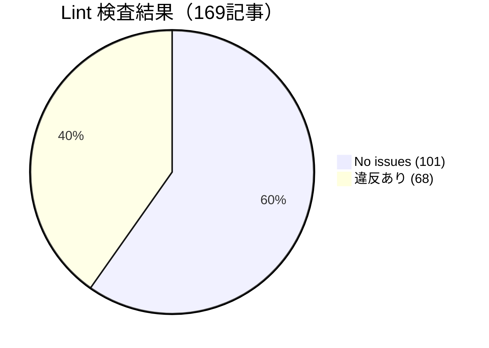
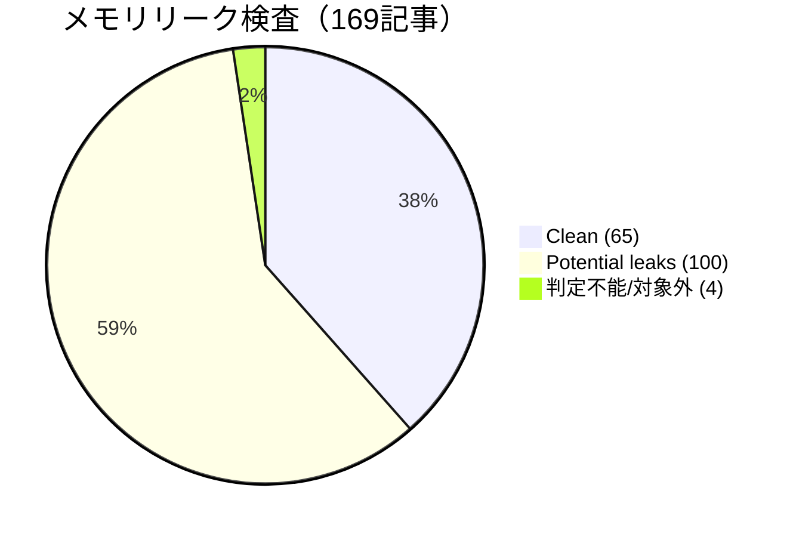
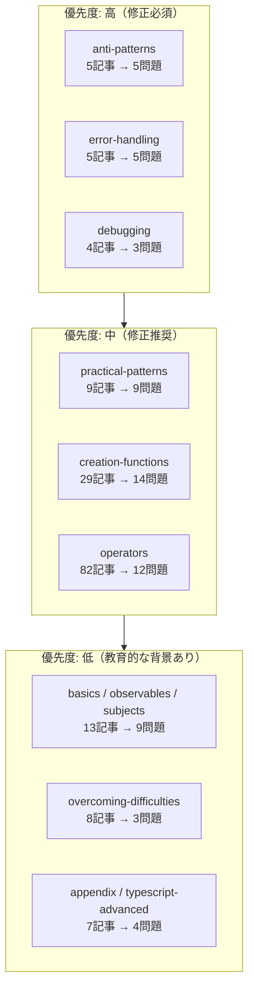
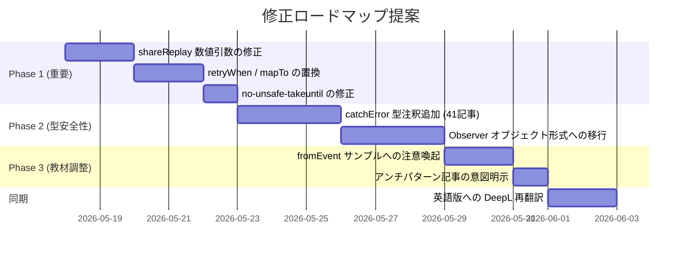

# RxJS MCP 監査レポート

**監査日**: 2026-05-17
**ツール**: [rxjs-mcp-server v0.4.1](https://github.com/shuji-bonji/rxjs-mcp-server)
**対象**: `docs/guide/` 配下 181 ファイル（日本語版）
**解析対象**: RxJS コードを含む 169 記事（1,393 コードブロック）

---

## エグゼクティブサマリ

rxjs-mcp-server v0.4.1（公式 RxJS リポジトリ参照版）の 3 ツール（`lint_rxjs` / `detect_memory_leak` / `analyze_operators`）で 169 記事を機械的に検査しました。本ドキュメントサイトは**全体として高品質**であり、致命的な誤りはほぼ存在しません。一方で、教材として「初学者にコピーされやすいコード」が公式 RxJS のベストプラクティスから外れている箇所が特定されました。修正アクションを 3 優先度に分類しています。

### 主要数値





| 指標 | 件数 | 全体比 |
|---|---|---|
| 検査対象記事 | 169 | 100% |
| Lint クリーン | 101 | 60% |
| メモリリーク Clean | 65 | 38% |
| メモリリーク Potential | 100 | 59% |
| Deprecated API 使用 | 6 | 4% |

> [!IMPORTANT]
> "Potential leaks" の多くは **教育用サンプル** に由来します。記事本文で `take` / `takeUntil` などの説明があるか、実コードでクリーンアップを示しているかが判断ポイントになります。本レポートでは特に「他章へのコピー元になりやすい記事」を優先度高として扱います。

---

## 検出された問題のヒートマップ（章別）



---

## 重大度別 検出問題一覧

### 🔴 高優先度（error レベル、または公式が明確に非推奨）

#### 1. `no-sharereplay` — `shareReplay(N)` の数値引数（7 記事）

公式 RxJS は v7 以降 `shareReplay({ bufferSize, refCount })` の **オブジェクト引数形式** を推奨。数値引数のままだとサブスクライバーが 0 になっても上流が完了しないと unsubscribe されず、メモリリークの温床になります。

**該当記事**:
- `docs/guide/operators/multicasting/shareReplay.md`
- `docs/guide/operators/utility/toArray.md`
- `docs/guide/practical-patterns/caching-strategies.md` ⭐ 教材として影響大
- `docs/guide/anti-patterns/flag-management.md`
- `docs/guide/debugging/performance.md`
- `docs/guide/observables/cold-and-hot-observables.md`
- `docs/guide/subjects/multicasting.md`

**修正例**:
```ts
// Before
source$.pipe(shareReplay(1))

// After
source$.pipe(shareReplay({ bufferSize: 1, refCount: true }))
```

#### 2. `no-nested-subscribe` — subscribe のネスト（11 記事）

`switchMap` / `mergeMap` / `concatMap` で flatten すべき箇所を入れ子の `subscribe` で書いている。

**該当記事**:
- `docs/guide/operators/filtering/find.md`
- `docs/guide/operators/filtering/findIndex.md`
- `docs/guide/operators/transformation/window.md` ほか window 系 3 件
- `docs/guide/operators/utility/toArray.md`
- `docs/guide/overcoming-difficulties/conceptual-understanding.md`
- `docs/guide/anti-patterns/common-mistakes.md` ⭐ 意図的（アンチパターン提示）
- `docs/guide/anti-patterns/promise-observable-mixing.md` ⭐ 意図的
- `docs/guide/anti-patterns/subscribe-if-hell.md` ⭐ 意図的

> [!TIP]
> anti-patterns 配下の 3 件は「悪い例として」意図的に提示しているコードと思われます。レポート上は false positive。記事本文でその旨を明示する VitePress callout（`> [!WARNING]`）が既にあるか確認してください。

#### 3. `no-unsafe-takeuntil` — `takeUntil` 配置の誤り（4 記事）

`takeUntil` は `subscribe` の直前（または `share` / `finalize` の直前）に置く必要があります。

**該当記事**:
- `docs/guide/creation-functions/basic/timer.md` ⭐ 基礎記事のため影響大
- `docs/guide/anti-patterns/common-mistakes.md`
- `docs/guide/debugging/common-scenarios.md`
- `docs/guide/error-handling/finalize.md`

#### 4. Deprecated API: `retryWhen` / `mapTo`

| API | 推奨置換 | 該当記事 |
|---|---|---|
| `retryWhen` (RxJS 7.3 で deprecated) | `retry({ delay: ... })` | `creation-functions/loop/index.md` / `error-handling/retry-catch.md` / `error-handling/strategies.md` / `schedulers/types.md` |
| `mapTo` (RxJS 7.2 で deprecated) | `map(() => value)` | `operators/combination/concatWith.md` / `operators/transformation/buffer.md` *(L122-123)* / `creation-functions/selection/index.md` / `practical-patterns/ui-events.md` *(L911)* |

> [!NOTE]
> 後段の検証ステップで、MCP が `mapTo` の使用を 2 ファイル見落としていたことが判明（`buffer.md`, `ui-events.md`）。grep 直検索で全 4 ファイルを補完。

#### 5. `no-unsafe-subject-next` — 型付き Subject に値なし `.next()`（7 記事）

`Subject<T>` で `T` が `void` 以外なのに `subject.next()` を呼んでいる箇所。

**該当記事**: real-time-data.md, common-mistakes.md, flag-management.md, embedded-reactive-programming.md, debugging/common-scenarios.md, error-handling/finalize.md, subjects/use-cases.md

---

### 🟡 中優先度（warning レベル、TypeScript 型安全性向上）

#### 6. `no-implicit-any-catch` — `catchError` の error 引数に型注釈なし（41 記事）

CLAUDE.md の "TypeScript-First Approach" 方針に直接関わる項目。`catchError((err: unknown) => ...)` または独自のエラー型を明示すべき。

**影響範囲が大きい主要記事**:
- `docs/guide/error-handling/*.md` （5 記事ほぼ全て）
- `docs/guide/practical-patterns/*.md` （8 記事中 7 件）
- `docs/guide/creation-functions/http-communication/*.md`

> [!NOTE]
> 全 41 記事の一括置換は機械的に可能。`grep -rn "catchError((err)\|catchError(err =>" docs/guide/` で抽出して `catchError((err: unknown) =>` に置換するのが効率的。

#### 7. `prefer-observer` — 個別コールバック subscribe（29 記事）

```ts
// Detected
source$.subscribe(v => ..., err => ..., () => ...)

// Recommended
source$.subscribe({ next: v => ..., error: err => ..., complete: () => ... })
```

3 引数形式は RxJS 7 で deprecated。Observer オブジェクト形式が推奨。

> [!TIP]
> ただし、`source$.subscribe(console.log)` のような 1 引数形式は今も妥当（deprecated ではない）。`prefer-observer` 警告は 3 引数形式に対するもの。

#### 8. `no-redundant-notify` — `complete()` 後の `.next()`（4 記事）

`subjects/types-of-subject.md` / `subjects/what-is-subject.md` / `error-handling/finalize.md` / `debugging/common-scenarios.md`

これは「Subject のライフサイクル」を示す**教育目的**の可能性が高いため、本文で「これは意図的なエラーケースの提示」と明記されているか確認すること。

---

### 🟢 低優先度（教材としての"あえて"が大半）

#### 9. fromEvent のリスナー未解除リスク（37 記事）

`fromEvent(window, 'click').subscribe(...)` のサンプルで `take`/`takeUntil` を付けていない。コードを丸コピーする読者がいる前提なら、各サンプルに対し以下のいずれかが望ましい：

```ts
// パターン A: take を付ける
fromEvent(window, 'click').pipe(take(5)).subscribe(...)

// パターン B: 解説で明示
// > [!WARNING] このコードを実コードで使う場合は takeUntil(destroy$) を追加してください
```

#### 10. Subject の `complete()` 漏れ（9 記事）

`practical-patterns/*` に集中。長寿命の Subject を扱うコードで `complete()` を呼ばないとリソースが残ります。

#### 11. 無限 interval/timer の制限演算子なし（24 記事）

主に `operators/filtering/*`、`operators/transformation/window系` の demo。やはり教材としては妥当だが、本文での注意喚起の有無を確認。

---

## 推奨アクションプラン



### Phase 1: 致命度の高い 3 種を機械的に置換（推定 1 日）

`docs/guide/` 配下を一括で `grep + sed` で書き換え可能。提案コマンド：

```bash
# 1. shareReplay 数値引数 → オブジェクト形式
grep -rln 'shareReplay(\s*[0-9]' docs/guide/
# 個別確認の上、{ bufferSize: N, refCount: true } へ書き換え

# 2. retryWhen → retry({ delay })
grep -rln 'retryWhen' docs/guide/

# 3. mapTo → map(() => value)
grep -rln 'mapTo(' docs/guide/
```

### Phase 2: 型注釈の一括強化（推定 半日）

```bash
# catchError((err) => ... → catchError((err: unknown) => ...
# 注意: 既に型が付いているケースもあるので grep で抽出してから個別置換
grep -rnE 'catchError\(\(?\s*err(or)?\s*\)?\s*=>' docs/guide/
```

### Phase 3: 教材表現の調整（推定 2 日）

- アンチパターン記事に "意図的に悪い例" の VitePress callout が無い箇所を補強
- fromEvent サンプル冒頭に「実コードでは takeUntil(destroy$) を追加」の注意

### 英語版への反映

Phase 1-3 が完了した日本語版に対して、変更箇所のみ DeepL MCP で再翻訳して英語版へ反映。コードブロック自体は機械的同期可能（コメントだけ翻訳が必要）。

---

## 検査の制限事項

| 制限 | 内容 |
|---|---|
| **`execute_stream` 未実行** | 大半のサンプルがブラウザ API / HTTP 依存のため、サンドボックスで実行不能。WebSocket・fetch を伴わない純粋なストリームのみ別途検証可能。 |
| **静的解析の限界** | `lint_rxjs` は regex ベース（eslint-plugin-rxjs-x の subset）。型情報を要する `no-implicit-any-catch` などは一部 false positive / negative の可能性あり。 |
| **教材コードの判定不能** | 「悪い例として意図的に書いた」コードか「単なる説明簡略化」かは MCP では判別不能。本文の callout 有無を人間が確認する必要あり。 |
| **`generate_marble` 未使用** | 既存マーブル図の妥当性を逆引きする運用は本ラウンドではスコープ外。Phase 4 として検討余地。 |

---

## 詳細レポート（グループ別）

機械検査の全記事の詳細は次の 4 ファイルにあります（本レポートはサマリ）。

| グループ | 範囲 | 記事数 | 詳細レポート |
|---|---|---|---|
| A | operators 前半（combination, conditional, filtering） | 41 | `report-group-A.md` |
| B | operators 後半（multicasting, transformation, utility） | 41 | `report-group-B.md` |
| C | creation-functions, overcoming-difficulties, practical-patterns | 46 | `report-group-C.md` |
| D | anti-patterns, basics, observables, subjects, error-handling, schedulers, debugging, testing, appendix, typescript-advanced | 41 | `report-group-D.md` |

これらは `audit/details/` 配下に格納されています。

---

## 検証結果（抜き取りチェック）

本レポート完成後、3 件のサンプリングで実コードとの照合を実施しました。

| 検証項目 | 検証方法 | 結果 |
|---|---|---|
| `shareReplay(1)` in `caching-strategies.md` | grep | ✅ 5 箇所すべて実在を確認 |
| `retryWhen` in `error-handling/` | grep | ✅ retry-catch.md, strategies.md で実在を確認 |
| `no-unsafe-takeuntil` in `timer.md` | grep + 目視 | ✅ L276 `timer(5000).pipe(takeUntil(dismiss$), map(...))` を確認 |
| `mapTo` 使用箇所 | grep | ⚠️ MCP は 2 ファイルのみ報告したが、実際は 4 ファイルに存在（buffer.md, ui-events.md が漏れ） |

→ MCP は概ね正確だが **稀に false negative が発生する**。重要修正は grep で再確認することを推奨。

---

## 次のステップの提案

1. **本レポートをレビュー** — 特に「アンチパターン記事の意図的記述」を false positive として除外
2. **Phase 1 の修正に着手** — `shareReplay`, `retryWhen`, `mapTo`, `no-unsafe-takeuntil`（重要度高、機械的に置換可能）
3. **修正後に再監査** — 同じ MCP で再実行し、残課題を確認
4. **英語版への同期** — 変更箇所のみ DeepL MCP で翻訳更新

---

*このレポートは [rxjs-mcp-server v0.4.1](https://github.com/shuji-bonji/rxjs-mcp-server) と Claude による機械検査結果です。最終的な修正判断は人間（@shuji-bonji）の判断を優先してください。*
