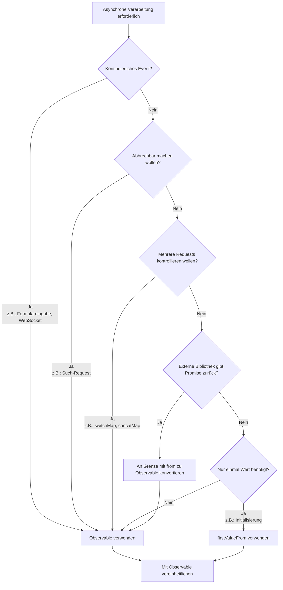

# Anti-Pattern der Vermischung von Promise und Observable

Promise und Observable sind beide Mechanismen zur Behandlung asynchroner Verarbeitung, aber **wenn sie ohne klare Designgrenzen vermischt werden, treten verschiedene Probleme auf**. Diese Seite erklärt detailliert Anti-Patterns durch Vermischung und geeignete Vereinheitlichungsmethoden.

## Warum ist Vereinheitlichung wichtig?

Bei Vermischung von Promise und Observable treten folgende Probleme auf:

### 1. Nicht abbrechbar

Observable kann mit `unsubscribe` / `takeUntil` Verarbeitung abbrechen, aber **Promise kann einmal gestartet nicht abgebrochen werden**.

```ts
import { interval, Subject } from 'rxjs';
import { takeUntil } from 'rxjs';

const destroy$ = new Subject<void>();

// ✅ Observable: Abbrechbar
interval(1000).pipe(
  takeUntil(destroy$)
).subscribe(n => console.log(n));

// Abbrechen, wenn Benutzer Bildschirm verlässt
destroy$.next();
destroy$.complete();
```

```ts
// ❌ Promise: Nicht abbrechbar
async function fetchData() {
  const response = await fetch('/api/data');
  // fetch stoppt nicht, auch wenn Benutzer Bildschirm verlässt
  return response.json();
}
```

**Auswirkung:** Unnötige Requests bei Routenübergängen, Ausführung unnötiger Nebeneffekte

### 2. Schwierigkeit der Mehrfachkontrolle

Observable kann mit `switchMap`/`concatMap`/`exhaustMap` mehrere Requests seriell ausführen, abbrechen oder Wiedereintritte verhindern.

```ts
import { fromEvent } from 'rxjs';
import { switchMap, debounceTime } from 'rxjs';

const searchInput = document.getElementById('serch-input')!;

// ✅ Observable: Nur neuesten Request verarbeiten
fromEvent(searchInput, 'input').pipe(
  debounceTime(300),
  switchMap(event => searchAPI((event.target as HTMLInputElement).value))
  // Alte Requests werden automatisch abgebrochen
).subscribe(results => displayResults(results));
function searchAPI(query: string) {
  return fetch(`/api/search?q=${query}`).then(r => r.json());
}

function displayResults(results: unknown) {
  console.log(results);
}
```

Promise erfordert manuelle Implementierung solcher Kontrollen, was komplex wird.

### 3. Umgang mit mehrfachen Events

Observable ist stark bei **kontinuierlich fließenden Werten** wie Formulareingaben, WebSockets und Events.

```ts
import { fromEvent } from 'rxjs';
import { map } from 'rxjs';

// ✅ Observable: Verarbeitung kontinuierlicher Events
fromEvent(document, 'mousemove').pipe(
  map(event => ({ x: (event as MouseEvent).clientX, y: (event as MouseEvent).clientY }))
).subscribe(position => {
  console.log('Mouse position:', position);
});
```

Promise ist auf "nur einmalige" Verarbeitung spezialisiert und nicht für kontinuierliche Events geeignet.

### 4. Testbarkeit

Observable kann mit Marble-Tests Zeit und Nebenläufigkeit garantieren.

```ts
import { TestScheduler } from 'rxjs/testing';

// ✅ Observable: Zeit mit Marble-Tests kontrollierbar
// ※ Dieser Code wird innerhalb eines Test-Frameworks (Jasmine/Jest) ausgeführt
describe('Observable Test', () => {
  let scheduler: TestScheduler;

  beforeEach(() => {
    scheduler = new TestScheduler((actual, expected) => {
      expect(actual).toEqual(expected); // Verwendung von expect des Test-Frameworks
    });
  });

  it('should emit values over time', () => {
    scheduler.run(({ cold, expectObservable }) => {
      const source$ = cold('a-b-c|');
      expectObservable(source$).toBe('a-b-c|');
    });
  });
});
```

Promise-basierter Code neigt zu komplexen asynchronen Tests. Details siehe [Testmethoden](/de/guide/testing/unit-tests).


## Typische "problematische" Patterns durch Vermischung (zu vermeiden)

Im Folgenden sind Problempatterns aufgeführt, die in tatsächlichen Projekten häufig zu sehen sind.

### ❌ Anti-Pattern 1: Vermischung von async/await und pipe()

Wenn `await` während Observable-Verarbeitung verwendet wird oder Promise- und Observable-Verarbeitung vermischt werden, wird es nicht abbrechbar.

```ts
import { ajax } from 'rxjs/ajax';
import { firstValueFrom } from 'rxjs';

// ❌ Schlechtes Beispiel: Vermischung von Observable → Promise → Promise
async function fetchUserData() {
  const user = await firstValueFrom(ajax.getJSON('/api/user'));

  // Nach Umwandlung in Promise nicht mehr abbrechbar
  return fetch('/api/profile').then(response => response.json());
}
```

```ts
import { of } from 'rxjs';
import { map } from 'rxjs';

// ❌ Schlechtes Beispiel: Versuch await innerhalb von pipe() zu verwenden (funktioniert tatsächlich nicht)
async function processData() {
  return of(1, 2, 3).pipe(
    map(async (value) => {
      const result = await someAsyncOperation(value);
      return result; // Wird zu Observable<Promise<T>>
    })
  );
}

async function someAsyncOperation(value: number): Promise<number> {
  return value * 2;
}
```

#### Problempunkte
- Wird nicht abbrechbar
- Fehlerkanäle trennen sich (`error` statt `unhandledrejection`)
- Zuständigkeiten von Promise und Observable werden unklar
- Typ wird zu `Observable<Promise<T>>`

### ❌ Anti-Pattern 2: Verwendung von `toPromise()` (bereits abgeschafft)

```ts
import { interval } from 'rxjs';

// ❌ Schlechtes Beispiel: toPromise() wurde in RxJS v8 entfernt
interval(1000).toPromise().then(value => {
  console.log(value);
});
```

**Lösung:** `firstValueFrom` / `lastValueFrom` verwenden (später beschrieben)

### ❌ Anti-Pattern 3: `await` innerhalb von `subscribe`

```ts
import { fromEvent } from 'rxjs';

const button = document.getElementById('btn') as HTMLButtonElement;

// ❌ Schlechtes Beispiel
fromEvent(button, 'click').subscribe(async () => {
  const data = await fetch('/api/data').then(r => r.json());
  console.log(data);
  // Fluss wird unleserlich und Fehlerbehandlung schwierig
});
```

#### Problempunkte
- Fluss wird unleserlich
- Quelle doppelter Requests
- Möglichkeit von Speicherlecks

### ❌ Anti-Pattern 4: Verschachtelung von subscribe

```ts
import { ajax } from 'rxjs/ajax';

// ❌ Schlechtes Beispiel
ajax.getJSON('/api/users').subscribe(users => {
  ajax.getJSON('/api/settings').subscribe(settings => {
    console.log(users, settings);
    // Callback-Hölle
  });
});
```

#### Problempunkte
- Komplexe Fehlerbehandlung
- Schwierige Verwaltung von Abmeldungen

### ❌ Anti-Pattern 5: Paralleler Abruf derselben Daten mit Promise und Observable

```ts
import { ajax } from 'rxjs/ajax';

// ❌ Schlechtes Beispiel
async function loadData() {
  const userPromise = fetch('/api/user').then(r => r.json());
  const user$ = ajax.getJSON('/api/user');

  // Dieselben Daten werden zweimal abgerufen
}
```

#### Problempunkte
- Doppelte Ausführung
- Reihenfolgekonkurrenz

### ❌ Anti-Pattern 6: Rückgabe von Promise innerhalb von Observable

Verwendung von `async/await` innerhalb des Observable-Konstruktors macht Fehlerbehandlung schwierig.

```ts
import { Observable } from 'rxjs';

// ❌ Schlechtes Beispiel: Verwendung von async function innerhalb von Observable
const data$ = new Observable(subscriber => {
  async function fetchData() {
    const response = await fetch('/api/data');
    const data = await response.json();
    subscriber.next(data);
    subscriber.complete();
  }

  fetchData(); // Promise wird zurückgegeben, aber Fehler können nicht erfasst werden
  // Wenn fetchData() rejected wird, wird subscriber.error() nicht aufgerufen
});
```

```ts
import { Observable } from 'rxjs';

// ❌ Schlechtes Beispiel: Promise an subscriber.next() übergeben
const data$ = new Observable(subscriber => {
  const promise = fetch('/api/data').then(r => r.json());
  subscriber.next(promise); // Promise-Objekt fließt durch
  subscriber.complete();
});

// Abonnent erhält Promise
data$.subscribe(value => {
  console.log(value); // Promise { <pending> } wird ausgegeben
});
```

#### Problempunkte
- Observable-Fehlerkanal empfängt keine Promise-Fehler
- Kann zu `unhandledrejection` werden
- subscriber.next() erhält Promise-Objekt
- Abonnent muss Promise unwrappen

#### Lösung

```ts
import { from, defer } from 'rxjs';

// ✅ Gutes Beispiel: Promise mit from() zu Observable konvertieren
const data$ = from(fetch('/api/data').then(r => r.json()));

// ✅ Gutes Beispiel: Verzögerte Evaluierung mit defer()
const data$ = defer(() => fetch('/api/data').then(r => r.json()));
```


## Praktischer Leitfaden: Saubere Konvertierung an Grenzen

Vollständige Vermeidung von Vermischungen ist schwierig, daher ist **geeignete Konvertierung an Designgrenzen** Best Practice.

### Pattern 1: Promise → Observable (wenn externes SDK Promise zurückgibt)

Wenn externe Bibliotheken oder Legacy-Code Promise zurückgeben, **einmalige Konvertierung zu Observable an der Grenze**.

```ts
import { from } from 'rxjs';
import { switchMap } from 'rxjs';

// Externes SDK gibt Promise zurück
async function externalSDK(): Promise<{ userId: string }> {
  return { userId: '123' };
}

// ✅ Gutes Beispiel: An Grenze konvertieren und danach mit Observable vereinheitlichen
const user$ = from(externalSDK());

user$.pipe(
  switchMap(user => from(fetchProfile(user.userId)))
).subscribe(profile => {
  console.log(profile);
});

async function fetchProfile(userId: string): Promise<{ name: string }> {
  return { name: 'John' };
}
```

### Pattern 2: Observable → Promise (wenn "nur einmalig benötigt" in synchronem Kontext)

Für Initialisierung oder Guard-Funktionen, **wenn nur einmal Wert benötigt** wird, `firstValueFrom` / `lastValueFrom` verwenden.

```ts
import { ajax } from 'rxjs/ajax';
import { firstValueFrom, shareReplay } from 'rxjs';

// ✅ Gutes Beispiel: Beim mehrmaligen await cachen
const config$ = ajax.getJSON('/api/config').pipe(
  shareReplay({ bufferSize: 1, refCount: true })
);

async function initialize() {
  const config = await firstValueFrom(config$);
  console.log('Config loaded:', config);
}

async function validate() {
  const config = await firstValueFrom(config$); // Aus Cache abrufen
  console.log('Validating with config:', config);
}
```

**⚠️ Achtung:** `firstValueFrom` holt nur **erstes Element**. **Niemals** für kontinuierliche Events (valueChanges, WebSocket etc.) verwenden.

```ts
import { interval } from 'rxjs';
import { firstValueFrom } from 'rxjs';

// ❌ Schlechtes Beispiel: firstValueFrom für unendlichen Stream
const value = await firstValueFrom(interval(1000));
// Holt nur einmal Wert und endet (unbeabsichtigtes Verhalten)
```

### Pattern 3: Vereinheitlichung der Fehlerbehandlung

Darauf achten, dass Fehlerbehandlungskanäle von Promise und Observable sich nicht trennen.

```ts
import { from } from 'rxjs';
import { catchError } from 'rxjs';
import { of } from 'rxjs';

async function riskyOperation(): Promise<string> {
  throw new Error('Something went wrong');
}

// ✅ Gutes Beispiel: Mit Observable-Fehlerbehandlung vereinheitlichen
from(riskyOperation()).pipe(
  catchError(error => {
    console.error('Error caught in Observable pipeline:', error);
    return of('fallback value');
  })
).subscribe(result => {
  console.log(result); // 'fallback value'
});
```


## Häufige Ersetzungsbeispiele bei Vermischung

### Beispiel 1: Zwischenzeitliche Umwandlung in Promise → then

#### ❌ Schlechtes Beispiel

```ts
import { ajax } from 'rxjs/ajax';
import { firstValueFrom } from 'rxjs';

async function loadUser() {
  const user = await firstValueFrom(ajax.getJSON('/api/user'));

  // Nach Umwandlung in Promise Fortsetzung mit then
  return fetch('/api/profile')
    .then(response => response.json())
    .then(profile => {
      console.log(user, profile);
    });
}
```

#### ✅ Gutes Beispiel A: Durchgehend Observable

```ts
import { ajax } from 'rxjs/ajax';
import { switchMap } from 'rxjs';

// Verarbeitung als Observable
ajax.getJSON('/api/user').pipe(
  switchMap(user => ajax.getJSON('/api/profile').pipe(
    // user und profile kombinieren
  ))
).subscribe(profile => {
  console.log(profile);
});
```

#### ✅ Gutes Beispiel B: Kontext wo nur einmal await erforderlich

```ts
import { ajax } from 'rxjs/ajax';
import { shareReplay, firstValueFrom } from 'rxjs';

const user$ = ajax.getJSON('/api/user').pipe(
  shareReplay({ bufferSize: 1, refCount: true })
);

async function loadUserOnce() {
  const user = await firstValueFrom(user$);
  console.log('User loaded once:', user);
}
```


### Beispiel 2: await innerhalb von subscribe

#### ❌ Schlechtes Beispiel

```ts
import { fromEvent } from 'rxjs';

const button = document.getElementById('search-btn') as HTMLButtonElement;

fromEvent(button, 'click').subscribe(async () => {
  const results = await fetch('/api/search').then(r => r.json());
  console.log(results);
});
```

#### ✅ Gutes Beispiel

```ts
import { fromEvent, from } from 'rxjs';
import { switchMap } from 'rxjs';

const button = document.getElementById('search-btn') as HTMLButtonElement;

fromEvent(button, 'click').pipe(
  switchMap(() => from(fetch('/api/search').then(r => r.json())))
).subscribe(results => {
  console.log(results);
});
```


## Entscheidungsflussdiagramm (leicht zu merkende Richtlinie)

Richtlinie, wenn im Projekt unentschieden zwischen Promise und Observable.



### Konkrete Entscheidungskriterien

| Bedingung | Empfehlung | Grund |
|---|---|---|
| **Kontinuierliche Events** (Formulareingabe, WebSocket) | Observable | Promise kann nur einmal Wert zurückgeben |
| **Abbrechbar machen wollen** (Such-Request) | Observable | Promise nicht abbrechbar |
| **Mehrere Requests kontrollieren** (switchMap, concatMap) | Observable | Kontrolle mit Promise schwierig |
| **Externe Bibliothek gibt Promise zurück** | Mit `from()` konvertieren | Einmalige Konvertierung an Grenze |
| **Nur einmal Wert benötigt** (Initialisierung) | `firstValueFrom` | Bei Bedarf mit `shareReplay(1)` kombinieren |


## Zusammenfassung

- **Vermischung selbst ist nicht schlecht**, aber Richtung zu **klaren "Grenzen" im Design** neigen ist richtig
- **Vereinheitlichung basierend auf Observable** und nur an minimal notwendigen Stellen **Konvertierung mit `firstValueFrom`/`from()`** hat wenig Probleme und gewährleistet Test-, Lesbarkeit und Abbrechbarkeit
- **Kontinuierliche Events (Formular, WebSocket) niemals zu Promise konvertieren**

## Verwandte Abschnitte

- **[Unterschied zwischen Promise und RxJS](/de/guide/basics/promise-vs-rxjs)** - Grundlegende Konvertierungsmethoden
- **[Fehlerbehandlung](/de/guide/error-handling/strategies)** - Observable-Fehlerbehandlungsstrategien
- **[Häufige Fehler und Gegenmaßnahmen](/de/guide/anti-patterns/common-mistakes)** - Andere Anti-Patterns

## Nächste Schritte

1. Stellen im vorhandenen Code identifizieren, wo Promise und Observable vermischt sind
2. Grenzen klären und zu Observable vereinheitlichen
3. `takeUntil` an Stellen hinzufügen, wo Abbruchverarbeitung erforderlich ist
