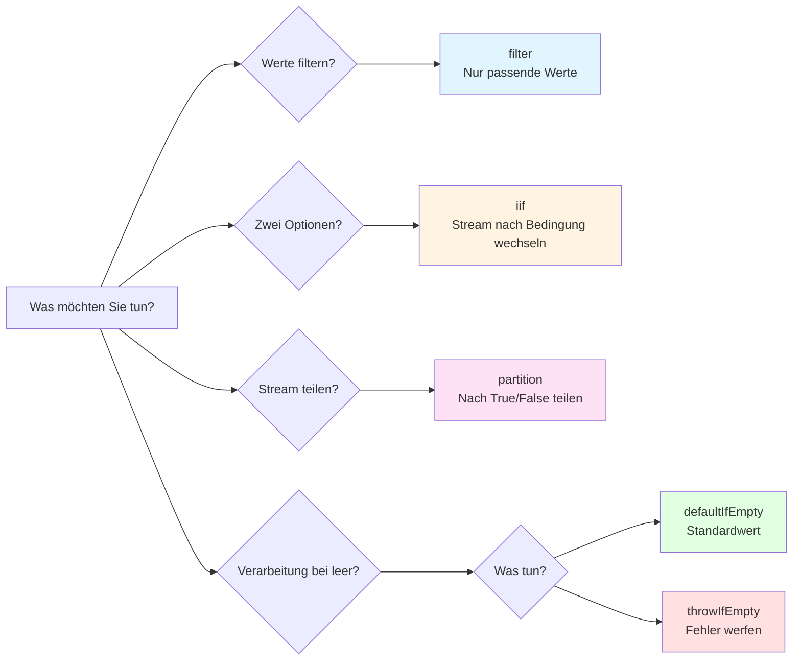

# If-Anweisungs-Verschachtelungshölle in subscribe

## Warum dies ein Antipattern ist

"Komplexe bedingte Verzweigungen innerhalb von subscribe" ist ein **klares Antipattern** in RxJS. Es wird aus folgenden Gründen als zu vermeidendes Implementierungsmuster anerkannt.

### 1. Es widerspricht der Designphilosophie von RxJS

RxJS fördert **deklarative Programmierung**. "Was zu tun ist" sollte in der Pipeline ausgedrückt werden, und die Details "wie es zu tun ist" sollten nicht innerhalb von subscribe geschrieben werden.

```typescript
// ❌ Antipattern: Imperative Programmierung (prozedural)
userService.getUser(id).subscribe(user => {
  if (user.isActive) {
    if (user.role === 'admin') {
      console.log('Admin user');
    }
  }
});

// ✅ RxJS-Stil: Deklarative Programmierung
userService.getUser(id).pipe(
  filter(user => user.isActive),
  filter(user => user.role === 'admin'),
  tap(user => console.log('Admin user'))
).subscribe();
```

### 2. Gleiche Probleme wie bestehende Antipatterns

Wie andere in Kapitel 10 behandelte Antipatterns verursacht es folgende Probleme:

| Antipattern | Hauptproblem |
|---------------|---------|
| **Speicherlecks** | Vergessenes Unsubscribe |
| **Subscribe-Hölle** | Verschachtelte Subscribes |
| **If-Hölle in subscribe** ← Diese Seite | Komplexe bedingte Verzweigungen |

### 3. Spezifische Probleme

1. **Geringe Lesbarkeit** - Tiefe Verschachtelung, unklare Code-Absicht
2. **Schwer zu testen** - Zu viele bedingte Verzweigungen führen zu Explosion von Testfällen
3. **Nicht wiederverwendbar** - Logik ist in subscribe eingesperrt, kann anderswo nicht verwendet werden
4. **Schwer zu debuggen** - Wertefluss ist schwer nachvollziehbar, Problemstellen-Identifikation dauert lange
5. **Komplexe Fehlerbehandlung** - Schwer nachzuvollziehen, wo Fehler auftreten

### 4. Akzeptabler Bereich und zu vermeidender Bereich

```typescript
// ✅ Akzeptabler Bereich: Einfache Verzweigung (1-2 if-Anweisungen)
subscribe(user => {
  if (user.isAdmin) {
    console.log('Admin user');
  } else {
    console.log('Regular user');
  }
});

// ⚠️ Vorsicht: 2-3 Verschachtelungen
subscribe(user => {
  if (user) {
    if (user.isActive) {
      console.log('Active user');
    }
  }
});

// ❌ Antipattern: 3 oder mehr Verschachtelungen
subscribe(user => {
  if (user) {
    if (user.isActive) {
      if (user.role === 'admin') {
        if (user.permissions.includes('write')) {
          // Dies ist ein klares Antipattern
        }
      }
    }
  }
});
```

> [!IMPORTANT] Entscheidungskriterien
> - **1-2 if-Anweisungen**: Akzeptabler Bereich (aber Operatoren sind vorzuziehen)
> - **3 oder mehr Verschachtelungen**: Klares Antipattern (sollte unbedingt refaktoriert werden)
> - **Verschachtelte asynchrone Verarbeitung**: Sofortiges Refactoring erforderlich


## Häufige schlechte Muster

### Muster 1: Komplexe bedingte Verzweigungen in subscribe

```typescript
// ❌ Schlechtes Beispiel: if-Anweisungs-Verschachtelung in subscribe
userService.getUser(id).subscribe(user => {
  if (user) {
    if (user.isActive) {
      if (user.role === 'admin') {
        // Admin-Verarbeitung
        console.log('Admin user:', user.name);
        adminService.loadAdminData().subscribe(adminData => {
          if (adminData) {
            // Weitere Verschachtelung...
          }
        });
      } else {
        // Normale Benutzerverarbeitung
        console.log('Regular user:', user.name);
      }
    } else {
      // Inaktiver Benutzer
      console.log('Inactive user');
    }
  } else {
    // Benutzer nicht gefunden
    console.log('User not found');
  }
});
```

### Probleme mit diesem Code
1. **5-stufige Verschachtelung** - Erheblich reduzierte Lesbarkeit
2. **Subscribe innerhalb von subscribe** - Risiko von Speicherlecks
3. **Keine Fehlerbehandlung** - Unklar, wo Fehler auftreten
4. **Nicht testbar** - Schwierig, alle Pfade zu testen
5. **Logik nicht wiederverwendbar** - Kann anderswo nicht verwendet werden


## Lösung mit RxJS-Bedingungsoperatoren

### Lösung 1: Bedingte Verzweigung mit filter

**Wann verwenden?**: Werte filtern, unerwünschte Werte ausschließen

```typescript
import { filter, tap, switchMap } from 'rxjs';

// ✅ Gutes Beispiel: Bedingungen mit filter trennen
userService.getUser(id).pipe(
  filter(user => user !== null),           // Null-Check
  filter(user => user.isActive),           // Aktiv-Check
  filter(user => user.role === 'admin'),   // Rollenbestätigung
  tap(user => console.log('Admin user:', user.name)),
  switchMap(user => adminService.loadAdminData())
).subscribe({
  next: adminData => console.log('Admin data loaded', adminData),
  error: err => console.error('Error:', err)
});
```

> [!NOTE] Vorteile
> - ✅ Jede Bedingung ist unabhängig (leicht lesbar)
> - ✅ Klare Reihenfolge in der Pipeline
> - ✅ Zentralisierte Fehlerbehandlung

### Lösung 2: Zwei-Wege-Verzweigung mit iif

**Wann verwenden?**: Verschiedene Observables je nach Bedingung ausführen

```typescript
import { iif, of, switchMap } from 'rxjs';

// ✅ Gutes Beispiel: Stream je nach Bedingung mit iif wechseln
userService.getUser(id).pipe(
  switchMap(user =>
    iif(
      () => user.role === 'admin',
      adminService.loadAdminData(),    // Bei Admin
      userService.loadUserData()       // Bei normalem Benutzer
    )
  )
).subscribe(data => console.log('Data:', data));
```

> [!NOTE] Vorteile
> - ✅ Klare Zwei-Wege-Verzweigung
> - ✅ Jede Verarbeitung ist ein unabhängiges Observable
> - ✅ Einfach zu testen

### Lösung 3: Verzweigungsverarbeitung mit partition

**Wann verwenden?**: Stream in zwei teilen und separat verarbeiten

```typescript
import { partition, merge, tap, switchMap, map } from 'rxjs';

// ✅ Gutes Beispiel: Stream mit partition in zwei teilen
const [activeUsers$, inactiveUsers$] = partition(
  userService.getUsers(),
  user => user.isActive
);

// Aktive Benutzer verarbeiten
const processedActive$ = activeUsers$.pipe(
  tap(user => console.log('Active:', user.name)),
  switchMap(user => userService.loadProfile(user.id))
);

// Inaktive Benutzer verarbeiten
const processedInactive$ = inactiveUsers$.pipe(
  tap(user => console.log('Inactive:', user.name)),
  map(user => ({ ...user, status: 'archived' }))
);

// Zwei Streams zusammenführen
merge(processedActive$, processedInactive$).subscribe(
  result => console.log('Processed:', result)
);
```

> [!NOTE] Vorteile
> - ✅ Vollständige Trennung von aktiv/inaktiv
> - ✅ Kann unabhängig verarbeitet werden
> - ✅ Einfach zu erweitern

### Lösung 4: Standardwert mit defaultIfEmpty

**Wann verwenden?**: Standardwert bereitstellen, wenn leer

```typescript
import { defaultIfEmpty, filter } from 'rxjs';

// ✅ Gutes Beispiel: Standardwert bereitstellen, wenn leer
userService.getUser(id).pipe(
  filter(user => user !== null),
  defaultIfEmpty({ id: 0, name: 'Guest', role: 'guest' })
).subscribe(user => {
  console.log('User:', user.name);
});
```

> [!NOTE] Vorteile
> - ✅ Kein Null-Check erforderlich
> - ✅ Standardwert ist klar
> - ✅ Keine Verzweigung in subscribe erforderlich

### Lösung 5: Fehlerbehandlung mit throwIfEmpty

**Wann verwenden?**: Als Fehler behandeln, wenn leer

```typescript
import { throwIfEmpty, catchError, filter } from 'rxjs';
import { of } from 'rxjs';

// ✅ Gutes Beispiel: Fehler werfen, wenn leer
userService.getUser(id).pipe(
  filter(user => user !== null),
  throwIfEmpty(() => new Error('User not found')),
  catchError(err => {
    console.error('Error:', err.message);
    return of(null);
  })
).subscribe(user => {
  if (user) {
    console.log('User found:', user.name);
  }
});
```

> [!NOTE] Vorteile
> - ✅ Klare Fehlerbehandlung
> - ✅ Abschluss innerhalb der Pipeline
> - ✅ subscribe nur für Erfolgsverarbeitung


## Praxisbeispiel: Refactoring komplexer Bedingungslogik

### Vorher: If-Hölle in subscribe

```typescript
// ❌ Schlechtes Beispiel: Komplexe Bedingungslogik (6-stufige Verschachtelung)
apiService.fetchData().subscribe(data => {
  if (data) {
    if (data.status === 'success') {
      if (data.result) {
        if (data.result.items.length > 0) {
          data.result.items.forEach(item => {
            if (item.isValid) {
              if (item.price > 0) {
                // Verarbeitung...
                console.log('Valid item:', item);
              }
            }
          });
        } else {
          console.log('No items found');
        }
      }
    } else {
      console.log('Request failed');
    }
  }
});
```

> [!WARNING] Probleme
> - 6-stufige Verschachtelung
> - Weitere bedingte Verzweigungen innerhalb von forEach
> - Keine Fehlerbehandlung
> - Nicht testbar
> - Ineffiziente Array-Verarbeitung

### Nachher: Strukturiert mit Operatoren

```typescript
import { filter, map, defaultIfEmpty, switchMap, tap } from 'rxjs';
import { from } from 'rxjs';

// ✅ Gutes Beispiel: Bedingungen mit Operatoren organisieren
apiService.fetchData().pipe(
  // 1. Datenexistenz prüfen
  filter(data => data !== null),

  // 2. Status prüfen
  filter(data => data.status === 'success'),

  // 3. Ergebnisexistenz prüfen
  filter(data => data.result !== null),

  // 4. Array entfalten
  map(data => data.result.items),
  defaultIfEmpty([]),  // Standard bei leerem Array

  // 5. Jedes Element einzeln verarbeiten
  switchMap(items => from(items)),

  // 6. Nur gültige Elemente
  filter(item => item.isValid),

  // 7. Preisprüfung
  filter(item => item.price > 0),

  // 8. Debug-Log
  tap(item => console.log('Valid item:', item))

).subscribe({
  next: item => console.log('Processing:', item),
  error: err => console.error('Error:', err),
  complete: () => console.log('All items processed')
});
```

> [!TIP] Verbesserungen
> - ✅ Verschachtelung ist 0 (alles flach)
> - ✅ Jede Bedingung ist unabhängig und leicht lesbar
> - ✅ Fehlerbehandlung hinzugefügt
> - ✅ Einfach zu testen (jeder Operator kann einzeln getestet werden)
> - ✅ Effiziente Array-Verarbeitung (mit from() gestreamt)


## Leitfaden zur Auswahl von Bedingungsoperatoren

Das folgende Flussdiagramm hilft bei der Entscheidung, welchen Operator zu verwenden.



| Bedingung | Zu verwendender Operator | Grund |
|-----|----------------|------|
| Werte filtern | `filter()` | Nur Werte durchlassen, die Bedingung erfüllen |
| Zwischen zwei Optionen wählen | `iif()` | Stream je nach Bedingung wechseln |
| Stream in zwei teilen | `partition()` | In zwei Streams nach True/False teilen |
| Standard bei leer | `defaultIfEmpty()` | Standardwert verwenden, wenn kein Wert |
| Fehler bei leer | `throwIfEmpty()` | Fehler werfen, wenn kein Wert |
| Mehrere Optionen (3+) | Benutzerdefinierter Operator | Wenn mehr als 3 Verzweigungen erforderlich |


## Refactoring-Schritte

### Schritt 1: Bedingungen identifizieren
Alle if-Anweisungen in subscribe auflisten

```typescript
// Beispiel: Folgende Bedingungen vorhanden
if (data)                        // ← Bedingung 1
if (data.status === 'success')   // ← Bedingung 2
if (data.result)                 // ← Bedingung 3
if (item.isValid)                // ← Bedingung 4
if (item.price > 0)              // ← Bedingung 5
```

### Schritt 2: Bedingungen klassifizieren
- **Filterbedingungen** → `filter()`
- **Zwei-Wege-Verzweigung** → `iif()`
- **Stream-Teilung** → `partition()`
- **Standardwert** → `defaultIfEmpty()`
- **Fehlerbedingung** → `throwIfEmpty()`

### Schritt 3: In Pipeline umwandeln
Bedingungen durch Operatoren in pipe ersetzen

```typescript
.pipe(
  filter(data => data !== null),              // Bedingung 1
  filter(data => data.status === 'success'),  // Bedingung 2
  filter(data => data.result !== null),       // Bedingung 3
  switchMap(data => from(data.result.items)),
  filter(item => item.isValid),               // Bedingung 4
  filter(item => item.price > 0)              // Bedingung 5
)
```

### Schritt 4: subscribe vereinfachen
subscribe nur für Seiteneffekte (Log-Ausgabe, DOM-Operationen usw.)

```typescript
.subscribe({
  next: item => console.log('Valid item:', item),
  error: err => console.error('Error:', err),
  complete: () => console.log('Complete')
});
```

### Schritt 5: Tests schreiben
Prüfen, ob jeder Operator wie erwartet funktioniert

```typescript
// Beispiel: filter-Test
it('should filter out null values', () => {
  const source$ = of(null, { id: 1 }, null);
  const result$ = source$.pipe(
    filter(data => data !== null)
  );

  result$.subscribe(data => {
    expect(data).not.toBeNull();
  });
});
```


## Wiederverwendung mit benutzerdefinierten Operatoren

Komplexe Bedingungslogik kann in benutzerdefinierte Operatoren extrahiert und wiederverwendet werden.

```typescript
import { pipe } from 'rxjs';
import { filter } from 'rxjs';

// Benutzerdefinierter Operator: Nur aktive Admin-Benutzer
function filterActiveAdmins<T extends { isActive: boolean; role: string }>() {
  return pipe(
    filter((user: T) => user.isActive),
    filter((user: T) => user.role === 'admin')
  );
}

// Verwendungsbeispiel
userService.getUsers().pipe(
  filterActiveAdmins(),
  tap(user => console.log('Active admin:', user.name))
).subscribe();
```

> [!NOTE] Vorteile
> - ✅ Wiederverwendbar
> - ✅ Einfach zu testen
> - ✅ Absicht durch Namen klar


## Verwandte Lernressourcen

Um dieses Antipattern zu verstehen, beachten Sie auch folgende Abschnitte.

- **[Kapitel 4: Bedingte Operatoren](/de/guide/operators/conditional/)** - Details zu filter, iif, defaultIfEmpty
- **[Kapitel 10: Antipatterns](/de/guide/anti-patterns/)** - Andere Antipatterns
- **[Kapitel 11: Konzeptuelle Verständnisbarrieren](/de/guide/overcoming-difficulties/conceptual-understanding)** - Verständnis deklarativer Programmierung
- **[Kapitel 11: Operatorauswahl](/de/guide/overcoming-difficulties/operator-selection)** - Wie man den richtigen Operator wählt


## Antipattern-Vermeidungscheckliste

Überprüfen Sie Ihren Code.

```markdown
- [ ] Nicht mehr als 3 if-Anweisungen in subscribe verschachtelt
- [ ] Bedingte Verzweigungen werden durch Operatoren in pipe behandelt
- [ ] subscribe führt nur Seiteneffekte aus (Logs, DOM-Operationen)
- [ ] filter wird verwendet, um unnötige Werte auszuschließen
- [ ] Leere Fälle werden mit defaultIfEmpty oder throwIfEmpty behandelt
- [ ] Komplexe Bedingungen sind in benutzerdefinierte Operatoren extrahiert
- [ ] Fehlerbehandlung erfolgt mit catchError
- [ ] Kein subscribe innerhalb von subscribe verschachtelt
```

## Nächste Schritte

Nachdem Sie dieses Antipattern verstanden haben, lernen Sie praktische Muster auf folgenden Seiten.

1. **[Häufige Fehler und Lösungen](/de/guide/anti-patterns/common-mistakes)** - Andere Antipatterns lernen
2. **[Kapitel 11: Schwierigkeiten überwinden](/de/guide/overcoming-difficulties/)** - RxJS-spezifische Schwierigkeiten überwinden
3. **[Kapitel 13: Praktische Muster](/de/guide/)** - Richtige Implementierungsmuster erlernen (in Vorbereitung)

> [!TIP] Wichtige Punkte
> Komplexe bedingte Verzweigungen in subscribe sind ein klares Antipattern, das der deklarativen Programmierphilosophie von RxJS widerspricht. Verwenden Sie Operatoren wie filter, iif und partition, um Bedingungen in der Pipeline zu behandeln.
