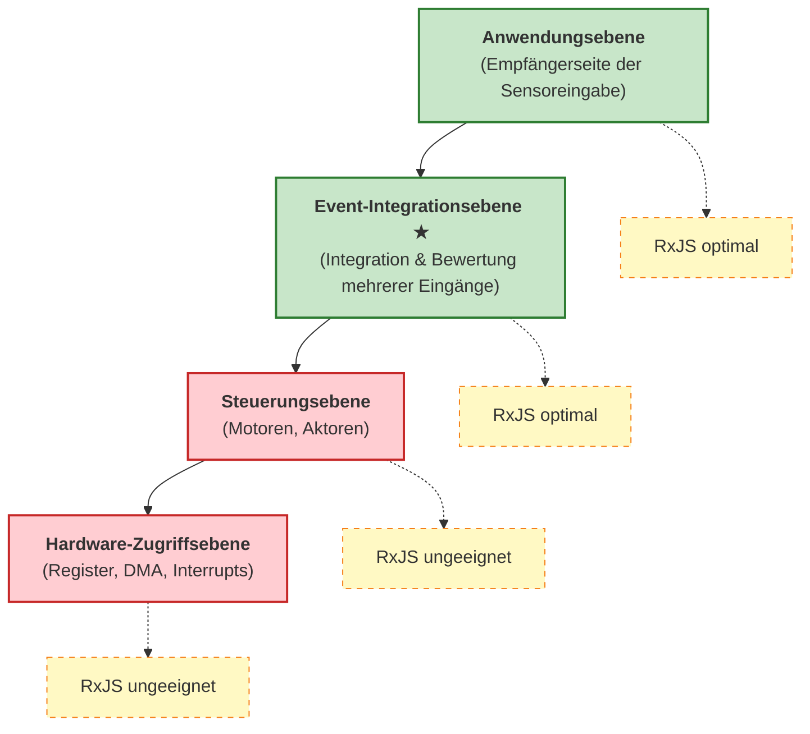

# Embedded und RP

Dieser Artikel erklärt, wie reaktive Programmierung, insbesondere asynchrone Stream-Verarbeitung wie RxJS, in Embedded-Systemen eingesetzt werden kann, sowie deren Möglichkeiten und Einschränkungen.

## Was ist reaktive Programmierung?

Reaktive Programmierung ist ein **deklarativer Ansatz zur Handhabung asynchroner Datenströme auf der Zeitachse**. Sie behandelt Ereignisse und Datenflüsse als "Werte, die sich im Laufe der Zeit ändern" und führt Transformationen, Kombinationen und Filterungen durch.

Bei der traditionellen imperativen Programmierung muss man explizit beschreiben, "wann" und "wie" etwas verarbeitet wird, während bei der reaktiven Programmierung deklarativ beschrieben wird, "was" verarbeitet werden soll.

```ts
// Traditioneller imperativer Ansatz
let sensorValue = 0;
setInterval(() => {
  sensorValue = readSensor();
  if (sensorValue > threshold) {
    handleAlert(sensorValue);
  }
}, 100);

// Reaktiver Ansatz
sensorStream$
  .pipe(
    filter(value => value > threshold)
  )
  .subscribe(value => handleAlert(value));
```

Beim reaktiven Ansatz sind Datenfluss und Verarbeitungslogik klar getrennt, was die Lesbarkeit und Wartbarkeit verbessert.

## Herausforderungen in der Embedded-Entwicklung

Die Gründe, warum reaktive Programmierung in Embedded-Systemen nicht weit verbreitet ist, liegen in folgenden Einschränkungen:

### 1. Leistungseinschränkungen

Viele Embedded-Systeme erfordern **Reaktionszeiten im Mikrosekundenbereich**.

```ts
// ❌ Ungeeignet für Embedded-Steuerungsebene
motorControl$
  .pipe(
    map(signal => processSignal(signal)),  // Muss in wenigen Dutzend μs abgeschlossen sein
    filter(value => value > threshold)
  )
  .subscribe(value => actuateMotor(value));
```

::: warning Probleme
- RxJS-Operator-Ketten haben erheblichen Overhead
- Garbage Collection kann auftreten
- Reaktionszeiten sind schwer vorhersagbar
:::

### 2. Speicherbeschränkungen

Embedded-Systeme arbeiten mit begrenztem Speicher (einige KB bis MB).

::: warning Probleme
- Dynamische Speicherzuweisung ist oft verboten
- Observable-interne Zustände verbrauchen Speicher
- Pufferungsoperatoren (`buffer`, `window`) verwenden besonders viel Speicher
:::

### 3. Hohe Abstraktionsebene

Reaktive Programmierung hat eine hohe Abstraktionsebene und ist nicht für hardwarenahe Steuerung geeignet.

::: warning Probleme
- Nicht für Registeroperationen oder DMA-Steuerung geeignet
- Ungeeignet für Verarbeitung, die feinkörnige Kontrolle auf Bitebene erfordert
- Komplexes Debugging (Verfolgung asynchroner Streams ist schwierig)
:::

### 4. Kompatibilität mit RTOS

Real-Time Operating Systems (RTOS) verwenden prioritätsbasiertes Task-Scheduling, während RxJS auf Event-Loops basiert.

::: warning Probleme
- Prioritätsinversion kann auftreten
- Task-Ausführungszeitpunkte sind schwer vorhersagbar
- Echtzeit-Garantien sind schwierig zu gewährleisten
:::

## Optimale Anwendungsebene: Event-Integrationsebene

Die Ebene, auf der reaktive Programmierung in Embedded-Systemen am effektivsten ist, ist die **"Event-Integrationsebene"**.

### Wo das reaktive Modell am nützlichsten ist: Empfängerseite der Sensoreingabe

In Embedded-Systemen zeigt reaktive Programmierung ihren wahren Wert auf der **Datenempfangsseite (Sensoreingabe)**.

#### Stärken des reaktiven Modells auf der Empfängerseite (Sensoreingabe)
- Integration asynchroner Daten von mehreren Sensoren
- Deklarative Beschreibung zeitlicher Korrelationen
- Ereignisgesteuerte Verarbeitung kann natürlich ausgedrückt werden
- Zustandsverwaltung und Filterung sind einfach

#### Herausforderungen des reaktiven Modells auf der Sendeseite (Steuerungsausgabe)
- Echtzeitgarantien sind schwierig (Reaktionszeiten im Mikrosekundenbereich erforderlich)
- Overhead ist nicht akzeptabel
- Zu hohe Abstraktion für direkte Hardware-Steuerung

### Merkmale und Vorteile von Sensoreingabe-Streams

| Merkmal | Traditioneller imperativer Ansatz | Reaktiver Ansatz | Vorteile |
|---------|----------------------------------|------------------|----------|
| **Integration mehrerer Sensoren** | Polling für jeden Sensor, manuelle Synchronisation | Deklarative Integration mit `combineLatest`, `merge` | Code ist prägnant, Absicht ist klar |
| **Aggregation in Zeitfenstern** | Manuelle Verwaltung von Timern und Puffern | Automatisierung mit `bufferTime`, `windowTime` | Weniger Implementierungsfehler, bessere Wartbarkeit |
| **Rauschunterdrückung** | Implementierung gleitender Durchschnitte mit Schleifen und Array-Operationen | Deklarative Beschreibung mit `scan` + `map` | Hohe Lesbarkeit, wiederverwendbar |
| **Anomalieerkennung** | Komplexe Verschachtelung von Flags und Bedingungen | Klarer Ausdruck mit `pairwise` + `filter` | Logik ist nachvollziehbar |
| **Event-Korrelation** | Verfolgung von Ereignissen mit Zustandsvariablen, manuelle Bewertung | Mustererkennung mit `merge` + `bufferTime` | Deklarativ, leicht erweiterbar |
| **Abmeldung** | Manuelle Flag-Verwaltung, anfällig für Lecks | Automatische Abmeldung mit `takeUntil` | Verhindert Speicherlecks |

### Unterschied zur Steuerseite (Sendeseite)

Es ist wichtig, den Unterschied zwischen "Empfängerseite" und "Sendeseite" in Embedded-Systemen zu verstehen.

| Aspekt | Empfängerseite (Sensoreingabe) | Sendeseite (Steuerungsausgabe) |
|--------|-------------------------------|-------------------------------|
| **Echtzeitanforderungen** | Millisekundenbereich (relativ locker) | Mikrosekundenbereich (streng) |
| **Verarbeitungsnatur** | Asynchron, ereignisgesteuert | Synchron, periodische Ausführung |
| **Komplexität** | Integration mehrerer Quellen, Zustandsverwaltung | Einfache Ausgabe, Fokus auf Geschwindigkeit |
| **RxJS-Eignung** | ✅ **Optimal** - Stark bei Event-Integration | ❌ **Ungeeignet** - Hoher Overhead |
| **Hauptverarbeitung** | Filterung, Glättung, Korrelationserkennung | PWM-Steuerung, Motorantrieb, DMA-Transfer |

::: tip Spezialisierung auf die "Empfängerseite" der Sensoreingabe
Reaktive Programmierung ist am effektivsten, wenn **mehrere asynchrone Ereignisse auf der Zeitachse integriert und bewertet** werden müssen. Nutzen Sie sie spezialisiert auf der "Empfängerseite" der Sensoreingabe, nicht auf der "Sendeseite" wie Steuerungsausgaben.
:::

### Schichtung der Systemarchitektur



#### Merkmale der Event-Integrationsebene
- Integration von Eingängen von mehreren Sensoren und Ereignisquellen
- Bewertung zeitlicher Korrelationen
- Relativ lockere Echtzeitanforderungen (Millisekundenbereich)
- Fokus auf Zustandsverwaltung und Bedingungsbewertung

## Praktische Anwendungsbeispiele

### 1. Sensordaten-Glättung

Glättet Eingänge von mehreren Sensoren und entfernt Rauschen.

```ts
import { interval, combineLatest } from 'rxjs';
import { map, scan, share } from 'rxjs';

// Simulation von Sensor-Streams
const temperatureSensor$ = interval(100).pipe(
  map(() => 25 + Math.random() * 5), // 25-30℃
  share()
);

const humiditySensor$ = interval(100).pipe(
  map(() => 50 + Math.random() * 10), // 50-60%
  share()
);

// Glättung durch gleitenden Durchschnitt
function movingAverage(windowSize: number) {
  return scan<number, number[]>((acc, value) => {
    const newWindow = [...acc, value];
    if (newWindow.length > windowSize) {
      newWindow.shift();
    }
    return newWindow;
  }, []).pipe(
    map(window => window.reduce((sum, val) => sum + val, 0) / window.length)
  );
}

const smoothedTemperature$ = temperatureSensor$.pipe(
  movingAverage(5),
  map(value => Math.round(value * 10) / 10)
);

const smoothedHumidity$ = humiditySensor$.pipe(
  movingAverage(5),
  map(value => Math.round(value * 10) / 10)
);

// Integrierte Umgebungsdaten
combineLatest([smoothedTemperature$, smoothedHumidity$])
  .pipe(
    map(([temp, humidity]) => ({
      temperature: temp,
      humidity: humidity,
      heatIndex: calculateHeatIndex(temp, humidity),
      timestamp: Date.now()
    }))
  )
  .subscribe(data => {
    console.log('Umgebungsdaten:', data);
  });

function calculateHeatIndex(temp: number, humidity: number): number {
  // Vereinfachte Berechnung des gefühlten Temperaturindex
  return temp + (0.5555 * (6.11 * Math.exp(5417.753 * ((1/273.16) - (1/(273.15 + temp)))) - 10));
}
```

> [!NOTE] Vorteile der Sensorintegration
> - Zeitlich synchronisierte Verarbeitung mehrerer Sensorwerte
> - Rauschunterdrückung durch gleitenden Durchschnitt
> - Deklarative Ableitung berechneter Werte (wie gefühlte Temperatur)

### 2. Event-Korrelationserkennung

Erkennt, wenn mehrere Ereignisse innerhalb eines bestimmten Zeitfensters auftreten.

```ts
import { Subject, merge } from 'rxjs';
import { filter, bufferTime, map } from 'rxjs';

// Event-Streams
const motionDetected$ = new Subject<{ sensor: string; timestamp: number }>();
const doorOpened$ = new Subject<{ door: string; timestamp: number }>();
const lightOn$ = new Subject<{ room: string; timestamp: number }>();

// Integration aller Ereignisse
const allEvents$ = merge(
  motionDetected$.pipe(map(e => ({ type: 'motion', ...e }))),
  doorOpened$.pipe(map(e => ({ type: 'door', ...e }))),
  lightOn$.pipe(map(e => ({ type: 'light', ...e })))
);

// Aggregation von Ereignissen in 1-Sekunden-Zeitfenstern
allEvents$
  .pipe(
    bufferTime(1000),
    filter(events => events.length > 0),
    map(events => {
      const hasMotion = events.some(e => e.type === 'motion');
      const hasDoor = events.some(e => e.type === 'door');
      const hasLight = events.some(e => e.type === 'light');

      return {
        timestamp: Date.now(),
        events,
        pattern: {
          hasMotion,
          hasDoor,
          hasLight
        }
      };
    }),
    filter(result =>
      // Erkennung eines Raumbetrittungsmusters
      result.pattern.hasMotion && result.pattern.hasDoor
    )
  )
  .subscribe(result => {
    console.log('Raumbetrittung erkannt:', result);
    // Automatisches Einschalten der Beleuchtung, wenn nicht bereits an
    if (!result.pattern.hasLight) {
      console.log('→ Automatisches Einschalten der Beleuchtung');
    }
  });

// Simulation von Ereignissen
setTimeout(() => motionDetected$.next({ sensor: 'entry', timestamp: Date.now() }), 100);
setTimeout(() => doorOpened$.next({ door: 'front', timestamp: Date.now() }), 200);
```

> [!TIP] Nutzung der Event-Korrelation
> - Situationsabschätzung aus mehreren Ereignissen innerhalb von Zeitfenstern
> - Anomalieerkennung in Sicherheitssystemen
> - Automatisierungslogik für Smart Homes

### 3. Anomalieerkennung

Erkennt abnormale Muster in Sensorwerten.

```ts
import { interval } from 'rxjs';
import { map, pairwise, filter, share } from 'rxjs';

// Simulation eines Vibrationssensors
const vibrationSensor$ = interval(50).pipe(
  map(() => {
    // Normal: 0-10, abnormal: 50+
    const normal = Math.random() * 10;
    const isAbnormal = Math.random() < 0.05; // 5% Wahrscheinlichkeit für Anomalie
    return isAbnormal ? 50 + Math.random() * 20 : normal;
  }),
  share()
);

// Anomalieerkennungslogik
vibrationSensor$
  .pipe(
    pairwise(), // Paarweise aufeinanderfolgende Werte
    map(([prev, current]) => ({
      prev,
      current,
      delta: Math.abs(current - prev),
      timestamp: Date.now()
    })),
    filter(data =>
      // Schwellenwert überschritten oder abrupte Änderung
      data.current > 30 || data.delta > 20
    )
  )
  .subscribe(data => {
    console.log('⚠️ Anomalie erkannt:', {
      aktuellerWert: data.current.toFixed(2),
      änderung: data.delta.toFixed(2),
      zeitstempel: new Date(data.timestamp).toISOString()
    });
  });
```

> [!WARNING] Hinweise zur Anomalieerkennung
> - Schwellenwertanpassung ist wichtig (abhängig von Umgebung und Gerät)
> - Filterung zur Reduzierung von Fehlalarmen erforderlich
> - Effektive Maßnahmen wie das Auslösen von Alarmen nur bei mehreren aufeinanderfolgenden Anomalien

### 4. Zustandsschätzung

Schätzt den Gerätezustand aus mehreren Sensorwerten.

```ts
import { combineLatest, interval } from 'rxjs';
import { map, distinctUntilChanged, share } from 'rxjs';

// Sensor-Streams
const current$ = interval(100).pipe(
  map(() => 1.5 + Math.random() * 0.5), // Stromwert 1,5-2,0A
  share()
);

const temperature$ = interval(100).pipe(
  map(() => 40 + Math.random() * 10), // Temperatur 40-50℃
  share()
);

const vibration$ = interval(100).pipe(
  map(() => 5 + Math.random() * 5), // Vibrationswert 5-10
  share()
);

// Zustandsdefinition
type MachineState = 'idle' | 'running' | 'overload' | 'warning';

interface MachineStatus {
  state: MachineState;
  current: number;
  temperature: number;
  vibration: number;
  timestamp: number;
}

// Zustandsschätzungslogik
combineLatest([current$, temperature$, vibration$])
  .pipe(
    map(([current, temperature, vibration]): MachineStatus => {
      let state: MachineState = 'idle';

      // Zustandsbestimmungslogik
      if (current > 1.8 && temperature > 45 && vibration > 8) {
        state = 'overload';
      } else if (temperature > 48 || vibration > 9) {
        state = 'warning';
      } else if (current > 1.6) {
        state = 'running';
      }

      return {
        state,
        current: Math.round(current * 100) / 100,
        temperature: Math.round(temperature * 10) / 10,
        vibration: Math.round(vibration * 10) / 10,
        timestamp: Date.now()
      };
    }),
    distinctUntilChanged((prev, curr) => prev.state === curr.state) // Benachrichtigung nur bei Zustandsänderung
  )
  .subscribe(status => {
    console.log(`Gerätezustand: ${status.state}`, {
      strom: `${status.current}A`,
      temperatur: `${status.temperature}℃`,
      vibration: status.vibration
    });

    // Zustandsabhängige Verarbeitung
    switch (status.state) {
      case 'overload':
        console.log('🔴 Überlast erkannt - Gerät wird gestoppt');
        break;
      case 'warning':
        console.log('🟡 Warnung - Überwachung wird verstärkt');
        break;
    }
  });
```

> [!IMPORTANT] Wichtige Punkte bei der Zustandsschätzung
> - Zustandsbestimmung durch Kombination mehrerer Sensorwerte
> - Verarbeitung nur bei Zustandsänderungen mit `distinctUntilChanged`
> - Beginn mit einfachen schwellenwertbasierten Regeln, Integration von maschinellem Lernen bei Bedarf

## Best Practices

### 1. Auswahl der Anwendungsebene

```ts
// ✅ Gutes Beispiel: Verwendung auf der Event-Integrationsebene
const userActivity$ = merge(
  buttonClick$,
  sensorInput$,
  timerEvent$
).pipe(
  debounceTime(100),
  map(event => processEvent(event))
);

// ❌ Schlechtes Beispiel: Verwendung auf der Steuerungsebene
const motorControl$ = interval(10).pipe(  // 10ms ist zu langsam für die Steuerungsebene
  map(() => readEncoder()),
  map(value => calculatePID(value))
);
```

### 2. Speicherverwaltung

```ts
// ✅ Zuverlässige Abmeldung
import { Subject } from 'rxjs';
import { takeUntil } from 'rxjs';

class SensorManager {
  private destroy$ = new Subject<void>();

  start() {
    sensorStream$
      .pipe(
        takeUntil(this.destroy$)
      )
      .subscribe(data => this.process(data));
  }

  stop() {
    this.destroy$.next();
    this.destroy$.complete();
  }

  private process(data: any) {
    // Verarbeitung
  }
}
```

### 3. Begrenzung der Puffergröße

```ts
// ✅ Explizite Begrenzung der Puffergröße
import { bufferTime } from 'rxjs';

sensorStream$
  .pipe(
    bufferTime(1000, null, 100) // Maximum 100 Elemente
  )
  .subscribe(batch => processBatch(batch));

// ❌ Unbegrenzte Puffer vermeiden
sensorStream$
  .pipe(
    bufferTime(10000) // 10-Sekunden-Puffer → Risiko von Speichermangel
  )
  .subscribe(batch => processBatch(batch));
```

### 4. Fehlerbehandlung

```ts
import { catchError, retry } from 'rxjs';
import { of } from 'rxjs';

sensorStream$
  .pipe(
    retry({ count: 3, delay: 1000 }),
    catchError(error => {
      console.error('Sensorfehler:', error);
      // Rückgabe eines Standardwerts oder Fallback-Verarbeitung
      return of({ value: 0, error: true });
    })
  )
  .subscribe(data => {
    if (data.error) {
      handleSensorFailure();
    } else {
      processNormalData(data);
    }
  });
```

## Zusammenfassung

Wichtige Punkte zur Nutzung reaktiver Programmierung in der Embedded-Entwicklung:

### Anwendbare Bereiche
- ✅ **Event-Integrationsebene** - Sensorintegration, Event-Korrelationserkennung
- ✅ **Anwendungsebene** - Zustandsschätzung, Anomalieerkennung, Datenvisualisierung
- ❌ **Steuerungsebene** - Motorsteuerung, Aktoren (Echtzeitanforderungen)
- ❌ **Hardware-Zugriffsebene** - Registeroperationen, DMA, Interrupt-Behandlung

### Effektive Anwendungsbeispiele
- ✅ Sensordaten-Glättung und -Integration
- ✅ Event-Korrelationserkennung auf der Zeitachse
- ✅ Erkennung abnormaler Muster
- ✅ Zustandsschätzung aus mehreren Sensoren

### Wichtige Hinweise
- ⚠️ Überwachung und Begrenzung der Speichernutzung
- ⚠️ Zuverlässige Ausführung der Abmeldung
- ⚠️ Explizite Begrenzung der Puffergröße
- ⚠️ Angemessene Fehlerbehandlung

Reaktive Programmierung kann nicht auf "alle Ebenen" von Embedded-Systemen angewendet werden, ist aber auf der **Event-Integrationsebene** sehr effektiv. Durch die Nutzung auf der richtigen Ebene können Lesbarkeit und Wartbarkeit des Codes erheblich verbessert werden.

## Zukunftsausblick: Reaktive wird auch in Embedded unumgänglich

Embedded-Systeme entwickeln sich weiter, und die Bedeutung reaktiver Programmierung wird in Zukunft noch zunehmen.

### Explosionsartiger Anstieg der Sensoranzahl

Moderne Embedded-Systeme, insbesondere IoT-Geräte und intelligente Systeme, verarbeiten eine rapide wachsende Anzahl von Sensoren.

#### Komplexität der Sensorintegration
- Automobile: Dutzende bis Hunderte von Sensoren (ADAS, autonomes Fahren)
- Smart Homes: Viele Sensoren wie Temperatur, Feuchtigkeit, Bewegung, Türen, Fenster, Kameras
- Industrieanlagen: Umfassende Überwachung von Vibration, Temperatur, Strom, Druck, Position
- Wearables: Herzfrequenz, Beschleunigung, Gyroskop, GPS, Luftdruck usw.

#### Grenzen des traditionellen imperativen Ansatzes
```ts
// ❌ Imperativer Ansatz versagt bei 10+ Sensoren
let temp1, temp2, temp3, humidity1, humidity2, motion1, motion2;
let lastUpdate1, lastUpdate2, lastUpdate3;
// ... Variablen vermehren sich endlos

setInterval(() => {
  temp1 = readSensor1();
  temp2 = readSensor2();
  // ... Polling-Code wird sehr umfangreich

  if (temp1 > threshold1 && humidity1 > threshold2 && ...) {
    // ... Bedingte Verzweigungen werden komplex
  }
}, 100);
```

#### Notwendigkeit des reaktiven Ansatzes
```ts
// ✅ Deklarative Beschreibung auch bei steigender Sensoranzahl
const allSensors$ = combineLatest({
  temp1: temperatureSensor1$,
  temp2: temperatureSensor2$,
  temp3: temperatureSensor3$,
  humidity1: humiditySensor1$,
  humidity2: humiditySensor2$,
  motion1: motionSensor1$,
  motion2: motionSensor2$,
  // Einfaches Hinzufügen weiterer Sensoren durch Zeilen
});

allSensors$
  .pipe(
    map(sensors => evaluateConditions(sensors)),
    filter(result => result.shouldAlert)
  )
  .subscribe(result => handleAlert(result));
```

### Aufstieg des Edge Computing

Die Bedeutung der Datenverarbeitung auf Edge-Geräten nimmt zu, um die Abhängigkeit von der Cloud zu reduzieren.

#### Anforderungen am Edge
- Echtzeit-Datenverarbeitung von mehreren Sensoren
- Lokale Anomalieerkennung und Mustererkennung
- Ausführung leichtgewichtiger maschineller Lernmodelle
- Autonomer Betrieb bei Netzwerkausfällen

Diese Anforderungen passen gut zur **asynchronen Stream-Verarbeitung**, wodurch reaktive Programmierung zur natürlichen Wahl wird.

### Entwicklung der Hardware

Die Leistungssteigerung von Embedded-Prozessoren macht den Overhead reaktiver Programmierung zunehmend akzeptabel.

| Zeitraum | Prozessorleistung | Speicher | Anwendbarkeit reaktiver Programmierung |
|----------|------------------|----------|---------------------------------------|
| 2000er | Einige MHz, 8-bit | Einige KB | ❌ Schwierig - hoher Overhead |
| 2010er | Dutzende-Hunderte MHz, 32-bit | Dutzende KB bis MB | △ Begrenzt - nur Event-Ebene |
| 2020er und später | GHz-Klasse, 64-bit, Multicore | Hunderte MB bis GB | ✅ **Praktikabel** - auf vielen Ebenen anwendbar |

#### Beispiele moderner Embedded-Prozessoren
- Raspberry Pi 4: 1,5 GHz Quad-Core, bis zu 8 GB RAM
- ESP32: 240 MHz Dual-Core, 520 KB SRAM
- STM32H7: 480 MHz, 1 MB RAM

Auf dieser Hardware ist der RxJS-Overhead durchaus akzeptabel.

### Notwendigkeit reaktiver Programmierung

Aus folgenden Gründen wird reaktive Programmierung auch in Embedded-Systemen nicht **optional, sondern unvermeidlich**:

::: info Gründe, warum reaktive Programmierung unvermeidlich wird

1. **Steigende Sensoranzahl** - Verwaltung von Dutzenden bis Hunderten von Sensoren stößt imperativ an Grenzen
2. **Bedeutung zeitlicher Korrelationserkennung** - Mustererkennung von Ereignissen ist unerlässlich
3. **Aufstieg von Edge-KI** - Optimal für Vorverarbeitung von Sensordaten
4. **Code-Wartbarkeit** - Notwendigkeit deklarativer Beschreibung komplexer Systeme
5. **Hardware-Entwicklung** - Overhead wird akzeptabel
:::

### Praktische Migrationsstrategie

Strategie zur Einführung reaktiver Programmierung in bestehende Embedded-Systeme:

#### Schrittweise Einführung
1. **Phase 1**: Testeinführung reaktiver Ansätze bei neuen Funktionen (Sensorintegrationsebene)
2. **Phase 2**: Ersetzung von Event-Verarbeitungsteilen durch reaktive Ansätze
3. **Phase 3**: Reaktivierung der gesamten Anwendungsebene
4. **Steuerungsebene bleibt traditionell** - keine Änderung bei echtzeitkritischen Teilen

**Hybrid-Ansatz:**
```ts
// Steuerungsebene: Traditionell imperativ (Reaktionszeit im Mikrosekundenbereich)
function controlMotor(speed: number) {
  // Direkte Registeroperationen, Hochgeschwindigkeitsverarbeitung
  writeRegister(MOTOR_CONTROL_REG, speed);
}

// Event-Integrationsebene: Reaktiv (Reaktionszeit im Millisekundenbereich)
const motorSpeedCommand$ = combineLatest([
  targetSpeed$,
  currentLoad$,
  temperatureLimit$
]).pipe(
  map(([target, load, tempLimit]) => calculateOptimalSpeed(target, load, tempLimit))
);

motorSpeedCommand$.subscribe(speed => {
  // Übergabe des reaktiv ermittelten Werts an traditionelle Steuerungsfunktion
  controlMotor(speed);
});
```

Durch diese Kombination von **reaktiver Programmierung (Empfängerseite)** und **traditioneller imperativer Steuerung (Sendeseite)** können die Vorteile beider Ansätze genutzt werden.

## Verwandte Seiten

- [RxJS-Einführung](/de/guide/introduction) - Grundkonzepte von RxJS
- [Observable-Erstellung](/de/guide/observables/creation) - Erstellung von Sensor-Streams
- [Kombinationsoperatoren](/de/guide/operators/combination/) - Details zu combineLatest, merge
- [Filteroperatoren](/de/guide/operators/filtering/) - Nutzung von filter, debounceTime
- [Fehlerbehandlung](/de/guide/error-handling/strategies) - Behandlung von Sensorfehlern
- [Performance-Debugging](/de/guide/debugging/performance) - Überwachung der Speichernutzung

## Referenzen

- [GitHub Discussions - Beziehung zwischen Embedded-Entwicklung und reaktiver Programmierung](https://github.com/shuji-bonji/RxJS-with-TypeScript/discussions/13)
- [RxJS Offizielle Dokumentation](https://rxjs.dev/)
