# Karte der reaktiven Architektur

Die reaktive Programmierung hat sich über Bibliotheken und Frameworks hinaus zu einer **Systemarchitektur-Philosophie** entwickelt.

Diese Seite erklärt systematisch die **Gesamtkarte der reaktiven Architektur** in sieben Schichten, von der Benutzeroberfläche über Backend, Datenpipeline, IoT bis zu Steuerungssystemen.

## Was ist reaktive Architektur?

Reaktive Architektur ist ein Systemdesign-Ansatz, der sich auf **zeitlich veränderliche Werte (Time-Varying Values)** konzentriert.

#### Kerngedanke
> Von UI-Klicks über IoT-Sensoren und Datenströme bis zur Robotersteuerung - alles **reagiert auf zeitlich veränderliche Werte**

Um diese Philosophie umzusetzen, definiert das [Reactive Manifesto](https://www.reactivemanifesto.org/) vier wichtige Eigenschaften.

## Die vier Eigenschaften des Reactive Manifesto

Das Reactive Manifesto definiert vier Eigenschaften, die ein reaktives System haben sollte.


### 1. Responsive (Reaktionsfähigkeit)

Das System reagiert **konsistent und schnell** auf Benutzereingaben und Umgebungsänderungen.

::: tip Konkrete Beispiele
- Sofortiges Feedback auf UI-Operationen
- Vorhersagbare API-Antwortzeiten
- Echtzeit-Datenaktualisierung
:::

### 2. Resilient (Widerstandsfähigkeit)

Bei Ausfällen wird das System **teilweise wiederhergestellt** und stoppt nicht vollständig.

::: tip Konkrete Beispiele
- Fehlerbehandlung und Fallback
- Service-Isolation (Microservices)
- Automatische Wiederholung und Circuit Breaker
:::

### 3. Elastic (Elastizität)

Effiziente Skalierung durch **dynamische Ressourcenanpassung** entsprechend der Last.

::: tip Konkrete Beispiele
- Auto-Scaling
- Lastverteilung
- Backpressure-Steuerung
:::

### 4. Message-Driven (Nachrichtengesteuert)

Komponenten kommunizieren über **asynchrone Nachrichten** für lose Kopplung.

::: tip Konkrete Beispiele
- Event Bus
- Message Queues (Kafka, RabbitMQ)
- Observable/Subscriber-Pattern
:::

::: info Bedeutung des Reactive Manifesto
Diese vier Eigenschaften bilden die **theoretische Grundlage** der reaktiven Architektur. RxJS und ReactiveX sind nur Werkzeuge zur Umsetzung dieser Eigenschaften.
:::

## Die sieben Schichten der reaktiven Architektur

Die reaktive Architektur besteht aus den folgenden sieben Schichten.

| # | Schicht | Übersicht | Typische Technologien |
|---|---|------|------------|
| 1 | **Reactive UI** | UI mit sofortiger Reaktion auf Benutzereingaben | RxJS, Angular Signals, Svelte Runes, React Hooks |
| 2 | **Reactive Communication** | Stream-Kommunikation zwischen Client/Server | WebSocket, SSE, GraphQL Subscriptions |
| 3 | **Reactive Backend** | Ereignisgesteuerte, nicht-blockierende Server | Akka, Spring WebFlux, Vert.x, Node.js Streams |
| 4 | **Reactive Data Pipeline** | Event-Streams als erstklassiges Datenmodell | Kafka, Flink, Apache Beam, Reactor |
| 5 | **Reactive IoT/Embedded** | Integration und Fusion von Sensor-Streams | ROS2, RxCpp, RxRust, Zephyr |
| 6 | **Reactive Control** | Feedback-Schleifen von Sensoren zur Steuerung | Behavior Trees, Digital Twin, MPC |
| 7 | **Reactive UX** | Closed-Loop-UX über alle Schichten | Auto-Save, Echtzeit-Collaboration |

### Gesamtarchitektur-Diagramm


## 1. Reactive UI (Frontend)

Diese Schicht aktualisiert den Bildschirm **in Echtzeit** als Reaktion auf Benutzereingaben und asynchrone Operationen.

### Kerngedanke

> UI ist eine "Projektion eines sich zeitlich ändernden Zustands"

### Typischer Technologie-Stack

- **RxJS** - Stream-Verarbeitung mit Observable/Operator
- **Angular Signals** - Reaktive Primitive in Angular 19+
- **Svelte Runes** - $state, $derived in Svelte 5
- **React Hooks** - Zustandsverwaltung mit useState, useEffect
- **Vue Reactivity** - Reaktivität durch ref, reactive, computed
- **SolidJS** - Feinkörnige Reaktivität auf Signal-Basis

### Implementierungsbeispiel (RxJS)

```typescript
import { fromEvent } from 'rxjs';
import { debounceTime, distinctUntilChanged, map } from 'rxjs';

// Reaktive UI für Suchfeld
const searchInput = document.querySelector<HTMLInputElement>('#search');
const resultsDiv = document.querySelector<HTMLDivElement>('#results');

const input$ = fromEvent(searchInput!, 'input').pipe(
  map(event => (event.target as HTMLInputElement).value),
  debounceTime(300),                    // 300ms warten (auf Tippende warten)
  distinctUntilChanged()                // Gleiche Werte ignorieren
);

input$.subscribe(async searchTerm => {
  if (searchTerm.length === 0) {
    resultsDiv!.innerHTML = '';
    return;
  }

  // API-Aufruf
  const results = await fetch(`/api/search?q=${encodeURIComponent(searchTerm)}`)
    .then(res => res.json());

  // UI sofort aktualisieren
  resultsDiv!.innerHTML = results
    .map((r: any) => `<div class="result">${r.title}</div>`)
    .join('');
});
```

::: tip Vorteile von Reactive UI
- Reduzierung unnötiger API-Aufrufe durch Debounce/Throttle
- Verbesserte Lesbarkeit durch deklarative Beschreibung
- Einfache Integration mehrerer asynchroner Prozesse
:::

## 2. Reactive Communication (Kommunikationsschicht)

Diese Schicht realisiert **bidirektionales Daten-Streaming** zwischen Client und Server.

### Typischer Technologie-Stack

- **WebSocket** - Vollduplex-Kommunikationsprotokoll
- **Server-Sent Events (SSE)** - Unidirektionaler Stream vom Server zum Client
- **GraphQL Subscriptions** - Echtzeit-Subscription-Funktion von GraphQL
- **tRPC** - Typsicheres RPC-Framework
- **RxDB** - Reaktive Datenbank (Offline-Unterstützung)

### Implementierungsbeispiel (WebSocket + RxJS)

```typescript
import { webSocket } from 'rxjs/webSocket';
import { retry, catchError } from 'rxjs';
import { of } from 'rxjs';

// WebSocket als Observable behandeln
const socket$ = webSocket<{ type: string; data: any }>({
  url: 'wss://example.com/socket',
  openObserver: {
    next: () => console.log('✅ WebSocket-Verbindung erfolgreich')
  },
  closeObserver: {
    next: () => console.log('❌ WebSocket getrennt')
  }
});

// Echtzeit-Datenempfang
socket$
  .pipe(
    retry({ count: 3, delay: 1000 }),  // Automatische Wiederverbindung
    catchError(error => {
      console.error('WebSocket-Fehler:', error);
      return of({ type: 'error', data: error });
    })
  )
  .subscribe(message => {
    switch (message.type) {
      case 'stock_price':
        updateStockChart(message.data);
        break;
      case 'notification':
        showNotification(message.data);
        break;
      // ... andere Nachrichtentypen
    }
  });

// Nachricht an Server senden
socket$.next({ type: 'subscribe', data: { symbol: 'AAPL' } });
```

::: info Affinität zwischen WebSocket und Observable
Das `onmessage`-Event von WebSocket ist das Observable-Pattern selbst. Die webSocket-Funktion von RxJS abstrahiert dies und erleichtert Retry und Fehlerbehandlung.
:::

## 3. Reactive Backend

Diese Schicht realisiert skalierbare Serverarchitektur durch **ereignisgesteuerte, nicht-blockierende I/O**.

### Typischer Technologie-Stack

- **Akka (Scala/Java)** - Actor-Model-basiertes Framework
- **Vert.x (JVM)** - Polyglott-reaktives Toolkit
- **Spring WebFlux (Java)** - Nicht-blockierendes Web-Framework auf Project Reactor-Basis
- **Node.js Streams** - Stream-basierte I/O-Verarbeitung
- **Elixir/Phoenix LiveView** - Echtzeit-Framework auf BEAM VM

### Konzept des Actor-Modells

Das Actor-Modell ist ein Nebenläufigkeitsmodell, das **Isolation** und **asynchrones Message-Passing** kombiniert.


### Implementierungsbeispiel (Akka - Scala)

```scala
import akka.actor.{Actor, ActorRef, Props}

// Sensor-Actor
class SensorActor extends Actor {
  def receive: Receive = {
    case SensorData(value) =>
      // Daten verarbeiten
      val processed = transform(value)
      // An Parent-Actor senden
      context.parent ! ProcessedData(processed)

    case ErrorOccurred(error) =>
      // Fehlerbehandlung
      context.parent ! FailureReport(error)
  }

  private def transform(value: Double): Double = {
    // Datentransformationslogik
    value * 2.0
  }
}

// Supervisor Actor
class SupervisorActor extends Actor {
  val sensor1: ActorRef = context.actorOf(Props[SensorActor], "sensor1")
  val sensor2: ActorRef = context.actorOf(Props[SensorActor], "sensor2")

  def receive: Receive = {
    case StartMonitoring =>
      sensor1 ! SensorData(10.5)
      sensor2 ! SensorData(20.3)

    case ProcessedData(value) =>
      println(s"Empfangene Daten: $value")
      // Aggregationsverarbeitung etc.
  }
}

// Nachrichtendefinitionen
case class SensorData(value: Double)
case class ProcessedData(value: Double)
case object StartMonitoring
case class ErrorOccurred(error: Throwable)
case class FailureReport(error: Throwable)
```

::: tip Vorteile des Actor-Modells
- **Fehler-Isolation** - Wenn ein Actor ausfällt, sind andere nicht betroffen
- **Skalierbarkeit** - Actors sind leichtgewichtig, Millionen können gestartet werden
- **Nachrichtengesteuert** - Entspricht den Prinzipien des Reactive Manifesto
:::

## 4. Reactive Data Pipeline (Datenpipeline)

Diese Schicht behandelt **Event-Streams als erstklassiges Datenmodell**.

### Kerngedanke

> "Event Stream is the new Database" (Event-Streams sind die neue Datenbank)

Ein Paradigmenwechsel von traditioneller datenbankzentrierter Architektur zu **Event-Stream-zentrierter Architektur**.

### Typischer Technologie-Stack

- **Apache Kafka** - Verteilte Event-Streaming-Plattform
- **Apache Flink** - Stream-Processing-Engine
- **Apache Beam** - Einheitliches Batch/Stream-Verarbeitungsmodell
- **Apache NiFi** - Datenfluss-Automatisierung
- **Project Reactor** - Reaktive Bibliothek auf JVM
- **Reactive Streams API** - JVM-Stream-Processing-Standard

### Datenpipeline-Pattern

```
Event Source → Parse → Validate → Enrich → Aggregate → Store/Forward
```

### Implementierungsbeispiel (Pseudocode)

```typescript
// Kafka + Flink-ähnliche Stream-Pipeline
stream
  .map(event => parseJSON(event))           // Parsen
  .filter(data => isValid(data))            // Validierung
  .map(data => enrichWithMetadata(data))    // Metadaten hinzufügen
  .groupBy(data => data.sensorId)           // Nach Sensor-ID gruppieren
  .window(10.seconds)                       // 10-Sekunden-Fenster
  .reduce((acc, value) => aggregate(acc, value))  // Aggregieren
  .sink(database)                           // In Datenbank speichern
```

### RxJS-Entsprechung

```typescript
import { interval } from 'rxjs';
import { map, filter, groupBy, bufferTime, mergeMap } from 'rxjs';

interface SensorEvent {
  sensorId: string;
  value: number;
  timestamp: number;
}

// Event-Stream-Simulation
const eventStream$ = interval(100).pipe(
  map((): SensorEvent => ({
    sensorId: `sensor-${Math.floor(Math.random() * 3)}`,
    value: Math.random() * 100,
    timestamp: Date.now()
  }))
);

// Datenpipeline
eventStream$
  .pipe(
    // Validierung
    filter(event => event.value >= 0 && event.value <= 100),

    // Nach Sensor-ID gruppieren
    groupBy(event => event.sensorId),

    // Jede Gruppe alle 10 Sekunden puffern
    mergeMap(group$ =>
      group$.pipe(
        bufferTime(10000),
        filter(events => events.length > 0),
        map(events => ({
          sensorId: events[0].sensorId,
          avgValue: events.reduce((sum, e) => sum + e.value, 0) / events.length,
          count: events.length,
          timestamp: Date.now()
        }))
      )
    )
  )
  .subscribe(aggregated => {
    console.log('Aggregierte Daten:', aggregated);
    // In Datenbank speichern
    saveToDatabase(aggregated);
  });

function saveToDatabase(data: any): void {
  // Datenbankspeicherlogik
}
```

::: warning Beziehung zu Event Sourcing
Event Sourcing ist ein Designmuster, das den Systemzustand als Ereignishistorie aufzeichnet. In Kombination mit Event-Streaming-Plattformen wie Kafka können leistungsstarke reaktive Datenpipelines erstellt werden.
:::

## 5. Reactive IoT/Embedded (IoT/Eingebettet)

Diese Schicht realisiert die Integration und Echtzeit-Fusion von Sensor-Streams.

### Typischer Technologie-Stack

- **ROS2 (Robot Operating System 2)** - Robotik-Entwicklungsplattform
- **RxCpp** - C++ ReactiveX
- **RxRust** - Rust ReactiveX
- **Zephyr RTOS** - IoT Echtzeit-Betriebssystem
- **TinyOS** - Sensornetzwerk-OS

### Unterschied zur UI

| Aspekt | Reactive UI | Reactive IoT |
|------|------------|--------------|
| **Reaktivitätsziel** | Benutzereingaben, API-Antworten | Sensorwerte, Steuersignale |
| **Echtzeitanforderung** | Millisekunden (UX-fokussiert) | Mikrosekunden (Steuerung-fokussiert) |
| **Hauptverarbeitung** | Anzeige, Validierung | Filterung, Fusion, Steuerung |

### Implementierungsbeispiel (ROS2 - Python)

```python
import rclpy
from rclpy.node import Node
from sensor_msgs.msg import LaserScan
from geometry_msgs.msg import Twist

class ObstacleAvoidance(Node):
    def __init__(self):
        super().__init__('obstacle_avoidance')

        # LiDAR-Sensordaten abonnieren
        self.subscription = self.create_subscription(
            LaserScan,
            '/scan',
            self.laser_callback,
            10
        )

        # Geschwindigkeitsbefehle veröffentlichen
        self.velocity_publisher = self.create_publisher(
            Twist,
            '/cmd_vel',
            10
        )

    def laser_callback(self, msg: LaserScan):
        # Sensordatenverarbeitung (reaktiv)
        min_distance = min(msg.ranges)

        # Reaktion auf Hinderniserkennung
        if min_distance < 0.5:  # Hindernis innerhalb von 50cm
            self.get_logger().warn(f'⚠️ Hindernis erkannt: {min_distance:.2f}m')
            self.stop_robot()
        else:
            self.move_forward()

    def stop_robot(self):
        twist = Twist()
        twist.linear.x = 0.0
        twist.angular.z = 0.0
        self.velocity_publisher.publish(twist)

    def move_forward(self):
        twist = Twist()
        twist.linear.x = 0.3  # 0.3 m/s vorwärts
        twist.angular.z = 0.0
        self.velocity_publisher.publish(twist)

def main(args=None):
    rclpy.init(args=args)
    node = ObstacleAvoidance()
    rclpy.spin(node)
    rclpy.shutdown()

if __name__ == '__main__':
    main()
```

::: info Sensorfusion und Reaktivität
Die "Sensorfusion", die Daten von mehreren Sensoren (LiDAR, Kamera, IMU, GPS) integriert, ist dasselbe Konzept wie `combineLatest` oder `merge` in RxJS.
:::

## 6. Reactive Control (Steuerungssysteme)

Diese Schicht realisiert Feedback-Schleifen von Sensoren zur Steuerung.

### Typischer Technologie-Stack

- **Behavior Trees** - Verhaltensauswahl für Roboter/Spiel-KI
- **Digital Twin** - Digitale Replikate physischer Systeme
- **Model Predictive Control (MPC)** - Prädiktive Steuerung
- **Cyber-Physical Systems (CPS)** - Cyber-physische Systeme

### Behavior Tree-Struktur


**Verhalten:**
1. Batteriestand über 20% → Zum Ziel bewegen
2. Batteriestand unter 20% → Zur Ladestation bewegen

### Reaktive Darstellung von Zustandsübergängen

Behavior Tree-Zustandsübergänge können mit `scan` oder `switchMap` in RxJS dargestellt werden.

```typescript
import { interval, Subject } from 'rxjs';
import { map, scan, switchMap } from 'rxjs';

type BatteryLevel = number; // 0-100
type RobotState = 'IDLE' | 'MOVING_TO_GOAL' | 'MOVING_TO_CHARGER' | 'CHARGING';

interface RobotStatus {
  state: RobotState;
  batteryLevel: BatteryLevel;
}

// Batteriestand-Simulation
const batteryLevel$ = interval(1000).pipe(
  scan((level, _) => Math.max(0, level - 1), 100) // Jede Sekunde 1% Abnahme
);

// Behavior Tree-Logik
const robotState$ = batteryLevel$.pipe(
  map((batteryLevel): RobotStatus => {
    // Selector (ODER)-Logik
    if (batteryLevel > 20) {
      // Sequence (UND)-Bedingung erfüllt
      return { state: 'MOVING_TO_GOAL', batteryLevel };
    } else {
      // Laden erforderlich
      return { state: 'MOVING_TO_CHARGER', batteryLevel };
    }
  })
);

robotState$.subscribe(status => {
  console.log(`State: ${status.state}, Battery: ${status.batteryLevel}%`);

  switch (status.state) {
    case 'MOVING_TO_GOAL':
      console.log('→ Bewege zum Ziel');
      break;
    case 'MOVING_TO_CHARGER':
      console.log('⚠️ Niedriger Batteriestand! Bewege zur Ladestation');
      break;
  }
});
```

::: tip Steuerungssysteme und Reaktivität
Die "Feedback-Schleife" in der Regelungstechnik ist im Wesentlichen dasselbe wie "ereignisgesteuert" in der reaktiven Programmierung. Je nach Änderung der Sensorwerte werden Steuerbefehle dynamisch geändert.
:::

## 7. Reactive UX (Closed-Loop UX)

Die höchste Schicht, die **Closed-Loop UX** über alle Schichten hinweg realisiert.

### Kerngedanke

> Die Reaktionsfähigkeit des gesamten Systems schafft ein konsistentes Benutzererlebnis

### Typische Beispiele

| Service | Reactive UX-Merkmale |
|---------|-------------------|
| **Google Docs** | Auto-Save, Echtzeit-Collaboration |
| **Figma** | Multi-User-Live-Collaboration |
| **Firebase** | Echtzeit-Datensynchronisation |
| **Slack** | Sofortige Nachrichtenzustellung/Anzeige |
| **Notion** | Offline-Bearbeitung und nahtlose Synchronisation |

### Implementierungsbeispiel: Auto-Save-Funktion

```typescript
import { fromEvent, Subject } from 'rxjs';
import { debounceTime, distinctUntilChanged, switchMap, catchError } from 'rxjs';
import { of } from 'rxjs';

// Editor-Inhaltsänderungsereignis
const editor = document.querySelector<HTMLTextAreaElement>('#editor');
const statusDiv = document.querySelector<HTMLDivElement>('#status');

const editorChange$ = fromEvent(editor!, 'input').pipe(
  map(event => (event.target as HTMLTextAreaElement).value)
);

// Auto-Save-Logik
const autoSave$ = editorChange$.pipe(
  debounceTime(2000),                    // 2 Sekunden Eingabepause abwarten
  distinctUntilChanged(),                // Bei gleichem Inhalt nicht speichern
  switchMap(content => {
    // Speicheranzeige
    statusDiv!.textContent = '💾 Speichern...';

    // API-Aufruf
    return fetch('/api/save', {
      method: 'POST',
      headers: { 'Content-Type': 'application/json' },
      body: JSON.stringify({ content })
    }).then(res => {
      if (!res.ok) throw new Error('Speichern fehlgeschlagen');
      return res.json();
    });
  }),
  catchError(error => {
    statusDiv!.textContent = '❌ Speichern fehlgeschlagen';
    return of(null);
  })
);

autoSave$.subscribe(result => {
  if (result) {
    statusDiv!.textContent = '✅ Gespeichert';
    setTimeout(() => {
      statusDiv!.textContent = '';
    }, 2000);
  }
});
```

### Echtzeit-Collaboration-Mechanismus

```mermaid
sequenceDiagram
    participant U1 as Benutzer 1
    participant Server as WebSocket Server
    participant U2 as Benutzer 2

    U1->>Server: Bearbeitungsereignis senden
    Server->>U2: Änderung verteilen
    U2->>U2: UI sofort aktualisieren

    U2->>Server: Bearbeitungsereignis senden
    Server->>U1: Änderung verteilen
    U1->>U1: UI sofort aktualisieren

    Note over U1,U2: Reactive UX:<br/>Beide Benutzer erleben sofortige Reaktion
```



::: info Wesen von Reactive UX
Reactive UX wird erreicht, wenn **alle Schichten konsistent reaktiv** sind - von UI über Kommunikation, Backend, Datenpipeline, IoT bis zur Steuerung. Wenn nur eine Schicht reaktiv ist, kann echte Reactive UX nicht erreicht werden.
:::

## Integration zwischen Schichten und die Rolle von ReactiveX

Die sieben Schichten erscheinen unabhängig, werden aber durch **ReactiveX als gemeinsame Sprache** nahtlos integriert.

### Integration durch ReactiveX


**Gemeinsame Konzepte:**
- **Observable/Stream** - Zeitlich veränderliche Werte
- **Operator/Transformation** - Datentransformation/Filterung
- **Subscribe/Consume** - Ereignisverbrauch
- **Backpressure** - Laststeuerung
- **Error Handling** - Fehlerausbreitung und -behandlung

::: tip Wert von ReactiveX
ReactiveX ermöglicht es, **alles mit demselben Konzept (Observable) zu behandeln** - von UI-Klicks über IoT-Sensoren, Datenströme bis zur Robotersteuerung. Dadurch können Full-Stack-Entwickler das gesamte System mit einem konsistenten Denkmodell entwerfen.
:::

## Vorteile der reaktiven Architektur

### 1. Konsistentes Konzeptmodell

**Dasselbe Konzept** kann in verschiedenen Domänen (UI, Backend, Daten, IoT) verwendet werden.

**Traditionell:**
- UI: Event Listener
- Backend: Callbacks
- Daten: Batch-Verarbeitung
- IoT: Polling

**Reaktiv:**
- Alles: **Observable/Stream**

### 2. Einheitliche Behandlung asynchroner Verarbeitung

Promise, Callback, Event, Stream können **zu Observable vereinheitlicht** werden.

```typescript
import { from, fromEvent, ajax } from 'rxjs';

// Promise zu Stream
const promise$ = from(fetch('/api/data'));

// Event zu Stream
const click$ = fromEvent(button, 'click');

// Ajax-Aufruf zu Stream
const api$ = ajax('/api/endpoint');

// Alle gleich behandelbar
promise$.subscribe(/*...*/);
click$.subscribe(/*...*/);
api$.subscribe(/*...*/);
```

### 3. Skalierbarkeit und Fehlertoleranz

Durch die vier Eigenschaften des Reactive Manifesto:
- **Responsive** - Konsistente Antwortzeiten
- **Resilient** - Fehlerisolation und Wiederherstellung
- **Elastic** - Dynamische Skalierung nach Last
- **Message-Driven** - Lose gekoppelte Komponenten

### 4. Verbesserte Echtzeitfähigkeit

Durch ereignisgesteuerte Architektur können **Datenänderungen sofort propagiert** werden.

**Traditionell (Polling):**
```
Client → [Regelmäßige Anfragen] → Server
```

**Reaktiv (Push):**
```
Client ← [Sofortige Benachrichtigung bei Änderung] ← Server
```

### 5. Verbesserte Entwicklererfahrung

Durch deklarative Beschreibung wird die **Absicht des Codes klar**.

```typescript
// ❌ Imperativ: Absicht schwer zu lesen
let lastValue = '';
input.addEventListener('input', (e) => {
  const value = e.target.value;
  if (value !== lastValue) {
    setTimeout(() => {
      if (value.length > 0) {
        fetch(`/api/search?q=${value}`)
          .then(/*...*/);
      }
    }, 300);
    lastValue = value;
  }
});

// ✅ Deklarativ: Absicht auf einen Blick klar
fromEvent(input, 'input')
  .pipe(
    map(e => e.target.value),
    debounceTime(300),
    distinctUntilChanged(),
    filter(value => value.length > 0),
    switchMap(value => ajax(`/api/search?q=${value}`))
  )
  .subscribe(/*...*/);
```

## Zusammenfassung

Reaktive Architektur ist eine Systemdesign-Philosophie, die sich auf **zeitlich veränderliche Werte** konzentriert.

### Rollen der sieben Schichten

| Schicht | Rolle | ReactiveX-Nutzung |
|----|------|----------------|
| **1. Reactive UI** | Sofortige Reaktion auf Benutzereingaben | RxJS, Signals |
| **2. Reactive Communication** | Client/Server-Streaming | WebSocket Observable |
| **3. Reactive Backend** | Ereignisgesteuerte Server | Akka, Reactor |
| **4. Reactive Data Pipeline** | Event-Stream-Verarbeitung | Kafka, Flink |
| **5. Reactive IoT/Embedded** | Sensor-Stream-Integration | RxCpp, ROS2 |
| **6. Reactive Control** | Feedback-Schleifen-Steuerung | Behavior Trees |
| **7. Reactive UX** | Konsistente Erfahrung über alle Schichten | Integration aller oben genannten |

### Bedeutung des Reactive Manifesto

::: info Vier Eigenschaften

1. **Responsive (Reaktionsfähigkeit)** - Konsistent schnelle Reaktion
2. **Resilient (Widerstandsfähigkeit)** - Teilweise Wiederherstellung bei Ausfällen
3. **Elastic (Elastizität)** - Dynamische Skalierung nach Last
4. **Message-Driven (Nachrichtengesteuert)** - Asynchrones Messaging

:::

### Wesen von ReactiveX

ReactiveX ist eine **schichtübergreifende gemeinsame Sprache**.

> Von UI-Klicks über IoT-Sensoren, Datenströme bis zur Robotersteuerung - alles **reagiert auf zeitlich veränderliche Werte**

Dieses einheitliche Konzept ermöglicht Full-Stack-Entwicklern, das gesamte System mit einem konsistenten Denkmodell zu entwerfen.

### Nächste Schritte

Um das Verständnis reaktiver Architektur zu vertiefen:

1. **Klein anfangen** - Erst eine Schicht (Reactive UI) praktisch umsetzen
2. **Schrittweise erweitern** - Zur Kommunikations- und Backend-Schicht ausweiten
3. **Von echten Services lernen** - Verhalten von Google Docs, Figma etc. beobachten
4. **Reactive Manifesto lesen** - Theoretische Grundlagen verstehen

## Verwandte Seiten

- [Embedded-Entwicklung und reaktive Programmierung](/de/guide/appendix/embedded-reactive-programming) - Details zur IoT/Embedded-Schicht
- [Reaktive Methoden außerhalb von ReactiveX](/de/guide/appendix/reactive-patterns-beyond-rxjs) - Konkrete Implementierungsmethoden jeder Schicht
- [RxJS-Einführung](/de/guide/introduction) - RxJS-Grundkonzepte
- [Was ist ein Observable](/de/guide/observables/what-is-observable) - Observable-Grundlagen
- [Kombinationsoperatoren](/de/guide/operators/combination/) - Integration mehrerer Streams

## Referenzen

- [GitHub Discussions - Gesamtkarte der reaktiven Architektur](https://github.com/shuji-bonji/RxJS-with-TypeScript/discussions/15)
- [Reactive Manifesto](https://www.reactivemanifesto.org/) - Definition reaktiver Systeme
- [RxJS Offizielle Dokumentation](https://rxjs.dev/)
- [Akka Offizielle Dokumentation](https://doc.akka.io/)
- [Apache Kafka Offizielle Dokumentation](https://kafka.apache.org/documentation/)
- [ROS2 Offizielle Dokumentation](https://docs.ros.org/)
