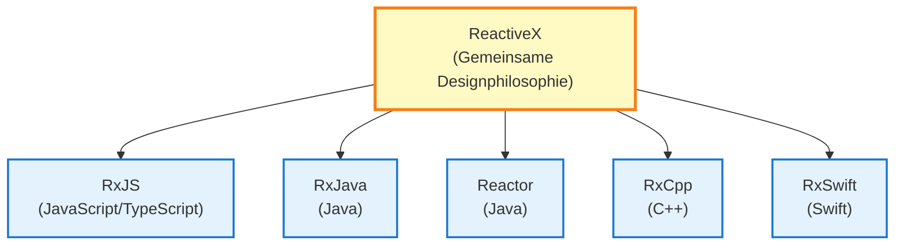
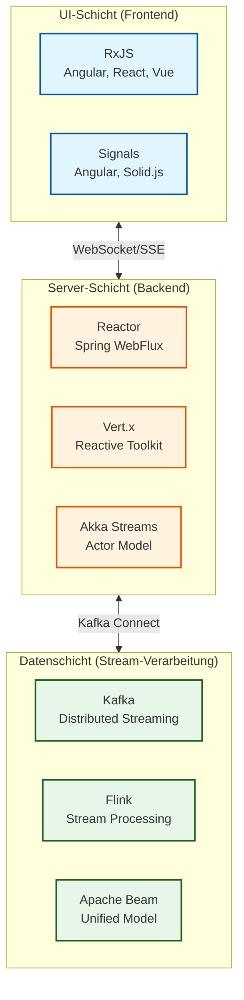

# RxJS und Reactive Streams

Beim Erlernen von RxJS fragen sich viele Entwickler: "Wie positioniert sich RxJS im Gesamtbild der reaktiven Programmierung?"

Diese Seite erklärt die **Unterschiede zwischen RxJS und dem Reactive Streams-Standard**, den **Technologie-Stack von UI bis Datenschicht** und **Verbindungsmethoden zwischen verschiedenen Technologien**.

## Positionierung von RxJS

### Was ist RxJS

**RxJS** (Reactive Extensions for JavaScript) ist die Hauptimplementierung der reaktiven Programmierung für **Browser und Node.js-Umgebungen**.



::: info Merkmale von RxJS
- Läuft in Browser und Node.js
- UI-Reaktionsfähigkeit hat Priorität
- Leichtgewichtig und schnell
- Implizites Backpressure
:::

## RxJS vs Reactive Streams-Standard

Es gibt zwei große Strömungen in der reaktiven Programmierung: **RxJS** und den **Reactive Streams-Standard**.

### Was ist Reactive Streams-Standard

[Reactive Streams](https://www.reactive-streams.org/) ist eine Standardspezifikation für Stream-Verarbeitung auf der JVM.

**Hauptimplementierungen:**
- **Project Reactor** (Spring WebFlux)
- **RxJava 3**
- **Akka Streams**
- **Mutiny** (Quarkus)

### Hauptunterschied: Backpressure-Steuerung

| Aspekt | RxJS | Reactive Streams-Standard |
|------|------|---------------------|
| **Plattform** | JavaScript/TypeScript (Browser, Node.js) | JVM (Java, Scala, Kotlin) |
| **Backpressure** | Implizit (Operator-Ebene) | Explizit (`request(n)`-Methode) |
| **Priorität** | UI-Reaktionsfähigkeit | Server-Durchsatz |
| **Standardisierung** | ReactiveX gemeinsame API | Reactive Streams-Spezifikation |

#### RxJS Backpressure (implizit)

```typescript
import { interval } from 'rxjs';
import { bufferTime, take } from 'rxjs';

// Backpressure wird durch Operatoren gesteuert
interval(10)  // Alle 10ms ein Wert
  .pipe(
    bufferTime(1000),  // Jede Sekunde puffern (implizite Steuerung)
    take(5)
  )
  .subscribe(batch => console.log('Batch:', batch.length));
```

#### Reactive Streams Backpressure (explizit)

```java
// Project Reactor (Java)
Flux.range(1, 1000)
    .subscribe(new BaseSubscriber<Integer>() {
        @Override
        protected void hookOnSubscribe(Subscription subscription) {
            request(10);  // Zuerst 10 anfordern (explizit)
        }

        @Override
        protected void hookOnNext(Integer value) {
            System.out.println("Verarbeitung: " + value);
            request(1);  // Nach Verarbeitung nächsten anfordern (explizit)
        }
    });
```

> [!IMPORTANT]
> **Unterschied im Backpressure**
>
> - **RxJS**: Implizite Steuerung durch Operatoren (`bufferTime`, `throttleTime`, `debounceTime`)
> - **Reactive Streams**: Explizite Steuerung durch `request(n)`-Methode
>
> Dieser Unterschied spiegelt die unterschiedlichen Anforderungen von UI (RxJS) und Server (Reactive Streams) wider.

## Technologie-Stack nach Schichten

Reaktive Programmierung bildet einen Technologie-Stack über mehrere Schichten von UI bis Datenschicht.

### Gesamtarchitektur



### 1. UI-Schicht (Frontend)

**Haupttechnologien: RxJS, Signals**

```typescript
// RxJS (UI-Schicht-Standard)
import { fromEvent } from 'rxjs';
import { debounceTime, distinctUntilChanged, switchMap } from 'rxjs';

const searchInput$ = fromEvent(input, 'input').pipe(
  map(event => (event.target as HTMLInputElement).value),
  debounceTime(300),
  distinctUntilChanged(),
  switchMap(query => fetch(`/api/search?q=${query}`).then(r => r.json()))
);

searchInput$.subscribe(results => updateUI(results));
```

### 2. Server-Schicht (Backend)

**Haupttechnologien: Project Reactor, Vert.x, Akka Streams**

```java
// Project Reactor (Server-Schicht-Standard)
@RestController
public class UserController {

    @GetMapping("/users")
    public Flux<User> getUsers() {
        return userRepository.findAll()
            .filter(user -> user.isActive())
            .map(user -> enrichUserData(user))
            .onErrorResume(error -> Flux.empty());
    }
}
```

### 3. Datenschicht (Stream-Verarbeitung)

**Haupttechnologien: Kafka, Flink, Apache Beam**

```java
// Kafka Streams (Datenpipeline)
StreamsBuilder builder = new StreamsBuilder();

KStream<String, String> source = builder.stream("input-topic");

source
    .filter((key, value) -> value.length() > 10)
    .mapValues(value -> value.toUpperCase())
    .to("output-topic");
```

## Bridging-Technologien: Verbindung verschiedener Schichten

### 1. UI-Schicht ⇄ Server-Schicht: WebSocket / SSE

#### WebSocket (bidirektionale Kommunikation)

**Frontend (RxJS):**
```typescript
import { webSocket } from 'rxjs/webSocket';

const socket$ = webSocket<Message>('wss://example.com/ws');

// Empfangen
socket$.subscribe(message => console.log('Empfangen:', message));

// Senden
socket$.next({ type: 'subscribe', channel: 'notifications' });
```

#### Server-Sent Events (Server → Client)

**Frontend (RxJS):**
```typescript
import { Observable } from 'rxjs';

function fromSSE<T>(url: string): Observable<T> {
  return new Observable(subscriber => {
    const eventSource = new EventSource(url);

    eventSource.onmessage = event => {
      subscriber.next(JSON.parse(event.data));
    };

    eventSource.onerror = error => {
      subscriber.error(error);
    };

    return () => eventSource.close();
  });
}

const notifications$ = fromSSE<Notification>('/api/notifications/stream');
```

### 2. Server-Schicht ⇄ Datenschicht: Kafka Connect

```java
// Spring WebFlux + Kafka
@Service
public class EventPublisher {

    private final KafkaTemplate<String, Event> kafkaTemplate;

    public Mono<Void> publishEvent(Event event) {
        return Mono.fromFuture(
            kafkaTemplate.send("events-topic", event.getId(), event)
                .completable()
        ).then();
    }
}
```

## Operator-Syntax-Gemeinsamkeiten und Unterschiede

RxJS, Reactor und Kafka Streams haben **ähnliche Syntax**, aber **unterschiedliche Semantik**.

### Gemeinsamkeit: Deklarative Pipelines

**RxJS (UI-Schicht):**
```typescript
source$
  .pipe(
    filter(x => x > 10),
    map(x => x * 2),
    take(5)
  )
  .subscribe(console.log);
```

**Reactor (Server-Schicht):**
```java
source
    .filter(x -> x > 10)
    .map(x -> x * 2)
    .take(5)
    .subscribe(System.out::println);
```

**Kafka Streams (Datenschicht):**
```java
stream
    .filter((key, value) -> value > 10)
    .mapValues(value -> value * 2)
    .to("output-topic");
```

### Unterschiede: Ausführungsmodell und Semantik

| Aspekt | RxJS | Reactor | Kafka Streams |
|------|------|---------|---------------|
| **Ausführungsumgebung** | Single-Thread (Event Loop) | Multi-Thread möglich | Verteilte Verarbeitung |
| **Scheduling** | Implizit (Standard synchron) | Explizit (Schedulers) | Automatisch verteilt |
| **Fehlerbehandlung** | `catchError` | `onErrorResume` | Exactly-once-Garantie |
| **Backpressure** | Operator-Ebene | `request(n)` | Automatische Steuerung |

## Stärken und Anwendungsbereiche von RxJS

### Stärkste Bereiche von RxJS

1. **Browser-UI-Verarbeitung**
   - Einheitliche Verarbeitung von Benutzereingaben, DOM-Events, HTTP-Kommunikation

2. **Node.js asynchrone I/O**
   - Stream-Verarbeitung von Dateioperationen, Netzwerkkommunikation

3. **Integration mehrerer asynchroner Prozesse**
   - Komplexe Flows mit `combineLatest`, `merge`, `switchMap` etc.

### Grenzen von RxJS

1. **Hochdurchsatz-Server-Verarbeitung**
   - JVM-basierte Reactor, Akka Streams sind vorteilhafter

2. **Verteilte Stream-Verarbeitung**
   - Kafka, Flink sind geeigneter

3. **Strikte Backpressure-Steuerung**
   - Explizites `request(n)` des Reactive Streams-Standards erforderlich

> [!TIP]
> **RxJS ist am stärksten in der UI-Schicht, aber für Server- und Datenschichten können andere Technologien geeigneter sein.** Es ist nicht notwendig, RxJS für alle Schichten zu verwenden.

## Zusammenfassung

### Positionierung von RxJS

> [!IMPORTANT]
> RxJS ist die Hauptimplementierung der reaktiven Programmierung für **Browser und Node.js-Umgebungen**. Es priorisiert UI-Reaktionsfähigkeit und verwendet implizite Backpressure-Steuerung.

### Gesamtbild des Reactive Streams-Ökosystems

```
UI-Schicht      : RxJS, Signals
Kommunikation   : WebSocket, SSE
Server-Schicht  : Reactor, Vert.x, Akka Streams
Datenschicht    : Kafka, Flink, Apache Beam
```

### Technologieauswahl-Richtlinien

| Schicht | Empfohlene Technologie | Grund |
|----|---------|------|
| **UI-Schicht** | RxJS, Signals | UI-Reaktionsfähigkeit, reichhaltige Operatoren |
| **Server-Schicht** | Reactor, Vert.x | Hoher Durchsatz, Reactive Streams-Standard |
| **Datenschicht** | Kafka, Flink | Verteilte Verarbeitung, Skalierbarkeit |

### Bridging-Technologien

- **UI ⇄ Server**: WebSocket, SSE
- **Server ⇄ Daten**: Kafka Connect, Reactive Kafka

> [!TIP]
> **Es ist nicht notwendig, alle Schichten mit RxJS zu vereinheitlichen.** Wählen Sie die optimale Technologie für jede Schicht und verbinden Sie sie mit Bridging-Technologien, um End-to-End-reaktive Systeme zu erstellen.

## Verwandte Seiten

- [Gesamtkarte der reaktiven Architektur](/de/guide/appendix/reactive-architecture-map)
- [Reaktive Programmierung überdacht](/de/guide/appendix/reactive-programming-reconsidered)
- [Kombinationsoperatoren](/de/guide/operators/combination/)
- [Fehlerbehandlung](/de/guide/error-handling/strategies)

## Referenzen

- [Reactive Streams Offizielle Website](https://www.reactive-streams.org/)
- [Project Reactor Offizielle Dokumentation](https://projectreactor.io/docs)
- [Apache Kafka Offizielle Dokumentation](https://kafka.apache.org/documentation/)
- [Apache Flink Offizielle Dokumentation](https://flink.apache.org/docs/)
- [RxJS Offizielle Dokumentation](https://rxjs.dev/)
