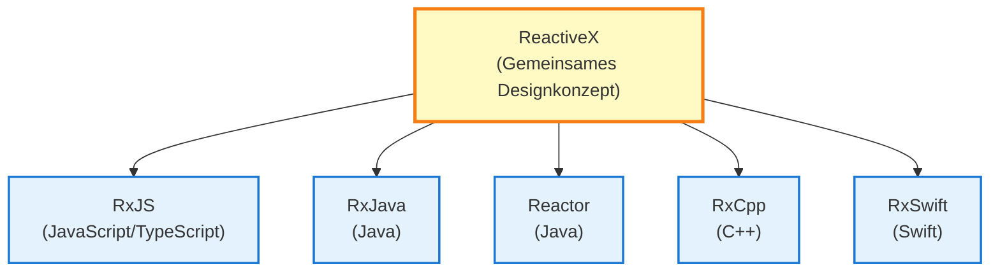
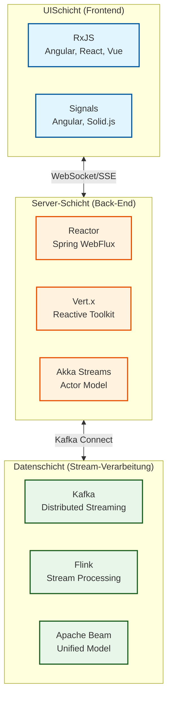

# RxJS und das React Streams Ökosystem

Wenn sie etwas über RxJS lernen, fragen sich viele Entwickler: "Wie passt RxJS in das Gesamtbild der Reaktiven Programmierung?" Die Frage lautet: "Wie fügt sich RxJS in das Gesamtbild der reaktiven Programmierung ein?".

Diese Seite erklärt **die Unterschiede zwischen RxJS und dem React Streams Standard**, **den gesamten Technologie-Stack von der UI-Schicht bis zur Datenschicht** und **wie die verschiedenen Technologien zusammenarbeiten**.

## Positionierung von RxJS

### Was ist RxJS?

**RxJS** (Reactive Extensions for JavaScript) ist die wichtigste Implementierung der reaktiven Programmierung in der **Browser- und Node.js-Umgebung**.


```mermaid
graph TB
    reactiveX["ReactiveX<br/>(Gemeinsames Designkonzept)"]
    rxjs["RxJS<br/>(JavaScript/TypeScript)"]
    rxjava["RxJava<br/>(Java)"]
    reactor["Reactor<br/>(Java)"]
    rxcpp["RxCpp<br/>(C++)"]
    rxswift["RxSwift<br/>(Swift)"]

    reactiveX --> rxjs
    reactiveX --> rxjava
    reactiveX --> reactor
    reactiveX --> rxcpp
    reactiveX --> rxswift

    classDef core fill:#fff9c4,stroke:#f57f17,stroke-width:3px,color:#333
    classDef impl fill:#e3f2fd,stroke:#1976d2,stroke-width:2px,color:#333

    class reactiveX core
    class rxjs,rxjava,reactor,rxcpp,rxswift impl
```

::: info RxJS Eigenschaften.
- Funktioniert im Browser und Node.js
- Die Reaktionsfähigkeit der Benutzeroberfläche hat höchste Priorität
- Leichtgewichtig und schnell
- Backpressure ist implizit.
:::: info

## RxJS vs. React Streams Standard

In der reaktiven Programmierung gibt es zwei Hauptströmungen: **RxJS** und den **React Streams Standard**.

### Was ist der React Streams Standard?

[React Streams] (https://www.reactive-streams.org/) ist eine Standardspezifikation für die Stream-Verarbeitung in der JVM.

**Hauptimplementierungen:**
- **Projekt React** (Spring WebFlux).
- **RxJava 3**
- **Akka Streams**
- **Mutiny** (Quarkus)

**Vier standardisierte Schnittstellen:**

```java
public interface Publisher<T> {
    void subscribe(Subscriber<? super T> s);
}

public interface Subscriber<T> {
    void onSubscribe(Subscription s);
    void onNext(T t);
    void onError(Throwable t);
    void onComplete();
}

public interface Subscription {
    void request(long n);  // Steuerung des Gegendrucks
    void cancel();
}

public interface Processor<T, R> extends Subscriber<T>, Publisher<R> {}
```

### Hauptunterschiede: Gegendruckkontrolle

```java
public interface Publisher<T> {
    void subscribe(Subscriber<? super T> s);
}

public interface Subscriber<T> {
    void onSubscribe(Subscription s);
    void onNext(T t);
    void onError(Throwable t);
    void onComplete();
}

public interface Subscription {
    void request(long n);  // Steuerung des Gegendrucks
    void cancel();
}

public interface Processor<T, R> extends Subscriber<T>, Publisher<R> {}
```

#### RxJS Gegendruck (implizit)


```typescript
import { interval } from 'rxjs';
import { bufferTime, take } from 'rxjs';

// Gegendruckkontrolle durch den Bediener
interval(10)  // 10msWerte werden jede Sekunde ausgegeben
  .pipe(
    bufferTime(1000),  // 1Pufferung im Sekundentakt (implizite Steuerung)
    take(5)
  )
  .subscribe(batch => console.log('Stapel:', batch.length));
```

#### React Streams Rückstau (explizit)

```java
// Project Reactor(JavaStapel ( )
Flux.range(1, 1000)
    .subscribe(new BaseSubscriber<Integer>() {
        @Override
        protected void hookOnSubscribe(Subscription subscription) {
            request(10);  // Erste10Anforderung der ersten (explizit)
        }

        @Override
        protected void hookOnNext(Integer value) {
            System.out.println("Verarbeitet: " + value);
            request(1);  // Nach der Verarbeitung die nächste1Anforderung der ersten (explizit)
        }
    });
```

```typescript
import { interval } from 'rxjs';
import { bufferTime, take } from 'rxjs';

// Gegendruckkontrolle durch den Bediener
interval(10)  // 10msWerte werden jede Sekunde ausgegeben
  .pipe(
    bufferTime(1000),  // 1Pufferung im Sekundentakt (implizite Steuerung)
    take(5)
  )
  .subscribe(batch => console.log('Stapel:', batch.length));
```

> **Unterschiede im Gegendruck**
>
> - **RxJS**: implizit gesteuert durch Operatoren (`bufferTime`, `throttleTime`, `debounceTime`)
> - **Reactive Streams**: explizit gesteuert durch die Methode `request(n)`
>
> Dieser Unterschied spiegelt den Unterschied zwischen den Anforderungen der Benutzeroberfläche (RxJS) und des Servers (React Streams) wider.

## Schichtspezifischer Technologie-Stack

React Programming bildet einen mehrschichtigen Technologiestapel, von der UI-Schicht bis zur Datenschicht.

### Gesamtarchitektur.



```mermaid
flowchart TB
    subgraph ui["UISchicht (Frontend)"]
        rxjs["RxJS<br/>Angular, React, Vue"]
        signals["Signals<br/>Angular, Solid.js"]
    end

    subgraph server["Server-Schicht (Back-End)"]
        reactor["Reactor<br/>Spring WebFlux"]
        vertx["Vert.x<br/>Reactive Toolkit"]
        akka["Akka Streams<br/>Actor Model"]
    end

    subgraph data["Datenschicht (Stream-Verarbeitung)"]
        kafka["Kafka<br/>Distributed Streaming"]
        flink["Flink<br/>Stream Processing"]
        beam["Apache Beam<br/>Unified Model"]
    end

    ui <--> |"WebSocket/SSE"| server
    server <--> |"Kafka Connect"| data

    classDef uiLayer fill:#e1f5fe,stroke:#01579b,stroke-width:2px,color:#333
    classDef serverLayer fill:#fff3e0,stroke:#e65100,stroke-width:2px,color:#333
    classDef dataLayer fill:#e8f5e9,stroke:#1b5e20,stroke-width:2px,color:#333

    class rxjs,signals uiLayer
    class reactor,vertx,akka serverLayer
    class kafka,flink,beam dataLayer
```

### 1. UI-Schicht (Frontend)

**Schlüsseltechnologien: RxJS, Signals.

```typescript
// RxJS(UI(Schicht Standard)
import { fromEvent } from 'rxjs';
import { debounceTime, distinctUntilChanged, switchMap } from 'rxjs';

const searchInput$ = fromEvent(input, 'input').pipe(
  map(event => (event.target as HTMLInputElement).value),
  debounceTime(300),
  distinctUntilChanged(),
  switchMap(query => fetch(`/api/search?q=${query}`).then(r => r.json()))
);

searchInput$.subscribe(results => updateUI(results));
```

::: info Merkmale:
- Läuft in Browser-Umgebung
- Die Reaktionsfähigkeit der Benutzeroberfläche hat höchste Priorität
- Einheitliche Handhabung von Benutzereingaben, DOM-Ereignissen und HTTP-Kommunikation
::::: info

### 2. Server-Schicht (Back-End)

**Haupttechnologien: Project React, Vert.x, Akka Streams***.

#### Project React WebFlux)

```java
// Project Reactor(Server-Schicht-Standard)
@RestController
public class UserController {

    @GetMapping("/users")
    public Flux<User> getUsers() {
        return userRepository.findAll()  // Reactive Repository
            .filter(user -> user.isActive())
            .map(user -> enrichUserData(user))
            .onErrorResume(error -> Flux.empty());
    }

    @GetMapping("/users/{id}")
    public Mono<User> getUser(@PathVariable String id) {
        return userRepository.findById(id)
            .switchIfEmpty(Mono.error(new UserNotFoundException(id)));
    }
}
```

::: info Merkmale:
- Entspricht dem React Streams Standard
- Nicht-blockierende E/A
- Hoher Durchsatz
- Explizite Rückstaukontrolle
::::: info

#### Akka Streams (Akteursmodell)

```scala
// Akka Streams(für verteilte Systeme)
val source = Source(1 to 100)
val flow = Flow[Int].map(_ * 2)
val sink = Sink.foreach[Int](println)

source.via(flow).to(sink).run()
```

::: info Merkmale:
- Actor Model basiert
- Ideal für verteilte Systeme
- Fehlereingrenzung und Wiederherstellung
::::.

### 3. die Datenschicht (Stromverarbeitung)

** Schlüsseltechnologien: Kafka, Flink, Apache Beam***.

#### Apache Kafka (Ereignis-Streaming)

```java
// Kafka Streams(Daten-Pipeline)
StreamsBuilder builder = new StreamsBuilder();

KStream<String, String> source = builder.stream("input-topic");

source
    .filter((key, value) -> value.length() > 10)
    .mapValues(value -> value.toUpperCase())
    .to("output-topic");

KafkaStreams streams = new KafkaStreams(builder.build(), config);
streams.start();
```

::: info Merkmale:
- Verteilte Ereignis-Streaming-Plattform
- Hoher Durchsatz, niedrige Latenz
- Ereignisbeschaffung, Grundlage für CQRS-Muster
::::.

#### Apache Flink (Stromverarbeitung)


```mermaid
graph TB
    reactiveX["ReactiveX<br/>(Gemeinsames Designkonzept)"]
    rxjs["RxJS<br/>(JavaScript/TypeScript)"]
    rxjava["RxJava<br/>(Java)"]
    reactor["Reactor<br/>(Java)"]
    rxcpp["RxCpp<br/>(C++)"]
    rxswift["RxSwift<br/>(Swift)"]

    reactiveX --> rxjs
    reactiveX --> rxjava
    reactiveX --> reactor
    reactiveX --> rxcpp
    reactiveX --> rxswift

    classDef core fill:#fff9c4,stroke:#f57f17,stroke-width:3px,color:#333
    classDef impl fill:#e3f2fd,stroke:#1976d2,stroke-width:2px,color:#333

    class reactiveX core
    class rxjs,rxjava,reactor,rxcpp,rxswift impl
```

:::: info Merkmale:
- Echtzeit Stream Processing Engine
- Exakt-einmal (Exactly-once) Garantie
- Ereigniszeitverarbeitung und Wasserzeichen
::::.

## Brückentechnologie: Koordinierung verschiedener Schichten

Wie lassen sich verschiedene Technologiestapel miteinander verbinden?

### 1. UI-Schicht ⇄ Server-Schicht: WebSocket / SSE

#### WebSocket (bi-direktionale Kommunikation)

** Frontend (RxJS): ***


```mermaid
graph TB
    reactiveX["ReactiveX<br/>(Gemeinsames Designkonzept)"]
    rxjs["RxJS<br/>(JavaScript/TypeScript)"]
    rxjava["RxJava<br/>(Java)"]
    reactor["Reactor<br/>(Java)"]
    rxcpp["RxCpp<br/>(C++)"]
    rxswift["RxSwift<br/>(Swift)"]

    reactiveX --> rxjs
    reactiveX --> rxjava
    reactiveX --> reactor
    reactiveX --> rxcpp
    reactiveX --> rxswift

    classDef core fill:#fff9c4,stroke:#f57f17,stroke-width:3px,color:#333
    classDef impl fill:#e3f2fd,stroke:#1976d2,stroke-width:2px,color:#333

    class reactiveX core
    class rxjs,rxjava,reactor,rxcpp,rxswift impl
```

**Back-End (Spring WebFlux):**


```mermaid
graph TB
    reactiveX["ReactiveX<br/>(Gemeinsames Designkonzept)"]
    rxjs["RxJS<br/>(JavaScript/TypeScript)"]
    rxjava["RxJava<br/>(Java)"]
    reactor["Reactor<br/>(Java)"]
    rxcpp["RxCpp<br/>(C++)"]
    rxswift["RxSwift<br/>(Swift)"]

    reactiveX --> rxjs
    reactiveX --> rxjava
    reactiveX --> reactor
    reactiveX --> rxcpp
    reactiveX --> rxswift

    classDef core fill:#fff9c4,stroke:#f57f17,stroke-width:3px,color:#333
    classDef impl fill:#e3f2fd,stroke:#1976d2,stroke-width:2px,color:#333

    class reactiveX core
    class rxjs,rxjava,reactor,rxcpp,rxswift impl
```

#### Server-gesendete Ereignisse (Server → Client)

**Front-End (RxJS):***


```mermaid
graph TB
    reactiveX["ReactiveX<br/>(Gemeinsames Designkonzept)"]
    rxjs["RxJS<br/>(JavaScript/TypeScript)"]
    rxjava["RxJava<br/>(Java)"]
    reactor["Reactor<br/>(Java)"]
    rxcpp["RxCpp<br/>(C++)"]
    rxswift["RxSwift<br/>(Swift)"]

    reactiveX --> rxjs
    reactiveX --> rxjava
    reactiveX --> reactor
    reactiveX --> rxcpp
    reactiveX --> rxswift

    classDef core fill:#fff9c4,stroke:#f57f17,stroke-width:3px,color:#333
    classDef impl fill:#e3f2fd,stroke:#1976d2,stroke-width:2px,color:#333

    class reactiveX core
    class rxjs,rxjava,reactor,rxcpp,rxswift impl
```

**Back-End (Spring WebFlux):**


```mermaid
graph TB
    reactiveX["ReactiveX<br/>(Gemeinsames Designkonzept)"]
    rxjs["RxJS<br/>(JavaScript/TypeScript)"]
    rxjava["RxJava<br/>(Java)"]
    reactor["Reactor<br/>(Java)"]
    rxcpp["RxCpp<br/>(C++)"]
    rxswift["RxSwift<br/>(Swift)"]

    reactiveX --> rxjs
    reactiveX --> rxjava
    reactiveX --> reactor
    reactiveX --> rxcpp
    reactiveX --> rxswift

    classDef core fill:#fff9c4,stroke:#f57f17,stroke-width:3px,color:#333
    classDef impl fill:#e3f2fd,stroke:#1976d2,stroke-width:2px,color:#333

    class reactiveX core
    class rxjs,rxjava,reactor,rxcpp,rxswift impl
```

### 2. Server-Schicht ⇄ Datenschicht: Kafka Connect

**Server-Schicht (React) zu Kafka: **


```mermaid
graph TB
    reactiveX["ReactiveX<br/>(Gemeinsames Designkonzept)"]
    rxjs["RxJS<br/>(JavaScript/TypeScript)"]
    rxjava["RxJava<br/>(Java)"]
    reactor["Reactor<br/>(Java)"]
    rxcpp["RxCpp<br/>(C++)"]
    rxswift["RxSwift<br/>(Swift)"]

    reactiveX --> rxjs
    reactiveX --> rxjava
    reactiveX --> reactor
    reactiveX --> rxcpp
    reactiveX --> rxswift

    classDef core fill:#fff9c4,stroke:#f57f17,stroke-width:3px,color:#333
    classDef impl fill:#e3f2fd,stroke:#1976d2,stroke-width:2px,color:#333

    class reactiveX core
    class rxjs,rxjava,reactor,rxcpp,rxswift impl
```

**Kafka zur Server-Schicht (React):**


```mermaid
graph TB
    reactiveX["ReactiveX<br/>(Gemeinsames Designkonzept)"]
    rxjs["RxJS<br/>(JavaScript/TypeScript)"]
    rxjava["RxJava<br/>(Java)"]
    reactor["Reactor<br/>(Java)"]
    rxcpp["RxCpp<br/>(C++)"]
    rxswift["RxSwift<br/>(Swift)"]

    reactiveX --> rxjs
    reactiveX --> rxjava
    reactiveX --> reactor
    reactiveX --> rxcpp
    reactiveX --> rxswift

    classDef core fill:#fff9c4,stroke:#f57f17,stroke-width:3px,color:#333
    classDef impl fill:#e3f2fd,stroke:#1976d2,stroke-width:2px,color:#333

    class reactiveX core
    class rxjs,rxjava,reactor,rxcpp,rxswift impl
```

### 3. End-to-End reaktive Pipeline


```mermaid
graph TB
    reactiveX["ReactiveX<br/>(Gemeinsames Designkonzept)"]
    rxjs["RxJS<br/>(JavaScript/TypeScript)"]
    rxjava["RxJava<br/>(Java)"]
    reactor["Reactor<br/>(Java)"]
    rxcpp["RxCpp<br/>(C++)"]
    rxswift["RxSwift<br/>(Swift)"]

    reactiveX --> rxjs
    reactiveX --> rxjava
    reactiveX --> reactor
    reactiveX --> rxcpp
    reactiveX --> rxswift

    classDef core fill:#fff9c4,stroke:#f57f17,stroke-width:3px,color:#333
    classDef impl fill:#e3f2fd,stroke:#1976d2,stroke-width:2px,color:#333

    class reactiveX core
    class rxjs,rxjava,reactor,rxcpp,rxswift impl
```

## Leitlinien für die Technologieauswahl

Welche Technologie sollte auf welcher Ebene eingesetzt werden?

## Auswahl der UI-Schicht (Frontend)


```java
public interface Publisher<T> {
    void subscribe(Subscriber<? super T> s);
}

public interface Subscriber<T> {
    void onSubscribe(Subscription s);
    void onNext(T t);
    void onError(Throwable t);
    void onComplete();
}

public interface Subscription {
    void request(long n);  // Steuerung des Gegendrucks
    void cancel();
}

public interface Processor<T, R> extends Subscriber<T>, Publisher<R> {}
```


```mermaid
graph TB
    reactiveX["ReactiveX<br/>(Gemeinsames Designkonzept)"]
    rxjs["RxJS<br/>(JavaScript/TypeScript)"]
    rxjava["RxJava<br/>(Java)"]
    reactor["Reactor<br/>(Java)"]
    rxcpp["RxCpp<br/>(C++)"]
    rxswift["RxSwift<br/>(Swift)"]

    reactiveX --> rxjs
    reactiveX --> rxjava
    reactiveX --> reactor
    reactiveX --> rxcpp
    reactiveX --> rxswift

    classDef core fill:#fff9c4,stroke:#f57f17,stroke-width:3px,color:#333
    classDef impl fill:#e3f2fd,stroke:#1976d2,stroke-width:2px,color:#333

    class reactiveX core
    class rxjs,rxjava,reactor,rxcpp,rxswift impl
```

### Auswahl der Serverschicht (Backend)


```java
public interface Publisher<T> {
    void subscribe(Subscriber<? super T> s);
}

public interface Subscriber<T> {
    void onSubscribe(Subscription s);
    void onNext(T t);
    void onError(Throwable t);
    void onComplete();
}

public interface Subscription {
    void request(long n);  // Steuerung des Gegendrucks
    void cancel();
}

public interface Processor<T, R> extends Subscriber<T>, Publisher<R> {}
```


```mermaid
graph TB
    reactiveX["ReactiveX<br/>(Gemeinsames Designkonzept)"]
    rxjs["RxJS<br/>(JavaScript/TypeScript)"]
    rxjava["RxJava<br/>(Java)"]
    reactor["Reactor<br/>(Java)"]
    rxcpp["RxCpp<br/>(C++)"]
    rxswift["RxSwift<br/>(Swift)"]

    reactiveX --> rxjs
    reactiveX --> rxjava
    reactiveX --> reactor
    reactiveX --> rxcpp
    reactiveX --> rxswift

    classDef core fill:#fff9c4,stroke:#f57f17,stroke-width:3px,color:#333
    classDef impl fill:#e3f2fd,stroke:#1976d2,stroke-width:2px,color:#333

    class reactiveX core
    class rxjs,rxjava,reactor,rxcpp,rxswift impl
```

### Auswahl der Datenschicht (Stream Processing)


```java
public interface Publisher<T> {
    void subscribe(Subscriber<? super T> s);
}

public interface Subscriber<T> {
    void onSubscribe(Subscription s);
    void onNext(T t);
    void onError(Throwable t);
    void onComplete();
}

public interface Subscription {
    void request(long n);  // Steuerung des Gegendrucks
    void cancel();
}

public interface Processor<T, R> extends Subscriber<T>, Publisher<R> {}
```


```java
public interface Publisher<T> {
    void subscribe(Subscriber<? super T> s);
}

public interface Subscriber<T> {
    void onSubscribe(Subscription s);
    void onNext(T t);
    void onError(Throwable t);
    void onComplete();
}

public interface Subscription {
    void request(long n);  // Steuerung des Gegendrucks
    void cancel();
}

public interface Processor<T, R> extends Subscriber<T>, Publisher<R> {}
```

## Gemeinsamkeiten und Unterschiede in der Operator-Syntax

RxJS, React und Kafka Streams haben eine **ähnliche Syntax** aber unterschiedliche **Semantik**.

### Gemeinsamkeiten: deklarative Pipeline

**RxJS (UI-Schicht):**


```java
public interface Publisher<T> {
    void subscribe(Subscriber<? super T> s);
}

public interface Subscriber<T> {
    void onSubscribe(Subscription s);
    void onNext(T t);
    void onError(Throwable t);
    void onComplete();
}

public interface Subscription {
    void request(long n);  // Steuerung des Gegendrucks
    void cancel();
}

public interface Processor<T, R> extends Subscriber<T>, Publisher<R> {}
```

**React (Server-Schicht):**


```java
public interface Publisher<T> {
    void subscribe(Subscriber<? super T> s);
}

public interface Subscriber<T> {
    void onSubscribe(Subscription s);
    void onNext(T t);
    void onError(Throwable t);
    void onComplete();
}

public interface Subscription {
    void request(long n);  // Steuerung des Gegendrucks
    void cancel();
}

public interface Processor<T, R> extends Subscriber<T>, Publisher<R> {}
```

**Kafka Streams (Datenschicht):**


```java
public interface Publisher<T> {
    void subscribe(Subscriber<? super T> s);
}

public interface Subscriber<T> {
    void onSubscribe(Subscription s);
    void onNext(T t);
    void onError(Throwable t);
    void onComplete();
}

public interface Subscription {
    void request(long n);  // Steuerung des Gegendrucks
    void cancel();
}

public interface Processor<T, R> extends Subscriber<T>, Publisher<R> {}
```

### Unterschiede: Ausführungsmodell und Semantik


```java
public interface Publisher<T> {
    void subscribe(Subscriber<? super T> s);
}

public interface Subscriber<T> {
    void onSubscribe(Subscription s);
    void onNext(T t);
    void onError(Throwable t);
    void onComplete();
}

public interface Subscription {
    void request(long n);  // Steuerung des Gegendrucks
    void cancel();
}

public interface Processor<T, R> extends Subscriber<T>, Publisher<R> {}
```


```typescript
import { interval } from 'rxjs';
import { bufferTime, take } from 'rxjs';

// Gegendruckkontrolle durch den Bediener
interval(10)  // 10msWerte werden jede Sekunde ausgegeben
  .pipe(
    bufferTime(1000),  // 1Pufferung im Sekundentakt (implizite Steuerung)
    take(5)
  )
  .subscribe(batch => console.log('Stapel:', batch.length));
```

> ** Nur weil die Syntax der Operatoren ähnlich ist, bedeutet das nicht, dass sie auf dieselbe Weise funktionieren. ** Es ist wichtig, das Ausführungsmodell und die Semantik der einzelnen Technologien zu verstehen.

## Stärken und Anwendungsbereiche von RxJS

### Bereiche, in denen RxJS am stärksten ist.

1.**Browser UI-Verarbeitung**
   - Einheitliche Verarbeitung von Benutzereingaben, DOM-Ereignissen und HTTP-Kommunikation

2. **Node.js asynchrone E/A**
   - Dateioperationen, Streaming von Netzwerkkommunikation

3. **Integration von mehreren asynchronen Prozessen**
   - Komplexe Abläufe in `combineLatest`, `merge`, `switchMap` etc.

### Einschränkungen von RxJS.

1. **Server-Verarbeitung mit hohem Durchsatz**
   - JVM-basierter React, Akka Streams sind vorteilhafter

2.**Verteilte Stream-Verarbeitung**
   - Kafka, Flink sind besser geeignet

3. **Strenge Rückstaukontrolle**
   - Erfordert explizite "Anfrage(n)" im React Streams Standard


```typescript
import { interval } from 'rxjs';
import { bufferTime, take } from 'rxjs';

// Gegendruckkontrolle durch den Bediener
interval(10)  // 10msWerte werden jede Sekunde ausgegeben
  .pipe(
    bufferTime(1000),  // 1Pufferung im Sekundentakt (implizite Steuerung)
    take(5)
  )
  .subscribe(batch => console.log('Stapel:', batch.length));
```

> **RxJS ist am stärksten auf der UI-Schicht, aber andere Technologien können auf der Server- und Datenschicht besser geeignet sein. ** Es ist nicht notwendig, RxJS in allen Schichten zu verwenden.

## Zusammenfassung.

### Positionierung von RxJS.


```typescript
import { interval } from 'rxjs';
import { bufferTime, take } from 'rxjs';

// Gegendruckkontrolle durch den Bediener
interval(10)  // 10msWerte werden jede Sekunde ausgegeben
  .pipe(
    bufferTime(1000),  // 1Pufferung im Sekundentakt (implizite Steuerung)
    take(5)
  )
  .subscribe(batch => console.log('Stapel:', batch.length));
```

> RxJS ist die primäre Implementierung von **Reactive Programming in der **Browser- und Node.js-Umgebung**, die die Reaktionsfähigkeit der Benutzeroberfläche priorisiert und implizite Backpressure-Kontrolle einsetzt.

### React Streams Ecosystem Gesamtüberblick.


```java
public interface Publisher<T> {
    void subscribe(Subscriber<? super T> s);
}

public interface Subscriber<T> {
    void onSubscribe(Subscription s);
    void onNext(T t);
    void onError(Throwable t);
    void onComplete();
}

public interface Subscription {
    void request(long n);  // Steuerung des Gegendrucks
    void cancel();
}

public interface Processor<T, R> extends Subscriber<T>, Publisher<R> {}
```

### Leitprinzipien für die Technologieauswahl


```typescript
import { interval } from 'rxjs';
import { bufferTime, take } from 'rxjs';

// Gegendruckkontrolle durch den Bediener
interval(10)  // 10msWerte werden jede Sekunde ausgegeben
  .pipe(
    bufferTime(1000),  // 1Pufferung im Sekundentakt (implizite Steuerung)
    take(5)
  )
  .subscribe(batch => console.log('Stapel:', batch.length));
```

### Brückentechnologien

- **UI ⇄ Server**: WebSocket, SSE
- **Server ⇄ Daten**: Kafka Connect, React Kafka

### Gemeinsamkeiten der Operator-Syntax

RxJS, React und Kafka Streams haben eine ähnliche Syntax, aber **unterschiedliche Ausführungsmodelle und Semantiken**. Es ist wichtig, die Merkmale der einzelnen Technologien zu verstehen und sie unterschiedlich zu nutzen.

{__Ausruf_35___

> **Es ist nicht notwendig, alle Schichten mit RxJS zu vereinheitlichen. ** Durch die Auswahl der am besten geeigneten Technologie für jede Schicht und deren Verknüpfung mit Brückentechnologien kann ein reaktives End-to-End-System aufgebaut werden.

## Verwandte Seiten.

- [Reactive architecture overall map](/de/guide/appendix/reactive-architecture-map) - Details zu den sieben Schichten.
- [React Programming Reconsidered](/de/guide/appendix/reactive-programming-reconsidered) - Stärken und Grenzen von RP
- [Kombinationsoperatoren](/de/guide/operators/combination/) - Integration mehrerer Streams.
- [Fehlerbehandlung](/de/guide/error-handling/strategies) - RxJS-Fehlerbehandlung

## Referenzen.

- [GitHub Diskussion #16 - React Streams Ecosystem und RxJS Positionierung](https://github.com/shuji-bonji/RxJS-with-TypeScript/discussions/ 16)
- [React Streams offizielle Website](https://www.reactive-streams.org/)
- [Projekt React offizielle Dokumentation](https://projectreactor.io/docs)
- Offizielle Dokumentation zu Apache Kafka](https://kafka.apache.org/documentation/)
- [Apache Flink offizielle Dokumentation](https://flink.apache.org/docs/)
- [Offizielle RxJS-Dokumentation](https://rxjs.dev/)
