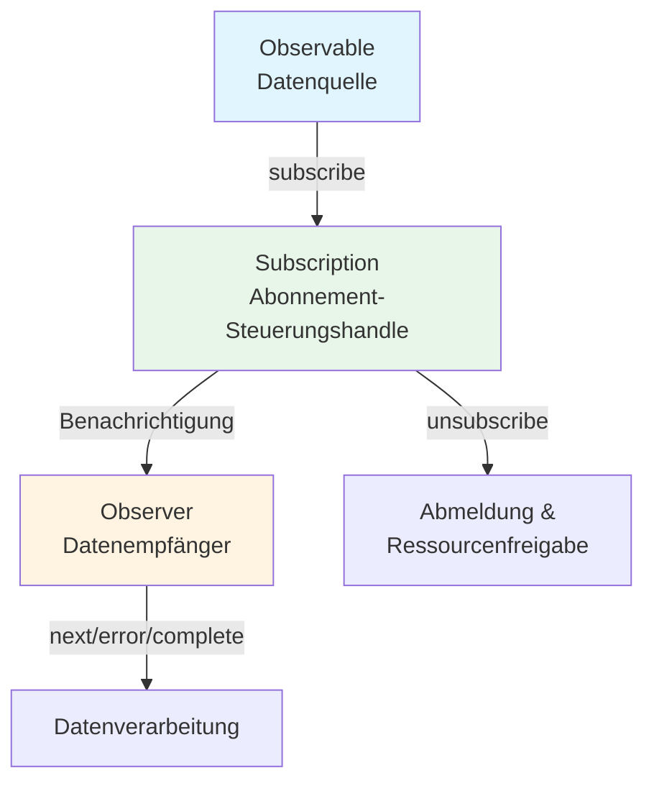

# Was ist ein Stream?

## Definition von Stream

Ein "Stream" bezieht sich auf **einen Datenfluss, der im Laufe der Zeit sequenziell auftritt**. Er kann als Sammlung von Daten betrachtet werden, die nacheinander in einer bestimmten Reihenfolge erscheinen.

### Typische Stream-Beispiele in der traditionellen Programmierung
- Daten beim Lesen von Dateien (z.B. ReadableStream in Node.js)
- Netzwerkkommunikation (HTTP-Antworten etc.)
- Benutzereingaben und Ereignisse (Mausbewegung, Klick, Tastatureingabe)

## Streams in RxJS

In RxJS werden solche zeitlich auftretenden Daten mit **Observable** als Streams behandelt. Observable ist ein Mechanismus zur Abstraktion von asynchronen Daten, synchronen Daten, Ereignissen, zeitbasierten Verarbeitungen usw. als "Streams".

### Vorteile von Observable
- Typsicher beschreibbar (Affinität zu TypeScript)
- Deklarative Darstellung des Datenflusses
- Operationsketten durch `pipe()` möglich
- Explizites Abonnieren durch `subscribe()`
- Abbrechbar durch `unsubscribe()`

## Vergleich mit traditionellen Streams

| Eigenschaft | Traditionelle Streams | RxJS Observable |
|------|------------------|-------------------|
| Ziel | Oft auf Dateien/Netzwerk beschränkt | Beliebige asynchrone/Ereignisse/Zustandsänderungen |
| Ereignisbehandlung | Verarbeitung mit Event-Listenern bei jedem Aufruf | Stream-Umwandlung mit `fromEvent` |
| Abbruch | Methoden variieren | Einheitliche Verwaltung mit `unsubscribe()` |
| Komposition/Transformation | Individuelle Implementierung mit prozeduralem Code | Prägnante Beschreibung mit Operatoren (`map`, `filter` etc.) |

## Beziehung zu Observer und Subscription

- **Observable**: Datenquelle (Quelle des Streams)
- **Observer**: Datenempfänger (hat next, error, complete)
- **Subscription**: Steuerungshandle für Abonnement (Abonnieren, Abmelden, Ressourcenverwaltung)

Observable und Observer sind über Callbacks verbunden und werden durch Subscription gesteuert.

### Grundlegendes Beziehungsdiagramm

## Zusammenfassung

Das Konzept des "Streams", das den Kern von RxJS bildet, ist eine mächtige Waffe beim Umgang mit asynchronen Verarbeitungen. Mit Observable können verschiedene Datenquellen einheitlich behandelt und der Datenfluss deklarativ und flexibel beschrieben werden.

## Beziehung zur Ereignisverarbeitung

In RxJS können auch DOM-Ereignisse mit `fromEvent` als Streams behandelt werden.
Durch den Vergleich mit traditionellen Event-Listenern wird das Konzept des Streams klarer.

> [!TIP]
> Für einen Vergleich zwischen traditioneller Ereignisverarbeitung und RxJS mit echtem Code siehe [Stream-Umwandlung von Ereignissen](/de/guide/observables/events.md#vergleich-zwischen-traditioneller-ereignisverarbeitung-und-rxjs).
