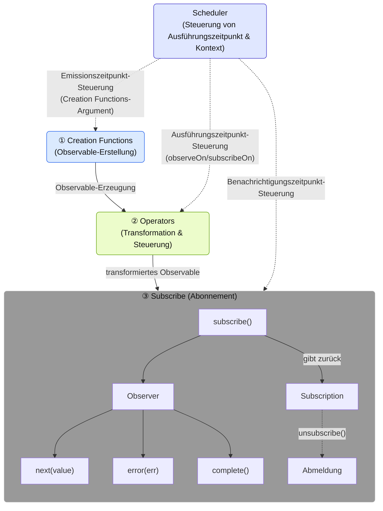
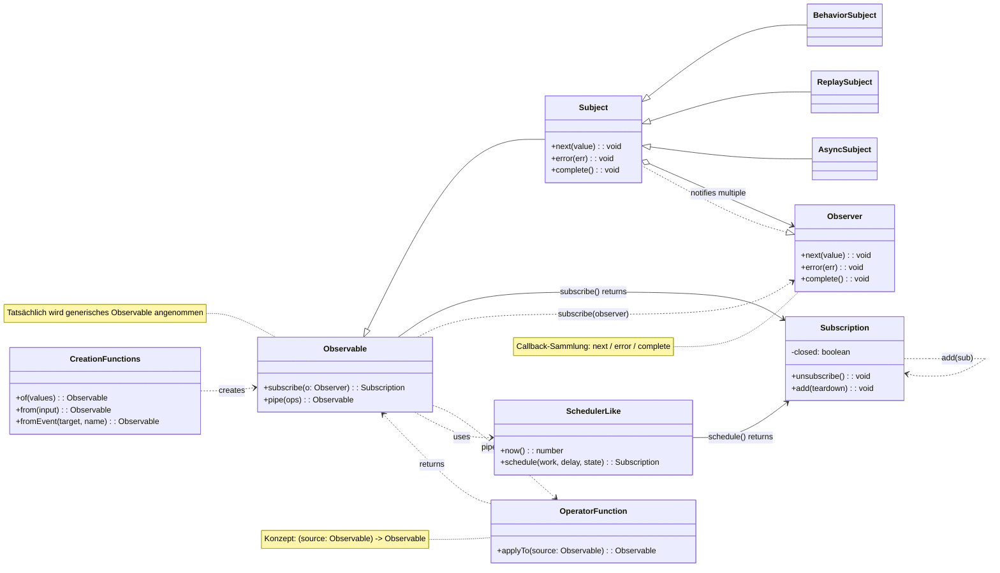

# Was ist RxJS?

## Übersicht
[RxJS (Reactive Extensions for JavaScript)](https://rxjs.dev) ist eine Bibliothek zur Implementierung von "reaktiver Programmierung" in JavaScript.

> ### Was ist reaktive Programmierung?
> Reaktive Programmierung ist eine Methode zur Erstellung von Programmen, die automatisch aktualisiert werden, wenn sich Daten ändern.
> Sie ist eine Form der ereignisgesteuerten Programmierung und konzentriert sich insbesondere auf den Umgang mit asynchronen Datenströmen. Programme werden konstruiert, indem man sich auf den Datenfluss (Stream) konzentriert und darauf reagiert (Reaktion).

Mit anderen Worten: RxJS ist eine Bibliothek zur Behandlung von Ereignissen und asynchronen Datenströmen (Streams) im funktionalen Stil. Sie nutzt das Observable-Muster und bietet leistungsstarke Werkzeuge für den Umgang mit asynchronen Datenströmen.

> Observable ist ein zentrales Konstrukt von RxJS, das Ereignisse oder asynchrone Datenströme (Streams) repräsentiert. Es ist die Quelle, aus der Werte "fließen", und durch Abonnieren (subscribe) können diese Werte empfangen werden. Ein Observable ist ein "Datenfluss (Stream)", der im Laufe der Zeit Werte emittiert. Durch Abonnieren (subscribe) können diese Werte empfangen werden.


> [!TIP]
> Wenn Sie sich fragen "Was ist überhaupt ein Stream?", lesen Sie auch [Was ist ein Stream?](/de/guide/basics/what-is-a-stream).


## Einfaches Verwendungsbeispiel

```ts
import { fromEvent } from 'rxjs';

fromEvent(document, 'click').subscribe(event => {
  console.log('Geklickt:', event);
});
```

## Grundlegende Bausteine von RxJS

Um RxJS zu beherrschen, ist es wichtig, die folgenden Kernkomponenten zu verstehen.

| Komponente | Übersicht |
|------|------|
| [`Observable`](../observables/what-is-observable.md) | Die Quelle eines Streams, der asynchrone oder zeitlich auftretende Daten darstellt. |
| [`Observer`](../observables/observable-lifecycle.md#observer)[^observer]| Die Instanz, die Daten von einem Observable abonniert und empfängt. |
| [`Subscription`](../observables/observable-lifecycle.md#subscription) | Verwaltet das Abonnieren und Abmelden von Observables. |
| [`Creation Functions`](../creation-functions/index.md) | Eine Gruppe von Funktionen zum Erstellen und Kombinieren von Observables. |
| [`Operator`](../operators/index.md) | Eine Gruppe von Funktionen zum Transformieren und Steuern von Observables. |
| [`Subject`](../subjects/what-is-subject.md)[^1] | Ein Vermittler, der sowohl Observable- als auch Observer-Eigenschaften besitzt. |
| [`Scheduler`](../schedulers/async-control.md)[^2]| Ein Mechanismus zur Steuerung des Ausführungszeitpunkts von Observables. |

[^observer]: Als Implementierung wird die Subscriber-Klasse verwendet. Weitere Details finden Sie unter [Unterschied zwischen Observer und Subscriber](../observables/observer-vs-subscriber.md).
[^1]: Subject ist eine spezielle Entität, die sowohl als Observable, das Werte emittiert, als auch als Observer, der Werte empfängt, fungieren kann.
[^2]: Scheduler wird verwendet, um den Zeitpunkt und Kontext der asynchronen Verarbeitung zu steuern und ist auch für Debugging und Performance-Management nützlich.

Diese Komponenten haben jeweils eigenständige Funktionen, arbeiten aber zusammen.
Beispielsweise wird ein Observable mit Creation Functions erstellt/kombiniert, mit Operatoren transformiert/gesteuert, vom Observer abonniert und der Ausführungszeitpunkt mit Scheduler gesteuert, um die gesamte Stream-Verarbeitung zu bilden.

#### Komponenten und Datenfluss von RxJS


※ Detaillierte Verwendung und Beispiele für jede Komponente werden in den jeweiligen Kapiteln separat erläutert.

### Klassendiagramm der Komponenten



## Vorteile von RxJS

| Vorteil | Inhalt |
|---|---|
| Deklarativer Code[^3] | Mit `map`, `filter` etc. wird beschrieben "was erreicht werden soll", prozedurale Beschreibungen wie for-Schleifen werden vermieden |
| Vereinfachung asynchroner Verarbeitung | Vermeidung von Verschachtelungen bei `Promise` oder Callbacks, intuitiver Ablauf |
| Fehlerbehandlung | Einheitliche Fehlerbehandlung im Stream mit `.pipe(catchError(...))` |
| Abbrechbarkeit | Unterbrechung des Streams durch `Subscription.unsubscribe()` möglich |
| Vielfältige Operatoren | Transformation und Komposition mit zahlreichen Operatoren wie `debounceTime`, `mergeMap`, `combineLatest` |

[^3]: > - Deklarativer Code: Code, der direkt beschreibt "welches Ergebnis gewünscht wird"
      > - Prozeduraler Code: Code, der beschreibt "welche Berechnungen durchgeführt werden müssen, um das gewünschte Ergebnis zu erhalten"


## Anwendungsfälle

RxJS glänzt in allen Situationen, in denen "sich zeitlich verändernde Daten" behandelt werden. Im Folgenden werden die wichtigsten Anwendungsbereiche vorgestellt.

### Echtzeit-Kommunikation & Streaming

Bei Echtzeit-Kommunikation wie WebSocket oder Server-Sent Events (SSE) ist RxJS besonders leistungsstark.

| Verwendung | Beschreibung | Hauptoperatoren |
|------|------|-------------------|
| WebSocket-Kommunikation | Chat, Benachrichtigungen, Aktienkursaktualisierungen etc. | [`webSocket`](../observables/creation.md#websocket), [`filter`](../operators/filtering/filter.md), [`map`](../operators/transformation/map.md) |
| Server-Sent Events | Push-Benachrichtigungen vom Server | [`fromEvent`](../observables/events.md), [`retry`](../operators/utility/retry.md) |
| IoT-Sensor-Überwachung | Verarbeitung kontinuierlicher Sensordaten | [`debounceTime`](../operators/filtering/debounceTime.md), [`distinctUntilChanged`](../operators/filtering/distinctUntilChanged.md) |

#### Einfaches Beispiel
```ts
import { webSocket } from 'rxjs/webSocket';
import { filter } from 'rxjs';

const socket$ = webSocket('wss://example.com/chat');

socket$.pipe(
  filter(msg => msg.type === 'message')
).subscribe(msg => console.log('Neu:', msg.text));
```

### UI/Zustandsverwaltung & Formularsteuerung

Benutzereingaben und Zustandsänderungen können reaktiv behandelt werden.

> [!NOTE] Beziehung zu Frameworks
> Moderne Frontend-Frameworks (Angular Signals, React hooks, Vue Composition API, Svelte Runes etc.) bieten jeweils eigene reaktive Systeme. RxJS ist als framework-unabhängige Bibliothek konzipiert und kann mit diesen kombiniert oder alternativ verwendet werden. Die Integration mit framework-spezifischen Mechanismen wird in Kapitel 15 "Integration mit Frameworks" (in Vorbereitung) ausführlich erläutert.

| Verwendung | Beschreibung | Hauptoperatoren |
|------|------|-------------------|
| Eingabeformular-Steuerung | Suchvervollständigung, Echtzeit-Validierung | [`debounceTime`](../operators/filtering/debounceTime.md), [`distinctUntilChanged`](../operators/filtering/distinctUntilChanged.md), [`switchMap`](../operators/transformation/switchMap.md) |
| Verknüpfung mehrerer Formularfelder | Aktualisierung abhängiger Eingabefelder | [`combineLatest`](../creation-functions/combination/combineLatest.md), [`withLatestFrom`](../operators/combination/withLatestFrom.md) |
| Kommunikation zwischen Komponenten | Event-Bus oder benutzerdefinierte Zustandsverwaltung | [`Subject`](../subjects/what-is-subject.md), [`share`](../operators/multicasting/share.md) |
| UI-Ereignisverarbeitung | Klick, Scroll, Drag & Drop | [`fromEvent`](../observables/events.md), [`takeUntil`](../operators/utility/takeUntil.md) |

#### Einfaches Beispiel
```ts
import { fromEvent, combineLatest } from 'rxjs';
import { debounceTime, map, switchMap } from 'rxjs';

const searchInput = document.querySelector('#search') as HTMLInputElement;
const sortSelect = document.querySelector('#sort') as HTMLInputElement;

const search$ = fromEvent(searchInput, 'input').pipe(
  map(e => (e.target as HTMLInputElement).value)
);

const sort$ = fromEvent(sortSelect, 'change').pipe(
  map(e => (e.target as HTMLSelectElement).value)
);

combineLatest([search$, sort$]).pipe(
  debounceTime(300),
  switchMap(([query, order]) =>
    fetch(`/api/search?q=${query}&sort=${order}`).then(r => r.json())
  )
).subscribe(results => console.log(results));
```

### Offline-Unterstützung & PWA

Kann für Offline-Unterstützung und Netzwerkstatusverwaltung in Progressive Web Apps (PWA) genutzt werden.

| Verwendung | Beschreibung | Hauptoperatoren |
|------|------|-------------------|
| Netzwerkstatus-Überwachung | Online/Offline-Erkennung | [`fromEvent`](../observables/events.md), [`merge`](../creation-functions/combination/merge.md) |
| Wiederholung bei Offline | Automatische Neusynchronisation bei Verbindungswiederherstellung | [`retry`](../operators/utility/retry.md), [`retryWhen`](../error-handling/retry-catch.md) |
| Cache-Steuerung | Integration mit Service Worker | [`switchMap`](../operators/transformation/switchMap.md), [`catchError`](../error-handling/retry-catch.md) |

#### Einfaches Beispiel
```ts
import { fromEvent, merge } from 'rxjs';
import { map, startWith } from 'rxjs';

const online$ = fromEvent(window, 'online').pipe(map(() => true));
const offline$ = fromEvent(window, 'offline').pipe(map(() => false));

merge(online$, offline$).pipe(
  startWith(navigator.onLine)
).subscribe(isOnline => {
  console.log(isOnline ? 'Online' : 'Offline');
});
```

### KI/Streaming-API

Auch für Streaming-API-Antworten wie OpenAI optimal geeignet.

| Verwendung | Beschreibung | Hauptoperatoren |
|------|------|-------------------|
| Token-schrittweise Ausgabe | Echtzeit-Anzeige von KI-Antworten | [`concatMap`](../operators/transformation/concatMap.md), [`scan`](../operators/transformation/scan.md) |
| Streaming-Verarbeitung | Verarbeitung von Server-Sent Events | [`fromEvent`](../observables/events.md), [`map`](../operators/transformation/map.md) |
| Backend-Integration | Nutzung in NestJS (mit RxJS standardmäßig integriert) | Verschiedene Operatoren |

### HTTP-Kommunikation und Fehlerbehandlung

Elegante Behandlung asynchroner HTTP-Kommunikation.

| Verwendung | Beschreibung | Hauptoperatoren |
|------|------|-------------------|
| API-Anfragen | Kommunikation mit RESTful API | [`switchMap`](../operators/transformation/switchMap.md), [`mergeMap`](../operators/transformation/mergeMap.md) |
| Fehlerbehandlung | Wiederholung und Fallback | [`catchError`](../error-handling/retry-catch.md), [`retry`](../operators/utility/retry.md) |
| Timeout-Steuerung | Begrenzung der Antwortzeit | [`timeout`](../operators/utility/timeout.md) |
| Abbruch | Unterbrechung unnötiger Anfragen | [`takeUntil`](../operators/utility/takeUntil.md), `unsubscribe()` |

### Zustandsverwaltung & Architektur

Kann auch für das Architekturdesign der gesamten Anwendung verwendet werden.

| Verwendung | Beschreibung | Hauptoperatoren |
|------|------|-------------------|
| Zustandsverwaltungsbibliotheken | NgRx, Redux-Observable etc. | [`scan`](../operators/transformation/scan.md), [`share`](../operators/multicasting/share.md) |
| Event-Flow-Management | Nutzung in DDD (Domain-Driven Design) | [`Subject`](../subjects/what-is-subject.md), [`shareReplay`](../operators/multicasting/shareReplay.md) |
| Datenschicht-Trennung | Clean Architecture | Verschiedene Operatoren |

---

> [!TIP]
> Zur Unterscheidung zwischen Promise und RxJS siehe auch [Unterschied zwischen Promise und RxJS](./promise-vs-rxjs.md).

## Zusammenfassung

RxJS bietet einen leistungsstarken Ansatz für asynchrone und ereignisbasierte Programmierung. Das Konzept des Datenflusses mit Observable im Zentrum ist besonders nützlich beim Umgang mit komplexen asynchronen Verarbeitungen.
