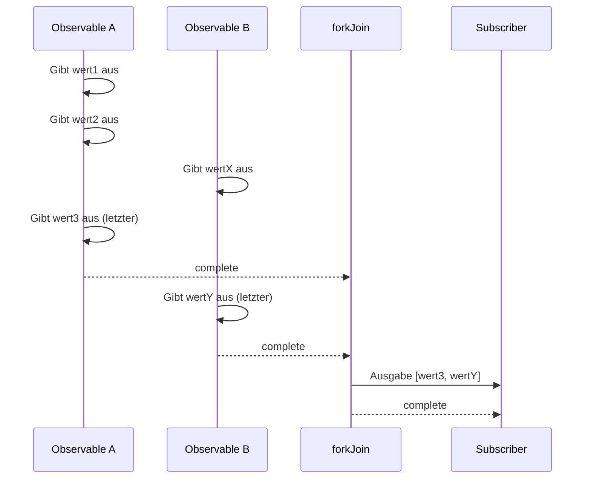
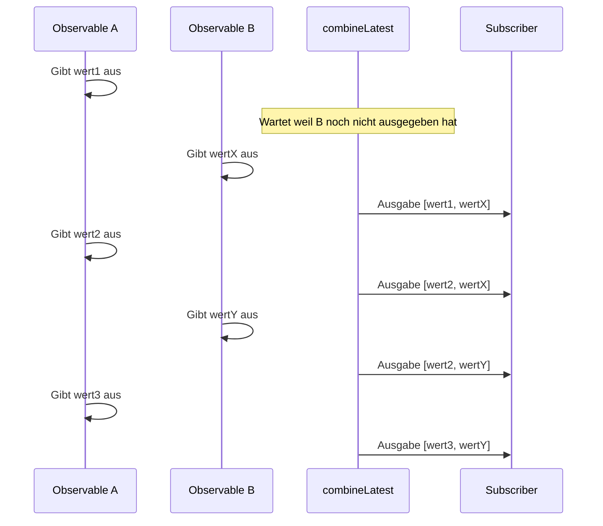

# Unterschied zwischen forkJoin und combineLatest

Beim Kombinieren mehrerer Observables in RxJS sind `forkJoin` und `combineLatest` die am häufigsten verwendeten Creation Functions. Diese beiden haben jedoch **signifikant unterschiedliches Verhalten**, und bei falscher Verwendung werden nicht die erwarteten Ergebnisse erzielt.

Diese Seite vergleicht beide gründlich mit Diagrammen und praktischen Beispielen und macht deutlich, "welches zu verwenden ist."

## Fazit: Unterschied zwischen forkJoin und combineLatest

| Merkmal | forkJoin | combineLatest |
|---------|----------|---------------|
| **Ausgabe-Timing** | **Einmal** nach Abschluss aller | **Jedes Mal** wenn ein Wert aktualisiert wird |
| **Ausgabewert** | **Letzter Wert** jedes Observables | **Neuester Wert** jedes Observables |
| **Abschlussbedingung** | Alle Observables abgeschlossen | Alle Observables abgeschlossen |
| **Hauptanwendungsfälle** | Parallele API-Aufrufe, initialer Datenload | Formularüberwachung, Echtzeit-Sync |
| **Unendliche Streams** | ❌ Kann nicht verwendet werden | ✅ Kann verwendet werden (gibt Werte auch ohne Abschluss aus) |

> [!TIP]
> **Einfache Merkregel**
> - `forkJoin` = "Sobald alle bereit sind, **einmal losfahren**" (ähnlich wie Promise.all)
> - `combineLatest` = "**Den neuesten Status melden** jedes Mal wenn sich jemand bewegt"

## Verhaltensunterschiede mit Diagrammen verstehen

### forkJoin Verhalten

### combineLatest Verhalten

## Wann welches verwenden (Fallweise Anleitung)

### Fälle für forkJoin

- **Parallele API-Aufrufe**: Wenn Sie erst verarbeiten wollen, nachdem alle Daten bereit sind
- **Initialer Datenload**: Alle benötigten Stammdaten beim App-Start abrufen

> [!WARNING]
> `forkJoin` kann nicht mit **Observables die nie abschließen** verwendet werden (`interval`, WebSocket, Event-Streams, etc.).

### Fälle für combineLatest

- **Echtzeit-Formulareingabe-Überwachung**: Mehrere Eingabewerte für Validierung kombinieren
- **Echtzeit-Sync mehrerer Streams**: Integrierte Anzeige von Sensordaten
- **Filterbedingungs-Kombination**: Suche ausführen wenn sich eine Bedingung ändert

## Zusammenfassung

| Auswahlkriterium | forkJoin | combineLatest |
|------------------|----------|---------------|
| Einmal verarbeiten wenn alle bereit | ✅ | ❌ |
| Bei jeder Wertänderung verarbeiten | ❌ | ✅ |
| Nicht-abschließende Streams | ❌ | ✅ |
| Promise.all-ähnliche Verwendung | ✅ | ❌ |
| Echtzeit-Synchronisation | ❌ | ✅ |

## Verwandte Seiten

- **[forkJoin](/de/guide/creation-functions/combination/forkJoin)** - Detaillierte Erklärung von forkJoin
- **[combineLatest](/de/guide/creation-functions/combination/combineLatest)** - Detaillierte Erklärung von combineLatest
- **[zip](/de/guide/creation-functions/combination/zip)** - Entsprechende Werte paaren
- **[merge](/de/guide/creation-functions/combination/merge)** - Mehrere Observables parallel ausführen
