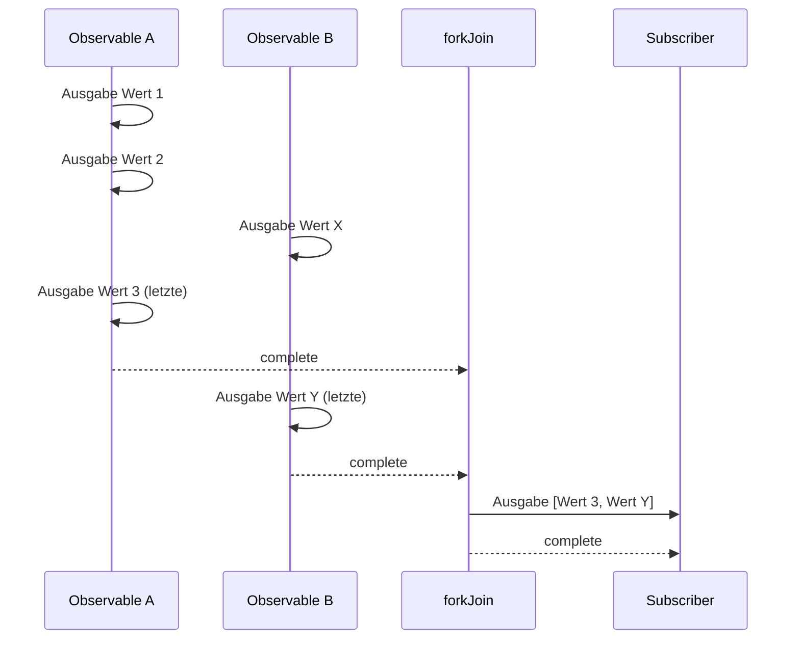
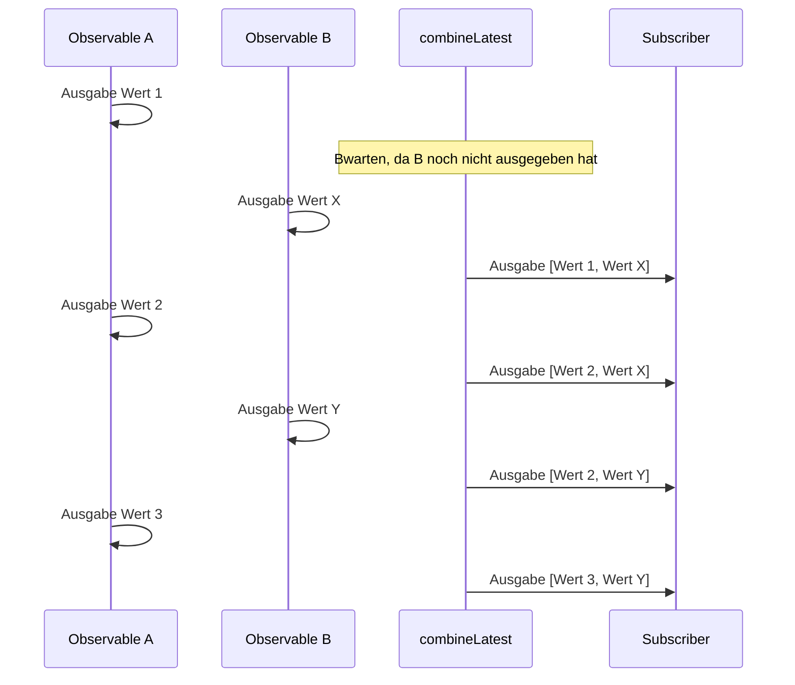
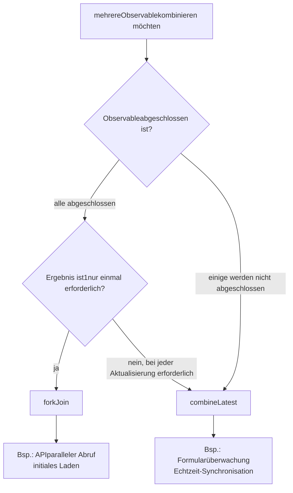

# Unterschied zwischen forkJoin und combineLatest

Beim Kombinieren mehrerer Observables in RxJS sind `forkJoin` und `combineLatest` die am häufigsten verwendeten Creation Functions. Die beiden verhalten sich jedoch **sehr unterschiedlich** und führen bei falscher Anwendung nicht zu den erwarteten Ergebnissen.

Diese Seite vergleicht gründlich die Unterschiede zwischen den beiden Funktionen mit Illustrationen und praktischen Beispielen, um zu verdeutlichen, welche Funktion Sie verwenden sollten.

## Fazit: Der Unterschied zwischen forkJoin und combineLatest

| Merkmal | forkJoin | combineLatest |
|---|---|---|
| **Ausgabe-Timing** | **Nur einmal** nach Abschluss aller | **Jedes Mal**, wenn ein Wert aktualisiert wird |
| **Ausgabewert** | Der **letzte Wert** jedes Observables | Der **neueste Wert** jedes Observables |
| **Abschlussbedingung** | Alle Observables sind abgeschlossen | Alle Observables sind abgeschlossen |
| **Hauptanwendung** | Paralleler API-Abruf, initiales Laden | Formularüberwachung, Echtzeit-Synchronisation |
| **Unendlicher Stream** | ❌ Nicht verwendbar (wird nicht abgeschlossen) | ✅ Verwendbar (gibt Werte aus, ohne abgeschlossen zu sein) |

> [!TIP]

> **Einfach zu merken**
> - `forkJoin` = „**einmal** abfahren, wenn alle anwesend sind" (ähnlich wie Promise.all)
> - `combineLatest` = „**den letzten Stand melden**, jedes Mal wenn sich jemand bewegt"

## Verstehen der Unterschiede im Verhalten mit Illustrationen

### Verhalten von forkJoin


```mermaid
sequenceDiagram
    participant A as Observable A
    participant B as Observable B
    participant F as forkJoin
    participant S as Subscriber

    A->>A: Ausgabe Wert 1
    A->>A: Ausgabe Wert 2
    B->>B: Ausgabe Wert X
    A->>A: Ausgabe Wert 3 (letzte)
    A-->>F: complete
    B->>B: Ausgabe Wert Y (letzte)
    B-->>F: complete
    F->>S: Ausgabe [Wert 3, Wert Y]
    F-->>S: complete
```

**Punkt**: Warten, bis alle Observables `complete` sind und **nur den letzten Wert** einmal ausgeben.

### Verhalten von combineLatest


```mermaid
sequenceDiagram
    participant A as Observable A
    participant B as Observable B
    participant C as combineLatest
    participant S as Subscriber

    A->>A: Ausgabe Wert 1
    Note over C: Bwarten, da B noch nicht ausgegeben hat
    B->>B: Ausgabe Wert X
    C->>S: Ausgabe [Wert 1, Wert X]
    A->>A: Ausgabe Wert 2
    C->>S: Ausgabe [Wert 2, Wert X]
    B->>B: Ausgabe Wert Y
    C->>S: Ausgabe [Wert 2, Wert Y]
    A->>A: Ausgabe Wert 3
    C->>S: Ausgabe [Wert 3, Wert Y]
```

**Punkt**: Nachdem alle Observables ihren ersten Wert ausgegeben haben, geben sie weiterhin die neueste Kombination aus **jedes Mal, wenn eines von ihnen aktualisiert wird**.

## Unterschiede in der Zeitleiste


```mermaid
gantt
    title forkJoin vs Ausgabe-Timing von combineLatest
    dateFormat X
    axisFormat %s

    section Observable A
    Wert1 :a1, 0, 1
    Wert2 :a2, 2, 1
    Wert3 :a3, 4, 1
    complete :milestone, a_done, 5, 0

    section Observable B
    WertX :b1, 1, 1
    WertY :b2, 3, 1
    complete :milestone, b_done, 4, 0

    section forkJoinAusgabe
    [Wert3,WertY] :crit, fork_out, 5, 1

    section combineLatestAusgabe
    [Wert1,WertX] :c1, 1, 1
    [Wert2,WertX] :c2, 2, 1
    [Wert2,WertY] :c3, 3, 1
    [Wert3,WertY] :c4, 4, 1
```

## Praktischer Vergleich: Verhalten mit derselben Datenquelle prüfen

Wenden wir `forkJoin` und `combineLatest` auf dasselbe Observable an und prüfen die Unterschiede in der Ausgabe.

```ts
import { forkJoin, combineLatest, interval, take, map } from 'rxjs';

// Ausgabebereich erstellen
const output = document.createElement('div');
output.innerHTML = '<h3>Vergleich forkJoin vs combineLatest:</h3>';
document.body.appendChild(output);

// Erstelle 2 Observables
const obs1$ = interval(1000).pipe(
  take(3),
  map(i => `A${i}`)
);

const obs2$ = interval(1500).pipe(
  take(2),
  map(i => `B${i}`)
);

// Ergebnisanzeigebereich für forkJoin
const forkJoinResult = document.createElement('div');
forkJoinResult.innerHTML = '<h4>forkJoin:</h4><div id="forkjoin-output">Warten...</div>';
output.appendChild(forkJoinResult);

// Ergebnisanzeigebereich für combineLatest
const combineLatestResult = document.createElement('div');
combineLatestResult.innerHTML = '<h4>combineLatest:</h4><div id="combinelatest-output"></div>';
output.appendChild(combineLatestResult);

// forkJoin：Nach Abschluss aller1nur einmal ausgeben
forkJoin([obs1$, obs2$]).subscribe(result => {
  const el = document.getElementById('forkjoin-output');
  if (el) {
    el.textContent = `Ausgabe: [${result.join(', ')}]`;
    el.style.color = 'green';
    el.style.fontWeight = 'bold';
  }
});

// combineLatest：Ausgabe bei jeder Wertänderung
const combineOutput = document.getElementById('combinelatest-output');
combineLatest([obs1$, obs2$]).subscribe(result => {
  if (combineOutput) {
    const item = document.createElement('div');
    item.textContent = `Ausgabe: [${result.join(', ')}]`;
    combineOutput.appendChild(item);
  }
});
```

**Ausführungsergebnis**:
- `forkJoin`: gibt `[A2, B1]` **nur einmal** nach etwa 3 Sekunden aus
- `combineLatest`: gibt **4 Mal** nach ca. 1,5 s aus (z.B. `[A0, B0]` → `[A1, B0]` → `[A2, B0]` → `[A2, B1]`)

> [!NOTE]

> Die Reihenfolge der Ausgabe von `combineLatest` hängt von der Zeitplanung des Timers ab und kann je nach Umgebung variieren. Wichtig ist, dass „jedes Mal, wenn einer der Werte aktualisiert wird, ein Wert ausgegeben wird". Im obigen Beispiel wird 4 Mal ausgegeben, aber die Reihenfolge kann sich ändern, zum Beispiel `[A1, B0]` → `[A1, B1]`.

## Welches sollten Sie verwenden (fallspezifischer Leitfaden)

### Fälle, in denen forkJoin verwendet werden sollte

#### 1. Paralleler Abruf mehrerer APIs

Wenn Sie die Daten verarbeiten möchten, nachdem alle Daten verfügbar sind.

```ts
import { forkJoin } from 'rxjs';
import { ajax } from 'rxjs/ajax';

// Benutzerinformationen und Einstellungen gleichzeitig abrufen
forkJoin({
  user: ajax.getJSON('/api/user/123'),
  settings: ajax.getJSON('/api/settings'),
  notifications: ajax.getJSON('/api/notifications')
}).subscribe(({ user, settings, notifications }) => {
  // Bildschirm zeichnen, nachdem alle Daten vollständig sind
  renderDashboard(user, settings, notifications);
});
```

#### 2. Bulk-Datenabruf beim initialen Laden

Erfassen Sie alle notwendigen Stammdaten beim Start der Anwendung in einem Zug.

```ts
import { forkJoin } from 'rxjs';
import { ajax } from 'rxjs/ajax';

function loadInitialData() {
  return forkJoin({
    categories: ajax.getJSON('/api/categories'),
    countries: ajax.getJSON('/api/countries'),
    currencies: ajax.getJSON('/api/currencies')
  });
}
```

> [!WARNING]

> `forkJoin` kann nicht für **Observables, die nicht abgeschlossen werden** (z.B. `interval`, WebSocket, Event-Streams) verwendet werden. Wenn es nicht vollständig ist, wird es weiter warten.

### Fälle, in denen combineLatest verwendet werden sollte

#### 1. Echtzeit-Überwachung von Formulareingaben

Kombinieren Sie mehrere Eingabewerte, um Validierung und Anzeige zu aktualisieren.

```ts
import { combineLatest, fromEvent } from 'rxjs';
import { map, startWith } from 'rxjs';

const name$ = fromEvent(nameInput, 'input').pipe(
  map(e => (e.target as HTMLInputElement).value),
  startWith('')
);

const email$ = fromEvent(emailInput, 'input').pipe(
  map(e => (e.target as HTMLInputElement).value),
  startWith('')
);

const age$ = fromEvent(ageInput, 'input').pipe(
  map(e => parseInt((e.target as HTMLInputElement).value) || 0),
  startWith(0)
);

// Validierung bei jeder Eingabeänderung ausführen
combineLatest([name$, email$, age$]).subscribe(([name, email, age]) => {
  const isValid = name.length > 0 && email.includes('@') && age >= 18;
  submitButton.disabled = !isValid;
});
```

#### 2. Echtzeit-Synchronisation mehrerer Streams

Integrierte Anzeige von Sensordaten und Status.

```ts
import { combineLatest, interval } from 'rxjs';
import { map } from 'rxjs';

const temperature$ = interval(2000).pipe(map(() => 20 + Math.random() * 10));
const humidity$ = interval(3000).pipe(map(() => 40 + Math.random() * 30));
const pressure$ = interval(2500).pipe(map(() => 1000 + Math.random() * 50));

combineLatest([temperature$, humidity$, pressure$]).subscribe(
  ([temp, humidity, pressure]) => {
    updateDashboard({ temp, humidity, pressure });
  }
);
```

#### 3. Kombination von Filterbedingungen

Suche ausführen, jedes Mal wenn sich mehrere Filterbedingungen ändern.

```ts
import { combineLatest, BehaviorSubject } from 'rxjs';
import { debounceTime, switchMap } from 'rxjs';

const searchText$ = new BehaviorSubject('');
const category$ = new BehaviorSubject('all');
const sortOrder$ = new BehaviorSubject('asc');

combineLatest([searchText$, category$, sortOrder$]).pipe(
  debounceTime(300),
  switchMap(([text, category, sort]) =>
    fetchProducts({ text, category, sort })
  )
).subscribe(products => {
  renderProductList(products);
});
```

## Flussdiagramm für die Verwendung


```mermaid
flowchart TD
    A[mehrereObservablekombinieren möchten] --> B{Observableabgeschlossen ist?}
    B -->|alle abgeschlossen| C{Ergebnis ist1nur einmal erforderlich?}
    B -->|einige werden nicht abgeschlossen| D[combineLatest]
    C -->|ja| E[forkJoin]
    C -->|nein, bei jeder Aktualisierung erforderlich| D

    E --> E1[Bsp.: APIparalleler Abruf<br>initiales Laden]
    D --> D1[Bsp.: Formularüberwachung<br>Echtzeit-Synchronisation]
```

## Häufige Fehler und Abhilfen

### Fehler 1: forkJoin für ein Observable verwenden, das nicht abgeschlossen wird

```ts
// ❌ Dies wird niemals ausgegeben
forkJoin([
  interval(1000),  // wird nicht abgeschlossen
  ajax.getJSON('/api/data')
]).subscribe(console.log);

// ✅ takeabschließen mit combineLatestverwenden
forkJoin([
  interval(1000).pipe(take(5)),  // 5abgeschlossen in
  ajax.getJSON('/api/data')
]).subscribe(console.log);
```

### Fehler 2: kein Anfangswert in combineLatest

```ts
// ❌ name$bis B zum ersten Mal ausgibtemail$Werte vorhanden, aber nichts wird ausgegeben
combineLatest([name$, email$]).subscribe(console.log);

// ✅ startWithAnfangswert setzen mit
combineLatest([
  name$.pipe(startWith('')),
  email$.pipe(startWith(''))
]).subscribe(console.log);
```

## Zusammenfassung

| Auswahlkriterium | forkJoin | combineLatest |
|---|---|---|
| Einmalige Verarbeitung wenn alle bereit sind | ✅ | ❌ |
| Verarbeitung bei jeder Wertänderung | ❌ | ✅ |
| Stream der nicht abgeschlossen wird | ❌ | ✅ |
| Promise.all-ähnliche Verwendung | ✅ | ❌ |
| Echtzeit-Synchronisation | ❌ | ✅ |

> [!IMPORTANT]

> **Verwendungsprinzip**
> - **forkJoin**: „nur einmal, wenn alle anwesend sind" → paralleler API-Abruf, initiales Laden
> - **combineLatest**: „Aktualisierung jedes Mal, wenn sich jemand bewegt" → Formularüberwachung, Echtzeit-UI

## Verwandte Seiten

- **[forkJoin](/de/guide/creation-functions/combination/forkJoin)** - Ausführliche Erklärung von forkJoin
- **[combineLatest](/de/guide/creation-functions/combination/combineLatest)** - Ausführliche Erläuterung von combineLatest
- **[zip](/de/guide/creation-functions/combination/zip)** - Entsprechende Werte paaren
- **[merge](/de/guide/creation-functions/combination/merge)** - Mehrere Observables parallel ausführen
- **[withLatestFrom](/de/guide/operators/combination/withLatestFrom)** - Nur Haupt-Stream löst aus
