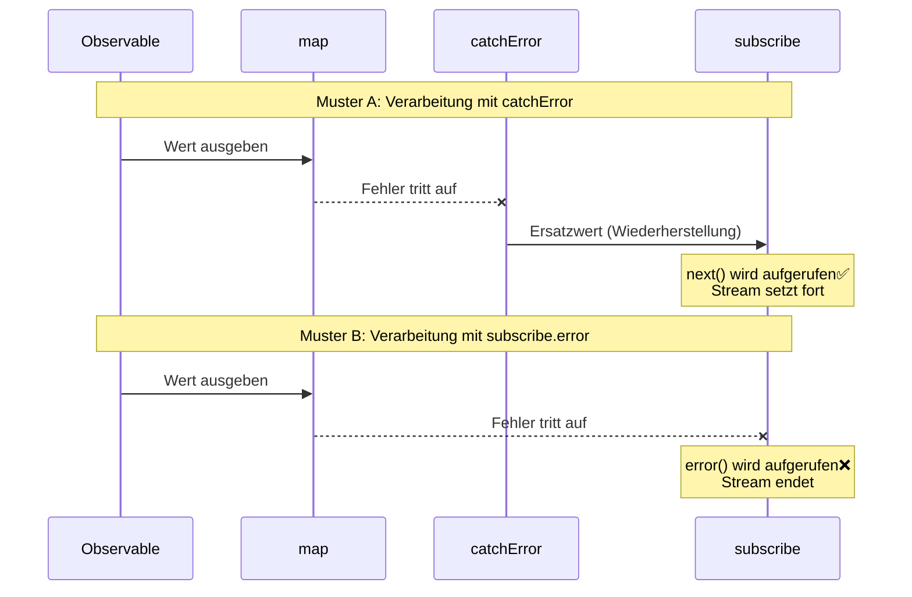
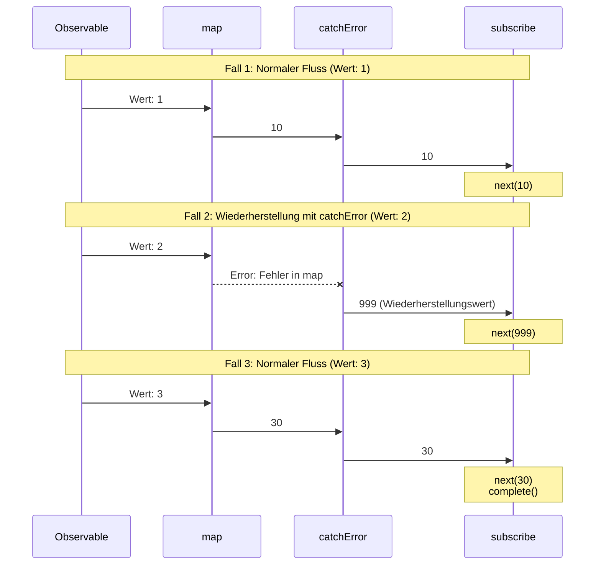
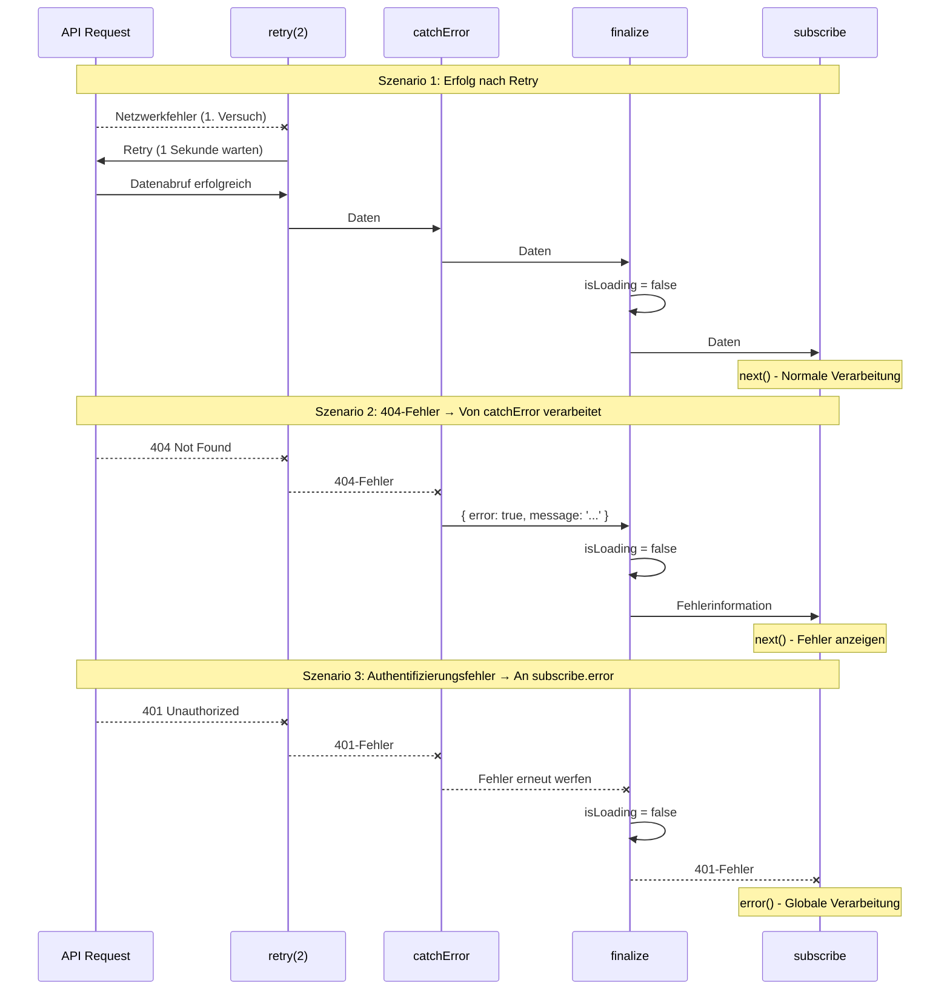
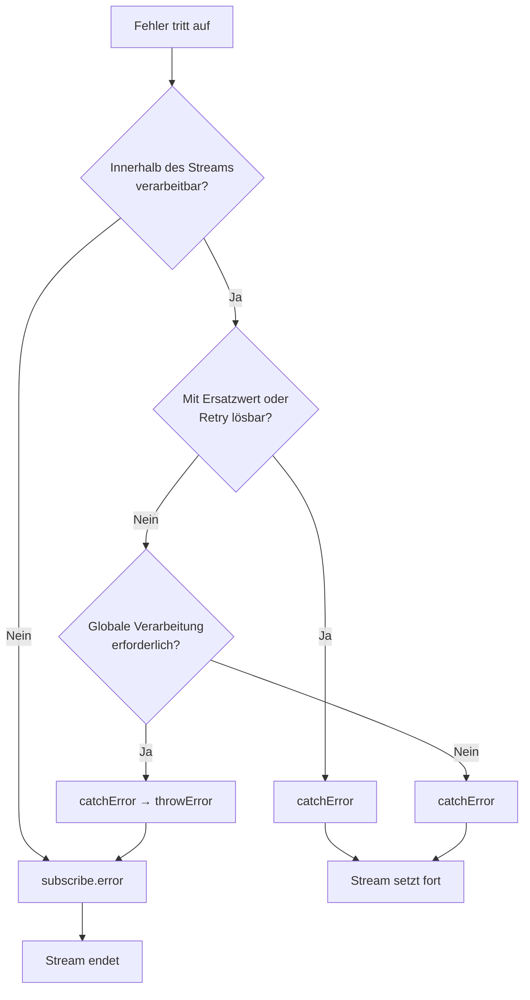

# Zwei Orte der Fehlerbehandlung

Bei der Fehlerbehandlung in RxJS ist die Entscheidung, „wo" Fehler abgefangen werden, eine wichtige Designentscheidung. In RxJS gibt es zwei Hauptorte für die Fehlerbehandlung: den `catchError`-Operator innerhalb der Pipeline und den `error`-Callback beim finalen `subscribe`. Diese Seite erklärt die Unterschiede zwischen beiden und ihre angemessene Verwendung.

## Zwei Orte der Fehlerbehandlung

Die Fehlerbehandlung in RxJS erfolgt an zwei Hauptorten:

1. **Innerhalb der Pipeline** - `.pipe(catchError(...))`
2. **Beim Abonnieren** - `subscribe({ error: ... })`

Das Verständnis dieses Unterschieds ermöglicht es Ihnen, eine robuste und wartbare Fehlerbehandlungsstrategie aufzubauen.

## Vergleichstabelle: catchError vs subscribe.error

Die folgende Tabelle fasst die Hauptunterschiede zwischen den beiden Ansätzen zusammen.

| Element | `.pipe(catchError(...))` | `subscribe({ error: ... })` |
|------|-------------------------|----------------------------|
| **Timing der Verarbeitung** | Innerhalb der Pipeline (Zwischenverarbeitung) | Beim finalen Abonnement (Endpunkt) |
| **Fehlertyp** | Fehler, die im Stream auftreten | Nicht abgefangene Fehler |
| **Hauptverwendung** | Fehlerwiederherstellung, Transformation, Wiederholung | Finale Fehlerbenachrichtigung, Protokollierung |
| **Stream-Fortsetzung** | Fortsetzung durch Rückgabe eines alternativen Observable möglich | Stream wird beendet (keine weiteren Werte) |
| **Wiederherstellbarkeit** | ✅ Möglich (alternative Werte oder Retry) | ❌ Nicht möglich (Beendigung) |
| **Mehrfachplatzierung** | ✅ Möglich (mehrere innerhalb der Pipeline) | ⚠️ Ein error-Callback pro subscribe |
| **Rückgabetyp** | Muss `Observable<T>` zurückgeben | `void` (gibt nichts zurück) |

### Sequenzdiagramm: Unterschied zwischen catchError und subscribe.error

Das folgende Diagramm zeigt visuell den Unterschied zwischen der Verarbeitung mit `catchError` und `subscribe.error`.



#### Wichtige Punkte aus diesem Diagramm

**Muster A (mit catchError):**
- Auch wenn ein Fehler auftritt, gibt `catchError` einen Ersatzwert zurück, sodass `next()` von `subscribe` aufgerufen wird
- Der Stream setzt fort und nachfolgende Werte können verarbeitet werden
- Fehler werden „wiederhergestellt" und in einen normalen Stream zurückverwandelt

**Muster B (mit subscribe.error):**
- Wenn der Fehler `subscribe` erreicht, wird der `error()`-Callback aufgerufen
- Der Stream endet und es fließen keine weiteren Werte
- Der Fehler wird „benachrichtigt" und der Stream wird beendet

## Den Fehlerfluss verstehen

Schauen wir uns anhand eines tatsächlichen Codebeispiels an, wie Fehler fließen.

```typescript
import { of, map, catchError } from 'rxjs';
of(1, 2, 3).pipe(
  map(x => {
    if (x === 2) throw new Error('Fehler in map');  // ①
    return x * 10;
  }),
  catchError(err => {
    console.log('Abgefangen von catchError:', err.message);  // ②
    return of(999); // Wiederherstellung
  })
).subscribe({
  next: val => console.log('Wert:', val),
  error: err => console.log('Abgefangen von subscribe.error:', err), // ③
  complete: () => console.log('Abgeschlossen')
});

// Ausgabe:
// Wert: 10
// Abgefangen von catchError: Fehler in map (← Verarbeitung bei ②)
// Wert: 999 (← Wiederherstellung erfolgreich)
// Wert: 30
// Abgeschlossen
```

In diesem Beispiel:
1. Fehler tritt in `map` auf (①)
2. `catchError` fängt den Fehler ab und stellt ihn wieder her (②)
3. `subscribe.error` wird nicht aufgerufen (da der Fehler verarbeitet wurde)

> [!TIP] Fehlerfluss
> Fehler, die von `catchError` verarbeitet werden, erreichen `subscribe.error` nicht. `catchError` hat die Rolle, „Fehler zu verarbeiten und in einen normalen Stream zurückzuverwandeln".

### Sequenzdiagramm: Fehlerfluss (3 Fälle)

Das folgende Diagramm zeigt in drei Fällen, wie Fehler propagiert werden.



#### Wie aus diesem Diagramm ersichtlich
- **Fall 1 & 3**: Wenn kein Fehler vorliegt, fließen Werte in der Reihenfolge `map` → `catchError` → `subscribe`
- **Fall 2**: Wenn in `map` ein Fehler auftritt, fängt `catchError` ihn ab und gibt einen Wiederherstellungswert (999) zurück
- Von `catchError` verarbeitete Fehler erreichen `subscribe.error` nicht

## Von catchError abgefangene Fehler

`catchError` innerhalb der Pipeline kann folgende Arten von Fehlern abfangen:

| Fehlerort | Beispiel | Von catchError verarbeitbar |
|----------------|-----|---------------------|
| throw in Operator | `map(x => { throw new Error() })` | ✅ |
| HTTP-Fehler | `ajax.get('/api').pipe(catchError(...))` | ✅ |
| Fehler in switchMap | `switchMap(() => throwError(...))` | ✅ |
| Custom Observable | `new Observable(sub => sub.error(...))` | ✅ |
| Promise rejection | `from(Promise.reject(...))` | ✅ |

### Praxisbeispiel: Stufenweise API-Fehlerverarbeitung

```typescript
import { of, throwError, catchError, switchMap } from 'rxjs';
import { ajax } from 'rxjs/ajax';

// API-Fehler mit catchError verarbeiten
ajax.get('/api/user/123').pipe(
  catchError(err => {
    if (err.status === 404) {
      // 404-Fehler → Standardbenutzer zurückgeben
      return of({ id: 123, name: 'Standardbenutzer' });
    }
    // Andere Fehler erneut werfen (an subscribe.error)
    return throwError(() => err);
  }),
  switchMap(user => {
    // Nach Benutzerabruf, Profil abrufen
    return ajax.get(`/api/profile/${user.id}`);
  }),
  catchError(err => {
    console.log('Profil-Abruffehler:', err);
    // Ohne Profil fortsetzen
    return of(null);
  })
).subscribe({
  next: profile => console.log('Profil:', profile),
  error: err => console.log('Finaler Fehler:', err) // Nur nicht von catchError verarbeitete Fehler
});
```

> [!IMPORTANT] Mehrere catchError platzieren
> Durch Platzierung mehrerer `catchError` in der Pipeline können Sie Fehler auf verschiedenen Stufen individuell verarbeiten. Dies ermöglicht eine feinkörnige Fehlerbehandlung.

## Von subscribe.error abgefangene Fehler

Der `error`-Callback von `subscribe` fängt folgende Fehler ab:

| Fehlertyp | Beschreibung | Beispiel |
|------------|------|-----|
| **Nicht von catchError verarbeitete Fehler** | Fehler, die nicht in der Pipeline verarbeitet wurden | Fehler werden so wie sie sind propagiert |
| **Nach catchError erneut geworfene Fehler** | Fehler, die explizit von catchError erneut geworfen wurden | `catchError(e => throwError(() => e))` |

### Praxisbeispiel: Stufenweise Verarbeitung und erneutes Werfen

```typescript
import { of, throwError, map, catchError } from 'rxjs';
// Muster 1: Nicht von catchError verarbeitete Fehler
throwError(() => new Error('Unverarbeiteter Fehler')).subscribe({
  next: val => console.log('Wert:', val),
  error: err => console.log('subscribe.error:', err.message)
  // Ausgabe: subscribe.error: Unverarbeiteter Fehler
});

// Muster 2: Erneutes Werfen mit catchError
of(1).pipe(
  map(() => { throw new Error('Fehler in map'); }),
  catchError(err => {
    console.log('Abgefangen von catchError:', err.message);
    // Nach Protokollierung Fehler erneut werfen
    return throwError(() => new Error('Erneut geworfener Fehler'));
  })
).subscribe({
  next: val => console.log('Wert:', val),
  error: err => console.log('subscribe.error:', err.message)
  // Ausgabe:
  // Abgefangen von catchError: Fehler in map
  // subscribe.error: Erneut geworfener Fehler
});
```

> [!WARNING] Über Fehler innerhalb von subscribe
> Das `throw` innerhalb der `next`- und `complete`-Callbacks von `subscribe` wird **nicht empfohlen**. Die Fehlerbehandlung sollte immer innerhalb der Pipeline (`catchError`) erfolgen. throw innerhalb von subscribe kann zu undefiniertem Verhalten führen.

## Entscheidungskriterien für die Verwendung

Welches Sie verwenden sollten, hängt davon ab, „wo Sie den Fehler verarbeiten möchten".

### Wann catchError verwendet werden sollte

Verwenden Sie `catchError`, wenn folgende Bedingungen zutreffen:

- ✅ **Sie möchten die Verarbeitung innerhalb des Streams abschließen**
- ✅ **Sie können alternative Werte oder Fallback-Daten bereitstellen**
- ✅ **Es besteht die Möglichkeit, dass Retry das Problem löst**
- ✅ **Sie möchten Fehler transformieren und zu einem anderen Observable wechseln**
- ✅ **Sie möchten die nachfolgende Verarbeitung fortsetzen**

#### Muster 1: Erfolgs- und Fehlerfall in einheitlichem Format

```typescript
import { of, throwError, catchError, map } from 'rxjs';
interface User {
  id: number;
  name: string;
}

interface ApiResult {
  success: boolean;
  data?: User[];
  error?: string;
}

// API-Aufruf simulieren (Beispiel mit Fehler)
function fetchUsers(shouldFail: boolean) {
  if (shouldFail) {
    return throwError(() => new Error('Netzwerkfehler'));
  }
  return of<User[]>([
    { id: 1, name: 'Taro Yamada' },
    { id: 2, name: 'Hanako Sato' }
  ]);
}

fetchUsers(true).pipe(
  // Bei Erfolg: In { success: true, data: [...] } umwandeln
  map(users => ({ success: true, data: users } as ApiResult)),
  // Bei Fehler: In { success: false, error: '...' } umwandeln
  catchError(err => {
    return of<ApiResult>({
      success: false,
      error: 'Benutzerabruf fehlgeschlagen'
    });
  })
).subscribe(result => {
  // Gleiche Formatverarbeitung bei Erfolg und Fehler
  if (result.success) {
    console.log('Benutzer:', result.data);
  } else {
    console.log('Fehler aufgetreten:', result.error);
  }
});

// Ausgabe: Fehler aufgetreten: Benutzerabruf fehlgeschlagen
```

#### Muster 2: Einfach Standardwert zurückgeben

```typescript
import { of, throwError, catchError } from 'rxjs';
interface User {
  id: number;
  name: string;
}

// API-Aufruf simulieren (Beispiel mit Fehler)
function fetchUsers(shouldFail: boolean) {
  if (shouldFail) {
    return throwError(() => new Error('Netzwerkfehler'));
  }
  return of<User[]>([
    { id: 1, name: 'Taro Yamada' },
    { id: 2, name: 'Hanako Sato' }
  ]);
}

fetchUsers(true).pipe(
  catchError(err => {
    console.error('Fehler aufgetreten:', err.message);
    // Leeres Array als Standardwert zurückgeben
    return of<User[]>([]);
  })
).subscribe(users => {
  if (users.length === 0) {
    console.log('Keine Benutzer gefunden');
  } else {
    console.log('Benutzer:', users);
  }
});

// Ausgabe:
// Fehler aufgetreten: Netzwerkfehler
// Keine Benutzer gefunden
```

### Wann subscribe.error verwendet werden sollte

Verwenden Sie `subscribe.error`, wenn folgende Bedingungen zutreffen:

- ✅ **Sie möchten mit einem globalen Error-Handler verarbeiten**
- ✅ **Verarbeitung erforderlich, die die gesamte Anwendung betrifft**
- ✅ **Sie möchten Fehlerprotokolle an den Server senden**
- ✅ **Sie möchten den Stream beenden**
- ✅ **Als letzte Verteidigungslinie für die Fehlerbehandlung**

```typescript
import { throwError, catchError, retry } from 'rxjs';
import { ajax } from 'rxjs/ajax';

ajax.getJSON('/api/critical-data').pipe(
  retry(2),
  catchError(err => {
    if (err.status === 401) {
      // Authentifizierungsfehler erneut werfen (global verarbeiten)
      return throwError(() => err);
    }
    // Andere verarbeiten
    return throwError(() => new Error('Datenabruf fehlgeschlagen'));
  })
).subscribe({
  next: data => console.log('Daten:', data),
  error: err => {
    // Globaler Error-Handler
    globalErrorHandler.handle(err);
    // Zur Fehlerseite navigieren
    router.navigate(['/error']);
  }
});
```

## Praxismuster: Hierarchische Fehlerbehandlung

In der Praxis ist eine hierarchische Fehlerbehandlung, die `catchError` und `subscribe.error` kombiniert, effektiv.

```typescript
import { of, throwError, catchError, retry, finalize } from 'rxjs';
import { ajax } from 'rxjs/ajax';

function fetchUserData(userId: string) {
  let isLoading = true;

  return ajax.getJSON(`/api/users/${userId}`).pipe(
    // Ebene 1: Wiederholbare Netzwerkfehler
    retry({ count: 2, delay: 1000 }),

    // Ebene 2: Wiederherstellbare Fehler
    catchError((error) => {
      if (error.status === 404) {
        // 404 → Mit Standarddaten fortsetzen
        return of({
          error: true,
          message: 'Benutzer nicht gefunden',
          data: null
        });
      } else if (error.status >= 500) {
        // 500er → Mit Fehlermeldung fortsetzen
        return of({
          error: true,
          message: 'Serverfehler aufgetreten',
          data: null
        });
      }
      // Andere Fehler erneut werfen (an subscribe.error)
      return throwError(() => error);
    }),

    // Ebene 3: Immer ausgeführtes Cleanup
    finalize(() => {
      isLoading = false;
      console.log('Laden abgeschlossen');
    })
  );
}

// Verwendungsbeispiel
fetchUserData('123').subscribe({
  next: (result) => {
    if (result.error) {
      // Von catchError verarbeiteter Fehler (in UI anzeigen)
      console.error('Benutzerfehler:', result.message);
      showUserFriendlyError(result.message);
    } else {
      // Normale Daten
      console.log('Benutzerdaten:', result.data);
      displayUserData(result.data);
    }
  },
  error: (err) => {
    // Kritischer, nicht von catchError verarbeiteter Fehler
    console.error('Kritischer Fehler:', err);
    // Globalen Error-Handler benachrichtigen
    globalErrorHandler.handle(err);
    // Zur Fehlerseite navigieren
    navigateToErrorPage();
  },
  complete: () => console.log('Verarbeitung abgeschlossen')
});

// Hilfsfunktionen
function showUserFriendlyError(message: string) {
  console.log('Fehler in UI anzeigen:', message);
}
function displayUserData(data: any) {
  console.log('Daten in UI anzeigen:', data);
}
function navigateToErrorPage() {
  console.log('Zur Fehlerseite navigieren');
}

// Globaler Error-Handler
const globalErrorHandler = {
  handle(err: any) {
    console.error('Globaler Fehler:', err);
    // Fehlerprotokoll an Server senden
    // sendErrorLog(err);
  }
};
```

> [!TIP] Vorteile der hierarchischen Fehlerbehandlung
> - **Ebene 1 (retry)**: Automatische Wiederherstellung bei vorübergehenden Netzwerkfehlern
> - **Ebene 2 (catchError)**: Bereitstellung benutzerfreundlicher Fehlermeldungen
> - **Ebene 3 (subscribe.error)**: Unerwartete Fehler in der letzten Verteidigungslinie verarbeiten
> - **finalize**: Ressourcen werden immer bereinigt

### Sequenzdiagramm: Fluss der hierarchischen Fehlerbehandlung

Das folgende Diagramm zeigt den hierarchischen Fehlerbehandlungsfluss: retry → catchError → finalize → subscribe.



#### Wie aus diesem Diagramm ersichtlich
- **Szenario 1**: Vorübergehende Fehler werden durch `retry` wiederhergestellt und Daten erfolgreich abgerufen
- **Szenario 2**: 404-Fehler werden von `catchError` abgefangen und in eine benutzerfreundliche Nachricht umgewandelt
- **Szenario 3**: Authentifizierungsfehler werden von `catchError` erneut geworfen und von `subscribe.error` zentral verwaltet
- **Alle Szenarien gemeinsam**: `finalize` wird immer ausgeführt und setzt den Ladestatus zurück

## Auswahlrichtlinien nach Szenario

Richtlinien, welches für jedes tatsächliche Szenario verwendet werden sollte.

| Szenario | Empfohlen | Grund |
|---------|------|------|
| 404 Not Found → Standardwert anzeigen | `catchError` | Alternative Werte können innerhalb des Streams zurückgegeben werden |
| Vorübergehender Netzwerkfehler → Retry | `catchError` | Verarbeitung setzt auch nach Retry fort |
| Authentifizierungsfehler (401) → Login-Bildschirm | Beide möglich | Redirect mit catchError oder zentrale Verwaltung mit subscribe.error möglich |
| Server-500-Fehler → Fehlerseite | Beide möglich | catchError bei Retry, subscribe.error bei sofortiger Beendigung |
| Validierungsfehler → Im Formular anzeigen | `catchError` | Fehlerinformationen an UI übergeben und anzeigen |
| Unerwarteter Fehler → Protokollsendung | `subscribe.error` | Als letzte Verteidigungslinie protokollieren |

### Flexibles Beispiel für Authentifizierungsfehlerbehandlung

Authentifizierungsfehler (401) können je nach Design mit beiden Ansätzen behandelt werden.

```typescript
import { throwError, EMPTY, catchError } from 'rxjs';
import { ajax } from 'rxjs/ajax';

// Ansatz 1: Redirect mit catchError (innerhalb des Streams abschließen)
ajax.getJSON('/api/protected-data').pipe(
  catchError(err => {
    if (err.status === 401) {
      // Authentifizierungsfehler mit catchError verarbeiten
      router.navigate(['/login']);
      return EMPTY; // Stream leeren und beenden
    }
    return throwError(() => err);
  })
).subscribe({
  next: data => console.log('Daten:', data)
});

// Ansatz 2: Zentrale Verwaltung mit subscribe.error
ajax.getJSON('/api/protected-data').pipe(
  catchError(err => {
    // Authentifizierungsfehler erneut werfen (global verarbeiten)
    if (err.status === 401) {
      return throwError(() => err);
    }
    // Andere verarbeiten
    return throwError(() => err);
  })
).subscribe({
  next: data => console.log('Daten:', data),
  error: err => {
    if (err.status === 401) {
      // Globaler Authentifizierungs-Handler
      authService.handleUnauthorized();
    }
  }
});
```

> [!NOTE] Designwahl
> Fehler wie Authentifizierungsfehler, die die gesamte Anwendung betreffen, werden je nach Projektdesignrichtlinie unterschiedlich verarbeitet.
> - **Verteilte Verarbeitung**: Individuelle Verarbeitung bei jedem API-Aufruf (catchError)
> - **Zentrale Verwaltung**: Einheitliche Verarbeitung mit globalem Error-Handler (subscribe.error)

## Flussdiagramm: Fehlerbehandlungsauswahl



## Best Practices

### 1. Fehler früh abfangen, spät erneut werfen

```typescript
import { throwError, catchError, map } from 'rxjs';
import { ajax } from 'rxjs/ajax';

ajax.getJSON('/api/data').pipe(
  // Früh abfangen
  catchError(err => {
    console.log('Fehler protokollieren:', err);
    // Wenn nicht verarbeitbar, erneut werfen
    return throwError(() => err);
  }),
  map(data => transformData(data)),
  // Transformationsfehler auch abfangen
  catchError(err => {
    console.log('Transformationsfehler:', err);
    return throwError(() => err);
  })
).subscribe({
  next: data => console.log('Daten:', data),
  error: err => {
    // Finaler Error-Handler
    globalErrorHandler.handle(err);
  }
});

function transformData(data: any) {
  return data;
}
```

### 2. Fehlertypen klar unterscheiden

```typescript
import { of, throwError, catchError } from 'rxjs';
import { ajax } from 'rxjs/ajax';

// Benutzerdefinierte Fehlerklassen
class RecoverableError extends Error {
  constructor(message: string) {
    super(message);
    this.name = 'RecoverableError';
  }
}

class FatalError extends Error {
  constructor(message: string) {
    super(message);
    this.name = 'FatalError';
  }
}

ajax.getJSON('/api/data').pipe(
  catchError(err => {
    if (err.status === 404 || err.status === 500) {
      // Wiederherstellbar
      return throwError(() => new RecoverableError(err.message));
    }
    // Kritischer Fehler
    return throwError(() => new FatalError(err.message));
  })
).subscribe({
  next: data => console.log('Daten:', data),
  error: err => {
    if (err instanceof RecoverableError) {
      // Wiederherstellungsverarbeitung
      console.log('Wiederherstellbarer Fehler:', err.message);
    } else if (err instanceof FatalError) {
      // Kritische Fehlerverarbeitung
      console.error('Kritischer Fehler:', err.message);
    }
  }
});
```

### 3. Cleanup mit finalize sicherstellen

```typescript
import { of, catchError, finalize } from 'rxjs';
import { ajax } from 'rxjs/ajax';

let isLoading = true;
let resourceHandle: any = null;

ajax.getJSON('/api/data').pipe(
  catchError(err => {
    console.log('Fehlerverarbeitung:', err);
    return of(null);
  }),
  finalize(() => {
    // Immer ausgeführt, unabhängig von Erfolg oder Fehler
    isLoading = false;
    if (resourceHandle) {
      resourceHandle.release();
      resourceHandle = null;
    }
    console.log('Cleanup abgeschlossen');
  })
).subscribe({
  next: data => console.log('Daten:', data),
  error: err => console.error('Fehler:', err)
});
```

## Häufig gestellte Fragen

::: info **F: Müssen sowohl catchError als auch subscribe.error geschrieben werden?**
A: Ja, es wird empfohlen, beide zu schreiben.
`catchError` für „verarbeitbare Fehler",
`subscribe.error` als „letzte Verteidigungslinie für unerwartete Fehler".
:::

::: info **F: Wohin geht throwError() innerhalb von catchError?**
A: Wenn es einen nachfolgenden `catchError` gibt, wird es dort abgefangen, andernfalls erreicht es `subscribe.error`.
:::

::: info **F: Können mehrere catchError platziert werden?**
A: Ja, Sie können mehrere innerhalb der Pipeline platzieren. Verschiedene Fehler können auf jeder Stufe verarbeitet werden.
:::

::: info **F: Was passiert, wenn subscribe.error weggelassen wird?**
A: Wenn ein Fehler auftritt, wird `"Unhandled error"` in der Konsole angezeigt und die Anwendung kann sich unerwartet verhalten. Es wird empfohlen, es immer zu schreiben.
:::

::: info **F: Was passiert, wenn catchError EMPTY zurückgibt?**
A: Der Stream wird sofort abgeschlossen. `complete()` wird aufgerufen, ohne Werte auszugeben. Wird verwendet, wenn Fehler ignoriert werden sollen.
```typescript
import { EMPTY, catchError } from 'rxjs';
source$.pipe(
  catchError(() => EMPTY) // Fehler ignorieren und abschließen
).subscribe({
  next: val => console.log(val),
  complete: () => console.log('Abgeschlossen') // Dies wird aufgerufen
});
```
:::

::: info **F: Endet der Stream immer, wenn ein Fehler auftritt?**
A: Nein. Wenn er mit `catchError` verarbeitet wird, setzt der Stream fort. Er endet nur, wenn er `subscribe.error` erreicht.
:::

::: info **F: Sollte finalize vor oder nach catchError platziert werden?**
A: Normalerweise **nach catchError**. Dadurch wird sichergestellt, dass das Cleanup auch nach der Fehlerverarbeitung ausgeführt wird.
```typescript
source$.pipe(
  retry(2),
  catchError(err => of(defaultValue)),
  finalize(() => cleanup()) // Nach catchError
)
```
:::

::: info **F: Was ist der Unterschied zwischen catchError und try-catch?**
A: `try-catch` fängt nur **synchrone Fehler** ab, aber `catchError` fängt alle Fehler im Stream ab, einschließlich **asynchroner Fehler** (HTTP-Anfragen, Timer usw.).
:::

## Zusammenfassung

Durch das Verständnis der zwei Orte der Fehlerbehandlung in RxJS können Sie eine effektive Fehlerbehandlungsstrategie aufbauen.

### Wichtige Punkte

- **catchError**: Fehler innerhalb des Streams wiederherstellen und Verarbeitung fortsetzen
- **subscribe.error**: Als letzte Verteidigungslinie nicht verarbeitete Fehler abfangen
- **Hierarchische Verarbeitung**: Kombination von retry → catchError → finalize → subscribe.error ist effektiv
- **Klare Unterscheidung**: Entscheiden Sie, ob innerhalb des Streams abgeschlossen werden kann

> [!IMPORTANT] Fehlerbehandlungsdesignprinzipien
> 1. **Fehler früh abfangen, bei Bedarf erneut werfen**
> 2. **Wiederherstellbare Fehler mit catchError verarbeiten**
> 3. **Anwendungsebenen-Fehler mit subscribe.error verarbeiten**
> 4. **Ressourcen mit finalize zuverlässig bereinigen**
> 5. **Fehlertypen klar unterscheiden und verarbeiten**

## Verwandte Abschnitte

- **[Fehlerbehandlungsstrategien](/de/guide/error-handling/strategies)** - Umfassende Fehlerbehandlungsstrategien in RxJS
- **[retry und catchError](/de/guide/error-handling/retry-catch)** - Details zu Retry und Fehlerabfang
- **[finalize und complete](/de/guide/error-handling/finalize)** - Ressourcenfreigabe und Stream-Abschlussverarbeitung
- **[Häufige Fehler und Lösungen](/de/guide/anti-patterns/common-mistakes#9-エラーの握りつぶし)** - Anti-Muster in der Fehlerbehandlung

## Referenzressourcen

- [RxJS Official Documentation - catchError](https://rxjs.dev/api/index/function/catchError)
- [RxJS Official Documentation - retry](https://rxjs.dev/api/index/function/retry)
- [Learn RxJS - Error Handling](https://www.learnrxjs.io/learn-rxjs/operators/error_handling)
