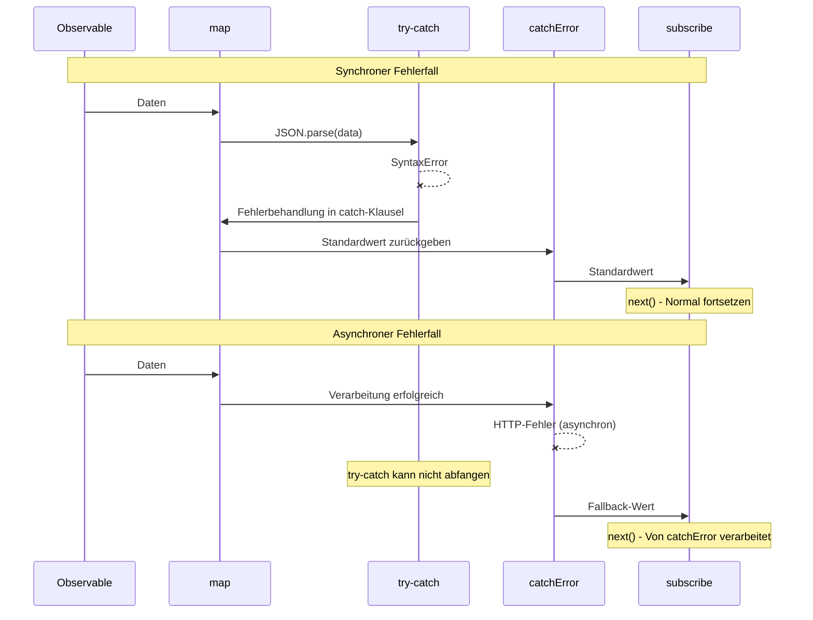

# try-catch und RxJS-Integration

JavaScript hat als Standard-Fehlerbehandlung `try-catch`, aber RxJS hat eigene Fehlerbehandlungsmechanismen wie `catchError` und `subscribe.error`. Diese Seite erklärt die Unterschiede zwischen beiden und angemessene Kombinationsmethoden.

## try-catch vs RxJS-Fehlerbehandlung

### Grundlegende Unterschiede

| Element | try-catch | catchError / subscribe.error |
|------|-----------|------------------------------|
| **Anwendungsbereich** | Synchroner Code | Asynchrone Streams |
| **Fehlertyp** | JavaScript-Ausnahmen | Alle Fehler innerhalb von Observable |
| **Gültigkeitsbereich** | Nur innerhalb try-catch-Block | Gesamte Pipeline |
| **Asynchrone Unterstützung** | ❌ Kann asynchrone Fehler nicht abfangen | ✅ Kann auch asynchrone Fehler abfangen |
| **Stream-Fortsetzung** | - | ✅ Fortsetzung mit catchError möglich |

### Fehler, die try-catch nicht abfangen kann

Asynchrone Fehler wie die folgenden können von `try-catch` nicht abgefangen werden.

```typescript
import { timer, throwError, mergeMap, catchError } from 'rxjs';
// ❌ try-catch kann asynchrone Fehler nicht abfangen
try {
  setTimeout(() => {
    throw new Error('Asynchroner Fehler');
  }, 1000);
} catch (error) {
  // Wird hier nicht ausgeführt
  console.error('Abgefangen:', error);
}

// ✅ RxJS kann auch asynchrone Fehler abfangen

timer(1000).pipe(
  mergeMap(() => throwError(() => new Error('Asynchroner Fehler'))),
  catchError(error => {
    console.error('Abgefangen:', error.message); // ✅ Wird ausgeführt
    return of('Standardwert');
  })
).subscribe();
```

> [!IMPORTANT] Einschränkungen von try-catch
> `try-catch` gilt nur für **synchronen Code**. Fehler, die in asynchronen Verarbeitungen wie setTimeout, HTTP-Anfragen, Promise und Observable auftreten, können nicht abgefangen werden.

## Fälle, in denen try-catch verwendet werden sollte

Auch wenn Sie RxJS verwenden, ist `try-catch` in folgenden Fällen erforderlich.

### 1. Fehlerbehandlung beim Ressourcen-Cleanup

Bei Ressourcenfreigabe innerhalb von `finalize` oder `using` fangen Sie Fehler mit `try-catch` ab.

```typescript
import { interval, take, finalize } from 'rxjs';
let ws: WebSocket | null = null;

interval(1000).pipe(
  take(5),
  finalize(() => {
    // Fehler bei Ressourcenfreigabe mit try-catch behandeln
    try {
      if (ws) {
        ws.close();
        console.log('WebSocket normal beendet');
      }
    } catch (error) {
      // Anwendung setzt fort, auch wenn Schließen fehlschlägt
      console.error('WebSocket-Schließfehler:', error);
    }
  })
).subscribe({
  next: val => console.log('Wert:', val)
});
```

**Grund**: Oft möchten Sie die Anwendung fortsetzen lassen, auch wenn die Ressourcenfreigabeverarbeitung selbst fehlschlägt.

### 2. Synchrone Fehlerbehandlung in Custom Observable

Beim Konvertieren synchroner Fehler in RxJS-Fehler innerhalb von `new Observable()`.

```typescript
import { Observable } from 'rxjs';

interface User {
  id: number;
  name: string;
}

function parseUserData(json: string): Observable<User> {
  return new Observable<User>(subscriber => {
    try {
      // JSON.parse ist synchrone Verarbeitung, daher mit try-catch abfangen
      const data = JSON.parse(json);

      // Validierung
      if (!data.id || !data.name) {
        throw new Error('Ungültige Benutzerdaten');
      }

      subscriber.next(data);
      subscriber.complete();
    } catch (error) {
      // Synchronen Fehler in RxJS-Fehler umwandeln
      subscriber.error(error);
    }
  });
}

// Verwendungsbeispiel
parseUserData('{"id": 1, "name": "Taro"}').subscribe({
  next: user => console.log('Benutzer:', user),
  error: err => console.error('Fehler:', err.message)
});

// Ungültiges JSON
parseUserData('invalid json').subscribe({
  next: user => console.log('Benutzer:', user),
  error: err => console.error('Fehler:', err.message) // Fängt JSON.parse-Fehler ab
});
```

**Grund**: Um Fehler, die bei synchronen Verarbeitungen (JSON.parse, Validierung usw.) auftreten, als Observable-Fehler zu propagieren.

### 3. Integration mit externen Bibliotheken

Fehlerbehandlung bei Verwendung externer Bibliotheken, die RxJS nicht verwenden.

```typescript
import { of, map, catchError } from 'rxjs';
// Externe Bibliothek (z.B.: Bildverarbeitungsbibliothek)
declare const ExternalImageLib: {
  process(data: string): string;
};

of('image-data-1', 'image-data-2', 'invalid-data').pipe(
  map(imageData => {
    try {
      // Externe Bibliothek kann Ausnahme werfen
      const processed = ExternalImageLib.process(imageData);
      return { success: true, data: processed };
    } catch (error) {
      // Synchronen Fehler abfangen und als Wert mit Fehlerinformation zurückgeben
      console.error('Bildverarbeitungsfehler:', error);
      return { success: false, error: (error as Error).message };
    }
  })
).subscribe({
  next: result => {
    if (result.success) {
      console.log('Verarbeitung erfolgreich:', result.data);
    } else {
      console.log('Verarbeitung fehlgeschlagen:', result.error);
    }
  }
});
```

**Grund**: Um Fehler externer Bibliotheken sicher innerhalb des Streams zu behandeln und den Stream fortzusetzen.

### 4. Synchrone Verarbeitung innerhalb von Operatoren

Bei synchronen Verarbeitungen innerhalb von Operatoren wie `map`, `tap`.

```typescript
import { of, map } from 'rxjs';
interface Config {
  apiUrl: string;
  timeout: number;
}

of('{"apiUrl": "https://api.example.com", "timeout": 5000}').pipe(
  map(jsonString => {
    try {
      const config: Config = JSON.parse(jsonString);

      // Konfigurationswertvalidierung
      if (config.timeout < 0) {
        throw new Error('Timeout muss eine positive Zahl sein');
      }

      return config;
    } catch (error) {
      console.error('Konfigurationsanalysefehler:', error);
      // Standardkonfiguration zurückgeben
      return { apiUrl: 'https://default.example.com', timeout: 3000 };
    }
  })
).subscribe({
  next: config => console.log('Konfiguration:', config)
});
```

**Grund**: Um synchrone Fehler innerhalb von Operatoren zu behandeln und Standardwert zurückzugeben, ohne den Stream zu unterbrechen.

## Praktische Kombinationsmuster

### Muster 1: Hierarchische Fehlerbehandlung

Hierarchischer Ansatz: Synchrone Fehler mit `try-catch`, asynchrone Fehler mit `catchError` behandeln.

```typescript
import { of, map, catchError, finalize } from 'rxjs';
import { ajax } from 'rxjs/ajax';

interface ApiResponse {
  data: string;
  timestamp: number;
}

let connection: any = null;

ajax.getJSON<ApiResponse>('https://api.example.com/data').pipe(
  // Ebene 1: Fehler synchroner Verarbeitung mit try-catch behandeln
  map(response => {
    try {
      // Datentransformation (synchrone Verarbeitung)
      const decoded = atob(response.data);
      return { decoded, timestamp: response.timestamp };
    } catch (error) {
      console.error('Dekodierungsfehler:', error);
      throw new Error('Datentransformation fehlgeschlagen');
    }
  }),
  // Ebene 2: Asynchrone Fehler mit catchError behandeln
  catchError(error => {
    console.error('API-Aufruffehler:', error);
    return of({ decoded: '', timestamp: Date.now() });
  }),
  // Ebene 3: Ressourcen-Cleanup mit try-catch schützen
  finalize(() => {
    try {
      if (connection) {
        connection.close();
        console.log('Verbindung geschlossen');
      }
    } catch (error) {
      console.error('Schließfehler:', error);
    }
  })
).subscribe({
  next: result => console.log('Ergebnis:', result),
  error: err => console.error('Finaler Fehler:', err)
});
```

### Muster 2: Ressourcenverwaltung mit using()

```typescript
import { using, interval, take } from 'rxjs';
interface ManagedResource {
  id: string;
  close: () => void;
}

function createManagedStream(resource: ManagedResource) {
  return using(
    // Ressourcen-Factory
    () => {
      console.log('Ressource erstellt:', resource.id);

      return {
        unsubscribe: () => {
          // Fehler bei Ressourcenfreigabe mit try-catch behandeln
          try {
            resource.close();
            console.log('Ressourcenfreigabe erfolgreich:', resource.id);
          } catch (error) {
            console.error('Ressourcenfreigabefehler:', resource.id, error);
            // Anwendung setzt fort, auch wenn Fehler auftritt
          }
        }
      };
    },
    // Observable-Factory
    () => interval(1000).pipe(take(3))
  );
}

// Verwendungsbeispiel
const resource: ManagedResource = {
  id: 'resource-1',
  close: () => {
    // Schließverarbeitung kann fehlschlagen
    if (Math.random() > 0.5) {
      throw new Error('Schließen fehlgeschlagen');
    }
  }
};

createManagedStream(resource).subscribe({
  next: val => console.log('Wert:', val),
  complete: () => console.log('Abgeschlossen')
});
```

### Muster 3: Benutzerdefinierte Fehlertransformation

Transformation von Fehlern externer APIs in anwendungsspezifische Fehler.

```typescript
import { Observable, throwError, catchError, map } from 'rxjs';
import { ajax } from 'rxjs/ajax';

// Benutzerdefinierte Fehlerklassen
class ValidationError extends Error {
  constructor(message: string, public field: string) {
    super(message);
    this.name = 'ValidationError';
  }
}

class NetworkError extends Error {
  constructor(message: string, public statusCode: number) {
    super(message);
    this.name = 'NetworkError';
  }
}

interface UserData {
  email: string;
  age: number;
}

function validateAndFetchUser(userId: string): Observable<UserData> {
  return ajax.getJSON<UserData>(`https://api.example.com/users/${userId}`).pipe(
    map(user => {
      try {
        // Synchrone Validierung
        if (!user.email || !user.email.includes('@')) {
          throw new ValidationError('Ungültige E-Mail-Adresse', 'email');
        }
        if (user.age < 0 || user.age > 150) {
          throw new ValidationError('Ungültiges Alter', 'age');
        }
        return user;
      } catch (error) {
        if (error instanceof ValidationError) {
          // Validierungsfehler als RxJS-Fehler erneut werfen
          throw error;
        }
        throw new Error('Datenvalidierungsfehler');
      }
    }),
    catchError(error => {
      // Asynchrone Fehler (HTTP-Fehler usw.) behandeln
      if (error.status) {
        const networkError = new NetworkError(
          `HTTP ${error.status}: ${error.message}`,
          error.status
        );
        return throwError(() => networkError);
      }
      return throwError(() => error);
    })
  );
}

// Verwendungsbeispiel
validateAndFetchUser('123').subscribe({
  next: user => console.log('Benutzer:', user),
  error: err => {
    if (err instanceof ValidationError) {
      console.error(`Validierungsfehler (${err.field}):`, err.message);
    } else if (err instanceof NetworkError) {
      console.error(`Netzwerkfehler (${err.statusCode}):`, err.message);
    } else {
      console.error('Unerwarteter Fehler:', err);
    }
  }
});
```

## Sequenzdiagramm: Zusammenarbeit von try-catch und catchError



#### Wie aus diesem Diagramm ersichtlich
- **Synchroner Fehler**: Von `try-catch` abgefangen → Verarbeitet → Stream setzt fort
- **Asynchroner Fehler**: Überspringt `try-catch` → Von `catchError` abgefangen

## Anti-Muster

### ❌ Anti-Muster 1: Versuch, asynchrone Fehler mit try-catch abzufangen

```typescript
// ❌ Schlechtes Beispiel: Asynchrone Fehler können nicht abgefangen werden
import { ajax } from 'rxjs/ajax';

try {
  ajax.getJSON('https://api.example.com/data').subscribe({
    next: data => console.log(data)
  });
} catch (error) {
  // HTTP-Fehler werden hier nicht abgefangen
  console.error('Fehler:', error);
}
```

```typescript
import { of, catchError } from 'rxjs';
// ✅ Gutes Beispiel: Mit catchError oder subscribe.error behandeln
import { ajax } from 'rxjs/ajax';

ajax.getJSON('https://api.example.com/data').pipe(
  catchError(error => {
    console.error('HTTP-Fehler:', error);
    return of(null);
  })
).subscribe({
  next: data => console.log(data)
});
```

### ❌ Anti-Muster 2: Fehler mit try-catch unterdrücken

```typescript
import { of, map } from 'rxjs';
// ❌ Schlechtes Beispiel: Fehler nur protokollieren und unterdrücken

of('invalid-json').pipe(
  map(json => {
    try {
      return JSON.parse(json);
    } catch (error) {
      console.error('Fehler:', error);
      return null; // Fehlerinformation geht verloren
    }
  })
).subscribe({
  next: data => {
    // Merkt nicht, dass data null ist
    console.log(data);
  }
});
```

```typescript
import { of, map } from 'rxjs';
// ✅ Gutes Beispiel: Fehlerinformation beibehalten

interface ParseResult {
  success: boolean;
  data?: any;
  error?: string;
}

of('invalid-json').pipe(
  map(json => {
    try {
      const data = JSON.parse(json);
      return { success: true, data } as ParseResult;
    } catch (error) {
      return {
        success: false,
        error: (error as Error).message
      } as ParseResult;
    }
  })
).subscribe({
  next: result => {
    if (result.success) {
      console.log('Daten:', result.data);
    } else {
      console.error('Parse-Fehler:', result.error);
    }
  }
});
```

### ❌ Anti-Muster 3: Unnötige Überverwendung von try-catch

```typescript
import { of, map } from 'rxjs';
// ❌ Schlechtes Beispiel: Von RxJS verarbeitbare Fehler mit try-catch umwickeln

of(1, 2, 3).pipe(
  map(x => {
    try {
      return x * 10;
    } catch (error) {
      // Dieser Code wirft keine Fehler, daher unnötig
      return 0;
    }
  })
).subscribe();
```

```typescript
import { of, map } from 'rxjs';
// ✅ Gutes Beispiel: try-catch nur an notwendigen Stellen verwenden

of('{"value": 1}', 'invalid', '{"value": 2}').pipe(
  map(json => {
    try {
      // JSON.parse kann Ausnahme werfen, daher ist try-catch notwendig
      return JSON.parse(json);
    } catch (error) {
      console.error('JSON-Analysefehler:', error);
      return { value: 0 };
    }
  })
).subscribe({
  next: data => console.log('Daten:', data)
});
```

## Best Practices

### 1. Nach Fehlertyp unterscheiden

```typescript
import { of, map, catchError, finalize } from 'rxjs';
import { ajax } from 'rxjs/ajax';

// Klare Unterscheidung
ajax.getJSON<{ data: string }>('https://api.example.com/data').pipe(
  // Synchrone Verarbeitungsfehler → try-catch
  map(response => {
    try {
      return JSON.parse(response.data);
    } catch (error) {
      console.error('Parse-Fehler:', error);
      return {};
    }
  }),
  // Asynchrone Fehler → catchError
  catchError(error => {
    console.error('API-Fehler:', error);
    return of({});
  }),
  // Cleanup-Fehler → try-catch
  finalize(() => {
    try {
      // Ressourcenfreigabeverarbeitung
    } catch (error) {
      console.error('Cleanup-Fehler:', error);
    }
  })
).subscribe();
```

### 2. Fehlerinformation beibehalten

```typescript
import { of, map } from 'rxjs';
interface Result<T> {
  success: boolean;
  value?: T;
  error?: string;
}

function safeParse<T>(json: string): Result<T> {
  try {
    const value = JSON.parse(json);
    return { success: true, value };
  } catch (error) {
    return {
      success: false,
      error: error instanceof Error ? error.message : String(error)
    };
  }
}

of('{"name": "Taro"}', 'invalid').pipe(
  map(json => safeParse(json))
).subscribe({
  next: result => {
    if (result.success) {
      console.log('Erfolg:', result.value);
    } else {
      console.error('Fehlgeschlagen:', result.error);
    }
  }
});
```

### 3. Detaillierte Informationen mit benutzerdefinierten Fehlern bereitstellen

```typescript
import { of, map } from 'rxjs';
// Benutzerdefinierte Fehlerklasse
class DataProcessingError extends Error {
  constructor(
    message: string,
    public readonly data: unknown,
    public readonly step: string
  ) {
    super(message);
    this.name = 'DataProcessingError';
  }
}

of({ raw: 'some-data' }).pipe(
  map(input => {
    try {
      // Komplexe Verarbeitung
      const processed = processData(input.raw);
      return processed;
    } catch (error) {
      throw new DataProcessingError(
        'Datenverarbeitung fehlgeschlagen',
        input,
        'processing'
      );
    }
  })
).subscribe({
  next: data => console.log('Verarbeitet:', data),
  error: (err: DataProcessingError) => {
    console.error(`Fehler (${err.step}):`, err.message);
    console.error('Eingabedaten:', err.data);
  }
});

function processData(raw: string): any {
  return raw;
}
```

### 4. Protokollierung und Überwachung

```typescript
import { of, map, catchError, tap } from 'rxjs';
import { ajax } from 'rxjs/ajax';

// Fehlerüberwachungsfunktion
function logError(context: string, error: Error): void {
  console.error(`[${context}]`, error.message);
  // In Produktionsumgebung an Fehlerüberwachungsdienst senden
  // errorMonitoringService.captureException(error, { context });
}

ajax.getJSON('https://api.example.com/data').pipe(
  tap(data => console.log('Empfangen:', data)),
  map(data => {
    try {
      // Datentransformation
      return transformData(data);
    } catch (error) {
      logError('Data Transformation', error as Error);
      throw error; // An catchError propagieren
    }
  }),
  catchError(error => {
    logError('API Request', error);
    return of(null);
  })
).subscribe();

function transformData(data: any): any {
  return data;
}
```

## Häufig gestellte Fragen

::: info **F: Müssen sowohl try-catch als auch catchError verwendet werden?**
A: Ja, Unterscheidung ist notwendig.
- **try-catch**: Fehler synchroner Verarbeitung (JSON.parse, Validierung usw.)
- **catchError**: Asynchrone Fehler (HTTP, Timer, Promise usw.)
:::

::: info **F: Was ist besser - throw in map oder Verarbeitung mit try-catch?**
A: Hängt von der Situation ab.
- **throw**: Wenn Sie Fehler an gesamten Stream propagieren möchten
- **try-catch**: Wenn Sie vor Ort wiederherstellen und Stream fortsetzen möchten
```typescript
// throw-Beispiel
map(x => {
  if (x < 0) throw new Error('Negative Zahl');
  return x;
})

// try-catch-Verarbeitungsbeispiel
map(x => {
  try {
    return riskyOperation(x);
  } catch (error) {
    return defaultValue; // Wiederherstellung vor Ort
  }
})
```
:::

::: info **F: Was passiert, wenn ein Fehler in finalize auftritt?**
A: Wenn ein Fehler in `finalize` auftritt, wird er nicht an `subscribe.error` propagiert und als `Uncaught Error` in der Konsole angezeigt. Daher sollten Sie Fehler in `finalize` immer mit `try-catch` abfangen.
:::

::: info **F: Kann die Kombination von async/await und try-catch verwendet werden?**
A: Ja, beim Umgang mit Promise ist es wirksam.
```typescript
import { from, mergeMap } from 'rxjs';
async function fetchData(id: string): Promise<any> {
  try {
    const response = await fetch(`/api/data/${id}`);
    return await response.json();
  } catch (error) {
    console.error('Fetch error:', error);
    throw error;
  }
}

from([1, 2, 3]).pipe(
  mergeMap(id => from(fetchData(String(id))))
).subscribe({
  next: data => console.log('Daten:', data),
  error: err => console.error('Fehler:', err)
});
```
:::

::: info **F: Sollte subscriber.error() oder throw in Custom Observable verwendet werden?**
A: Innerhalb von `new Observable()` sollten Sie **subscriber.error() verwenden**.
```typescript
// ✅ Richtig
new Observable(subscriber => {
  try {
    const data = riskyOperation();
    subscriber.next(data);
  } catch (error) {
    subscriber.error(error); // Als RxJS-Fehler propagieren
  }
})

// ❌ Falsch (throw im Observable-Konstruktor kann zu unerwartetem Verhalten führen)
new Observable(subscriber => {
  const data = riskyOperation(); // Fehler wird möglicherweise nicht abgefangen
  subscriber.next(data);
})
```
:::

## Zusammenfassung

`try-catch` und RxJS-Fehlerbehandlung haben jeweils unterschiedliche Rollen, und durch Kombination kann robuste Fehlerbehandlung realisiert werden.

### Unterscheidungsprinzipien

| Szenario | Empfohlen | Grund |
|---------|------|------|
| Synchrone Verarbeitung (JSON.parse, Validierung) | try-catch | Synchrone Fehler sofort abfangen |
| Asynchrone Verarbeitung (HTTP, Timer) | catchError | Asynchrone Fehler abfangen |
| Ressourcenfreigabe (finalize, using) | try-catch | Freigabefehler sicher behandeln |
| Innerhalb Custom Observable | try-catch + subscriber.error() | Synchrone Fehler in RxJS-Fehler umwandeln |
| Integration externer Bibliotheken | try-catch | Bibliotheksfehler sicher behandeln |

> [!IMPORTANT] Wichtige Prinzipien
> 1. **Synchrone Verarbeitung mit try-catch, asynchrone Verarbeitung mit catchError/subscribe.error**
> 2. **Fehler in finalize immer mit try-catch abfangen**
> 3. **Fehlerinformation nicht unterdrücken, sondern angemessen propagieren oder aufzeichnen**
> 4. **Detaillierte Informationen mit benutzerdefinierten Fehlerklassen bereitstellen**
> 5. **Unnötiges try-catch nicht verwenden (macht Code komplex)**

## Verwandte Abschnitte

- **[Zwei Orte der Fehlerbehandlung](/de/guide/error-handling/error-handling-locations)** - Unterschied zwischen catchError und subscribe.error
- **[Fehlerbehandlungsstrategien](/de/guide/error-handling/strategies)** - Umfassende RxJS-Fehlerbehandlungsstrategien
- **[using()](/de/guide/creation-functions/control/using)** - Kombination von Ressourcenverwaltung und try-catch
- **[finalize und complete](/de/guide/error-handling/finalize)** - Fehlerbehandlung bei Ressourcenfreigabe

## Referenzressourcen

- [RxJS Official Documentation - catchError](https://rxjs.dev/api/index/function/catchError)
- [MDN - try...catch](https://developer.mozilla.org/de/docs/Web/JavaScript/Reference/Statements/try...catch)
- [RxJS Official Documentation - Error Handling](https://rxjs.dev/guide/error-handling)
