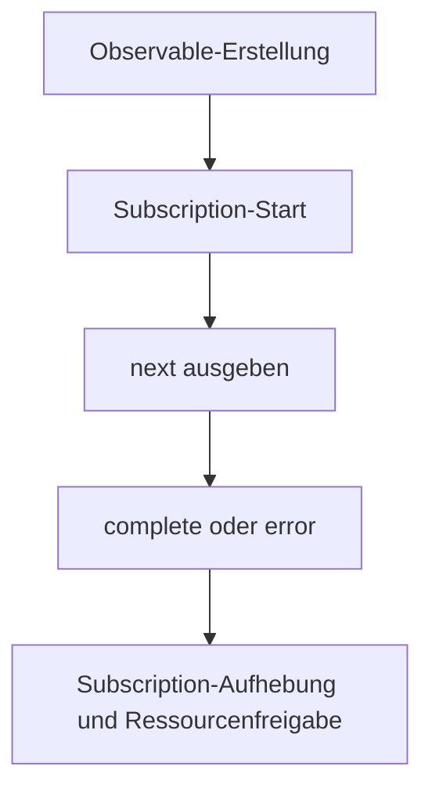

# Observable-Lebenszyklus

Hier wird der Observable-Lebenszyklus in RxJS schrittweise erklärt, vom Erstellen über Subscription, Datenausgabe, Abschluss-/Fehlerbenachrichtigung, Subscription-Aufhebung bis zur Ressourcenverwaltung.
Das Verständnis dieses Lebenszyklus ist die Grundlage für die effektive Verwendung von RxJS.

## Übersicht über den Observable-Lebenszyklus

Der Observable-Lebenszyklus bezieht sich auf den gesamten Ablauf, wie ein Observable generiert wird, zu welchem Zeitpunkt Daten ausgegeben werden, wie Abschluss- oder Fehlerbenachrichtigung erfolgt und schließlich Ressourcen freigegeben werden. Das Verständnis ermöglicht es, das Verhalten von RxJS richtig zu erfassen und Subscription-Aufhebung zum gewünschten Zeitpunkt, Steuerung von Seiteneffekten und Fehlerbehandlung durchzuführen.

### 🔄 Observable-Lebenszyklus-Diagramm (Zustandsübergang)




## Aufbau des Observable-Lebenszyklus
Der Observable-Lebenszyklus besteht aus folgenden Phasen:

|Reihenfolge|Phase|Inhalt|
|---|---|---|
|1|Erstellung (Creation)|Erstellung der Observable-Instanz|
|2|Subscription (Subscription)|Subscription-Start durch `subscribe()`-Methode|
|3|Ausführung (Execution)|<li>`next()`: Datenausgabe</li><li>`error()`: Fehlerbenachrichtigung</li><li>`complete()`: Abschlussbenachrichtigung</li>|
|4|Aufhebung (Disposal)|Subscription-Aufhebung durch `unsubscribe()`-Methode|

Observables sind "lazy execution" und der Stream wird nicht ausgegeben, bis `subscribe()` aufgerufen wird. Wenn `complete()` oder `error()` aufgerufen wird, endet der Stream und weitere `next()`-Aufrufe werden ignoriert.

> [!CAUTION]
> Durch `subscribe()` wird nicht direkt irgendeine "Verarbeitung" ausgeführt.
> Oft wird die Ausdrucksweise verwendet: "Wird nicht ausgeführt, bis `subscribe()` aufgerufen wird",
> aber genau genommen wird "die interne Logik des Observables (Benachrichtigungsverarbeitung)" erst durch `subscribe()` getriggert.
>
> Operatoren wie `pipe()` bauen nur eine Evaluationskette auf, die Ausführung wird durch die Callbacks des Observers gestartet.

### Beispiel für Observable-Lebenszyklus
```ts
import { Observable } from 'rxjs';

// 1. Observable-Erstellung
const observable$ = new Observable<number>(subscriber => {
  console.log('Observable-Ausführung gestartet');

  // 3. Ausführung: Datenausgabe
  subscriber.next(1);
  subscriber.next(2);

  // Timer-Setup
  const timerId = setTimeout(() => {
    subscriber.next(3);
    subscriber.complete(); // 3. Ausführung: Abschlussbenachrichtigung
    console.log('Observable abgeschlossen');
  }, 1000);

  // Bereinigungsfunktion zurückgeben (wird bei unsubscribe aufgerufen)
  return () => {
    console.log('Bereinigung ausgeführt');
    clearTimeout(timerId);
  };
});

// 2. Subscription
const subscription = observable$.subscribe({
  next: value => console.log('Nächster Wert:', value),
  error: err => console.error('Fehler:', err),
  complete: () => console.log('Abschlussbenachrichtigung empfangen')
});

// 4. Subscription-Aufhebung (manuell oder bei Abschluss)
setTimeout(() => {
  console.log('Manuelle Subscription-Aufhebung');
  subscription.unsubscribe();
}, 500); // Nach 500ms aufheben (vor Abschlussbenachrichtigung)

// Verarbeitungsergebnis:
// Observable-Ausführung gestartet
// Nächster Wert: 1
// Nächster Wert: 2
// Manuelle Subscription-Aufhebung
// Bereinigung ausgeführt
```

## Observer (Beobachter) {#observer}

Observer ist ein Objekt, das die Empfängerrolle übernimmt, um Benachrichtigungen vom Observable zu erhalten. Beim Subscriben eines Observables können Sie durch Übergabe eines Observers ausgegebene Daten, Fehler und Abschlussbenachrichtigungen verarbeiten.

### Die 3 Callback-Funktionen des Observers
Observer ist das Interface zum Empfangen von Benachrichtigungen vom Observable.
Es hat 3 Callback-Funktionen:
- `next`: Datenausgabe
- `error`: Fehlerbenachrichtigung
- `complete`: Abschlussbenachrichtigung

#### Beispiel
```ts
import { Observer, of } from 'rxjs';

// Vollständiges Observer-Objekt
const observer: Observer<number> = {
  next: value => console.log('Wert:', value),// Datenausgabe
  error: err => console.error('Fehler:', err), // Fehlerbenachrichtigung
  complete: () => console.log('Abgeschlossen') // Abschlussbenachrichtigung
};

const observable$ = of(1, 2, 3); // Observable einfach erstellen

// Verwendung des Observer-Objekts
observable$.subscribe(observer);

// Teilweiser Observer auch möglich
observable$.subscribe({
  next: value => console.log('Nur Wert verarbeiten:', value)
});

// Objektform (empfohlen)
observable$.subscribe({
  next: value => console.log('Wert::', value),
  error: err => console.error('Fehler:', err),
  complete: () => console.log('Abgeschlossen::')
});

// Verarbeitungsergebnis:
// Wert: 1
// Wert: 2
// Wert: 3
// Abgeschlossen
// Nur Wert verarbeiten: 1
// Nur Wert verarbeiten: 2
// Nur Wert verarbeiten: 3
// Wert:: 1
// Wert:: 2
// Wert:: 3
// Abgeschlossen::
```

## Subscription (Subscription) {#subscription}

Subscription repräsentiert die Ausführung eines Observables und wird hauptsächlich für `unsubscribe()` zur Subscription-Aufhebung verwendet.

#### Beispiel
```ts
import { interval } from 'rxjs';
import { take } from 'rxjs';

const numbers$ = interval(1000).pipe(take(5));

// Subscription beibehalten
const subscription = numbers$.subscribe({
  next: value => console.log('Wert:', value),
  complete: () => console.log('Abgeschlossen')
});

// Nach 3 Sekunden manuell Subscription aufheben
setTimeout(() => {
  subscription.unsubscribe(); // Subscription aufheben
  console.log('Subscription aufgehoben');
}, 3000);

// Verarbeitungsergebnis:
// Wert: 0
// Wert: 1
// Wert: 2
// Subscription aufgehoben
```


## Fehlerbehandlung

Im Observable-Lebenszyklus endet der Stream sofort, wenn `error()` aufgerufen wird, und `complete()` wird nicht aufgerufen. Daher sind die Verwendung von `catchError` und das Design von `retry` wichtig.

#### Beispiel
```ts
import { Observable, of } from 'rxjs';
import { catchError, retry } from 'rxjs';

// Observable, das Fehler verursacht
const failingObservable$ = new Observable<number>(subscriber => {
  subscriber.next(1);
  subscriber.next(2);
  subscriber.error(new Error('Absichtlicher Fehler'));
  // Beachten Sie, dass complete nach Fehler nicht aufgerufen wird
});

// Fehlerbehandlungsbeispiel
failingObservable$.pipe(
  // Bei Fehlerauftreten 3x wiederholen
  retry(3),
  // Wenn dennoch Fehler auftritt, zu alternativem Observable wechseln
  catchError(error => {
    console.error('Fehler abgefangen:', error.message);
    return of('Alternativwert nach Fehler');
  })
).subscribe({
  next: value => console.log('Wert:', value),
  error: err => console.error('Nicht behandelter Fehler:', err),
  complete: () => console.log('Abgeschlossen')
});

// Verarbeitungsergebnis:
// Wert: 1
// Wert: 2
// Wert: 1
// Wert: 2
// Wert: 1
// Wert: 2
// Wert: 1
// Wert: 2
// Fehler abgefangen: Absichtlicher Fehler
// Wert: Alternativwert nach Fehler
// Abgeschlossen
```

## Abschluss-Lebenszyklus

Der Abschluss eines Observables erfolgt, wenn explizit `complete()` aufgerufen wird oder wenn ein endlicher Stream endet.

#### Beispiel
```ts
import { of, interval, Observable } from 'rxjs';
import { take } from 'rxjs';

// Endliches Observable (wird automatisch abgeschlossen)
const finite$ = of(1, 2, 3);
finite$.subscribe({
  next: value => console.log('Endlicher Wert:', value),
  complete: () => console.log('Endliches Observable abgeschlossen')
});

// Unendliches Observable in endliches umwandeln
const limited$ = interval(1000).pipe(take(3));
limited$.subscribe({
  next: value => console.log('Begrenzter Wert:', value),
  complete: () => console.log('Begrenztes Observable abgeschlossen')
});

// Manuell abzuschließendes Observable
const manual$ = new Observable<number>(subscriber => {
  subscriber.next(1);

  setTimeout(() => {
    subscriber.next(2);
    subscriber.complete(); // Explizit abschließen
  }, 2000);
});

manual$.subscribe({
  next: value => console.log('Manueller Wert:', value),
  complete: () => console.log('Manuelles Observable abgeschlossen')
});

// Verarbeitungsergebnis:
// Endlicher Wert: 1
// Endlicher Wert: 2
// Endlicher Wert: 3
// Endliches Observable abgeschlossen
// Manueller Wert: 1
// Begrenzter Wert: 0
// Begrenzter Wert: 1
// Manueller Wert: 2
// Manuelles Observable abgeschlossen
// Begrenzter Wert: 2
// Begrenztes Observable abgeschlossen
```

## Ressourcenverwaltung und Vermeidung von Speicherlecks

Subscription-Aufhebung zum geeigneten Zeitpunkt ist wichtig zur Vermeidung von Speicherlecks.

#### Beispiel
```ts
import { interval, Subject } from 'rxjs';
import { takeUntil } from 'rxjs';

// Komponenten-Lebenszyklus nachahmen
class Component {
  private destroy$ = new Subject<void>();

  constructor() {
    // Intervall alle 1 Sekunde (potenzielle Ursache für Speicherleck)
    interval(1000).pipe(
      // Automatische Subscription-Aufhebung bei Komponentenzerstörung
      takeUntil(this.destroy$)
    ).subscribe(value => {
      console.log('Wert in Komponente:', value);
    });
  }

  // Komponentenzerstörung
  ngOnDestroy() {
    console.log('Komponente zerstört');
    this.destroy$.next();
    this.destroy$.complete();
  }
}

// Verwendungsbeispiel
const component = new Component();

// Komponente nach 5 Sekunden zerstören
setTimeout(() => {
  (component as any).ngOnDestroy();
}, 5000);

// Verarbeitungsergebnis:
// Wert in Komponente: 0
// Wert in Komponente: 1
// Wert in Komponente: 2
// Wert in Komponente: 3
// Wert in Komponente: 4
// Komponente zerstört
```

## Zusammenfassung

Durch das Verständnis des Observable-Lebenszyklus wird Folgendes möglich:

- Ressourcenfreigabe zum geeigneten Zeitpunkt
- Implementierung von Fehlerbehandlung und Wiederherstellungsstrategien
- Unterscheidung zwischen Cold Observables und Hot Observables
- Verwaltung von Seiteneffekten

Besonders in komponentenbasierten Frameworks wie Angular oder React ist Subscription-Verwaltung entlang des Lebenszyklus durch Nutzung von `takeUntil`, `unsubscribe`, `finalize` usw. erforderlich.
