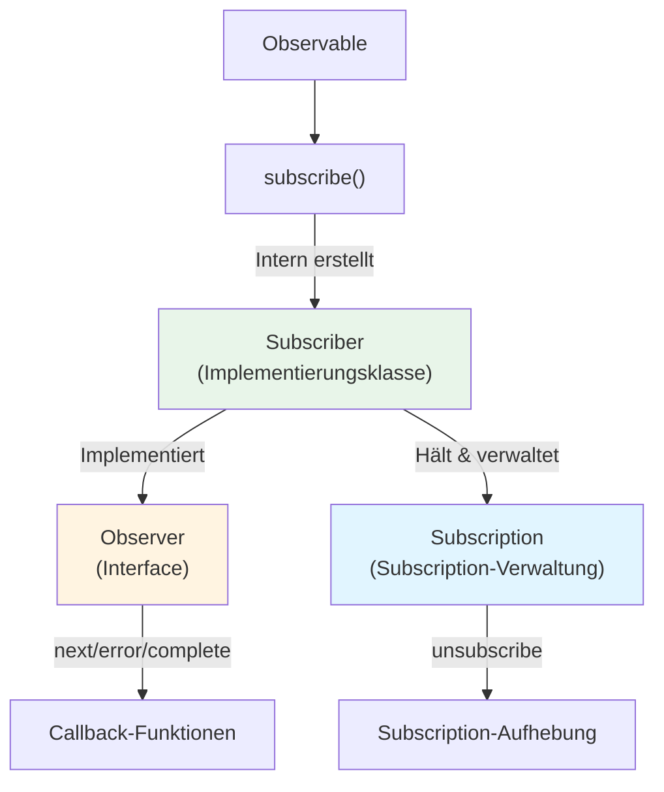
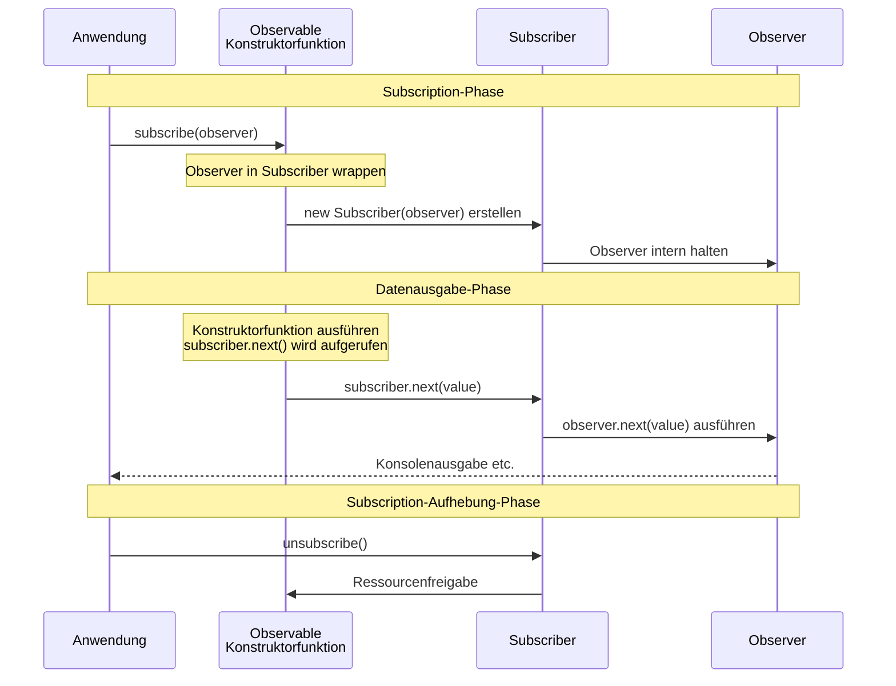

# Unterschied zwischen Observer und Subscriber

## Warum werden sie verwechselt?

Beim Erlernen von RxJS tauchen die Begriffe "Observer" und "Subscriber" auf und können verwirrend sein. Diese beiden sind eng miteinander verbunden, haben aber klar unterschiedliche Rollen.

## Was ist Observer?

**Observer (Beobachter)** ist ein **Interface** zum Empfangen von Daten.

### Observer-Definition

```typescript
interface Observer<T> {
  next: (value: T) => void;       // Wert empfangen
  error?: (err: any) => void;     // Fehler empfangen
  complete?: () => void;          // Abschluss empfangen
}
```

### Rolle des Observers
- Definiert **wie** Daten empfangen werden
- Hat 3 Callback-Funktionen
- Beschreibt **was zu tun ist**

## Was ist Subscriber?

**Subscriber (Subskribent)** ist eine **Klasse**, die Observer implementiert und die tatsächliche Subscription-Verarbeitung durchführt.

### Rolle des Subscribers
- Führt Callbacks des Observers aus
- Hält Subscription (Subscription-Verwaltung)
- Verwaltet Subscription-Aufhebungsverarbeitung
- Steuert **wie ausgeführt wird**

## Die 2 Situationen, in denen Subscriber erscheint

Subscriber erscheint tatsächlich in **2 unterschiedlichen Situationen**. Jedoch ist es in **beiden Fällen dasselbe Subscriber-Objekt**. Das Verständnis dieses Unterschieds ist der Schlüssel zur Vermeidung von Verwechslungen.

### Situation 1: Bei Observable-Erstellung (als Parameter empfangen)

Bei der Erstellung eines Observables mit `new Observable()` wird `subscriber` als Parameter der Konstruktorfunktion übergeben.

```typescript
import { Observable } from 'rxjs';

// Werte mit subscriber ausgeben (Typ ist Subscriber<number>)
const observable$ = new Observable<number>(subscriber => {
  subscriber.next(1);      // Wert ausgeben
  subscriber.next(2);
  subscriber.complete();   // Abschluss benachrichtigen
});
```

::: tip Typ von subscriber in dieser Situation
- Typ: `Subscriber<number>`
- Rolle: Wird intern in Observable zur Datenausgabe verwendet
- Entwickler verwenden direkt (`next()`, `error()`, `complete()` aufrufen)
:::

### Situation 2: Bei subscribe()-Aufruf (Observer → Subscriber-Konvertierung)

Wenn `subscribe()` auf ein Observable aufgerufen wird, **wird der vom Entwickler übergebene Observer intern in Subscriber konvertiert**.

```typescript
// Entwickler übergibt Observer-Interface
observable$.subscribe({
  next: value => console.log('Nächster Wert:', value),
  error: err => console.error('Fehler:', err),
  complete: () => console.log('Abgeschlossen')
});

// ↑ RxJS erstellt intern Subscriber wie folgt
// const subscriber = new Subscriber(observer);
// Und dieser subscriber wird als Parameter von Situation 1 übergeben
```

::: tip Verarbeitung in dieser Situation
1. Entwickler übergibt `Observer`-Interface
2. RxJS wrappt `Observer` intern in `Subscriber`
3. Dieser `Subscriber` wird an Konstruktorfunktion des Observables übergeben (= `subscriber` von Situation 1)
:::

### Wichtig: Beide sind dasselbe Subscriber-Objekt

> [!IMPORTANT] `Subscriber` aus Situation 1 und 2 sind dasselbe Objekt
>
> ```typescript
> const observable$ = new Observable(subscriber => {
>   // Dieser subscriber ist das Subscriber-Objekt selbst,
>   // das bei subscribe()-Aufruf erstellt wurde
>   subscriber.next(1);
> });
>
> observable$.subscribe({
>   // Dieser Observer wird in Subscriber gewrappt
>   // und an obige Konstruktorfunktion übergeben
>   next: v => console.log(v)
> });
> ```
>
> **Das heißt:**
> - Entwickler ruft `subscribe(observer)` auf
> - RxJS erstellt `new Subscriber(observer)`
> - Dieser Subscriber wird zum Argument der Konstruktorfunktion des Observables
> - Daher: `subscriber` von Situation 1 = `Subscriber` erstellt in Situation 2

## Beziehungs-Diagramm



## Unterschied im Code

### Vollständiges Beispiel: Von Observable-Erstellung bis Subscription

```typescript
import { Observable } from 'rxjs';

// 1. Bei Observable-Erstellung: Werte mit subscriber ausgeben
const observable$ = new Observable<number>(subscriber => {
  console.log('Subscription gestartet');
  subscriber.next(1);
  subscriber.next(2);
  subscriber.next(3);
  subscriber.complete();
});

// 2. Bei Subscription: Observer übergeben (intern wird Subscriber erstellt)
observable$.subscribe({
  next: value => console.log('Nächster Wert:', value),
  error: err => console.error('Fehler:', err),
  complete: () => console.log('Abgeschlossen')
});

// Ausgabe:
// Subscription gestartet
// Nächster Wert: 1
// Nächster Wert: 2
// Nächster Wert: 3
// Abgeschlossen
```

#### In diesem Beispiel
- **`subscriber` bei Erstellung**: Wird intern in Observable zur Datenausgabe verwendet
- **`Observer` bei Subscription**: Definiert Verarbeitung zum Empfang ausgegebener Daten

### Bei Übergabe von Observer

```typescript
import { interval } from 'rxjs';

const observer = {
  next: (value: number) => console.log(value),
  error: (err: any) => console.error(err),
  complete: () => console.log('Abgeschlossen')
};

// Observer an subscribe übergeben
const subscription = interval(1000).subscribe(observer);
// Intern wird Subscriber erstellt und Callbacks des observers ausgeführt
```

### Bei direkter Callback-Übergabe (Kurzschreibweise)

```typescript
// Auch hier wird intern Subscriber erstellt
const subscription = interval(1000).subscribe(
  value => console.log(value),  // next
  err => console.error(err),    // error
  () => console.log('Abgeschlossen')     // complete
);
```

## Tatsächlicher Ablauf

Das folgende Sequenzdiagramm zeigt den Ablauf von Observable-Erstellung über Subscription bis Datenausgabe.



**Wichtige Punkte dieses Ablaufs:**
1. Bei Aufruf von `subscribe(observer)` wird `new Subscriber(observer)` erstellt
2. Dieser Subscriber wird als Parameter der Konstruktorfunktion des Observables übergeben
3. Bei Aufruf von `subscriber.next()` in der Konstruktorfunktion wird intern `observer.next()` ausgeführt
4. Das heißt: **`subscriber` von Situation 1 = `Subscriber` erstellt in Situation 2**

## Wichtige Punkte

> [!IMPORTANT] Observer ist "Blaupause", Subscriber ist "Ausführer"
> - **Observer**: Interface, das **definiert**, wie Daten empfangen werden
> - **Subscriber**: Klasse, die Observer **implementiert** und tatsächlich Subscription **ausführt**
> - Subscriber erscheint in 2 Situationen

> [!TIP] Verstehen Sie, wann Subscriber verwendet wird
> - **Bei Observable-Erstellung**: Verwenden Sie direkt `subscriber`-Parameter von `new Observable(subscriber => {...})`
> - **Bei Subscription**: Bei Aufruf von `subscribe(observer)` wird intern automatisch Subscriber erstellt
>
> In beiden Situationen ist Subscriber dasselbe Objekt mit `next()`, `error()`, `complete()`-Methoden.

## Häufige Verwechslungsmuster

### ❌ Falsches Verständnis 1

"Der `subscriber` bei Observable-Erstellung und der `observer` bei Subscription sind unterschiedlich"

### ❌ Falsches Verständnis 2

"Subscriber ist interne Implementierung, daher berührt Entwickler ihn nicht"

### ✅ Korrektes Verständnis

**Wichtige Tatsache:**
- Der vom Entwickler mit `subscribe(observer)` übergebene **Observer** wird intern in **Subscriber** gewrappt
- Dieser **Subscriber** wird als Parameter der Konstruktorfunktion bei Observable-Erstellung übergeben
- Das heißt: **`subscriber` von Situation 1 = `Subscriber` erstellt in Situation 2 (dasselbe Objekt)**

### Mit vollständigem Beispiel verstehen

```typescript
import { Observable } from 'rxjs';

// 1. Observable erstellen (zu diesem Zeitpunkt wird nichts ausgeführt)
const observable$ = new Observable<number>(subscriber => {
  console.log('Konstruktorfunktion wurde ausgeführt!');
  subscriber.next(1);
  subscriber.next(2);
  subscriber.complete();
});

// 2. Subscriben (in diesem Moment wird erst Konstruktorfunktion ausgeführt)
observable$.subscribe({
  next: v => console.log('Empfangen:', v),
  complete: () => console.log('Abgeschlossen')
});

// Ausgabe:
// Konstruktorfunktion wurde ausgeführt!
// Empfangen: 1
// Empfangen: 2
// Abgeschlossen
```

**Ablauf in diesem Beispiel:**
1. `observable$.subscribe({...})` wird aufgerufen
2. RxJS erstellt `new Subscriber({next: ..., complete: ...})`
3. Mit diesem `Subscriber` als Parameter wird Konstruktorfunktion `(subscriber => {...})` ausgeführt
4. `subscriber.next(1)` in Konstruktorfunktion wird aufgerufen
5. Intern wird `observer.next(1)` ausgeführt und "Empfangen: 1" ausgegeben

**Das heißt:**
- `subscriber` von Situation 1 ← dies
- `Subscriber` erstellt in Situation 2 ← dies
- **Dasselbe Objekt!**

## Zusammenfassung

### Vergleich Observer und Subscriber

| | Observer | Subscriber |
|---|----------|------------|
| **Art** | Interface | Klasse (implementiert Observer) |
| **Rolle** | Definiert, wie Daten empfangen werden | Führt tatsächliche Subscription-Verarbeitung aus |
| **Inhalt** | next/error/complete-Callbacks | Observer + Subscription-Verwaltung |
| **Erscheint in Situation** | Nur bei Subscription | Bei Observable-Erstellung & Subscription |

### Wichtig: Beziehung in den 2 Situationen

| Situation | Was Entwickler behandelt | Tatsächlicher Typ | Beziehung |
|------|------------------|----------|--------|
| **Bei Observable-Erstellung** | Parameter von `new Observable(subscriber => {...})` | `Subscriber<T>` | Entwickler verwendet direkt |
| **Bei Subscription** | Objekt, das an `subscribe(observer)` übergeben wird | `Observer<T>` → Intern in `Subscriber<T>` konvertiert | RxJS konvertiert automatisch |

> [!IMPORTANT] Kernpunkt
> - Der vom Entwickler mit `subscribe(observer)` übergebene `Observer` wird intern in `Subscriber` gewrappt
> - Dieser `Subscriber` wird als Parameter der Konstruktorfunktion des Observables übergeben
> - Daher ist der **in beiden Situationen verwendete `Subscriber` dasselbe Objekt**

## Nächste Schritte

Nachdem Sie den Unterschied zwischen Observer und Subscriber verstanden haben, lernen Sie als Nächstes über tatsächliche Subscription-Verwaltung.

- [Observable-Lebenszyklus](/de/guide/observables/observable-lifecycle) - Ablauf von Subscription-Start bis -Ende
- [Verwaltung von Subscription](/de/guide/observables/observable-lifecycle#subscription-の管理) - Subscription-Aufhebung und Ressourcenverwaltung

## Referenzressourcen

- [RxJS Official Documentation - Observer](https://rxjs.dev/guide/observer) - Detaillierte Observer-Spezifikation
- [RxJS Official Documentation - Subscription](https://rxjs.dev/guide/subscription) - Detaillierte Subscription-Spezifikation
- [Understanding the Difference Between Observer and Subscriber in RxJS](https://www.codingscenes.com/posts/92/Understanding-the-Difference-Between-Observer-and-Subscriber-in-RxJS) - Subscriber-Erweiterungen und praktische Beispiele (Englisch)
