# Die Mauer des konzeptionellen Verständnisses

Die erste Hürde bei RxJS ist das **konzeptionelle Verständnis**. Besonders für Entwickler, die an Promises gewöhnt sind, kann das Verhalten von Observables kontraintuitiv sein.

## Der wesentliche Unterschied zwischen Observable und Promise

### Promise: Einmalige asynchrone Verarbeitung

```typescript
// Promise: Gibt nur einmal einen Wert zurück
const userPromise = fetch('/api/user/1').then(res => res.json());

userPromise.then(user => console.log(user)); // Benutzerinformationen nur einmal abrufen
userPromise.then(user => console.log(user)); // Gleiches Ergebnis aus dem Cache
```

> [!TIP] Merkmale
> - **Eager (sofortige Ausführung)** - Die Verarbeitung beginnt zum Zeitpunkt der Promise-Erstellung
> - **Nur einmal abgeschlossen** - Entweder Erfolg oder Fehler, nur einmal
> - **Nicht abbrech bar** - Einmal gestartet, kann nicht gestoppt werden
> - **Immer Hot** - Mehrere then teilen sich dasselbe Ergebnis

### Observable: Stream (Datenfluss mit Zeitachse)

```typescript
import { Observable } from 'rxjs';

// Observable: Fließt mehrere Werte entlang der Zeitachse
const user$ = new Observable<User>(subscriber => {
  console.log('Observable-Ausführung gestartet!');
  fetch('/api/user/1')
    .then(res => res.json())
    .then(user => {
      subscriber.next(user);
      subscriber.complete();
    });
});

// ❌ Zu diesem Zeitpunkt passiert noch nichts (Lazy)
console.log('Observable-Erstellung abgeschlossen');

// ✅ Wird erst bei subscribe ausgeführt
user$.subscribe(user => console.log('Abonnement 1:', user));
user$.subscribe(user => console.log('Abonnement 2:', user));
// → API-Aufruf wird zweimal ausgeführt (Cold Observable)
```

#### Ausgabe
```
Observable-Erstellung abgeschlossen
Observable-Ausführung gestartet!
Abonnement 1: { id: 1, name: 'Alice' }
Observable-Ausführung gestartet!
Abonnement 2: { id: 1, name: 'Alice' }
```

> [!TIP] Merkmale
> - **Lazy (verzögerte Ausführung)** - Es passiert nichts, bis subscribe aufgerufen wird
> - **Kann mehrere Werte fließen lassen** - next() kann mehrmals aufgerufen werden
> - **Abbrechbar** - Kann mit unsubscribe gestoppt werden
> - **Cold oder Hot** - Sie können wählen, ob Sie pro Abonnement ausführen oder teilen möchten

### Vergleichstabelle

| Merkmal | Promise | Observable |
|---|---|---|
| **Ausführungszeitpunkt** | Sofort (Eager) | Bei Abonnement (Lazy) |
| **Anzahl der Werte** | Nur einmal | 0 Mal oder mehr (mehrere möglich) |
| **Abbrechen** | Nicht möglich | Möglich (unsubscribe) |
| **Wiederverwendung** | Gecachtes Ergebnis | Neuausführung pro Abonnement (Cold) |
| **Nach Fehler** | Beendet | Beendet (retry möglich) |

### Visualisierung der Verhaltensunterschiede

Das folgende Sequenzdiagramm zeigt die Unterschiede im Ausführungsfluss zwischen Promise und Observable.

```mermaid
sequenceDiagram
    participant User
    participant Promise
    participant Observable

    Note over User,Promise: Im Fall von Promise
    User->>Promise: Erstellen (sofortige Ausführung)
    activate Promise
    Promise-->>Promise: API-Aufruf läuft...
    Promise-->>User: Gibt einen Wert zurück
    deactivate Promise
    Note over Promise: Abgeschlossen (keine Neuausführung)

    Note over User,Observable: Im Fall von Observable
    User->>Observable: Erstellen (nichts passiert)
    Note over Observable: Wartezustand (Lazy)

    User->>Observable: subscribe()
    activate Observable
    Observable-->>Observable: API-Aufruf läuft...
    Observable-->>User: Wert 1
    Observable-->>User: Wert 2
    Observable-->>User: Wert 3
    Note over Observable: Mehrere Werte entlang der Zeitachse
    Observable-->>User: complete()
    deactivate Observable

    User->>Observable: Erneut subscribe()
    activate Observable
    Note over Observable: Von Anfang an neu ausführen (Cold)
    Observable-->>User: Wert 1
    Observable-->>User: Wert 2
    deactivate Observable
    User->>Observable: unsubscribe()
    Note over Observable: Abbrechbar
```



### Häufige Missverständnisse

#### ❌ Missverständnis 1: "Observable ist nur für asynchrone Operationen"

```typescript
// Observable kann auch synchrone Verarbeitung handhaben
import { of } from 'rxjs';

const sync$ = of(1, 2, 3);

console.log('Before subscribe');
sync$.subscribe(value => console.log(value));
console.log('After subscribe');

// Ausgabe (wird synchron ausgeführt):
// Before subscribe
// 1
// 2
// 3
// After subscribe
```

#### ❌ Missverständnis 2: "subscribe gibt einen Wert zurück"

```typescript
import { map, of } from "rxjs";

const observable$ = of(1, 2, 3);

// ❌ Schlechtes Beispiel: Promise-Denken
const value = observable$.subscribe(x => x); // value ist ein Subscription-Objekt
console.log(value); // Subscription { ... } ← Nicht der erwartete Wert

// ✅ Gutes Beispiel: Observable-Denken
observable$.pipe(
  map(x => x * 2)
).subscribe(value => {
  console.log(value); // Verwenden Sie den Wert hier
});
```

## Intuitives Verständnis von Cold vs Hot

### Cold Observable: Unabhängiger Stream pro Abonnement

```typescript
import { interval } from 'rxjs';
import { take } from 'rxjs';

// Cold: Jeder Abonnent hat einen unabhängigen Timer
const cold$ = interval(1000).pipe(take(3));

console.log('Abonnement 1 gestartet');
cold$.subscribe(x => console.log('Abonnement 1:', x));

setTimeout(() => {
  console.log('Abonnement 2 gestartet (nach 2 Sekunden)');
  cold$.subscribe(x => console.log('Abonnement 2:', x));
}, 2000);

// Ausgabe:
// Abonnement 1 gestartet
// Abonnement 1: 0        (nach 1 Sekunde)
// Abonnement 1: 1        (nach 2 Sekunden)
// Abonnement 2 gestartet (nach 2 Sekunden)
// Abonnement 1: 2        (nach 3 Sekunden)
// Abonnement 2: 0        (nach 3 Sekunden) ← Abonnement 2 startet von Anfang an
// Abonnement 2: 1        (nach 4 Sekunden)
// Abonnement 2: 2        (nach 5 Sekunden)
```

> [!TIP] Merkmale von Cold
> - **Unabhängige Ausführung** pro Abonnement
> - Speichert den "Bauplan" der Daten
> - Beispiele: HTTP-API-Aufrufe, Timer, Dateilesen

### Hot Observable: Alle Abonnenten teilen denselben Stream

```typescript
import { interval } from 'rxjs';
import { take, share } from 'rxjs';

// Hot: Wird mit share() geteilt
const hot$ = interval(1000).pipe(
  take(3),
  share() // Dies macht es Hot
);

console.log('Abonnement 1 gestartet');
hot$.subscribe(x => console.log('Abonnement 1:', x));

setTimeout(() => {
  console.log('Abonnement 2 gestartet (nach 2 Sekunden)');
  hot$.subscribe(x => console.log('Abonnement 2:', x));
}, 2000);

// Ausgabe:
// Abonnement 1 gestartet
// Abonnement 1: 0        (nach 1 Sekunde)
// Abonnement 1: 1        (nach 2 Sekunden)
// Abonnement 2 gestartet (nach 2 Sekunden)
// Abonnement 1: 2        (nach 3 Sekunden)
// Abonnement 2: 2        (nach 3 Sekunden) ← Abonnement 2 tritt in der Mitte bei
```

> [!TIP] Merkmale von Hot
> - Alle Abonnenten **teilen dieselbe Ausführung**
> - Daten werden "gesendet"
> - Beispiele: Click-Events, WebSocket, Subject

### Methode zur Unterscheidung von Cold/Hot

```typescript
import { fromEvent, interval, of, Subject } from 'rxjs';
import { share } from 'rxjs';

// Cold (unabhängige Ausführung pro Abonnement)
const cold1$ = of(1, 2, 3);
const cold2$ = interval(1000);
const cold3$ = ajax('/api/data');
const cold4$ = fromEvent(button, 'click'); // Cold, aber speziell

// Hot (zwischen Abonnenten geteilt)
const hot1$ = new Subject<number>();
const hot2$ = interval(1000).pipe(share()); // Konvertiert Cold zu Hot
```

> [!IMPORTANT] Wie man sie unterscheidet
> - **Creation Functions (of, from, fromEvent, interval, ajax etc.)** → Cold
> - **Subject-Familie** → Hot
> - **Verwendung von share(), shareReplay()** → Konvertiert Cold zu Hot

## Denkwechsel zur deklarativen Programmierung

### Imperativ vs Deklarativ

RxJS folgt dem Paradigma der **deklarativen Programmierung**.

#### ❌ Imperatives Denken (Promise/async-await)

```typescript
// Imperativ: Beschreibt "wie" verarbeitet werden soll
async function processUsers() {
  const response = await fetch('/api/users');
  const users = await response.json();

  const activeUsers = [];
  for (const user of users) {
    if (user.isActive) {
      activeUsers.push(user);
    }
  }

  const userNames = [];
  for (const user of activeUsers) {
    userNames.push(user.name.toUpperCase());
  }

  return userNames;
}
```

#### ✅ Deklaratives Denken (RxJS)

```typescript
import { from } from 'rxjs';
import { mergeMap, filter, map, toArray } from 'rxjs';

// Deklarativ: Beschreibt "was" transformiert werden soll
const processUsers$ = from(fetch('/api/users')).pipe(
  mergeMap(res => res.json()),
  mergeMap(users => users), // Array entfalten
  filter(user => user.isActive),
  map(user => user.name.toUpperCase()),
  toArray()
);

processUsers$.subscribe(userNames => console.log(userNames));
```

::: tip Unterschied
- **Imperativ**: Beschreibt Schritte (Schleifen, Verzweigungen, Variablenzuweisungen)
- **Deklarativ**: Beschreibt Transformations-Pipeline (Datenfluss)
:::

### Punkte für den Denkwechsel

#### Punkt 1: Keine Datenverarbeitung innerhalb von subscribe

Datentransformation in pipe, subscribe nur für Seiteneffekte.

```typescript
import { filter, map, of } from "rxjs";

const observable$ = of(1, 2, 3);
// ❌ Schlechtes Beispiel: Verarbeitung innerhalb von subscribe
observable$.subscribe(value => {
  const doubled = value * 2;           // 👈 Berechnung innerhalb von subscribe
  const filtered = doubled > 4 ? doubled : null;  // 👈 Bedingung innerhalb von subscribe
  if (filtered) {                      // 👈 if-Anweisung innerhalb von subscribe
    console.log(filtered);
  }
});

// ✅ Gutes Beispiel: Transformation in pipe
observable$.pipe(
  map(value => value * 2),       // Berechnung in pipe
  filter(value => value > 4)     // Filterung auch in pipe
).subscribe(value => console.log(value));  // subscribe nur für Seiteneffekte
```

#### Punkt 2: Keine Zwischenvariablen verwenden

```typescript
import { filter, map, Observable, of } from "rxjs";

const source$ = of(1, 2, 3, 4, 5);

// ❌ Schlechtes Beispiel: Speichern in Zwischenvariablen
let doubled$: Observable<number>;      // 👈 Zwischenvariable deklarieren
let filtered$: Observable<number>;     // 👈 Zwischenvariable deklarieren

doubled$ = source$.pipe(map(x => x * 2));    // 👈 Zuweisung an Zwischenvariable
filtered$ = doubled$.pipe(filter(x => x > 5)); // 👈 Zuweisung an Zwischenvariable
filtered$.subscribe(console.log);

// ✅ Gutes Beispiel: Mit Pipeline verbinden
source$.pipe(
  map(x => x * 2),      // Direkt mit Pipeline verbinden
  filter(x => x > 5)    // Direkt mit Pipeline verbinden
).subscribe(console.log);
```

#### Punkt 3: Verschachtelte subscribe vermeiden

```typescript
// ❌ Schlechtes Beispiel: Verschachteltes subscribe
getUser$(userId).subscribe(user => {
  getOrders$(user.id).subscribe(orders => {  // 👈 Weiteres subscribe innerhalb von subscribe (Verschachtelung)
    console.log(user, orders);
  });  // 👈 Abmeldung wird komplex
});

// ✅ Gutes Beispiel: Mit mergeMap abflachen
getUser$(userId).pipe(
  mergeMap(user =>                // Inneres Observable mit mergeMap abflachen
    getOrders$(user.id).pipe(
      map(orders => ({ user, orders }))
    )
  )
).subscribe(({ user, orders }) => console.log(user, orders));  // Nur ein subscribe
```

#### Punkt 4: Mit 3-Stufen-Trennung organisieren

Eine wichtige Technik zur erheblichen Verbesserung der Lesbarkeit und Wartbarkeit von RxJS-Code ist die **Stufentrennung**.

```typescript
// ❌ Schlechtes Beispiel: Alles gemischt in einem One-Liner
fromEvent(document, 'click').pipe(
  map(event => (event as MouseEvent).clientX),
  filter(x => x > 100),
  throttleTime(200)
).subscribe({
  next: x => console.log('Klickposition:', x),
  error: err => console.error(err)
});
```

> [!IMPORTANT] Probleme
> - Stream-Definition, Transformation und Abonnement sind gemischt
> - Debugging schwierig (man weiß nicht, wo das Problem auftritt)
> - Schwer zu testen
> - Nicht wiederverwendbar

```typescript
// ✅ Gutes Beispiel: In 3 Stufen getrennt

import { filter, fromEvent, map, throttleTime } from "rxjs";

// 1. Observable-Definition (Stream-Quelle)
const clicks$ = fromEvent(document, 'click');

// 2. Pipeline-Definition (Datentransformation)
const processed$ = clicks$.pipe(
  map(event => (event as MouseEvent).clientX),
  filter(x => x > 100),
  throttleTime(200)
);

// 3. Abonnement-Verarbeitung (Ausführung von Seiteneffekten)
const subscription = processed$.subscribe({
  next: x => console.log('Klickposition:', x),
  error: err => console.error(err),
  complete: () => console.log('Abgeschlossen')
});
```

#### Vorteile
- **Einfaches Debugging** - Sie können console.log oder tap in jeder Stufe einfügen
- **Testbar** - processed$ kann unabhängig getestet werden
- **Wiederverwendbarkeit** - clicks$ oder processed$ können an anderen Stellen verwendet werden
- **Verbesserte Lesbarkeit** - Die Absicht des Codes wird klar

**Die Stufentrennung ist eine der praktischsten Techniken zur Überwindung von RxJS-Schwierigkeiten.**

Für weitere Details siehe **[Kapitel 10: One-Liner-Hölle und Stufentrennung](/de/guide/anti-patterns/one-liner-hell)**.

## Experimentieren und Verstehen (Verwendung des Starter Kits)

### Experiment 1: Unterschied zwischen Lazy und Eager

```typescript
import { Observable } from 'rxjs';

console.log('=== Promise (Eager) ===');
const promise = new Promise((resolve) => {
  console.log('Promise-Ausführung!');
  resolve(42);
});
console.log('Promise-Erstellung abgeschlossen');
promise.then(value => console.log('Promise-Ergebnis:', value));

console.log('\n=== Observable (Lazy) ===');
const observable$ = new Observable(subscriber => {
  console.log('Observable-Ausführung!');
  subscriber.next(42);
  subscriber.complete();
});
console.log('Observable-Erstellung abgeschlossen');
observable$.subscribe(value => console.log('Observable-Ergebnis:', value));

// Ausgabe:
// === Promise (Eager) ===
// Promise-Ausführung!
// Promise-Erstellung abgeschlossen
// Promise-Ergebnis: 42
//
// === Observable (Lazy) ===
// Observable-Erstellung abgeschlossen
// Observable-Ausführung!
// Observable-Ergebnis: 42
```

### Experiment 2: Unterschied zwischen Cold und Hot

```typescript
import { interval } from 'rxjs';
import { take, share } from 'rxjs';

// Cold: Unabhängig pro Abonnement
const cold$ = interval(1000).pipe(take(3));

console.log('Cold Observable:');
cold$.subscribe(x => console.log('Cold Abonnement 1:', x));
setTimeout(() => {
  cold$.subscribe(x => console.log('Cold Abonnement 2:', x));
}, 2000);

// Hot: Geteilt
const hot$ = interval(1000).pipe(take(3), share());

setTimeout(() => {
  console.log('\nHot Observable:');
  hot$.subscribe(x => console.log('Hot Abonnement 1:', x));
  setTimeout(() => {
    hot$.subscribe(x => console.log('Hot Abonnement 2:', x));
  }, 2000);
}, 6000);
```

**Führen Sie es tatsächlich in der [Lernumgebung](/de/guide/starter-kid) aus und spüren Sie den Unterschied.**

### Experiment 3: Deklarativ vs Imperativ

```typescript
import { of } from 'rxjs';
import { map, filter } from 'rxjs';

const numbers = [1, 2, 3, 4, 5, 6, 7, 8, 9, 10];

// Imperativ
console.log('=== Imperativ ===');
const result1: number[] = [];
for (const num of numbers) {
  const doubled = num * 2;
  if (doubled > 10) {
    result1.push(doubled);
  }
}
console.log(result1);

// Deklarativ
console.log('\n=== Deklarativ ===');
of(...numbers).pipe(
  map(num => num * 2),
  filter(num => num > 10)
).subscribe(num => console.log(num));
```

## Verständnischeck

Überprüfen Sie, ob Sie die folgenden Fragen beantworten können.

```markdown
## Grundkonzepte
- [ ] Können Sie drei Unterschiede zwischen Promise und Observable nennen
- [ ] Können Sie den Unterschied zwischen Lazy und Eager erklären
- [ ] Können Sie den Unterschied zwischen Cold und Hot anhand von Beispielen erklären

## Praxis
- [ ] Können Sie erklären, warum die Verarbeitung nicht innerhalb von subscribe abgeschlossen werden sollte
- [ ] Wissen Sie, wie verschachtelte subscribe korrigiert werden sollten
- [ ] Kennen Sie die Methode, ein Cold Observable in Hot zu konvertieren

## Debugging
- [ ] Können Sie die Ursache ermitteln, wenn ein Observable nicht ausgeführt wird
- [ ] Verstehen Sie die Ursache, wenn ein Abonnement mehrmals ausgeführt wird
```

## Nächste Schritte

Nachdem Sie das konzeptionelle Verständnis erlangt haben, fahren Sie mit den praktischen Hürden fort.

- **Die Mauer der Lebenszyklusverwaltung** (in Vorbereitung) - Wann sollte subscribe/unsubscribe erfolgen
- **Das Dilemma der Operatorwahl** (in Vorbereitung) - Kriterien zur Auswahl aus 100+ Operatoren

## Verwandte Abschnitte

- **[Was ist RxJS](/de/guide/basics/what-is-rxjs)** - Grundkonzepte von RxJS
- **[Unterschied zwischen Promise und RxJS](/de/guide/basics/promise-vs-rxjs)** - Promise vs Observable
- **[Cold and Hot Observables](/de/guide/observables/cold-and-hot-observables)** - Detaillierte Erklärung von Cold/Hot
