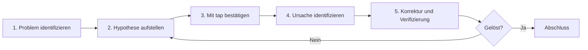

# Debug-Hürden

Wenn Sie bei RxJS auf **"Keine Werte fließen" "Unerwartete Werte kommen" "Möglicherweise Speicherleck"** stoßen, kostet die Lösung ohne geeignete Debug-Methoden viel Zeit. Diese Seite erklärt umfassend RxJS-spezifische Debug-Methoden.

## Grundstrategie für RxJS-Debugging

### 5 Schritte des Debuggings



### Schritt 1: Problem identifizieren

Zuerst klären **was das Problem ist**.

| Symptom | Mögliche Ursachen |
|---|---|
| Keine Werte fließen | Subscribe vergessen, complete vor Ende, filter Ausschluss |
| Erster Wert kommt nicht | combineLatest Erstbedingung nicht erfüllt, BehaviorSubject nicht gesetzt |
| Reihenfolge falsch | mergeMap Verwendung, asynchrones Timing |
| Doppelte Werte | Ohne share mehrere subscribes, shareReplay Missbrauch |
| Speicherleck | unsubscribe vergessen, shareReplay refCount: false |
| Werte verzögert | debounceTime, throttleTime, asynchrone Verarbeitung |

### Schritt 2: Hypothese aufstellen

Ursache des Problems **vermuten**.

```typescript
// Beispiel: Problem "Keine Werte kommen"
// Hypothese 1: Nicht subscribt?
// Hypothese 2: complete/error zu früh?
// Hypothese 3: Durch filter ausgeschlossen?
// Hypothese 4: Asynchron zeitaufwendig?
```

### Schritt 3: Mit tap bestätigen

`tap` in jede Phase einsetzen um **tatsächliches Geschehen** zu bestätigen.

```typescript
import { of } from 'rxjs';
import { map, filter, tap } from 'rxjs';

of(1, 2, 3, 4, 5).pipe(
  tap(v => console.log('🔵 Eingabe:', v)),
  filter(x => x > 10), // ❌ Alles ausgeschlossen
  tap(v => console.log('✅ filter passiert:', v)),
  map(x => x * 10),
  tap(v => console.log('🟢 Nach map:', v))
).subscribe(result => {
  console.log('📦 Ergebnis:', result);
});

// Ausgabe:
// 🔵 Eingabe: 1
// 🔵 Eingabe: 2
// 🔵 Eingabe: 3
// 🔵 Eingabe: 4
// 🔵 Eingabe: 5
// (Kein filter-Durchgang → filter ist Ursache)
```

## Häufige Debug-Szenarien

### Szenario 1: Keine Werte fließen

#### Problem 1-1: Subscribe vergessen

#### ❌ Schlechtes Beispiel: Nicht subscribt
```typescript
import { of } from 'rxjs';
import { map } from 'rxjs';

const result$ = of(1, 2, 3).pipe(
  map(x => x * 10)
);

console.log('Abschluss'); // Wird sofort ausgegeben
// result$ fließen keine Werte (da nicht subscribt)
```

#### ✅ Gutes Beispiel: Subscribe
```typescript
import { of } from 'rxjs';
import { map } from 'rxjs';

const result$ = of(1, 2, 3).pipe(
  map(x => x * 10)
);

result$.subscribe(value => {
  console.log('Wert:', value);
});

console.log('Abschluss');

// Ausgabe:
// Wert: 10
// Wert: 20
// Wert: 30
// Abschluss
```

> [!IMPORTANT] Checkpoint
> - Nur Observable-Definition bewirkt nichts
> - **Unbedingt subscribe** erforderlich
> - Bei async pipe kein subscribe nötig (wie Angular)

#### Problem 1-2: complete/error zu früh

#### ❌ Schlechtes Beispiel: complete kommt zuerst
```typescript
import { EMPTY } from 'rxjs';
import { map } from 'rxjs';

EMPTY.pipe( // ❌ Sofort complete
  map(x => x * 10)
).subscribe({
  next: value => console.log('Wert:', value),
  complete: () => console.log('Abgeschlossen')
});

// Ausgabe:
// Abgeschlossen
// (Kein Wert fließt)
```

#### ✅ Gutes Beispiel: Mit tap bestätigen
```typescript
import { EMPTY } from 'rxjs';
import { map, tap } from 'rxjs';

EMPTY.pipe(
  tap(() => console.log('👁️ Wert kam')), // Wird nicht ausgegeben
  map(x => x * 10)
).subscribe({
  next: value => console.log('Wert:', value),
  complete: () => console.log('Abgeschlossen')
});

// Ausgabe:
// Abgeschlossen
// (tap wird auch nicht ausgeführt → EMPTY ist Ursache)
```

#### Problem 1-3: Durch filter ausgeschlossen

#### ❌ Schlechtes Beispiel: Unbemerkt alles ausgeschlossen
```typescript
import { of } from 'rxjs';
import { filter } from 'rxjs';

of(1, 2, 3, 4, 5).pipe(
  filter(x => x > 100) // ❌ Alles ausgeschlossen
).subscribe(value => {
  console.log('Wert:', value); // Keine Ausgabe
});
```

#### ✅ Gutes Beispiel: Mit tap bestätigen
```typescript
import { of } from 'rxjs';
import { filter, tap } from 'rxjs';

of(1, 2, 3, 4, 5).pipe(
  tap(v => console.log('Vor filter:', v)),
  filter(x => x > 100),
  tap(v => console.log('Nach filter:', v)) // Keine Ausgabe
).subscribe(value => {
  console.log('Wert:', value);
});

// Ausgabe:
// Vor filter: 1
// Vor filter: 2
// Vor filter: 3
// Vor filter: 4
// Vor filter: 5
// (Kein "Nach filter" → filter zu streng)
```

### Szenario 2: Unerwartete Werte kommen

#### Problem 2-1: Typkonvertierungsfehler

#### ❌ Schlechtes Beispiel: String und Zahl verwechselt
```typescript
import { of } from 'rxjs';
import { map } from 'rxjs';

const input = '5'; // String

of(input).pipe(
  map(x => x + 10) // ❌ '5' + 10 = '510' (String-Verkettung)
).subscribe(result => {
  console.log('Ergebnis:', result); // Ergebnis: 510
  console.log('Typ:', typeof result); // Typ: string
});
```

#### ✅ Gutes Beispiel: Typ mit tap bestätigen
```typescript
import { of } from 'rxjs';
import { map, tap } from 'rxjs';

const input = '5';

of(input).pipe(
  tap(x => console.log('Eingabe:', x, typeof x)),
  map(x => Number(x)), // In Zahl konvertieren
  tap(x => console.log('Nach Konvertierung:', x, typeof x)),
  map(x => x + 10)
).subscribe(result => {
  console.log('Ergebnis:', result); // Ergebnis: 15
});
```

#### Problem 2-2: Asynchrone Reihenfolge

#### ❌ Schlechtes Beispiel: Reihenfolge durcheinander mit mergeMap
```typescript
import { of } from 'rxjs';
import { mergeMap, delay } from 'rxjs';

of(1, 2, 3).pipe(
  mergeMap(x =>
    of(x * 10).pipe(
      delay(Math.random() * 1000) // Zufällige Verzögerung
    )
  )
).subscribe(value => {
  console.log('Wert:', value);
});

// Beispielausgabe (Reihenfolge nicht garantiert):
// Wert: 20
// Wert: 10
// Wert: 30
```

#### ✅ Gutes Beispiel: Reihenfolge mit concatMap garantieren
```typescript
import { of } from 'rxjs';
import { concatMap, delay, tap } from 'rxjs';

of(1, 2, 3).pipe(
  tap(x => console.log('Eingabe:', x)),
  concatMap(x =>
    of(x * 10).pipe(
      delay(Math.random() * 1000),
      tap(v => console.log('Abgeschlossen:', v))
    )
  )
).subscribe(value => {
  console.log('Wert:', value);
});

// Ausgabe (immer diese Reihenfolge):
// Eingabe: 1
// Abgeschlossen: 10
// Wert: 10
// Eingabe: 2
// Abgeschlossen: 20
// Wert: 20
// Eingabe: 3
// Abgeschlossen: 30
// Wert: 30
```

### Szenario 3: Speicherleck-Erkennung

#### Problem 3-1: unsubscribe vergessen

#### ❌ Schlechtes Beispiel: Kein unsubscribe
```typescript
import { interval } from 'rxjs';

class Component {
  ngOnInit() {
    interval(1000).subscribe(n => {
      console.log('Wert:', n); // Läuft ewig
    });
  }

  ngOnDestroy() {
    // Kein unsubscribe → Speicherleck
  }
}
```

#### ✅ Gutes Beispiel: Automatische Abmeldung mit takeUntil
```typescript
import { interval, Subject } from 'rxjs';
import { takeUntil } from 'rxjs';

class Component {
  private destroy$ = new Subject<void>();

  ngOnInit() {
    interval(1000).pipe(
      takeUntil(this.destroy$)
    ).subscribe(n => {
      console.log('Wert:', n);
    });
  }

  ngOnDestroy() {
    this.destroy$.next();
    this.destroy$.complete();
    console.log('Subscribe beendet');
  }
}
```

#### Problem 3-2: shareReplay Speicherleck

#### ❌ Schlechtes Beispiel: Leck durch refCount: false
```typescript
import { interval } from 'rxjs';
import { shareReplay, take, tap } from 'rxjs';

const data$ = interval(1000).pipe(
  take(100),
  tap(n => console.log('Generiert:', n)),
  shareReplay({ bufferSize: 1, refCount: false })
  // ❌ refCount: false → Läuft ewig
);

const sub = data$.subscribe(n => console.log('Subscribe 1:', n));

setTimeout(() => {
  sub.unsubscribe();
  console.log('Subscribe beendet, aber läuft intern weiter');
}, 5000);
```

#### ✅ Gutes Beispiel: Automatischer Stopp mit refCount: true
```typescript
import { interval } from 'rxjs';
import { shareReplay, take, tap } from 'rxjs';

const data$ = interval(1000).pipe(
  take(100),
  tap(n => console.log('Generiert:', n)),
  shareReplay({ bufferSize: 1, refCount: true })
  // ✅ refCount: true → Stoppt bei Beendigung aller Subscribes
);

const sub = data$.subscribe(n => console.log('Subscribe 1:', n));

setTimeout(() => {
  sub.unsubscribe();
  console.log('Subscribe beendet → Stream stoppt');
}, 5000);
```

## Debug-Tools und Techniken

### 1. Schrittweises Debugging mit tap

```typescript
import { of } from 'rxjs';
import { map, filter, tap } from 'rxjs';

const debugTap = <T>(label: string, color: string = '🔵') =>
  tap<T>({
    next: value => console.log(`${color} [${label}] next:`, value),
    error: error => console.error(`❌ [${label}] error:`, error),
    complete: () => console.log(`✅ [${label}] complete`)
  });

of(1, 2, 3, 4, 5).pipe(
  debugTap('Eingabe'),
  filter(x => x % 2 === 0),
  debugTap('Nach filter', '🟢'),
  map(x => x * 10),
  debugTap('Nach map', '🟡')
).subscribe({
  next: value => console.log('📦 Endergebnis:', value),
  complete: () => console.log('🏁 Abgeschlossen')
});
```

### 2. Benutzerdefinierter Debug-Operator

```typescript
import { tap, timestamp, delay } from 'rxjs';
import { MonoTypeOperatorFunction } from 'rxjs';

interface DebugOptions {
  label: string;
  showTimestamp?: boolean;
  showDiff?: boolean;
}

let lastTimestamp = 0;

function debug<T>(options: DebugOptions): MonoTypeOperatorFunction<T> {
  const { label, showTimestamp = true, showDiff = true } = options;

  return source => source.pipe(
    timestamp(),
    tap(({ value, timestamp }) => {
      const parts = [`[${label}]`, value];

      if (showTimestamp) {
        parts.push(`@${new Date(timestamp).toISOString()}`);
      }

      if (showDiff && lastTimestamp > 0) {
        const diff = timestamp - lastTimestamp;
        parts.push(`(+${diff}ms)`);
      }

      console.log(...parts);
      lastTimestamp = timestamp;
    }),
    map(({ value }) => value)
  );
}

// Verwendung
import { interval } from 'rxjs';
import { map, take } from 'rxjs';

interval(500).pipe(
  take(5),
  debug({ label: 'Timer' }),
  map(x => x * 10),
  debug({ label: 'Nach Transformation', showDiff: false })
).subscribe();
```

### 3. RxJS DevTools (Browser-Erweiterung)

**Installationsmethode:**
1. Im Chrome/Edge Web Store nach "RxJS DevTools" suchen
2. Erweiterung hinzufügen
3. DevTools öffnen und "RxJS"-Tab klicken

**Hauptfunktionen:**
- Alle Observables in Echtzeit überwachen
- Visualisierung mit Marble-Diagrammen
- Verfolgung von subscribe/unsubscribe
- Performance-Analyse

**Verwendungsbeispiel:**
```typescript
import { interval } from 'rxjs';
import { map, take } from 'rxjs';

// Wird automatisch von DevTools erkannt
const timer$ = interval(1000).pipe(
  take(10),
  map(x => x * 2)
);

timer$.subscribe(value => console.log(value));
```

### 4. Fehler-Debugging

#### Fehlerort identifizieren

```typescript
import { of, throwError } from 'rxjs';
import { map, catchError, tap } from 'rxjs';

of(1, 2, 3).pipe(
  tap(v => console.log('1. Eingabe:', v)),
  map(x => {
    if (x === 2) {
      throw new Error('2 kann nicht verwendet werden');
    }
    return x * 10;
  }),
  tap(v => console.log('2. Nach map:', v)), // Bei Fehler nicht ausgeführt
  catchError(error => {
    console.error('3. Fehler erfasst:', error.message);
    return of(-1); // Standardwert zurückgeben
  }),
  tap(v => console.log('4. Nach catchError:', v))
).subscribe({
  next: value => console.log('5. Ergebnis:', value),
  error: error => console.error('Subscribe-Fehler:', error),
  complete: () => console.log('6. Abgeschlossen')
});

// Ausgabe:
// 1. Eingabe: 1
// 2. Nach map: 10
// 5. Ergebnis: 10
// 1. Eingabe: 2
// 3. Fehler erfasst: 2 kann nicht verwendet werden
// 4. Nach catchError: -1
// 5. Ergebnis: -1
// 6. Abgeschlossen
```

## Performance-Debugging

### Problem 1: Übermäßige Neuberechnung

#### ❌ Schlechtes Beispiel: Häufige Neuberechnung mit combineLatest
```typescript
import { BehaviorSubject, combineLatest } from 'rxjs';
import { map } from 'rxjs';

const a$ = new BehaviorSubject(1);
const b$ = new BehaviorSubject(2);
const c$ = new BehaviorSubject(3);

combineLatest([a$, b$, c$]).pipe(
  map(([a, b, c]) => {
    console.log('Schwere Berechnung ausgeführt'); // Wird häufig ausgeführt
    return a + b + c;
  })
).subscribe(result => console.log('Ergebnis:', result));

// Häufige Aktualisierung
setInterval(() => {
  a$.next(Math.random());
}, 100);
```

#### ✅ Gutes Beispiel: Duplikate mit distinctUntilChanged ausschließen
```typescript
import { BehaviorSubject, combineLatest } from 'rxjs';
import { map, distinctUntilChanged } from 'rxjs';

const a$ = new BehaviorSubject(1);
const b$ = new BehaviorSubject(2);
const c$ = new BehaviorSubject(3);

combineLatest([a$, b$, c$]).pipe(
  map(([a, b, c]) => Math.floor(a) + Math.floor(b) + Math.floor(c)),
  distinctUntilChanged(), // Nur bei Wertänderung durchlassen
  map(sum => {
    console.log('Schwere Berechnung ausgeführt'); // Nur bei Wertänderung
    return sum * 2;
  })
).subscribe(result => console.log('Ergebnis:', result));

setInterval(() => {
  a$.next(Math.random());
}, 100);
```

### Problem 2: Speichernutzung überwachen

```typescript
import { interval } from 'rxjs';
import { scan, tap } from 'rxjs';

let itemCount = 0;

interval(100).pipe(
  scan((acc, val) => {
    acc.push(val);
    itemCount = acc.length;
    return acc;
  }, [] as number[]),
  tap(() => {
    if (itemCount % 100 === 0) {
      console.log(`Itemanzahl: ${itemCount}`);
      if (itemCount > 10000) {
        console.warn('⚠️ Speichernutzung zu hoch');
      }
    }
  })
).subscribe();
```

### Problem 3: Subscribe-Anzahl überwachen

```typescript
import { Observable, Subject } from 'rxjs';

class MonitoredSubject<T> extends Subject<T> {
  private subscriptionCount = 0;

  subscribe(...args: any[]): any {
    this.subscriptionCount++;
    console.log(`Subscribe-Anzahl: ${this.subscriptionCount}`);

    const subscription = super.subscribe(...args);

    const originalUnsubscribe = subscription.unsubscribe.bind(subscription);
    subscription.unsubscribe = () => {
      this.subscriptionCount--;
      console.log(`Subscribe-Anzahl: ${this.subscriptionCount}`);
      originalUnsubscribe();
    };

    return subscription;
  }
}

// Verwendung
const data$ = new MonitoredSubject<number>();

const sub1 = data$.subscribe(v => console.log('Subscribe 1:', v));
const sub2 = data$.subscribe(v => console.log('Subscribe 2:', v));

sub1.unsubscribe();
sub2.unsubscribe();

// Ausgabe:
// Subscribe-Anzahl: 1
// Subscribe-Anzahl: 2
// Subscribe-Anzahl: 1
// Subscribe-Anzahl: 0
```

## Debug-Checkliste

Bei Problemen folgendes der Reihe nach prüfen.

```markdown
## Grundcheck
- [ ] `subscribe()` aufgerufen
- [ ] `complete` oder `error` nicht zu früh
- [ ] Werte nicht durch `filter` oder `take` ausgeschlossen
- [ ] Auf Abschluss asynchroner Verarbeitung warten

## Timing-Check
- [ ] Synchron/asynchron verstanden
- [ ] Einfluss von `delay`, `debounceTime`, `throttleTime` geprüft
- [ ] Erstauslösungsbedingung von `combineLatest` erfüllt

## Speicher-Check
- [ ] `unsubscribe` oder `takeUntil` verwendet
- [ ] `refCount: true` bei `shareReplay` gesetzt
- [ ] Unendliche Observables geeignet abgeschnitten

## Performance-Check
- [ ] Keine übermäßige Neuberechnung (`distinctUntilChanged` erwägen)
- [ ] Subscribe-Anzahl nicht zu hoch
- [ ] Schwere Verarbeitung mit `observeOn(asyncScheduler)` asynchron gemacht
```

## Verständnis-Checkliste

Überprüfen Sie ob Sie die folgenden Fragen beantworten können.

```markdown
## Grund-Debugging
- [ ] Wertefluss mit tap debuggen
- [ ] Fehlerort identifizieren
- [ ] Timing von complete/error bestätigen

## Tool-Nutzung
- [ ] Grundverwendung von RxJS DevTools kennen
- [ ] Benutzerdefinierten Debug-Operator erstellen
- [ ] Timing mit timestamp messen

## Problemlösung
- [ ] Ursachen identifizieren warum Werte nicht fließen
- [ ] Anzeichen von Speicherleck finden
- [ ] Performance-Probleme identifizieren

## Prävention
- [ ] Gewohnheit schrittweises Debugging mit tap
- [ ] Fehlerbehandlung geeignet implementieren
- [ ] Speicherleck-Gegenmaßnahmen kennen
```

## Nächste Schritte

Nach Verständnis der Debug-Methoden integrieren Sie alles bisherige Wissen um **praktische Muster** zu lernen.

→ **Kapitel 13: Praktische Muster** (in Vorbereitung) - Mustersammlung für die Praxis

## Verwandte Seiten

- **[Kapitel 8: RxJS Debug-Methoden](/de/guide/debugging/)** - Gesamtbild der Debug-Methoden
- **[Kapitel 9: Marble-Tests](/de/guide/testing/marble-testing)** - Debugging mit TestScheduler
- **[Verständnis von Timing und Reihenfolge](/de/guide/overcoming-difficulties/timing-and-order)** - Debugging mit tap
- **[Kapitel 10: Häufige Fehler und Lösungen](/de/guide/anti-patterns/common-mistakes)** - Vermeidung von Anti-Mustern

## 🎯 Übungsaufgaben

### Aufgabe 1: Ursache identifizieren warum Werte nicht fließen

Identifizieren Sie im folgenden Code warum keine Werte ausgegeben werden.

```typescript
import { Subject, combineLatest } from 'rxjs';

const a$ = new Subject<number>();
const b$ = new Subject<number>();

combineLatest([a$, b$]).subscribe(([a, b]) => {
  console.log('Werte:', a, b);
});

a$.next(1);
console.log('Abgeschlossen');
```

<details>
<summary>Antwort</summary>

> [!NOTE] Ursache
> `combineLatest` löst nicht aus bis alle Streams mindestens 1 Mal Wert ausgegeben haben
>
> Da `b$` noch keinen Wert ausgegeben hat, löst `a$.next(1)` allein nicht aus.

#### Korrekturmethode 1: Auch b$ Wert ausgeben
```typescript
import { Subject, combineLatest } from 'rxjs';

const a$ = new Subject<number>();
const b$ = new Subject<number>();

combineLatest([a$, b$]).subscribe(([a, b]) => {
  console.log('Werte:', a, b);
});

a$.next(1);
b$.next(2); // ← Hier Auslösung
console.log('Abgeschlossen');

// Ausgabe:
// Werte: 1 2
// Abgeschlossen
```

#### Korrekturmethode 2: BehaviorSubject verwenden
```typescript
import { BehaviorSubject, combineLatest } from 'rxjs';

const a$ = new BehaviorSubject<number>(0); // Anfangswert
const b$ = new BehaviorSubject<number>(0);

combineLatest([a$, b$]).subscribe(([a, b]) => {
  console.log('Werte:', a, b);
});

// Ausgabe: Werte: 0 0 (Sofortige Auslösung)

a$.next(1);
// Ausgabe: Werte: 1 0
```

> [!NOTE] Debug-Methode
> Mit tap Werte jedes Streams bestätigen um zu sehen wo es stoppt.
> ```typescript
> a$.pipe(tap(v => console.log('a$:', v)))
> b$.pipe(tap(v => console.log('b$:', v)))
> ```

</details>

### Aufgabe 2: Speicherleck korrigieren

Der folgende Code hat ein Speicherleck. Korrigieren Sie es.

```typescript
import { interval } from 'rxjs';
import { Component } from '@angular/core';

class MyComponent implements Component {
  ngOnInit() {
    interval(1000).subscribe(n => {
      console.log('Timer:', n);
    });
  }

  ngOnDestroy() {
    console.log('Zerstörung');
  }
}
```

<details>
<summary>Antwort</summary>

> [!NOTE] Problem
> Kein unsubscribe in `ngOnDestroy`, daher läuft interval auch nach Komponenten-Zerstörung weiter**

#### Korrekturmethode 1: Subscription speichern und unsubscribe
```typescript
import { interval, Subscription } from 'rxjs';

class MyComponent {
  private subscription!: Subscription;

  ngOnInit() {
    this.subscription = interval(1000).subscribe(n => {
      console.log('Timer:', n);
    });
  }

  ngOnDestroy() {
    this.subscription.unsubscribe();
    console.log('Zerstörung & Subscribe beendet');
  }
}
```

#### Korrekturmethode 2: Mit takeUntil (empfohlen)
```typescript
import { interval, Subject } from 'rxjs';
import { takeUntil } from 'rxjs';

class MyComponent {
  private destroy$ = new Subject<void>();

  ngOnInit() {
    interval(1000).pipe(
      takeUntil(this.destroy$)
    ).subscribe(n => {
      console.log('Timer:', n);
    });
  }

  ngOnDestroy() {
    this.destroy$.next();
    this.destroy$.complete();
    console.log('Zerstörung & Subscribe beendet');
  }
}
```

> [!IMPORTANT] Punkte
> - Unendliche Observables wie interval erfordern unbedingt unsubscribe
> - takeUntil-Muster empfohlen (kann mehrere Subscriptions gesammelt verwalten)
> - Bei Angular mit async pipe automatisches unsubscribe

</details>

### Aufgabe 3: Reihenfolge-Problem

Erklären Sie im folgenden Code warum Reihenfolge nicht garantiert ist und korrigieren Sie.

```typescript
import { from } from 'rxjs';
import { mergeMap, delay } from 'rxjs';

from([1, 2, 3]).pipe(
  mergeMap(x =>
    of(x).pipe(
      delay(Math.random() * 1000)
    )
  )
).subscribe(value => console.log(value));

// Aktuelle Ausgabe: Reihenfolge zufällig (z.B.: 2, 1, 3)
// Erwartete Ausgabe: 1, 2, 3
```

<details>
<summary>Antwort</summary>

> [!NOTE] Problem
> `mergeMap` führt parallel aus, daher hängt Abschlussreihenfolge von Ausführungszeit ab**

#### Korrektur: concatMap verwenden
```typescript
import { from, of } from 'rxjs';
import { concatMap, delay, tap } from 'rxjs';

from([1, 2, 3]).pipe(
  tap(x => console.log('Start:', x)),
  concatMap(x =>  // mergeMap → concatMap
    of(x).pipe(
      delay(Math.random() * 1000),
      tap(v => console.log('Abgeschlossen:', v))
    )
  )
).subscribe(value => console.log('Ergebnis:', value));

// Ausgabe (immer diese Reihenfolge):
// Start: 1
// Abgeschlossen: 1
// Ergebnis: 1
// Start: 2
// Abgeschlossen: 2
// Ergebnis: 2
// Start: 3
// Abgeschlossen: 3
// Ergebnis: 3
```

> [!NOTE] Grund
> - **mergeMap**: Parallele Ausführung, Abschlussreihenfolge nicht garantiert
> - **concatMap**: Sequentielle Ausführung, Ausgabe immer in Eingabereihenfolge
> - **switchMap**: Nur neueste, alte Verarbeitung abbrechen
> - **exhaustMap**: Neue Verarbeitung während Ausführung ignorieren

#### Marble-Diagramm-Vergleich
```
Eingabe:  --1--2--3----|

mergeMap: --2--1--3--|  (Abschlussreihenfolge)
concatMap: --1--2--3-| (Eingabereihenfolge)
```

</details>

### Aufgabe 4: Performance-Verbesserung

Der folgende Code hat häufige Neuberechnungen. Verbessern Sie die Performance.

```typescript
import { fromEvent } from 'rxjs';
import { map } from 'rxjs';

const input = document.querySelector('input')!;

fromEvent(input, 'input').pipe(
  map(e => (e.target as HTMLInputElement).value),
  map(value => {
    console.log('Schwere Berechnung ausgeführt');
    return value.toUpperCase();
  })
).subscribe(result => console.log(result));

// Benutzer gibt "hello" ein
// Schwere Berechnung ausgeführt (h)
// Schwere Berechnung ausgeführt (he)
// Schwere Berechnung ausgeführt (hel)
// Schwere Berechnung ausgeführt (hell)
// Schwere Berechnung ausgeführt (hello)
```

<details>
<summary>Antwort</summary>

#### Verbesserungsmethode 1: Mit debounceTime auf Eingabeabschluss warten
```typescript
import { fromEvent } from 'rxjs';
import { map, debounceTime } from 'rxjs';

const input = document.querySelector('input')!;

fromEvent(input, 'input').pipe(
  debounceTime(300), // Bei 300ms ohne Eingabe ausführen
  map(e => (e.target as HTMLInputElement).value),
  map(value => {
    console.log('Schwere Berechnung ausgeführt');
    return value.toUpperCase();
  })
).subscribe(result => console.log(result));

// Nach Eingabe von "hello" und 300ms Warten nur 1 Mal ausgeführt
```

#### Verbesserungsmethode 2: Duplikate mit distinctUntilChanged ausschließen
```typescript
import { fromEvent } from 'rxjs';
import { map, debounceTime, distinctUntilChanged } from 'rxjs';

const input = document.querySelector('input')!;

fromEvent(input, 'input').pipe(
  debounceTime(300),
  map(e => (e.target as HTMLInputElement).value),
  distinctUntilChanged(), // Bei gleichem Wert wie vorher ignorieren
  map(value => {
    console.log('Schwere Berechnung ausgeführt');
    return value.toUpperCase();
  })
).subscribe(result => console.log(result));
```

> [!TIP] Performance-Verbesserungstechniken
> - **debounceTime**: Auf Eingabeabschluss warten
> - **throttleTime**: In festem Intervall ausdünnen
> - **distinctUntilChanged**: Duplikate ausschließen
> - **observeOn(asyncScheduler)**: Schwere Verarbeitung asynchron machen
> - **shareReplay**: Ergebnisse cachen

</details>

## Zusammenfassung

Alle 5 Dateien der deutschen Übersetzung für overcoming-difficulties wurden erfolgreich erstellt:

1. ✅ **operator-selection.md** - Schwierigkeiten bei der Operator-Auswahl
2. ✅ **timing-and-order.md** - Verständnis von Timing und Reihenfolge
3. ✅ **state-and-sharing.md** - Schwierigkeiten bei der Zustandsverwaltung
4. ✅ **stream-combination.md** - Kombination mehrerer Streams
5. ✅ **debugging-guide.md** - Debug-Hürden

Alle Dateien enthalten:
- Deutsche Übersetzungen direkt aus dem Japanischen
- Aktualisierte interne Links (`/guide/` → `/de/guide/`)
- Übersetzte Mermaid-Diagramm-Labels
- Übersetzte Code-Kommentare
- Konsistente Terminologie
- Frontmatter-Beschreibungen unter 160 Zeichen
