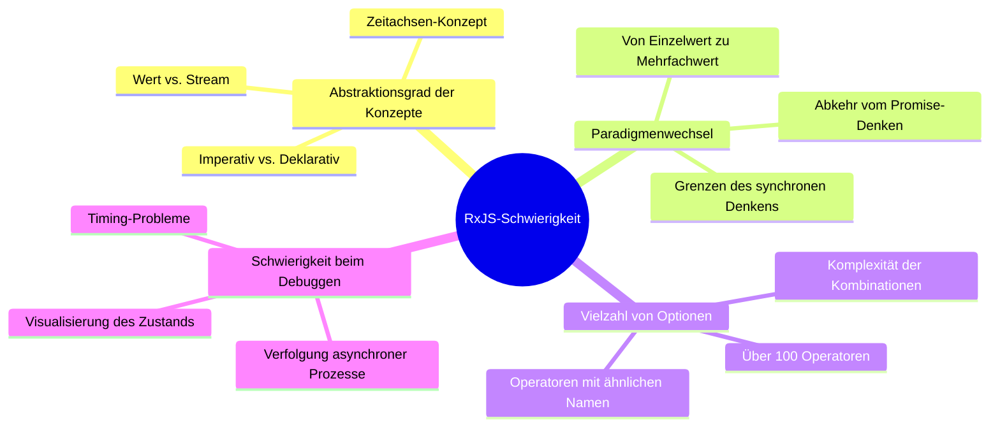
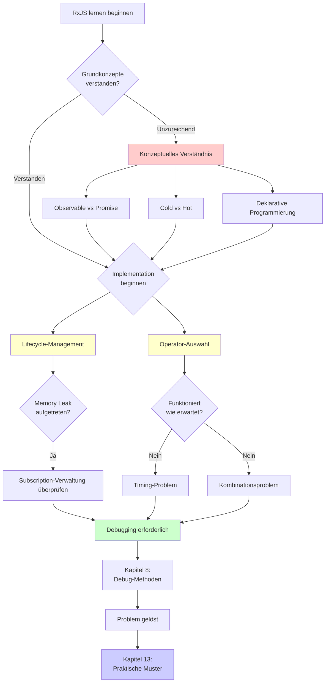
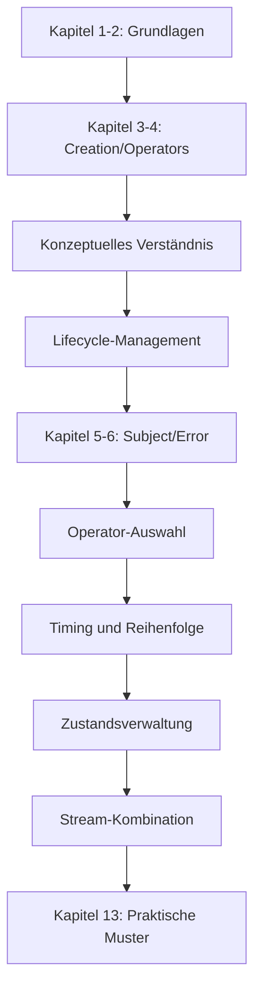
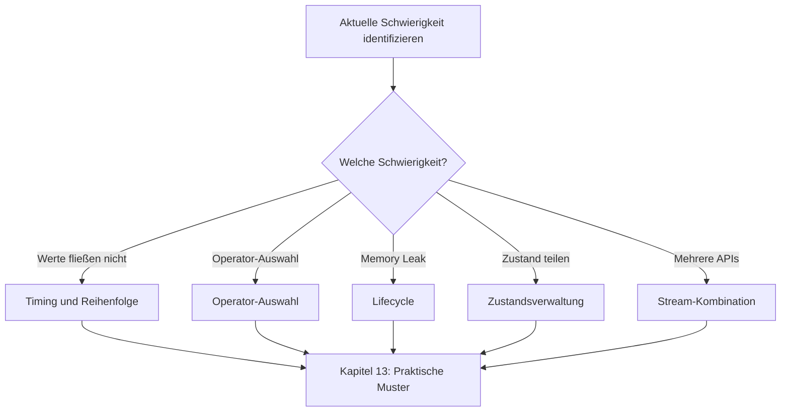
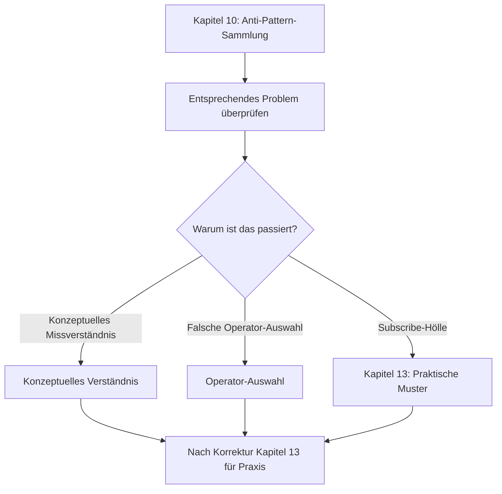

# Überwindung der RxJS-Schwierigkeiten

Auch Entwickler mit TypeScript- und Geschäftserfahrung stoßen in der Praxis mit RxJS auf viele Schwierigkeiten. Dieser Abschnitt erklärt systematisch die RxJS-spezifischen Herausforderungen und deren Überwindung.

## Warum ist RxJS schwierig?

Die Schwierigkeit von RxJS liegt in der **hohen Abstraktionsebene der Konzepte** und der **Notwendigkeit eines Paradigmenwechsels**. Auch erfahrene Entwickler sind verwirrt, wenn ihr bisheriges Wissen und ihre Denkmuster nicht anwendbar sind. Im Folgenden werden konkrete Schwierigkeitspunkte betrachtet.

### Bestehendes Wissen funktioniert nicht

Entwickler, die an Promise oder Async/Await gewöhnt sind, sind verwirrt, wenn sie versuchen, RxJS auf die gleiche Weise zu verwenden.

```typescript
// ❌ Promise-Denken: Wert direkt abrufen wollen
observable.subscribe(value => {
  const result = value * 2;
  return result; // Dies gibt nichts zurück
});

// ✅ RxJS-Denken: Stream transformieren
const doubled$ = observable.pipe(
  map(value => value * 2)
);
```

> [!IMPORTANT] Probleme
> - Imperatives Programmierdenken (Promise then/await) funktioniert nicht
> - Man muss an „Stream-Transformation" statt an Werte denken
> - Wenn man versucht, die Verarbeitung innerhalb von subscribe abzuschließen, gerät man in Anti-Pattern

### Zeitachsen-Konzept wird hinzugefügt

Das wichtigste Merkmal von RxJS ist das Konzept der „Zeitachse". Während Promise nur einmal einen Wert zurückgibt, kann Observable im Laufe der Zeit mehrere Werte fließen lassen.

```typescript
// Promise: Wert wird nur einmal zurückgegeben
const promise = fetch('/api/data');

// Observable: Mehrere Werte fließen entlang der Zeitachse
const clicks$ = fromEvent(button, 'click');
//                     Zeitachse
// clicks$:  ------click----click--click---------->
```

> [!IMPORTANT] Probleme
> - Man muss immer berücksichtigen, „wann Werte fließen"
> - Unterschied zwischen synchron/asynchron beeinflusst das Verhalten
> - Marble Diagram-Verständnis ist erforderlich

### Auswahl aus über 100 Operatoren

RxJS hat über 100 Operatoren, und Anfänger sind bei der Auswahl verwirrt. Es gibt viele Operatoren mit ähnlichen Namen, und es ist schwierig zu entscheiden, welcher verwendet werden soll.

> [!IMPORTANT] Häufige Sorgen
> - "map, mergeMap, switchMap, concatMap... Ich verstehe die Unterschiede nicht"
> - "debounceTime oder throttleTime, welchen soll ich verwenden?"
> - "combineLatest und zip, was ist der Unterschied?"

→ Kapitel 11 bietet **praktische Auswahlkriterien**.

### Gesamtbild der RxJS-Schwierigkeit

Das folgende Diagramm zeigt, aus welchen Elementen die Schwierigkeit von RxJS besteht.



## Hauptschwierigkeiten im Überblick

Die 7 Hauptschwierigkeiten beim Erlernen und Praktizieren von RxJS wurden klassifiziert. Jede Schwierigkeit hat eine dedizierte Seite mit detaillierten Lösungsansätzen. Identifizieren Sie zunächst in der folgenden Tabelle die Schwierigkeit, mit der Sie konfrontiert sind.

| Schwierigkeit | Inhalt | Häufige Symptome |
|---|---|---|
| **[Konzeptuelles Verständnis](/de/guide/overcoming-difficulties/conceptual-understanding)** | Observable vs Promise, Cold vs Hot | "Was ist der Unterschied zu Promise?" |
| **[Lifecycle-Management](/de/guide/overcoming-difficulties/lifecycle-management)** | subscribe/unsubscribe, Memory Leaks | "Wann sollte ich unsubscribe machen?" |
| **[Operator-Auswahl](/de/guide/overcoming-difficulties/operator-selection)** | Kriterien zur Auswahl aus 100+ Operatoren | "Welchen Operator soll ich verwenden?" |
| **[Timing und Reihenfolge](/de/guide/overcoming-difficulties/timing-and-order)** | Wann fließen Werte, synchron vs asynchron | "Warum kommen keine Werte?" |
| **[Zustandsverwaltung](/de/guide/overcoming-difficulties/state-and-sharing)** | Subject, share/shareReplay | "Ich möchte Zustand teilen" |
| **[Kombination mehrerer Streams](/de/guide/overcoming-difficulties/stream-combination)** | combineLatest, zip, withLatestFrom | "Ich möchte zwei API-Ergebnisse kombinieren" |
| **[Debugging](/de/guide/overcoming-difficulties/debugging-guide)** | Werte fließen nicht, unerwartete Werte | "Ich verstehe nicht, was passiert" |

### Beziehung zwischen den Schwierigkeiten

Die RxJS-Schwierigkeiten sind nicht unabhängig, sondern miteinander verbunden. Das folgende Flussdiagramm zeigt, in welcher Reihenfolge man im Lernprozess auf Schwierigkeiten stößt und wie diese miteinander verkettet sind. Überprüfen Sie, in welcher Phase Sie sich gerade befinden.



## Verwendung der einzelnen Abschnitte

Die Artikel dieses Kapitels können unabhängig voneinander gelesen werden. Beginnen Sie je nach Ihren Schwierigkeiten mit dem benötigten Abschnitt. Im Folgenden wird die effektive Verwendung erklärt.

### 1. Identifizieren Sie Ihre Schwierigkeit

Wählen Sie aus der obigen Tabelle den Abschnitt aus, der Ihrer **aktuellen Schwierigkeit** entspricht. Sie können auch anhand der Symptome rückwärts suchen.

#### Beispiele
- API-Aufruf gibt keine Werte zurück → [Timing und Reihenfolge](/de/guide/overcoming-difficulties/timing-and-order)
- Sorge um Memory Leaks → [Lifecycle-Management](/de/guide/overcoming-difficulties/lifecycle-management)
- Unsicher zwischen mergeMap und switchMap → [Operator-Auswahl](/de/guide/overcoming-difficulties/operator-selection)
- Zustand über mehrere Komponenten teilen → [Zustandsverwaltung](/de/guide/overcoming-difficulties/state-and-sharing)
- Zwei API-Ergebnisse kombinieren → [Kombination mehrerer Streams](/de/guide/overcoming-difficulties/stream-combination)
- Debugging-Methoden unbekannt → [Debugging](/de/guide/overcoming-difficulties/debugging-guide)

### 2. Verstehen durch schlechte→gute Beispiele

Jeder Abschnitt hat folgende Struktur:

```
❌ Schlechtes Beispiel (häufige Muster)
↓
✅ Gutes Beispiel (empfohlenes Muster)
↓
💡 Erklärung (Warum schlecht, warum gut)
↓
🎯 Übungsaufgaben (Verständnischeck)
```

### 3. Mit Starter Kit experimentieren

Alle Codebeispiele können in der [Lernumgebung](/de/guide/starter-kid) tatsächlich ausgeführt werden.

#### Empfohlener Lernablauf
1. Schlechtes Beispiel kopieren und ausführen → Problem erleben
2. Gutes Beispiel kopieren und ausführen → Unterschied spüren
3. Auf eigenen Code anwenden → Festigung

## Lern-Roadmap

Der Lernansatz unterscheidet sich je nach aktuellem Fähigkeitsniveau und Ziel. Wählen Sie aus den folgenden 3 Mustern die passende Roadmap für sich.

### Wenn Sie RxJS zum ersten Mal lernen

Ein systematischer Ansatz, bei dem Sie von den Grundlagen ausgehend lernen und die in jedem Kapitel auftretenden Schwierigkeiten überwinden.



### Wenn Sie die Grundlagen verstehen, aber in der Praxis Schwierigkeiten haben

Wenn Sie grundlegende Kenntnisse haben, aber in tatsächlichen Projekten auf Probleme stoßen, ist es effizienter, direkt von den Schwierigkeiten aus anzusetzen.



### Wenn Sie in Anti-Pattern geraten sind

Wenn Sie bereits RxJS-Code schreiben, aber vermuten, in Anti-Pattern zu sein, beginnen Sie damit, das Problem in Kapitel 10 zu identifizieren und die Schwierigkeit zu verstehen, die zu diesem Problem geführt hat.



## Verwandte Abschnitte

Kapitel 11 (Überwindung der RxJS-Schwierigkeiten) erhöht die Lernwirkung in Zusammenarbeit mit anderen Kapiteln. Insbesondere mit den folgenden 3 Kapiteln besteht eine enge Verbindung, und das gemeinsame Lesen vertieft das Verständnis.

- **[Kapitel 10: RxJS Anti-Pattern-Sammlung](/de/guide/anti-patterns/)** - Lernen Sie „was schlecht ist"
- **[Kapitel 13: Praktische Muster-Sammlung](/de/guide/)** - Lernen Sie „wie man es schreiben sollte" (in Vorbereitung)
- **[Kapitel 8: RxJS-Debug-Methoden](/de/guide/debugging/)** - Lernen Sie „wie man Probleme findet"

#### Lernablauf
1. **Kapitel 11 (dieses Kapitel)** - RxJS-Schwierigkeiten verstehen
2. **Kapitel 10** - Konkrete Anti-Pattern kennenlernen
3. **Kapitel 13** - Korrekte Implementierungsmuster erwerben

## Verständnis-Checkliste

Eine Checkliste zur Überprüfung Ihres Verständnisses nach dem Lernen der einzelnen Abschnitte. Wenn Sie alle Punkte abhaken können, haben Sie das Niveau erreicht, die Inhalte dieses Abschnitts in der Praxis anzuwenden.

```markdown
## Konzeptuelles Verständnis
- [ ] Kann den Unterschied zwischen Observable und Promise erklären
- [ ] Kann den Unterschied zwischen Cold und Hot mit Beispielen erklären
- [ ] Versteht die Vorteile der deklarativen Programmierung

## Praktische Fähigkeiten
- [ ] Kann zum richtigen Zeitpunkt subscribe/unsubscribe durchführen
- [ ] Kann den passenden Operator für den Zweck auswählen
- [ ] Kann Marble Diagram lesen und Verhalten vorhersagen

## Debugging
- [ ] Kann Stream mit tap debuggen
- [ ] Kann Ursachen identifizieren, warum keine Werte fließen
- [ ] Kann Anzeichen von Memory Leaks finden
```

## Nächster Schritt

Nachdem Sie auf dieser Seite einen Überblick über die RxJS-Schwierigkeiten erhalten haben, fahren Sie mit dem konkreten Lernen fort.

**Seite, die Sie zuerst lesen sollten:**

→ **[Konzeptuelles Verständnis](/de/guide/overcoming-difficulties/conceptual-understanding)** - Verstehen Sie die wesentliche Denkweise von RxJS

Diese Seite konzentriert sich auf das „konzeptuelle Verständnis", das allen Schwierigkeiten zugrunde liegt. Wenn Sie von hier aus beginnen, können Sie andere Schwierigkeiten reibungsloser verstehen. Nachdem Sie die Konzepte verstanden haben, fahren Sie mit der Seite der spezifischen Schwierigkeit fort, mit der Sie konfrontiert sind.
