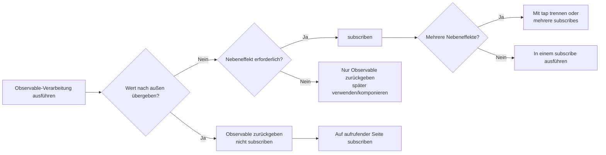
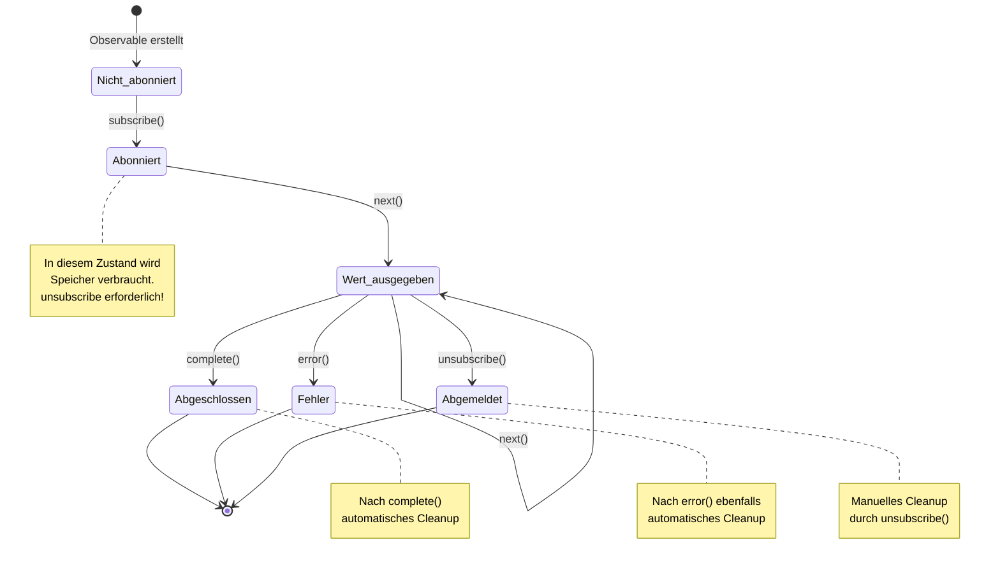
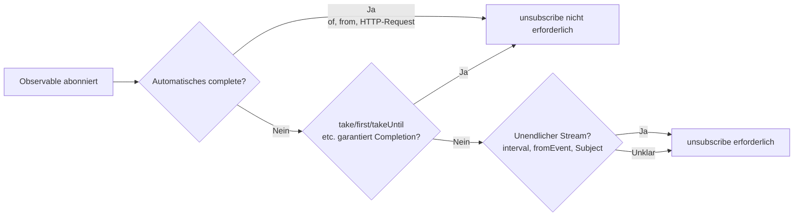

# Die Mauer des Lifecycle-Managements

Eine der größten Fallen von RxJS ist das **Lifecycle-Management**. Wenn Sie "wann sollte ich subscriben" und "wann sollte ich unsubscriben" falsch machen, kann dies zu Speicherlecks und Bugs führen.

## Wann sollte man subscribe?

### Grundprinzip: Subscribe nicht bis zum allerletzten Moment

#### ❌ Schlechtes Beispiel: Subscribe in der Mitte

```typescript
import { interval } from 'rxjs';

function getEvenNumbers() {
  const numbers$ = interval(1000);

  // Subscribe hier drin
  numbers$.subscribe(n => {
    if (n % 2 === 0) {
      console.log(n); // Wie übergebe ich dies nach außen?
    }
  });
}
```

#### ✅ Gutes Beispiel: Observable zurückgeben und auf der aufrufenden Seite subscriben

```typescript
import { interval } from 'rxjs';
import { filter, take } from 'rxjs';

function getEvenNumbers() {
  return interval(1000).pipe(
    filter(n => n % 2 === 0),
    take(5)
  );
}

// Subscribe auf der Verwendungsseite
const subscription = getEvenNumbers().subscribe(n => {
  console.log(n);
});
```

::: tip 💡 Erklärung
- **Schlechtes Beispiel**: Wenn Sie innerhalb einer Funktion subscriben, verlieren Sie die Kontrolle (kann nicht abgebrochen, nicht komponiert werden)
- **Gutes Beispiel**: Durch Rückgabe eines Observable kann die aufrufende Seite die Kontrolle übernehmen
:::

### Subscribe ist ein Trigger für "Nebeneffekte"

#### ❌ Schlechtes Beispiel: Mehrere Nebeneffekte innerhalb von subscribe ausführen

```typescript
import { fromEvent } from 'rxjs';
import { map } from 'rxjs';

const button = document.querySelector('button')!;

fromEvent(button, 'click')
  .pipe(map(() => Math.random()))
  .subscribe(randomValue => {
    // Nebeneffekt 1: DOM-Manipulation
    document.querySelector('#result')!.textContent = randomValue.toString();

    // Nebeneffekt 2: API-Aufruf
    fetch('/api/log', {
      method: 'POST',
      body: JSON.stringify({ value: randomValue })
    });

    // Nebeneffekt 3: Lokaler Speicher
    localStorage.setItem('lastValue', randomValue.toString());
  });
```

#### ✅ Gutes Beispiel: Nebeneffekte trennen und nur das Notwendige subscriben

```typescript
import { fromEvent } from 'rxjs';
import { map } from 'rxjs';

const button = document.querySelector('button')!;

const randomClicks$ = fromEvent(button, 'click').pipe(
  map(() => Math.random())
);

// Nur DOM-Update benötigt
randomClicks$.subscribe(value => {
  document.querySelector('#result')!.textContent = value.toString();
});

// Nur Logging benötigt
randomClicks$.subscribe(value => {
  fetch('/api/log', {
    method: 'POST',
    body: JSON.stringify({ value })
  });
});
```

::: tip 💡 Erklärung
- **subscribe = Ausführungspunkt für Nebeneffekte**
- **Wenn Nebeneffekte unabhängig sind**: In mehrere subscribes aufteilen (individuell steuerbar)
- **Wenn Nebeneffekte immer als Set ausgeführt werden**: In einem subscribe zusammenfassen ist OK
- **Wenn Nebeneffekte in der Pipeline benötigt werden**: `tap` Operator verwenden
:::

### Wann sollte man subscribe: Entscheidungsflussdiagramm



### Gesamtbild des Subscription-Lebenszyklus

Das folgende Zustandsübergangsdiagramm zeigt, welche Zustände ein Observable-Subscription durchläuft, bevor es beendet wird.



> [!IMPORTANT] Wichtige Punkte des Lifecycle-Managements
> - **Abonniert**: Zustand mit Speicherleck-Gefahr
> - **complete/error**: Automatisches Cleanup (unsubscribe nicht erforderlich)
> - **unsubscribe**: Manuelles Cleanup erforderlich (besonders bei unendlichen Streams)

## Wann sollte man unsubscribe?

### Grundprinzip: Immer unsubscriben, wenn man abonniert hat

#### ❌ Schlechtes Beispiel: Kein unsubscribe → Speicherleck

```typescript
import { interval } from 'rxjs';

const button = document.querySelector('button')!;

function startTimer() {
  interval(1000).subscribe(n => {
    console.log(n);
  });
  // Dieses Abonnement läuft ewig weiter!
}

// Bei jedem Button-Klick wird ein neues Abonnement hinzugefügt
button.addEventListener('click', startTimer);
// 10 Klicks = 10 Abonnements laufen gleichzeitig!
```

#### ✅ Gutes Beispiel: Mit unsubscribe aufheben

```typescript
import { interval } from 'rxjs';

function startTimer() {
  const subscription = interval(1000).subscribe(n => {
    console.log(n);
  });

  // Nach 5 Sekunden aufheben
  setTimeout(() => {
    subscription.unsubscribe();
    console.log('Abonnement aufgehoben');
  }, 5000);
}
```

::: tip 💡 Erklärung
- **Unendliche Streams** (interval, fromEvent etc.) benötigen immer unsubscribe
- Ohne unsubscribe gibt es Speicherlecks + unnötige Verarbeitung läuft weiter
:::

### Fälle, in denen unsubscribe nicht erforderlich ist

#### ✅ Observable, die automatisch complete

```typescript
of(1, 2, 3).subscribe(n => console.log(n));
// Nach complete automatisches Cleanup

from([1, 2, 3]).subscribe(n => console.log(n));
// Nach complete automatisches Cleanup
```

#### ✅ Mit take etc. ist Completion garantiert

```typescript
interval(1000).pipe(
  take(5) // Automatisches complete nach 5 Mal
).subscribe(n => console.log(n));
```

#### ✅ Beendigung durch Error

```typescript
throwError(() => new Error('Error')).subscribe({
  error: err => console.error(err)
});
```

#### ✅ EMPTY (sofortiges complete)

```typescript
EMPTY.subscribe(() => console.log('Wird nicht ausgeführt'));
```

> [!TIP] 💡 Erklärung
> unsubscribe ist nicht erforderlich in folgenden Fällen:
> 1. **Observable, die complete() aufrufen** - Automatisches Cleanup
> 2. **Wenn error() aufgerufen wird** - Ebenfalls automatisches Cleanup
> 3. **Mit take(n) etc. ist Completion garantiert** - Explizites complete
> > [!IMPORTANT] Wichtig
> > Unendliche Streams (interval, fromEvent, Subject etc.) benötigen immer unsubscribe!

### Entscheidungsflussdiagramm: Ist unsubscribe erforderlich?



**Im Zweifel unsubscriben** ist sicher!

## Muster zur Verhinderung von Speicherlecks

### Muster 1: Verwaltung mit Subscription-Objekt

```typescript
import { interval, fromEvent } from 'rxjs';
import { Subscription } from 'rxjs';

class MyComponent {
  private subscription = new Subscription();

  ngOnInit() {
    // Mehrere Abonnements zu einem Subscription hinzufügen
    this.subscription.add(
      interval(1000).subscribe(n => console.log('Timer:', n))
    );

    this.subscription.add(
      fromEvent(document, 'click').subscribe(() => console.log('Click!'))
    );

    this.subscription.add(
      fromEvent(window, 'resize').subscribe(() => console.log('Resize!'))
    );
  }

  ngOnDestroy() {
    // Alle Abonnements auf einmal aufheben
    this.subscription.unsubscribe();
  }
}
```

#### 💡 Vorteile

- Mehrere Abonnements mit einem Objekt verwalten
- Batch-Aufhebung in `ngOnDestroy`
- Einfaches Hinzufügen und Entfernen

### Muster 2: Verwaltung mit Array

```typescript
import { interval, fromEvent } from 'rxjs';
import { Subscription } from 'rxjs';

class MyComponent {
  private subscriptions: Subscription[] = [];

  ngOnInit() {
    this.subscriptions.push(
      interval(1000).subscribe(n => console.log('Timer:', n))
    );

    this.subscriptions.push(
      fromEvent(document, 'click').subscribe(() => console.log('Click!'))
    );
  }

  ngOnDestroy() {
    this.subscriptions.forEach(sub => sub.unsubscribe());
    this.subscriptions = [];
  }
}
```

#### 💡 Vorteile

- Flexible Verwaltung mit Array-Operationen
- Individuelle Aufhebung möglich
- Leichter zu debuggen (Array mit console.log überprüfbar)

### Muster 3: takeUntil-Muster (empfohlen)

```typescript
import { interval, fromEvent, Subject } from 'rxjs';
import { takeUntil } from 'rxjs';

class MyComponent {
  private destroy$ = new Subject<void>();

  ngOnInit() {
    // takeUntil(this.destroy$) zu allen Abonnements hinzufügen
    interval(1000).pipe(
      takeUntil(this.destroy$)
    ).subscribe(n => console.log('Timer:', n));

    fromEvent(document, 'click').pipe(
      takeUntil(this.destroy$)
    ).subscribe(() => console.log('Click!'));

    fromEvent(window, 'resize').pipe(
      takeUntil(this.destroy$)
    ).subscribe(() => console.log('Resize!'));
  }

  ngOnDestroy() {
    // Alle Abonnements mit einem next() aufheben
    this.destroy$.next();
    this.destroy$.complete();
  }
}
```

#### 💡 Vorteile

- **Am deklarativsten** - Completion-Bedingung in der Pipeline explizit
- **Subscription-Objekt nicht erforderlich** - Speichereffizient
- **Leicht lesbar** - Beim Lesen des Codes wird klar "complete mit destroy$"

## Vollständiger Leitfaden zum takeUntil-Muster

### Basismuster

```typescript
import { interval, Subject } from 'rxjs';
import { takeUntil } from 'rxjs';

const destroy$ = new Subject<void>();

// Dieses Abonnement läuft bis destroy$ next() aufruft
interval(1000).pipe(
  takeUntil(destroy$)
).subscribe(n => console.log(n));

// Alle Abonnements nach 5 Sekunden stoppen
setTimeout(() => {
  destroy$.next();
  destroy$.complete();
}, 5000);
```

#### Marble Diagram

```
interval(1000):  --0--1--2--3--4--5--6--7-->
destroy$:        ----------X
                          ↑
                       next() Aufruf

takeUntil-Ergebnis:   --0--1--2|
                          ↑
                       complete
```

### Anwendung auf mehrere Observables

```typescript
import { interval, fromEvent, timer, Subject } from 'rxjs';
import { takeUntil, map } from 'rxjs';

const destroy$ = new Subject<void>();

// Muster: Dasselbe destroy$ für alle Streams verwenden
interval(1000).pipe(
  takeUntil(destroy$),
  map(n => `Timer: ${n}`)
).subscribe(console.log);

fromEvent(document, 'click').pipe(
  takeUntil(destroy$),
  map(() => 'Click!')
).subscribe(console.log);

timer(2000).pipe(
  takeUntil(destroy$),
  map(() => 'Timer finished')
).subscribe(console.log);

// Batch-Stopp
function cleanup() {
  destroy$.next();
  destroy$.complete();
}

// Beispiel: cleanup() bei Seitenübergang aufrufen
window.addEventListener('beforeunload', cleanup);
```

## Häufige Fehler beim takeUntil-Muster

### Fehler 1: takeUntil ist an der falschen Position

#### ❌ Schlechtes Beispiel: map nach takeUntil

```typescript
import { interval, Subject } from 'rxjs';
import { map, takeUntil } from 'rxjs';

const destroy$ = new Subject<void>();

interval(1000).pipe(
  takeUntil(destroy$),  // Auch wenn hier complete...
  map(n => n * 2)       // map könnte ausgeführt werden
).subscribe(console.log);
```

#### ✅ Gutes Beispiel: takeUntil zuletzt platzieren

```typescript
import { interval, Subject } from 'rxjs';
import { map, takeUntil } from 'rxjs';

const destroy$ = new Subject<void>();

interval(1000).pipe(
  map(n => n * 2),
  takeUntil(destroy$)  // Nach allen Operatoren
).subscribe(console.log);
```

> [!TIP]💡 Erklärung
> - **takeUntil so weit wie möglich zuletzt** platzieren
> - Ausnahme: Vor Multicast-Operatoren wie shareReplay kann es auch platziert werden

### Fehler 2: destroy$ nicht complete

#### ❌ Schlechtes Beispiel: complete() nicht aufgerufen

```typescript
import { Subject } from 'rxjs';

const destroy$ = new Subject<void>();

function cleanup() {
  destroy$.next();
  // ❌ complete() nicht aufgerufen
}

// Problem: destroy$ selbst wird zur Ursache von Speicherlecks
```

#### ✅ Gutes Beispiel: Sowohl next() als auch complete() aufrufen

```typescript
import { Subject } from 'rxjs';

const destroy$ = new Subject<void>();

function cleanup() {
  destroy$.next();
  destroy$.complete();
}
```

> [!TIP]💡 Erklärung
> - Nur `next()` lässt destroy$ selbst abonniert
> - **Immer auch `complete()` aufrufen**

### Fehler 3: Versuch der Wiederverwendung

#### ❌ Schlechtes Beispiel: Wiederverwendung eines completed Subject

```typescript
import { interval, Subject } from 'rxjs';
import { takeUntil } from 'rxjs';

const destroy$ = new Subject<void>();

function start() {
  interval(1000).pipe(
    takeUntil(destroy$)
  ).subscribe(console.log);
}

function stop() {
  destroy$.next();
  destroy$.complete();
}

start();
setTimeout(stop, 3000);

// ❌ Problem: destroy$ ist bereits complete, also wird start() sofort beendet
setTimeout(start, 5000); // Das funktioniert nicht
```

#### ✅ Gutes Beispiel: destroy$ neu erstellen

```typescript
import { interval, Subject } from 'rxjs';
import { takeUntil } from 'rxjs';

class MyComponent {
  private destroy$ = new Subject<void>();

  start() {
    // Falls bereits complete, neu erstellen
    if (this.destroy$.closed) {
      this.destroy$ = new Subject<void>();
    }

    interval(1000).pipe(
      takeUntil(this.destroy$)
    ).subscribe(console.log);
  }

  stop() {
    this.destroy$.next();
    this.destroy$.complete();
  }
}
```

> [!TIP] 💡 Erklärung
> - **Subject kann nach complete nicht wiederverwendet werden**
> - Bei Bedarf ein neues Subject erstellen

## Best Practices für Subscription-Management

### Best Practice 1: destroy$ pro Komponente/Klasse haben

```typescript
import { Subject } from 'rxjs';
import { takeUntil } from 'rxjs';

class UserProfileComponent {
  private destroy$ = new Subject<void>();

  constructor(private userService: UserService) {}

  ngOnInit() {
    this.userService.getUser().pipe(
      takeUntil(this.destroy$)
    ).subscribe(user => {
      console.log(user);
    });

    this.userService.getUserPosts().pipe(
      takeUntil(this.destroy$)
    ).subscribe(posts => {
      console.log(posts);
    });
  }

  ngOnDestroy() {
    this.destroy$.next();
    this.destroy$.complete();
  }
}
```

#### 💡 Vorteile

- **Konsistenz** - Gleiches Muster in allen Komponenten
- **Wartbarkeit** - Keine Änderung von ngOnDestroy beim Hinzufügen neuer Abonnements erforderlich
- **Sicherheit** - Kein Vergessen von unsubscribe

### Best Practice 2: AsyncPipe nutzen (im Fall von Angular)

```typescript
import { Component } from '@angular/core';
import { Observable } from 'rxjs';

@Component({
  selector: 'app-user-profile',
  template: `
    <!-- AsyncPipe subscribt und unsubscribt automatisch -->
    <div *ngIf="user$ | async as user">
      <h1>{{ user.name }}</h1>
      <p>{{ user.email }}</p>
    </div>

    <ul>
      <li *ngFor="let post of posts$ | async">
        {{ post.title }}
      </li>
    </ul>
  `
})
export class UserProfileComponent {
  user$: Observable<User>;
  posts$: Observable<Post[]>;

  constructor(private userService: UserService) {
    // Observable direkt an Template übergeben
    this.user$ = this.userService.getUser();
    this.posts$ = this.userService.getUserPosts();

    // ngOnDestroy nicht erforderlich! AsyncPipe hebt automatisch auf
  }
}
```

#### 💡 Vorteile

- **Automatisches unsubscribe** - Automatische Aufhebung bei Komponenten-Zerstörung
- **OnPush-kompatibel** - Optimierte Change Detection
- **Prägnanter Code** - Kein subscribe/unsubscribe Boilerplate erforderlich

### Best Practice 3: Strategie nach langlebig vs. kurzlebig ändern

```typescript
import { Injectable } from '@angular/core';
import { BehaviorSubject, interval, fromEvent } from 'rxjs';
import { takeUntil } from 'rxjs';

@Injectable({ providedIn: 'root' })
export class DataService {
  // ✅ Über gesamten Service geteilter Zustand (langlebig)
  // → Abonnement bis Anwendungsende beibehalten
  private userState$ = new BehaviorSubject<User | null>(null);

  getUser() {
    return this.userState$.asObservable();
  }

  // ❌ Nicht direkt in Komponente subscriben
  // ✅ Mit AsyncPipe oder takeUntil subscriben
}

class MyComponent {
  private destroy$ = new Subject<void>();

  ngOnInit() {
    // ✅ An Komponenten-Lebenszyklus gebundenes Abonnement (kurzlebig)
    // → Unbedingt in ngOnDestroy aufheben
    interval(1000).pipe(
      takeUntil(this.destroy$)
    ).subscribe(n => console.log(n));

    fromEvent(window, 'resize').pipe(
      takeUntil(this.destroy$)
    ).subscribe(() => console.log('Resize'));
  }

  ngOnDestroy() {
    this.destroy$.next();
    this.destroy$.complete();
  }
}
```

> [!IMPORTANT] 💡 Prinzip
> | Abonnementtyp | Lebenszyklus | Verwaltungsmethode |
> |---|---|---|
> | **Globaler Zustand** | Gesamte Anwendung | BehaviorSubject + AsyncPipe |
> | **Seiten-/Route-spezifisch** | Während Route gültig | takeUntil(routeDestroy$) |
> | **Komponenten-spezifisch** | Während Komponente existiert | takeUntil(destroy$) oder AsyncPipe |
> | **Einmaliger API-Aufruf** | Bis zur Completion | take(1) oder first() |

### Best Practice 4: Explizite Completion-Bedingung festlegen

#### ❌ Schlechtes Beispiel: Unklar, wann es endet

```typescript
import { fromEvent } from 'rxjs';

fromEvent(document, 'click').subscribe(() => {
  console.log('Click');
});
```

#### ✅ Gutes Beispiel 1: Anzahlbegrenzung

```typescript
import { fromEvent } from 'rxjs';
import { take } from 'rxjs';

fromEvent(document, 'click').pipe(
  take(5) // Automatisches Ende nach 5 Mal
).subscribe(() => {
  console.log('Click (maximal 5 Mal)');
});
```

#### ✅ Gutes Beispiel 2: Zeitbegrenzung

```typescript
import { fromEvent, timer } from 'rxjs';
import { takeUntil } from 'rxjs';

const timeout$ = timer(10000); // Nach 10 Sekunden
fromEvent(document, 'click').pipe(
  takeUntil(timeout$)
).subscribe(() => {
  console.log('Click (innerhalb von 10 Sekunden)');
});
```

#### ✅ Gutes Beispiel 3: Mehrere Endbedingungen

```typescript
import { fromEvent, Subject, merge } from 'rxjs';
import { takeUntil, take } from 'rxjs';

const destroy$ = new Subject<void>();
const maxClicks$ = fromEvent(document, 'click').pipe(take(10));

fromEvent(document, 'mousemove').pipe(
  takeUntil(merge(destroy$, maxClicks$)) // Ende bei einem von beiden
).subscribe(() => {
  console.log('Mouse move');
});
```

> [!IMPORTANT] 💡 Prinzip
> - **"Wann endet es" explizit machen** - Unendliche Streams vermeiden
> - Completion-Bedingung mit take, first, takeWhile, takeUntil etc. festlegen
> - An Lebenszyklus binden (destroy$, timeout$, etc.)

## Verständnis-Checkliste

Prüfen Sie, ob Sie die folgenden Fragen beantworten können.

```markdown
## Grundverständnis
- [ ] Kann erklären, was passiert, wenn man ein Observable subscribt
- [ ] Kann unterscheiden, wann unsubscribe erforderlich ist und wann nicht
- [ ] Kann die Ursachen von Speicherlecks erklären

## Muster-Anwendung
- [ ] Kann mehrere Abonnements mit Subscription-Objekt verwalten
- [ ] Kann takeUntil-Muster implementieren
- [ ] Kann destroy$ richtig platzieren (letzter Operator)

## Best Practices
- [ ] Weiß, wann AsyncPipe verwendet werden sollte
- [ ] Kann langlebige und kurzlebige Abonnements unterscheiden und verwalten
- [ ] Kann explizite Completion-Bedingungen festlegen

## Debugging
- [ ] Kennt Methoden zur Erkennung von Speicherlecks
- [ ] Kann vergessene unsubscribes finden
- [ ] Kann Abonnementzahl mit Browser DevTools überprüfen
```

## Nächste Schritte

Nachdem Sie das Lifecycle-Management verstanden haben, lernen Sie als Nächstes die **Operator-Auswahl**.

→ **[Das Dilemma der Operator-Auswahl](/de/guide/overcoming-difficulties/operator-selection)** - Kriterien zur Auswahl des richtigen Operators aus über 100

## Verwandte Seiten

- **[Kapitel 2: Lebenszyklus von Observable](/de/guide/observables/observable-lifecycle)** - Grundlagen von subscribe/unsubscribe
- **[Kapitel 10: Häufige Fehler und Gegenmaßnahmen](/de/guide/anti-patterns/common-mistakes)** - Verschachtelte subscribes, Speicherlecks etc.
- **[Kapitel 13: Formularverarbeitungsmuster](/de/guide/)** - Praktische Anwendung (in Vorbereitung)
- **[Kapitel 8: Debugging von Speicherlecks](/de/guide/debugging/)** - Debugging-Methoden

## 🎯 Übungsaufgaben

### Aufgabe 1: Speicherleck beheben

Der folgende Code hat ein Speicherleck. Beheben Sie es.

```typescript
class ChatComponent {
  ngOnInit() {
    interval(5000).subscribe(() => {
      this.chatService.checkNewMessages().subscribe(messages => {
        console.log('Neue Nachrichten:', messages);
      });
    });
  }
}
```

<details>
<summary>Lösungsbeispiel</summary>

```typescript
class ChatComponent {
  private destroy$ = new Subject<void>();

  ngOnInit() {
    interval(5000).pipe(
      takeUntil(this.destroy$),
      switchMap(() => this.chatService.checkNewMessages())
    ).subscribe(messages => {
      console.log('Neue Nachrichten:', messages);
    });
  }

  ngOnDestroy() {
    this.destroy$.next();
    this.destroy$.complete();
  }
}
```

> [!NOTE] Verbesserungen
> 1. `destroy$` Subject hinzugefügt
> 2. `takeUntil(this.destroy$)` stoppt interval
> 3. Verschachteltes subscribe mit `switchMap` aufgelöst
> 4. Cleanup in `ngOnDestroy`

</details>

### Aufgabe 2: Geeignetes Muster auswählen

Wählen Sie das optimale Abonnement-Verwaltungsmuster für die folgenden Szenarien.

1. HTTP-Request (nur einmal)
2. WebSocket-Verbindung (während Komponente existiert)
3. Globaler Benutzerzustand (gesamte Anwendung)

<details>
<summary>Lösungsbeispiel</summary>

**1. HTTP-Request (nur einmal)**
```typescript
// ✅ take(1) oder first() - Automatisches complete nach einmal
this.http.get('/api/user').pipe(
  take(1)
).subscribe(user => console.log(user));

// Oder AsyncPipe (im Fall von Angular)
user$ = this.http.get('/api/user');
```

**2. WebSocket-Verbindung (während Komponente existiert)**
```typescript
// ✅ takeUntil-Muster - Trennung bei Komponenten-Zerstörung
private destroy$ = new Subject<void>();

ngOnInit() {
  this.websocket.connect().pipe(
    takeUntil(this.destroy$)
  ).subscribe(message => console.log(message));
}

ngOnDestroy() {
  this.destroy$.next();
  this.destroy$.complete();
}
```

**3. Globaler Benutzerzustand (gesamte Anwendung)**
```typescript
// ✅ BehaviorSubject + AsyncPipe - unsubscribe nicht erforderlich
@Injectable({ providedIn: 'root' })
class AuthService {
  private userState$ = new BehaviorSubject<User | null>(null);

  getUser() {
    return this.userState$.asObservable();
  }
}

// Verwendung in Komponente
user$ = this.authService.getUser(); // Subscribe mit AsyncPipe
```

</details>
