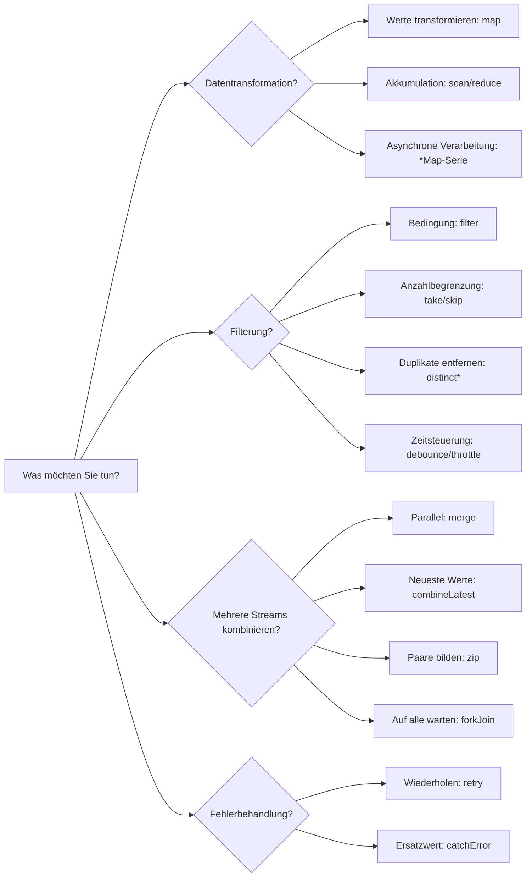
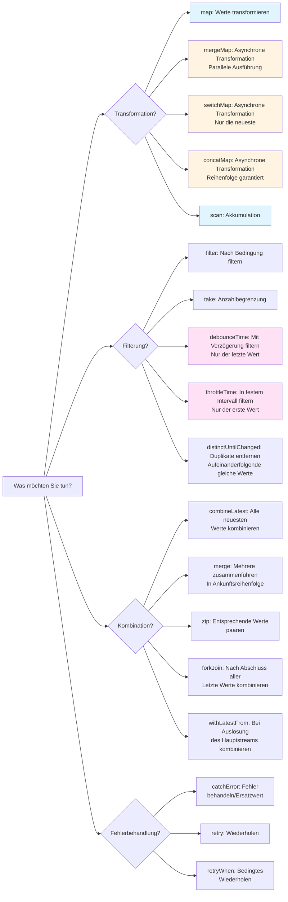
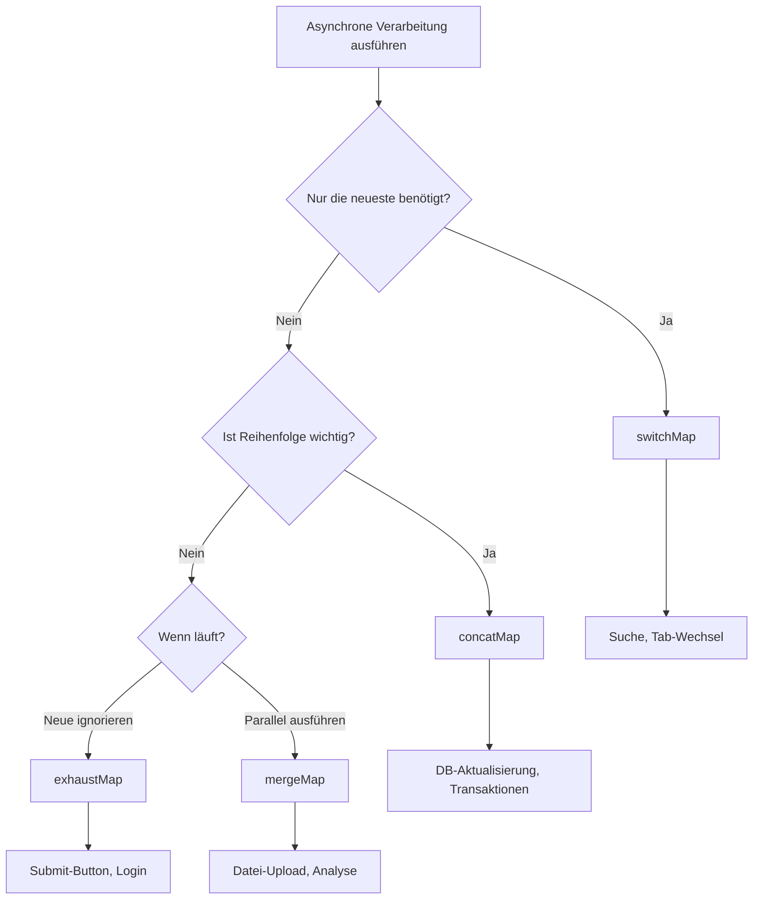

<style scoped>
.comparison-cards {
  display: grid;
  grid-template-columns: 1fr 1fr;
  gap: 1rem;
  margin-bottom: 2rem;
}

@media (max-width: 768px) {
  .comparison-cards {
    grid-template-columns: 1fr;
  }
}

/* Titel-Schriftgröße größer */
.comparison-cards .tip .custom-block-title {
  font-size: 1.1rem;
  font-weight: 600;
}
</style>

# Schwierigkeiten bei der Operator-Auswahl

RxJS verfügt über mehr als 100 Operatoren, und **die Entscheidung, welcher verwendet werden soll**, ist eine Herausforderung, die jeder erlebt. Diese Seite bietet praktische Auswahlkriterien und Flussdiagramme.

## Kriterien für die Auswahl aus über 100 Operatoren

### Problem: Zu viele Optionen

```typescript
// Möchte ein Array transformieren... map? scan? reduce? toArray?
// Möchte mehrere APIs aufrufen... mergeMap? switchMap? concatMap? exhaustMap?
// Möchte Werte filtern... filter? take? first? distinctUntilChanged?
// Möchte mehrere Streams kombinieren... merge? combineLatest? zip? forkJoin?
```

### Lösung: Nach Kategorie + Zweck eingrenzen



### Detaillierteres Auswahlflussdiagramm

Das folgende Flussdiagramm zeigt die Schritte zur Auswahl eines Operators basierend auf spezifischen Zielen.



## 1. Transformations-Operatoren (Transformation)

**Wann verwenden?** Wenn Sie Datenformen ändern oder asynchrone Verarbeitungen aufrufen möchten

| Operator | Verwendungszweck | Häufige Anwendungsfälle |
|---|---|---|
| **map** | Werte 1:1 transformieren | Eigenschaften abrufen, Berechnungen, Typkonvertierung |
| **scan** | Akkumulation (Zwischenwerte ausgeben) | Zähler, Summen, Verlauf |
| **reduce** | Akkumulation (nur Endwert) | Array-Summe, Maximalwert |
| **mergeMap** | Asynchrone Verarbeitung parallel ausführen | Mehrere APIs parallel aufrufen |
| **switchMap** | Asynchrone Verarbeitung wechseln | Such-API (nur die neueste) |
| **concatMap** | Asynchrone Verarbeitung sequentiell ausführen | Wenn Reihenfolge wichtig ist |
| **exhaustMap** | Neue Verarbeitung ignorieren während Ausführung | Doppelklick-Schutz (Submit-Button) |

### Praktische Beispiele: Auswahl nach Anwendungsfall

#### Anwendungsfall 1: Eigenschaft abrufen
```typescript
import { of } from 'rxjs';
import { map } from 'rxjs';

interface User { id: number; name: string; }

of({ id: 1, name: 'Alice' }).pipe(
  map(user => user.name) // Werte 1:1 transformieren → map
).subscribe(name => console.log(name)); // 'Alice'
```

#### Anwendungsfall 2: Zähler
```typescript
import { fromEvent } from 'rxjs';
import { scan } from 'rxjs';

const button = document.querySelector('button')!;

fromEvent(button, 'click').pipe(
  scan(count => count + 1, 0) // Akkumulation → scan
).subscribe(count => console.log(`Klickanzahl: ${count}`));
```

#### Anwendungsfall 3: Such-API-Aufruf
```typescript
import { fromEvent } from 'rxjs';
import { debounceTime, map, switchMap } from 'rxjs';

const searchInput = document.querySelector('input')!;

fromEvent(searchInput, 'input').pipe(
  debounceTime(300),
  map(e => (e.target as HTMLInputElement).value),
  switchMap(query => searchAPI(query)) // Nur die neueste → switchMap
).subscribe(results => console.log(results));
```

## 2. Filter-Operatoren (Filtering)

### Wann verwenden?
Wenn Sie Werte auswählen oder das Timing steuern möchten

| Operator | Verwendungszweck | Häufige Anwendungsfälle |
|---|---|---|
| **filter** | Nur Werte mit Bedingung durchlassen | Nur gerade Zahlen, nur Nicht-Null-Werte |
| **take** | Nur die ersten N | Erste 5 Elemente abrufen |
| **first** | Nur das erste | Ersten Wert abrufen |
| **distinctUntilChanged** | Nur Werte verschieden vom vorherigen | Duplikate entfernen |
| **debounceTime** | Nach bestimmter Zeit auslösen | Sucheingabe (nach Eingabeabschluss) |
| **throttleTime** | In festem Intervall ausdünnen | Scroll-Ereignisse |

### Praktische Beispiele: Auswahl nach Anwendungsfall

#### Anwendungsfall 1: Nur gerade Zahlen abrufen
```typescript
import { of } from 'rxjs';
import { filter } from 'rxjs';

of(1, 2, 3, 4, 5).pipe(
  filter(n => n % 2 === 0) // Nur Werte mit Bedingung → filter
).subscribe(console.log); // 2, 4
```

#### Anwendungsfall 2: Sucheingabe optimieren
```typescript
import { fromEvent } from 'rxjs';
import { debounceTime, distinctUntilChanged, map } from 'rxjs';

const input = document.querySelector('input')!;

fromEvent(input, 'input').pipe(
  debounceTime(300),              // Auf Eingabeabschluss warten → debounceTime
  map(e => (e.target as HTMLInputElement).value),
  distinctUntilChanged()          // Duplikate entfernen → distinctUntilChanged
).subscribe(query => console.log('Suche:', query));
```

#### Anwendungsfall 3: Scroll-Ereignisse ausdünnen
```typescript
import { fromEvent } from 'rxjs';
import { throttleTime } from 'rxjs';

fromEvent(window, 'scroll').pipe(
  throttleTime(200) // Nur einmal alle 200ms → throttleTime
).subscribe(() => console.log('Scroll-Position:', window.scrollY));
```

## 3. Kombinations-Operatoren (Combination)

### Wann verwenden?
Wenn Sie mehrere Streams kombinieren möchten

| Operator | Verwendungszweck | Häufige Anwendungsfälle |
|---|---|---|
| **merge** | Mehrere Streams parallel | Mehrere Ereignisse überwachen |
| **combineLatest** | Alle neuesten Werte kombinieren | Formularvalidierung |
| **zip** | Entsprechende Werte paaren | 2 API-Ergebnisse zuordnen |
| **forkJoin** | Nach Abschluss aller Ergebnisse als Array | Mehrere APIs parallel ausführen |
| **withLatestFrom** | Hauptstream + Hilfswert | Ereignis + aktueller Status |

### Praktische Beispiele: Auswahl nach Anwendungsfall

#### Anwendungsfall 1: Mehrere Ereignisse überwachen
```typescript
import { fromEvent, merge } from 'rxjs';

const clicks$ = fromEvent(document, 'click');
const keypresses$ = fromEvent(document, 'keypress');

merge(clicks$, keypresses$).pipe() // Parallel überwachen → merge
  .subscribe(() => console.log('Irgendein Ereignis aufgetreten'));
```

#### Anwendungsfall 2: Formularvalidierung
```typescript
import { combineLatest } from 'rxjs';
import { map } from 'rxjs';

const email$ = getFormControl('email');
const password$ = getFormControl('password');

combineLatest([email$, password$]).pipe( // Alle neuesten Werte → combineLatest
  map(([email, password]) => email.length > 0 && password.length > 7)
).subscribe(isValid => console.log('Formular gültig:', isValid));
```

#### Anwendungsfall 3: Mehrere APIs parallel ausführen
```typescript
import { forkJoin } from 'rxjs';

forkJoin({
  user: getUserAPI(),
  posts: getPostsAPI(),
  comments: getCommentsAPI()
}).subscribe(({ user, posts, comments }) => { // Auf Abschluss aller warten → forkJoin
  console.log('Alle Daten abgerufen', { user, posts, comments });
});
```

## Häufig verwendete Top 20 Operatoren

Die folgenden sind die **am häufigsten in der Praxis verwendeten** Operatoren. Lernen Sie zunächst diese 20.

<div class="comparison-cards">

::: tip 🥇 Am häufigsten (erforderlich)
1. **map** - Werte transformieren
2. **filter** - Nach Bedingung filtern
3. **switchMap** - Suche usw., nur die neueste benötigt
4. **tap** - Debugging, Seiteneffekte
5. **take** - Erste N
6. **first** - Erstes Element
7. **catchError** - Fehlerbehandlung
8. **takeUntil** - Abmeldung
:::

::: tip 🥈 Häufig (oft verwendet)
9. **mergeMap** - Parallele asynchrone Verarbeitung
10. **debounceTime** - Auf Eingabeabschluss warten
11. **distinctUntilChanged** - Duplikate entfernen
12. **combineLatest** - Mehrere Werte kombinieren
13. **startWith** - Anfangswert setzen
14. **scan** - Akkumulation
15. **shareReplay** - Ergebnisse zwischenspeichern
:::

::: tip 🥉 Oft verwendet (sollte bekannt sein)
16. **concatMap** - Sequentielle Verarbeitung
17. **throttleTime** - Ereignisse ausdünnen
18. **withLatestFrom** - Hilfswerte abrufen
19. **forkJoin** - Mehrere APIs warten
20. **retry** - Wiederholungsverarbeitung
:::

</div>


## switchMap vs mergeMap vs concatMap vs exhaustMap

Diese vier sind die **am häufigsten verwechselten** Operatoren. Verstehen Sie die Unterschiede klar.

### Vergleichstabelle

| Operator | Ausführungsweise | Vorherige Verarbeitung | Neue Verarbeitung | Verwendungszweck |
|---|---|---|---|---|
| **switchMap** | Wechseln | **Abbrechen** | Sofort starten | Suche, Autovervollständigung |
| **mergeMap** | Parallel ausführen | Fortsetzen | Sofort starten | Datei-Upload, Analyse |
| **concatMap** | Sequentiell ausführen | Auf Abschluss warten | **Nach Warten** starten | Wenn Reihenfolge wichtig ist |
| **exhaustMap** | Während Ausführung ignorieren | Fortsetzen | **Ignorieren** | Doppelklick-Schutz |

### Vergleich mit Marble-Diagramm

```
Äußeres: ----A----B----C----|

Inneres: A → --1--2|
      B → --3--4|
      C → --5--6|

switchMap:  ----1--3--5--6|  (A wird vor 2 abgebrochen, B wird vor 4 abgebrochen)
mergeMap:   ----1-23-45-6|   (Alle parallel ausgeführt)
concatMap:  ----1--2--3--4--5--6|  (Sequentiell ausgeführt)
exhaustMap: ----1--2|            (B, C werden ignoriert)
```

### Praktisches Beispiel: Unterschiede bei derselben Verarbeitung

**Situation**: Bei jedem Buttonklick wird eine API aufgerufen (dauert 1 Sekunde). Benutzer klickt alle 0,5 Sekunden.

#### switchMap - Optimal für Suche

```typescript
import { fromEvent } from 'rxjs';
import { switchMap } from 'rxjs';

fromEvent(button, 'click').pipe(
  switchMap(() => searchAPI()) // Nur die neueste ausführen, alte Anfragen abbrechen
).subscribe(result => console.log(result));

// 0.0s: Klick1 → API1 startet
// 0.5s: Klick2 → API1 abbrechen, API2 startet
// 1.0s: Klick3 → API2 abbrechen, API3 startet
// 2.0s: API3 abgeschlossen → Ergebnis anzeigen (nur API3)
```

::: tip 💡 Verwendungszweck
- **Suche/Autovervollständigung**: Nur der neueste Eingabewert ist erforderlich
- **Tab-Wechsel**: Nur Daten des angezeigten Tabs benötigt
- **Paginierung**: Nur die neueste Seite anzeigen
:::

#### mergeMap - Optimal für parallele Verarbeitung

```typescript
import { fromEvent } from 'rxjs';
import { mergeMap } from 'rxjs';

fromEvent(button, 'click').pipe(
  mergeMap(() => uploadFileAPI()) // Alle parallel ausführen
).subscribe(result => console.log(result));

// 0.0s: Klick1 → API1 startet
// 0.5s: Klick2 → API2 startet (API1 läuft weiter)
// 1.0s: Klick3 → API3 startet (API1, API2 laufen weiter)
// 1.0s: API1 abgeschlossen → Ergebnis anzeigen
// 1.5s: API2 abgeschlossen → Ergebnis anzeigen
// 2.0s: API3 abgeschlossen → Ergebnis anzeigen
```

::: tip 💡 Verwendungszweck
- **Datei-Upload**: Mehrere Dateien gleichzeitig hochladen
- **Analyse/Protokoll-Versand**: Unabhängige Verarbeitung parallel ausführen
- **Benachrichtigungssystem**: Mehrere Benachrichtigungen gleichzeitig verarbeiten
:::

#### concatMap - Optimal wenn Reihenfolge wichtig ist

```typescript
import { fromEvent } from 'rxjs';
import { concatMap } from 'rxjs';

fromEvent(button, 'click').pipe(
  concatMap(() => updateDatabaseAPI()) // Sequentiell ausführen (auf Abschluss des vorherigen warten)
).subscribe(result => console.log(result));

// 0.0s: Klick1 → API1 startet
// 0.5s: Klick2 → Warten (zur Warteschlange hinzufügen)
// 1.0s: Klick3 → Warten (zur Warteschlange hinzufügen)
// 1.0s: API1 abgeschlossen → Ergebnis anzeigen, API2 startet
// 2.0s: API2 abgeschlossen → Ergebnis anzeigen, API3 startet
// 3.0s: API3 abgeschlossen → Ergebnis anzeigen
```

::: tip 💡 Verwendungszweck
- **Datenbank-Aktualisierung**: Schreibvorgänge bei denen Reihenfolge wichtig ist
- **Transaktionen**: Wenn das Ergebnis der vorherigen Verarbeitung für die nächste verwendet wird
- **Animationen**: Wenn Verarbeitung in Reihenfolge ausgeführt werden soll
:::

#### exhaustMap - Optimal für Doppelklick-Schutz

```typescript
import { fromEvent } from 'rxjs';
import { exhaustMap } from 'rxjs';

fromEvent(button, 'click').pipe(
  exhaustMap(() => submitFormAPI()) // Neue Anfragen während Ausführung ignorieren
).subscribe(result => console.log(result));

// 0.0s: Klick1 → API1 startet
// 0.5s: Klick2 → Ignoriert (API1 läuft)
// 1.0s: Klick3 → Ignoriert (API1 läuft)
// 1.0s: API1 abgeschlossen → Ergebnis anzeigen
// 1.5s: Klick4 → API4 startet (vorheriges abgeschlossen)
```

::: tip 💡 Verwendungszweck
- **Submit-Button**: Doppelte Übermittlung verhindern
- **Login-Verarbeitung**: Fehler durch Doppelklick verhindern
- **Zahlungsverarbeitung**: Mehrfachausführung verhindern
:::

### Auswahlflussdiagramm



## Praktische Entscheidungskriterien

### Schritt 1: Ziel klar definieren

```typescript
// ❌ Schlechtes Beispiel: Einfach mergeMap verwenden
observable$.pipe(
  mergeMap(value => someAPI(value))
);

// ✅ Gutes Beispiel: Ziel definieren dann auswählen
// Ziel: Für Benutzersucheingabe nur neueste Ergebnisse anzeigen
// → Alte Anfragen sollten abgebrochen werden → switchMap
searchInput$.pipe(
  switchMap(query => searchAPI(query))
);
```

### Schritt 2: Performance berücksichtigen

#### Auswahl zwischen debounceTime und throttleTime

```typescript
// Sucheingabe: Nach "Abschluss" der Benutzereingabe ausführen
searchInput$.pipe(
  debounceTime(300), // Wenn 300ms keine Eingabe, dann ausführen
  switchMap(query => searchAPI(query))
);

// Scrollen: In festem Intervall ausführen (zu hohe Frequenz verhindern)
scroll$.pipe(
  throttleTime(200), // Nur einmal alle 200ms ausführen
  tap(() => loadMoreItems())
);
```

### Schritt 3: Fehlerbehandlung einbauen

```typescript
import { of } from 'rxjs';
import { catchError, retry, switchMap } from 'rxjs';

searchInput$.pipe(
  debounceTime(300),
  switchMap(query =>
    searchAPI(query).pipe(
      retry(2),                          // Bis zu 2 Wiederholungen
      catchError(err => {
        console.error('Suchfehler:', err);
        return of([]);                   // Leeres Array zurückgeben
      })
    )
  )
).subscribe(results => console.log(results));
```

### Schritt 4: Speicherlecks verhindern

```typescript
import { Subject } from 'rxjs';
import { switchMap, takeUntil } from 'rxjs';

class SearchComponent {
  private destroy$ = new Subject<void>();

  ngOnInit() {
    searchInput$.pipe(
      debounceTime(300),
      switchMap(query => searchAPI(query)),
      takeUntil(this.destroy$)           // Bei Komponenten-Zerstörung abmelden
    ).subscribe(results => console.log(results));
  }

  ngOnDestroy() {
    this.destroy$.next();
    this.destroy$.complete();
  }
}
```

## Verständnis-Checkliste

Überprüfen Sie, ob Sie die folgenden Fragen beantworten können.

```markdown
## Grundverständnis
- [ ] Operatoren nach Kategorie (Transformation, Filterung, Kombination) klassifizieren
- [ ] Mindestens 10 der Top 20 häufig verwendeten Operatoren erklären
- [ ] Unterschiede zwischen switchMap, mergeMap, concatMap, exhaustMap erklären

## Praktische Auswahl
- [ ] Geeignete Operatoren für Suchfunktion auswählen (switchMap + debounceTime)
- [ ] Geeignete Operatoren für parallele API-Aufrufe auswählen (forkJoin oder mergeMap)
- [ ] Geeignete Operatoren für Formularvalidierung auswählen (combineLatest)

## Performance
- [ ] Unterscheidung zwischen debounceTime und throttleTime
- [ ] Optimierungsmethoden für hochfrequente Ereignisse kennen
- [ ] Muster zur Vermeidung von Speicherlecks implementieren

## Fehlerbehandlung
- [ ] catchError und retry kombiniert verwenden
- [ ] Fallback-Verarbeitung bei Fehlern implementieren
- [ ] Fehler an Benutzer zurückmelden
```

## Nächste Schritte

Nach dem Verständnis der Operator-Auswahl lernen Sie **Timing und Reihenfolge**.

→ **Verständnis von Timing und Reihenfolge** (in Vorbereitung) - Wann fließen Werte, Verständnis von synchron vs asynchron

## Verwandte Seiten

- **[Kapitel 4: Verständnis von Operatoren](/de/guide/operators/)** - Details zu allen Operatoren
- **[Kapitel 13: Praktische Muster](/de/guide/)** - Echte Anwendungsfälle (in Vorbereitung)
- **[Kapitel 10: Häufige Fehler und Lösungen](/de/guide/anti-patterns/common-mistakes)** - Anti-Muster unangemessener Operator-Auswahl

## 🎯 Übungsaufgaben

### Aufgabe 1: Geeigneten Operator auswählen

Wählen Sie den optimalen Operator für die folgenden Szenarien.

1. Benutzer gibt in Suchfeld ein → API-Aufruf
2. Button-Klick zum Hochladen mehrerer Dateien
3. Überprüfen ob alle Formularfelder gültig sind
4. Doppelklick auf Submit-Button verhindern

<details>
<summary>Lösungsbeispiel</summary>

**1. Suchfeld → API-Aufruf**
```typescript
searchInput$.pipe(
  debounceTime(300),      // Auf Eingabeabschluss warten
  distinctUntilChanged(), // Duplikate entfernen
  switchMap(query => searchAPI(query)) // Nur die neueste
).subscribe(results => displayResults(results));
```
> [!NOTE]Grund
> Bei Suche ist nur das neueste Ergebnis erforderlich, daher `switchMap`. Auf Eingabeabschluss warten mit `debounceTime`.

---

**2. Mehrere Dateien hochladen**
```typescript
fromEvent(uploadButton, 'click').pipe(
  mergeMap(() => {
    const files = getSelectedFiles();
    return forkJoin(files.map(file => uploadFileAPI(file)));
  })
).subscribe(results => console.log('Alle Dateien hochgeladen', results));
```
> [!NOTE]Grund
> Mehrere Dateien parallel hochladen, daher `forkJoin`. Auch `mergeMap` für unabhängige Verarbeitung möglich.

---

**3. Gültigkeit aller Formularfelder prüfen**
```typescript
combineLatest([
  emailField$,
  passwordField$,
  agreeTerms$
]).pipe(
  map(([email, password, agreed]) =>
    email.valid && password.valid && agreed
  )
).subscribe(isValid => submitButton.disabled = !isValid);
```

> [!NOTE]Grund
> Neueste Werte aller Felder kombinieren, daher `combineLatest`.

---

**4. Doppelklick auf Submit-Button verhindern**
```typescript
fromEvent(submitButton, 'click').pipe(
  exhaustMap(() => submitFormAPI())
).subscribe(result => console.log('Übermittlung abgeschlossen', result));
```
> [!NOTE]Grund
> Laufende Verarbeitung schützen und neue Klicks ignorieren, daher `exhaustMap`.

</details>

### Aufgabe 2: switchMap und mergeMap Auswahl

Der folgende Code verwendet `mergeMap`, hat aber ein Problem. Korrigieren Sie es.

```typescript
searchInput$.pipe(
  debounceTime(300),
  mergeMap(query => searchAPI(query))
).subscribe(results => displayResults(results));
```

<details>
<summary>Lösungsbeispiel</summary>

```typescript
searchInput$.pipe(
  debounceTime(300),
  switchMap(query => searchAPI(query)) // mergeMap → switchMap
).subscribe(results => displayResults(results));
```

> [!IMPORTANT] Problem
> - Mit `mergeMap` werden alle Suchanfragen parallel ausgeführt
> - Wenn Benutzer "a"→"ab"→"abc" eingibt, werden alle 3 Anfragen ausgeführt
> - Alte Anfragen ("a" Ergebnisse) können später zurückkommen und neueste Ergebnisse überschreiben

> [!NOTE] Korrekturgrund
> - Mit `switchMap` werden alte Anfragen abgebrochen wenn neue Suche startet
> - Nur die neuesten Suchergebnisse werden angezeigt

</details>

### Aufgabe 3: Praktisches Szenario

Schreiben Sie Code der die folgenden Anforderungen erfüllt.

> [!NOTE] Anforderungen
> - Benutzer klickt auf Button
> - 3 APIs parallel abrufen (Benutzerinfo, Posts-Liste, Kommentare-Liste)
> - Nach Abschluss aller Daten anzeigen
> - Bei Fehler leere Daten zurückgeben
> - Bei Komponenten-Zerstörung Abonnement beenden

<details>
<summary>Lösungsbeispiel</summary>

```typescript
import { fromEvent, forkJoin, of, Subject } from 'rxjs';
import { switchMap, catchError, takeUntil } from 'rxjs';

class DataComponent {
  private destroy$ = new Subject<void>();
  private button = document.querySelector('button')!;

  ngOnInit() {
    fromEvent(this.button, 'click').pipe(
      switchMap(() =>
        forkJoin({
          user: this.getUserAPI().pipe(
            catchError(() => of(null))
          ),
          posts: this.getPostsAPI().pipe(
            catchError(() => of([]))
          ),
          comments: this.getCommentsAPI().pipe(
            catchError(() => of([]))
          )
        })
      ),
      takeUntil(this.destroy$)
    ).subscribe(({ user, posts, comments }) => {
      console.log('Datenabruf abgeschlossen', { user, posts, comments });
    });
  }

  ngOnDestroy() {
    this.destroy$.next();
    this.destroy$.complete();
  }

  private getUserAPI() { /* ... */ }
  private getPostsAPI() { /* ... */ }
  private getCommentsAPI() { /* ... */ }
}
```

> [!NOTE] Punkte
> - `forkJoin` führt 3 APIs parallel aus und wartet auf Abschluss aller
> - Jede API hat `catchError` für Fallback-Wert bei Fehler
> - `switchMap` wechselt bei jedem Button-Klick zu neuer Anfrage
> - `takeUntil` beendet automatisch bei Komponenten-Zerstörung

</details>
