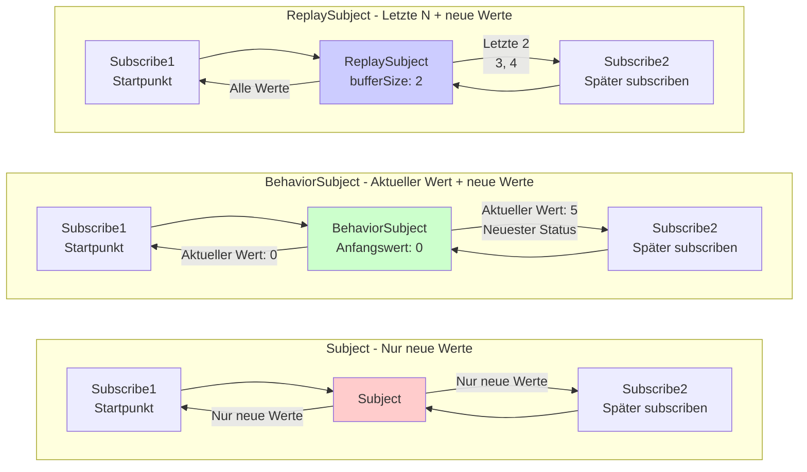

# Schwierigkeiten bei der Zustandsverwaltung

In RxJS sind **"Zustand über mehrere Komponenten teilen"** und **"API-Ergebnisse cachen"** sehr häufige Anforderungen, aber die Wahl der richtigen Methode ist schwierig. Diese Seite erklärt praktische Muster für Zustandsverwaltung und Stream-Sharing.

## Subject vs BehaviorSubject vs ReplaySubject

### Subject-Typen und Eigenschaften

| Subject | Anfangswert | Verhalten bei Subscribe | Häufige Anwendungsfälle |
|---|---|---|---|
| **Subject** | Nein | Nur Werte nach Subscribe empfangen | Event-Bus, Benachrichtigungssysteme |
| **BehaviorSubject** | Erforderlich | Neuesten Wert sofort empfangen | Aktueller Status (Login-Status, ausgewähltes Element) |
| **ReplaySubject** | Nein | Letzte N Werte empfangen | Verlauf, Logs, Aufzeichnung von Operationen |
| **AsyncSubject** | Nein | Nur Endwert bei Abschluss empfangen | Einzelnes asynchrones Ergebnis (selten verwendet) |

### Visualisierung der Subject-Typen und Verhaltensunterschiede

Die folgende Abbildung zeigt welche Werte jedes Subject bei Subscribe empfängt.



> [!TIP] Auswahlkriterien
> - **Subject**: Ereignisbenachrichtigungen (Vergangenheit nicht erforderlich)
> - **BehaviorSubject**: Zustandsverwaltung (aktueller Wert erforderlich)
> - **ReplaySubject**: Verlaufsverwaltung (letzte N erforderlich)

### Praktisches Beispiel 1: Subject (Event-Bus)

#### ❌ Schlechtes Beispiel: Werte vor Subscribe können nicht empfangen werden
```typescript
import { Subject } from 'rxjs';

const notifications$ = new Subject<string>();

notifications$.next('Benachrichtigung1'); // Noch niemand subscribt

notifications$.subscribe(msg => {
  console.log('Empfangen:', msg);
});

notifications$.next('Benachrichtigung2');
notifications$.next('Benachrichtigung3');

// Ausgabe:
// Empfangen: Benachrichtigung2
// Empfangen: Benachrichtigung3
// ('Benachrichtigung1' wird nicht empfangen)
```

#### ✅ Gutes Beispiel: Als Event-Bus verwenden (nur Ereignisse nach Subscribe verarbeiten)
```typescript
import { filter, map, Subject } from 'rxjs';

class EventBus {
  private events$ = new Subject<{ type: string; payload: any }>();

  emit(type: string, payload: any) {
    this.events$.next({ type, payload });
  }

  on(type: string) {
    return this.events$.pipe(
      filter(event => event.type === type),
      map(event => event.payload)
    );
  }
}

const bus = new EventBus();

// Subscribe starten
bus.on('userLogin').subscribe(user => {
  console.log('Login:', user);
});

// Ereignis ausgeben
bus.emit('userLogin', { id: 1, name: 'Alice' }); // ✅ Wird empfangen
// Login: {id: 1, name: 'Alice'}
```

> [!TIP] Verwendungszwecke für Subject
> - **Ereignisgesteuerte Architektur**: Lose gekoppelte Kommunikation zwischen Komponenten
> - **Benachrichtigungssystem**: Echtzeit-Benachrichtigungsverteilung
> - **Wenn Vergangenheit nicht erforderlich**: Wenn nur Ereignisse nach Subscribe verarbeitet werden müssen

### Praktisches Beispiel 2: BehaviorSubject (Zustandsverwaltung)

#### ❌ Schlechtes Beispiel: Mit Subject ist aktueller Status unbekannt
```typescript
import { Subject } from 'rxjs';

const isLoggedIn$ = new Subject<boolean>();

// Benutzer meldet sich an
isLoggedIn$.next(true);

// Später subscribende Komponente
isLoggedIn$.subscribe(status => {
  console.log('Login-Status:', status); // Keine Ausgabe
});
```

#### ✅ Gutes Beispiel: Aktuellen Status sofort mit BehaviorSubject abrufen
```typescript
import { BehaviorSubject } from 'rxjs';

class AuthService {
  private isLoggedIn$ = new BehaviorSubject<boolean>(false); // Anfangswert: false

  login(username: string, password: string) {
    // Login-Verarbeitung...
    this.isLoggedIn$.next(true);
  }

  logout() {
    this.isLoggedIn$.next(false);
  }

  // Nach außen nur lesbar veröffentlichen
  get isLoggedIn() {
    return this.isLoggedIn$.asObservable();
  }

  // Aktuellen Wert synchron abrufen (nur in speziellen Fällen verwenden)
  get currentStatus(): boolean {
    return this.isLoggedIn$.value;
  }
}

const auth = new AuthService();

auth.login('user', 'pass');

// Auch bei späterem Subscribe kann sofort aktueller Status (true) abgerufen werden
auth.isLoggedIn.subscribe(status => {
  console.log('Login-Status:', status); // Login-Status: true
});
```

> [!TIP] Verwendungszwecke für BehaviorSubject
> - **Aktuellen Status speichern**: Login-Status, ausgewähltes Element, Einstellungswerte
> - **Bei Subscribe sofort Wert benötigt**: Wenn aktueller Status für UI-Initialanzeige erforderlich ist
> - **Statusänderungen überwachen**: Wenn reaktive Aktualisierung bei Statusänderung gewünscht ist

### Praktisches Beispiel 3: ReplaySubject (Verlaufsverwaltung)

#### ✅ Gutes Beispiel: Letzte N Werte wiedergeben
```typescript
import { ReplaySubject } from 'rxjs';

class SearchHistoryService {
  // Letzte 5 Suchvorgänge speichern
  private history$ = new ReplaySubject<string>(5);

  addSearch(query: string) {
    this.history$.next(query);
  }

  getHistory() {
    return this.history$.asObservable();
  }
}

const searchHistory = new SearchHistoryService();

// Suche ausführen
searchHistory.addSearch('TypeScript');
searchHistory.addSearch('RxJS');
searchHistory.addSearch('Angular');

// Auch bei späterem Subscribe können sofort letzte 3 abgerufen werden
searchHistory.getHistory().subscribe(query => {
  console.log('Suchverlauf:', query);
});

// Ausgabe:
// Suchverlauf: TypeScript
// Suchverlauf: RxJS
// Suchverlauf: Angular
```

> [!TIP] Verwendungszwecke für ReplaySubject
> - **Operationsverlauf**: Suchverlauf, Bearbeitungsverlauf, Navigationsverlauf
> - **Log/Audit-Trail**: Aufzeichnung vergangener Operationen
> - **Late-Subscribe-Unterstützung**: Wenn auch bei verzögertem Subscribe-Start vergangene Werte empfangen werden sollen

## Verwendungsunterschiede share und shareReplay

### Problem: Doppelte Ausführung von Cold Observable

#### ❌ Schlechtes Beispiel: API wird mehrmals aufgerufen bei mehreren Subscribes
```typescript
import { ajax } from 'rxjs/ajax';

const users$ = ajax.getJSON('/api/users');

// Subscribe 1
users$.subscribe(users => {
  console.log('Komponente A:', users);
});

// Subscribe 2
users$.subscribe(users => {
  console.log('Komponente B:', users);
});

// Problem: API wird 2 Mal aufgerufen
// GET /api/users (1. Mal)
// GET /api/users (2. Mal)
```

#### ✅ Gutes Beispiel: Mit share zu Hot konvertieren (Ausführung teilen)
```typescript
import { ajax } from 'rxjs/ajax';
import { share } from 'rxjs';

const users$ = ajax.getJSON('/api/users').pipe(
  share() // Ausführung teilen
);

// Subscribe 1
users$.subscribe(users => {
  console.log('Komponente A:', users);
});

// Subscribe 2 (wenn sofort subscribt)
users$.subscribe(users => {
  console.log('Komponente B:', users);
});

// ✅ API wird nur 1 Mal aufgerufen
// GET /api/users (nur einmal)
```

> [!WARNING] Fallstricke bei share
> Mit `share()` wird **der Stream zurückgesetzt wenn letztes Subscribe beendet wird**. Beim nächsten Subscribe wird erneut ausgeführt.
>
> ```typescript
> const data$ = fetchData().pipe(share());
>
> // Subscribe 1
> const sub1 = data$.subscribe();
>
> // Subscribe 2
> const sub2 = data$.subscribe();
>
> sub1.unsubscribe();
> sub2.unsubscribe(); // Alle beendet → Reset
>
> // Erneutes Subscribe → fetchData() wird erneut ausgeführt
> data$.subscribe();
> ```

### shareReplay: Ergebnisse cachen und wiederverwenden

#### ✅ Gutes Beispiel: Mit shareReplay cachen
```typescript
import { ajax } from 'rxjs/ajax';
import { shareReplay } from 'rxjs';

const users$ = ajax.getJSON('/api/users').pipe(
  shareReplay({ bufferSize: 1, refCount: true })
  // bufferSize: 1 → Neuesten Wert cachen
  // refCount: true → Cache löschen wenn alle Subscribes beendet
);

// Subscribe 1
users$.subscribe(users => {
  console.log('Komponente A:', users);
});

// 1 Sekunde später Subscribe 2 (auch bei verzögertem Subscribe aus Cache abrufen)
setTimeout(() => {
  users$.subscribe(users => {
    console.log('Komponente B:', users); // Sofort aus Cache abrufen
  });
}, 1000);

// ✅ API wird nur 1 Mal aufgerufen, Ergebnis wird gecacht
```

### Vergleich share vs shareReplay

| Eigenschaft | share() | shareReplay(1) |
|---|---|---|
| **Neues Subscribe während Subscribe** | Selben Stream teilen | Selben Stream teilen |
| **Verzögertes Subscribe** | Nur neue Werte empfangen | Gecachten neuesten Wert empfangen |
| **Nach Beendigung aller Subscribes** | Stream-Reset | Cache beibehalten (bei refCount: false) |
| **Speicher** | Nicht beibehalten | Cache beibehalten |
| **Anwendungsfall** | Echtzeit-Datensharing | API-Ergebnis-Caching |

#### ✅ Gutes Beispiel: Geeignete Einstellung von shareReplay
```typescript
import { shareReplay } from 'rxjs';

// Muster 1: Permanenter Cache (nicht empfohlen)
const data1$ = fetchData().pipe(
  shareReplay({ bufferSize: 1, refCount: false })
  // refCount: false → Achtung Speicherleck
);

// Muster 2: Cache mit automatischer Bereinigung (empfohlen)
const data2$ = fetchData().pipe(
  shareReplay({ bufferSize: 1, refCount: true })
  // refCount: true → Cache wird bei Beendigung aller Subscribes gelöscht
);

// Muster 3: Cache mit TTL (RxJS 7.4+)
const data3$ = fetchData().pipe(
  shareReplay({
    bufferSize: 1,
    refCount: true,
    windowTime: 5000 // Cache nach 5 Sekunden verwerfen
  })
);
```

> [!IMPORTANT] Achtung Speicherleck
> Bei Verwendung von `shareReplay({ refCount: false })` bleibt Cache permanent, was zu Speicherlecks führen kann. Grundsätzlich **refCount: true verwenden**.

## Praktische Verwendungsunterschiede Hot vs Cold

### Cold-Eigenschaften: Ausführung bei jedem Subscribe

```typescript
import { Observable } from 'rxjs';

const cold$ = new Observable<number>(subscriber => {
  console.log('🔵 Ausführung starten');
  subscriber.next(Math.random());
  subscriber.complete();
});

cold$.subscribe(v => console.log('Subscribe 1:', v));
cold$.subscribe(v => console.log('Subscribe 2:', v));

// Ausgabe:
// 🔵 Ausführung starten
// Subscribe 1: 0.123
// 🔵 Ausführung starten
// Subscribe 2: 0.456
// (2 Mal ausgeführt, verschiedene Werte)
```

### Hot-Eigenschaften: Ausführung teilen

```typescript
import { Subject } from 'rxjs';

const hot$ = new Subject<number>();

hot$.subscribe(v => console.log('Subscribe 1:', v));
hot$.subscribe(v => console.log('Subscribe 2:', v));

hot$.next(Math.random());

// Ausgabe:
// Subscribe 1: 0.789
// Subscribe 2: 0.789
// (Selber Wert geteilt)
```

### Verwendungskriterien

| Anforderung | Cold | Hot |
|---|---|---|
| **Unabhängige Ausführung erforderlich** | ✅ | ❌ |
| **Ausführung teilen gewünscht** | ❌ | ✅ |
| **Verschiedene Werte pro Subscriber** | ✅ | ❌ |
| **Echtzeit-Datenverteilung** | ❌ | ✅ |
| **API-Aufruf teilen** | ❌ (mit share konvertieren) | ✅ |

#### ✅ Gutes Beispiel: Geeignete Konvertierung
```typescript
import { interval, fromEvent } from 'rxjs';
import { share, shareReplay } from 'rxjs';

// Cold: Jeder Subscriber hat unabhängigen Timer
const coldTimer$ = interval(1000);

// Cold→Hot: Timer teilen
const hotTimer$ = interval(1000).pipe(share());

// Cold: Click-Ereignis (unabhängige Listener-Registrierung pro Subscribe)
const clicks$ = fromEvent(document, 'click');

// Cold→Hot: API-Ergebnis cachen
const cachedData$ = ajax.getJSON('/api/data').pipe(
  shareReplay({ bufferSize: 1, refCount: true })
);
```

## Muster für zentrale Zustandsverwaltung

### Muster 1: Zustandsverwaltung in Service-Klasse

```typescript
import { BehaviorSubject, Observable } from 'rxjs';
import { map } from 'rxjs';

interface User {
  id: number;
  name: string;
  email: string;
}

class UserStore {
  // Privates BehaviorSubject
  private users$ = new BehaviorSubject<User[]>([]);

  // Öffentliches read-only Observable
  get users(): Observable<User[]> {
    return this.users$.asObservable();
  }

  // Bestimmten Benutzer abrufen
  getUser(id: number): Observable<User | undefined> {
    return this.users.pipe(
      map(users => users.find(u => u.id === id))
    );
  }

  // Status aktualisieren
  addUser(user: User) {
    const currentUsers = this.users$.value;
    this.users$.next([...currentUsers, user]);
  }

  updateUser(id: number, updates: Partial<User>) {
    const currentUsers = this.users$.value;
    const updatedUsers = currentUsers.map(u =>
      u.id === id ? { ...u, ...updates } : u
    );
    this.users$.next(updatedUsers);
  }

  removeUser(id: number) {
    const currentUsers = this.users$.value;
    this.users$.next(currentUsers.filter(u => u.id !== id));
  }
}

// Verwendung
const store = new UserStore();

// Subscribe
store.users.subscribe(users => {
  console.log('Benutzerliste:', users);
});

// Status-Aktualisierung
store.addUser({ id: 1, name: 'Alice', email: 'alice@example.com' });
store.updateUser(1, { name: 'Alice Smith' });
```

### Muster 2: Zustandsverwaltung mit Scan

```typescript
import { Subject } from 'rxjs';
import { scan, startWith } from 'rxjs';

interface State {
  count: number;
  items: string[];
}

type Action =
  | { type: 'INCREMENT' }
  | { type: 'DECREMENT' }
  | { type: 'ADD_ITEM'; payload: string }
  | { type: 'RESET' };

const actions$ = new Subject<Action>();

const initialState: State = {
  count: 0,
  items: []
};

const state$ = actions$.pipe(
  scan((state, action) => {
    switch (action.type) {
      case 'INCREMENT':
        return { ...state, count: state.count + 1 };
      case 'DECREMENT':
        return { ...state, count: state.count - 1 };
      case 'ADD_ITEM':
        return { ...state, items: [...state.items, action.payload] };
      case 'RESET':
        return initialState;
      default:
        return state;
    }
  }, initialState),
  startWith(initialState)
);

// Subscribe
state$.subscribe(state => {
  console.log('Aktueller Status:', state);
});

// Action ausgeben
actions$.next({ type: 'INCREMENT' });
actions$.next({ type: 'ADD_ITEM', payload: 'Apfel' });
actions$.next({ type: 'INCREMENT' });

// Ausgabe:
// Aktueller Status: { count: 0, items: [] }
// Aktueller Status: { count: 1, items: [] }
// Aktueller Status: { count: 1, items: ['Apfel'] }
// Aktueller Status: { count: 2, items: ['Apfel'] }
```

## Häufige Fallstricke

### Fallstrick 1: Subject nach außen veröffentlichen

#### ❌ Schlechtes Beispiel: Subject direkt veröffentlichen
```typescript
import { BehaviorSubject } from 'rxjs';

class BadService {
  // ❌ Kann von außen direkt geändert werden
  public state$ = new BehaviorSubject<number>(0);
}

const service = new BadService();

// Von außen beliebig änderbar
service.state$.next(999); // ❌ Kapselung gebrochen
```

#### ✅ Gutes Beispiel: Mit asObservable() schützen
```typescript
import { BehaviorSubject } from 'rxjs';

class GoodService {
  private _state$ = new BehaviorSubject<number>(0);

  // Nur lesbar veröffentlichen
  get state() {
    return this._state$.asObservable();
  }

  // Nur über dedizierte Methoden änderbar
  increment() {
    this._state$.next(this._state$.value + 1);
  }

  decrement() {
    this._state$.next(this._state$.value - 1);
  }
}

const service = new GoodService();

// ✅ Nur Lesen möglich
service.state.subscribe(value => console.log(value));

// ✅ Änderung über dedizierte Methode
service.increment();

// ❌ Direkte Änderung nicht möglich (Compilerfehler)
// service.state.next(999); // Error: Property 'next' does not exist
```

### Fallstrick 2: Speicherleck durch shareReplay

#### ❌ Schlechtes Beispiel: Speicherleck durch refCount: false
```typescript
import { interval } from 'rxjs';
import { shareReplay, take } from 'rxjs';

const data$ = interval(1000).pipe(
  take(100),
  shareReplay({ bufferSize: 1, refCount: false })
  // ❌ refCount: false → Cache bleibt ewig
);

// Auch nach Subscribe und Unsubscribe läuft Stream intern weiter
const sub = data$.subscribe();
sub.unsubscribe();

// Cache bleibt → Speicherleck
```

#### ✅ Gutes Beispiel: Automatische Bereinigung mit refCount: true
```typescript
import { interval } from 'rxjs';
import { shareReplay, take } from 'rxjs';

const data$ = interval(1000).pipe(
  take(100),
  shareReplay({ bufferSize: 1, refCount: true })
  // ✅ refCount: true → Automatische Bereinigung bei Beendigung aller Subscribes
);

const sub1 = data$.subscribe();
const sub2 = data$.subscribe();

sub1.unsubscribe();
sub2.unsubscribe(); // Alle Subscribes beendet → Stream stoppt, Cache gelöscht
```

### Fallstrick 3: Synchroner Wertabruf

#### ❌ Schlechtes Beispiel: Zu sehr auf value verlassen
```typescript
import { BehaviorSubject } from 'rxjs';

class CounterService {
  private count$ = new BehaviorSubject(0);

  increment() {
    // ❌ Zu sehr auf value verlassen
    const current = this.count$.value;
    this.count$.next(current + 1);
  }

  // ❌ Synchronen Abruf veröffentlichen
  getCurrentCount(): number {
    return this.count$.value;
  }
}
```

#### ✅ Gutes Beispiel: Reaktiv bleiben
```typescript
import { BehaviorSubject } from 'rxjs';
import { map } from 'rxjs';

class CounterService {
  private count$ = new BehaviorSubject(0);

  get count() {
    return this.count$.asObservable();
  }

  increment() {
    // ✅ Intern value zu verwenden ist OK
    this.count$.next(this.count$.value + 1);
  }

  // ✅ Als Observable zurückgeben
  isPositive() {
    return this.count$.pipe(
      map(count => count > 0)
    );
  }
}
```

## Verständnis-Checkliste

Überprüfen Sie ob Sie die folgenden Fragen beantworten können.

```markdown
## Grundverständnis
- [ ] Unterschiede zwischen Subject, BehaviorSubject, ReplaySubject erklären
- [ ] Grund warum BehaviorSubject Anfangswert benötigt verstehen
- [ ] Bedeutung von bufferSize bei ReplaySubject verstehen

## Hot/Cold
- [ ] Unterschied zwischen Cold und Hot Observable erklären
- [ ] Unterschied zwischen share und shareReplay erklären
- [ ] Rolle der refCount-Option bei shareReplay verstehen

## Zustandsverwaltung
- [ ] Subject nicht nach außen veröffentlichen, mit asObservable() schützen
- [ ] Zustandsverwaltungsmuster mit BehaviorSubject implementieren
- [ ] Zustandsverwaltungsmuster mit scan verstehen

## Speicherverwaltung
- [ ] Methoden zur Vermeidung von Speicherlecks durch shareReplay kennen
- [ ] Unterschied zwischen refCount: true und false erklären
- [ ] Cache zum geeigneten Zeitpunkt löschen können
```

## Nächste Schritte

Nach Verständnis von Zustandsverwaltung und Sharing lernen Sie **Kombination mehrerer Streams**.

→ **[Kombination mehrerer Streams](/de/guide/overcoming-difficulties/stream-combination)** - Verwendungsunterschiede combineLatest, zip, withLatestFrom

## Verwandte Seiten

- **[Kapitel 5: Was ist Subject](/de/guide/subjects/what-is-subject)** - Subject-Grundlagen
- **[Kapitel 5: Subject-Typen](/de/guide/subjects/types-of-subject)** - Details zu BehaviorSubject, ReplaySubject
- **[share()-Operator](/de/guide/operators/multicasting/share)** - Detaillierte Erklärung von share
- **[Missbrauch von shareReplay](/de/guide/anti-patterns/common-mistakes#4-missbrauch-von-sharereplay)** - Häufige Fehler
- **[Cold vs Hot Observable](/de/guide/observables/cold-and-hot-observables)** - Cold/Hot-Details

## 🎯 Übungsaufgaben

### Aufgabe 1: Geeignetes Subject auswählen

Wählen Sie das optimale Subject für die folgenden Szenarien.

1. **Benutzer-Login-Status verwalten** (Anfangsstatus: Ausgeloggt)
2. **Benachrichtigungsnachrichten verteilen** (nur Nachrichten nach Subscribe anzeigen)
3. **Letzte 5 Operationsverläufe speichern** (auch bei verzögertem Subscribe letzte 5 sichtbar)

<details>
<summary>Lösungsbeispiel</summary>

**1. Benutzer-Login-Status**
```typescript
import { BehaviorSubject } from 'rxjs';

class AuthService {
  private isLoggedIn$ = new BehaviorSubject<boolean>(false);

  get loginStatus() {
    return this.isLoggedIn$.asObservable();
  }

  login() {
    this.isLoggedIn$.next(true);
  }

  logout() {
    this.isLoggedIn$.next(false);
  }
}
```

> [!NOTE] Grund
> Bei Subscribe sofort aktueller Status erforderlich, daher ist **BehaviorSubject** optimal.

---

**2. Benachrichtigungsnachrichten-Verteilung**
```typescript
import { Subject } from 'rxjs';

class NotificationService {
  private notifications$ = new Subject<string>();

  get messages() {
    return this.notifications$.asObservable();
  }

  notify(message: string) {
    this.notifications$.next(message);
  }
}
```

> [!NOTE] Grund
> Nur Nachrichten nach Subscribe müssen angezeigt werden, daher reicht **Subject**.

---

**3. Letzte 5 Operationsverläufe**
```typescript
import { ReplaySubject } from 'rxjs';

class HistoryService {
  private actions$ = new ReplaySubject<string>(5); // 5 speichern

  get history() {
    return this.actions$.asObservable();
  }

  addAction(action: string) {
    this.actions$.next(action);
  }
}
```

> [!NOTE] Grund
> Letzte 5 speichern und auch bei verzögertem Subscribe abrufbar machen, daher ist **ReplaySubject(5)** optimal.

</details>

### Aufgabe 2: Auswahl share und shareReplay

Wählen Sie im folgenden Code den geeigneten Operator.

```typescript
import { ajax } from 'rxjs/ajax';

// Szenario 1: Echtzeit-Daten von WebSocket
const realTimeData$ = webSocket('ws://example.com/stream');

// Szenario 2: Benutzerinfo-API-Aufruf (Ergebnis cachen)
const user$ = ajax.getJSON('/api/user/me');

// Was sollte wo verwendet werden?
```

<details>
<summary>Lösungsbeispiel</summary>

**Szenario 1: Echtzeit-Daten von WebSocket**
```typescript
import { share } from 'rxjs';

const realTimeData$ = webSocket('ws://example.com/stream').pipe(
  share() // Echtzeit-Daten benötigen kein Caching
);
```

> [!NOTE] Grund
> Echtzeit-Daten wie WebSocket müssen vergangene Werte nicht cachen, daher **share()** verwenden. Bei verzögertem Subscribe werden neue Daten ab diesem Zeitpunkt empfangen.

---

**Szenario 2: Benutzerinfo-API-Aufruf**
```typescript
import { shareReplay } from 'rxjs';

const user$ = ajax.getJSON('/api/user/me').pipe(
  shareReplay({ bufferSize: 1, refCount: true })
);
```

> [!NOTE] Grund
> API-Ergebnis cachen und über mehrere Komponenten teilen, daher **shareReplay()** verwenden. Mit `refCount: true` Speicherlecks vermeiden.

</details>

### Aufgabe 3: Speicherleck korrigieren

Der folgende Code hat ein Speicherleck. Korrigieren Sie es.

```typescript
import { interval } from 'rxjs';
import { shareReplay } from 'rxjs';

const data$ = interval(1000).pipe(
  shareReplay(1) // Problem: Dies ist gleich shareReplay({ bufferSize: 1, refCount: false })
);

const sub = data$.subscribe(v => console.log(v));
sub.unsubscribe();

// Danach läuft interval weiter → Speicherleck
```

<details>
<summary>Lösungsbeispiel</summary>

**Korrigierter Code:**
```typescript
import { interval } from 'rxjs';
import { shareReplay } from 'rxjs';

const data$ = interval(1000).pipe(
  shareReplay({ bufferSize: 1, refCount: true })
  // refCount: true → Stream stoppt bei Beendigung aller Subscribes
);

const sub = data$.subscribe(v => console.log(v));
sub.unsubscribe(); // Stream wird gestoppt
```

> [!IMPORTANT] Problem
> - `shareReplay(1)` ist Kurzform von `shareReplay({ bufferSize: 1, refCount: false })`
> - Bei `refCount: false` läuft Stream nach Beendigung aller Subscribes weiter
> - interval läuft ewig, führt zu Speicherleck

> [!NOTE] Korrekturgrund
> Mit `refCount: true` stoppt Stream wenn letztes Subscribe beendet wird und Cache wird gelöscht.

</details>

### Aufgabe 4: Zustandsverwaltung implementieren

Implementieren Sie einen TodoStore der die folgenden Anforderungen erfüllt.

> [!NOTE] Anforderungen
> - Todo-Elemente hinzufügen, abschließen, löschen möglich
> - Von außen nur lesbar Todo-Liste abrufen
> - Anzahl abgeschlossener Todos abrufen möglich

<details>
<summary>Lösungsbeispiel</summary>

```typescript
import { BehaviorSubject, Observable } from 'rxjs';
import { map } from 'rxjs';

interface Todo {
  id: number;
  text: string;
  completed: boolean;
}

class TodoStore {
  private todos$ = new BehaviorSubject<Todo[]>([]);
  private nextId = 1;

  // Nur lesbar veröffentlichen
  get todos(): Observable<Todo[]> {
    return this.todos$.asObservable();
  }

  // Anzahl abgeschlossener Todos
  get completedCount(): Observable<number> {
    return this.todos$.pipe(
      map(todos => todos.filter(t => t.completed).length)
    );
  }

  // Todo hinzufügen
  addTodo(text: string) {
    const currentTodos = this.todos$.value;
    const newTodo: Todo = {
      id: this.nextId++,
      text,
      completed: false
    };
    this.todos$.next([...currentTodos, newTodo]);
  }

  // Todo abschließen
  toggleTodo(id: number) {
    const currentTodos = this.todos$.value;
    const updatedTodos = currentTodos.map(todo =>
      todo.id === id ? { ...todo, completed: !todo.completed } : todo
    );
    this.todos$.next(updatedTodos);
  }

  // Todo löschen
  removeTodo(id: number) {
    const currentTodos = this.todos$.value;
    this.todos$.next(currentTodos.filter(todo => todo.id !== id));
  }
}

// Verwendung
const store = new TodoStore();

store.todos.subscribe(todos => {
  console.log('Todo-Liste:', todos);
});

store.completedCount.subscribe(count => {
  console.log('Abgeschlossen:', count);
});

store.addTodo('RxJS lernen');
store.addTodo('Dokumentation lesen');
store.toggleTodo(1);
```

> [!NOTE] Punkte
> - Status mit `BehaviorSubject` speichern
> - Nach außen nur lesbar mit `asObservable()` veröffentlichen
> - Mit `value` aktuellen Status abrufen und aktualisieren
> - Abgeleiteten Status (completedCount) mit `map` berechnen

</details>
