# Kombination mehrerer Streams

In RxJS sind **"2 API-Ergebnisse kombinieren"** und **"alle Formularfelder überwachen"** sehr häufige Anforderungen, aber die Wahl des richtigen Operators ist schwierig. Diese Seite erklärt praktische Muster für die Kombination mehrerer Streams.

## combineLatest vs zip vs withLatestFrom vs forkJoin

### Vergleich der 4 Hauptkombinations-Operatoren

| Operator | Auslösezeitpunkt | Kombinationsmethode | Abschlussbedingung | Häufige Anwendungsfälle |
|---|---|---|---|---|
| **combineLatest** | Bei jeder Änderung | Neuester Wert jedes Streams | Wenn alle Streams abgeschlossen | Formularvalidierung, Einstellungskombinationen |
| **zip** | Wenn alle Streams Wert ausgeben | Werte an entsprechender Position paaren | Wenn einer abgeschlossen | Paginierung, Parallelverarbeitungssynchronisation |
| **withLatestFrom** | Bei Änderung des Hauptstreams | Hauptstream + neuester Hilfswert | Wenn Hauptstream abgeschlossen | Ereignis + aktueller Status |
| **forkJoin** | Wenn alle Streams abgeschlossen | Endwert jedes Streams | Wenn alle Streams abgeschlossen | Mehrere APIs parallel aufrufen |

### Vergleich mit Marble-Diagramm

```
A:  --1--2--------3----|
B:  ----a----b------c----|

combineLatest(A, B):
    ----[1,a]-[2,a]-[2,b]-[3,b]-[3,c]|
    (Auslösung bei jeder Änderung)

zip(A, B):
    ----[1,a]----[2,b]----[3,c]|
    (Paarung an entsprechender Position)

A.pipe(withLatestFrom(B)):
    ----[1,a]----[2,b]----[3,c]|
    (Nur bei A-Änderung auslösen)

forkJoin({ a: A, b: B }):
    ---------------------------{ a: 3, b: c }|
    (Nach Abschluss beider auslösen)
```

### Visualisierung des Auslösezeitpunkts

Die folgende Abbildung zeigt wann jeder Kombinations-Operator Werte auslöst.

```mermaid
sequenceDiagram
    participant A as Stream A
    participant B as Stream B
    participant CL as combineLatest
    participant Z as zip
    participant WL as withLatestFrom
    participant FJ as forkJoin

    Note over A,FJ: Zeitverlauf →

    A->>A: Wert1 ausgeben
    Note over CL: Noch kein Auslösen<br/>(B noch nicht ausgegeben)

    B->>B: Wert a ausgeben
    A->>CL: [1, a]
    Note over Z: Noch kein Auslösen<br/>(Warten auf nächsten A-Wert)
    Note over FJ: Noch kein Auslösen<br/>(Nicht abgeschlossen)

    A->>A: Wert2 ausgeben
    A->>CL: [2, a]
    A->>WL: [2, a]
    Note over Z: Warten auf Paarung

    B->>B: Wert b ausgeben
    B->>CL: [2, b]
    A->>Z: [1, a], [2, b]
    Note over FJ: Noch kein Auslösen<br/>(Nicht abgeschlossen)

    A->>A: Wert3 ausgeben
    A->>CL: [3, b]
    A->>WL: [3, b]

    B->>B: Wert c ausgeben
    B->>CL: [3, c]
    A->>Z: [3, c]

    Note over A: Abgeschlossen
    Note over B: Abgeschlossen
    B->>FJ: {a: 3, b: c}

    Note right of CL: Auslösung bei jeder<br/>Änderung
    Note right of Z: Auslösung bei Paarung<br/>an Position
    Note right of WL: Nur bei A-Änderung<br/>auslösen
    Note right of FJ: Nach Abschluss beider<br/>1 Mal auslösen
```



> [!TIP] Auswahlkriterien
> - **combineLatest**: Reaktive Kombination von Status (Formular, Einstellungen)
> - **zip**: Paarung entsprechender Werte (Paginierung, Parallelverarbeitung)
> - **withLatestFrom**: Ereignis + aktueller Status (Einstellungen bei Klick abrufen)
> - **forkJoin**: Mehrere asynchrone Verarbeitungen parallel ausführen und alle Ergebnisse abrufen (mehrere APIs)

## combineLatest: Kombination neuester Werte

### Eigenschaften
- **Nachdem alle Streams mindestens 1 Mal Wert ausgegeben haben**, Auslösung bei jeder Änderung
- Kombiniert **neuesten Wert** jedes Streams
- Fortsetzung bis alle Streams abgeschlossen

### Praktisches Beispiel 1: Formularvalidierung

#### ❌ Schlechtes Beispiel: Einzeln subscriben und manuell kombinieren
```typescript
import { BehaviorSubject } from 'rxjs';

const email$ = new BehaviorSubject('');
const password$ = new BehaviorSubject('');
let isValid = false;

email$.subscribe(email => {
  // password$-Wert benötigt, aber nicht abrufbar
  // Verwaltung über globale Variable etc. erforderlich
});

password$.subscribe(password => {
  // Gleiches Problem
});
```

#### ✅ Gutes Beispiel: Automatische Kombination mit combineLatest
```typescript
import { BehaviorSubject, combineLatest } from 'rxjs';
import { map } from 'rxjs';

const email$ = new BehaviorSubject('');
const password$ = new BehaviorSubject('');

const isFormValid$ = combineLatest([email$, password$]).pipe(
  map(([email, password]) => {
    const emailValid = email.includes('@') && email.length > 3;
    const passwordValid = password.length >= 8;
    return emailValid && passwordValid;
  })
);

isFormValid$.subscribe(isValid => {
  console.log('Formular gültig:', isValid);
});

// Wertänderungen
email$.next('user@example.com');  // Formular gültig: false (Passwort zu kurz)
password$.next('pass1234');       // Formular gültig: true
```

### Praktisches Beispiel 2: Kombination mehrerer Einstellungswerte

```typescript
import { BehaviorSubject, combineLatest } from 'rxjs';
import { map } from 'rxjs';

interface Config {
  theme: 'light' | 'dark';
  language: 'ja' | 'en';
  fontSize: number;
}

const theme$ = new BehaviorSubject<'light' | 'dark'>('light');
const language$ = new BehaviorSubject<'ja' | 'en'>('ja');
const fontSize$ = new BehaviorSubject<number>(14);

const config$ = combineLatest([theme$, language$, fontSize$]).pipe(
  map(([theme, language, fontSize]): Config => ({
    theme,
    language,
    fontSize
  }))
);

config$.subscribe(config => {
  console.log('Einstellungen aktualisiert:', config);
  // UI-Aktualisierungsverarbeitung
});

theme$.next('dark');      // Einstellungen aktualisiert: { theme: 'dark', language: 'ja', fontSize: 14 }
fontSize$.next(16);       // Einstellungen aktualisiert: { theme: 'dark', language: 'ja', fontSize: 16 }
```

> [!TIP] Verwendungszwecke für combineLatest
> - **Formularvalidierung**: Neueste Werte aller Felder kombinieren
> - **Einstellungsüberwachung**: Reaktion wenn mehrere Einstellungsitems sich ändern
> - **Abhängige Anzeige**: UI basierend auf mehreren Status aktualisieren
> - **Filterung**: Mehrere Bedingungen kombinieren

## zip: Paarung an entsprechender Position

### Eigenschaften
- **Werte an entsprechender Position** jedes Streams paaren
- Warten bis Werte aus allen Streams vorhanden
- Gesamtabschluss wenn einer der Streams abgeschlossen

### Praktisches Beispiel 1: Daten und Metainformation bei Paginierung paaren

#### ❌ Schlechtes Beispiel: Timing verschoben
```typescript
import { interval } from 'rxjs';
import { map, take } from 'rxjs';

// Seitendaten abrufen (langsam)
const pages$ = interval(1000).pipe(
  map(i => `Daten von Seite${i + 1}`),
  take(3)
);

// Metainformation abrufen (schnell)
const metadata$ = interval(100).pipe(
  map(i => `Metainfo${i + 1}`),
  take(3)
);

// Bei einzelnem Subscribe bricht Zuordnung auseinander
pages$.subscribe(page => console.log('Seite:', page));
metadata$.subscribe(meta => console.log('Meta:', meta));

// Ausgabe:
// Meta: Metainfo1
// Meta: Metainfo2
// Meta: Metainfo3
// Seite: Daten von Seite1
// Seite: Daten von Seite2
// Seite: Daten von Seite3
// (Zuordnung durcheinander)
```

#### ✅ Gutes Beispiel: Mit zip entsprechende Position paaren
```typescript
import { interval, zip } from 'rxjs';
import { map, take } from 'rxjs';

const pages$ = interval(1000).pipe(
  map(i => `Daten von Seite${i + 1}`),
  take(3)
);

const metadata$ = interval(100).pipe(
  map(i => `Metainfo${i + 1}`),
  take(3)
);

zip(pages$, metadata$).subscribe(([page, meta]) => {
  console.log(`${page} - ${meta}`);
});

// Ausgabe (alle 1 Sekunde):
// Daten von Seite1 - Metainfo1
// Daten von Seite2 - Metainfo2
// Daten von Seite3 - Metainfo3
```

### Praktisches Beispiel 2: Ergebnisse paralleler Verarbeitung in Reihenfolge abrufen

```typescript
import { of, zip } from 'rxjs';
import { delay, map } from 'rxjs';

// 3 APIs parallel aufrufen, aber Abschlusszeiten unterschiedlich
const api1$ = of('Ergebnis1').pipe(delay(300));
const api2$ = of('Ergebnis2').pipe(delay(100)); // Am schnellsten
const api3$ = of('Ergebnis3').pipe(delay(200));

zip(api1$, api2$, api3$).pipe(
  map(([r1, r2, r3]) => ({ r1, r2, r3 }))
).subscribe(results => {
  console.log('Alle Ergebnisse:', results);
});

// Ausgabe (nach 300ms, nachdem alle fertig):
// Alle Ergebnisse: { r1: 'Ergebnis1', r2: 'Ergebnis2', r3: 'Ergebnis3' }
```

> [!TIP] Verwendungszwecke für zip
> - **Wenn Reihenfolge wichtig**: 1. mit 1., 2. mit 2. paaren
> - **Daten und Metainformation paaren**: Seitendaten und Seitennummer
> - **Parallelverarbeitungssynchronisation**: Mehrere Verarbeitungen parallel ausführen und Reihenfolge garantieren

> [!WARNING] Vorsicht bei zip
> - Warten auf langsamen Stream, daher kann **Puffer sich aufstauen**
> - Bei unendlichen Streams vom langsamen gezogen werden, kann zu Speicherleck führen

## withLatestFrom: Hauptstream + Hilfswert abrufen

### Eigenschaften
- Auslösung **nur wenn Hauptstream Wert ausgibt**
- **Neuesten Wert** des Hilfsstreams abrufen und kombinieren
- Gesamtabschluss wenn Hauptstream abgeschlossen

### Praktisches Beispiel 1: Klickereignis + aktueller Status

#### ❌ Schlechtes Beispiel: Mit combineLatest unnötige Auslösungen
```typescript
import { fromEvent, BehaviorSubject, combineLatest } from 'rxjs';

const button = document.querySelector('button')!;
const clicks$ = fromEvent(button, 'click');
const counter$ = new BehaviorSubject(0);

// ❌ Mit combineLatest auch bei counter$-Änderung Auslösung
combineLatest([clicks$, counter$]).subscribe(([event, count]) => {
  console.log('Zähler bei Klick:', count);
});

// Bei jeder counter$-Änderung Auslösung
setInterval(() => {
  counter$.next(counter$.value + 1); // Unnötige Auslösung
}, 1000);
```

#### ✅ Gutes Beispiel: Mit withLatestFrom nur bei Klick auslösen
```typescript
import { fromEvent, BehaviorSubject } from 'rxjs';
import { withLatestFrom } from 'rxjs';

const button = document.querySelector('button')!;
const clicks$ = fromEvent(button, 'click');
const counter$ = new BehaviorSubject(0);

clicks$.pipe(
  withLatestFrom(counter$)
).subscribe(([event, count]) => {
  console.log('Zähler bei Klick:', count);
});

// Bei counter$-Änderung keine Auslösung
setInterval(() => {
  counter$.next(counter$.value + 1); // ✅ Keine Auslösung
}, 1000);
```

### Praktisches Beispiel 2: Formularübermittlung + aktuelle Benutzerinfo

```typescript
import { fromEvent, BehaviorSubject } from 'rxjs';
import { withLatestFrom, map } from 'rxjs';

const submitButton = document.querySelector('#submit')!;
const submit$ = fromEvent(submitButton, 'click');

const currentUser$ = new BehaviorSubject({ id: 1, name: 'Alice' });
const formData$ = new BehaviorSubject({ title: '', content: '' });

submit$.pipe(
  withLatestFrom(currentUser$, formData$),
  map(([event, user, data]) => ({
    ...data,
    authorId: user.id,
    authorName: user.name,
    timestamp: Date.now()
  }))
).subscribe(payload => {
  console.log('Übermittlungsdaten:', payload);
  // An API senden...
});
```

> [!TIP] Verwendungszwecke für withLatestFrom
> - **Ereignis + Status**: Aktuellen Status bei Klick abrufen
> - **Hauptverarbeitung + Hilfsdaten**: Benutzerinfo bei Formularübermittlung
> - **Trigger + Einstellung**: Aktuelle Einstellungswerte bei Button-Klick

## forkJoin: Auf Abschluss aller warten

### Eigenschaften
- Warten bis **alle Streams abgeschlossen**
- **Endwert** jedes Streams abrufen
- Entspricht Promises `Promise.all()`

### Praktisches Beispiel 1: Mehrere APIs parallel aufrufen

#### ❌ Schlechtes Beispiel: Sequentielle Ausführung langsam
```typescript
import { ajax } from 'rxjs/ajax';

ajax.getJSON('/api/user').subscribe(user => {
  console.log('Benutzer abgerufen:', user);

  ajax.getJSON('/api/posts').subscribe(posts => {
    console.log('Posts abgerufen:', posts);

    ajax.getJSON('/api/comments').subscribe(comments => {
      console.log('Kommentare abgerufen:', comments);
      // Verschachtelung wird tief
    });
  });
});
```

#### ✅ Gutes Beispiel: Parallele Ausführung mit forkJoin
```typescript
import { forkJoin } from 'rxjs';
import { ajax } from 'rxjs/ajax';

forkJoin({
  user: ajax.getJSON('/api/user'),
  posts: ajax.getJSON('/api/posts'),
  comments: ajax.getJSON('/api/comments')
}).subscribe(({ user, posts, comments }) => {
  console.log('Alle Daten abgerufen:', { user, posts, comments });
  // 3 APIs werden parallel ausgeführt
});
```

### Praktisches Beispiel 2: Mehrere Dateien hochladen

```typescript
import { forkJoin, Observable, of } from 'rxjs';
import { delay } from 'rxjs';

function uploadFile(file: File): Observable<string> {
  return of(`${file.name} Upload abgeschlossen`).pipe(
    delay(Math.random() * 2000)
  );
}

const files = [
  new File([''], 'file1.txt'),
  new File([''], 'file2.txt'),
  new File([''], 'file3.txt')
];

forkJoin(files.map(file => uploadFile(file))).subscribe(results => {
  console.log('Alle Dateien hochgeladen:', results);
  // Nach Abschluss aller Uploads anzeigen
});
```

> [!TIP] Verwendungszwecke für forkJoin
> - **Mehrere APIs parallel aufrufen**: Initialdaten gesammelt abrufen
> - **Batch-Verarbeitung**: Alle mehreren Aufgaben abschließen
> - **Unabhängige Verarbeitungen parallel**: Wenn Verarbeitungen unabhängig sind

> [!WARNING] Vorsicht bei forkJoin
> - **Nicht verwendbar bei nicht abschließenden Streams** (wie interval)
> - Wenn einer fehlschlägt, schlägt gesamtes fehl
> - Zwischenwerte nicht abrufbar (nur Endwerte)

## Auswahlflussdiagramm

```mermaid
graph TD
    A[Mehrere Streams kombinieren] --> B{Wann auslösen?}
    B -->|Bei jeder Änderung| C{Alle Stream-Werte benötigt?}
    C -->|Ja| D[combineLatest]
    C -->|Nein, Hauptstream + Hilfe| E[withLatestFrom]
    B -->|An entsprechender Position paaren| F[zip]
    B -->|Nach Abschluss aller| G{Fehlerbehandlung?}
    G -->|Einzeln verarbeiten| H[Fehlerbehandlung je Observable + forkJoin]
    G -->|Gesamt zusammen| I[forkJoin + catchError]

    D --> D1[Formularvalidierung<br/>Einstellungskombinationen]
    E --> E1[Status bei Klick abrufen<br/>Ereignis+Daten]
    F --> F1[Daten und Metainfo<br/>Reihenfolgegarantie]
    H --> H1[Mehrere APIs parallel<br/>Batch-Verarbeitung]
    I --> I1[Verarbeitung die Fehler nicht toleriert]
```



## Praktische Muster

### Muster 1: Formularvalidierung

```typescript
import { BehaviorSubject, combineLatest } from 'rxjs';
import { map } from 'rxjs';

interface FormState {
  email: string;
  password: string;
  agreeToTerms: boolean;
}

class RegistrationForm {
  private email$ = new BehaviorSubject('');
  private password$ = new BehaviorSubject('');
  private agreeToTerms$ = new BehaviorSubject(false);

  readonly isValid$ = combineLatest([
    this.email$,
    this.password$,
    this.agreeToTerms$
  ]).pipe(
    map(([email, password, agreed]) => {
      const emailValid = /^[^\s@]+@[^\s@]+\.[^\s@]+$/.test(email);
      const passwordValid = password.length >= 8;
      return emailValid && passwordValid && agreed;
    })
  );

  readonly formState$ = combineLatest([
    this.email$,
    this.password$,
    this.agreeToTerms$
  ]).pipe(
    map(([email, password, agreeToTerms]): FormState => ({
      email,
      password,
      agreeToTerms
    }))
  );

  updateEmail(email: string) {
    this.email$.next(email);
  }

  updatePassword(password: string) {
    this.password$.next(password);
  }

  toggleTerms() {
    this.agreeToTerms$.next(!this.agreeToTerms$.value);
  }
}

// Verwendung
const form = new RegistrationForm();

form.isValid$.subscribe(isValid => {
  console.log('Formular gültig:', isValid);
});

form.updateEmail('user@example.com');
form.updatePassword('password123');
form.toggleTerms();
```

### Muster 2: Abhängige API-Aufrufe

```typescript
import { forkJoin, of } from 'rxjs';
import { switchMap, map, catchError } from 'rxjs';
import { ajax } from 'rxjs/ajax';

interface User {
  id: number;
  name: string;
}

interface Post {
  id: number;
  userId: number;
  title: string;
}

interface Comment {
  id: number;
  postId: number;
  text: string;
}

// Benutzerposts und Kommentare parallel abrufen
function getUserData(userId: number) {
  return ajax.getJSON<User>(`/api/users/${userId}`).pipe(
    switchMap(user =>
      forkJoin({
        user: of(user),
        posts: ajax.getJSON<Post[]>(`/api/users/${userId}/posts`),
        comments: ajax.getJSON<Comment[]>(`/api/users/${userId}/comments`)
      })
    ),
    catchError(error => {
      console.error('Fehler:', error);
      return of({
        user: null,
        posts: [],
        comments: []
      });
    })
  );
}

// Verwendung
getUserData(1).subscribe(({ user, posts, comments }) => {
  console.log('Benutzerdaten:', { user, posts, comments });
});
```

### Muster 3: Echtzeit-Filterung

```typescript
import { BehaviorSubject, combineLatest } from 'rxjs';
import { map } from 'rxjs';

interface Product {
  id: number;
  name: string;
  category: string;
  price: number;
}

class ProductFilter {
  private products$ = new BehaviorSubject<Product[]>([
    { id: 1, name: 'Notebook', category: 'electronics', price: 100000 },
    { id: 2, name: 'Maus', category: 'electronics', price: 2000 },
    { id: 3, name: 'Buch', category: 'books', price: 1500 }
  ]);

  private searchQuery$ = new BehaviorSubject('');
  private categoryFilter$ = new BehaviorSubject<string | null>(null);
  private maxPrice$ = new BehaviorSubject<number>(Infinity);

  readonly filteredProducts$ = combineLatest([
    this.products$,
    this.searchQuery$,
    this.categoryFilter$,
    this.maxPrice$
  ]).pipe(
    map(([products, query, category, maxPrice]) => {
      return products.filter(p => {
        const matchesQuery = p.name.toLowerCase().includes(query.toLowerCase());
        const matchesCategory = !category || p.category === category;
        const matchesPrice = p.price <= maxPrice;
        return matchesQuery && matchesCategory && matchesPrice;
      });
    })
  );

  updateSearch(query: string) {
    this.searchQuery$.next(query);
  }

  updateCategory(category: string | null) {
    this.categoryFilter$.next(category);
  }

  updateMaxPrice(price: number) {
    this.maxPrice$.next(price);
  }
}

// Verwendung
const filter = new ProductFilter();

filter.filteredProducts$.subscribe(products => {
  console.log('Gefilterte Produkte:', products);
});

filter.updateSearch('Maus');
filter.updateCategory('electronics');
filter.updateMaxPrice(50000);
```

## Häufige Fallstricke

### Fallstrick 1: Erstauslösung von combineLatest

#### ❌ Schlechtes Beispiel: Streams ohne Anfangswert
```typescript
import { Subject, combineLatest } from 'rxjs';

const a$ = new Subject<number>();
const b$ = new Subject<number>();

combineLatest([a$, b$]).subscribe(([a, b]) => {
  console.log('Werte:', a, b);
});

a$.next(1); // Keine Ausgabe (b$ hat noch keinen Wert ausgegeben)
b$.next(2); // Hier erste Ausgabe: Werte: 1 2
```

#### ✅ Gutes Beispiel: Anfangswert mit BehaviorSubject setzen
```typescript
import { BehaviorSubject, combineLatest } from 'rxjs';

const a$ = new BehaviorSubject<number>(0); // Anfangswert
const b$ = new BehaviorSubject<number>(0);

combineLatest([a$, b$]).subscribe(([a, b]) => {
  console.log('Werte:', a, b);
});

// Ausgabe: Werte: 0 0 (Sofortige Auslösung)

a$.next(1); // Ausgabe: Werte: 1 0
b$.next(2); // Ausgabe: Werte: 1 2
```

### Fallstrick 2: Pufferaufstau bei zip

#### ❌ Schlechtes Beispiel: Puffer staut sich bei langsamem Stream
```typescript
import { interval, zip } from 'rxjs';
import { take } from 'rxjs';

const fast$ = interval(100).pipe(take(100));  // Schnell
const slow$ = interval(1000).pipe(take(10));  // Langsam

zip(fast$, slow$).subscribe(([f, s]) => {
  console.log('Paar:', f, s);
});

// Problem: fast$-Werte stauen sich im Puffer
// Bis slow$ 10 ausgibt, verbraucht fast$ Speicher für 100 Werte
```

#### ✅ Gutes Beispiel: Geschwindigkeit anpassen
```typescript
import { interval, combineLatest } from 'rxjs';
import { take } from 'rxjs';

const fast$ = interval(100).pipe(take(100));
const slow$ = interval(1000).pipe(take(10));

// combineLatest statt zip verwenden
combineLatest([fast$, slow$]).subscribe(([f, s]) => {
  console.log('Neueste Kombination:', f, s);
});

// Oder fast$ mit throttleTime anpassen
```

### Fallstrick 3: forkJoin mit unendlichem Stream

#### ❌ Schlechtes Beispiel: Nicht abschließender Stream
```typescript
import { interval, forkJoin } from 'rxjs';
import { ajax } from 'rxjs/ajax';

forkJoin({
  timer: interval(1000),  // ❌ Schließt nicht ab
  user: ajax.getJSON('/api/user')
}).subscribe(result => {
  console.log(result); // Wird niemals ausgeführt
});
```

#### ✅ Gutes Beispiel: Mit take abschneiden
```typescript
import { interval, forkJoin } from 'rxjs';
import { ajax } from 'rxjs/ajax';
import { take } from 'rxjs';

forkJoin({
  timer: interval(1000).pipe(take(5)), // ✅ Nach 5 abschließen
  user: ajax.getJSON('/api/user')
}).subscribe(result => {
  console.log('Ergebnis:', result); // Nach 5 Sekunden ausgeführt
});
```

## Verständnis-Checkliste

Überprüfen Sie ob Sie die folgenden Fragen beantworten können.

```markdown
## Grundverständnis
- [ ] Unterschiede zwischen combineLatest, zip, withLatestFrom, forkJoin erklären
- [ ] Auslösezeitpunkt jedes Operators verstehen
- [ ] Erklären wann welcher Operator abschließt

## Verwendungsunterschiede
- [ ] Geeigneten Operator für Formularvalidierung auswählen
- [ ] Geeigneten Operator für mehrere parallele API-Aufrufe auswählen
- [ ] Geeigneten Operator für Kombination Ereignis+Status auswählen

## Vorsicht
- [ ] Erstauslösungsbedingung von combineLatest verstehen
- [ ] Problem des Pufferaufstaus bei zip erklären
- [ ] Grund warum forkJoin nicht mit unendlichen Streams verwendet werden kann verstehen

## Praxis
- [ ] Formularvalidierungsmuster implementieren
- [ ] Mehrere parallele API-Aufrufe implementieren
- [ ] Echtzeit-Filterung implementieren
```

## Nächste Schritte

Nach Verständnis der Kombination mehrerer Streams lernen Sie **Debug-Methoden**.

→ **[Debug-Methoden](/de/guide/overcoming-difficulties/debugging-guide)** - Debug-Methoden für komplexe Streams

## Verwandte Seiten

- **[Kapitel 3: combineLatest](/de/guide/creation-functions/combination/combineLatest)** - Details zu combineLatest
- **[Kapitel 3: zip](/de/guide/creation-functions/combination/zip)** - Details zu zip
- **[Kapitel 3: forkJoin](/de/guide/creation-functions/combination/forkJoin)** - Details zu forkJoin
- **[withLatestFrom](/de/guide/operators/combination/withLatestFrom)** - Details zu withLatestFrom
- **[Kapitel 4: Operator-Auswahl](/de/guide/overcoming-difficulties/operator-selection)** - Kriterien für Operator-Auswahl

## 🎯 Übungsaufgaben

### Aufgabe 1: Geeigneten Operator auswählen

Wählen Sie den optimalen Operator für die folgenden Szenarien.

1. **Submit-Button aktivieren wenn Benutzername und E-Mail-Adresse eingegeben**
2. **Aktuellen Warenkorbinhalt bei Button-Klick senden**
3. **3 APIs parallel aufrufen, nach Abschluss aller Daten anzeigen**
4. **Seitennummer und Items pro Seite paaren**

<details>
<summary>Lösungsbeispiel</summary>

**1. Submit-Button aktivieren wenn Benutzername und E-Mail eingegeben**
```typescript
import { BehaviorSubject, combineLatest } from 'rxjs';
import { map } from 'rxjs';

const username$ = new BehaviorSubject('');
const email$ = new BehaviorSubject('');

const isSubmitEnabled$ = combineLatest([username$, email$]).pipe(
  map(([username, email]) => username.length > 0 && email.length > 0)
);

isSubmitEnabled$.subscribe(enabled => {
  console.log('Submit aktiviert:', enabled);
});
```

> [!NOTE] Grund
> Neubewertung bei jeder Änderung erforderlich, daher ist **combineLatest** optimal.

---

**2. Aktuellen Warenkorbinhalt bei Button-Klick senden**
```typescript
import { fromEvent, BehaviorSubject } from 'rxjs';
import { withLatestFrom } from 'rxjs';

const submitButton = document.querySelector('#checkout')!;
const submit$ = fromEvent(submitButton, 'click');
const cart$ = new BehaviorSubject<string[]>([]);

submit$.pipe(
  withLatestFrom(cart$)
).subscribe(([event, cart]) => {
  console.log('Kauf:', cart);
  // An API senden...
});
```

> [!NOTE] Grund
> Nur bei Klick (Hauptstream) auslösen und neuesten Warenkorbwert abrufen, daher ist **withLatestFrom** optimal.

---

**3. 3 APIs parallel aufrufen, nach Abschluss aller Daten anzeigen**
```typescript
import { forkJoin } from 'rxjs';
import { ajax } from 'rxjs/ajax';

forkJoin({
  users: ajax.getJSON('/api/users'),
  products: ajax.getJSON('/api/products'),
  orders: ajax.getJSON('/api/orders')
}).subscribe(({ users, products, orders }) => {
  console.log('Alle Daten abgerufen:', { users, products, orders });
});
```

> [!NOTE] Grund
> Mehrere API-Aufrufe parallel ausführen und auf Abschluss aller warten, daher ist **forkJoin** optimal.

---

**4. Seitennummer und Items pro Seite paaren**
```typescript
import { BehaviorSubject, zip } from 'rxjs';

const pageNumber$ = new BehaviorSubject(1);
const itemsPerPage$ = new BehaviorSubject(10);

zip(pageNumber$, itemsPerPage$).subscribe(([page, items]) => {
  console.log(`Seite${page}: ${items} Items/Seite`);
});

pageNumber$.next(2);
itemsPerPage$.next(20);
```

> [!NOTE] Grund
> Seitennummer und Items an entsprechender Position paaren, daher ist **zip** optimal.

</details>

### Aufgabe 2: Erstauslösung von combineLatest

Wann wird beim folgenden Code der erste Wert ausgegeben?

```typescript
import { Subject, BehaviorSubject, combineLatest } from 'rxjs';

const a$ = new Subject<number>();
const b$ = new BehaviorSubject<number>(0);
const c$ = new Subject<number>();

combineLatest([a$, b$, c$]).subscribe(([a, b, c]) => {
  console.log('Werte:', a, b, c);
});

a$.next(1);
c$.next(3);
```

<details>
<summary>Antwort</summary>

**Antwort: Wenn `c$.next(3);` ausgeführt wird**

Ausgabe: `Werte: 1 0 3`

> [!NOTE] Grund
> `combineLatest` löst aus **nachdem alle Streams mindestens 1 Mal Wert ausgegeben haben**.
> - `a$` ist `Subject` ohne Anfangswert → Wert kommt mit `a$.next(1)`
> - `b$` ist `BehaviorSubject` mit Anfangswert `0` → Hat bereits Wert
> - `c$` ist `Subject` ohne Anfangswert → Wert kommt mit `c$.next(3)`
>
> Erst wenn `c$.next(3)` ausgeführt wird haben alle Streams Werte, daher Auslösung.

</details>

### Aufgabe 3: Unterschied zip und combineLatest

Sagen Sie die Ausgabe für zip und combineLatest im folgenden Marble-Diagramm voraus.

```
A:  --1--2----3----|
B:  ----a----b-----|

Was ist Ausgabe von zip(A, B)?
Was ist Ausgabe von combineLatest(A, B)?
```

<details>
<summary>Antwort</summary>

**Ausgabe von zip(A, B):**
```
----[1,a]----[2,b]-|
```

**Ausgabe von combineLatest(A, B):**
```
----[1,a]-[2,a]-[2,b]-[3,b]|
```

> [!NOTE] Grund
> - **zip**: Paarung an entsprechender Position
>   - 1 und a, 2 und b, 3 hat kein Paar daher Abschluss
> - **combineLatest**: Bei jeder Änderung neueste Kombination ausgeben
>   - a kommt → [1,a]
>   - 2 kommt → [2,a]
>   - b kommt → [2,b]
>   - 3 kommt → [3,b]

</details>

### Aufgabe 4: forkJoin mit Fehlerbehandlung

Schreiben Sie Code für mehrere API-Aufrufe wo auch bei teilweisem Fehler andere Daten abgerufen werden.

<details>
<summary>Lösungsbeispiel</summary>

```typescript
import { forkJoin, of } from 'rxjs';
import { catchError } from 'rxjs';
import { ajax } from 'rxjs/ajax';

forkJoin({
  users: ajax.getJSON('/api/users').pipe(
    catchError(error => {
      console.error('Benutzerabruf fehlgeschlagen:', error);
      return of([]); // Leeres Array zurückgeben
    })
  ),
  products: ajax.getJSON('/api/products').pipe(
    catchError(error => {
      console.error('Produktabruf fehlgeschlagen:', error);
      return of([]);
    })
  ),
  orders: ajax.getJSON('/api/orders').pipe(
    catchError(error => {
      console.error('Bestellabruf fehlgeschlagen:', error);
      return of([]);
    })
  )
}).subscribe(({ users, products, orders }) => {
  console.log('Abgerufene Daten:', { users, products, orders });
  // Fehlgeschlagene APIs werden leeres Array, aber andere Daten werden abgerufen
});
```

> [!IMPORTANT] Punkte
> - `catchError` zu jedem Observable hinzufügen
> - Bei Fehler Standardwert (leeres Array etc.) zurückgeben
> - Dadurch schließt Gesamtes auch bei teilweisem Fehler ab
> - Fehler loggen und Benutzer benachrichtigen auch möglich

</details>
