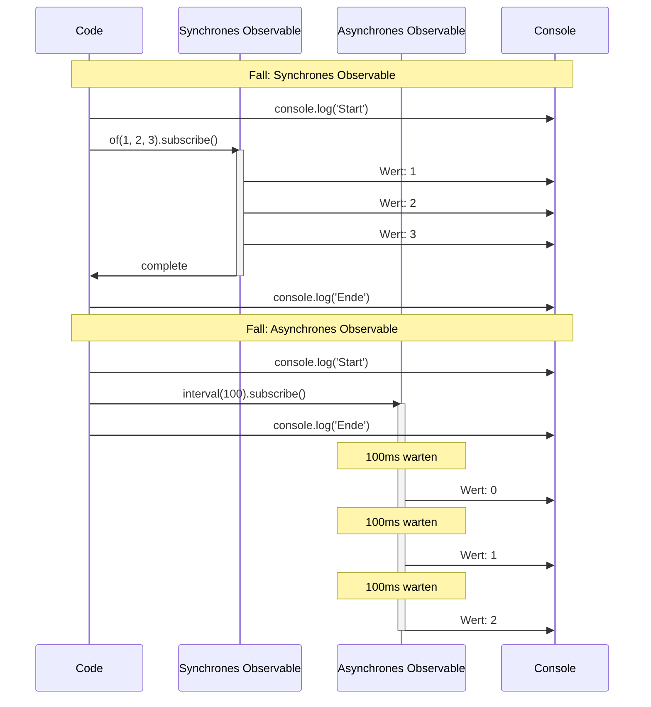
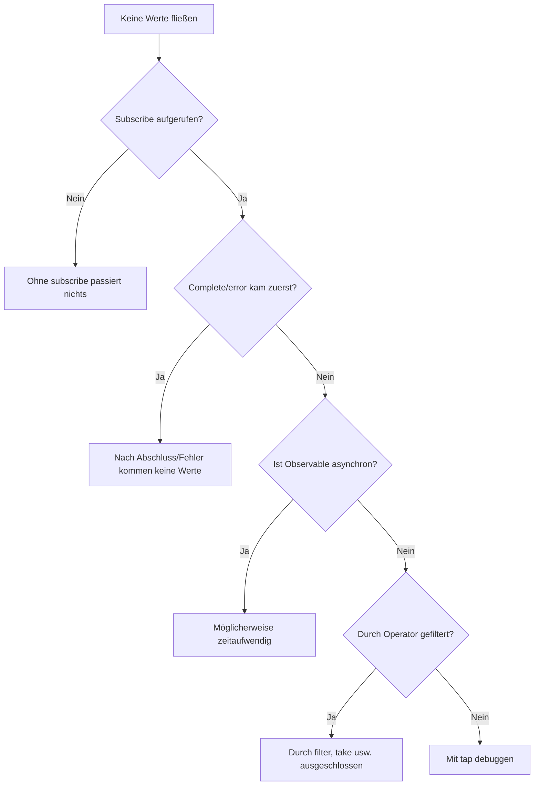

# Verständnis von Timing und Reihenfolge

Bei RxJS sehr häufig auf **"Warum kommen keine Werte?" "Warum ist die Reihenfolge falsch?"** zu stoßen. Diese Seite erklärt die Grundkenntnisse zum korrekten Verständnis von Timing und Reihenfolge sowie praktische Debug-Methoden.

## Wann fließen Werte

### Problem: Annahme dass Werte sofort nach subscribe kommen

Ein häufiges Missverständnis von Anfängern ist "mit subscribe werden Werte sofort abgerufen".

#### ❌ Schlechtes Beispiel: Erwartung dass Werte sofort kommen
```typescript
import { of } from 'rxjs';
import { delay } from 'rxjs';

let result: number | undefined;

of(42).pipe(
  delay(100)
).subscribe(value => {
  result = value;
});

console.log(result); // undefined (Wert ist noch nicht angekommen)
```

#### ✅ Gutes Beispiel: Innerhalb subscribe verarbeiten
```typescript
import { of } from 'rxjs';
import { delay } from 'rxjs';

of(42).pipe(
  delay(100)
).subscribe(value => {
  console.log(value); // Nach 100ms wird 42 ausgegeben
});
```

> [!IMPORTANT] Wichtiges Prinzip
> - Observables sind **möglicherweise asynchron**
> - Verarbeitung die Werte verwendet sollte **innerhalb subscribe** erfolgen
> - Außerhalb subscribe sollten keine Werte erwartet werden

## Verständnis von synchron vs asynchron

### Synchrones Observable vs asynchrones Observable

In RxJS gibt es **Observables die Werte synchron ausgeben** und **Observables die Werte asynchron ausgeben**.

#### Beispiel für synchrones Observable

```typescript
import { of } from 'rxjs';

console.log('Start');

of(1, 2, 3).subscribe(value => {
  console.log('Wert:', value);
});

console.log('Ende');

// Ausgabe:
// Start
// Wert: 1
// Wert: 2
// Wert: 3
// Ende
```

#### Beispiel für asynchrones Observable

```typescript
import { interval } from 'rxjs';
import { take } from 'rxjs';

console.log('Start');

interval(100).pipe(
  take(3)
).subscribe(value => {
  console.log('Wert:', value);
});

console.log('Ende');

// Ausgabe:
// Start
// Ende
// Wert: 0  (nach 100ms)
// Wert: 1  (nach 200ms)
// Wert: 2  (nach 300ms)
```

### Visualisierung des synchronen vs asynchronen Ausführungsablaufs

Das folgende Sequenzdiagramm zeigt den Unterschied im Ausführungstiming zwischen synchronen und asynchronen Observables.



> [!TIP] Timing-Unterschiede
> - **Synchrones Observable**: Geht zur nächsten Zeile nachdem Verarbeitung in subscribe abgeschlossen ist
> - **Asynchrones Observable**: subscribe kehrt sofort zurück, Werte fließen später

### Kriterien für synchron/asynchron

| Observable | Synchron/Asynchron | Grund |
|---|---|---|
| `of(1, 2, 3)` | Synchron | Wert ist sofort bestimmt |
| `from([1, 2, 3])` | Synchron | Kann sofort aus Array abgerufen werden |
| `interval(1000)` | Asynchron | Timer benötigt Zeit |
| `fromEvent(button, 'click')` | Asynchron | Wartet auf Benutzerinteraktion |
| `ajax('/api/data')` | Asynchron | Wartet auf HTTP-Anfrage |
| `timer(1000)` | Asynchron | Auslösung nach 1 Sekunde |
| `of(1).pipe(delay(100))` | Asynchron | Verzögerung durch delay |

### Häufiges Problem: Mischung von synchron und asynchron

#### ❌ Schlechtes Beispiel: Reihenfolge nicht garantiert
```typescript
import { of } from 'rxjs';
import { delay } from 'rxjs';

console.log('1: Start');

of('Synchron').subscribe(value => {
  console.log('2:', value);
});

of('Asynchron').pipe(
  delay(0) // Auch bei 0ms asynchron
).subscribe(value => {
  console.log('3:', value);
});

console.log('4: Ende');

// Ausgabe:
// 1: Start
// 2: Synchron
// 4: Ende
// 3: Asynchron  ← Auch delay(0) geht in asynchrone Warteschlange
```

#### ✅ Gutes Beispiel: Absicht verdeutlichen
```typescript
import { of, concat } from 'rxjs';
import { delay } from 'rxjs';

// Bei gewünschter Reihenfolge concat verwenden
concat(
  of('Erster'),
  of('Nächster').pipe(delay(100)),
  of('Letzter')
).subscribe(value => {
  console.log(value);
});

// Ausgabe:
// Erster
// Nächster  (nach 100ms)
// Letzter   (nach 100ms)
```

## Lesen von Marble-Diagrammen

Marble-Diagramme visualisieren das Verhalten von Observables auf der **Zeitachse**.

### Grundnotation

```
Zeitachse:  ------a----b----c----|
         ↑     ↑    ↑    ↑    ↑
         Start Wert a Wert b Wert c Abschluss

Bedeutung der Symbole:
-  : Zeitverlauf (ca. 10ms)
a  : Werteausgabe (next)
|  : Abschluss (complete)
#  : Fehler (error)
() : Gleichzeitige Ausgabe (a,b)
```

### Praktisches Beispiel 1: map Operator

```
Eingabe:  ----1----2----3----|
       map(x => x * 10)
Ausgabe:  ----10---20---30---|
```

```typescript
import { of } from 'rxjs';
import { map, delay, concatMap } from 'rxjs';

of(1, 2, 3).pipe(
  concatMap(v => of(v).pipe(delay(100))), // Alle 100ms ausgeben
  map(x => x * 10)
).subscribe(value => console.log(value));

// 100ms: 10
// 200ms: 20
// 300ms: 30
```

### Praktisches Beispiel 2: merge

```
A:     ----a----b----|
B:     --c----d----e----|
       merge(A, B)
Ausgabe:  --c-a--d-b--e----|
```

```typescript
import { interval, merge } from 'rxjs';
import { map, take } from 'rxjs';

const a$ = interval(200).pipe(
  map(i => `A${i}`),
  take(2)
);

const b$ = interval(150).pipe(
  map(i => `B${i}`),
  take(3)
);

merge(a$, b$).subscribe(value => console.log(value));

// 150ms: B0
// 200ms: A0
// 300ms: B1
// 400ms: A1
// 450ms: B2
```

### Praktisches Beispiel 3: switchMap (Abbruch)

```
Äußeres:  ----A------B----C----|
       switchMap(x => inneres)
Inneres A: ----1--2|  (Abbruch durch B)
Inneres B:        ----3--4|  (Abbruch durch C)
Inneres C:             ----5--6|
Ausgabe:  ----1------3----5--6|
```

```typescript
import { fromEvent, interval } from 'rxjs';
import { switchMap, map, take } from 'rxjs';

const button = document.querySelector('button')!;

fromEvent(button, 'click').pipe(
  switchMap(() =>
    interval(100).pipe(
      map(i => `Wert${i}`),
      take(3)
    )
  )
).subscribe(value => console.log(value));

// Klick1 → Wert0 → Wert1 → (Klick2 bricht nächsten ab)
// Klick2 → Wert0 → Wert1 → Wert2 → Abschluss
```

## Rolle von Schedulern

Scheduler steuern **wann und wie** ein Observable Werte ausgibt.

### Scheduler-Typen

| Scheduler | Verwendungszweck | Beschreibung |
|---|---|---|
| **queueScheduler** | Synchrone Verarbeitung | Sofortige Ausführung in aktueller Event-Schleife |
| **asapScheduler** | Microtask | Selbes Timing wie Promise.then() |
| **asyncScheduler** | Macrotask | Selbes Timing wie setTimeout() |
| **animationFrameScheduler** | Animation | Selbes Timing wie requestAnimationFrame() |

### Praktisches Beispiel: Timing-Steuerung mit observeOn

#### ❌ Schlechtes Beispiel: UI blockiert durch synchrone Verarbeitung
```typescript
import { range } from 'rxjs';
import { map } from 'rxjs';

console.log('Start');

range(1, 1000000).pipe(
  map(x => x * x)
).subscribe(value => {
  // 1 Million Berechnungen werden synchron ausgeführt → UI friert ein
});

console.log('Ende'); // Wird nach Abschluss der Berechnungen ausgegeben
```

#### ✅ Gutes Beispiel: Asynchron machen mit asyncScheduler
```typescript
import { range, asyncScheduler } from 'rxjs';
import { map, observeOn } from 'rxjs';

console.log('Start');

range(1, 1000000).pipe(
  map(x => x * x),
  observeOn(asyncScheduler) // In asynchrone Warteschlange einreihen
).subscribe(value => {
  // Wird asynchron ausgeführt → UI wird nicht blockiert
});

console.log('Ende'); // Wird sofort ausgegeben
```

> [!TIP] Verwendungszwecke für Scheduler
> - **Schwere Berechnungen**: Mit asyncScheduler asynchron machen um UI nicht zu blockieren
> - **Animationen**: Mit animationFrameScheduler für flüssiges Rendering
> - **Tests**: Mit TestScheduler Zeit virtualisieren

Details siehe **[Kapitel 7: Scheduler-Nutzung](/de/guide/schedulers/async-control)**.

## Häufige Probleme und Debug-Methoden

### Problem 1: Keine Werte fließen

#### Checkliste



#### Debug-Methode: tap verwenden

```typescript
import { of } from 'rxjs';
import { map, filter, tap } from 'rxjs';

console.log('Start');

of(1, 2, 3, 4, 5).pipe(
  tap(v => console.log('👁️ Originalwert:', v)),
  filter(x => x % 2 === 0),
  tap(v => console.log('✅ filter passiert:', v)),
  map(x => x * 10),
  tap(v => console.log('🔄 Nach map-Transformation:', v))
).subscribe(result => {
  console.log('📦 Endergebnis:', result);
});

console.log('Ende');

// Ausgabe:
// Start
// 👁️ Originalwert: 1
// 👁️ Originalwert: 2
// ✅ filter passiert: 2
// 🔄 Nach map-Transformation: 20
// 📦 Endergebnis: 20
// 👁️ Originalwert: 3
// 👁️ Originalwert: 4
// ✅ filter passiert: 4
// 🔄 Nach map-Transformation: 40
// 📦 Endergebnis: 40
// 👁️ Originalwert: 5
// Ende
```

> [!NOTE] Punkt
> Da `of()` ein synchrones Observable ist, wird "Ende" erst nach Abschluss aller Verarbeitungen in subscribe ausgegeben. Durch Einsetzen von tap in jeder Phase kann der Wertefluss verfolgt werden.

### Problem 2: Reihenfolge weicht von Erwartung ab

#### ❌ Schlechtes Beispiel: Reihenfolge durcheinander mit mergeMap
```typescript
import { of } from 'rxjs';
import { mergeMap, delay } from 'rxjs';

of(1, 2, 3).pipe(
  mergeMap(x =>
    of(x * 10).pipe(
      delay(Math.random() * 100) // Zufällige Verzögerung
    )
  )
).subscribe(value => console.log(value));

// Beispielausgabe: 20, 10, 30 (Reihenfolge nicht garantiert)
```

#### ✅ Gutes Beispiel: Reihenfolge garantieren mit concatMap
```typescript
import { of } from 'rxjs';
import { concatMap, delay } from 'rxjs';

of(1, 2, 3).pipe(
  concatMap(x =>
    of(x * 10).pipe(
      delay(Math.random() * 100)
    )
  )
).subscribe(value => console.log(value));

// Ausgabe: 10, 20, 30 (immer diese Reihenfolge)
```

### Problem 3: Endet nicht (unendlicher Stream)

#### ❌ Schlechtes Beispiel: Operator der auf Abschluss wartet hängt
```typescript
import { interval } from 'rxjs';
import { reduce } from 'rxjs';

interval(1000).pipe(
  reduce((acc, val) => acc + val, 0) // Endet niemals
).subscribe(total => {
  console.log(total); // Diese Zeile wird nie ausgeführt
});
```

#### ✅ Gutes Beispiel: Mit take abschneiden
```typescript
import { interval } from 'rxjs';
import { reduce, take } from 'rxjs';

interval(1000).pipe(
  take(5),                            // Nur 5 Stück holen
  reduce((acc, val) => acc + val, 0) // Nach Abschluss summieren
).subscribe(total => {
  console.log('Summe:', total); // Nach 5 Sekunden wird "Summe: 10" ausgegeben
});
```

## Debug-Tools und Techniken

### 1. Log-Ausgabe mit tap

```typescript
import { of } from 'rxjs';
import { map, filter, tap } from 'rxjs';

const debug = <T>(label: string) => tap<T>(value =>
  console.log(`[${label}]`, value)
);

of(1, 2, 3, 4, 5).pipe(
  debug('🔵 Eingabe'),
  filter(x => x > 2),
  debug('🟢 Nach filter'),
  map(x => x * 10),
  debug('🟡 Nach map')
).subscribe();

// [🔵 Eingabe] 1
// [🔵 Eingabe] 2
// [🔵 Eingabe] 3
// [🟢 Nach filter] 3
// [🟡 Nach map] 30
// [🔵 Eingabe] 4
// [🟢 Nach filter] 4
// [🟡 Nach map] 40
// [🔵 Eingabe] 5
// [🟢 Nach filter] 5
// [🟡 Nach map] 50
```

### 2. RxJS DevTools (Browser-Erweiterung)

Chrome/Edge-Erweiterung "RxJS DevTools" ermöglicht folgendes.

- Alle Observables in Echtzeit überwachen
- Visualisierung mit Marble-Diagrammen
- Verfolgung von subscribe/unsubscribe

#### Installationsmethode
1. Im Chrome Web Store nach "RxJS DevTools" suchen
2. Erweiterung hinzufügen
3. "RxJS"-Tab in DevTools öffnen

### 3. Benutzerdefinierter Debug-Operator

```typescript
import { interval, map, take, tap, timestamp } from "rxjs";
import { MonoTypeOperatorFunction } from 'rxjs';


function debugWithTime<T>(label: string): MonoTypeOperatorFunction<T> {
  return source => source.pipe(
    timestamp(),
    tap(({ value, timestamp }) => {
      console.log(`[${label}] ${new Date(timestamp).toISOString()}:`, value);
    }),
    map(({ value }) => value)
  );
}

// Verwendung
interval(500).pipe(
  take(3),
  debugWithTime('⏰ Timer'),
  map(x => x * 10),
  debugWithTime('🔄 Nach Transformation')
).subscribe();

// [⏰ Timer] 2025-10-19T10:20:59.467Z: 0
// [🔄 Nach Transformation] 2025-10-19T10:20:59.467Z: 0
// [⏰ Timer] 2025-10-19T10:20:59.967Z: 1
// [🔄 Nach Transformation] 2025-10-19T10:20:59.967Z: 10
// [⏰ Timer] 2025-10-19T10:21:00.467Z: 2
// [🔄 Nach Transformation] 2025-10-19T10:21:00.468Z: 20
```

### 4. Marble Testing (Verifizierung in Tests)

```typescript
import { TestScheduler } from 'rxjs/testing';
import { map } from 'rxjs';

describe('Timing-Tests', () => {
  let scheduler: TestScheduler;

  beforeEach(() => {
    scheduler = new TestScheduler((actual, expected) => {
      expect(actual).toEqual(expected);
    });
  });

  it('map transformiert Werte', () => {
    scheduler.run(({ cold, expectObservable }) => {
      const input$  = cold('--a--b--c--|', { a: 1, b: 2, c: 3 });
      const expected =     '--x--y--z--|';
      const result$ = input$.pipe(map(v => v * 10));

      expectObservable(result$).toBe(expected, { x: 10, y: 20, z: 30 });
    });
  });
});
```

Details siehe **[Kapitel 9: Marble-Tests](/de/guide/testing/marble-testing)**.

## Verständnis-Checkliste

Überprüfen Sie ob Sie die folgenden Fragen beantworten können.

```markdown
## Grundverständnis
- [ ] Unterschied zwischen synchronen und asynchronen Observables erklären
- [ ] Grundnotation von Marble-Diagrammen (-, a, |, #) lesen
- [ ] Verstehen dass ohne subscribe keine Werte fließen

## Timing-Steuerung
- [ ] Unterschiede zwischen delay, debounceTime, throttleTime erklären
- [ ] Rolle von Scheduler verstehen
- [ ] Unterschied zwischen observeOn und subscribeOn erklären

## Debugging
- [ ] Wertefluss mit tap debuggen
- [ ] Ursachen identifizieren wenn keine Werte fließen
- [ ] Lösungen kennen wenn Reihenfolge von Erwartung abweicht

## Praxis
- [ ] Unendliche Observables mit take abschneiden
- [ ] Reihenfolgeunterschiede zwischen mergeMap und concatMap implementieren
- [ ] Timing bei Fehlern mit catchError steuern
```

## Nächste Schritte

Nach Verständnis von Timing und Reihenfolge lernen Sie **Zustandsverwaltung und Sharing**.

→ **[Schwierigkeiten bei der Zustandsverwaltung](/de/guide/overcoming-difficulties/state-and-sharing)** - Verwendungsunterschiede von Subject, share/shareReplay

## Verwandte Seiten

- **[Kapitel 7: Scheduler-Nutzung](/de/guide/schedulers/async-control)** - Scheduler-Details
- **[Kapitel 9: Marble-Tests](/de/guide/testing/marble-testing)** - Timing testen mit TestScheduler
- **[Kapitel 8: RxJS Debug-Methoden](/de/guide/debugging/)** - Gesamtbild des Debuggings
- **[Schwierigkeiten bei der Operator-Auswahl](/de/guide/overcoming-difficulties/operator-selection)** - Auswahl geeigneter Operatoren

## 🎯 Übungsaufgaben

### Aufgabe 1: Unterscheidung synchron und asynchron

Sind die folgenden Observables synchron oder asynchron?

```typescript
// A
of(1, 2, 3)

// B
from([1, 2, 3])

// C
of(1, 2, 3).pipe(delay(0))

// D
Promise.resolve(42)

// E
interval(1000).pipe(take(3))
```

<details>
<summary>Antwort</summary>

- **A: Synchron** - `of` gibt Werte sofort aus
- **B: Synchron** - `from` expandiert Array sofort
- **C: Asynchron** - Auch `delay(0)` geht in asynchrone Warteschlange
- **D: Asynchron** - Promise ist immer asynchron
- **E: Asynchron** - `interval` ist timer-basiert

> [!NOTE] Punkt
> `delay(0)` und `Promise` werden auch wenn Verzögerung 0 Millisekunden ist als asynchron behandelt.

</details>

### Aufgabe 2: Lesen von Marble-Diagrammen

Sagen Sie die Ausgabe des folgenden Marble-Diagramms voraus.

```typescript
import { of, zip } from 'rxjs';
import { delay } from 'rxjs';

const a$ = of(1, 2, 3);
const b$ = of('A', 'B', 'C').pipe(delay(100));

zip(a$, b$).subscribe(console.log);
```

```
Marble-Diagramm:
a$:  (123)|
b$:  -----(ABC)|
     zip(a$, b$)
Ausgabe: ?
```

<details>
<summary>Antwort</summary>

```typescript
// Nach 100ms auf einmal ausgegeben:
[1, 'A']
[2, 'B']
[3, 'C']
```

> [!NOTE] Grund
> `zip` wartet bis Werte aus beiden Streams vorhanden sind, daher erfolgt keine Ausgabe bis delay(100) von `b$` aufgehoben wird. `a$` gibt Werte synchron aus, aber erstellt erst Paare nachdem auf `b$` gewartet wurde.

</details>

### Aufgabe 3: Reihenfolge garantieren

Erklären Sie im folgenden Code warum die Reihenfolge nicht garantiert ist und korrigieren Sie ihn.

```typescript
import { from } from 'rxjs';
import { mergeMap, delay } from 'rxjs';

from(['A', 'B', 'C']).pipe(
  mergeMap(letter =>
    of(`${letter} abgeschlossen`).pipe(
      delay(Math.random() * 1000)
    )
  )
).subscribe(value => console.log(value));

// Aktuelle Ausgabe: Reihenfolge zufällig (z.B.: B abgeschlossen, A abgeschlossen, C abgeschlossen)
// Erwartete Ausgabe: A abgeschlossen, B abgeschlossen, C abgeschlossen
```

<details>
<summary>Antwort</summary>

**Korrigierter Code:**
```typescript
import { from, of } from 'rxjs';
import { concatMap, delay, tap } from 'rxjs';

from(['A', 'B', 'C']).pipe(
  tap(x => console.log('Start:', x)),
  concatMap(letter =>  // mergeMap → concatMap
    of(`${letter} abgeschlossen`).pipe(
      delay(Math.random() * 1000),
      tap(v => console.log('Abgeschlossen:', v))
    )
  )
).subscribe(value => console.log('Ergebnis:', value));

// Ausgabe: A abgeschlossen, B abgeschlossen, C abgeschlossen (immer diese Reihenfolge)
```

> [!NOTE] Grund
> - `mergeMap`: Parallele Ausführung, Abschlussreihenfolge nicht garantiert
> - `concatMap`: Sequentielle Ausführung, Ausgabe in gleicher Reihenfolge wie Eingabe

</details>

### Aufgabe 4: Umgang mit unendlichen Streams

Identifizieren Sie das Problem im folgenden Code und korrigieren Sie es.

```typescript
import { interval } from 'rxjs';
import { map, toArray } from 'rxjs';

interval(1000).pipe(
  map(x => x * 2),
  toArray()
).subscribe(arr => {
  console.log('Array:', arr); // Wird diese Zeile ausgeführt?
});
```

<details>
<summary>Antwort</summary>

**Problem:**
- `interval` gibt unendlich Werte aus, endet also nicht
- `toArray()` wartet auf complete-Signal, daher kommen niemals Werte

**Korrigierter Code:**
```typescript
import { interval } from 'rxjs';
import { map, take, toArray } from 'rxjs';

interval(1000).pipe(
  take(5),          // Nur 5 Stück holen und abschließen
  map(x => x * 2),
  toArray()
).subscribe(arr => {
  console.log('Array:', arr); // [0, 2, 4, 6, 8]
});
```

> [!IMPORTANT] Punkt
> Bei Verwendung von Operatoren die auf Abschluss warten wie `reduce`, `toArray`, `last` bei unendlichen Streams, muss immer mit `take`, `first`, `takeUntil` usw. abgeschnitten werden.

</details>
