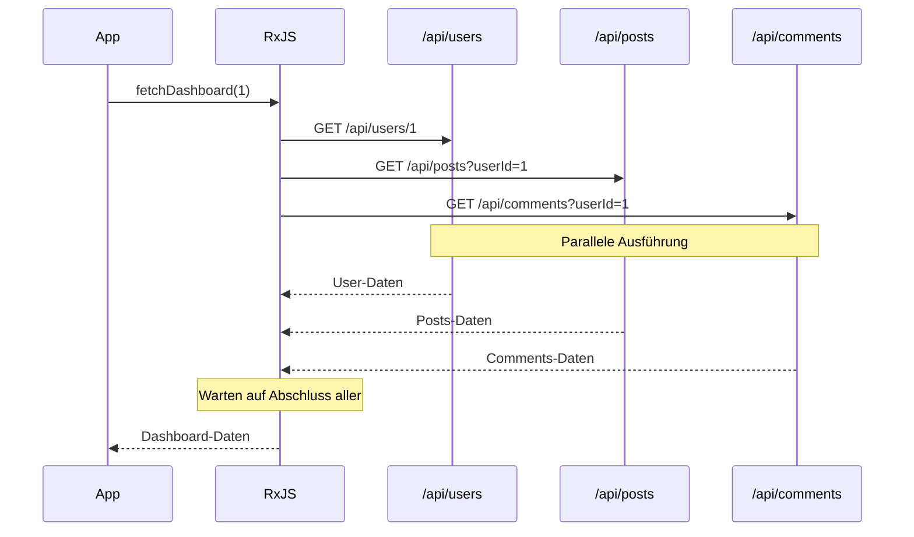
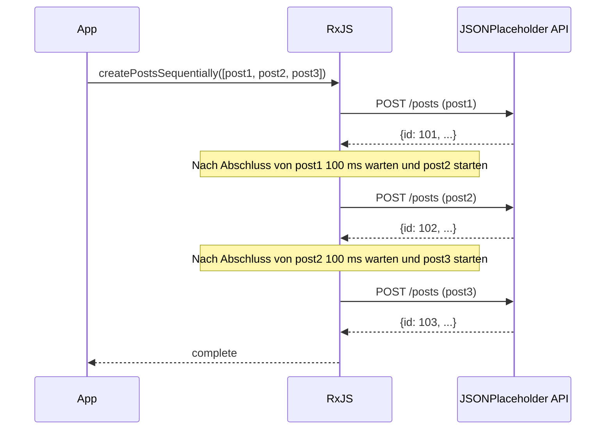
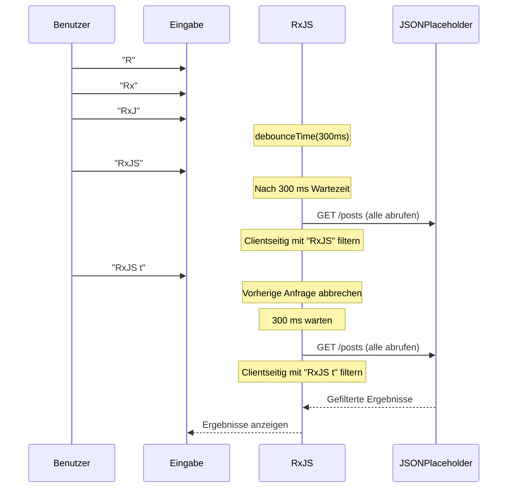

# API-Aufrufmuster

Im Webentwicklungsbereich gehören API-Aufrufe zu den am häufigsten implementierten Prozessen. Mit RxJS können Sie komplexe asynchrone API-Aufrufe deklarativ und robust implementieren.

In diesem Artikel werden konkrete Implementierungsmuster für verschiedene API-Aufrufszenarien erklärt, die in der Praxis auftreten, einschließlich Fehlerbehandlung und Abbruchverarbeitung.

## Was Sie in diesem Artikel lernen

- Implementierung grundlegender GET/POST-Anfragen
- Parallele Aufrufe mehrerer APIs (forkJoin)
- Serielle Anfragen mit sequenzieller Ausführung (concatMap)
- Verkettung abhängiger Anfragen (switchMap)
- Retry und Fehlerbehandlung
- Timeout-Verarbeitung
- Abbruch von Anfragen

> [!TIP] Vorausgesetztes Wissen
> Dieser Artikel setzt Kenntnisse aus [Kapitel 4: Operatoren](../operators/index.md) und [Kapitel 6: Fehlerbehandlung](../error-handling/strategies.md) voraus.

## Grundlegende API-Aufrufe

### Problem: Einfache GET-Anfrage

Als grundlegendster Fall implementieren wir eine einzelne GET-Anfrage.

### Implementierungsbeispiel

```typescript
import { from, Observable, map, catchError, timeout } from 'rxjs';

// User-Typ der JSONPlaceholder-API
// https://jsonplaceholder.typicode.com/users
interface User {
  id: number;
  name: string;
  username: string;
  email: string;
  address: {
    street: string;
    suite: string;
    city: string;
    zipcode: string;
    geo: {
      lat: string;
      lng: string;
    };
  };
  phone: string;
  website: string;
  company: {
    name: string;
    catchPhrase: string;
    bs: string;
  };
}

// Benutzerliste abrufen
function fetchUsers(): Observable<User[]> {
  return from(
    fetch('https://jsonplaceholder.typicode.com/users')
      .then(response => {
        if (!response.ok) {
          throw new Error(`HTTP error! status: ${response.status}`);
        }
        return response.json();
      })
  ).pipe(
    timeout(5000), // Timeout nach 5 Sekunden
    catchError(err => {
      console.error('Fehler beim Abrufen der Benutzer:', err);
      throw err;
    })
  );
}

// Verwendungsbeispiel
fetchUsers().subscribe({
  next: users => {
    console.log('Benutzerliste:', users);
    console.log('Erster Benutzer:', users[0].name); // Beispiel: "Leanne Graham"
  },
  error: err => console.error('Fehler:', err)
});
```

> [!NOTE] from() vs ajax()
> In diesem Beispiel wird der Standard-`fetch` mit `from()` umhüllt, aber Sie können auch das offizielle RxJS-`ajax()` verwenden. `ajax()` ist funktionsreicher und unterstützt Anforderungsabbruch und Fortschrittsüberwachung.

### POST-Anfrage

Dies ist das Muster für die Erstellung neuer Daten.

```typescript
import { from, Observable, catchError } from 'rxjs';

// Post-Typ der JSONPlaceholder-API
// https://jsonplaceholder.typicode.com/posts
interface Post {
  id: number;
  userId: number;
  title: string;
  body: string;
}

interface CreatePostRequest {
  userId: number;
  title: string;
  body: string;
}

function createPost(postData: CreatePostRequest): Observable<Post> {
  return from(
    fetch('https://jsonplaceholder.typicode.com/posts', {
      method: 'POST',
      headers: {
        'Content-Type': 'application/json',
      },
      body: JSON.stringify(postData)
    }).then(response => {
      if (!response.ok) {
        throw new Error(`HTTP error! status: ${response.status}`);
      }
      return response.json();
    })
  ).pipe(
    catchError(err => {
      console.error('Fehler beim Erstellen des Beitrags:', err);
      throw err;
    })
  );
}

// Verwendungsbeispiel
createPost({
  userId: 1,
  title: 'RxJS lernen',
  body: 'Ich lerne die Muster für API-Aufrufe mit RxJS.'
}).subscribe({
  next: post => {
    console.log('Erstellter Beitrag:', post);
    console.log('Beitrags-ID:', post.id); // JSONPlaceholder weist automatisch eine ID zu (z. B. 101)
  },
  error: err => console.error('Fehler:', err)
});
```

> [!TIP] Praktische Hinweise
> - **Typsicherheit**: Definieren Sie die Antworttypen klar
> - **Fehlerbehandlung**: Überprüfen Sie HTTP-Statuscodes angemessen
> - **Timeout**: Vermeiden Sie langes Warten

## Parallele Anfragen (forkJoin)

### Problem: Mehrere APIs gleichzeitig aufrufen

Es gibt Fälle, in denen Sie mehrere unabhängige APIs parallel aufrufen und mit der Verarbeitung fortfahren möchten, nachdem alle Antworten eingegangen sind.

### Lösung: forkJoin verwenden

`forkJoin` wartet, bis alle Observables abgeschlossen sind, und gibt alle Ergebnisse als Array zurück (entspricht Promise.all).

```typescript
import { forkJoin, from, Observable, map } from 'rxjs';

// Comment-Typ der JSONPlaceholder-API
// https://jsonplaceholder.typicode.com/comments
interface Comment {
  postId: number;
  id: number;
  name: string;
  email: string;
  body: string;
}
interface Post {
  id: number;
  userId: number;
  title: string;
  body: string;
}
interface User {
  id: number;
  name: string;
  username: string;
  email: string;
  address: {
    street: string;
    suite: string;
    city: string;
    zipcode: string;
    geo: {
      lat: string;
      lng: string;
    };
  };
  phone: string;
  website: string;
  company: {
    name: string;
    catchPhrase: string;
    bs: string;
  };
}
interface Dashboard {
  user: User;
  posts: Post[];
  comments: Comment[];
}

function fetchUserById(id: number): Observable<User> {
  return from(
    fetch(`https://jsonplaceholder.typicode.com/users/${id}`).then(r => r.json())
  );
}

function fetchPostsByUserId(userId: number): Observable<Post[]> {
  return from(
    fetch(`https://jsonplaceholder.typicode.com/posts?userId=${userId}`).then(r => r.json())
  );
}

function fetchCommentsByPostId(postId: number): Observable<Comment[]> {
  return from(
    fetch(`https://jsonplaceholder.typicode.com/comments?postId=${postId}`).then(r => r.json())
  );
}

// Dashboard-Daten parallel abrufen
function fetchDashboard(userId: number): Observable<Dashboard> {
  return forkJoin({
    user: fetchUserById(userId),
    posts: fetchPostsByUserId(userId),
    comments: fetchCommentsByPostId(1) // Kommentare für Beitrags-ID=1 abrufen
  }).pipe(
    map(({ user, posts, comments }) => ({
      user,
      posts,
      comments
    }))
  );
}

// Verwendungsbeispiel
fetchDashboard(1).subscribe({
  next: dashboard => {
    console.log('Benutzer:', dashboard.user.name); // Beispiel: "Leanne Graham"
    console.log('Anzahl der Beiträge:', dashboard.posts.length); // Beispiel: 10
    console.log('Anzahl der Kommentare:', dashboard.comments.length); // Beispiel: 5
  },
  error: err => console.error('Fehler beim Abrufen des Dashboards:', err)
});
```

#### Ablauf der Ausführung



> [!IMPORTANT] Eigenschaften von forkJoin
> - Wartet, bis alle Observables abgeschlossen sind
> - **Wenn eines einen Fehler verursacht, schlägt das gesamte fehl**
> - Alle Observables müssen mindestens einen Wert ausgeben

### Fehlerbehandlung verbessern

Bei parallelen Anfragen möchten Sie manchmal die anderen Ergebnisse abrufen, auch wenn einige fehlschlagen.

```typescript
import { forkJoin, of, catchError } from 'rxjs';

function fetchDashboardWithFallback(userId: number): Observable<Dashboard> {
  return forkJoin({
    user: fetchUserById(userId).pipe(
      catchError(err => {
        console.error('Fehler beim Abrufen des Benutzers:', err);
        return of(null); // Bei Fehler null zurückgeben
      })
    ),
    posts: fetchPostsByUserId(userId).pipe(
      catchError(err => {
        console.error('Fehler beim Abrufen der Beiträge:', err);
        return of([]); // Bei Fehler leeres Array zurückgeben
      })
    ),
    comments: fetchCommentsByUserId(userId).pipe(
      catchError(err => {
        console.error('Fehler beim Abrufen der Kommentare:', err);
        return of([]); // Bei Fehler leeres Array zurückgeben
      })
    )
  }).pipe(
    map(({ user, posts, comments }) => ({
      user: user || { id: userId, name: 'Unknown', email: '' },
      posts,
      comments
    }))
  );
}
```

> [!TIP] Teilweise Fehlerbehandlung
> Durch Anwendung von `catchError` auf jedes Observable können Sie die Gesamtverarbeitung fortsetzen, auch wenn einige fehlschlagen.

## Serielle Anfragen (concatMap)

### Problem: APIs in Reihenfolge ausführen

Wenn Sie die nächste Anfrage erst nach Abschluss der vorherigen ausführen möchten (z. B. sequenzielles Hochladen mehrerer Dateien).

### Lösung: concatMap verwenden

`concatMap` führt das nächste Observable erst aus, nachdem das vorherige abgeschlossen ist.

```typescript
import { from, Observable, concatMap, tap, delay, catchError } from 'rxjs';

// Post-Typ der JSONPlaceholder-API
// https://jsonplaceholder.typicode.com/posts
interface Post {
  id: number;
  userId: number;
  title: string;
  body: string;
}

interface CreatePostRequest {
  userId: number;
  title: string;
  body: string;
}

function createPost(postData: CreatePostRequest): Observable<Post> {
  return from(
    fetch('https://jsonplaceholder.typicode.com/posts', {
      method: 'POST',
      headers: {
        'Content-Type': 'application/json',
      },
      body: JSON.stringify(postData)
    }).then(response => {
      if (!response.ok) {
        throw new Error(`HTTP error! status: ${response.status}`);
      }
      return response.json();
    })
  ).pipe(
    catchError(err => {
      console.error('Fehler beim Erstellen des Beitrags:', err);
      throw err;
    })
  );
}

// Mehrere Beiträge nacheinander erstellen (unter Berücksichtigung von API-Ratenlimits)
function createPostsSequentially(posts: CreatePostRequest[]): Observable<Post> {
  return from(posts).pipe(
    concatMap((postData, index) =>
      createPost(postData).pipe(
        tap(result => console.log(`Beitrag ${index + 1} erstellt:`, result.title)),
        delay(100) // 100 ms warten unter Berücksichtigung von API-Ratenlimits
      )
    )
  );
}

// Verwendungsbeispiel
const postsToCreate: CreatePostRequest[] = [
  {
    userId: 1,
    title: 'Erster Beitrag',
    body: 'Dies ist der erste Beitrag.'
  },
  {
    userId: 1,
    title: 'Zweiter Beitrag',
    body: 'Dies ist der zweite Beitrag.'
  },
  {
    userId: 1,
    title: 'Dritter Beitrag',
    body: 'Dies ist der dritte Beitrag.'
  }
];

const results: Post[] = [];

createPostsSequentially(postsToCreate).subscribe({
  next: post => {
    results.push(post);
    console.log(`Fortschritt: ${results.length}/${postsToCreate.length}`);
  },
  complete: () => {
    console.log('Alle Beiträge erstellt:', results.length, 'Stück');
  },
  error: err => console.error('Fehler beim Erstellen des Beitrags:', err)
});
```

#### Ablauf der Ausführung



> [!NOTE] concatMap vs mergeMap
> - **concatMap**: Sequenzielle Ausführung (erst nach Abschluss des vorherigen)
> - **mergeMap**: Parallele Ausführung (mehrere gleichzeitig möglich)
>
> Verwenden Sie `concatMap`, wenn die Reihenfolge wichtig ist, und `mergeMap`, wenn die Reihenfolge unwichtig und Geschwindigkeit Priorität hat.

## Abhängige Anfragen (switchMap)

### Problem: Nächste API mit vorheriger API-Antwort aufrufen

Dies ist eines der häufigsten Muster, bei dem Sie das Ergebnis der ersten API-Antwort verwenden, um die nächste API aufzurufen.

### Lösung: switchMap verwenden

`switchMap` empfängt den Wert des vorherigen Observables und wandelt ihn in ein neues Observable um.

```typescript
import { from, Observable, switchMap, map } from 'rxjs';

interface UserProfile {
  user: User;
  posts: Post[];
}
interface Post {
  id: number;
  userId: number;
  title: string;
  body: string;
}
interface User {
  id: number;
  name: string;
  username: string;
  email: string;
  address: {
    street: string;
    suite: string;
    city: string;
    zipcode: string;
    geo: {
      lat: string;
      lng: string;
    };
  };
  phone: string;
  website: string;
  company: {
    name: string;
    catchPhrase: string;
    bs: string;
  };
}

function fetchUserById(id: number): Observable<User> {
  return from(
    fetch(`https://jsonplaceholder.typicode.com/users/${id}`).then(r => r.json())
  );
}

function fetchPostsByUserId(userId: number): Observable<Post[]> {
  return from(
    fetch(`https://jsonplaceholder.typicode.com/posts?userId=${userId}`).then(r => r.json())
  );
}

// Benutzerdetails und deren Beiträge abrufen
function fetchUserProfile(userId: number): Observable<UserProfile> {
  return fetchUserById(userId).pipe(
    switchMap(user =>
      // Nach Abrufen der Benutzerinformationen deren Beiträge abrufen
      fetchPostsByUserId(user.id).pipe(
        map(posts => ({
          user,
          posts
        }))
      )
    )
  );
}

// Verwendungsbeispiel
fetchUserProfile(1).subscribe({
  next: profile => {
    console.log('Benutzer:', profile.user.name);
    console.log('Beiträge:', profile.posts);
  },
  error: err => console.error('Fehler:', err)
});
```

### Praxisbeispiel: Implementierung einer Suchfunktion

Dies ist ein in der Praxis häufig vorkommendes Muster, bei dem die API entsprechend der Benutzereingabe aufgerufen wird.

```typescript
import { from, fromEvent, Observable, of, map, debounceTime, distinctUntilChanged, switchMap, catchError } from 'rxjs';

// JSONPlaceholder Post als Suchergebnis verwenden
interface SearchResult {
  id: number;
  userId: number;
  title: string;
  body: string;
}

function searchAPI(query: string): Observable<SearchResult[]> {
  return from(
    fetch('https://jsonplaceholder.typicode.com/posts')
      .then(response => {
        if (!response.ok) {
          throw new Error(`HTTP error! status: ${response.status}`);
        }
        return response.json();
      })
  ).pipe(
    // Clientseitige Filterung nach Titel
    map((posts: SearchResult[]) =>
      posts.filter(post =>
        post.title.toLowerCase().includes(query.toLowerCase())
      )
    )
  );
}

// Traditioneller Ansatz (als Referenz kommentiert)
// const searchInput = document.querySelector<HTMLInputElement>('#search');

// Eigenständig: Erstellt Sucheingabe und Ergebniscontainer dynamisch
const searchInput = document.createElement('input');
searchInput.id = 'search';
searchInput.type = 'text';
searchInput.placeholder = 'Suchbegriff eingeben (mindestens 2 Zeichen)';
searchInput.style.padding = '10px';
searchInput.style.margin = '10px';
searchInput.style.width = '400px';
searchInput.style.fontSize = '16px';
searchInput.style.border = '2px solid #ccc';
searchInput.style.borderRadius = '4px';
searchInput.style.display = 'block';
document.body.appendChild(searchInput);

const resultsContainer = document.createElement('div');
resultsContainer.id = 'results';
resultsContainer.style.padding = '10px';
resultsContainer.style.margin = '10px';
resultsContainer.style.minHeight = '100px';
resultsContainer.style.border = '1px solid #ddd';
resultsContainer.style.borderRadius = '4px';
resultsContainer.style.backgroundColor = '#f9f9f9';
document.body.appendChild(resultsContainer);

const search$ = fromEvent(searchInput, 'input').pipe(
  map(event => (event.target as HTMLInputElement).value),
  debounceTime(300),           // 300 ms nach Eingabe warten
  distinctUntilChanged(),      // Wenn gleicher Wert wie zuvor, ignorieren
  switchMap(query => {
    if (query.length < 2) {
      return of([]); // Bei weniger als 2 Zeichen leeres Array
    }
    return searchAPI(query).pipe(
      catchError(err => {
        console.error('Suchfehler:', err);
        return of([]); // Bei Fehler leeres Array
      })
    );
  })
);

search$.subscribe(results => {
  console.log('Suchergebnisse:', results);
  // Ergebnisse in der Benutzeroberfläche anzeigen
  displayResults(results, resultsContainer);
});

function displayResults(results: SearchResult[], container: HTMLElement): void {
  // Ergebnisse im DOM anzeigen
  container.innerHTML = results
    .map(r => `<div style="padding: 8px; margin: 4px; border-bottom: 1px solid #eee;">${r.title}</div>`)
    .join('');

  if (results.length === 0) {
    container.innerHTML = '<div style="padding: 8px; color: #999;">Keine Suchergebnisse</div>';
  }
}
```

> [!TIP] Clientseitige Filterung
> Da die JSONPlaceholder-API keinen Suchendpunkt hat, werden alle Beiträge abgerufen und clientseitig gefiltert. In der Praxis wird dieses Muster verwendet, wenn das Backend keine Suchfunktion hat oder die Datenmenge gering ist.
>
> **Suchbeispiele**:
> - Suche nach "sunt" → Mehrere Beiträge gefunden
> - Suche nach "qui est esse" → Titel mit "qui est esse" gefunden
> - Suche nach "zzz" → Keine Suchergebnisse (keine Übereinstimmung)

#### Ablauf der Ausführung



> [!IMPORTANT] Wichtige Eigenschaft von switchMap
> **Wenn ein neuer Wert kommt, wird das vorherige Observable automatisch abgebrochen.**
> Dadurch werden alte API-Antworten ignoriert, selbst wenn sie später eintreffen (Vermeidung von Race Conditions).

### switchMap vs mergeMap vs concatMap

Dies ist die Unterscheidung bei Higher-Order-Mapping-Operatoren.

| Operator | Verhalten | Anwendungsfall |
|------------|------|-----------|
| `switchMap` | Bricht vorherige ab, wenn neuer Wert kommt | **Suche, Autocomplete** (nur neuestes Ergebnis benötigt) |
| `mergeMap` | Führt alle parallel aus | **Parallele Verarbeitung** (Reihenfolge egal, alle Ergebnisse benötigt) |
| `concatMap` | Führt nacheinander aus (erst nach Abschluss des vorherigen) | **Reihenfolge wichtig** (Datei-Upload usw.) |
| `exhaustMap` | Ignoriert neue Werte, bis vorheriger abgeschlossen | **Doppelte Übermittlung verhindern** (Schutz vor Button-Spam) |

```typescript
// switchMap: Nur neueste Suchergebnisse anzeigen
searchInput$.pipe(
  switchMap(query => searchAPI(query))
);

// mergeMap: Alle Dateien parallel hochladen
from(files).pipe(
  mergeMap(file => uploadFile(file))
);

// concatMap: Dateien nacheinander hochladen
from(files).pipe(
  concatMap(file => uploadFile(file))
);

// exhaustMap: Doppelte Formularübermittlung verhindern
submitButton$.pipe(
  exhaustMap(() => submitForm())
);
```

## Retry und Fehlerbehandlung

### Problem: Auf temporäre Netzwerkfehler reagieren

Bei Netzwerkfehlern oder Timeouts möchten Sie manchmal automatisch erneut versuchen.

### Lösung: retry und retryWhen verwenden

```typescript
import { from, Observable, timer } from 'rxjs';
import { retry, retryWhen, mergeMap, catchError, of, timeout } from 'rxjs';

// User-Typ der JSONPlaceholder-API
// https://jsonplaceholder.typicode.com/users
interface User {
  id: number;
  name: string;
  username: string;
  email: string;
  address: {
    street: string;
    suite: string;
    city: string;
    zipcode: string;
    geo: {
      lat: string;
      lng: string;
    };
  };
  phone: string;
  website: string;
  company: {
    name: string;
    catchPhrase: string;
    bs: string;
  };
}

function fetchUsers(): Observable<User[]> {
  return from(
    fetch('https://jsonplaceholder.typicode.com/users')
      .then(response => {
        if (!response.ok) {
          throw new Error(`HTTP error! status: ${response.status}`);
        }
        return response.json();
      })
  ).pipe(
    timeout(5000), // Timeout nach 5 Sekunden
    catchError(err => {
      console.error('Fehler beim Abrufen der Benutzer:', err);
      throw err;
    })
  );
}

// Einfacher Retry (sofort bis zu 3 Mal)
function fetchWithSimpleRetry(): Observable<User[]> {
  return fetchUsers().pipe(
    retry(3), // Bei Fehler bis zu 3 Mal erneut versuchen
    catchError(err => {
      console.error('Fehler auch nach Retry:', err);
      return of([]); // Bei endgültigem Fehler leeres Array zurückgeben
    })
  );
}

// Retry mit exponentiellem Backoff
function fetchWithExponentialBackoff(): Observable<User[]> {
  return fetchUsers().pipe(
    retryWhen(errors =>
      errors.pipe(
        mergeMap((error, index) => {
          const retryAttempt = index + 1;

          // Maximal 3 Mal wiederholen
          if (retryAttempt > 3) {
            throw error;
          }

          // Exponentielles Backoff: 1 Sekunde, 2 Sekunden, 4 Sekunden
          const delayMs = Math.pow(2, index) * 1000;
          console.log(`Retry ${retryAttempt}/3 (nach ${delayMs}ms)`);

          return timer(delayMs);
        })
      )
    ),
    catchError(err => {
      console.error('Fehler auch nach Retry:', err);
      return of([]);
    })
  );
}

// Verwendungsbeispiel
fetchWithExponentialBackoff().subscribe({
  next: users => console.log('Benutzer erfolgreich abgerufen:', users),
  error: err => console.error('Endgültiger Fehler:', err)
});
```

**Ausführungsbeispiel für exponentielles Backoff:**

```
1. Versuch: Sofortige Ausführung
↓ Fehler
2. Versuch: Ausführung nach 1 Sekunde Wartezeit
↓ Fehler
3. Versuch: Ausführung nach 2 Sekunden Wartezeit
↓ Fehler
4. Versuch: Ausführung nach 4 Sekunden Wartezeit
↓ Erfolg oder endgültiger Fehler
```

> [!TIP] Auswahl der Retry-Strategie
> - **Sofortiger Retry**: `retry(3)` - Einfach, effektiv bei kurzen Netzwerkausfällen
> - **Festes Intervall**: `retryWhen` + `delay(1000)` - Berücksichtigt Serverlast
> - **Exponentielles Backoff**: `retryWhen` + `timer` - Best Practice für AWS usw.

### Nur bestimmte Fehler wiederholen

Nicht alle Fehler sollten wiederholt werden (z. B. 401 Unauthorized erfordert keinen Retry).

```typescript
import { throwError } from 'rxjs';

interface HttpError {
  status: number;
  message: string;
}

function shouldRetry(error: HttpError): boolean {
  // Statuscodes, die wiederholt werden sollten
  const retryableStatuses = [408, 429, 500, 502, 503, 504];
  return retryableStatuses.includes(error.status);
}

function fetchWithConditionalRetry(): Observable<User[]> {
  return fetchUsers().pipe(
    retryWhen(errors =>
      errors.pipe(
        mergeMap((error: HttpError, index) => {
          const retryAttempt = index + 1;

          // Nicht wiederholbarer Fehler
          if (!shouldRetry(error)) {
            console.error('Nicht wiederholbarer Fehler:', error);
            return throwError(() => error);
          }

          // Maximal 3 Mal
          if (retryAttempt > 3) {
            return throwError(() => error);
          }

          const delayMs = Math.pow(2, index) * 1000;
          console.log(`Retry ${retryAttempt}/3 (status: ${error.status})`);

          return timer(delayMs);
        })
      )
    ),
    catchError(err => {
      console.error('Endgültiger Fehler:', err);
      return of([]);
    })
  );
}
```

> [!WARNING] Hinweise zu Retry
> - **POST-Anfragen**: Wenn nicht idempotent, Risiko doppelter Erstellung durch Retry
> - **Authentifizierungsfehler**: 401/403 nicht wiederholen, sondern zur erneuten Anmeldung auffordern
> - **Validierungsfehler**: 400 nicht wiederholen, Benutzer zur Korrektur auffordern

## Timeout-Verarbeitung

### Problem: Bei langsamer API-Antwort reagieren

Wenn das Netzwerk langsam ist oder der Server nicht antwortet, möchten Sie nach einer bestimmten Zeit einen Timeout auslösen.

### Lösung: timeout-Operator verwenden

```typescript
import { timeout, catchError, of, from, Observable, throwError } from 'rxjs';

// User-Typ der JSONPlaceholder-API
// https://jsonplaceholder.typicode.com/users
interface User {
  id: number;
  name: string;
  username: string;
  email: string;
  address: {
    street: string;
    suite: string;
    city: string;
    zipcode: string;
    geo: {
      lat: string;
      lng: string;
    };
  };
  phone: string;
  website: string;
  company: {
    name: string;
    catchPhrase: string;
    bs: string;
  };
}

function fetchUsers(): Observable<User[]> {
  return from(
    fetch('https://jsonplaceholder.typicode.com/users')
      .then(response => {
        if (!response.ok) {
          throw new Error(`HTTP error! status: ${response.status}`);
        }
        return response.json();
      })
  ).pipe(
    timeout(5000), // Timeout nach 5 Sekunden
    catchError(err => {
      console.error('Fehler beim Abrufen der Benutzer:', err);
      throw err;
    })
  );
}

// Timeout nach 5 Sekunden
function fetchWithTimeout(): Observable<User[]> {
  return fetchUsers().pipe(
    timeout(5000), // Fehler, wenn keine Antwort innerhalb von 5 Sekunden
    catchError(err => {
      if (err.name === 'TimeoutError') {
        console.error('Anfrage wurde mit Timeout beendet');
        // Fallback-Verarbeitung bei Timeout
        return of([]); // Leeres Array zurückgeben
      }
      throw err; // Andere Fehler erneut werfen
    })
  );
}

// Benutzerdefinierte Timeout-Nachricht
function fetchWithCustomTimeout(): Observable<User[]> {
  return fetchUsers().pipe(
    timeout({
      each: 5000,
      with: () => throwError(() => new Error('Benutzerdefinierter Timeout-Fehler'))
    }),
    catchError(err => {
      console.error('Fehler:', err.message);
      return of([]);
    })
  );
}
```

### Kombination von Retry und Timeout

In der Praxis werden Timeout und Retry kombiniert verwendet.

```typescript
function fetchWithTimeoutAndRetry(): Observable<User[]> {
  return fetchUsers().pipe(
    timeout(5000),           // Timeout nach 5 Sekunden pro Versuch
    retry(3),                // Bei Timeout 3 Mal wiederholen
    catchError(err => {
      console.error('Fehler auch nach Timeout und Retry:', err);
      return of([]);
    })
  );
}
```

> [!TIP] Einstellung der Timeout-Werte
> - **Normale API**: 5 Sekunden - 10 Sekunden
> - **Schnelle API**: 2 Sekunden - 3 Sekunden
> - **Datei-Upload**: 30 Sekunden - 60 Sekunden
> - **Hintergrundverarbeitung**: 60 Sekunden oder mehr
>
> Einstellung unter Berücksichtigung von Benutzererfahrung und Serverlast.

## Abbruch von Anfragen

### Problem: Unnötige API-Anfragen abbrechen

Bei Seitenwechsel oder Zerstörung von Komponenten möchten Sie laufende API-Anfragen abbrechen.

### Lösung: takeUntil verwenden

```typescript
import { Subject, takeUntil, from, timeout, catchError } from 'rxjs';

// User-Typ der JSONPlaceholder-API
// https://jsonplaceholder.typicode.com/users
interface User {
  id: number;
  name: string;
  username: string;
  email: string;
  address: {
    street: string;
    suite: string;
    city: string;
    zipcode: string;
    geo: {
      lat: string;
      lng: string;
    };
  };
  phone: string;
  website: string;
  company: {
    name: string;
    catchPhrase: string;
    bs: string;
  };
}

class UserListManager {
  private destroy$ = new Subject<void>();
  private users: User[] = [];


   fetchUsers(): Observable<User[]> {
    return from(
      fetch('https://jsonplaceholder.typicode.com/users')
        .then(response => {
          if (!response.ok) {
            throw new Error(`HTTP error! status: ${response.status}`);
          }
          return response.json();
        })
    ).pipe(
      timeout(5000), // Timeout nach 5 Sekunden
      catchError(err => {
        console.error('Fehler beim Abrufen der Benutzer:', err);
        throw err;
      })
    );
  }

  init(): void {
    // Benutzerliste bei Initialisierung abrufen
    this.fetchUsers().pipe(
      takeUntil(this.destroy$) // Automatischer Abbruch bei Instanzzerstörung
    ).subscribe({
      next: (users: User[]) => {
        this.users = users;
        console.log('Benutzer erfolgreich abgerufen:', users);
      },
      error: (err: any) => console.error('Fehler:', err)
    });
  }

  destroy(): void {
    // Wird bei Instanzzerstörung ausgelöst
    this.destroy$.next();
    this.destroy$.complete();
  }
}

// Verwendungsbeispiel
const userList = new UserListManager();
userList.init();

// Wenn Bereinigung erforderlich ist
// userList.destroy();
```

### Abbruch durch Benutzeraktion

Beispiel für die Implementierung eines expliziten Abbruch-Buttons.

```typescript
// Traditioneller Ansatz (als Referenz kommentiert)
// const cancelButton = document.querySelector<HTMLButtonElement>('#cancel');
// const loadButton = document.querySelector<HTMLButtonElement>('#load');

// Eigenständig: Erstellt Laden- und Abbrechen-Buttons dynamisch
const loadButton = document.createElement('button');
loadButton.id = 'load';
loadButton.textContent = 'Benutzer laden';
loadButton.style.padding = '10px 20px';
loadButton.style.margin = '10px';
loadButton.style.fontSize = '16px';
loadButton.style.fontWeight = 'bold';
loadButton.style.color = '#fff';
loadButton.style.backgroundColor = '#4CAF50';
loadButton.style.border = 'none';
loadButton.style.borderRadius = '4px';
loadButton.style.cursor = 'pointer';
document.body.appendChild(loadButton);

const cancelButton = document.createElement('button');
cancelButton.id = 'cancel';
cancelButton.textContent = 'Abbrechen';
cancelButton.style.padding = '10px 20px';
cancelButton.style.margin = '10px';
cancelButton.style.fontSize = '16px';
cancelButton.style.fontWeight = 'bold';
cancelButton.style.color = '#fff';
cancelButton.style.backgroundColor = '#f44336';
cancelButton.style.border = 'none';
cancelButton.style.borderRadius = '4px';
cancelButton.style.cursor = 'pointer';
document.body.appendChild(cancelButton);

const statusDisplay = document.createElement('div');
statusDisplay.id = 'status';
statusDisplay.style.padding = '10px';
statusDisplay.style.margin = '10px';
statusDisplay.style.fontSize = '14px';
statusDisplay.style.minHeight = '20px';
document.body.appendChild(statusDisplay);

const cancel$ = fromEvent(cancelButton, 'click');

fromEvent(loadButton, 'click').pipe(
  switchMap(() => {
    statusDisplay.textContent = 'Wird geladen...';
    statusDisplay.style.color = '#FF9800';
    return fetchUsers().pipe(
      takeUntil(cancel$) // Bei Klick auf Abbrechen-Button unterbrechen
    );
  })
).subscribe({
  next: users => {
    console.log('Benutzer erfolgreich abgerufen:', users);
    statusDisplay.textContent = `Benutzer abgerufen: ${users.length} Stück`;
    statusDisplay.style.color = '#4CAF50';
  },
  error: err => {
    if (err.name === 'AbortError') {
      console.log('Anfrage wurde abgebrochen');
      statusDisplay.textContent = 'Anfrage wurde abgebrochen';
      statusDisplay.style.color = '#999';
    } else {
      console.error('Fehler:', err);
      statusDisplay.textContent = `Fehler: ${err.message}`;
      statusDisplay.style.color = '#f44336';
    }
  }
});
```

> [!IMPORTANT] Best Practices für Abbruch
> - **Immer Abbruchverarbeitung implementieren** - Verhindert Speicherlecks und Netzwerkverschwendung
> - **takeUntil verwenden** - Deklarativer und weniger fehleranfällig als unsubscribe()
> - **Bei Komponentenzerstörung** - destroy$ auslösen und alle Abonnements aufheben

## Beispiel für eine praktische Service-Klasse

Dies ist ein Beispiel für eine vollständige, in der Praxis verwendbare Service-Klasse, die die bisherigen Muster zusammenfasst.

```typescript
import { Observable, Subject, throwError, timer, catchError, retryWhen, mergeMap, timeout, shareReplay, takeUntil, from } from 'rxjs';

// User-Typ der JSONPlaceholder-API
// https://jsonplaceholder.typicode.com/users
interface User {
  id: number;
  name: string;
  username: string;
  email: string;
  address: {
    street: string;
    suite: string;
    city: string;
    zipcode: string;
    geo: {
      lat: string;
      lng: string;
    };
  };
  phone: string;
  website: string;
  company: {
    name: string;
    catchPhrase: string;
    bs: string;
  };
}
interface Post {
  id: number;
  userId: number;
  title: string;
  body: string;
}

export class ApiService {
  private destroy$ = new Subject<void>();
  private cache = new Map<string, Observable<any>>();

  /**
   * Grundlegende GET-Anfrage
   */
  get<T>(url: string, options?: RequestOptions): Observable<T> {
    return this.request<T>('GET', url, options);
  }

  /**
   * POST-Anfrage
   */
  post<T>(url: string, body: any, options?: RequestOptions): Observable<T> {
    return this.request<T>('POST', url, { ...options, body });
  }

  /**
   * GET-Anfrage mit Cache
   */
  getWithCache<T>(url: string, options?: RequestOptions): Observable<T> {
    const cacheKey = url;

    if (this.cache.has(cacheKey)) {
      return this.cache.get(cacheKey) as Observable<T>;
    }

    const request$ = this.get<T>(url, options).pipe(
      shareReplay(1) // Ergebnis zwischenspeichern
    );

    this.cache.set(cacheKey, request$);
    return request$;
  }

  /**
   * Cache löschen
   */
  clearCache(url?: string): void {
    if (url) {
      this.cache.delete(url);
    } else {
      this.cache.clear();
    }
  }

  /**
   * Grundlegende Anfrageverarbeitung
   */
  private request<T>(
    method: string,
    url: string,
    options?: RequestOptions
  ): Observable<T> {
    const config: RequestInit = {
      method,
      headers: {
        'Content-Type': 'application/json',
        ...options?.headers
      },
      body: options?.body ? JSON.stringify(options.body) : undefined
    };

    return from(
      fetch(url, config).then(response => {
        if (!response.ok) {
          throw {
            status: response.status,
            message: response.statusText
          };
        }
        return response.json();
      })
    ).pipe(
      timeout(options?.timeout || 10000), // Standard 10 Sekunden
      this.retryStrategy(options?.retry),
      // JSONPlaceholder und andere öffentliche APIs geben Daten direkt zurück,
      // daher ist kein Entpacken von response.data erforderlich
      catchError(err => this.handleError(err)),
      takeUntil(this.destroy$) // Automatischer Abbruch bei Service-Zerstörung
    );
  }

  /**
   * Retry-Strategie
   */
  private retryStrategy(retryConfig?: RetryConfig) {
    return retryWhen<any>(errors =>
      errors.pipe(
        mergeMap((error, index) => {
          const retryAttempt = index + 1;
          const maxRetries = retryConfig?.maxRetries || 3;

          // Überprüfen, ob Retry möglich
          if (!this.shouldRetry(error) || retryAttempt > maxRetries) {
            return throwError(() => error);
          }

          // Exponentielles Backoff
          const delayMs = retryConfig?.useExponentialBackoff
            ? Math.pow(2, index) * 1000
            : (retryConfig?.delayMs || 1000);

          console.log(`Retry ${retryAttempt}/${maxRetries} (nach ${delayMs}ms)`);
          return timer(delayMs);
        })
      )
    );
  }

  /**
   * Prüfen, ob Fehler wiederholt werden sollte
   */
  private shouldRetry(error: any): boolean {
    if (error.name === 'TimeoutError') {
      return true; // Timeout wiederholen
    }

    // Wiederholbare HTTP-Statuscodes
    const retryableStatuses = [408, 429, 500, 502, 503, 504];
    return retryableStatuses.includes(error.status);
  }

  /**
   * Fehlerbehandlung
   */
  private handleError(error: any): Observable<never> {
    let errorMessage = 'API-Fehler ist aufgetreten';

    if (error.name === 'TimeoutError') {
      errorMessage = 'Anfrage wurde mit Timeout beendet';
    } else if (error.status) {
      errorMessage = `HTTP ${error.status}: ${error.message}`;
    }

    console.error(errorMessage, error);
    return throwError(() => new Error(errorMessage));
  }

  /**
   * Verarbeitung bei Service-Zerstörung
   */
  destroy(): void {
    this.destroy$.next();
    this.destroy$.complete();
    this.cache.clear();
  }
}

// Typdefinitionen
interface RequestOptions {
  headers?: Record<string, string>;
  body?: any;
  timeout?: number;
  retry?: RetryConfig;
}

interface RetryConfig {
  maxRetries?: number;
  delayMs?: number;
  useExponentialBackoff?: boolean;
}

// Hinweis: ApiResponse-Typ wird verwendet, wenn API-Antworten umhüllt sind
// JSONPlaceholder und andere öffentliche APIs geben Daten direkt zurück, daher ist dieser Typ nicht erforderlich
// Für eigene APIs mit Format { data: T, status: number } verwenden
interface ApiResponse<T> {
  data: T;
  status: number;
}

// Verwendungsbeispiel
const apiService = new ApiService();

// Einfaches GET (mit JSONPlaceholder-API)
apiService.get<User[]>('https://jsonplaceholder.typicode.com/users').subscribe({
  next: users => console.log('Benutzer:', users),
  error: err => console.error('Fehler:', err)
});

// POST mit benutzerdefinierten Einstellungen (mit JSONPlaceholder-API)
apiService.post<Post>(
  'https://jsonplaceholder.typicode.com/posts',
  { userId: 1, title: 'Testbeitrag', body: 'Dies ist ein Testbeitrag.' },
  {
    timeout: 5000,
    retry: {
      maxRetries: 3,
      useExponentialBackoff: true
    }
  }
).subscribe({
  next: post => console.log('Erstellter Beitrag:', post),
  error: err => console.error('Fehler:', err)
});

// GET mit Cache
apiService.getWithCache<User[]>('https://jsonplaceholder.typicode.com/users').subscribe({
  next: users => console.log('Benutzer (Cache):', users)
});

// Bei Service-Zerstörung
// apiService.destroy();
```

> [!TIP] Praktisches Service-Design
> - **Konfigurierbar**: Timeout, Retry-Anzahl usw. flexibel einstellbar
> - **Cache-Funktion**: Verhindert doppelte Anfragen
> - **Fehlerbehandlung**: Einheitliche Fehlerverarbeitung
> - **Automatische Bereinigung**: Sichere Ressourcenfreigabe mit destroy()

## Testcode

Beispiel für Tests von API-Aufrufmustern.

```typescript
import { TestScheduler } from 'rxjs/testing';
import { of, throwError } from 'rxjs';

describe('ApiService', () => {
  let testScheduler: TestScheduler;
  let apiService: ApiService;

  beforeEach(() => {
    testScheduler = new TestScheduler((actual, expected) => {
      expect(actual).toEqual(expected);
    });
    apiService = new ApiService();
  });

  afterEach(() => {
    apiService.destroy();
  });

  it('should fetch users successfully', () => {
    testScheduler.run(({ expectObservable, cold }) => {
      const mockResponse = { data: [{ id: 1, name: 'Test User', email: 'test@example.com' }] };

      // fetch mocken
      spyOn(window, 'fetch').and.returnValue(
        Promise.resolve({
          ok: true,
          json: () => Promise.resolve(mockResponse)
        } as Response)
      );

      const result$ = apiService.get<User[]>('/api/users');

      expectObservable(result$).toBe('(a|)', {
        a: mockResponse.data
      });
    });
  });

  it('should retry on timeout', () => {
    testScheduler.run(({ expectObservable, cold, flush }) => {
      let callCount = 0;

      spyOn(window, 'fetch').and.callFake(() => {
        callCount++;
        if (callCount < 3) {
          // Erste 2 Mal Timeout
          return new Promise(() => {}); // Promise, das sich nicht auflöst
        }
        // 3. Mal erfolgreich
        return Promise.resolve({
          ok: true,
          json: () => Promise.resolve({ data: [] })
        } as Response);
      });

      const result$ = apiService.get<User[]>('/api/users', {
        timeout: 100,
        retry: { maxRetries: 3, delayMs: 100 }
      });

      // Bestätigen, dass Retry ausgeführt wird
      flush();
      expect(callCount).toBeGreaterThan(1);
    });
  });
});
```

## Zusammenfassung

Durch die Beherrschung der API-Aufrufmuster mit RxJS können Sie robuste und wartbare Anwendungen erstellen.

> [!IMPORTANT] Wichtige Punkte
> - **forkJoin**: Mehrere APIs parallel ausführen, auf Abschluss aller warten
> - **concatMap**: APIs nacheinander ausführen (erst nach Abschluss des vorherigen)
> - **switchMap**: Abhängige Anfragen, optimal für Suchfunktionen
> - **retry/retryWhen**: Automatischer Retry bei Fehler, exponentielles Backoff empfohlen
> - **timeout**: Immer Timeout einstellen
> - **takeUntil**: Automatischer Abbruch bei Komponentenzerstörung

> [!TIP] Best Practices
> - **Typsicherheit**: Typ für alle API-Antworten definieren
> - **Fehlerbehandlung**: `catchError` für alle Anfragen implementieren
> - **Abbruchverarbeitung**: Zuverlässige Bereinigung mit `takeUntil`
> - **Retry-Strategie**: Angemessener Retry entsprechend Statuscode
> - **Cache**: Doppelte Anfragen mit `shareReplay` verhindern

## Nächste Schritte

Nach dem Erlernen der API-Aufrufmuster fahren Sie mit den folgenden Mustern fort.

- [Formularverarbeitung](./form-handling.md) - Echtzeit-Validierung, automatisches Speichern
- [UI-Event-Verarbeitung](./ui-events.md) - Integration von UI-Events und API-Aufrufen
- [Echtzeit-Datenverarbeitung](./real-time-data.md) - WebSocket, SSE
- [Cache-Strategien](./caching-strategies.md) - Caching von API-Antworten
- Fehlerbehandlung in der Praxis (in Vorbereitung) - Erweiterte Fehlerbehandlungsstrategien

## Verwandte Abschnitte

- [Kapitel 4: Operatoren](../operators/index.md) - Details zu switchMap, mergeMap, concatMap
- [Kapitel 6: Fehlerbehandlung](../error-handling/strategies.md) - Grundlagen zu catchError, retry
- [Kapitel 2: Cold/Hot Observable](../observables/cold-and-hot-observables.md) - Verständnis von shareReplay

## Referenzressourcen

- [RxJS offiziell: ajax](https://rxjs.dev/api/ajax/ajax) - Details zu ajax()
- [MDN: Fetch API](https://developer.mozilla.org/de/docs/Web/API/Fetch_API) - Verwendung von fetch()
- [Learn RxJS: Higher-order Observables](https://www.learnrxjs.io/learn-rxjs/operators) - Vergleich von switchMap usw.
