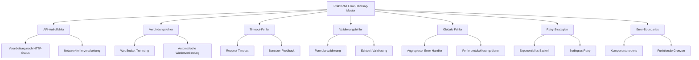

# Praktische Error-Handling-Muster

In RxJS-Anwendungen ist eine angemessene Fehlerbehandlung die Grundlage für den Aufbau zuverlässiger Systeme. Dieser Artikel stellt 7 praktische Error-Handling-Muster vor, die sofort in der Praxis eingesetzt werden können.

## Warum ist Error-Handling wichtig?

In Observable-Streams wird der Stream bei einem Fehler beendet, und es werden keine weiteren Werte mehr ausgegeben. Wenn Sie diese Eigenschaft nicht verstehen und die Fehlerbehandlung vernachlässigen, kann Ihre Anwendung unerwartet stoppen oder den Benutzern kein angemessenes Feedback geben.

**Die drei Zwecke des Error-Handlings**:
1. **Kontinuität sicherstellen** - Streams auch nach Fehlern fortsetzbar machen
2. **Benutzererfahrung verbessern** - Angemessene Fehlermeldungen und Wiederherstellungsmaßnahmen bereitstellen
3. **System-Observability** - Fehlerprotokollierung und Überwachung zur frühzeitigen Problemerkennung

Dieser Artikel erklärt, wie Sie die in Kapitel 6 „[Error-Handling](/de/guide/error-handling/strategies.md)" erlernten Grundkenntnisse auf praktische Szenarien anwenden.

## Aufbau dieses Artikels



## Error-Handling bei API-Aufrufen

API-Aufrufe sind der Bereich, in dem am häufigsten Fehler auftreten. Sie müssen verschiedene Fehlerszenarien wie HTTP-Statuscodes, Netzwerkfehler und Timeouts behandeln.

### Fehlerbehandlung nach HTTP-Status

Führen Sie eine angemessene Fehlerbehandlung entsprechend dem HTTP-Statuscode durch.

```typescript
import { Observable, throwError, catchError, retry, tap } from 'rxjs';
import { ajax, AjaxError } from 'rxjs/ajax';

/**
 * HTTP-Fehlerdetails
 */
interface HttpErrorInfo {
  status: number;
  message: string;
  retryable: boolean;
  userMessage: string;
}

/**
 * HTTP-Fehlerklassifizierungsdienst
 */
class HttpErrorClassifier {
  /**
   * Generiert Fehlerinformationen aus Statuscode
   */
  classify(error: AjaxError): HttpErrorInfo {
    const status = error.status;

    // 4xx Client-Fehler
    if (status >= 400 && status < 500) {
      return this.handleClientError(status, error);
    }

    // 5xx Server-Fehler
    if (status >= 500) {
      return this.handleServerError(status, error);
    }

    // Netzwerkfehler (status = 0)
    if (status === 0) {
      return {
        status: 0,
        message: 'Network error',
        retryable: true,
        userMessage: 'Keine Netzwerkverbindung. Bitte überprüfen Sie Ihre Verbindung.'
      };
    }

    // Andere Fehler
    return {
      status,
      message: 'Unknown error',
      retryable: false,
      userMessage: 'Ein unerwarteter Fehler ist aufgetreten.'
    };
  }

  private handleClientError(status: number, error: AjaxError): HttpErrorInfo {
    switch (status) {
      case 400:
        return {
          status,
          message: 'Bad Request',
          retryable: false,
          userMessage: 'Die eingegebenen Daten sind fehlerhaft.'
        };

      case 401:
        return {
          status,
          message: 'Unauthorized',
          retryable: false,
          userMessage: 'Authentifizierung erforderlich. Bitte melden Sie sich an.'
        };

      case 403:
        return {
          status,
          message: 'Forbidden',
          retryable: false,
          userMessage: 'Sie haben keine Berechtigung für diese Operation.'
        };

      case 404:
        return {
          status,
          message: 'Not Found',
          retryable: false,
          userMessage: 'Die Daten wurden nicht gefunden.'
        };

      case 422:
        return {
          status,
          message: 'Unprocessable Entity',
          retryable: false,
          userMessage: 'Die eingegebenen Daten konnten nicht verarbeitet werden.'
        };

      case 429:
        return {
          status,
          message: 'Too Many Requests',
          retryable: true, // Wiederholbar (Wartezeit erforderlich)
          userMessage: 'Zu viele Anfragen. Bitte warten Sie und versuchen Sie es erneut.'
        };

      default:
        return {
          status,
          message: `Client Error ${status}`,
          retryable: false,
          userMessage: 'Die Anfrage konnte nicht verarbeitet werden.'
        };
    }
  }

  private handleServerError(status: number, error: AjaxError): HttpErrorInfo {
    switch (status) {
      case 500:
        return {
          status,
          message: 'Internal Server Error',
          retryable: true,
          userMessage: 'Ein Serverfehler ist aufgetreten. Bitte warten Sie und versuchen Sie es erneut.'
        };

      case 502:
      case 503:
      case 504:
        return {
          status,
          message: 'Service Unavailable',
          retryable: true,
          userMessage: 'Der Server ist vorübergehend nicht verfügbar. Bitte warten Sie und versuchen Sie es erneut.'
        };

      default:
        return {
          status,
          message: `Server Error ${status}`,
          retryable: true,
          userMessage: 'Ein Serverfehler ist aufgetreten.'
        };
    }
  }
}

/**
 * HTTP-Client-Dienst
 */
class HttpClientService {
  private errorClassifier = new HttpErrorClassifier();

  /**
   * GET-Request (mit Error-Handling)
   */
  get<T>(url: string): Observable<T> {
    return ajax.get<T>(url).pipe(
      tap(() => console.log(`GET ${url} - Success`)),
      catchError(error => this.handleError(error, url))
    );
  }

  /**
   * POST-Request (mit Error-Handling)
   */
  post<T>(url: string, body: any): Observable<T> {
    return ajax.post<T>(url, body).pipe(
      tap(() => console.log(`POST ${url} - Success`)),
      catchError(error => this.handleError(error, url))
    );
  }

  /**
   * Einheitlicher Error-Handler
   */
  private handleError(error: any, url: string): Observable<never> {
    console.error(`HTTP Error at ${url}:`, error);

    if (error instanceof AjaxError) {
      const errorInfo = this.errorClassifier.classify(error);

      // Fehlerinformationen protokollieren
      this.logError(errorInfo, url);

      // Benutzerfreundlichen Fehler werfen
      return throwError(() => errorInfo);
    }

    // Andere Fehler als AjaxError (z. B. Programmierfehler)
    return throwError(() => ({
      status: -1,
      message: error.message || 'Unknown error',
      retryable: false,
      userMessage: 'Ein unerwarteter Fehler ist aufgetreten.'
    }));
  }

  private logError(errorInfo: HttpErrorInfo, url: string): void {
    // An Fehlerprotokollierungsdienst senden (siehe unten)
    console.error('HTTP Error:', {
      url,
      status: errorInfo.status,
      message: errorInfo.message,
      timestamp: new Date().toISOString()
    });
  }
}
```

> [!TIP] Klassifizierungskriterien für HTTP-Fehler
> - **4xx Client-Fehler**: Normalerweise nicht wiederholbar (Eingabekorrektur erforderlich)
> - **5xx Server-Fehler**: Wiederholbar (temporäres Problem auf Serverseite)
> - **429 Too Many Requests**: Wiederholbar, aber Wartezeit erforderlich
> - **0 (Netzwerkfehler)**: Wiederholbar (Verbindungsproblem)

### Beispiel: Fehlerbehandlung nach Status

```typescript
import { Component, OnInit } from '@angular/core';
import { Subject, takeUntil } from 'rxjs';

interface User {
  id: number;
  name: string;
  email: string;
}

class UserDetailManager {
  private destroy$ = new Subject<void>();
  private httpClient = new HttpClientService();

  user: User | null = null;
  loading = false;
  errorMessage = '';
  canRetry = false;

  // Callback für UI-Aktualisierung (optional)
  onStateChange?: (state: { user: User | null; loading: boolean; errorMessage: string; canRetry: boolean }) => void;

  init(): void {
    this.loadUser();
  }

  loadUser(): void {
    this.loading = true;
    this.errorMessage = '';
    this.canRetry = false;
    this.updateUI();

    this.httpClient.get<User>('/api/users/1')
      .pipe(takeUntil(this.destroy$))
      .subscribe({
        next: user => {
          this.user = user;
          this.loading = false;
          this.updateUI();
        },
        error: (errorInfo: HttpErrorInfo) => {
          this.loading = false;
          this.errorMessage = errorInfo.userMessage;
          this.canRetry = errorInfo.retryable;
          this.updateUI();

          // Bei Authentifizierungsfehler zur Login-Seite umleiten
          if (errorInfo.status === 401) {
            setTimeout(() => {
              window.location.href = '/login';
            }, 2000);
          }
        }
      });
  }

  private updateUI(): void {
    if (this.onStateChange) {
      this.onStateChange({
        user: this.user,
        loading: this.loading,
        errorMessage: this.errorMessage,
        canRetry: this.canRetry
      });
    }
  }

  destroy(): void {
    this.destroy$.next();
    this.destroy$.complete();
  }
}

// Verwendungsbeispiel
const userDetail = new UserDetailManager();
userDetail.onStateChange = (state) => {
  console.log('State updated:', state);
  // UI-Aktualisierungslogik hier einfügen
};
userDetail.init();
```

> [!IMPORTANT] Berücksichtigung der Benutzererfahrung
> - Fehlermeldungen sollten keine technischen Details enthalten, sondern **dem Benutzer zeigen, was als Nächstes zu tun ist**
> - Bei wiederholbaren Fehlern **Retry-Button anzeigen**
> - Bei Authentifizierungsfehlern **automatisch zur Login-Seite weiterleiten**

## Behandlung von Netzwerkfehlern

Netzwerkfehler sind häufig temporäre Probleme, daher implementieren Sie eine geeignete Retry-Strategie.

```typescript
import { Observable, timer, throwError, retryWhen, mergeMap, tap } from 'rxjs';
/**
 * Retry-Konfiguration speziell für Netzwerkfehler
 */
interface NetworkRetryConfig {
  maxRetries: number;
  initialDelay: number;
  maxDelay: number;
  backoffMultiplier: number;
}

/**
 * Netzwerk-Retry-Operator
 */
function retryWithBackoff(config: NetworkRetryConfig) {
  const {
    maxRetries = 3,
    initialDelay = 1000,
    maxDelay = 16000,
    backoffMultiplier = 2
  } = config;

  return <T>(source: Observable<T>) => source.pipe(
    retryWhen(errors => errors.pipe(
      mergeMap((error, index) => {
        const retryAttempt = index + 1;

        // Fehler werfen, wenn maximale Retry-Anzahl überschritten
        if (retryAttempt > maxRetries) {
          return throwError(() => ({
            ...error,
            message: `Netzwerkfehler: ${maxRetries} Wiederholungsversuche fehlgeschlagen`,
            userMessage: 'Keine Netzwerkverbindung. Bitte warten Sie und versuchen Sie es erneut.'
          }));
        }

        // Verzögerungszeit mit exponentiellem Backoff berechnen
        const delay = Math.min(
          initialDelay * Math.pow(backoffMultiplier, index),
          maxDelay
        );

        console.log(
          `Retry ${retryAttempt}/${maxRetries} - Wiederholung in ${delay}ms...`
        );

        // Nach Verzögerung wiederholen
        return timer(delay).pipe(
          tap(() => console.log(`Retry ${retryAttempt} wird ausgeführt...`))
        );
      })
    ))
  );
}

/**
 * Netzwerkbewusster HTTP-Client
 */
class NetworkAwareHttpClient {
  private httpClient = new HttpClientService();
  private errorClassifier = new HttpErrorClassifier();

  /**
   * GET-Request mit Netzwerkfehlerbehandlung
   */
  get<T>(url: string, retryConfig?: Partial<NetworkRetryConfig>): Observable<T> {
    const defaultConfig: NetworkRetryConfig = {
      maxRetries: 3,
      initialDelay: 1000,
      maxDelay: 16000,
      backoffMultiplier: 2
    };

    const config = { ...defaultConfig, ...retryConfig };

    return this.httpClient.get<T>(url).pipe(
      catchError(error => {
        // Nur bei Netzwerkfehlern (status = 0) wiederholen
        if (error.status === 0) {
          return throwError(() => error);
        }
        // Andere Fehler sofort fehlschlagen lassen
        return throwError(() => error);
      }),
      retryWithBackoff(config)
    );
  }
}
```

### Beispiel: Offline-Unterstützung

```typescript
import { fromEvent, merge, map, startWith, switchMap, of } from 'rxjs';

/**
 * Online-/Offline-Statusverwaltung
 */
class OnlineStatusService {
  /**
   * Observable für Online-Status
   */
  online$ = merge(
    fromEvent(window, 'online').pipe(map(() => true)),
    fromEvent(window, 'offline').pipe(map(() => false))
  ).pipe(
    startWith(navigator.onLine)
  );
}

/**
 * Datenviewer mit Offline-Unterstützung
 */
class DataViewerManager {
  private destroy$ = new Subject<void>();
  private networkClient = new NetworkAwareHttpClient();
  private onlineStatus = new OnlineStatusService();

  isOnline$ = this.onlineStatus.online$;
  data: any = null;
  loading = false;
  errorMessage = '';

  // Callback für UI-Aktualisierung (optional)
  onStateChange?: (state: { isOnline: boolean; data: any; loading: boolean; errorMessage: string }) => void;

  init(): void {
    // Automatisch Daten laden, wenn online
    this.isOnline$.pipe(
      switchMap(isOnline => {
        this.updateUI(isOnline);
        if (isOnline) {
          return this.loadData();
        }
        return of(null);
      }),
      takeUntil(this.destroy$)
    ).subscribe({
      next: data => {
        if (data) {
          this.data = data;
          this.loading = false;
          this.errorMessage = '';
        }
      },
      error: error => {
        this.loading = false;
        this.errorMessage = error.userMessage;
      }
    });
  }

  private loadData(): Observable<any> {
    this.loading = true;

    return this.networkClient.get('/api/data', {
      maxRetries: 5,
      initialDelay: 2000
    });
  }

  private updateUI(isOnline: boolean): void {
    if (this.onStateChange) {
      this.onStateChange({
        isOnline,
        data: this.data,
        loading: this.loading,
        errorMessage: this.errorMessage
      });
    }
  }

  destroy(): void {
    this.destroy$.next();
    this.destroy$.complete();
  }
}

// Verwendungsbeispiel
const dataViewer = new DataViewerManager();
dataViewer.onStateChange = (state) => {
  if (!state.isOnline) {
    console.log('Offline. Bitte überprüfen Sie Ihre Internetverbindung.');
  }
  console.log('State updated:', state);
};
dataViewer.init();
```

> [!TIP] Best Practices für Offline-Unterstützung
> - **Online-Status überwachen** und automatisch wiederholen, wenn Verbindung wiederhergestellt
> - **Offline-Status dem Benutzer deutlich anzeigen**, um Frustration zu reduzieren
> - **Mit lokalem Cache kombinieren**, um teilweise Funktionalität auch offline bereitzustellen

## Behandlung von Timeout-Fehlern

Bei lange ausbleibenden Antworten einen Timeout-Fehler auslösen und angemessen behandeln.

```typescript
import { timeout, catchError, throwError, Observable } from 'rxjs';

/**
 * Timeout-Konfiguration
 */
interface TimeoutConfig {
  duration: number;
  message: string;
}

/**
 * HTTP-Client mit Timeout-Unterstützung
 */
class TimeoutAwareHttpClient {
  private networkClient = new NetworkAwareHttpClient();

  /**
   * GET-Request mit Timeout
   */
  get<T>(
    url: string,
    timeoutConfig: TimeoutConfig = {
      duration: 30000,
      message: 'Die Anfrage ist abgelaufen (Timeout)'
    }
  ): Observable<T> {
    return this.networkClient.get<T>(url).pipe(
      timeout({
        each: timeoutConfig.duration,
        with: () => throwError(() => ({
          status: -2, // Eigener Status für Timeout
          message: 'Timeout',
          retryable: true,
          userMessage: timeoutConfig.message
        }))
      }),
      catchError(error => {
        if (error.status === -2) {
          console.error(`Timeout: ${url} (${timeoutConfig.duration}ms)`);
        }
        return throwError(() => error);
      })
    );
  }

  /**
   * Geeignete Timeout-Einstellung nach Operationstyp
   */
  getWithOperationType<T>(
    url: string,
    operationType: 'fast' | 'normal' | 'slow'
  ): Observable<T> {
    const timeoutConfigs = {
      fast: {
        duration: 5000,
        message: 'Die Anfrage ist abgelaufen (5 Sekunden)'
      },
      normal: {
        duration: 30000,
        message: 'Die Anfrage ist abgelaufen (30 Sekunden)'
      },
      slow: {
        duration: 60000,
        message: 'Die Anfrage ist abgelaufen (60 Sekunden)'
      }
    };

    return this.get<T>(url, timeoutConfigs[operationType]);
  }
}
```

### Beispiel: Timeout mit Benutzer-Feedback

```typescript
import { Subject, interval, takeUntil, map, startWith } from 'rxjs';

/**
 * Manager für zeitaufwändige Operationen
 */
class SlowOperationManager {
  private destroy$ = new Subject<void>();
  private timeoutClient = new TimeoutAwareHttpClient();

  loading = false;
  elapsedTime = 0;
  errorMessage = '';
  result: any = null;

  // Callback für UI-Aktualisierung (optional)
  onStateChange?: (state: {
    loading: boolean;
    elapsedTime: number;
    errorMessage: string;
    result: any;
  }) => void;

  startOperation(): void {
    this.loading = true;
    this.errorMessage = '';
    this.result = null;
    this.updateUI();

    // Verstrichene Zeit zählen
    const timer$ = interval(1000).pipe(
      map(count => count + 1),
      startWith(0),
      takeUntil(this.destroy$)
    );

    timer$.subscribe(elapsed => {
      this.elapsedTime = elapsed;
      this.updateUI();
    });

    // Zeitaufwändige Operation (60 Sekunden Timeout)
    this.timeoutClient.getWithOperationType('/api/slow-operation', 'slow')
      .pipe(takeUntil(this.destroy$))
      .subscribe({
        next: result => {
          this.result = result;
          this.loading = false;
          this.destroy$.next(); // Timer stoppen
          this.updateUI();
        },
        error: error => {
          this.errorMessage = error.userMessage;
          this.loading = false;
          this.destroy$.next(); // Timer stoppen

          // Bei Timeout zusätzlichen Hinweis anzeigen
          if (error.status === -2) {
            this.errorMessage += ' Der Server könnte überlastet sein.';
          }
          this.updateUI();
        }
      });
  }

  retryOperation(): void {
    this.startOperation();
  }

  private updateUI(): void {
    if (this.onStateChange) {
      this.onStateChange({
        loading: this.loading,
        elapsedTime: this.elapsedTime,
        errorMessage: this.errorMessage,
        result: this.result
      });
    }
  }

  destroy(): void {
    this.destroy$.next();
    this.destroy$.complete();
  }
}

// Verwendungsbeispiel
const slowOp = new SlowOperationManager();
slowOp.onStateChange = (state) => {
  if (state.loading) {
    console.log(`Verarbeitung läuft... (${state.elapsedTime} Sekunden vergangen)`);
    if (state.elapsedTime > 10) {
      console.log('Die Verarbeitung dauert länger. Bitte haben Sie Geduld.');
    }
  }
  if (state.errorMessage) {
    console.error(state.errorMessage);
  }
  if (state.result) {
    console.log('Verarbeitung abgeschlossen:', state.result);
  }
};
slowOp.startOperation();
```

> [!WARNING] Einstellung des Timeout-Werts
> - **Zu kurzer Timeout**: Lässt auch normale Verarbeitung fehlschlagen
> - **Zu langer Timeout**: Lässt Benutzer zu lange warten
> - **Angemessenen Wert entsprechend der Operationsnatur** setzen und verstrichene Zeit dem Benutzer anzeigen

## Globales Error-Handling

Zentralisiertes Management aller Anwendungsfehler mit Protokollierung und Überwachung.

```typescript
import { Subject, Observable, share } from 'rxjs';
/**
 * Fehlerschweregrad
 */
enum ErrorSeverity {
  Info = 'info',
  Warning = 'warning',
  Error = 'error',
  Critical = 'critical'
}

/**
 * Anwendungsfehlerinformationen
 */
interface AppError {
  id: string;
  timestamp: Date;
  severity: ErrorSeverity;
  message: string;
  userMessage: string;
  context?: any;
  stack?: string;
}

/**
 * Globaler Error-Handler-Dienst
 */
class GlobalErrorHandler {
  private errorSubject = new Subject<AppError>();

  /**
   * Stream aller Fehler
   */
  errors$: Observable<AppError> = this.errorSubject.asObservable().pipe(
    share()
  );

  /**
   * Fehler protokollieren
   */
  handleError(
    error: any,
    severity: ErrorSeverity = ErrorSeverity.Error,
    context?: any
  ): void {
    const appError: AppError = {
      id: this.generateErrorId(),
      timestamp: new Date(),
      severity,
      message: error.message || 'Unknown error',
      userMessage: error.userMessage || 'Ein Fehler ist aufgetreten',
      context,
      stack: error.stack
    };

    // Fehler in Stream ausgeben
    this.errorSubject.next(appError);

    // In Konsole protokollieren
    this.logToConsole(appError);

    // Bei kritischen Fehlern an externen Protokollierungsdienst senden
    if (severity === ErrorSeverity.Critical || severity === ErrorSeverity.Error) {
      this.sendToLogService(appError);
    }
  }

  private generateErrorId(): string {
    return `err_${Date.now()}_${Math.random().toString(36).substr(2, 9)}`;
  }

  private logToConsole(error: AppError): void {
    const style = this.getConsoleStyle(error.severity);
    console.error(
      `%c[${error.severity.toUpperCase()}] ${error.message}`,
      style,
      {
        id: error.id,
        timestamp: error.timestamp.toISOString(),
        context: error.context,
        stack: error.stack
      }
    );
  }

  private getConsoleStyle(severity: ErrorSeverity): string {
    const styles = {
      [ErrorSeverity.Info]: 'color: #3498db',
      [ErrorSeverity.Warning]: 'color: #f39c12',
      [ErrorSeverity.Error]: 'color: #e74c3c',
      [ErrorSeverity.Critical]: 'color: #fff; background: #c0392b; font-weight: bold'
    };
    return styles[severity];
  }

  private sendToLogService(error: AppError): void {
    // An externen Protokollierungsdienst senden (Sentry, LogRocket usw.)
    // Implementierungsbeispiel:
    // Sentry.captureException(error);

    console.log('Fehler an externen Protokollierungsdienst gesendet:', error.id);
  }
}

/**
 * Fehlerbenachrichtigungsdienst
 */
class ErrorNotificationService {
  private notificationSubject = new Subject<{
    message: string;
    type: 'info' | 'warning' | 'error'
  }>();

  notifications$ = this.notificationSubject.asObservable();

  constructor(private globalErrorHandler: GlobalErrorHandler) {
    // Globale Fehler abonnieren und Benachrichtigungen anzeigen
    this.globalErrorHandler.errors$.subscribe(error => {
      this.showNotification(error.userMessage, this.mapSeverityToType(error.severity));
    });
  }

  showNotification(
    message: string,
    type: 'info' | 'warning' | 'error' = 'info'
  ): void {
    this.notificationSubject.next({ message, type });
  }

  private mapSeverityToType(severity: ErrorSeverity): 'info' | 'warning' | 'error' {
    if (severity === ErrorSeverity.Info) return 'info';
    if (severity === ErrorSeverity.Warning) return 'warning';
    return 'error';
  }
}
```

### Beispiel: Anwendungsweites Fehlermanagement

```typescript
import { Subject, Observable, of, switchMap, delay, startWith, catchError, throwError } from 'rxjs';

/**
 * Manager für anwendungsweites Fehlermanagement
 */
class AppErrorManager {
  private destroy$ = new Subject<void>();
  currentNotification$: Observable<any>;

  constructor(
    private errorNotificationService: ErrorNotificationService,
    private globalErrorHandler: GlobalErrorHandler
  ) {
    this.currentNotification$ = this.errorNotificationService.notifications$.pipe(
      switchMap(notification =>
        // Verschwindet automatisch nach 5 Sekunden
        of(notification).pipe(
          delay(5000),
          startWith(notification)
        )
      )
    );
  }

  init(): void {
    // Unbehandelte Promise-Rejections abfangen
    window.addEventListener('unhandledrejection', event => {
      this.globalErrorHandler.handleError(
        { message: event.reason, userMessage: 'Ein unerwarteter Fehler ist aufgetreten' },
        ErrorSeverity.Error,
        { type: 'unhandledRejection' }
      );
    });

    // JavaScript-Fehler abfangen
    window.addEventListener('error', event => {
      this.globalErrorHandler.handleError(
        { message: event.message, stack: event.error?.stack },
        ErrorSeverity.Critical,
        { filename: event.filename, lineno: event.lineno }
      );
    });

    // Benachrichtigungen abonnieren und UI aktualisieren
    this.currentNotification$.subscribe(notification => {
      if (notification) {
        console.log(`[${notification.type}] ${notification.message}`);
      }
    });
  }

  dismissNotification(): void {
    // Benachrichtigung schließen (Implementierung vereinfacht)
  }

  destroy(): void {
    this.destroy$.next();
    this.destroy$.complete();
  }
}

/**
 * Benutzerdatenverwaltungsdienst
 */
class UserService {
  constructor(
    private httpClient: HttpClientService,
    private globalErrorHandler: GlobalErrorHandler
  ) {}

  loadUser(userId: number): Observable<User> {
    return this.httpClient.get<User>(`/api/users/${userId}`).pipe(
      catchError(error => {
        // Im globalen Error-Handler protokollieren
        this.globalErrorHandler.handleError(
          error,
          ErrorSeverity.Error,
          { userId, operation: 'loadUser' }
        );

        // Fehler erneut werfen (auch beim Aufrufer behandelbar)
        return throwError(() => error);
      })
    );
  }
}

// Verwendungsbeispiel
const globalErrorHandler = new GlobalErrorHandler();
const errorNotificationService = new ErrorNotificationService(globalErrorHandler);
const appErrorManager = new AppErrorManager(errorNotificationService, globalErrorHandler);
appErrorManager.init();

const userService = new UserService(new HttpClientService(), globalErrorHandler);
```

> [!IMPORTANT] Vorteile des globalen Error-Handlings
> - **Zentralisiertes Management**: Alle Fehler an einem Ort protokollieren und überwachen
> - **Verbesserte Observability**: Fehlerstream abonnieren für Statistiken und Dashboards
> - **Einheitliche Benutzererfahrung**: Konsistente Fehlerbenachrichtigungs-UI
> - **Vereinfachtes Debugging**: Fehler-ID, Kontext, Stack-Trace protokollieren

## Implementierung von Retry-Strategien

Implementierung flexibler Retry-Strategien entsprechend der Fehlerart und Situation.

```typescript
import { Observable, throwError, timer, range, retryWhen, mergeMap, tap, finalize } from 'rxjs';
/**
 * Arten von Retry-Strategien
 */
enum RetryStrategy {
  Immediate = 'immediate',      // Sofort wiederholen
  FixedDelay = 'fixed',        // Festes Intervall
  ExponentialBackoff = 'exponential', // Exponentielles Backoff
  LinearBackoff = 'linear'     // Lineares Backoff
}

/**
 * Retry-Konfiguration
 */
interface RetryConfig {
  strategy: RetryStrategy;
  maxRetries: number;
  initialDelay?: number;
  maxDelay?: number;
  shouldRetry?: (error: any) => boolean;
}

/**
 * Erweiterter Retry-Operator
 */
function advancedRetry(config: RetryConfig) {
  const {
    strategy,
    maxRetries,
    initialDelay = 1000,
    maxDelay = 32000,
    shouldRetry = () => true
  } = config;

  return <T>(source: Observable<T>) => source.pipe(
    retryWhen(errors => errors.pipe(
      mergeMap((error, index) => {
        const retryAttempt = index + 1;

        // Prüfen, ob Retry möglich
        if (!shouldRetry(error)) {
          console.log('Fehler nicht wiederholbar:', error.message);
          return throwError(() => error);
        }

        // Maximale Retry-Anzahl prüfen
        if (retryAttempt > maxRetries) {
          console.error(`Retry fehlgeschlagen: Nach ${maxRetries} Versuchen immer noch fehlgeschlagen`);
          return throwError(() => ({
            ...error,
            message: `${error.message} (${maxRetries} Wiederholungen fehlgeschlagen)`,
            retriesExhausted: true
          }));
        }

        // Verzögerungszeit entsprechend Retry-Strategie berechnen
        const delay = calculateDelay(strategy, index, initialDelay, maxDelay);

        console.log(
          `Retry-Strategie: ${strategy} | ` +
          `Versuch ${retryAttempt}/${maxRetries} | ` +
          `Wiederholung in ${delay}ms...`
        );

        return timer(delay);
      })
    ))
  );
}

/**
 * Berechnung der Verzögerungszeit nach Strategie
 */
function calculateDelay(
  strategy: RetryStrategy,
  attemptIndex: number,
  initialDelay: number,
  maxDelay: number
): number {
  switch (strategy) {
    case RetryStrategy.Immediate:
      return 0;

    case RetryStrategy.FixedDelay:
      return initialDelay;

    case RetryStrategy.ExponentialBackoff:
      return Math.min(
        initialDelay * Math.pow(2, attemptIndex),
        maxDelay
      );

    case RetryStrategy.LinearBackoff:
      return Math.min(
        initialDelay * (attemptIndex + 1),
        maxDelay
      );

    default:
      return initialDelay;
  }
}

/**
 * Beispiel für bedingtes Retry
 */
class SmartRetryHttpClient {
  private httpClient = new HttpClientService();

  /**
   * Retry entsprechend Fehlerart
   */
  getWithSmartRetry<T>(url: string): Observable<T> {
    return this.httpClient.get<T>(url).pipe(
      advancedRetry({
        strategy: RetryStrategy.ExponentialBackoff,
        maxRetries: 3,
        initialDelay: 1000,
        maxDelay: 16000,
        shouldRetry: (error) => {
          // Bestimmen, ob Fehler wiederholt werden sollte

          // Netzwerkfehler -> Retry
          if (error.status === 0) return true;

          // 5xx Server-Fehler -> Retry
          if (error.status >= 500) return true;

          // 429 Too Many Requests -> Retry
          if (error.status === 429) return true;

          // 4xx Client-Fehler -> Kein Retry
          if (error.status >= 400 && error.status < 500) return false;

          // Sonstige -> Kein Retry
          return false;
        }
      }),
      tap({
        next: () => console.log('Anfrage erfolgreich'),
        error: error => {
          if (error.retriesExhausted) {
            console.error('Alle Wiederholungsversuche fehlgeschlagen');
          }
        }
      })
    );
  }
}
```

### Beispiel: Vergleich von Retry-Strategien

```typescript
import { Observable, finalize } from 'rxjs';

/**
 * Manager zum Testen von Retry-Strategien
 */
class RetryTestManager {
  strategies = [
    { type: RetryStrategy.Immediate, name: 'Sofort wiederholen' },
    { type: RetryStrategy.FixedDelay, name: 'Festes Intervall' },
    { type: RetryStrategy.ExponentialBackoff, name: 'Exponentielles Backoff' },
    { type: RetryStrategy.LinearBackoff, name: 'Lineares Backoff' }
  ];

  log = '';

  // Callback für Log-Aktualisierung (optional)
  onLogUpdate?: (log: string) => void;

  testStrategy(strategy: RetryStrategy): void {
    this.log = `Test der ${strategy}-Strategie gestartet...\n`;
    this.updateLog();

    // Observable, das immer fehlschlägt (für Test)
    const failingRequest$ = new Observable(subscriber => {
      this.log += `Anfrage wird ausgeführt...\n`;
      this.updateLog();
      setTimeout(() => {
        subscriber.error({ status: 500, message: 'Test error' });
      }, 100);
    });

    const startTime = Date.now();

    failingRequest$.pipe(
      advancedRetry({
        strategy,
        maxRetries: 3,
        initialDelay: 1000,
        maxDelay: 8000
      }),
      finalize(() => {
        const elapsed = Date.now() - startTime;
        this.log += `Abgeschlossen (verstrichene Zeit: ${elapsed}ms)\n`;
        this.updateLog();
      })
    ).subscribe({
      error: () => {
        this.log += 'Alle Wiederholungsversuche fehlgeschlagen\n';
        this.updateLog();
      }
    });
  }

  private updateLog(): void {
    if (this.onLogUpdate) {
      this.onLogUpdate(this.log);
    }
  }
}

// Verwendungsbeispiel
const retryTest = new RetryTestManager();
retryTest.onLogUpdate = (log) => {
  console.log('Log:');
  console.log(log);
};
retryTest.testStrategy(RetryStrategy.ExponentialBackoff);
```

> [!TIP] Leitfaden zur Auswahl der Retry-Strategie
> - **Immediate**: Testumgebung oder temporäre Lock-Konflikte
> - **FixedDelay**: Rate Limiting (429) oder Serverlast
> - **ExponentialBackoff**: Netzwerkfehler oder temporäre Serverfehler (empfohlen)
> - **LinearBackoff**: Wenn allmähliche Erholung erwartet wird

## Design von Error-Boundaries

Fehler auf Komponenten- oder Modulebene isolieren, damit Teilausfälle nicht auf die gesamte Anwendung übergreifen.

```typescript
import { Subject } from 'rxjs';

/**
 * Error-Boundary-Manager
 *
 * Fängt Fehler auf Abschnittsebene ab und
 * führt Fallback-Verarbeitung durch
 */
class ErrorBoundaryManager {
  fallbackTitle = 'Ein Fehler ist aufgetreten';
  fallbackMessage = 'Dieser Abschnitt konnte nicht geladen werden. Bitte versuchen Sie es erneut.';

  hasError = false;
  private destroy$ = new Subject<void>();
  private globalErrorHandler: GlobalErrorHandler;

  // Callback für UI-Aktualisierung (optional)
  onStateChange?: (state: { hasError: boolean; fallbackTitle: string; fallbackMessage: string }) => void;
  onErrorOccurred?: (error: any) => void;

  constructor(globalErrorHandler: GlobalErrorHandler, options?: { fallbackTitle?: string; fallbackMessage?: string }) {
    this.globalErrorHandler = globalErrorHandler;
    if (options?.fallbackTitle) this.fallbackTitle = options.fallbackTitle;
    if (options?.fallbackMessage) this.fallbackMessage = options.fallbackMessage;
  }

  /**
   * Fehler abfangen
   */
  catchError(error: any, context?: any): void {
    this.hasError = true;

    // Im globalen Error-Handler protokollieren
    this.globalErrorHandler.handleError(
      error,
      ErrorSeverity.Warning,
      { ...context, boundaryLocation: 'ErrorBoundaryManager' }
    );

    // Eltern benachrichtigen
    if (this.onErrorOccurred) {
      this.onErrorOccurred(error);
    }

    this.updateUI();
  }

  /**
   * Fehlerstatus zurücksetzen
   */
  retry(): void {
    this.hasError = false;
    this.updateUI();
  }

  private updateUI(): void {
    if (this.onStateChange) {
      this.onStateChange({
        hasError: this.hasError,
        fallbackTitle: this.fallbackTitle,
        fallbackMessage: this.fallbackMessage
      });
    }
  }

  destroy(): void {
    this.destroy$.next();
    this.destroy$.complete();
  }
}

/**
 * Manager für Dashboard-Abschnitte
 */
class DashboardManager {
  private userBoundary: ErrorBoundaryManager;
  private statisticsBoundary: ErrorBoundaryManager;
  private notificationsBoundary: ErrorBoundaryManager;

  constructor(globalErrorHandler: GlobalErrorHandler) {
    this.userBoundary = new ErrorBoundaryManager(
      globalErrorHandler,
      { fallbackTitle: 'Benutzerinformationen können nicht geladen werden' }
    );
    this.statisticsBoundary = new ErrorBoundaryManager(
      globalErrorHandler,
      { fallbackTitle: 'Statistiken können nicht geladen werden' }
    );
    this.notificationsBoundary = new ErrorBoundaryManager(
      globalErrorHandler,
      { fallbackTitle: 'Benachrichtigungen können nicht geladen werden' }
    );

    // Fehlerbehandlung für Benutzerabschnitt
    this.userBoundary.onErrorOccurred = (error) => {
      console.log('Fehler im Benutzerabschnitt aufgetreten:', error);
      // Bei Bedarf alternative Daten laden usw.
    };
  }

  getUserBoundary(): ErrorBoundaryManager {
    return this.userBoundary;
  }

  getStatisticsBoundary(): ErrorBoundaryManager {
    return this.statisticsBoundary;
  }

  getNotificationsBoundary(): ErrorBoundaryManager {
    return this.notificationsBoundary;
  }
}

/**
 * Manager für Benutzerinformationen
 */
class UserInfoManager {
  private httpClient = new HttpClientService();
  private errorBoundary?: ErrorBoundaryManager;

  user: User | null = null;
  loading = false;

  // Callback für UI-Aktualisierung (optional)
  onStateChange?: (state: { user: User | null; loading: boolean }) => void;

  constructor(errorBoundary?: ErrorBoundaryManager) {
    this.errorBoundary = errorBoundary;
  }

  init(): void {
    this.loadUser();
  }

  loadUser(): void {
    this.loading = true;
    this.updateUI();

    this.httpClient.get<User>('/api/user/me').subscribe({
      next: user => {
        this.user = user;
        this.loading = false;
        this.updateUI();
      },
      error: error => {
        this.loading = false;
        this.updateUI();

        // Fehler an Error-Boundary weiterleiten
        if (this.errorBoundary) {
          this.errorBoundary.catchError(error, {
            component: 'UserInfoManager',
            operation: 'loadUser'
          });
        }
      }
    });
  }

  private updateUI(): void {
    if (this.onStateChange) {
      this.onStateChange({
        user: this.user,
        loading: this.loading
      });
    }
  }
}

// Verwendungsbeispiel
const globalErrorHandler = new GlobalErrorHandler();
const dashboard = new DashboardManager(globalErrorHandler);

const userInfo = new UserInfoManager(dashboard.getUserBoundary());
userInfo.onStateChange = (state) => {
  if (state.loading) {
    console.log('Laden...');
  } else if (state.user) {
    console.log(`Benutzer: ${state.user.name} (${state.user.email})`);
  }
};
userInfo.init();
```

> [!IMPORTANT] Vorteile von Error-Boundaries
> - **Lokalisierung von Ausfällen**: Fehler in einem Abschnitt beeinflussen andere Abschnitte nicht
> - **Verbesserte Benutzererfahrung**: Teilweise funktionsfähige UI bereitstellen
> - **Vereinfachtes Debugging**: Fehlerstelle ist klar erkennbar
> - **Schrittweise Wiederherstellung**: Abschnitte können einzeln wiederholt werden

## Zusammenfassung

Dieser Artikel erklärt 7 praktische Error-Handling-Muster für RxJS-Anwendungen.

### Wichtige Punkte

> [!TIP] Grundsätze des Error-Handlings
> 1. **Fehler vorhersehen**: Mögliche Fehlerszenarien im Voraus identifizieren
> 2. **Angemessen klassifizieren**: Entsprechende Behandlung je nach Fehlerart implementieren
> 3. **Benutzer berücksichtigen**: Nicht technische Details, sondern nächste Aktion anzeigen
> 4. **Observability sicherstellen**: Alle Fehler protokollieren
> 5. **Grenzen setzen**: Auswirkungsbereich von Fehlern begrenzen

### Checkliste für Musteranwendung

- [ ] HTTP-Fehler nach Statuscode klassifizieren
- [ ] Geeignete Retry-Strategie für Netzwerkfehler implementieren
- [ ] Timeout-Wert entsprechend der Operationsnatur festlegen
- [ ] Zentralisiertes Management mit globalem Error-Handler
- [ ] Wiederholbare und nicht wiederholbare Fehler unterscheiden
- [ ] Komponentenausfälle mit Error-Boundaries isolieren
- [ ] Benutzerfreundliche Fehlermeldungen anzeigen

### Verwandte Abschnitte

- **[Error-Handling](/de/guide/error-handling/strategies.md)** - Grundlegende Fehlerbehandlungsstrategien
- **[API-Aufrufmuster](/de/guide/practical-patterns/api-calls.md)** - Grundlegende Muster für API-Kommunikation
- **[Echtzeit-Datenverarbeitung](/de/guide/practical-patterns/real-time-data.md)** - Verbindungsfehlerbehandlung bei WebSocket
- **[Anti-Pattern-Sammlung](/de/guide/anti-patterns/)** - Häufige Fehler beim Error-Handling

## Testcode

Testcode-Beispiele zur Überprüfung des Error-Handling-Verhaltens.

```typescript
import { TestBed } from '@angular/core/testing';
import { of, throwError } from 'rxjs';

describe('HttpErrorClassifier', () => {
  let classifier: HttpErrorClassifier;

  beforeEach(() => {
    classifier = new HttpErrorClassifier();
  });

  it('should classify 404 as client error', () => {
    const error = { status: 404 } as AjaxError;
    const result = classifier.classify(error);

    expect(result.status).toBe(404);
    expect(result.retryable).toBe(false);
    expect(result.userMessage).toContain('nicht gefunden');
  });

  it('should classify 500 as retryable server error', () => {
    const error = { status: 500 } as AjaxError;
    const result = classifier.classify(error);

    expect(result.status).toBe(500);
    expect(result.retryable).toBe(true);
    expect(result.userMessage).toContain('Serverfehler');
  });

  it('should classify network error (status 0) as retryable', () => {
    const error = { status: 0 } as AjaxError;
    const result = classifier.classify(error);

    expect(result.status).toBe(0);
    expect(result.retryable).toBe(true);
    expect(result.userMessage).toContain('Netzwerk');
  });
});

describe('SmartRetryHttpClient', () => {
  let client: SmartRetryHttpClient;
  let httpClientSpy: jasmine.SpyObj<HttpClientService>;

  beforeEach(() => {
    httpClientSpy = jasmine.createSpyObj('HttpClientService', ['get']);
    client = new SmartRetryHttpClient();
    (client as any).httpClient = httpClientSpy;
  });

  it('should retry on 500 error', (done) => {
    let attempts = 0;
    httpClientSpy.get.and.callFake(() => {
      attempts++;
      if (attempts < 3) {
        return throwError(() => ({ status: 500 }));
      }
      return of({ data: 'success' });
    });

    client.getWithSmartRetry('/api/test').subscribe({
      next: result => {
        expect(attempts).toBe(3);
        expect(result).toEqual({ data: 'success' });
        done();
      }
    });
  });

  it('should not retry on 404 error', (done) => {
    let attempts = 0;
    httpClientSpy.get.and.callFake(() => {
      attempts++;
      return throwError(() => ({ status: 404 }));
    });

    client.getWithSmartRetry('/api/test').subscribe({
      error: () => {
        expect(attempts).toBe(1);
        done();
      }
    });
  });
});

describe('GlobalErrorHandler', () => {
  let handler: GlobalErrorHandler;
  let receivedErrors: AppError[];

  beforeEach(() => {
    handler = new GlobalErrorHandler();
    receivedErrors = [];

    handler.errors$.subscribe(error => {
      receivedErrors.push(error);
    });
  });

  it('should emit error to stream', () => {
    handler.handleError(
      { message: 'Test error' },
      ErrorSeverity.Error
    );

    expect(receivedErrors.length).toBe(1);
    expect(receivedErrors[0].message).toBe('Test error');
    expect(receivedErrors[0].severity).toBe(ErrorSeverity.Error);
  });

  it('should generate unique error IDs', () => {
    handler.handleError({ message: 'Error 1' });
    handler.handleError({ message: 'Error 2' });

    expect(receivedErrors[0].id).not.toBe(receivedErrors[1].id);
  });
});
```

## Referenzen

Ressourcen zum vertiefenden Lernen über Error-Handling.

- [RxJS-Dokumentation - Error Handling](https://rxjs.dev/guide/error-handling) - Offizieller Leitfaden zum Error-Handling
- [Learn RxJS - catchError](https://www.learnrxjs.io/learn-rxjs/operators/error_handling/catch) - Details zum catchError-Operator
- [Learn RxJS - retry / retryWhen](https://www.learnrxjs.io/learn-rxjs/operators/error_handling/retry) - Verwendung von Retry-Operatoren
- [Angular Error Handling Best Practices](https://angular.io/guide/http#error-handling) - HTTP-Fehlerbehandlung in Angular
