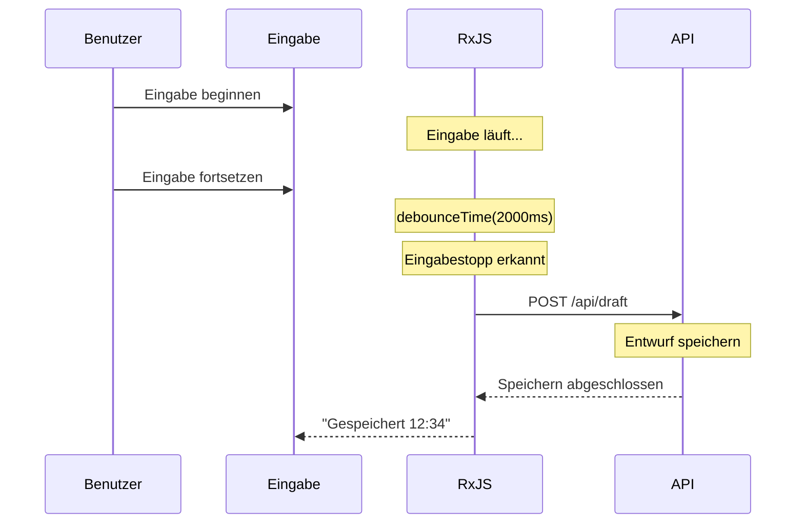

# Formularverarbeitung Muster

Die Formularverarbeitung ist eine der zentralen Funktionen in der Webentwicklung. Mit RxJS können Sie reaktive und benutzerfreundliche Formulare effizient implementieren.

Dieser Artikel erklärt konkrete Muster für die Formularverarbeitung, die in der Praxis benötigt werden, wie Echtzeit-Validierung, automatisches Speichern und die Verknüpfung mehrerer Felder.

## Was Sie in diesem Artikel lernen

- Implementierung von Echtzeit-Validierung
- Auto-Speicherung-Funktion (debounce + distinctUntilChanged)
- Kombination mehrerer Felder (combineLatest)
- Bedingte Feldanzeige
- Submit-Verarbeitung und Doppel-Submit-Schutz (exhaustMap)
- Fehleranzeige und Reset-Verarbeitung
- Formularstatus-Verwaltung

> [!TIP] Voraussetzungen
> Dieser Artikel setzt Kenntnisse aus [Chapter 3: Creation Functions](../creation-functions/index.md) und [Chapter 4: Operatoren](../operators/index.md) voraus.

## Echtzeit-Validierung

### Problem: Bei jeder Eingabe Validierung ausführen

Sie möchten bei jeder Benutzereingabe eine Validierung durchführen und sofortiges Feedback geben.

### Lösung: debounceTime + distinctUntilChanged

```typescript
import { fromEvent, map, debounceTime, distinctUntilChanged } from 'rxjs';
interface ValidationResult {
  valid: boolean;
  message: string;
}

const emailInput = document.createElement('input');
emailInput.id = 'email';
emailInput.type = 'email';
emailInput.placeholder = 'E-Mail-Adresse eingeben';
emailInput.style.padding = '10px';
emailInput.style.margin = '10px';
emailInput.style.width = '300px';
emailInput.style.fontSize = '16px';
emailInput.style.border = '2px solid #ccc';
emailInput.style.borderRadius = '4px';
document.body.appendChild(emailInput);

const emailError = document.createElement('div');
emailError.id = 'email-error';
emailError.style.margin = '0 10px 10px 10px';
emailError.style.color = '#f44336';
emailError.style.fontSize = '14px';
emailError.style.minHeight = '20px';
document.body.appendChild(emailError);

fromEvent(emailInput, 'input').pipe(
  map(event => (event.target as HTMLInputElement).value.trim()),
  debounceTime(300),           // Wartet 300ms nach Eingabestopp
  distinctUntilChanged()       // Ignoriert gleiche Werte
).subscribe(email => {
  const result = validateEmail(email);

  if (result.valid) {
    emailInput.style.borderColor = '#4CAF50';
    emailError.textContent = '';
  } else {
    emailInput.style.borderColor = '#f44336';
    emailError.textContent = result.message;
  }
});

// E-Mail-Validierung
function validateEmail(email: string): ValidationResult {
  if (email.length === 0) {
    return { valid: false, message: 'Bitte E-Mail-Adresse eingeben' };
  }

  const emailRegex = /^[^\s@]+@[^\s@]+\.[^\s@]+$/;
  if (!emailRegex.test(email)) {
    return { valid: false, message: 'E-Mail-Adresse hat falsches Format' };
  }

  return { valid: true, message: '' };
}
```

> [!NOTE] Schlüsselpunkte der Echtzeit-Validierung
> - `debounceTime(300)` wartet auf Eingabestopp (verhindert übermäßige Verarbeitung)
> - `distinctUntilChanged()` verhindert doppelte Validierung
> - Visuelles Feedback für Validierungsergebnisse (CSS-Klassen)

### Mehrere Validierungsregeln kombinieren

```typescript
import { fromEvent, combineLatest, map, debounceTime, distinctUntilChanged, startWith } from 'rxjs';
interface PasswordValidation {
  minLength: boolean;
  hasUpperCase: boolean;
  hasLowerCase: boolean;
  hasNumber: boolean;
  hasSpecialChar: boolean;
}

const passwordInput = document.createElement('input');
passwordInput.id = 'password';
passwordInput.type = 'password';
passwordInput.placeholder = 'Passwort';
passwordInput.style.padding = '10px';
passwordInput.style.margin = '10px';
passwordInput.style.width = '300px';
passwordInput.style.fontSize = '16px';
passwordInput.style.border = '2px solid #ccc';
passwordInput.style.borderRadius = '4px';
passwordInput.style.display = 'block';
document.body.appendChild(passwordInput);

const confirmPasswordInput = document.createElement('input');
confirmPasswordInput.id = 'confirm-password';
confirmPasswordInput.type = 'password';
confirmPasswordInput.placeholder = 'Passwort bestätigen';
confirmPasswordInput.style.padding = '10px';
confirmPasswordInput.style.margin = '10px';
confirmPasswordInput.style.width = '300px';
confirmPasswordInput.style.fontSize = '16px';
confirmPasswordInput.style.border = '2px solid #ccc';
confirmPasswordInput.style.borderRadius = '4px';
confirmPasswordInput.style.display = 'block';
document.body.appendChild(confirmPasswordInput);

const confirmError = document.createElement('div');
confirmError.id = 'confirm-error';
confirmError.style.margin = '0 10px 10px 10px';
confirmError.style.color = '#f44336';
confirmError.style.fontSize = '14px';
confirmError.style.minHeight = '20px';
document.body.appendChild(confirmError);

// Validierungs-Checklisten-Elemente erstellen
const validationContainer = document.createElement('div');
validationContainer.style.margin = '10px';
validationContainer.style.padding = '10px';
validationContainer.style.border = '1px solid #ddd';
validationContainer.style.borderRadius = '4px';
validationContainer.style.width = '300px';
document.body.appendChild(validationContainer);

const checkElements: Record<string, HTMLElement> = {};
const checks = [
  { id: 'check-length', label: 'Mindestens 8 Zeichen' },
  { id: 'check-uppercase', label: 'Enthält Großbuchstaben' },
  { id: 'check-lowercase', label: 'Enthält Kleinbuchstaben' },
  { id: 'check-number', label: 'Enthält Zahlen' },
  { id: 'check-special', label: 'Enthält Sonderzeichen' }
];

checks.forEach(({ id, label }) => {
  const checkEl = document.createElement('div');
  checkEl.id = id;
  checkEl.textContent = `${label}`;
  checkEl.style.padding = '5px';
  checkEl.style.color = '#999';
  validationContainer.appendChild(checkEl);
  checkElements[id] = checkEl;
});

const password$ = fromEvent(passwordInput, 'input').pipe(
  map(event => (event.target as HTMLInputElement).value),
  debounceTime(300),
  distinctUntilChanged(),
  startWith('')
);

const confirmPassword$ = fromEvent(confirmPasswordInput, 'input').pipe(
  map(event => (event.target as HTMLInputElement).value),
  debounceTime(300),
  distinctUntilChanged(),
  startWith('')
);

// Passwort-Validierung
password$.subscribe(password => {
  const validation = validatePassword(password);
  displayPasswordValidation(validation);
});

// Passwort-Übereinstimmung prüfen
combineLatest([password$, confirmPassword$]).subscribe(
  ([password, confirmPassword]) => {
    if (confirmPassword.length === 0) {
      confirmError.textContent = '';
      confirmPasswordInput.style.borderColor = '#ccc';
      return;
    }

    if (password !== confirmPassword) {
      confirmError.textContent = 'Passwörter stimmen nicht überein';
      confirmPasswordInput.style.borderColor = '#f44336';
    } else {
      confirmError.textContent = '';
      confirmPasswordInput.style.borderColor = '#4CAF50';
    }
  }
);

function validatePassword(password: string): PasswordValidation {
  return {
    minLength: password.length >= 8,
    hasUpperCase: /[A-Z]/.test(password),
    hasLowerCase: /[a-z]/.test(password),
    hasNumber: /[0-9]/.test(password),
    hasSpecialChar: /[!@#$%^&*(),.?":{}|<>]/.test(password)
  };
}

function displayPasswordValidation(validation: PasswordValidation): void {
  const checkItems = [
    { id: 'check-length', valid: validation.minLength },
    { id: 'check-uppercase', valid: validation.hasUpperCase },
    { id: 'check-lowercase', valid: validation.hasLowerCase },
    { id: 'check-number', valid: validation.hasNumber },
    { id: 'check-special', valid: validation.hasSpecialChar }
  ];

  checkItems.forEach(({ id, valid }) => {
    const element = checkElements[id];
    if (element) {
      if (valid) {
        element.style.color = '#4CAF50';
        element.style.fontWeight = 'bold';
      } else {
        element.style.color = '#999';
        element.style.fontWeight = 'normal';
      }
    }
  });
}
```

> [!TIP] Verwendung von combineLatest
> Mit `combineLatest` können Sie einfach Validierungen implementieren, die mehrere Feldwerte kombinieren (wie Passwort-Übereinstimmung).

## Auto-Speicherung-Funktion

### Problem: Entwürfe automatisch speichern

Sie möchten Benutzereingaben regelmäßig automatisch speichern, um Datenverlust zu verhindern.

### Lösung: debounceTime + switchMap

```typescript
import { fromEvent, combineLatest, of, map, debounceTime, distinctUntilChanged, switchMap, catchError, tap, startWith } from 'rxjs';
interface DraftData {
  title: string;
  content: string;
  lastSaved?: Date;
}

const titleInput = document.createElement('input');
titleInput.id = 'title';
titleInput.type = 'text';
titleInput.placeholder = 'Titel eingeben';
titleInput.style.padding = '10px';
titleInput.style.margin = '10px';
titleInput.style.width = '500px';
titleInput.style.fontSize = '18px';
titleInput.style.border = '2px solid #ccc';
titleInput.style.borderRadius = '4px';
titleInput.style.display = 'block';
document.body.appendChild(titleInput);

const contentTextarea = document.createElement('textarea');
contentTextarea.id = 'content';
contentTextarea.placeholder = 'Inhalt eingeben';
contentTextarea.rows = 10;
contentTextarea.style.padding = '10px';
contentTextarea.style.margin = '10px';
contentTextarea.style.width = '500px';
contentTextarea.style.fontSize = '16px';
contentTextarea.style.border = '2px solid #ccc';
contentTextarea.style.borderRadius = '4px';
contentTextarea.style.display = 'block';
contentTextarea.style.resize = 'vertical';
document.body.appendChild(contentTextarea);

const saveStatus = document.createElement('div');
saveStatus.id = 'save-status';
saveStatus.style.margin = '10px';
saveStatus.style.fontSize = '14px';
saveStatus.style.color = '#666';
saveStatus.style.minHeight = '20px';
document.body.appendChild(saveStatus);

const title$ = fromEvent(titleInput, 'input').pipe(
  map(event => (event.target as HTMLInputElement).value),
  startWith('')
);

const content$ = fromEvent(contentTextarea, 'input').pipe(
  map(event => (event.target as HTMLTextAreaElement).value),
  startWith('')
);

// Formularänderungen überwachen
combineLatest([title$, content$]).pipe(
  map(([title, content]): DraftData => ({ title, content })),
  debounceTime(2000),          // Wartet 2 Sekunden nach Eingabestopp
  distinctUntilChanged((prev, curr) =>
    prev.title === curr.title && prev.content === curr.content
  ),
  tap(() => {
    saveStatus.textContent = 'Speichern...';
    saveStatus.style.color = '#FF9800';
  }),
  switchMap(draft =>
    saveDraft(draft).pipe(
      map(savedDraft => ({ ...savedDraft, success: true })),
      catchError(err => {
        console.error('Speicherfehler:', err);
        return of({ ...draft, success: false });
      })
    )
  )
).subscribe(result => {
  if (result.success) {
    saveStatus.textContent = `Gespeichert (${formatTime(result.lastSaved!)})`;
    saveStatus.style.color = '#4CAF50';
  } else {
    saveStatus.textContent = 'Speichern fehlgeschlagen';
    saveStatus.style.color = '#f44336';
  }
});

// Entwurf speichern API (Mock)
function saveDraft(draft: DraftData) {
  console.log('Entwurf speichern:', draft);
  return of({
    ...draft,
    lastSaved: new Date()
  });
}

function formatTime(date: Date): string {
  const hours = date.getHours().toString().padStart(2, '0');
  const minutes = date.getMinutes().toString().padStart(2, '0');
  return `${hours}:${minutes}`;
}
```

#### Ablauf der automatischen Speicherung



> [!IMPORTANT] Best Practices für automatisches Speichern
> - **debounceTime**: Angemessene Verzögerung einstellen (1-3 Sekunden)
> - **distinctUntilChanged**: Nicht speichern wenn Inhalt unverändert
> - **switchMap**: Alte Anfragen abbrechen
> - **Visuelles Feedback**: Speicherstatus dem Benutzer anzeigen

## Mehrfach-Feld-Verknüpfung

### Problem: Anzeige basierend auf anderen Feldwerten ändern

Beispiel: Bundesland-Liste ändert sich je nach Land, Versandadresse ändert sich je nach Versandmethode, etc.

### Lösung: combineLatest und withLatestFrom

```typescript
import { fromEvent, of, map, startWith, switchMap } from 'rxjs';
interface Country {
  code: string;
  name: string;
}

interface Prefecture {
  code: string;
  name: string;
  countryCode: string;
}

const countrySelect = document.createElement('select');
countrySelect.id = 'country';
countrySelect.style.padding = '10px';
countrySelect.style.margin = '10px';
countrySelect.style.fontSize = '16px';
countrySelect.style.border = '2px solid #ccc';
countrySelect.style.borderRadius = '4px';
countrySelect.style.display = 'block';

// Land-Optionen hinzufügen
const countries: Country[] = [
  { code: '', name: 'Land auswählen' },
  { code: 'JP', name: 'Japan' },
  { code: 'US', name: 'USA' }
];
countries.forEach(country => {
  const option = document.createElement('option');
  option.value = country.code;
  option.textContent = country.name;
  countrySelect.appendChild(option);
});
document.body.appendChild(countrySelect);

const prefectureSelect = document.createElement('select');
prefectureSelect.id = 'prefecture';
prefectureSelect.style.padding = '10px';
prefectureSelect.style.margin = '10px';
prefectureSelect.style.fontSize = '16px';
prefectureSelect.style.border = '2px solid #ccc';
prefectureSelect.style.borderRadius = '4px';
prefectureSelect.style.display = 'block';

// Leere Option hinzufügen
const emptyOption = document.createElement('option');
emptyOption.value = '';
emptyOption.textContent = 'Bitte auswählen';
prefectureSelect.appendChild(emptyOption);
document.body.appendChild(prefectureSelect);

const country$ = fromEvent(countrySelect, 'change').pipe(
  map(() => countrySelect.value),
  startWith(countrySelect.value)
);

// Bundesland-Liste aktualisieren wenn Land wechselt
country$.pipe(
  switchMap(countryCode =>
    getPrefecturesByCountry(countryCode)
  )
).subscribe(prefectures => {
  updatePrefectureOptions(prefectureSelect, prefectures);
});

// Bundesland-Liste nach Ländercode abrufen (Mock)
function getPrefecturesByCountry(countryCode: string) {
  const prefectures: Record<string, Prefecture[]> = {
    JP: [
      { code: '13', name: 'Tokyo', countryCode: 'JP' },
      { code: '14', name: 'Kanagawa', countryCode: 'JP' },
      { code: '27', name: 'Osaka', countryCode: 'JP' }
    ],
    US: [
      { code: 'CA', name: 'California', countryCode: 'US' },
      { code: 'NY', name: 'New York', countryCode: 'US' },
      { code: 'TX', name: 'Texas', countryCode: 'US' }
    ]
  };

  return of(prefectures[countryCode] || []);
}

function updatePrefectureOptions(
  select: HTMLSelectElement,
  prefectures: Prefecture[]
): void {
  select.innerHTML = '<option value="">Bitte auswählen</option>';

  prefectures.forEach(pref => {
    const option = document.createElement('option');
    option.value = pref.code;
    option.textContent = pref.name;
    select.appendChild(option);
  });
}
```

### Bedingte Feldanzeige

```typescript
import { fromEvent, map, startWith } from 'rxjs';

const shippingMethodSelect = document.createElement('select');
shippingMethodSelect.id = 'shipping-method';
shippingMethodSelect.style.padding = '10px';
shippingMethodSelect.style.margin = '10px';
shippingMethodSelect.style.fontSize = '16px';
shippingMethodSelect.style.border = '2px solid #ccc';
shippingMethodSelect.style.borderRadius = '4px';
shippingMethodSelect.style.display = 'block';

const shippingOptions = [
  { value: '', label: 'Versandart auswählen' },
  { value: 'home-delivery', label: 'Hauslieferung' },
  { value: 'store-pickup', label: 'Filialabholung' }
];
shippingOptions.forEach(option => {
  const optionEl = document.createElement('option');
  optionEl.value = option.value;
  optionEl.textContent = option.label;
  shippingMethodSelect.appendChild(optionEl);
});
document.body.appendChild(shippingMethodSelect);

const homeDeliverySection = document.createElement('div');
homeDeliverySection.id = 'home-delivery';
homeDeliverySection.style.padding = '15px';
homeDeliverySection.style.margin = '10px';
homeDeliverySection.style.border = '2px solid #4CAF50';
homeDeliverySection.style.borderRadius = '4px';
homeDeliverySection.style.backgroundColor = '#f1f8f4';
homeDeliverySection.style.display = 'none';
homeDeliverySection.innerHTML = '<h4 style="margin-top: 0;">Hauslieferung-Informationen eingeben</h4><p>Bitte Adresse, Telefonnummer usw. eingeben</p>';
document.body.appendChild(homeDeliverySection);

const storePickupSection = document.createElement('div');
storePickupSection.id = 'store-pickup';
storePickupSection.style.padding = '15px';
storePickupSection.style.margin = '10px';
storePickupSection.style.border = '2px solid #2196F3';
storePickupSection.style.borderRadius = '4px';
storePickupSection.style.backgroundColor = '#e3f2fd';
storePickupSection.style.display = 'none';
storePickupSection.innerHTML = '<h4 style="margin-top: 0;">Filialabholung-Informationen eingeben</h4><p>Bitte Abholfiliale auswählen</p>';
document.body.appendChild(storePickupSection);

fromEvent(shippingMethodSelect, 'change').pipe(
  map(() => shippingMethodSelect.value),
  startWith(shippingMethodSelect.value)
).subscribe(method => {
  if (method === 'home-delivery') {
    homeDeliverySection.style.display = 'block';
    storePickupSection.style.display = 'none';
  } else if (method === 'store-pickup') {
    homeDeliverySection.style.display = 'none';
    storePickupSection.style.display = 'block';
  } else {
    homeDeliverySection.style.display = 'none';
    storePickupSection.style.display = 'none';
  }
});
```

### Versandkostenberechnung mit mehreren Bedingungen

```typescript
import { combineLatest, fromEvent, map, startWith } from 'rxjs';
interface ShippingCalc {
  country: string;
  weight: number;
  shippingMethod: string;
}

const countrySelect = document.createElement('select');
countrySelect.id = 'country';
countrySelect.style.padding = '10px';
countrySelect.style.margin = '10px';
countrySelect.style.fontSize = '16px';
countrySelect.style.border = '2px solid #ccc';
countrySelect.style.borderRadius = '4px';
countrySelect.style.display = 'block';

const countryOptions = [
  { value: 'JP', label: 'Japan' },
  { value: 'US', label: 'USA' },
  { value: 'OTHER', label: 'Andere' }
];
countryOptions.forEach(option => {
  const optionEl = document.createElement('option');
  optionEl.value = option.value;
  optionEl.textContent = option.label;
  countrySelect.appendChild(optionEl);
});
document.body.appendChild(countrySelect);

const weightInput = document.createElement('input');
weightInput.id = 'weight';
weightInput.type = 'number';
weightInput.placeholder = 'Gewicht (kg)';
weightInput.min = '0';
weightInput.step = '0.1';
weightInput.value = '1';
weightInput.style.padding = '10px';
weightInput.style.margin = '10px';
weightInput.style.width = '200px';
weightInput.style.fontSize = '16px';
weightInput.style.border = '2px solid #ccc';
weightInput.style.borderRadius = '4px';
weightInput.style.display = 'block';
document.body.appendChild(weightInput);

const shippingMethodSelect = document.createElement('select');
shippingMethodSelect.id = 'shipping-method';
shippingMethodSelect.style.padding = '10px';
shippingMethodSelect.style.margin = '10px';
shippingMethodSelect.style.fontSize = '16px';
shippingMethodSelect.style.border = '2px solid #ccc';
shippingMethodSelect.style.borderRadius = '4px';
shippingMethodSelect.style.display = 'block';

const methodOptions = [
  { value: 'standard', label: 'Standardversand' },
  { value: 'express', label: 'Expressversand' }
];
methodOptions.forEach(option => {
  const optionEl = document.createElement('option');
  optionEl.value = option.value;
  optionEl.textContent = option.label;
  shippingMethodSelect.appendChild(optionEl);
});
document.body.appendChild(shippingMethodSelect);

const shippingCostDisplay = document.createElement('div');
shippingCostDisplay.id = 'shipping-cost';
shippingCostDisplay.style.padding = '15px';
shippingCostDisplay.style.margin = '10px';
shippingCostDisplay.style.fontSize = '20px';
shippingCostDisplay.style.fontWeight = 'bold';
shippingCostDisplay.style.color = '#2196F3';
shippingCostDisplay.style.border = '2px solid #2196F3';
shippingCostDisplay.style.borderRadius = '4px';
shippingCostDisplay.style.backgroundColor = '#e3f2fd';
shippingCostDisplay.textContent = 'Versandkosten: €0';
document.body.appendChild(shippingCostDisplay);

const country$ = fromEvent(countrySelect, 'change').pipe(
  map(() => countrySelect.value),
  startWith(countrySelect.value)
);

const weight$ = fromEvent(weightInput, 'input').pipe(
  map(() => parseFloat(weightInput.value) || 0),
  startWith(parseFloat(weightInput.value) || 1)
);

const shippingMethod$ = fromEvent(shippingMethodSelect, 'change').pipe(
  map(() => shippingMethodSelect.value),
  startWith(shippingMethodSelect.value)
);

combineLatest([country$, weight$, shippingMethod$]).pipe(
  map(([country, weight, shippingMethod]): ShippingCalc => ({
    country,
    weight,
    shippingMethod
  })),
  map(calc => calculateShippingCost(calc))
).subscribe(cost => {
  shippingCostDisplay.textContent = `Versandkosten: €${cost.toLocaleString()}`;
});

function calculateShippingCost(calc: ShippingCalc): number {
  let baseCost = 0;

  // Basisgebühr nach Land
  if (calc.country === 'JP') {
    baseCost = 500;
  } else if (calc.country === 'US') {
    baseCost = 2000;
  } else {
    baseCost = 3000;
  }

  // Gewichtszuschlag (über 1kg: 100 pro kg)
  if (calc.weight > 1) {
    baseCost += Math.ceil(calc.weight - 1) * 100;
  }

  // Faktor für Versandart
  if (calc.shippingMethod === 'express') {
    baseCost *= 2;
  }

  return baseCost;
}
```

> [!TIP] Anwendungsfälle für combineLatest
> Optimal für Berechnungen und Anzeigen, die mehrere Feldwerte kombinieren.
> - Versandkostenberechnung (Land + Gewicht + Versandart)
> - Rabattberechnung (Produkt + Gutschein + Mitgliedsstufe)
> - Suchfilter (Kategorie + Preisspanne + Bewertung)

## Submit-Verarbeitung und Doppel-Submit-Schutz

### Problem: Doppeltes Absenden durch Button-Klicks verhindern

Wenn der Submit-Button wiederholt geklickt wird, werden dieselben Daten mehrfach gesendet.

### Lösung: Doppel-Submit mit exhaustMap verhindern

```typescript
import { fromEvent, of, exhaustMap, tap, catchError, finalize } from 'rxjs';
interface FormData {
  name: string;
  email: string;
  message: string;
}

const form = document.createElement('form');
form.id = 'contact-form';
form.style.padding = '20px';
form.style.margin = '10px';
form.style.border = '2px solid #ccc';
form.style.borderRadius = '8px';
form.style.maxWidth = '500px';
form.style.backgroundColor = '#f9f9f9';

const nameInput = document.createElement('input');
nameInput.type = 'text';
nameInput.name = 'name';
nameInput.placeholder = 'Name';
nameInput.required = true;
nameInput.style.padding = '10px';
nameInput.style.margin = '10px 0';
nameInput.style.width = '100%';
nameInput.style.fontSize = '16px';
nameInput.style.border = '1px solid #ccc';
nameInput.style.borderRadius = '4px';
nameInput.style.boxSizing = 'border-box';
form.appendChild(nameInput);

const emailInput = document.createElement('input');
emailInput.type = 'email';
emailInput.name = 'email';
emailInput.placeholder = 'E-Mail-Adresse';
emailInput.required = true;
emailInput.style.padding = '10px';
emailInput.style.margin = '10px 0';
emailInput.style.width = '100%';
emailInput.style.fontSize = '16px';
emailInput.style.border = '1px solid #ccc';
emailInput.style.borderRadius = '4px';
emailInput.style.boxSizing = 'border-box';
form.appendChild(emailInput);

const messageTextarea = document.createElement('textarea');
messageTextarea.name = 'message';
messageTextarea.placeholder = 'Nachricht';
messageTextarea.required = true;
messageTextarea.rows = 5;
messageTextarea.style.padding = '10px';
messageTextarea.style.margin = '10px 0';
messageTextarea.style.width = '100%';
messageTextarea.style.fontSize = '16px';
messageTextarea.style.border = '1px solid #ccc';
messageTextarea.style.borderRadius = '4px';
messageTextarea.style.resize = 'vertical';
messageTextarea.style.boxSizing = 'border-box';
form.appendChild(messageTextarea);

const submitButton = document.createElement('button');
submitButton.id = 'submit-button';
submitButton.type = 'submit';
submitButton.textContent = 'Senden';
submitButton.style.padding = '12px 30px';
submitButton.style.margin = '10px 0';
submitButton.style.fontSize = '16px';
submitButton.style.fontWeight = 'bold';
submitButton.style.color = '#fff';
submitButton.style.backgroundColor = '#2196F3';
submitButton.style.border = 'none';
submitButton.style.borderRadius = '4px';
submitButton.style.cursor = 'pointer';
form.appendChild(submitButton);

document.body.appendChild(form);

const statusMessage = document.createElement('div');
statusMessage.id = 'status-message';
statusMessage.style.padding = '10px';
statusMessage.style.margin = '10px';
statusMessage.style.fontSize = '16px';
statusMessage.style.borderRadius = '4px';
statusMessage.style.minHeight = '20px';
document.body.appendChild(statusMessage);

fromEvent(form, 'submit').pipe(
  tap(event => {
    event.preventDefault();
    submitButton.disabled = true;
    submitButton.textContent = 'Wird gesendet...';
    submitButton.style.backgroundColor = '#999';
    statusMessage.textContent = '';
  }),
  exhaustMap(() => {
    // Formulardaten sammeln
    const formData = new FormData(form);
    const data: FormData = {
      name: formData.get('name') as string,
      email: formData.get('email') as string,
      message: formData.get('message') as string
    };

    return submitForm(data).pipe(
      catchError(err => {
        console.error('Sendefehler:', err);
        return of({ success: false, error: err.message });
      })
    );
  }),
  finalize(() => {
    submitButton.disabled = false;
    submitButton.textContent = 'Senden';
    submitButton.style.backgroundColor = '#2196F3';
  })
).subscribe(result => {
  if (result.success) {
    statusMessage.textContent = 'Erfolgreich gesendet!';
    statusMessage.style.backgroundColor = '#d4edda';
    statusMessage.style.color = '#155724';
    statusMessage.style.border = '1px solid #c3e6cb';
    form.reset();
  } else {
    const errorText = 'error' in result ? result.error : 'Unbekannter Fehler';
    statusMessage.textContent = `Senden fehlgeschlagen: ${errorText}`;
    statusMessage.style.backgroundColor = '#f8d7da';
    statusMessage.style.color = '#721c24';
    statusMessage.style.border = '1px solid #f5c6cb';
  }
});

// Formular-Submit-API (Mock)
function submitForm(data: FormData) {
  console.log('Formular senden:', data);
  return of({ success: true });
}
```

**Funktionsweise von exhaustMap:**

```
Benutzer-Klicks: ●    ●●●        ●
                 |    |          |
exhaustMap:      ●              ●
                 |              |
               API-Send      API-Send
                (nach         (nach
              Abschluss)    Abschluss)

※ Mehrfachklicks während des Sendens werden ignoriert
```

> [!IMPORTANT] Bedeutung von exhaustMap
> **exhaustMap** ignoriert neue Werte, bis das vorherige Observable abgeschlossen ist.
> Dadurch wird:
> - Doppeltes Absenden durch Button-Klicks verhindert
> - Zusätzliche Anfragen während API-Aufruf blockiert
> - Fehlerhafte Bedienung des Benutzers verhindert

### Validierung vor Submit

```typescript
import { fromEvent, combineLatest, map, startWith, exhaustMap, withLatestFrom, filter, tap, of } from 'rxjs';
interface FormData {
  name: string;
  email: string;
  message: string;
}

const form = document.createElement('form');
form.id = 'contact-form';
form.style.padding = '20px';
form.style.margin = '10px';
form.style.border = '2px solid #ccc';
form.style.borderRadius = '8px';
form.style.maxWidth = '500px';
form.style.backgroundColor = '#f9f9f9';

const nameInput = document.createElement('input');
nameInput.id = 'name';
nameInput.type = 'text';
nameInput.placeholder = 'Name';
nameInput.style.padding = '10px';
nameInput.style.margin = '10px 0';
nameInput.style.width = '100%';
nameInput.style.fontSize = '16px';
nameInput.style.border = '1px solid #ccc';
nameInput.style.borderRadius = '4px';
nameInput.style.boxSizing = 'border-box';
form.appendChild(nameInput);

const emailInput = document.createElement('input');
emailInput.id = 'email';
emailInput.type = 'email';
emailInput.placeholder = 'E-Mail-Adresse';
emailInput.style.padding = '10px';
emailInput.style.margin = '10px 0';
emailInput.style.width = '100%';
emailInput.style.fontSize = '16px';
emailInput.style.border = '1px solid #ccc';
emailInput.style.borderRadius = '4px';
emailInput.style.boxSizing = 'border-box';
form.appendChild(emailInput);

const messageTextarea = document.createElement('textarea');
messageTextarea.id = 'message';
messageTextarea.placeholder = 'Nachricht (mindestens 10 Zeichen)';
messageTextarea.rows = 5;
messageTextarea.style.padding = '10px';
messageTextarea.style.margin = '10px 0';
messageTextarea.style.width = '100%';
messageTextarea.style.fontSize = '16px';
messageTextarea.style.border = '1px solid #ccc';
messageTextarea.style.borderRadius = '4px';
messageTextarea.style.resize = 'vertical';
messageTextarea.style.boxSizing = 'border-box';
form.appendChild(messageTextarea);

const submitButton = document.createElement('button');
submitButton.id = 'submit-button';
submitButton.type = 'submit';
submitButton.textContent = 'Senden';
submitButton.disabled = true;
submitButton.style.padding = '12px 30px';
submitButton.style.margin = '10px 0';
submitButton.style.fontSize = '16px';
submitButton.style.fontWeight = 'bold';
submitButton.style.color = '#fff';
submitButton.style.backgroundColor = '#999';
submitButton.style.border = 'none';
submitButton.style.borderRadius = '4px';
submitButton.style.cursor = 'not-allowed';
form.appendChild(submitButton);

document.body.appendChild(form);

// Validierungsstatus jedes Feldes
const nameValid$ = fromEvent(nameInput, 'input').pipe(
  map(() => nameInput.value.trim().length > 0),
  startWith(false)
);

const emailValid$ = fromEvent(emailInput, 'input').pipe(
  map(() => /^[^\s@]+@[^\s@]+\.[^\s@]+$/.test(emailInput.value)),
  startWith(false)
);

const messageValid$ = fromEvent(messageTextarea, 'input').pipe(
  map(() => messageTextarea.value.trim().length >= 10),
  startWith(false)
);

// Alle Felder gültig prüfen
const formValid$ = combineLatest([nameValid$, emailValid$, messageValid$]).pipe(
  map(([name, email, message]) => name && email && message)
);

// Submit-Button aktivieren/deaktivieren
formValid$.subscribe(valid => {
  submitButton.disabled = !valid;
  if (valid) {
    submitButton.style.backgroundColor = '#2196F3';
    submitButton.style.cursor = 'pointer';
  } else {
    submitButton.style.backgroundColor = '#999';
    submitButton.style.cursor = 'not-allowed';
  }
});

// Formular-Submit-Verarbeitung
fromEvent(form, 'submit').pipe(
  tap(event => event.preventDefault()),
  withLatestFrom(formValid$),
  filter(([_, valid]) => valid), // Nur wenn Validierung erfolgreich
  exhaustMap(() => {
    const data = {
      name: nameInput.value,
      email: emailInput.value,
      message: messageTextarea.value
    };

    return submitForm(data);
  })
).subscribe(result => {
  console.log('Senden abgeschlossen:', result);
  form.reset();
});

// Formular-Submit-API (Mock)
function submitForm(data: FormData) {
  console.log('Formular senden:', data);
  return of({ success: true });
}
```

> [!TIP] Verwendung von withLatestFrom
> Mit `withLatestFrom` können Sie den neuesten Validierungsstatus beim Submit überprüfen.

## Fehleranzeige und Reset-Verarbeitung

### Zentrale Verwaltung von Formularfehlern

```typescript
import { BehaviorSubject} from 'rxjs';

class FormErrorManager {
  private errors$ = new BehaviorSubject<Map<string, string>>(new Map());
  private elementCache = new Map<string, { error: HTMLElement; input: HTMLElement }>();

  setError(field: string, message: string): void {
    const currentErrors = this.errors$.value;
    currentErrors.set(field, message);
    this.errors$.next(new Map(currentErrors));
    this.displayError(field, message);
  }

  clearError(field: string): void {
    const currentErrors = this.errors$.value;
    currentErrors.delete(field);
    this.errors$.next(new Map(currentErrors));
    this.hideError(field);
  }

  clearAllErrors(): void {
    this.errors$.next(new Map());
    this.hideAllErrors();
  }

  hasErrors(): boolean {
    return this.errors$.value.size > 0;
  }

  getErrors() {
    return this.errors$.asObservable();
  }

  // Elemente für ein Feld registrieren (muss vor setError/clearError aufgerufen werden)
  registerField(field: string, inputElement: HTMLElement, errorElement: HTMLElement): void {
    this.elementCache.set(field, { input: inputElement, error: errorElement });
  }

  private displayError(field: string, message: string): void {
    const elements = this.elementCache.get(field);
    if (!elements) {
      console.warn(`Field "${field}" not registered. Call registerField() first.`);
      return;
    }

    elements.error.textContent = message;
    elements.error.style.display = 'block';
    elements.input.style.borderColor = '#f44336';
    elements.input.style.backgroundColor = '#ffebee';
  }

  private hideError(field: string): void {
    const elements = this.elementCache.get(field);
    if (!elements) {
      return;
    }

    elements.error.textContent = '';
    elements.error.style.display = 'none';
    elements.input.style.borderColor = '#ccc';
    elements.input.style.backgroundColor = '#fff';
  }

  private hideAllErrors(): void {
    this.elementCache.forEach((elements) => {
      elements.error.style.display = 'none';
      elements.error.textContent = '';
      elements.input.style.borderColor = '#ccc';
      elements.input.style.backgroundColor = '#fff';
    });
  }
}

// Verwendungsbeispiel (Eigenständig: erstellt Formularelemente dynamisch)
const errorManager = new FormErrorManager();

// E-Mail-Eingabe und Fehlerelemente erstellen
const emailInput = document.createElement('input');
emailInput.id = 'email';
emailInput.type = 'email';
emailInput.placeholder = 'E-Mail-Adresse';
emailInput.style.padding = '10px';
emailInput.style.margin = '10px';
emailInput.style.width = '300px';
emailInput.style.fontSize = '16px';
emailInput.style.border = '2px solid #ccc';
emailInput.style.borderRadius = '4px';
emailInput.style.display = 'block';
document.body.appendChild(emailInput);

const emailError = document.createElement('div');
emailError.id = 'email-error';
emailError.style.margin = '0 10px 10px 10px';
emailError.style.color = '#f44336';
emailError.style.fontSize = '14px';
emailError.style.display = 'none';
document.body.appendChild(emailError);

// Passwort-Eingabe und Fehlerelemente erstellen
const passwordInput = document.createElement('input');
passwordInput.id = 'password';
passwordInput.type = 'password';
passwordInput.placeholder = 'Passwort';
passwordInput.style.padding = '10px';
passwordInput.style.margin = '10px';
passwordInput.style.width = '300px';
passwordInput.style.fontSize = '16px';
passwordInput.style.border = '2px solid #ccc';
passwordInput.style.borderRadius = '4px';
passwordInput.style.display = 'block';
document.body.appendChild(passwordInput);

const passwordError = document.createElement('div');
passwordError.id = 'password-error';
passwordError.style.margin = '0 10px 10px 10px';
passwordError.style.color = '#f44336';
passwordError.style.fontSize = '14px';
passwordError.style.display = 'none';
document.body.appendChild(passwordError);

// Felder beim Error-Manager registrieren
errorManager.registerField('email', emailInput, emailError);
errorManager.registerField('password', passwordInput, passwordError);

// Fehler setzen
errorManager.setError('email', 'E-Mail-Adresse hat falsches Format');
errorManager.setError('password', 'Passwort muss mindestens 8 Zeichen haben');

// Fehler löschen
setTimeout(() => {
  errorManager.clearError('email');
}, 2000);

// Alle Fehler löschen
setTimeout(() => {
  errorManager.clearAllErrors();
}, 4000);

// Fehler überwachen
errorManager.getErrors().subscribe(errors => {
  console.log('Aktuelle Fehleranzahl:', errors.size);
});
```

## Formularstatus-Verwaltung

### Vollständige Formularstatus-Verwaltungsklasse

```typescript
import { BehaviorSubject, Observable } from 'rxjs';
interface FormState<T> {
  value: T;
  valid: boolean;
  dirty: boolean;
  touched: boolean;
  submitting: boolean;
}

class ReactiveForm<T extends Record<string, any>> {
  private state$: BehaviorSubject<FormState<T>>;
  private validators: Map<keyof T, ((value: any) => boolean)[]> = new Map();

  constructor(initialValue: T) {
    this.state$ = new BehaviorSubject<FormState<T>>({
      value: initialValue,
      valid: false,
      dirty: false,
      touched: false,
      submitting: false
    });
  }

  // Feldwert aktualisieren
  setValue(field: keyof T, value: any): void {
    const currentState = this.state$.value;
    const newValue = { ...currentState.value, [field]: value };

    this.state$.next({
      ...currentState,
      value: newValue,
      valid: this.validateForm(newValue),
      dirty: true
    });
  }

  // Validator hinzufügen
  addValidator(field: keyof T, validator: (value: any) => boolean): void {
    const validators = this.validators.get(field) || [];
    validators.push(validator);
    this.validators.set(field, validators);
  }

  // Gesamtes Formular validieren
  private validateForm(value: T): boolean {
    for (const [field, validators] of this.validators.entries()) {
      const fieldValue = value[field];
      const isValid = validators.every(validator => validator(fieldValue));
      if (!isValid) return false;
    }
    return true;
  }

  // Touched-Flag setzen
  setTouched(field: keyof T): void {
    const currentState = this.state$.value;
    this.state$.next({
      ...currentState,
      touched: true
    });
  }

  // Submit-Status setzen
  setSubmitting(submitting: boolean): void {
    const currentState = this.state$.value;
    this.state$.next({
      ...currentState,
      submitting
    });
  }

  // Formular zurücksetzen
  reset(initialValue?: T): void {
    const resetValue = initialValue || this.state$.value.value;
    this.state$.next({
      value: resetValue,
      valid: false,
      dirty: false,
      touched: false,
      submitting: false
    });
  }

  // Status abrufen
  getState(): Observable<FormState<T>> {
    return this.state$.asObservable();
  }

  getValue(): T {
    return this.state$.value.value;
  }

  isValid(): boolean {
    return this.state$.value.valid;
  }

  isDirty(): boolean {
    return this.state$.value.dirty;
  }
}

// Verwendungsbeispiel
interface UserForm {
  name: string;
  email: string;
  age: number;
}

const userForm = new ReactiveForm<UserForm>({
  name: '',
  email: '',
  age: 0
});

// Validator hinzufügen
userForm.addValidator('name', value => value.length > 0);
userForm.addValidator('email', value => /^[^\s@]+@[^\s@]+\.[^\s@]+$/.test(value));
userForm.addValidator('age', value => value >= 18);

// Werte aktualisieren
userForm.setValue('name', 'Max Mustermann');
userForm.setValue('email', 'max@example.com');
userForm.setValue('age', 25);

// Status überwachen
userForm.getState().subscribe(state => {
  console.log('Formularstatus:', state);
  console.log('Gültig:', state.valid);
  console.log('Geändert:', state.dirty);
});

// Formular absenden
if (userForm.isValid()) {
  userForm.setSubmitting(true);
  const formData = userForm.getValue();
  console.log('Sendedaten:', formData);

  // Nach API-Aufruf
  userForm.setSubmitting(false);
  userForm.reset();
}
```

> [!TIP] Vorteile einer benutzerdefinierten Formularklasse
> - **Zentralisierte Status-Verwaltung**: Alle Formularstatus an einem Ort verwalten
> - **Integrierte Validierung**: Flexibel Validierungsregeln pro Feld festlegen
> - **Reaktive Aktualisierungen**: Statusänderungen automatisch benachrichtigen
> - **Wiederverwendbarkeit**: Gleiche Logik für mehrere Formulare verwenden

## Testcode

Beispiel für Tests der Formularverarbeitung.

```typescript
import { debounceTime, map } from 'rxjs';
import { TestScheduler } from 'rxjs/testing';

describe('Formularverarbeitung', () => {
  let testScheduler: TestScheduler;

  beforeEach(() => {
    testScheduler = new TestScheduler((actual, expected) => {
      expect(actual).toEqual(expected);
    });
  });

  it('should validate email with debounce', () => {
    testScheduler.run(({ cold, expectObservable }) => {
      const input$ = cold('a-b-c----|', {
        a: 'test',
        b: 'test@',
        c: 'test@example.com'
      });

      const result$ = input$.pipe(
        debounceTime(300, testScheduler),
        map(email => /^[^\s@]+@[^\s@]+\.[^\s@]+$/.test(email))
      );

      expectObservable(result$).toBe('-----c----|', { c: true });
    });
  });

  it('should prevent double submit with exhaustMap', () => {
    testScheduler.run(({ cold, hot, expectObservable }) => {
      const submit$ = hot('a--b-c----d|');

      const result$ = submit$.pipe(
        exhaustMap(() => cold('---x|', { x: 'submitted' }))
      );

      // Nur erstes und letztes Submit werden verarbeitet
      expectObservable(result$).toBe('---x-----x|', { x: 'submitted' });
    });
  });
});
```

## Zusammenfassung

Durch die Beherrschung von Formularverarbeitungsmustern können Sie benutzerfreundliche und robuste Formulare implementieren.

> [!IMPORTANT] Wichtige Punkte
> - **Echtzeit-Validierung**: debounceTime + distinctUntilChanged
> - **Auto-Speicherung**: debounceTime + switchMap verhindert übermäßiges Speichern
> - **Mehrfach-Feld-Verknüpfung**: combineLatest kombiniert Werte
> - **Doppel-Submit-Schutz**: exhaustMap blockiert zusätzliche Anfragen während des Sendens
> - **Status-Verwaltung**: BehaviorSubject für zentrale Formularstatus-Verwaltung

> [!TIP] Best Practices
> - **Sofortiges Feedback**: UX-Verbesserung durch Echtzeit-Validierung
> - **Angemessene Verzögerung**: debounceTime-Einstellung (300ms-2000ms)
> - **Visuelles Feedback**: Fehler und Speicherstatus klar anzeigen
> - **Barrierefreiheit**: Aria-Attribute, angemessene Platzierung von Fehlermeldungen
> - **Testing**: Validierungslogik immer testen

## Nächste Schritte

Nach dem Erlernen von Formularverarbeitungsmustern fahren Sie mit folgenden Mustern fort:

- [API-Aufrufe](./api-calls.md) - Formular-Submit und API-Integration
- [UI-Ereignisverarbeitung](./ui-events.md) - UI-Ereignisse in Formularen
- [Echtzeit-Datenverarbeitung](./real-time-data.md) - Echtzeit-Validierung, serverseitige Validierung
- [Cache-Strategien](./caching-strategies.md) - Caching von Formulardaten

## Verwandte Abschnitte

- [Chapter 3: Creation Functions](../creation-functions/index.md) - Details zu combineLatest, withLatestFrom
- [Chapter 4: Operatoren](../operators/index.md) - Details zu debounceTime, exhaustMap
- [Chapter 5: Subject](../subjects/what-is-subject.md) - Verwendung von BehaviorSubject

## Referenzen

- [RxJS Offiziell: combineLatest](https://rxjs.dev/api/index/function/combineLatest) - Details zu combineLatest
- [RxJS Offiziell: exhaustMap](https://rxjs.dev/api/operators/exhaustMap) - Details zu exhaustMap
- [Learn RxJS: Form Handling](https://www.learnrxjs.io/) - Praxisbeispiele für Formularverarbeitung
