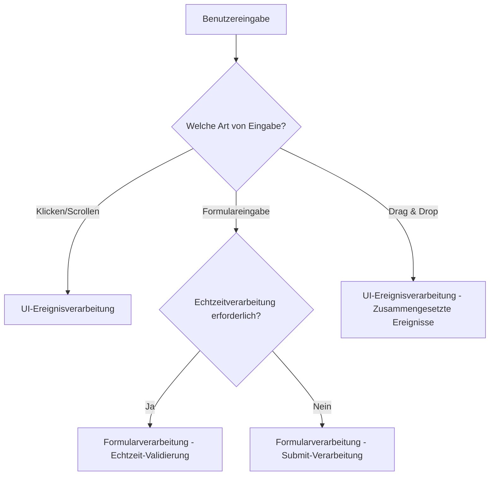
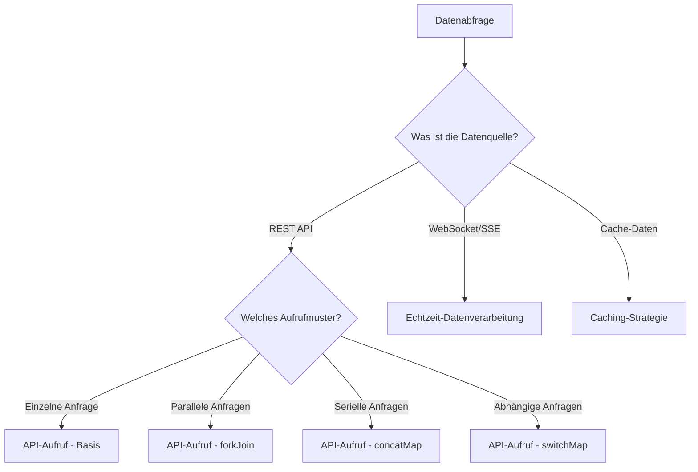
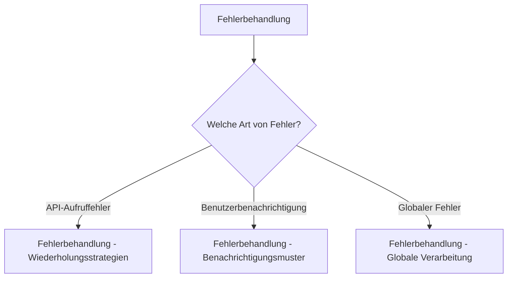

# Sammlung praktischer Muster

Wenn Sie die Grundlagen von RxJS beherrschen, stellt sich die Frage, wie Sie es in der konkreten Anwendungsentwicklung einsetzen können. In diesem Kapitel werden konkrete Implementierungsmuster für in der Praxis häufig anzutreffende Szenarien vorgestellt.

## Warum sind praktische Muster wichtig?

Auch wenn Sie die einzelnen Operatoren von RxJS verstehen, brauchen Sie Erfahrung und Wissen über Patterns, um sie zur Lösung realer Probleme zu kombinieren. Durch das Erlernen praktischer Patterns:

- **Beschleunigung der Entwicklung** - Sie müssen das Rad nicht neu erfinden und können bewährte Muster anwenden
- **Verbesserung der Qualität** - Erlernen von Best Practices wie Fehlerbehandlung und Vermeidung von Speicherlecks
- **Verbesserte Wartbarkeit** - konsistente Muster verbessern die Lesbarkeit und Wartbarkeit des Codes
- **Fehlerbehebung** - Identifizierung der Ursache von Problemen und Auswahl geeigneter Lösungen

## Aufbau dieses Kapitels

Die praktischen Muster sind in drei Phasen unterteilt, die sich nach Schwierigkeitsgrad und Häufigkeit der Anwendung richten.

### Kernmuster (am häufigsten)

Dies sind die Grundmuster, die in der Praxis am häufigsten verwendet werden. Beherrschen Sie diese zuerst.

| Muster | Inhalt | Hauptziel |
|---------|------|---------|
| [UI-Ereignisverarbeitung](./ui-events.md) | UI-Operationen wie Klick, Scrollen, Drag & Drop | Front-End allgemein |
| [API-Aufrufe](./api-calls.md) | HTTP-Kommunikation, parallele/serielle Verarbeitung, Fehlerbehandlung | Web-API-Integration |
| [Formularverarbeitung](./form-handling.md) | Validierung in Echtzeit, automatisches Speichern, Verknüpfung mehrerer Felder | Formularimplementierung |

### Erweiterte Muster

Erweiterte Muster für komplexere Szenarien.

| Muster | Inhalt | Hauptziel |
|---------|------|---------|
| [Erweiterte Formularmuster](./advanced-form-patterns.md) | JSON-Patch, automatisches Speichern großer Formulare, Undo/Redo, kollaborative Bearbeitung | Unternehmensformulare |
| [Echtzeit-Datenverarbeitung](./real-time-data.md) | WebSockets, SSE, Polling, Verbindungsverwaltung | Echtzeitkommunikation |
| [Caching-Strategien](./caching-strategies.md) | Daten-Caching, TTL, Invalidierung, Offline-Unterstützung | Leistungsoptimierung |

### Spezialmuster

Spezialisierte Muster für bestimmte Herausforderungen.

| Muster | Inhalt | Hauptziel |
|---------|------|---------|
| [Fehlerbehandlung in der Praxis](./error-handling-patterns.md) | API-Aufruffehler, Wiederholungsstrategien, globale Fehlerbehandlung | Fehlerverwaltung |
| [Bedingte Verzweigung in subscribe](./subscribe-branching.md) | Vermeidung von Verzweigungen in subscribe, Verzweigungsmethoden in Pipelines | Codequalität |

> [!TIP] Lernprogression
> Es wird empfohlen, dass Anfänger in der Reihenfolge von Phase 1 an vorgehen. Insbesondere die "API-Aufrufe" und die "Formularverarbeitung" sind wesentliche Muster in der Praxis.

## Aufbau der Muster

Jede Musterseite wird durch die folgende Struktur beschrieben:

1. **Problembeschreibung** - das Problem, das dieses Muster löst
2. **Basisimplementierung** - das einfachste Implementierungsbeispiel
3. **Praktische Beispiele** - konkreter Code, der in der Praxis verwendet werden kann
4. **Vorher/Nachher-Vergleich** - Vergleich des Codes vor und nach den Verbesserungen
5. **Vorsichtsmaßnahmen und Best Practices** - Häufige Fehler und Gegenmaßnahmen
6. **TypeScript-Typdefinitionen** - wie man Typsicherheit implementiert
7. **Testcode** - wie man Muster testet
8. **Leistungsüberlegungen** - Speicherlecks und Leistungsoptimierung

## Leitlinien für die Musterauswahl

Leitlinien für die Auswahl des geeigneten Musters je nach der zu implementierenden Funktionalität.

### Beim Umgang mit Benutzereingaben



### Beim Umgang mit Datenabfragen



### Für verbesserte Fehlerbehandlung



## Konzepte für die Implementierung

In diesem Abschnitt werden die grundlegenden Konzepte für die Implementierung von RxJS-Mustern vorgestellt.

### 1. Deklarativ denken

Drücken Sie das, was Sie tun wollen, deklarativ aus und vermeiden Sie prozeduralen Code.

```typescript
// ❌ Prozedural (imperativ)
let result = [];
source.subscribe(value => {
  if (value > 10) {
    const transformed = value * 2;
    result.push(transformed);
  }
});

// ✅ Deklarativ
const result$ = source.pipe(
  filter(value => value > 10),
  map(value => value * 2)
);
```

### 2. Prozesse in Pipelines aufbauen

Komplexe Prozesse durch die Kombination kleiner Operatoren aufbauen.

```typescript
const searchResults$ = searchInput$.pipe(
  debounceTime(300),           // 300ms auf Eingabe warten
  distinctUntilChanged(),      // Duplikate eliminieren
  filter(query => query.length >= 2), // Suche ab 2 Zeichen
  switchMap(query => searchAPI(query)), // API-Aufruf
  catchError(err => of([]))    // Leeres Array bei Fehler
);
```

### 3. Speicherlecks verhindern

Eine ordnungsgemäße Verwaltung der Abonnements ist unerlässlich.

```typescript
// ✅ Automatische Kündigung mit takeUntil
private destroy$ = new Subject<void>();

ngOnInit() {
  this.data$.pipe(
    takeUntil(this.destroy$)
  ).subscribe(/*...*/);
}

ngOnDestroy() {
  this.destroy$.next();
  this.destroy$.complete();
}
```

### 4. Fehlerbehandlung nicht vergessen

Implementierung einer Fehlerbehandlung für alle asynchronen Prozesse.

```typescript
// ✅ Ordnungsgemäße Fehlerbehandlung mit catchError
apiCall$.pipe(
  retry(3),
  catchError(err => {
    console.error('API error:', err);
    return of(defaultValue);
  })
).subscribe(/*...*/);
```

### 5. Typsicherheit nutzen

Nutzen Sie das Typsystem von TypeScript optimal aus.

```typescript
interface User {
  id: number;
  name: string;
  email: string;
}

// ✅ Klare Typdefinitionen
const users$: Observable<User[]> = fetchUsers();
const activeUsers$: Observable<User[]> = users$.pipe(
  map(users => users.filter(u => u.isActive))
);
```

## Bezug zum vorhandenen Wissen

Die Muster in diesem Kapitel wenden das in den vorherigen Kapiteln gelernte Wissen in der Praxis an.

| Praktisches Muster | Verwandtes Kapitel | Anzuwendendes Wissen |
|------------|-----------|------------|
| UI-Ereignisverarbeitung | [Kapitel 4: Operatoren](/de/guide/operators/index.md) | debounceTime, throttleTime, distinctUntilChanged |
| API-Aufrufe | [Kapitel 6: Fehlerbehandlung](/de/guide/error-handling/strategies.md) | catchError, retry, timeout |
| Formularverarbeitung | [Kapitel 3: Creation Functions](/de/guide/creation-functions/index.md) | combineLatest, withLatestFrom |
| Erweiterte Formularmuster | [Kapitel 4: Transformationsoperatoren](/de/guide/operators/transformation/pairwise.md) | pairwise, scan, bufferTime, concatMap |
| Echtzeitdaten | [Kapitel 5: Subject](/de/guide/subjects/what-is-subject.md) | Subject, BehaviorSubject, shareReplay |
| Caching-Strategie | [Kapitel 2: Cold/Hot](/de/guide/observables/cold-and-hot-observables.md) | shareReplay, share |
| Fehlerbehandlung | [Kapitel 6: Fehlerbehandlung](/de/guide/error-handling/strategies.md) | catchError, retry, retryWhen |
| Subscribe-Verzweigung | [Kapitel 10: Anti-Patterns](/de/guide/anti-patterns/index.md) | Vermeidung von Anti-Patterns |

> [!NOTE] Wann überprüfen
> Bevor Sie sich mit den einzelnen Mustern befassen, sollten Sie die entsprechenden Kapitel lesen, um ein besseres Verständnis zu erlangen.

## Häufig gestellte Fragen

### Q1: Von welchem Muster sollte ich lernen?

**A:** Wir empfehlen, in der Reihenfolge zu lernen, die in der Praxis am häufigsten verwendet wird.

1. **API-Aufrufe** - die Grundlagen der Webentwicklung
2. **Formularverarbeitung** - Verarbeitung von Benutzereingaben
3. **UI-Ereignisverarbeitung** - interaktive Benutzeroberfläche
4. **Fehlerbehandlung** - robuste Anwendungen
5. Andere Muster - je nach Projektanforderungen

### Q2: Kann ich die Muster so verwenden, wie sie sind?

**A:** Ja. Die Muster in diesem Kapitel sind für den praktischen Einsatz gedacht.
Dennoch:

- Passen Sie sie entsprechend den Anforderungen Ihres Projekts an
- Berücksichtigen Sie Leistung und Speicherverbrauch
- Befolgen Sie die Kodierungskonventionen Ihres Teams

### Q3: Kann ich es mit Angular/React/Vue verwenden?

**A:** Ja. Die Muster in diesem Kapitel sind Framework-unabhängig.
Allerdings:

- Siehe Kapitel 15: Framework-Integration (in Vorbereitung) für Framework-spezifische Integrationsmethoden
- Die Abmeldung ist für den Lebenszyklus eines jeden Frameworks erforderlich

## Zusammenfassung

Die Sammlung praktischer Muster ist ein konkreter Leitfaden für den Einsatz von RxJS in realen Projekten.

> [!IMPORTANT] Wichtige Punkte
> - Von den **Kernmustern in Phase 1** der Reihe nach lernen
> - Verbesserungen mit **Vorher/Nachher-Vergleichen** verstehen
> - **Speicherleck-Prävention** immer implementieren
> - **Fehlerbehandlung** nicht vergessen
> - **Typsicherheit** nutzen

> [!TIP] Lerntipps
> - Code praktisch ausführen, um das Verständnis zu vertiefen
> - Versuchen Sie, es auf Ihre eigenen Projekte anzuwenden
> - Kombinieren Sie Muster, um komplexe Prozesse zu erstellen
> - Lernen Sie auch Testcode

Als nächsten Schritt empfehlen wir, mit dem am häufigsten verwendeten [API-Aufrufmuster](./api-calls.md) zu beginnen.

## Referenz-Ressourcen

- [Offizielle RxJS-Dokumentation](https://rxjs.dev/) - Offizielle API-Referenz
- [Learn RxJS](https://www.learnrxjs.io/) - Praktische Beispiele nach Operatoren
- [RxJS Marbles](https://rxmarbles.com/) - Operatorverhalten visuell verstehen
- [Kapitel 11: RxJS-Schwierigkeiten überwinden](/de/guide/overcoming-difficulties/index.md) - Häufige Schwierigkeiten und wie man sie überwindet
- [Kapitel 10: Anti-Pattern-Sammlung](/de/guide/anti-patterns/index.md) - Zu vermeidende Muster
