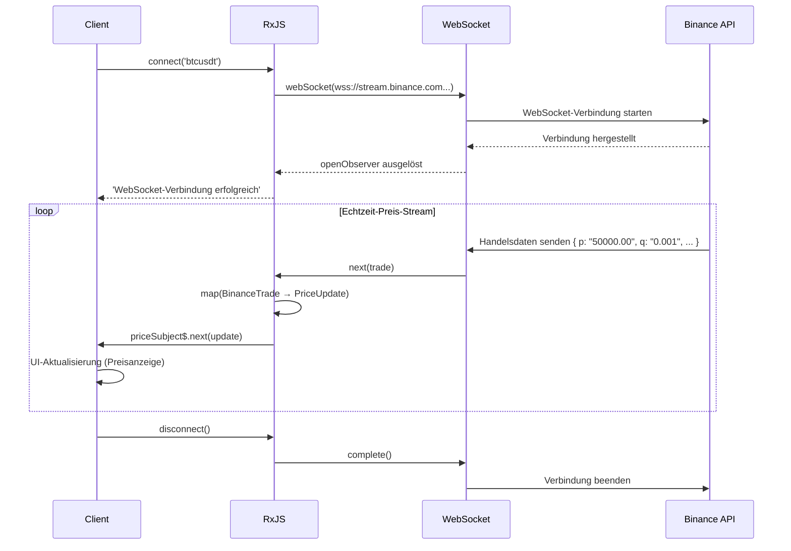

# Echtzeit-Datenverarbeitungsmuster

Die Echtzeit-Datenverarbeitung ist eine wichtige Funktion in modernen Webanwendungen wie Chat, Benachrichtigungen, Aktienkursaktualisierungen und IoT-Sensorüberwachung. Mit RxJS können Sie komplexe Echtzeit-Kommunikation deklarativ und robust implementieren.

Dieser Artikel erklärt konkrete Muster für die Echtzeit-Datenverarbeitung, die in der Praxis benötigt werden, wie WebSocket, Server-Sent Events (SSE) und Polling.

## Was Sie in diesem Artikel lernen werden

- Implementierung und Verwaltung der WebSocket-Kommunikation
- Nutzung von Server-Sent Events (SSE)
- Echtzeit-Aktualisierungen durch Polling
- Verbindungsverwaltung und automatische Wiederverbindung
- Zusammenführen und Aktualisieren von Daten
- Aufbau eines Echtzeit-Benachrichtigungssystems
- Fehlerbehandlung und Verbindungsstatusverwaltung

> [!TIP] Vorausgesetztes Wissen
> Dieser Artikel setzt Kenntnisse von [Kapitel 5: Subject](../subjects/what-is-subject.md) und [Kapitel 4: Operatoren](../operators/index.md) voraus. Das Verständnis von `Subject`, `shareReplay`, `retry` und `retryWhen` ist besonders wichtig.

## WebSocket-Kommunikation

### Problem: Bidirektionale Echtzeit-Kommunikation implementieren

Für Kryptowährungspreise, Aktienkursaktualisierungen, Chat-Anwendungen usw. ist bidirektionale Echtzeit-Kommunikation zwischen Server und Client erforderlich. In diesem Beispiel verwenden wir eine öffentlich verfügbare WebSocket-API, um Kryptowährungspreise in Echtzeit zu überwachen.

### Lösung: Verwendung von RxJS webSocket

Mit der **öffentlichen WebSocket-API von Binance** werden Bitcoin-Handelsdaten in Echtzeit abgerufen. Dieser Code ist sofort ausführbar und es fließen tatsächliche Preisdaten.

```typescript
import { EMPTY, Subject, retry, catchError, tap, map } from 'rxjs';
import { webSocket, WebSocketSubject } from 'rxjs/webSocket';

// Binance WebSocket API Handelsdatentyp
// https://binance-docs.github.io/apidocs/spot/en/#trade-streams
interface BinanceTrade {
  e: string;      // Event-Typ "trade"
  E: number;      // Event-Zeit
  s: string;      // Symbol "BTCUSDT"
  t: number;      // Handels-ID
  p: string;      // Preis
  q: string;      // Menge
  T: number;      // Handelszeit
  m: boolean;     // Ist der Käufer Market Maker
}

// Kompakter Typ für Anzeige
interface PriceUpdate {
  symbol: string;
  price: number;
  quantity: number;
  time: Date;
  isBuyerMaker: boolean;
}

class CryptoPriceService {
  private socket$: WebSocketSubject<BinanceTrade> | null = null;
  private priceSubject$ = new Subject<PriceUpdate>();

  public prices$ = this.priceSubject$.asObservable();

  /**
   * Verbindung zur öffentlichen WebSocket-API von Binance
   * @param symbol Kryptowährungspaar (z.B. "btcusdt", "ethusdt")
   */
  connect(symbol: string = 'btcusdt'): void {
    if (!this.socket$ || this.socket$.closed) {
      // Öffentliche WebSocket-API von Binance (keine Authentifizierung erforderlich)
      const url = `wss://stream.binance.com:9443/ws/${symbol}@trade`;

      this.socket$ = webSocket<BinanceTrade>({
        url,
        openObserver: {
          next: () => {
            console.log(`WebSocket-Verbindung erfolgreich: ${symbol.toUpperCase()}`);
          }
        },
        closeObserver: {
          next: () => {
            console.log('WebSocket-Verbindung beendet');
          }
        }
      });

      this.socket$.pipe(
        // Binance-Daten für Anzeige umwandeln
        map(trade => ({
          symbol: trade.s,
          price: parseFloat(trade.p),
          quantity: parseFloat(trade.q),
          time: new Date(trade.T),
          isBuyerMaker: trade.m
        })),
        tap(update => console.log('Preisaktualisierung:', update.price)),
        retry({
          count: 5,
          delay: 1000
        }),
        catchError(err => {
          console.error('WebSocket-Fehler:', err);
          return EMPTY;
        })
      ).subscribe(priceUpdate => {
        this.priceSubject$.next(priceUpdate);
      });
    }
  }

  disconnect(): void {
    if (this.socket$) {
      this.socket$.complete();
      this.socket$ = null;
    }
  }
}

// UI-Elemente dynamisch erstellen
const priceContainer = document.createElement('div');
priceContainer.id = 'price-display';
priceContainer.style.padding = '20px';
priceContainer.style.margin = '10px';
priceContainer.style.border = '2px solid #f0b90b'; // Binance-Farbe
priceContainer.style.borderRadius = '8px';
priceContainer.style.backgroundColor = '#1e2329';
priceContainer.style.color = '#eaecef';
priceContainer.style.fontFamily = 'monospace';
document.body.appendChild(priceContainer);

const latestPriceDisplay = document.createElement('div');
latestPriceDisplay.style.fontSize = '32px';
latestPriceDisplay.style.fontWeight = 'bold';
latestPriceDisplay.style.marginBottom = '10px';
priceContainer.appendChild(latestPriceDisplay);

const tradesContainer = document.createElement('div');
tradesContainer.style.maxHeight = '400px';
tradesContainer.style.overflowY = 'auto';
tradesContainer.style.fontSize = '14px';
priceContainer.appendChild(tradesContainer);

// Verwendungsbeispiel
const priceService = new CryptoPriceService();
priceService.connect('btcusdt'); // Bitcoin/USDT Handelsdaten

// Preisaktualisierungen empfangen
priceService.prices$.subscribe(update => {
  // Aktuellen Preis groß anzeigen
  latestPriceDisplay.textContent = `${update.symbol}: $${update.price.toLocaleString('en-US', { minimumFractionDigits: 2 })}`;
  latestPriceDisplay.style.color = update.isBuyerMaker ? '#f6465d' : '#0ecb81'; // Verkauf/Kauf farblich unterscheiden

  // Handelshistorie anzeigen
  displayTrade(update, tradesContainer);
});

function displayTrade(update: PriceUpdate, container: HTMLElement): void {
  const tradeElement = document.createElement('div');
  tradeElement.style.padding = '5px';
  tradeElement.style.margin = '3px 0';
  tradeElement.style.borderBottom = '1px solid #2b3139';
  tradeElement.style.color = update.isBuyerMaker ? '#f6465d' : '#0ecb81';

  const timeStr = update.time.toLocaleTimeString('de-DE');
  const side = update.isBuyerMaker ? 'Verkauf' : 'Kauf';
  tradeElement.textContent = `[${timeStr}] ${side} $${update.price.toFixed(2)} × ${update.quantity.toFixed(4)}`;

  container.insertBefore(tradeElement, container.firstChild);

  // Maximal 50 Einträge behalten
  while (container.children.length > 50) {
    container.removeChild(container.lastChild!);
  }
}

// Bereinigungsbeispiel
// priceService.disconnect();
```

> [!TIP] Öffentliche WebSocket-API zum Ausprobieren
> Dieser Code **funktioniert sofort durch Kopieren und Einfügen**. Die öffentliche WebSocket-API von Binance benötigt keine Authentifizierung und liefert Echtzeit-Kryptowährungs-Handelsdaten.
>
> **Sie können auch andere Kryptowährungspaare ausprobieren**:
> - `priceService.connect('ethusdt')` - Ethereum/USDT
> - `priceService.connect('bnbusdt')` - BNB/USDT
> - `priceService.connect('adausdt')` - Cardano/USDT
>
> Details: [Binance WebSocket API Docs](https://binance-docs.github.io/apidocs/spot/en/#websocket-market-streams)

**WebSocket-Kommunikationsfluss:**



> [!IMPORTANT] WebSocket-Eigenschaften
> - **Bidirektionale Kommunikation**: Sowohl Server als auch Client können senden (in diesem Beispiel nur Empfang)
> - **Echtzeit**: Geringere Latenz als HTTP, Preisaktualisierungen im Millisekundenbereich
> - **Statusverwaltung**: Verbindung/Trennung muss ordnungsgemäß verwaltet werden
> - **Subject**: WebSocketSubject hat sowohl Subject- als auch Observable-Eigenschaften
> - **Wiederverbindung**: Automatische Wiederverbindung bei Netzwerkunterbrechung ist wichtig (wird im nächsten Abschnitt erläutert)

### Implementierung der automatischen Wiederverbindung

WebSocket-Verbindungen können durch Netzwerkausfälle oder Server-Neustarts getrennt werden. Die Implementierung der automatischen Wiederverbindung verbessert die Benutzererfahrung.

**Wichtigkeit der Wiederverbindung**:
- In mobilen Umgebungen treten häufig vorübergehende Netzwerkunterbrechungen auf
- Automatische Wiederherstellung während der Serverwartung
- Benutzer müssen nicht manuell wiederverbinden

Das Folgende ist ein Implementierungsbeispiel für automatische Wiederverbindung mit exponentieller Backoff-Strategie.

```typescript
import { retryWhen, delay, tap, take } from 'rxjs';
import { webSocket, WebSocketSubject } from 'rxjs/webSocket';

class ReconnectingWebSocketService {
  private socket$: WebSocketSubject<any> | null = null;
  private reconnectAttempts = 0;
  private maxReconnectAttempts = 5;

  connect(url: string): WebSocketSubject<any> {
    if (!this.socket$ || this.socket$.closed) {
      this.socket$ = webSocket({
        url,
        openObserver: {
          next: () => {
            console.log('WebSocket-Verbindung erfolgreich');
            this.reconnectAttempts = 0; // Zähler bei erfolgreicher Verbindung zurücksetzen
          }
        },
        closeObserver: {
          next: (event) => {
            console.log('WebSocket getrennt:', event);
            this.socket$ = null;
          }
        }
      });

      // Automatische Wiederverbindung
      this.socket$.pipe(
        retryWhen(errors =>
          errors.pipe(
            tap(() => {
              this.reconnectAttempts++;
              console.log(`Wiederverbindungsversuch ${this.reconnectAttempts}/${this.maxReconnectAttempts}`);
            }),
            delay(this.getReconnectDelay()),
            take(this.maxReconnectAttempts)
          )
        )
      ).subscribe({
        next: message => console.log('Empfangen:', message),
        error: err => console.error('Maximale Anzahl von Wiederverbindungsversuchen erreicht:', err)
      });
    }

    return this.socket$;
  }

  private getReconnectDelay(): number {
    // Exponentielles Backoff: 1s, 2s, 4s, 8s, 16s
    return Math.min(1000 * Math.pow(2, this.reconnectAttempts), 16000);
  }

  disconnect(): void {
    if (this.socket$) {
      this.socket$.complete();
      this.socket$ = null;
    }
  }
}
```

> [!TIP] Wiederverbindungsstrategie
> - **Exponentielles Backoff**: Wiederverbindungsintervall schrittweise verlängern (1s→2s→4s...)
> - **Maximale Versuche**: Endlosschleife verhindern
> - **Bei erfolgreicher Verbindung zurücksetzen**: Zähler auf 0 setzen
> - **Benutzerbenachrichtigung**: Verbindungsstatus in UI anzeigen

### Verbindungsstatusverwaltung

Durch **explizite Verwaltung des Verbindungsstatus** können Sie dem Benutzer angemessenes Feedback geben. Der Benutzer kann den aktuellen Verbindungsstatus (verbindend, verbunden, wiederverbindend, Fehler usw.) jederzeit nachverfolgen.

**Vorteile der Verbindungsstatusverwaltung**:
- Steuerung der Ladeanzeige (Spinner während Verbindung)
- Anzeige von Fehlermeldungen (bei Verbindungsfehler)
- Angemessenes Feedback an Benutzer ("Wiederverbindung läuft..." usw.)
- Vereinfachtes Debugging (Statusübergänge verfolgbar)

Im folgenden Beispiel wird `BehaviorSubject` verwendet, um den Verbindungsstatus reaktiv zu verwalten.

```typescript
import { BehaviorSubject, Observable } from 'rxjs';
import { webSocket, WebSocketSubject } from 'rxjs/webSocket';

enum ConnectionState {
  CONNECTING = 'connecting',
  CONNECTED = 'connected',
  DISCONNECTED = 'disconnected',
  RECONNECTING = 'reconnecting',
  FAILED = 'failed'
}

class WebSocketManager {
  private socket$: WebSocketSubject<any> | null = null;
  private connectionState$ = new BehaviorSubject<ConnectionState>(
    ConnectionState.DISCONNECTED
  );

  getConnectionState(): Observable<ConnectionState> {
    return this.connectionState$.asObservable();
  }

  connect(url: string): void {
    this.connectionState$.next(ConnectionState.CONNECTING);

    this.socket$ = webSocket({
      url,
      openObserver: {
        next: () => {
          console.log('Verbindung erfolgreich');
          this.connectionState$.next(ConnectionState.CONNECTED);
        }
      },
      closeObserver: {
        next: () => {
          console.log('Verbindung beendet');
          this.connectionState$.next(ConnectionState.DISCONNECTED);
        }
      }
    });

    this.socket$.subscribe({
      next: message => this.handleMessage(message),
      error: err => {
        console.error('Fehler:', err);
        this.connectionState$.next(ConnectionState.FAILED);
      }
    });
  }

  private handleMessage(message: any): void {
    console.log('Nachricht empfangen:', message);
  }

  disconnect(): void {
    if (this.socket$) {
      this.socket$.complete();
      this.socket$ = null;
    }
  }
}

const statusElement = document.createElement('div');
statusElement.id = 'connection-status';
statusElement.style.padding = '10px 20px';
statusElement.style.margin = '10px';
statusElement.style.fontSize = '16px';
statusElement.style.fontWeight = 'bold';
statusElement.style.textAlign = 'center';
statusElement.style.borderRadius = '4px';
document.body.appendChild(statusElement);

// Verwendungsbeispiel
const wsManager = new WebSocketManager();

// Verbindungsstatus überwachen
wsManager.getConnectionState().subscribe(state => {
  console.log('Verbindungsstatus:', state);
  updateConnectionStatusUI(state, statusElement);
});

wsManager.connect('ws://localhost:8080');

function updateConnectionStatusUI(state: ConnectionState, element: HTMLElement): void {
  element.textContent = state;

  // Stil basierend auf Verbindungsstatus
  switch (state) {
    case ConnectionState.CONNECTED:
      element.style.backgroundColor = '#d4edda';
      element.style.color = '#155724';
      element.style.border = '1px solid #c3e6cb';
      break;
    case ConnectionState.CONNECTING:
      element.style.backgroundColor = '#fff3cd';
      element.style.color = '#856404';
      element.style.border = '1px solid #ffeeba';
      break;
    case ConnectionState.DISCONNECTED:
      element.style.backgroundColor = '#f8d7da';
      element.style.color = '#721c24';
      element.style.border = '1px solid #f5c6cb';
      break;
    case ConnectionState.FAILED:
      element.style.backgroundColor = '#f8d7da';
      element.style.color = '#721c24';
      element.style.border = '2px solid #f44336';
      break;
  }
}
```

## Server-Sent Events (SSE)

### Problem: Unidirektionale Push-Benachrichtigungen vom Server erforderlich

Implementierung unidirektionaler Benachrichtigungen vom Server zum Client (Nachrichtenaktualisierungen, Aktienkursaktualisierungen, Dashboard-Aktualisierungen usw.).

#### SSE-Eigenschaften
- **Unidirektionale Kommunikation**: Nur Server→Client (verwenden Sie WebSocket für bidirektional)
- **HTTP/HTTPS-basiert**: Funktioniert mit vorhandener Infrastruktur, Proxy-/Firewall-kompatibel
- **Automatische Wiederverbindung**: Browser verbindet automatisch bei Trennung
- **Ereignisklassifizierung**: Mehrere Ereignistypen können gesendet werden (`message`, `notification`, `update` usw.)
- **Textdaten**: Keine Binärunterstützung (als JSON-String senden)

### Lösung: Kombination von EventSource und RxJS

> [!NOTE] Über öffentliche SSE-APIs
> Leider gibt es kaum kostenlose öffentliche SSE-APIs. Verstehen Sie die folgenden Codebeispiele als **Implementierungsmuster**.
>
> **Wie man es ausprobiert**:
> 1. **Lokaler Server**: Einfachen SSE-Server mit Node.js usw. einrichten (siehe unten)
> 2. **SSE-Dienste**: Einige Cloud-Dienste bieten SSE-Funktionalität
> 3. **Demo-Seiten**: Frontend + Mock-Server-Umgebung auf StackBlitz usw. aufbauen

```typescript
import { Observable, Subject, retry, share } from 'rxjs';
interface ServerEvent {
  type: string;
  data: any;
  timestamp: Date;
}

class SSEService {
  createEventSource(url: string): Observable<ServerEvent> {
    return new Observable<ServerEvent>(observer => {
      const eventSource = new EventSource(url);

      eventSource.onmessage = (event) => {
        observer.next({
          type: 'message',
          data: JSON.parse(event.data),
          timestamp: new Date()
        });
      };

      eventSource.onerror = (error) => {
        console.error('SSE-Fehler:', error);
        observer.error(error);
      };

      eventSource.onopen = () => {
        console.log('SSE-Verbindung erfolgreich');
      };

      // Bereinigung
      return () => {
        console.log('SSE-Verbindung beendet');
        eventSource.close();
      };
    }).pipe(
      retry({
        count: 3,
        delay: 1000
      }),
      share() // Verbindung für mehrere Abonnenten teilen
    );
  }
}

const stockPriceContainer = document.createElement('div');
stockPriceContainer.id = 'stock-prices';
stockPriceContainer.style.padding = '15px';
stockPriceContainer.style.margin = '10px';
stockPriceContainer.style.border = '2px solid #ccc';
stockPriceContainer.style.borderRadius = '8px';
stockPriceContainer.style.backgroundColor = '#f9f9f9';
document.body.appendChild(stockPriceContainer);

const stockElementsMap = new Map<string, HTMLElement>();

// Initiale Aktienkurselemente erstellen (Beispielaktien)
const initialStocks = ['AAPL', 'GOOGL', 'MSFT', 'AMZN'];
initialStocks.forEach(symbol => {
  const stockRow = document.createElement('div');
  stockRow.id = `stock-${symbol}`;
  stockRow.style.padding = '10px';
  stockRow.style.margin = '5px 0';
  stockRow.style.display = 'flex';
  stockRow.style.justifyContent = 'space-between';
  stockRow.style.borderBottom = '1px solid #ddd';

  const symbolLabel = document.createElement('span');
  symbolLabel.textContent = symbol;
  symbolLabel.style.fontWeight = 'bold';
  symbolLabel.style.fontSize = '16px';

  const priceValue = document.createElement('span');
  priceValue.textContent = '€0';
  priceValue.style.fontSize = '16px';
  priceValue.style.color = '#2196F3';

  stockRow.appendChild(symbolLabel);
  stockRow.appendChild(priceValue);
  stockPriceContainer.appendChild(stockRow);

  stockElementsMap.set(symbol, priceValue);
});

// Verwendungsbeispiel
const sseService = new SSEService();
const stockPrices$ = sseService.createEventSource('/api/stock-prices');

stockPrices$.subscribe({
  next: event => {
    console.log('Aktienkursaktualisierung:', event.data);
    updateStockPriceUI(event.data, stockElementsMap);
  },
  error: err => console.error('Fehler:', err)
});

function updateStockPriceUI(data: any, elementsMap: Map<string, HTMLElement>): void {
  const priceElement = elementsMap.get(data.symbol);
  if (priceElement) {
    priceElement.textContent = `€${data.price}`;
    // Animation für Preisaktualisierung hinzufügen
    priceElement.style.fontWeight = 'bold';
    priceElement.style.color = data.change > 0 ? '#4CAF50' : '#f44336';
  }
}
```

### Verarbeitung von benutzerdefinierten Ereignissen

Bei SSE können Sie neben dem Standard-`message`-Ereignis **benutzerdefinierte Ereignistypen** definieren. Dadurch können Sie je nach Ereignistyp unterschiedliche Verarbeitungen implementieren.

**Vorteile benutzerdefinierter Ereignisse**:
- Verarbeitung kann je nach Ereignistyp verzweigen
- Definieren Sie ereignisspezifische Events wie `message`, `notification`, `error`
- Abonnenten können nur benötigte Ereignisse überwachen
- Verbesserte Lesbarkeit und Wartbarkeit des Codes

Serverseitig geben Sie den Ereignisnamen mit dem `event:`-Feld an:
```
event: notification
data: {"title": "Neue Nachricht", "count": 3}
```

Im folgenden Beispiel werden mehrere Ereignistypen als separate Observable-Streams bereitgestellt.

```typescript
class AdvancedSSEService {
  createEventSource(url: string): {
    messages$: Observable<any>;
    notifications$: Observable<any>;
    errors$: Observable<any>;
  } {
    const messagesSubject = new Subject<any>();
    const notificationsSubject = new Subject<any>();
    const errorsSubject = new Subject<any>();

    const eventSource = new EventSource(url);

    // Normale Nachrichten
    eventSource.addEventListener('message', (event) => {
      messagesSubject.next(JSON.parse(event.data));
    });

    // Benutzerdefiniertes Ereignis: Benachrichtigung
    eventSource.addEventListener('notification', (event) => {
      notificationsSubject.next(JSON.parse(event.data));
    });

    // Benutzerdefiniertes Ereignis: Fehler
    eventSource.addEventListener('error-event', (event) => {
      errorsSubject.next(JSON.parse(event.data));
    });

    // Verbindungsfehler
    eventSource.onerror = (error) => {
      console.error('SSE-Verbindungsfehler:', error);
      if (eventSource.readyState === EventSource.CLOSED) {
        console.log('SSE-Verbindung wurde beendet');
      }
    };

    return {
      messages$: messagesSubject.asObservable(),
      notifications$: notificationsSubject.asObservable(),
      errors$: errorsSubject.asObservable()
    };
  }
}

// Verwendungsbeispiel
const advancedSSE = new AdvancedSSEService();
const streams = advancedSSE.createEventSource('/api/events');

streams.messages$.subscribe(msg => {
  console.log('Nachricht:', msg);
});

streams.notifications$.subscribe(notification => {
  console.log('Benachrichtigung:', notification);
  showNotification(notification);
});

streams.errors$.subscribe(error => {
  console.error('Serverfehler:', error);
  showErrorMessage(error);
});

function showNotification(notification: any): void {
  // Benachrichtigung anzeigen
  console.log('Benachrichtigung anzeigen:', notification.message);
}

function showErrorMessage(error: any): void {
  // Fehlermeldung anzeigen
  console.error('Fehleranzeige:', error.message);
}
```

> [!NOTE] WebSocket vs SSE
> | Eigenschaft | WebSocket | Server-Sent Events |
> |------|-----------|-------------------|
> | **Kommunikationsrichtung** | Bidirektional | Unidirektional (Server→Client) |
> | **Protokoll** | Eigenes Protokoll | HTTP |
> | **Browser-Unterstützung** | Breit | Breit (außer IE) |
> | **Automatische Wiederverbindung** | Nein (Implementierung erforderlich) | Ja (Browser automatisch) |
> | **Anwendungsfälle** | Chat, Spiele | Benachrichtigungen, Dashboard-Aktualisierungen |
> | **Implementierungsschwierigkeit** | Etwas höher | Niedrig (HTTP-basiert) |
> | **Datenformat** | Text/Binär | Nur Text |

### Beispiel für einfachen SSE-Server (Node.js)

Für Lernzwecke ein Beispiel zur Implementierung eines einfachen SSE-Servers.

**server.js** (mit Express):
```javascript
const express = require('express');
const app = express();

// CORS-Unterstützung
app.use((req, res, next) => {
  res.header('Access-Control-Allow-Origin', '*');
  res.header('Access-Control-Allow-Headers', 'Origin, X-Requested-With, Content-Type, Accept');
  next();
});

// SSE-Endpunkt
app.get('/api/events', (req, res) => {
  // SSE-Header setzen
  res.writeHead(200, {
    'Content-Type': 'text/event-stream',
    'Cache-Control': 'no-cache',
    'Connection': 'keep-alive'
  });

  // Jede Sekunde eine Nachricht senden
  const intervalId = setInterval(() => {
    const data = {
      timestamp: new Date().toISOString(),
      value: Math.random() * 100
    };

    res.write(`data: ${JSON.stringify(data)}\n\n`);
  }, 1000);

  // Bereinigung bei Client-Trennung
  req.on('close', () => {
    clearInterval(intervalId);
    res.end();
  });
});

app.listen(3000, () => {
  console.log('SSE-Server gestartet: http://localhost:3000');
});
```

**Startmethode**:
```bash
npm install express
node server.js
```

Jetzt können SSE von `http://localhost:3000/api/events` empfangen werden.

## Polling-Muster

### Problem: Echtzeit-Aktualisierung in Umgebungen ohne WebSocket/SSE

In älteren Browsern, Firewall-Umgebungen oder auf Servern ohne WebSocket-/SSE-Unterstützung möchten Sie regelmäßig APIs aufrufen, um Daten zu aktualisieren.

### Lösung: Kombination von interval und switchMap

Mit der **JSONPlaceholder API** werden Posting-Daten regelmäßig abgerufen. Dieser Code ist sofort ausführbar und Sie können tatsächlichen Datenabruf erleben.

```typescript
import { interval, from, of, switchMap, retry, catchError, startWith, tap } from 'rxjs';

// JSONPlaceholder API Post-Typ
// https://jsonplaceholder.typicode.com/posts
interface Post {
  userId: number;
  id: number;
  title: string;
  body: string;
}

interface PollingResponse {
  posts: Post[];
  count: number;
  timestamp: Date;
  updatedAt: string;
}

/**
 * Basis-Polling-Implementierung
 * @param fetchFn Datenabruffunktion
 * @param intervalMs Polling-Intervall (Millisekunden)
 */
function createPolling<T>(
  fetchFn: () => Promise<T>,
  intervalMs: number = 5000
) {
  return interval(intervalMs).pipe(
    startWith(0), // Erste Anfrage sofort ausführen
    switchMap(() =>
      from(fetchFn()).pipe(
        retry(3), // Bei Fehler 3x wiederholen
        catchError(err => {
          console.error('Polling-Fehler:', err);
          throw err; // Fehler erneut werfen
        })
      )
    ),
    tap(() => console.log('Daten abgerufen'))
  );
}

// UI-Elemente dynamisch erstellen
const pollingContainer = document.createElement('div');
pollingContainer.id = 'polling-container';
pollingContainer.style.padding = '15px';
pollingContainer.style.margin = '10px';
pollingContainer.style.border = '2px solid #4CAF50';
pollingContainer.style.borderRadius = '8px';
pollingContainer.style.backgroundColor = '#f9f9f9';
document.body.appendChild(pollingContainer);

const statusDisplay = document.createElement('div');
statusDisplay.style.padding = '10px';
statusDisplay.style.marginBottom = '10px';
statusDisplay.style.fontWeight = 'bold';
statusDisplay.style.color = '#4CAF50';
pollingContainer.appendChild(statusDisplay);

const postsDisplay = document.createElement('div');
postsDisplay.style.maxHeight = '400px';
postsDisplay.style.overflowY = 'auto';
pollingContainer.appendChild(postsDisplay);

// Verwendungsbeispiel: JSONPlaceholder API pollen
const polling$ = createPolling<Post[]>(
  () => fetch('https://jsonplaceholder.typicode.com/posts')
    .then(response => {
      if (!response.ok) {
        throw new Error(`HTTP-Fehler! Status: ${response.status}`);
      }
      return response.json();
    }),
  10000 // Alle 10 Sekunden pollen
);

polling$.subscribe({
  next: (posts) => {
    const now = new Date();
    statusDisplay.textContent = `Letzte Aktualisierung: ${now.toLocaleTimeString('de-DE')} | Anzahl Beiträge: ${posts.length}`;

    // Nur die neuesten 10 anzeigen
    updatePostsUI(posts.slice(0, 10), postsDisplay);
  },
  error: (err) => {
    statusDisplay.textContent = `Fehler: ${err.message}`;
    statusDisplay.style.color = '#f44336';
  }
});

function updatePostsUI(posts: Post[], container: HTMLElement): void {
  container.innerHTML = posts
    .map(post => `
      <div style="padding: 10px; margin: 5px 0; border-bottom: 1px solid #ddd; background: white; border-radius: 4px;">
        <div style="font-weight: bold; color: #333;">${post.title}</div>
        <div style="font-size: 12px; color: #666; margin-top: 4px;">Post-ID: ${post.id} | Benutzer-ID: ${post.userId}</div>
      </div>
    `)
    .join('');

  if (posts.length === 0) {
    container.innerHTML = '<div style="padding: 20px; text-align: center; color: #999;">Keine Daten</div>';
  }
}
```

> [!TIP] Praktikabilität von Polling
> Polling funktioniert zuverlässig auch in Umgebungen, in denen WebSocket oder SSE nicht verfügbar sind.
>
> **Richtwerte für Polling-Intervalle**:
> - **Echtzeit wichtig**: 1-3 Sekunden (Dashboard, Überwachungsbildschirm)
> - **Allgemeine Datenaktualisierung**: 5-10 Sekunden (News-Feed, Benachrichtigungen)
> - **Hintergrund-Aktualisierung**: 30-60 Sekunden (E-Mail-Empfangsprüfung)
>
> **Hinweis**: Berücksichtigen Sie die Serverlast und vermeiden Sie unnötig kurze Intervalle

### Adaptives Polling (Smart Polling)

**Wenn sich Daten wenig ändern, können Sie die Serverlast reduzieren, indem Sie das Polling-Intervall schrittweise verlängern.**

Verwenden Sie eine Backoff-Strategie, um das Polling-Intervall schrittweise zu verlängern, wenn sich keine Daten ändern, und setzen Sie das Intervall bei Änderungen zurück – „intelligentes Polling".

```typescript
import { timer, defer, switchMap, expand, EMPTY, from } from 'rxjs';
/**
 * Adaptive Polling-Konfiguration
 */
interface PollingConfig {
  initialDelay: number;      // Initiales Polling-Intervall (Millisekunden)
  maxDelay: number;          // Maximales Polling-Intervall (Millisekunden)
  backoffMultiplier: number; // Backoff-Koeffizient (Erhöhungsrate des Intervalls)
}

/**
 * Adaptiver Polling-Dienst
 * Verlängert das Polling-Intervall schrittweise, wenn sich Daten wenig ändern
 */
class AdaptivePollingService {
  private config: PollingConfig = {
    initialDelay: 1000,    // Start bei 1 Sekunde
    maxDelay: 60000,       // Bis maximal 60 Sekunden verlängern
    backoffMultiplier: 1.5 // 1,5-fach langsamer machen
  };

  /**
   * Adaptives Polling starten
   * @param fetchFn Datenabruffunktion
   * @param shouldContinue Fortsetzungsbedingung (Polling stoppt bei false)
   */
  startPolling<T>(
    fetchFn: () => Promise<T>,
    shouldContinue: (data: T) => boolean
  ) {
    let currentDelay = this.config.initialDelay;

    return defer(() => from(fetchFn())).pipe(
      expand((data) => {
        // Fortsetzungsbedingung prüfen
        if (!shouldContinue(data)) {
          console.log('Polling-Beendigungsbedingung erfüllt');
          return EMPTY; // Polling stoppen
        }

        // Nächstes Polling-Intervall berechnen (exponentielles Backoff)
        currentDelay = Math.min(
          currentDelay * this.config.backoffMultiplier,
          this.config.maxDelay
        );

        console.log(`Nächstes Polling: in ${(currentDelay / 1000).toFixed(1)} Sekunden`);

        // Nächste Anfrage nach angegebener Verzögerung ausführen
        return timer(currentDelay).pipe(
          switchMap(() => from(fetchFn()))
        );
      })
    );
  }
}

// Verwendungsbeispiel: Polling bis Job-Abschluss
interface JobStatus {
  id: string;
  status: 'pending' | 'processing' | 'completed' | 'failed';
  progress: number;
}

const pollingService = new AdaptivePollingService();

// Job-Status pollen (fortsetzen bis abgeschlossen oder fehlgeschlagen)
pollingService.startPolling<JobStatus>(
  () => fetch('/api/job/123').then(r => r.json()),
  (job) => job.status !== 'completed' && job.status !== 'failed'
).subscribe({
  next: job => {
    console.log(`Job-Status: ${job.status} (${job.progress}%)`);
    // UI aktualisieren (Fortschrittsbalken usw.)
  },
  complete: () => {
    console.log('Job abgeschlossen! Polling beendet');
  },
  error: err => {
    console.error('Polling-Fehler:', err);
  }
});
```

**Funktionsweise adaptives Polling:**

Durch exponentielle Backoff-Strategie ändert sich das Polling-Intervall wie folgt:

| Durchgang | Intervall (Sek.) | Verstrichene Zeit | Beschreibung |
|------|-----------|----------|------|
| 1. | Sofort | 0s | Erster Durchgang sofort |
| 2. | 1,0s | 1s | initialDelay |
| 3. | 1,5s | 2,5s | 1,0 × 1,5 |
| 4. | 2,25s | 4,75s | 1,5 × 1,5 |
| 5. | 3,375s | 8,125s | 2,25 × 1,5 |
| ... | ... | ... | Intervall verlängert sich schrittweise |
| Max | 60s | - | maxDelay erreicht |

**Vorteile**:
- Bei unveränderten Daten reduziert sich die Serverlast **exponentiell**
- Optimal für Warten auf Ereignisse wie Job-Abschluss
- Automatischer Polling-Stopp bei Erfüllung der Beendigungsbedingung

> [!TIP] Best Practices für Polling
> **Unterscheidung zwischen Basis-Polling und adaptivem Polling**:
> - **Basis-Polling**: Wenn Datenabruf in festen Intervallen erforderlich ist (Dashboard, News-Feed)
> - **Adaptives Polling**: Beim Warten auf Ereignisabschluss (Job-Abschluss, Upload-Verarbeitung)
>
> **Gemeinsame Hinweise**:
> - **Obergrenze festlegen**: Maximales Polling-Intervall setzen, um Benutzererfahrung zu erhalten
> - **Fehlerbehandlung**: Wiederholungsstrategie bei Netzwerkfehlern implementieren
> - **Abmeldung**: Bei Nichtbedarf unsubscribe aufrufen, um Ressourcen freizugeben
> - **Serverlast**: Mit minimal notwendiger Häufigkeit pollen

## Zusammenführen und Aktualisieren von Daten

### Problem: Daten aus mehreren Echtzeit-Quellen integrieren

In realen Anwendungen erhalten Sie Informationen aus **mehreren Datenquellen** wie WebSocket, SSE, Polling usw. Diese sollen in einem Dashboard zusammengeführt werden.

**Beispiele für Multi-Source-Integration**:
- Dashboard: Echtzeitpreise via WebSocket + Bestandszahlen via Polling
- Überwachungssystem: Alarme via SSE + Systemstatus via Polling
- Chat-App: Nachrichten via WebSocket + Benutzerstatus via Polling

### Lösung: Verwendung von merge und scan

Mit `merge` werden mehrere Streams zu einem zusammengeführt, mit `scan` wird der Status akkumuliert, um das neueste Dataset zu pflegen.

**Ablauf**:
1. Mehrere Datenquellen mit `merge` integrieren
2. Akkumulierten Status mit `scan` verwalten (gleiche ID überschreiben, neue hinzufügen)
3. Nach Zeitstempel sortieren
4. In UI anzeigen

```typescript
import { merge, Subject, scan, map } from 'rxjs';
interface DataItem {
  id: string;
  value: number;
  source: 'websocket' | 'sse' | 'polling';
  timestamp: Date;
}

class DataAggregator {
  private websocketData$ = new Subject<DataItem>();
  private sseData$ = new Subject<DataItem>();
  private pollingData$ = new Subject<DataItem>();

  // Daten aus allen Quellen integrieren
  aggregatedData$ = merge(
    this.websocketData$,
    this.sseData$,
    this.pollingData$
  ).pipe(
    scan((acc, item) => {
      // Vorhandene Daten aktualisieren oder neu hinzufügen
      const index = acc.findIndex(i => i.id === item.id);
      if (index >= 0) {
        acc[index] = item;
      } else {
        acc.push(item);
      }
      return [...acc]; // Neues Array zurückgeben (Immutable)
    }, [] as DataItem[]),
    map(items => items.sort((a, b) => b.timestamp.getTime() - a.timestamp.getTime()))
  );

  addWebSocketData(data: DataItem): void {
    this.websocketData$.next(data);
  }

  addSSEData(data: DataItem): void {
    this.sseData$.next(data);
  }

  addPollingData(data: DataItem): void {
    this.pollingData$.next(data);
  }
}

// Traditioneller Ansatz (als Referenz auskommentiert)
// const dashboard = document.querySelector('#dashboard');

// Eigenständig: Dashboard-Element dynamisch erstellen
const dashboard = document.createElement('div');
dashboard.id = 'dashboard';
dashboard.style.padding = '15px';
dashboard.style.margin = '10px';
dashboard.style.border = '2px solid #ccc';
dashboard.style.borderRadius = '8px';
dashboard.style.backgroundColor = '#f9f9f9';
document.body.appendChild(dashboard);

// Verwendungsbeispiel
const aggregator = new DataAggregator();

aggregator.aggregatedData$.subscribe(items => {
  console.log('Integrierte Daten:', items);
  updateDashboard(items, dashboard);
});

// Daten von WebSocket empfangen
aggregator.addWebSocketData({
  id: '1',
  value: 100,
  source: 'websocket',
  timestamp: new Date()
});

// Daten von SSE empfangen
aggregator.addSSEData({
  id: '2',
  value: 200,
  source: 'sse',
  timestamp: new Date()
});

function updateDashboard(items: DataItem[], container: HTMLElement): void {
  container.innerHTML = items
    .map(item => {
      const sourceColors: Record<string, string> = {
        websocket: '#4CAF50',
        sse: '#2196F3',
        polling: '#FF9800'
      };
      return `
        <div style="display: flex; justify-content: space-between; padding: 10px; margin: 5px 0; border-bottom: 1px solid #ddd;">
          <span style="font-weight: bold;">${item.id}</span>
          <span>${item.value}</span>
          <span style="color: ${sourceColors[item.source]}; font-weight: bold;">${item.source}</span>
        </div>
      `;
    })
    .join('');

  if (items.length === 0) {
    container.innerHTML = '<div style="padding: 20px; text-align: center; color: #999;">Keine Daten</div>';
  }
}
```

### Eliminierung doppelter Daten

```typescript
import { merge, Subject, scan, distinctUntilChanged, map } from 'rxjs';
interface Message {
  id: string;
  content: string;
  timestamp: number;
}

class DeduplicatedMessageStream {
  private sources = {
    primary$: new Subject<Message>(),
    fallback$: new Subject<Message>()
  };

  messages$ = merge(
    this.sources.primary$,
    this.sources.fallback$
  ).pipe(
    // Duplikate nach Nachrichten-ID entfernen
    scan((seenIds, message) => {
      if (seenIds.has(message.id)) {
        return seenIds; // Bereits empfangen
      }
      seenIds.add(message.id);
      return seenIds;
    }, new Set<string>()),
    // Nur neue IDs benachrichtigen
    distinctUntilChanged((prev, curr) => prev.size === curr.size),
    map(seenIds => Array.from(seenIds))
  );

  addPrimaryMessage(message: Message): void {
    this.sources.primary$.next(message);
  }

  addFallbackMessage(message: Message): void {
    this.sources.fallback$.next(message);
  }
}
```

## Echtzeit-Benachrichtigungssystem

### Implementierung eines vollständigen Benachrichtigungssystems

Echtzeit-Benachrichtigungen sind für die rechtzeitige Übermittlung wichtiger Informationen an Benutzer unverzichtbar. Sie werden in verschiedenen Szenarien verwendet, wie neue Nachrichten, Systemwarnungen, Bestandsbenachrichtigungen usw.

**Anforderungen an Benachrichtigungssystem**:
- Benachrichtigungsanzeige nach Priorität (dringend, hoch, mittel, niedrig)
- Verwaltung des Gelesen/Ungelesen-Status
- Benachrichtigungen hinzufügen, als gelesen markieren, alle löschen
- Integration mit Browser-Benachrichtigungs-API (optional)
- Persistierung von Benachrichtigungen (Local Storage usw.)

**Implementierungspunkte**:
- Status der Benachrichtigungsliste mit `scan` verwalten
- Redux-ähnliche Statusaktualisierung mit Action-Pattern
- Farbcodierte Anzeige nach Priorität

Das Folgende ist ein Beispiel für ein vollständiges, in der Praxis einsetzbares Benachrichtigungssystem.

```typescript
import { Subject, merge, scan, map } from 'rxjs';
enum NotificationPriority {
  LOW = 'low',
  MEDIUM = 'medium',
  HIGH = 'high',
  URGENT = 'urgent'
}

interface Notification {
  id: string;
  title: string;
  message: string;
  priority: NotificationPriority;
  timestamp: Date;
  read: boolean;
}

class NotificationSystem {
  private notificationSubject$ = new Subject<Notification>();
  private readNotification$ = new Subject<string>(); // Benachrichtigungs-ID
  private clearAll$ = new Subject<void>();

  // Benachrichtigungsstatusverwaltung
  notifications$ = merge(
    this.notificationSubject$.pipe(
      map(notification => ({ type: 'add' as const, notification }))
    ),
    this.readNotification$.pipe(
      map(id => ({ type: 'read' as const, id }))
    ),
    this.clearAll$.pipe(
      map(() => ({ type: 'clear' as const }))
    )
  ).pipe(
    scan((notifications, action) => {
      switch (action.type) {
        case 'add':
          return [action.notification, ...notifications];
        case 'read':
          return notifications.map(n =>
            n.id === action.id ? { ...n, read: true } : n
          );
        case 'clear':
          return [];
        default:
          return notifications;
      }
    }, [] as Notification[])
  );

  // Anzahl ungelesener Benachrichtigungen
  unreadCount$ = this.notifications$.pipe(
    map(notifications => notifications.filter(n => !n.read).length)
  );

  // Filter nach Priorität
  urgentNotifications$ = this.notifications$.pipe(
    map(notifications =>
      notifications.filter(n => n.priority === NotificationPriority.URGENT && !n.read)
    )
  );

  addNotification(notification: Omit<Notification, 'id' | 'timestamp' | 'read'>): void {
    const fullNotification: Notification = {
      ...notification,
      id: `notif-${Date.now()}-${Math.random()}`,
      timestamp: new Date(),
      read: false
    };

    this.notificationSubject$.next(fullNotification);

    // Dringende Benachrichtigungen zeigen auch Alert
    if (notification.priority === NotificationPriority.URGENT) {
      this.showAlert(fullNotification);
    }
  }

  markAsRead(notificationId: string): void {
    this.readNotification$.next(notificationId);
  }

  clearAllNotifications(): void {
    this.clearAll$.next();
  }

  private showAlert(notification: Notification): void {
    // Browser-Benachrichtigung anzeigen
    if ('Notification' in window && Notification.permission === 'granted') {
      new Notification(notification.title, {
        body: notification.message,
        icon: '/notification-icon.png'
      });
    }
  }
}

const notificationContainer = document.createElement('div');
notificationContainer.id = 'notifications';
notificationContainer.style.padding = '15px';
notificationContainer.style.margin = '10px';
notificationContainer.style.border = '2px solid #ccc';
notificationContainer.style.borderRadius = '8px';
notificationContainer.style.minHeight = '200px';
notificationContainer.style.maxHeight = '400px';
notificationContainer.style.overflowY = 'auto';
notificationContainer.style.backgroundColor = '#f9f9f9';
document.body.appendChild(notificationContainer);

const badgeContainer = document.createElement('div');
badgeContainer.style.position = 'fixed';
badgeContainer.style.top = '20px';
badgeContainer.style.right = '20px';
document.body.appendChild(badgeContainer);

const notificationBadge = document.createElement('span');
notificationBadge.id = 'notification-badge';
notificationBadge.style.display = 'none';
notificationBadge.style.padding = '5px 10px';
notificationBadge.style.backgroundColor = '#f44336';
notificationBadge.style.color = '#fff';
notificationBadge.style.borderRadius = '50%';
notificationBadge.style.fontSize = '14px';
notificationBadge.style.fontWeight = 'bold';
badgeContainer.appendChild(notificationBadge);

const urgentAlertContainer = document.createElement('div');
urgentAlertContainer.id = 'urgent-alert';
urgentAlertContainer.style.display = 'none';
urgentAlertContainer.style.position = 'fixed';
urgentAlertContainer.style.top = '60px';
urgentAlertContainer.style.right = '20px';
urgentAlertContainer.style.padding = '15px';
urgentAlertContainer.style.backgroundColor = '#f44336';
urgentAlertContainer.style.color = '#fff';
urgentAlertContainer.style.borderRadius = '8px';
urgentAlertContainer.style.maxWidth = '300px';
urgentAlertContainer.style.boxShadow = '0 4px 6px rgba(0,0,0,0.3)';
urgentAlertContainer.style.zIndex = '1000';
document.body.appendChild(urgentAlertContainer);

// Verwendungsbeispiel
const notificationSystem = new NotificationSystem();

// Benachrichtigungen überwachen
notificationSystem.notifications$.subscribe(notifications => {
  console.log('Alle Benachrichtigungen:', notifications);
  updateNotificationUI(notifications, notificationContainer);
});

// Anzahl ungelesener überwachen
notificationSystem.unreadCount$.subscribe(count => {
  console.log('Anzahl ungelesen:', count);
  updateBadge(count, notificationBadge);
});

// Dringende Benachrichtigungen überwachen
notificationSystem.urgentNotifications$.subscribe(urgent => {
  if (urgent.length > 0) {
    console.log('Dringende Benachrichtigungen:', urgent);
    showUrgentAlert(urgent, urgentAlertContainer);
  } else {
    urgentAlertContainer.style.display = 'none';
  }
});

// Benachrichtigungen hinzufügen
notificationSystem.addNotification({
  title: 'Neue Nachricht',
  message: 'Sie haben eine Nachricht von Herrn Yamada erhalten',
  priority: NotificationPriority.MEDIUM
});

// Dringende Benachrichtigung
notificationSystem.addNotification({
  title: 'Sicherheitswarnung',
  message: 'Verdächtiger Anmeldeversuch erkannt',
  priority: NotificationPriority.URGENT
});

function updateNotificationUI(notifications: Notification[], container: HTMLElement): void {
  const priorityColors: Record<NotificationPriority, string> = {
    [NotificationPriority.LOW]: '#9E9E9E',
    [NotificationPriority.MEDIUM]: '#2196F3',
    [NotificationPriority.HIGH]: '#FF9800',
    [NotificationPriority.URGENT]: '#f44336'
  };

  container.innerHTML = notifications
    .map(n => {
      const bgColor = n.read ? '#f5f5f5' : '#fff';
      const borderColor = priorityColors[n.priority];
      return `
        <div style="padding: 10px; margin: 5px 0; background-color: ${bgColor}; border-left: 4px solid ${borderColor}; border-radius: 4px;">
          <h4 style="margin: 0 0 5px 0; font-size: 16px;">${n.title}</h4>
          <p style="margin: 0 0 5px 0; font-size: 14px;">${n.message}</p>
          <small style="color: #666;">${n.timestamp.toLocaleTimeString('de-DE')}</small>
        </div>
      `;
    })
    .join('');

  if (notifications.length === 0) {
    container.innerHTML = '<div style="padding: 20px; text-align: center; color: #999;">Keine Benachrichtigungen</div>';
  }
}

function updateBadge(count: number, badge: HTMLElement): void {
  badge.textContent = count > 0 ? count.toString() : '';
  badge.style.display = count > 0 ? 'inline-block' : 'none';
}

function showUrgentAlert(notifications: Notification[], container: HTMLElement): void {
  container.style.display = 'block';
  container.innerHTML = notifications
    .map(n => `<div style="padding: 8px; border-bottom: 1px solid rgba(255,255,255,0.3);"><strong>${n.title}</strong>: ${n.message}</div>`)
    .join('');
}
```

## Verbindungs-Gesundheitsprüfung

### Heartbeat-Implementierung

Bei langfristiger Aufrechterhaltung von WebSocket-Verbindungen müssen Sie regelmäßig überprüfen, **ob die Verbindung tatsächlich aktiv ist**. Sie können Timeouts von Netzwerkgeräten und serverseitige Trennungen frühzeitig erkennen.

**Zweck von Heartbeat (Ping-Pong)**:
- Überprüfen, ob die Verbindung tatsächlich gültig ist
- Timeouts von Netzwerkgeräten verhindern (Keep-Alive)
- Serverseitige Trennungen frühzeitig erkennen
- Als Trigger für automatische Wiederverbindung nutzen

**Mechanismus**:
1. Client sendet regelmäßig `ping` (z.B. alle 30 Sekunden)
2. Server antwortet mit `pong`
3. Wenn `pong` nicht innerhalb einer bestimmten Zeit zurückkommt, wird Verbindungsanomalie erkannt
4. Wiederverbindungsverarbeitung ausführen

Das Folgende ist ein Beispiel für Verbindungsüberwachung mit Heartbeat-Implementierung.

```typescript
import { interval, switchMap, timeout, catchError, retry } from 'rxjs';
import { webSocket } from 'rxjs/webSocket';

interface HeartbeatMessage {
  type: 'ping' | 'pong';
  timestamp: number;
}

class HealthCheckWebSocket {
  private socket$ = webSocket<any>('ws://localhost:8080');
  private heartbeatInterval = 30000; // 30 Sekunden
  private timeoutMs = 5000; // 5 Sekunden

  connect(): void {
    // Regelmäßig Ping senden
    const heartbeat$ = interval(this.heartbeatInterval).pipe(
      switchMap(() => {
        console.log('Ping gesendet');
        this.socket$.next({ type: 'ping', timestamp: Date.now() });

        // Auf Pong-Empfang warten (mit Timeout)
        return this.socket$.pipe(
          timeout(this.timeoutMs),
          catchError(err => {
            console.error('Pong-Timeout - Verbindungsanomalie', err);
            throw err;
          })
        );
      }),
      retry({
        count: 3,
        delay: 1000
      })
    );

    heartbeat$.subscribe({
      next: message => {
        if (message.type === 'pong') {
          console.log('Pong empfangen - Verbindung normal');
        }
      },
      error: err => {
        console.error('Heartbeat-Fehler:', err);
        // Wiederverbindungsverarbeitung
        this.reconnect();
      }
    });
  }

  private reconnect(): void {
    console.log('Versuche Wiederverbindung...');
    // Wiederverbindungslogik
  }
}
```

## Testcode

Die Echtzeit-Datenverarbeitung ist schwer zu testen, aber mit dem `TestScheduler` von RxJS können Sie zeitabhängige Verarbeitungen zuverlässig testen.

**Test-Herausforderungen**:
- Schwierige Nachbildung von WebSocket-Verbindungen
- Timing-abhängige Verarbeitung (Wiederverbindung, Heartbeat usw.)
- Verifizierung asynchroner Verarbeitung

**Vorteile von TestScheduler**:
- Ausführung in virtueller Zeit (Test ohne tatsächliches Warten)
- Intuitive Testbeschreibung mit Marble-Diagrammen
- Zuverlässige Überprüfung von Wiederverbindung, Retry usw.

Das Folgende sind Testbeispiele für WebSocket-Wiederverbindung und Polling.

```typescript
import { retry } from 'rxjs';
import { TestScheduler } from 'rxjs/testing';
import { webSocket } from 'rxjs/webSocket';

describe('Echtzeit-Datenverarbeitung', () => {
  let testScheduler: TestScheduler;

  beforeEach(() => {
    testScheduler = new TestScheduler((actual, expected) => {
      expect(actual).toEqual(expected);
    });
  });

  it('should handle WebSocket reconnection', () => {
    testScheduler.run(({ cold, expectObservable }) => {
      // WebSocket-Mock (zuerst Fehler, dann Erfolg)
      const source$ = cold('--#--a-b-|', {
        a: { type: 'message', data: 'test1' },
        b: { type: 'message', data: 'test2' }
      });

      const result$ = source$.pipe(retry(1));

      expectObservable(result$).toBe('--#--a-b-|', {
        a: { type: 'message', data: 'test1' },
        b: { type: 'message', data: 'test2' }
      });
    });
  });
});
```

## Zusammenfassung

Durch Beherrschung der Echtzeit-Datenverarbeitungsmuster können Sie reaktive und responsive Anwendungen erstellen.

> [!IMPORTANT] Wichtige Punkte
> - **WebSocket**: Optimal für bidirektionale Echtzeit-Kommunikation
> - **SSE**: Optimal für unidirektionale Benachrichtigungen Server→Client
> - **Polling**: Fallback für Legacy-Umgebungen
> - **Automatische Wiederverbindung**: Robuste Verbindungsverwaltung mit exponentiellem Backoff
> - **Statusverwaltung**: Verbindungsstatus mit BehaviorSubject überwachen
> - **Datenintegration**: Mehrere Quellen mit merge und scan integrieren

> [!TIP] Best Practices
> - **Verbindungsstatus visualisieren**: Verbindungsstatus für Benutzer deutlich machen
> - **Fehlerbehandlung**: Angemessenes Fallback bei Verbindungsfehlern
> - **Ressourcenverwaltung**: Unnötige Verbindungen zuverlässig schließen
> - **Adaptives Polling**: Intervall je nach Situation anpassen
> - **Duplikateliminierung**: Doppelten Datenempfang verhindern

## Nächste Schritte

Nachdem Sie die Echtzeit-Datenverarbeitungsmuster beherrschen, fahren Sie mit den folgenden Mustern fort.

- [Caching-Strategien](./caching-strategies.md) - Caching von Echtzeit-Daten
- [API-Aufrufe](./api-calls.md) - Integration von Echtzeit-Daten und API
- [Formularverarbeitung](./form-handling.md) - Echtzeit-Validierung
- Erweiterte Fehlerbehandlung (in Vorbereitung) - Fortgeschrittene Behandlung von Verbindungsfehlern

## Verwandte Abschnitte

- [Kapitel 5: Subject](../subjects/what-is-subject.md) - Details zu Subject, BehaviorSubject
- [Kapitel 4: Operatoren](../operators/index.md) - Details zu retry, retryWhen, switchMap
- [Kapitel 6: Fehlerbehandlung](../error-handling/strategies.md) - Fehlerbehandlungsstrategien

## Referenzressourcen

- [RxJS offiziell: webSocket](https://rxjs.dev/api/webSocket/webSocket) - Details zu webSocket()
- [MDN: EventSource](https://developer.mozilla.org/de/docs/Web/API/EventSource) - Verwendung von SSE
- [MDN: WebSocket](https://developer.mozilla.org/de/docs/Web/API/WebSocket) - WebSocket-Grundlagen
