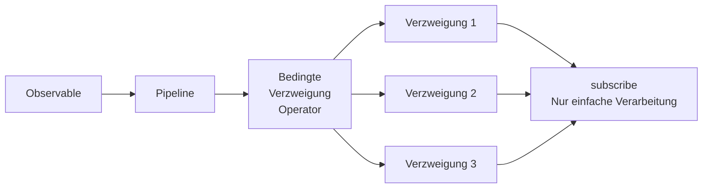
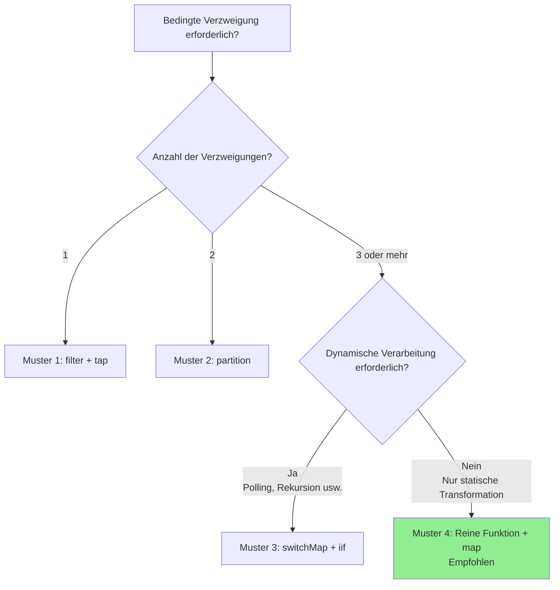

# Muster für bedingte Verzweigungen in subscribe

Eines der häufigsten Probleme, in das Entwickler, die mit RxJS beginnen, geraten, ist die Durchführung komplexer bedingter Verzweigungen innerhalb des `subscribe()`-Callbacks. Dieser Artikel erklärt, warum dies problematisch ist und wie es verbessert werden sollte, zusammen mit praktischen Mustern.

> [!NOTE] In diesem Artikel verwendete öffentliche API
> Dieser Artikel verwendet [JSONPlaceholder](https://jsonplaceholder.typicode.com/), eine kostenlose REST-API. Da es sich um funktionierenden Code handelt, können Sie ihn kopieren und in Ihrem Browser ausprobieren.
>
> Es werden auch Konvertierungsmuster zu benutzerdefinierten API-Antworttypen (einschließlich `status`, `errorCode` usw.) gezeigt, die als Referenz beim Konvertieren von Antworten externer APIs in interne Typen in tatsächlichen Projekten dienen können.

## Problem: Komplexe bedingte Verzweigungen in subscribe

Bedingte Verzweigungen innerhalb von subscribe verringern die Lesbarkeit des Codes und erschweren auch das Testen. Schauen wir uns das folgende Beispiel an.

### Vorbereitung: Hilfsfunktion zum Wrappen der JSONPlaceholder-API

Definieren wir zunächst eine Hilfsfunktion, die die Antwort der JSONPlaceholder-API in einen benutzerdefinierten Typ konvertiert. Dieses Muster kann auch beim Konvertieren externer APIs in interne Typen in tatsächlichen Projekten verwendet werden.

```typescript
import { Observable, from, of, map, catchError } from 'rxjs';

/**
 * JSONPlaceholder API Antworttyp
 */
interface Post {
  userId: number;
  id: number;
  title: string;
  body: string;
}

/**
 * Benutzerdefinierter API-Antworttyp
 */
interface ApiResponse<T = any> {
  status: 'success' | 'error' | 'pending';
  data?: T;
  errorCode?: string;
  message?: string;
}

/**
 * Wrappen der JSONPlaceholder-API und Konvertierung in benutzerdefinierten API-Antworttyp
 *
 * Auch in tatsächlichen Projekten wird häufig das Muster verwendet, Antworten externer APIs in interne Typen zu konvertieren.
 * Dadurch können die Auswirkungen von API-Änderungen lokalisiert und konsistente Typen innerhalb der Anwendung verwendet werden.
 */
function fetchPost(postId: number = 1): Observable<ApiResponse<Post>> {
  return from(
    fetch(`https://jsonplaceholder.typicode.com/posts/${postId}`)
      .then(response => {
        if (!response.ok) {
          throw new Error(`HTTP error! status: ${response.status}`);
        }
        return response.json();
      })
  ).pipe(
    map((data: Post) => ({
      status: 'success' as const,
      data
    })),
    catchError(err => {
      // Fehler in benutzerdefinierten Antworttyp konvertieren
      let errorCode = 'UNKNOWN_ERROR';

      if (err.message.includes('404')) {
        errorCode = 'NOT_FOUND';
      } else if (err.message.includes('500')) {
        errorCode = 'SERVER_ERROR';
      } else if (err.message.includes('Failed to fetch')) {
        errorCode = 'NETWORK_ERROR';
      }

      return of({
        status: 'error' as const,
        errorCode,
        message: err.message
      });
    })
  );
}
```

### Anti-Pattern-Beispiel

Im folgenden Beispiel wird die obige Hilfsfunktion (`fetchPost`) verwendet, aber innerhalb von `subscribe()` werden komplexe bedingte Verzweigungen durchgeführt.

```typescript
/**
 * ❌ Problematisches Codebeispiel
 * Komplexe bedingte Verzweigungen innerhalb von subscribe
 */
class BadExampleManager {
  loading = false;
  data: Post | null = null;
  errorMessage = '';
  successMessage = '';

  // Callback für UI-Update (optional)
  onStateChange?: (state: { loading: boolean; data: Post | null; errorMessage: string; successMessage: string }) => void;

  init(): void {
    this.fetchData();
  }

  fetchData(): void {
    this.loading = true;
    this.updateUI();

    // Post-Daten von JSONPlaceholder API abrufen
    fetchPost(1).subscribe({
      next: response => {
        this.loading = false;

        // ❌ Problem: Komplexe bedingte Verzweigung innerhalb von subscribe
        if (response.status === 'success') {
          if (response.data) {
            // Datenvalidierung
            if (response.data.title && response.data.body) {
              this.data = response.data;
              this.successMessage = `Post „${response.data.title}" geladen`;
            } else {
              this.errorMessage = 'Datenformat ist ungültig';
            }
          } else {
            this.errorMessage = 'Keine Daten vorhanden';
          }
        } else if (response.status === 'error') {
          if (response.errorCode === 'NOT_FOUND') {
            this.errorMessage = 'Daten nicht gefunden (nicht existierende Post-ID)';
          } else if (response.errorCode === 'NETWORK_ERROR') {
            this.errorMessage = 'Netzwerkfehler. Bitte überprüfen Sie Ihre Verbindung.';
            // Wiederholungsversuch
            setTimeout(() => this.fetchData(), 5000);
          } else if (response.errorCode === 'SERVER_ERROR') {
            this.errorMessage = 'Serverfehler aufgetreten';
          } else {
            this.errorMessage = 'Ein Fehler ist aufgetreten';
          }
        } else if (response.status === 'pending') {
          this.errorMessage = 'Wird verarbeitet. Bitte warten Sie einen Moment.';
          // Polling
          setTimeout(() => this.fetchData(), 3000);
        }
        this.updateUI();
      }
    });
  }

  private updateUI(): void {
    if (this.onStateChange) {
      this.onStateChange({
        loading: this.loading,
        data: this.data,
        errorMessage: this.errorMessage,
        successMessage: this.successMessage
      });
    }
  }
}

// Verwendungsbeispiel (kann in der Browser-Konsole ausgeführt werden)
const badExample = new BadExampleManager();
badExample.onStateChange = (state) => {
  if (state.loading) console.log('Lädt...');
  if (state.errorMessage) console.error(state.errorMessage);
  if (state.successMessage) console.log(state.successMessage);
  if (state.data) console.log('Daten:', state.data);
};
badExample.init();

// Ausgabebeispiel:
// Lädt...
// Post „sunt aut facere repellat provident occaecati excepturi optio reprehenderit" geladen
// Daten: {userId: 1, id: 1, title: "...", body: "..."}
```

### Probleme dieser Implementierung

> [!WARNING] Probleme durch bedingte Verzweigungen in subscribe
> 1. **Verringerte Lesbarkeit** - Tiefe Verschachtelung, schwer zu verfolgen
> 2. **Schwierige Tests** - Logik innerhalb von subscribe ist schwer zu testen
> 3. **Fehlende Wiederverwendbarkeit** - Dieselbe Logik kann nicht an anderer Stelle verwendet werden
> 4. **Nicht deklarativ** - Weicht vom deklarativen Stil von RxJS ab
> 5. **Verwaltung von Seiteneffekten** - Mehrere Zustandsänderungen sind verstreut und schwer nachzuverfolgen

## Überblick über Lösungen

Bedingte Verzweigungen in subscribe werden mithilfe von RxJS-Operatoren innerhalb der Pipeline verarbeitet. Dadurch wird der Code deklarativ und das Testen wird einfacher.



In diesem Artikel werden die folgenden 4 Muster erklärt:

1. **Muster 1**: Verzweigung mit filter + tap
2. **Muster 2**: Verzweigung mit partition
3. **Muster 3**: Dynamische Verzweigung mit switchMap + iif
4. **Muster 4**: Funktionskapselung + map-Transformation (empfohlen)

## Muster 1: Verzweigung mit filter + tap

Die einfachste Methode besteht darin, mit `filter` nur Werte durchzulassen, die die Bedingung erfüllen, und mit `tap` Seiteneffekte auszuführen.

### Implementierungsbeispiel

In diesem Beispiel wird die oben definierte Funktion `fetchPost()` verwendet, um Daten von der JSONPlaceholder-API abzurufen.

```typescript
class Pattern1Manager {
  private destroy$ = new Subject<void>();

  loading = false;
  data: Post | null = null;
  errorMessage = '';

  // Callback für UI-Update (optional)
  onStateChange?: (state: { loading: boolean; data: Post | null; errorMessage: string }) => void;

  init(): void {
    this.fetchData();
  }

  fetchData(): void {
    this.loading = true;
    this.updateUI();

    fetchPost(1).pipe(
      // ✅ Nur erfolgreiche Antworten durchlassen
      filter(response => response.status === 'success'),

      // ✅ Datenvalidierung
      filter(response => response.data !== undefined),

      // ✅ Protokollausgabe (Seiteneffekt)
      tap(response => console.log('Daten erfolgreich abgerufen:', response.data)),

      // Fehlerbehandlung
      catchError(err => {
        console.error('Fehler:', err);
        this.errorMessage = 'Datenabruf fehlgeschlagen';
        this.loading = false;
        this.updateUI();
        return of(null);
      }),

      takeUntil(this.destroy$)
    ).subscribe({
      next: response => {
        this.loading = false;

        // ✅ Nur einfache Zuweisung
        if (response) {
          this.data = response.data;
        }
        this.updateUI();
      }
    });
  }

  private updateUI(): void {
    if (this.onStateChange) {
      this.onStateChange({
        loading: this.loading,
        data: this.data,
        errorMessage: this.errorMessage
      });
    }
  }

  destroy(): void {
    this.destroy$.next();
    this.destroy$.complete();
  }
}

// Verwendungsbeispiel (kann in der Browser-Konsole ausgeführt werden)
const pattern1 = new Pattern1Manager();
pattern1.onStateChange = (state) => {
  if (state.loading) console.log('Lädt...');
  if (state.errorMessage) console.error(state.errorMessage);
  if (state.data) console.log('Post-Daten:', state.data);
};
pattern1.init();

// Ausgabebeispiel:
// Lädt...
// Daten erfolgreich abgerufen: {userId: 1, id: 1, title: "...", body: "..."}
// Post-Daten: {userId: 1, id: 1, title: "...", body: "..."}
```

### Vor- und Nachteile

> [!TIP] Merkmale von Muster 1
> **Vorteile:**
> - Einfach und leicht verständlich
> - Stufenweises Filtern möglich
> - Jeder Schritt ist klar
>
> **Nachteile:**
> - Nicht geeignet für mehrere Verzweigungen (Stream muss für jede Verzweigung erstellt werden)
> - Gefilterte Werte können nicht weiter verwendet werden

## Muster 2: Verzweigung mit partition

Mit `partition` können Sie ein Observable basierend auf einer Bedingung in zwei Streams aufteilen.

### Implementierungsbeispiel

Auch in diesem Beispiel wird die Funktion `fetchPost()` verwendet, um Daten von der JSONPlaceholder-API abzurufen.

```typescript
/**
 * Typ für Verarbeitungsergebnis
 */
interface ProcessedResult {
  type: 'success' | 'error';
  data?: Post;
  message: string;
}

class Pattern2Manager {
  private destroy$ = new Subject<void>();

  loading = false;
  result: ProcessedResult | null = null;

  // Callback für UI-Update (optional)
  onStateChange?: (state: { loading: boolean; result: ProcessedResult | null }) => void;

  init(): void {
    this.fetchData();
  }

  fetchData(): void {
    this.loading = true;
    this.updateUI();

    const response$ = fetchPost(1).pipe(
      catchError(err => {
        console.error('HTTP-Fehler:', err);
        return EMPTY;
      })
    );

    // ✅ Aufteilung in Erfolg und Fehler
    const [success$, error$] = partition(
      response$,
      response => response.status === 'success'
    );

    // Verarbeitung des Erfolgs-Streams
    const successStream$ = success$.pipe(
      map(response => ({
        type: 'success' as const,
        data: response.data,
        message: 'Daten abgerufen'
      })),
      tap(() => console.log('Erfolgsverarbeitung abgeschlossen'))
    );

    // Verarbeitung des Fehler-Streams
    const errorStream$ = error$.pipe(
      map(response => ({
        type: 'error' as const,
        message: this.getErrorMessage(response.errorCode)
      })),
      tap(result => console.log('Fehlerverarbeitung abgeschlossen:', result.message))
    );

    // ✅ Beide Streams zusammenführen und abonnieren
    merge(successStream$, errorStream$).pipe(
      takeUntil(this.destroy$)
    ).subscribe({
      next: result => {
        this.loading = false;
        this.result = result;

        // Zusätzliche Verarbeitung basierend auf bestimmtem Fehlercode
        if (result.type === 'error') {
          this.handleError(result);
        }
        this.updateUI();
      }
    });
  }

  private getErrorMessage(errorCode?: string): string {
    const messages: Record<string, string> = {
      'NOT_FOUND': 'Daten nicht gefunden (nicht existierende Post-ID)',
      'NETWORK_ERROR': 'Netzwerkfehler. Bitte überprüfen Sie Ihre Verbindung.',
      'SERVER_ERROR': 'Serverfehler aufgetreten'
    };

    return messages[errorCode || ''] || 'Ein Fehler ist aufgetreten';
  }

  private handleError(result: ProcessedResult): void {
    // Zusätzliche Verarbeitung basierend auf Fehlertyp (z. B. Weiterleitung zum Login-Bildschirm)
  }

  private updateUI(): void {
    if (this.onStateChange) {
      this.onStateChange({
        loading: this.loading,
        result: this.result
      });
    }
  }

  destroy(): void {
    this.destroy$.next();
    this.destroy$.complete();
  }
}

// Verwendungsbeispiel (kann in der Browser-Konsole ausgeführt werden)
const pattern2 = new Pattern2Manager();
pattern2.onStateChange = (state) => {
  if (state.loading) console.log('Lädt...');
  if (state.result) {
    console.log(`[${state.result.type}] ${state.result.message}`);
    if (state.result.data) console.log('Post-Daten:', state.result.data);
  }
};
pattern2.init();

// Ausgabebeispiel:
// Lädt...
// Erfolgsverarbeitung abgeschlossen
// [success] Daten abgerufen
// Post-Daten: {userId: 1, id: 1, title: "...", body: "..."}
```

### Vor- und Nachteile

> [!TIP] Merkmale von Muster 2
> **Vorteile:**
> - Klare Trennung von zwei Verzweigungen
> - Unabhängige Verarbeitung in jedem Stream möglich
> - Leicht zu testen
>
> **Nachteile:**
> - Begrenzt auf zwei Verzweigungen (nicht geeignet für drei oder mehr Verzweigungen)
> - Beide Streams müssen abonniert werden

## Muster 3: Dynamische Verzweigung mit switchMap + iif

Mit `iif` können Sie basierend auf Bedingungen zu verschiedenen Observables wechseln.

### Implementierungsbeispiel

In diesem Beispiel wird eine nicht existierende Post-ID (999) ausprobiert, um die Fehlerverarbeitung zu demonstrieren.

```typescript
class Pattern3Manager {
  private destroy$ = new Subject<void>();

  loading = false;
  data: Post | null = null;
  statusMessage = '';

  // Callback für UI-Update (optional)
  onStateChange?: (state: { loading: boolean; data: Post | null; statusMessage: string }) => void;

  init(): void {
    // Nicht existierende Post-ID (999) ausprobieren
    this.fetchData(999);
  }

  fetchData(postId: number = 1): void {
    this.loading = true;
    this.updateUI();

    fetchPost(postId).pipe(
      // ✅ Verarbeitung basierend auf Antwort-Status verzweigen
      switchMap(response =>
        iif(
          // Bedingung 1: Erfolg
          () => response.status === 'success',
          // Verarbeitung bei Erfolg
          of(response).pipe(
            map(r => ({ type: 'success' as const, data: r.data })),
            tap(() => console.log('Daten erfolgreich abgerufen'))
          ),
          // Bedingung 2: Fehler
          // Bei Fehler in Error-Stream mit throwError konvertieren
          throwError(() => ({
            message: this.getErrorMessage(response.errorCode),
            errorCode: response.errorCode
          }))
        )
      ),
      retry({
        count: 2,
        delay: 1000 // 1 Sekunde warten und wiederholen
      }),
      catchError(err => {
        console.error('Fehler:', err);
        this.statusMessage = err.message || 'Ein Fehler ist aufgetreten';
        this.loading = false;
        this.updateUI();
        return EMPTY;
      }),
      takeUntil(this.destroy$)
    ).subscribe({
      next: result => {
        this.loading = false;

        if (result.type === 'success') {
          this.data = result.data;
          this.statusMessage = '';
        }
        this.updateUI();
      }
    });
  }

  private getErrorMessage(errorCode?: string): string {
    const messages: Record<string, string> = {
      'NOT_FOUND': 'Daten nicht gefunden (nicht existierende Post-ID)',
      'NETWORK_ERROR': 'Netzwerkfehler. Bitte überprüfen Sie Ihre Verbindung.',
      'SERVER_ERROR': 'Serverfehler aufgetreten'
    };
    return messages[errorCode || ''] || 'Ein Fehler ist aufgetreten';
  }

  private updateUI(): void {
    if (this.onStateChange) {
      this.onStateChange({
        loading: this.loading,
        data: this.data,
        statusMessage: this.statusMessage
      });
    }
  }

  destroy(): void {
    this.destroy$.next();
    this.destroy$.complete();
  }
}

// Verwendungsbeispiel (kann in der Browser-Konsole ausgeführt werden)
const pattern3 = new Pattern3Manager();
pattern3.onStateChange = (state) => {
  if (state.loading) console.log('Lädt...');
  if (state.statusMessage) console.log(state.statusMessage);
  if (state.data) console.log('Post-Daten:', state.data);
};
pattern3.init();

// Ausgabebeispiel (bei Versuch mit nicht existierender Post-ID 999):
// Lädt...
// Fehler: {...}
// Daten nicht gefunden (nicht existierende Post-ID)
//
// Bei Angabe einer normalen Post-ID (1):
// pattern3.fetchData(1);
// Lädt...
// Daten erfolgreich abgerufen
// Post-Daten: {userId: 1, id: 1, title: "...", body: "..."}
```

### Vor- und Nachteile

> [!TIP] Merkmale von Muster 3
> **Vorteile:**
> - Wechsel zu verschiedenen Observables basierend auf Bedingungen möglich
> - Leicht mit Wiederholungslogik kombinierbar
> - Geeignet für dynamische Verarbeitung (Polling, rekursive Aufrufe usw.)
>
> **Nachteile:**
> - Lesbarkeit kann bei tiefer Verschachtelung abnehmen
> - Schwierig zu debuggen
> - Für Anfänger schwer verständlich
>
> **Hinweis:** Dieses Beispiel zeigt eine einfache Erfolg/Fehler-Verzweigung, kann aber tatsächlich auch komplexere dynamische Verarbeitung wie asynchrones Polling mit Pending-Status unterstützen.

## Muster 4: Funktionskapselung + map-Transformation (empfohlen)

Das am meisten empfohlene Muster ist, die Logik für bedingte Verzweigungen als reine Funktion zu extrahieren und mit dem `map`-Operator zu transformieren.

### Implementierungsbeispiel

In diesem Beispiel wird eine reine Funktion definiert, die die von `fetchPost()` zurückgegebene API-Antwort in ein ViewModel für die UI-Anzeige transformiert.

```typescript
/**
 * ViewModel für UI-Anzeige
 */
interface ViewModel {
  loading: boolean;
  displayData: Post | null;
  messageType: 'success' | 'error' | 'info' | null;
  message: string;
  showRetryButton: boolean;
}

/**
 * ✅ Reine Funktion: API-Antwort in ViewModel konvertieren
 * Leicht testbar und wiederverwendbar
 */
function mapResponseToViewModel(response: ApiResponse<Post>): ViewModel {
  // Verarbeitung erfolgreicher Antwort
  if (response.status === 'success') {
    return {
      loading: false,
      displayData: response.data || null,
      messageType: 'success',
      message: `Post „${response.data?.title}" geladen`,
      showRetryButton: false
    };
  }

  // Verarbeitung von Fehlerantwort
  if (response.status === 'error') {
    const errorMessages: Record<string, string> = {
      'NOT_FOUND': 'Daten nicht gefunden (nicht existierende Post-ID)',
      'NETWORK_ERROR': 'Netzwerkfehler. Bitte überprüfen Sie Ihre Verbindung.',
      'SERVER_ERROR': 'Serverfehler aufgetreten. Bitte versuchen Sie es später erneut.'
    };

    const message = errorMessages[response.errorCode || ''] ||
                    response.message ||
                    'Ein Fehler ist aufgetreten';

    return {
      loading: false,
      displayData: null,
      messageType: 'error',
      message,
      showRetryButton: isRetryableError(response.errorCode)
    };
  }

  // Verarbeitung von Pending-Antwort (tritt bei JSONPlaceholder API nicht auf, aber für zukünftige Erweiterung)
  if (response.status === 'pending') {
    return {
      loading: true,
      displayData: null,
      messageType: 'info',
      message: 'Wird verarbeitet. Bitte warten Sie einen Moment.',
      showRetryButton: false
    };
  }

  // Fallback
  return {
    loading: false,
    displayData: null,
    messageType: 'error',
    message: 'Unbekannte Antwort',
    showRetryButton: false
  };
}

/**
 * ✅ Reine Funktion: Bestimmt, ob Fehler wiederholbar ist
 */
function isRetryableError(errorCode?: string): boolean {
  const retryableErrors = ['NETWORK_ERROR', 'SERVER_ERROR'];
  return retryableErrors.includes(errorCode || '');
}

/**
 * ✅ Reine Funktion: Gibt Seiteneffekt basierend auf bestimmtem Fehler zurück
 */
function getErrorSideEffect(errorCode?: string): (() => void) | null {
  const sideEffects: Record<string, () => void> = {
    'NETWORK_ERROR': () => {
      console.log('Netzwerkfehler: Bitte überprüfen Sie Ihre Verbindung');
    },
    'SERVER_ERROR': () => {
      console.log('Serverfehler: Bitte warten Sie einen Moment und versuchen Sie es erneut');
    }
  };

  return sideEffects[errorCode || ''] || null;
}

class Pattern4Manager {
  private destroy$ = new Subject<void>();

  viewModel: ViewModel = {
    loading: false,
    displayData: null,
    messageType: null,
    message: '',
    showRetryButton: false
  };

  // Callback für UI-Update (optional)
  onStateChange?: (viewModel: ViewModel) => void;

  init(): void {
    this.fetchData();
  }

  fetchData(postId: number = 1): void {
    // Anfänglichen Ladestatus setzen
    this.viewModel = {
      loading: true,
      displayData: null,
      messageType: null,
      message: '',
      showRetryButton: false
    };
    this.updateUI();

    fetchPost(postId).pipe(
      // ✅ Transformation mit reiner Funktion innerhalb der Pipeline
      map(response => mapResponseToViewModel(response)),

      // ✅ Seiteneffekte mit tap ausführen (von reiner Funktion getrennt)
      tap(viewModel => {
        console.log('ViewModel:', viewModel);
      }),

      // Fehlerbehandlung
      catchError(err => {
        console.error('HTTP-Fehler:', err);

        const errorViewModel: ViewModel = {
          loading: false,
          displayData: null,
          messageType: 'error',
          message: 'Netzwerkfehler aufgetreten',
          showRetryButton: true
        };

        return of(errorViewModel);
      }),

      takeUntil(this.destroy$)
    ).subscribe({
      next: viewModel => {
        // ✅ Nur einfache Zuweisung innerhalb von subscribe
        this.viewModel = viewModel;

        // Seiteneffekt basierend auf bestimmtem Fehler ausführen
        if (viewModel.messageType === 'error') {
          const sideEffect = getErrorSideEffect(
            // Hier wird der ursprüngliche errorCode nicht beibehalten,
            // daher muss er zum ViewModel hinzugefügt werden
          );
          sideEffect?.();
        }
        this.updateUI();
      }
    });
  }

  private updateUI(): void {
    if (this.onStateChange) {
      this.onStateChange(this.viewModel);
    }
  }

  destroy(): void {
    this.destroy$.next();
    this.destroy$.complete();
  }
}

// Verwendungsbeispiel (kann in der Browser-Konsole ausgeführt werden)
const pattern4 = new Pattern4Manager();
pattern4.onStateChange = (viewModel) => {
  if (viewModel.loading) console.log('Lädt...');
  if (viewModel.message) console.log(`[${viewModel.messageType}] ${viewModel.message}`);
  if (viewModel.displayData) console.log('Post-Daten:', viewModel.displayData);
  if (viewModel.showRetryButton) console.log('Wiederholungsschaltfläche anzeigen');
};
pattern4.init();

// Ausgabebeispiel:
// Lädt...
// ViewModel: {loading: false, displayData: {...}, messageType: "success", message: "Post „..." geladen", showRetryButton: false}
// [success] Post „sunt aut facere repellat provident occaecati excepturi optio reprehenderit" geladen
// Post-Daten: {userId: 1, id: 1, title: "...", body: "..."}
```

### Weitere Verbesserung: errorCode beibehalten

Im obigen Beispiel ist `errorCode` nicht im ViewModel enthalten, daher kann die Beurteilung von Seiteneffekten nicht durchgeführt werden. Hier ist eine verbesserte Version.

```typescript
/**
 * Verbessertes ViewModel (mit errorCode)
 */
interface ImprovedViewModel {
  loading: boolean;
  displayData: Post | null;
  messageType: 'success' | 'error' | 'info' | null;
  message: string;
  showRetryButton: boolean;
  errorCode?: string; // ✅ Fehlercode beibehalten
}

/**
 * Verbesserte Mapping-Funktion
 */
function mapResponseToImprovedViewModel(response: ApiResponse<Post>): ImprovedViewModel {
  if (response.status === 'success') {
    return {
      loading: false,
      displayData: response.data || null,
      messageType: 'success',
      message: `Post „${response.data?.title}" geladen`,
      showRetryButton: false
    };
  }

  if (response.status === 'error') {
    const errorMessages: Record<string, string> = {
      'NOT_FOUND': 'Daten nicht gefunden (nicht existierende Post-ID)',
      'NETWORK_ERROR': 'Netzwerkfehler. Bitte überprüfen Sie Ihre Verbindung.',
      'SERVER_ERROR': 'Serverfehler aufgetreten'
    };

    return {
      loading: false,
      displayData: null,
      messageType: 'error',
      message: errorMessages[response.errorCode || ''] || 'Ein Fehler ist aufgetreten',
      showRetryButton: isRetryableError(response.errorCode),
      errorCode: response.errorCode // ✅ Fehlercode beibehalten
    };
  }

  if (response.status === 'pending') {
    return {
      loading: true,
      displayData: null,
      messageType: 'info',
      message: 'Wird verarbeitet',
      showRetryButton: false
    };
  }

  return {
    loading: false,
    displayData: null,
    messageType: 'error',
    message: 'Unbekannte Antwort',
    showRetryButton: false
  };
}

class ImprovedPattern4Manager {
  private destroy$ = new Subject<void>();
  viewModel: ImprovedViewModel = {
    loading: false,
    displayData: null,
    messageType: null,
    message: '',
    showRetryButton: false
  };

  // Callback für UI-Update (optional)
  onStateChange?: (viewModel: ImprovedViewModel) => void;

  init(): void {
    this.fetchData();
  }

  fetchData(postId: number = 1): void {
    fetchPost(postId).pipe(
      map(response => mapResponseToImprovedViewModel(response)),
      tap(viewModel => console.log('ViewModel:', viewModel)),
      catchError(err => {
        console.error('HTTP-Fehler:', err);
        return of({
          loading: false,
          displayData: null,
          messageType: 'error' as const,
          message: 'Netzwerkfehler',
          showRetryButton: true
        });
      }),
      takeUntil(this.destroy$)
    ).subscribe({
      next: viewModel => {
        this.viewModel = viewModel;

        // ✅ Seiteneffekt basierend auf Fehlercode ausführen
        if (viewModel.errorCode) {
          const sideEffect = getErrorSideEffect(viewModel.errorCode);
          sideEffect?.();
        }
        this.updateUI();
      }
    });
  }

  private updateUI(): void {
    if (this.onStateChange) {
      this.onStateChange(this.viewModel);
    }
  }

  destroy(): void {
    this.destroy$.next();
    this.destroy$.complete();
  }
}

// Verwendungsbeispiel (kann in der Browser-Konsole ausgeführt werden)
const improvedPattern4 = new ImprovedPattern4Manager();
improvedPattern4.onStateChange = (viewModel) => {
  if (viewModel.loading) console.log('Lädt...');
  if (viewModel.message) console.log(`[${viewModel.messageType}] ${viewModel.message}`);
  if (viewModel.displayData) console.log('Post-Daten:', viewModel.displayData);
};
improvedPattern4.init();

// Ausgabebeispiel:
// ViewModel: {loading: false, displayData: {...}, messageType: "success", message: "...", showRetryButton: false}
// [success] Post „sunt aut facere repellat provident occaecati excepturi optio reprehenderit" geladen
// Post-Daten: {userId: 1, id: 1, title: "...", body: "..."}
```

### Vor- und Nachteile

> [!TIP] Merkmale von Muster 4 (empfohlen)
> **Vorteile:**
> - **Leicht testbar**: Einfache Unit-Tests für reine Funktionen
> - **Wiederverwendbar**: Dieselbe Logik kann in anderen Komponenten verwendet werden
> - **Hohe Lesbarkeit**: Transformationslogik ist klar getrennt
> - **Typsicher**: TypeScript-Typinferenz funktioniert
> - **Hohe Wartbarkeit**: Auswirkungsbereich bei Logikänderungen ist klar
>
> **Nachteile:**
> - Erhöhter Code-Umfang (aber als Kompromiss für Klarheit)

## Praktisches Beispiel: Vollständige Implementierung der API-Antwortverarbeitung

Hier ist ein praktisches Implementierungsbeispiel, das die bisherigen Muster kombiniert. Eine Implementierung mit der JSONPlaceholder-API.

```typescript
/**
 * ViewModel-Typdefinition
 */
interface DataViewModel<T = any> {
  loading: boolean;
  data: T | null;
  error: {
    message: string;
    code?: string;
    retryable: boolean;
  } | null;
  info: string | null;
}

/**
 * Datenabruf-Service
 */
class DataService {

  /**
   * Datenabruf (mit automatischer Wiederholung)
   */
  fetchData<T>(postId: number = 1): Observable<DataViewModel<T>> {
    return fetchPost(postId).pipe(

      // Antwort in ViewModel konvertieren
      map(response => this.mapToViewModel<T>(response)),

      // HTTP-Fehlerbehandlung
      catchError((err: Error) =>
        of(this.createErrorViewModel<T>(err))
      ),

      // Automatische Wiederholung bei wiederholbaren Fehlern
      retry({
        count: 2,
        delay: 1000 // 1 Sekunde warten und wiederholen
      })
    );
  }

  /**
   * API-Antwort in ViewModel konvertieren (reine Funktion)
   */
  private mapToViewModel<T>(response: ApiResponse<T>): DataViewModel<T> {
    if (response.status === 'success') {
      return {
        loading: false,
        data: response.data || null,
        error: null,
        info: null
      };
    }

    if (response.status === 'error') {
      return {
        loading: false,
        data: null,
        error: {
          message: this.getErrorMessage(response.errorCode, response.message),
          code: response.errorCode,
          retryable: this.isRetryableError(response.errorCode)
        },
        info: null
      };
    }

    // Pending (tritt bei JSONPlaceholder API nicht auf, aber für zukünftige Erweiterung)
    return {
      loading: true,
      data: null,
      error: null,
      info: 'Wird verarbeitet...'
    };
  }

  /**
   * ViewModel aus HTTP-Fehler erstellen
   */
  private createErrorViewModel<T>(err: Error): DataViewModel<T> {
    return {
      loading: false,
      data: null,
      error: {
        message: err.message || 'Ein Fehler ist aufgetreten',
        code: 'FETCH_ERROR',
        retryable: true
      },
      info: null
    };
  }

  /**
   * Fehlermeldung abrufen
   */
  private getErrorMessage(errorCode?: string, fallbackMessage?: string): string {
    const messages: Record<string, string> = {
      'NOT_FOUND': 'Daten nicht gefunden (nicht existierende Post-ID)',
      'NETWORK_ERROR': 'Netzwerkfehler. Bitte überprüfen Sie Ihre Verbindung.',
      'SERVER_ERROR': 'Serverfehler aufgetreten'
    };

    return messages[errorCode || ''] || fallbackMessage || 'Ein Fehler ist aufgetreten';
  }

  /**
   * Bestimmt, ob Fehler wiederholbar ist
   */
  private isRetryableError(errorCode?: string): boolean {
    const retryable = ['NETWORK_ERROR', 'SERVER_ERROR'];
    return retryable.includes(errorCode || '');
  }
}

/**
 * Datenanzeige-Manager
 */
class DataDisplayManager {
  private destroy$ = new Subject<void>();
  private dataService = new DataService();

  viewModel: DataViewModel = {
    loading: false,
    data: null,
    error: null,
    info: null
  };

  // Callback für UI-Update (optional)
  onStateChange?: (viewModel: DataViewModel) => void;

  init(): void {
    this.loadData();
  }

  loadData(postId: number = 1): void {
    this.viewModel = {
      loading: true,
      data: null,
      error: null,
      info: null
    };
    this.updateUI();

    this.dataService.fetchData(postId).pipe(
      takeUntil(this.destroy$)
    ).subscribe({
      next: viewModel => {
        // ✅ Nur einfache Zuweisung innerhalb von subscribe
        this.viewModel = viewModel;
        this.updateUI();
      }
    });
  }

  private updateUI(): void {
    if (this.onStateChange) {
      this.onStateChange(this.viewModel);
    }
  }

  destroy(): void {
    this.destroy$.next();
    this.destroy$.complete();
  }
}

// Verwendungsbeispiel (kann in der Browser-Konsole ausgeführt werden)
const dataDisplay = new DataDisplayManager();
dataDisplay.onStateChange = (viewModel) => {
  if (viewModel.loading) console.log('Lädt...');
  if (viewModel.error) {
    console.error(viewModel.error.message);
    if (viewModel.error.retryable) console.log('Wiederholbar');
  }
  if (viewModel.info) console.log(viewModel.info);
  if (viewModel.data) console.log('Post-Daten:', viewModel.data);
};
dataDisplay.init();

// Ausgabebeispiel:
// Lädt...
// Post-Daten: {userId: 1, id: 1, title: "...", body: "..."}
//
// Beispiel bei Fehler (nicht existierende Post-ID 999 angegeben):
// dataDisplay.loadData(999);
// Lädt...
// Daten nicht gefunden (nicht existierende Post-ID)
// Wiederholbar
```

> [!IMPORTANT] Punkte des praktischen Musters
> 1. **Transformation in Service-Schicht**: Konvertierung von API-Antwort zu ViewModel in der Service-Schicht
> 2. **Verwendung reiner Funktionen**: Logik für bedingte Verzweigungen als reine Funktionen extrahieren
> 3. **Einfaches subscribe**: Nur Zuweisungen beim Abonnieren
> 4. **Zentralisierte Fehlerbehandlung**: Fehlerverarbeitung innerhalb der Pipeline abschließen
> 5. **Gewährleistung der Typsicherheit**: Sicherheit durch ViewModel-Typdefinition garantieren

## Auswahlrichtlinien

Hier sind szenariobasierte Richtlinien, welches Muster gewählt werden sollte.



### Musterauswahlkriterien

| Szenario | Empfohlenes Muster | Grund |
|---------|------------|------|
| Einfache Filterung | Muster 1 (filter + tap) | Einfach und leicht verständlich |
| Erfolg/Fehler 2 Verzweigungen | Muster 2 (partition) | Klare Trennung möglich |
| Polling/Wiederholung | Muster 3 (switchMap + iif) | Unterstützt dynamische Verarbeitung |
| Komplexe bedingte Verzweigungen | Muster 4 (reine Funktion + map) | Testbar, wiederverwendbar |
| Zustandsverwaltung erforderlich | Muster 4 (reine Funktion + map) | Geeignet für ViewModel-Muster |

> [!TIP] Im Zweifelsfall **Muster 4 (reine Funktion + map)** wählen
> - Höchste Wartbarkeit
> - Leicht testbar
> - Geeignet für Teamentwicklung
> - Gute Kompatibilität mit TypeScript-Typsystem

## Zusammenfassung

Komplexe bedingte Verzweigungen innerhalb von subscribe sind eines der Anti-Patterns von RxJS. Durch Verwendung der 4 in diesem Artikel vorgestellten Muster können Sie deklarativen und wartbaren Code schreiben.

### Wichtige Prinzipien

> [!IMPORTANT] Prinzipien zur Vermeidung bedingter Verzweigungen in subscribe
> 1. **Logik innerhalb der Pipeline verarbeiten** - Transformation vor subscribe abschließen
> 2. **Reine Funktionen verwenden** - Logik für bedingte Verzweigungen als Funktionen extrahieren
> 3. **ViewModel-Muster übernehmen** - In Modell für UI-Anzeige konvertieren
> 4. **Seiteneffekte mit tap trennen** - Klare Trennung zwischen reiner Transformation und Seiteneffekten
> 5. **Typsicherheit gewährleisten** - TypeScript-Typsystem maximal nutzen

### Before / After Vergleich

**Before (Anti-Pattern):**
```typescript
observable$.subscribe(value => {
  if (value.status === 'success') {
    if (value.data) {
      this.data = value.data;
    }
  } else if (value.status === 'error') {
    if (value.errorCode === 'AUTH_ERROR') {
      // ...
    } else if (value.errorCode === 'NOT_FOUND') {
      // ...
    }
  }
});
```

**After (empfohlenes Muster):**
```typescript
observable$.pipe(
  map(response => mapToViewModel(response)),
  tap(viewModel => console.log('Verarbeitet:', viewModel))
).subscribe(viewModel => {
  this.viewModel = viewModel;
});
```

### Verwandte Abschnitte

- **[RxJS Anti-Pattern-Sammlung](/de/guide/anti-patterns/)** - Häufige Fehler und Lösungen
- **[Fehlerbehandlung](/de/guide/error-handling/strategies.md)** - Grundlagen der Fehlerverarbeitung
- **[API-Aufrufmuster](/de/guide/practical-patterns/api-calls.md)** - Praktische Muster für API-Kommunikation
- **[Formularverarbeitungsmuster](/de/guide/practical-patterns/form-handling.md)** - Bedingte Verzweigungen in Formularen

## Testcode

Hier ist ein Testbeispiel für Muster 4 (reine Funktion + map).

```typescript
describe('mapResponseToViewModel', () => {
  it('should map success response correctly', () => {
    const response: ApiResponse = {
      status: 'success',
      data: { id: 1, name: 'Test' }
    };

    const result = mapResponseToViewModel(response);

    expect(result.loading).toBe(false);
    expect(result.displayData).toEqual({ id: 1, name: 'Test' });
    expect(result.messageType).toBe('success');
    expect(result.showRetryButton).toBe(false);
  });

  it('should map error response with retryable error', () => {
    const response: ApiResponse = {
      status: 'error',
      errorCode: 'RATE_LIMIT'
    };

    const result = mapResponseToViewModel(response);

    expect(result.loading).toBe(false);
    expect(result.displayData).toBeNull();
    expect(result.messageType).toBe('error');
    expect(result.showRetryButton).toBe(true); // RATE_LIMIT ist wiederholbar
  });

  it('should map error response with non-retryable error', () => {
    const response: ApiResponse = {
      status: 'error',
      errorCode: 'NOT_FOUND'
    };

    const result = mapResponseToViewModel(response);

    expect(result.showRetryButton).toBe(false); // NOT_FOUND ist nicht wiederholbar
  });

  it('should map pending response', () => {
    const response: ApiResponse = {
      status: 'pending'
    };

    const result = mapResponseToViewModel(response);

    expect(result.loading).toBe(true);
    expect(result.messageType).toBe('info');
  });
});

describe('isRetryableError', () => {
  it('should identify retryable errors', () => {
    expect(isRetryableError('RATE_LIMIT')).toBe(true);
    expect(isRetryableError('TIMEOUT')).toBe(true);
    expect(isRetryableError('SERVER_ERROR')).toBe(true);
  });

  it('should identify non-retryable errors', () => {
    expect(isRetryableError('NOT_FOUND')).toBe(false);
    expect(isRetryableError('AUTH_ERROR')).toBe(false);
    expect(isRetryableError('VALIDATION_ERROR')).toBe(false);
  });
});
```

> [!TIP] Warum Tests reiner Funktionen einfach sind
> - Keine Abhängigkeit von externem Zustand
> - Gleiche Eingabe liefert immer gleiche Ausgabe
> - Keine Seiteneffekte
> - Mocks oder Spies nicht erforderlich

## Referenzressourcen

Weitere Lernressourcen zur Vermeidung bedingter Verzweigungen in subscribe.

- [RxJS Official Documentation - Operators](https://rxjs.dev/guide/operators) - Verwendung von Operatoren
- [Learn RxJS - Transformation Operators](https://www.learnrxjs.io/learn-rxjs/operators/transformation) - Details zu Transformations-Operatoren
- [Learn RxJS - partition](https://www.learnrxjs.io/learn-rxjs/operators/transformation/partition) - Verwendungsbeispiele für partition
- [RxJS Best Practices](https://blog.angular-university.io/rxjs-best-practices/) - Best Practices für RxJS
