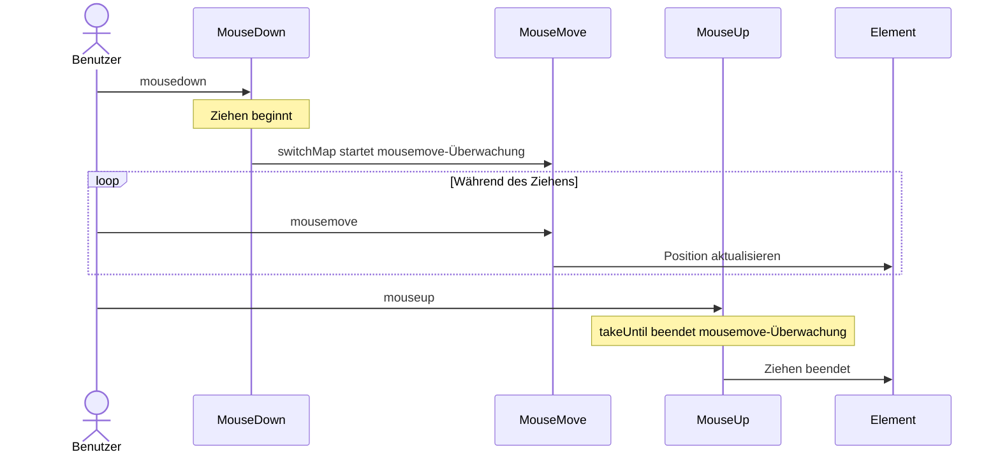
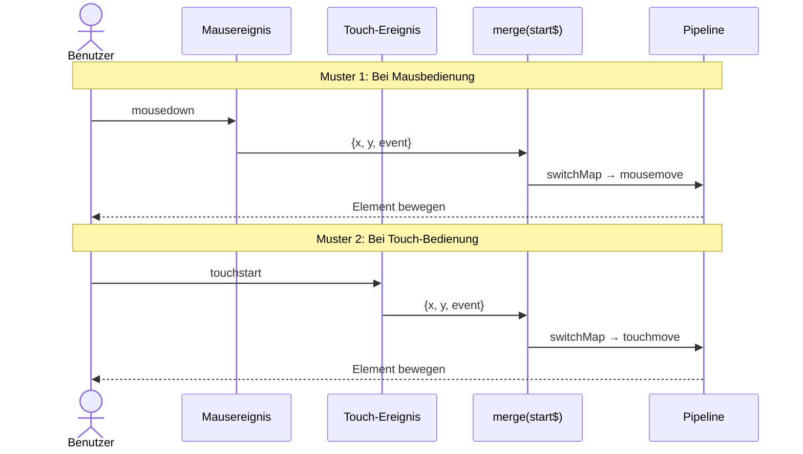

# UI-Ereignisverarbeitungsmuster

Die Verarbeitung von UI-Ereignissen ist eine der häufigsten Herausforderungen in der Frontend-Entwicklung. Mit RxJS können Sie komplexe Ereignisverarbeitung deklarativ und intuitiv implementieren.

In diesem Artikel werden konkrete Muster zur Verarbeitung von UI-Ereignissen wie Klicks, Scrollen, Drag & Drop und Tastatureingaben erklärt, die in der Praxis benötigt werden.

## Was Sie in diesem Artikel lernen werden

- Click-Event-Steuerung (throttle, debounce, distinct)
- Effiziente Verarbeitung von Scroll-Ereignissen
- Implementierung von Drag & Drop
- Tastatureingaben und Autovervollständigung
- Multi-Touch-Unterstützung
- Kombination von zusammengesetzten Ereignissen

> [!TIP] Voraussetzungen
> Dieser Artikel setzt Kenntnisse aus [Kapitel 4: Operatoren](../operators/index.md) voraus. Besonders wichtig ist das Verständnis von `debounceTime`, `throttleTime` und `distinctUntilChanged`.

## Click-Ereignisverarbeitung

### Problem: Übermäßige Verarbeitung durch mehrfaches Klicken

Wenn ein Button mehrmals hintereinander geklickt wird, wird die Verarbeitung mehrfach ausgeführt, was zu Performance-Problemen und Bugs führen kann.

### Lösung 1: Steuerung mit throttleTime

Verarbeitet nur den ersten Klick innerhalb eines bestimmten Zeitraums.

```typescript
import { fromEvent, throttleTime } from 'rxjs';
const button = document.createElement('button');
button.id = 'submit-button';
button.innerText = 'submit';
document.body.appendChild(button);

if (button) {
  fromEvent(button, 'click').pipe(
    throttleTime(1000) // Verarbeitung nur einmal pro Sekunde
  ).subscribe(() => {
    console.log('Sendevorgang wird ausgeführt');
    submitForm();
  });
}

function submitForm(): void {
  console.log('Formular wird gesendet...');
  // API-Aufruf etc.
}
```

#### Ausführungsablauf

```
Benutzerklicks:     ●    ●●●        ●  ●●
                    |    |          |  |
throttleTime(1000): ●              ●
                    |              |
                Verarbeitung   Verarbeitung
```

> [!NOTE] Eigenschaften von throttleTime
> - Verarbeitet das **erste Ereignis** und ignoriert nachfolgende Ereignisse für eine bestimmte Zeit
> - Geeignet für Fälle, in denen Echtzeit wichtig ist (Scrollen, Resize etc.)

### Lösung 2: Steuerung mit debounceTime

Verarbeitet nach einer bestimmten Zeit, nachdem die Ereignisse gestoppt haben.

```typescript
import { fromEvent, debounceTime } from 'rxjs';
// Traditional approach (commented for reference)
// const searchInput = document.querySelector<HTMLInputElement>('#search');

// Self-contained: creates input dynamically
const searchInput = document.createElement('input');
searchInput.id = 'search';
searchInput.type = 'text';
searchInput.placeholder = 'Suchbegriff eingeben...';
searchInput.style.padding = '8px';
searchInput.style.margin = '10px';
searchInput.style.width = '300px';
document.body.appendChild(searchInput);

fromEvent(searchInput, 'input').pipe(
  debounceTime(300) // Wartet 300ms nach Eingabestopp
).subscribe((event) => {
  const value = (event.target as HTMLInputElement).value;
  console.log('Suche wird ausgeführt:', value);
  performSearch(value);
});

function performSearch(query: string): void {
  console.log('Suche läuft...', query);
  // Such-API-Aufruf
}
```

#### Ausführungsablauf

```
Benutzereingabe:    ●●●●●     ●●        ●●●●
                      |            |      |
debounceTime(300):   300ms       300ms  300ms Warten
                      |            |      |
                  Verarbeitung Verarbeitung Verarbeitung
```

> [!NOTE] Eigenschaften von debounceTime
> - Wartet eine bestimmte Zeit nach dem **letzten Ereignis** vor der Verarbeitung
> - Geeignet für Suche, Autovervollständigung und Echtzeit-Validierung

### Wann throttleTime vs debounceTime verwenden

| Verwendungszweck | Zu verwendender Operator | Grund |
|-----|-------------------|------|
| **Sucheingabe** | `debounceTime` | Suche nach Eingabestopp gewünscht |
| **Autovervollständigung** | `debounceTime` | Vorschläge nach Eingabestopp anzeigen |
| **Scroll-Ereignis** | `throttleTime` | Regelmäßige Verarbeitung während des Scrollens gewünscht |
| **Fenster-Resize** | `throttleTime` or `debounceTime` | Abhängig von Anforderungen |
| **Button-Mehrfachklick-Verhinderung** | `throttleTime` or `exhaustMap` | Ersten Klick sofort verarbeiten |

### Lösung 3: Duplikat-Entfernung mit distinctUntilChanged

Vergleicht mit dem vorherigen Wert und überspringt die Verarbeitung, wenn derselbe Wert aufeinanderfolgend auftritt.

```typescript
import { fromEvent, map, debounceTime, distinctUntilChanged } from 'rxjs';
const searchInput = document.createElement('input');
searchInput.id = 'search';
searchInput.type = 'text';
searchInput.placeholder = 'Suchbegriff eingeben...';
searchInput.style.padding = '8px';
searchInput.style.margin = '10px';
searchInput.style.width = '300px';
document.body.appendChild(searchInput);

fromEvent(searchInput, 'input').pipe(
  map(event => (event.target as HTMLInputElement).value.trim()),
  debounceTime(300),
  distinctUntilChanged() // Ignoriert, wenn Wert gleich wie vorher
).subscribe(query => {
  console.log('Suche wird ausgeführt:', query);
  performSearch(query);
});
```

#### Ausführungsbeispiel

```typescript
// Benutzereingabe: "RxJS" → Backspace → "RxJS"
// Ohne distinctUntilChanged: 2x Suche ausgeführt
// Mit distinctUntilChanged: Nur 1x Suche ausgeführt (zweites Mal übersprungen, da gleicher Wert)
```

> [!TIP] Best Practice
> Für die Implementierung von Suche oder Autovervollständigung wird empfohlen, folgende 3 Operatoren zusammen zu verwenden:
> 1. `debounceTime()` - Auf Eingabestopp warten
> 2. `distinctUntilChanged()` - Duplikat-Entfernung
> 3. `switchMap()` - Alte Anfragen abbrechen

## Scroll-Ereignisverarbeitung

### Problem: Übermäßiges Auslösen von Scroll-Ereignissen

Scroll-Ereignisse werden sehr häufig ausgelöst, was zu Performance-Problemen führt, wenn sie direkt verarbeitet werden.

### Lösung: Mit throttleTime ausdünnen

```typescript
import { fromEvent, throttleTime, map } from 'rxjs';
const scrollContainer = document.createElement('div');
scrollContainer.id = 'scroll-container';
scrollContainer.style.width = '400px';
scrollContainer.style.height = '300px';
scrollContainer.style.overflow = 'auto';
scrollContainer.style.border = '1px solid #ccc';
scrollContainer.style.margin = '10px';
scrollContainer.style.padding = '10px';

// Add content to make it scrollable
scrollContainer.innerHTML = Array.from({ length: 100 }, (_, i) =>
  `<p>Element ${i + 1}</p>`
).join('');

document.body.appendChild(scrollContainer);

fromEvent(scrollContainer, 'scroll').pipe(
  throttleTime(100), // Verarbeitung nur einmal alle 100ms
  map(() => ({
    scrollTop: scrollContainer.scrollTop,
    scrollHeight: scrollContainer.scrollHeight,
    clientHeight: scrollContainer.clientHeight
  }))
).subscribe(({ scrollTop, scrollHeight, clientHeight }) => {
  // Scroll-Position berechnen
  const scrollPercentage = (scrollTop / (scrollHeight - clientHeight)) * 100;
  console.log(`Scroll-Position: ${scrollPercentage.toFixed(1)}%`);

  // Infinite Scroll: Nächste Seite laden bei >90% Scroll
  if (scrollPercentage > 90) {
    console.log('Nächste Seite wird geladen...');
    loadMoreItems();
  }
});

function loadMoreItems(): void {
  console.log('Zusätzliche Daten werden abgerufen');
}
```

### Praxisbeispiel: Scroll-Richtungserkennung

```typescript
import { fromEvent, BehaviorSubject, throttleTime, map, pairwise, distinctUntilChanged } from 'rxjs';
type ScrollDirection = 'up' | 'down' | 'none';

const scrollDirection$ = new BehaviorSubject<ScrollDirection>('none');

// Create header element dynamically
const header = document.createElement('div');
header.id = 'header';
header.innerText = 'Header (wird beim Scrollen ein-/ausgeblendet)';
header.style.position = 'fixed';
header.style.top = '0';
header.style.left = '0';
header.style.width = '100%';
header.style.padding = '20px';
header.style.background = '#333';
header.style.color = '#fff';
header.style.transition = 'transform 0.3s';
document.body.appendChild(header);

// Add scroll content
const scrollContent = document.createElement('div');
scrollContent.style.marginTop = '80px';
scrollContent.innerHTML = Array.from({ length: 100 }, (_, i) =>
  `<p>Inhalt ${i + 1}</p>`
).join('');
document.body.appendChild(scrollContent);

fromEvent(window, 'scroll').pipe(
  throttleTime(100),
  map(() => window.scrollY),
  pairwise(), // Vorherigen und aktuellen Wert als Paar abrufen
  map(([prev, curr]) => {
    if (curr > prev) return 'down';
    if (curr < prev) return 'up';
    return 'none';
  }),
  distinctUntilChanged() // Nur benachrichtigen, wenn sich Richtung ändert
).subscribe(direction => {
  scrollDirection$.next(direction);
  console.log('Scroll-Richtung:', direction);

  // Header ein-/ausblenden
  if (direction === 'down') {
    header.style.transform = 'translateY(-100%)';
  } else if (direction === 'up') {
    header.style.transform = 'translateY(0)';
  }
});
```

> [!TIP] Verwendung von pairwise
> `pairwise()` ist ein nützlicher Operator, der vorherigen und aktuellen Wert als Paar abruft. Kann für Scroll-Richtung, Wertsteigungs-/Wertsenkungserkennung und Differenzberechnung verwendet werden.

## Drag & Drop-Implementierung

### Problem: Komplexe Kombination von Mausereignissen

Drag & Drop ist eine komplexe Kombination von Ereignissen: mousedown → mousemove → mouseup.

### Lösung: Mehrere Observables kombinieren

```typescript
import { fromEvent, merge, map, switchMap, takeUntil, tap } from 'rxjs';
interface Position {
  x: number;
  y: number;
}

const draggableElement = document.createElement('div');
draggableElement.id = 'draggable';
draggableElement.innerText = 'Bitte ziehen';
draggableElement.style.position = 'absolute';
draggableElement.style.left = '100px';
draggableElement.style.top = '100px';
draggableElement.style.width = '150px';
draggableElement.style.height = '150px';
draggableElement.style.padding = '20px';
draggableElement.style.background = '#4CAF50';
draggableElement.style.color = '#fff';
draggableElement.style.cursor = 'move';
draggableElement.style.userSelect = 'none';
draggableElement.style.display = 'flex';
draggableElement.style.alignItems = 'center';
draggableElement.style.justifyContent = 'center';
document.body.appendChild(draggableElement);

const mouseDown$ = fromEvent<MouseEvent>(draggableElement, 'mousedown');
const mouseMove$ = fromEvent<MouseEvent>(document, 'mousemove');
const mouseUp$ = fromEvent<MouseEvent>(document, 'mouseup');

// Position des Elements beim Ziehen starten abrufen
let initialX = 0;
let initialY = 0;

mouseDown$.pipe(
  tap((event: MouseEvent) => {
    event.preventDefault();
    // Aktuelle Position des Elements aufzeichnen
    const rect = draggableElement.getBoundingClientRect();
    initialX = rect.left;
    initialY = rect.top;

    // Differenz zur Mausposition beim Ziehen starten
    initialX = rect.left - event.clientX;
    initialY = rect.top - event.clientY;

    draggableElement.style.opacity = '0.7';
  }),
  switchMap(() =>
    // Bei mousedown mousemove-Überwachung starten
    mouseMove$.pipe(
      map((event: MouseEvent): Position => ({
        x: event.clientX + initialX,
        y: event.clientY + initialY
      })),
      // Bei mouseup oder mouseleave Überwachung beenden
      takeUntil(
        merge(
          mouseUp$,
          fromEvent(document, 'mouseleave')
        ).pipe(
          tap(() => {
            draggableElement.style.opacity = '1';
          })
        )
      )
    )
  )
).subscribe((position: Position) => {
  // Element verschieben
  draggableElement.style.left = `${position.x}px`;
  draggableElement.style.top = `${position.y}px`;
});
```

#### Ereignisablauf



> [!IMPORTANT] Wichtige Punkte für Drag & Drop
> - `switchMap` um mousedown → mousemove-Überwachung zu starten
> - `takeUntil` um Überwachung bei mouseup zu beenden
> - `preventDefault()` um Standard-Ziehverhalten zu deaktivieren
> - `classList.add/remove` für visuelles Feedback

### Touch-Geräte-Unterstützung

```typescript
import { fromEvent, merge, map, switchMap, takeUntil, tap } from 'rxjs';
const draggableElement = document.createElement('div');
draggableElement.id = 'draggable';
draggableElement.innerText = 'Bitte ziehen\n(Maus- und Touch-Unterstützung)';
draggableElement.style.position = 'absolute';
draggableElement.style.left = '100px';
draggableElement.style.top = '100px';
draggableElement.style.width = '150px';
draggableElement.style.height = '150px';
draggableElement.style.padding = '20px';
draggableElement.style.background = '#2196F3';
draggableElement.style.color = '#fff';
draggableElement.style.cursor = 'move';
draggableElement.style.userSelect = 'none';
draggableElement.style.display = 'flex';
draggableElement.style.alignItems = 'center';
draggableElement.style.justifyContent = 'center';
draggableElement.style.textAlign = 'center';
draggableElement.style.whiteSpace = 'pre-line';
document.body.appendChild(draggableElement);

// Maus- und Touch-Ereignisse integrieren
const start$ = merge(
  fromEvent<MouseEvent>(draggableElement, 'mousedown').pipe(
    map(e => ({ x: e.clientX, y: e.clientY, event: e }))
  ),
  fromEvent<TouchEvent>(draggableElement, 'touchstart').pipe(
    map(e => ({
      x: e.touches[0].clientX,
      y: e.touches[0].clientY,
      event: e
    }))
  )
);

const move$ = merge(
  fromEvent<MouseEvent>(document, 'mousemove').pipe(
    map(e => ({ x: e.clientX, y: e.clientY }))
  ),
  fromEvent<TouchEvent>(document, 'touchmove').pipe(
    map(e => ({
      x: e.touches[0].clientX,
      y: e.touches[0].clientY
    }))
  )
);

const end$ = merge(
  fromEvent(document, 'mouseup'),
  fromEvent(document, 'touchend')
);

let initialOffsetX = 0;
let initialOffsetY = 0;

start$.pipe(
  tap(({ x, y, event }) => {
    event.preventDefault();
    const rect = draggableElement.getBoundingClientRect();
    initialOffsetX = rect.left - x;
    initialOffsetY = rect.top - y;
    draggableElement.style.opacity = '0.7';
  }),
  switchMap(() =>
    move$.pipe(
      map(({ x, y }) => ({
        x: x + initialOffsetX,
        y: y + initialOffsetY
      })),
      takeUntil(
        end$.pipe(
          tap(() => {
            draggableElement.style.opacity = '1';
          })
        )
      )
    )
  )
).subscribe(({ x, y }) => {
  draggableElement.style.left = `${x}px`;
  draggableElement.style.top = `${y}px`;
});
```

> [!TIP] Multi-Geräte-Unterstützung
> Durch die Verwendung von `merge` zur Integration von Maus- und Touch-Ereignissen können Sie Drag & Drop implementieren, das auf PC, Tablet und Smartphone funktioniert.

#### Vergleich der Ereignisabläufe



Dieses Sequenzdiagramm zeigt, dass Maus- und Touch-Ereignisse in die gleiche Pipeline integriert werden und auf beiden Gerätetypen gleich funktionieren.

## Tastatureingaben und Autovervollständigung

### Problem: Übermäßige API-Aufrufe während der Eingabe

Bei Suchfeldern etc., die bei Tastatureingaben API-Aufrufe durchführen, führt jeder Aufruf zu Performance-Problemen.

Wenn ein Benutzer beispielsweise „RxJS" eingibt:
- `R` → API-Aufruf
- `Rx` → API-Aufruf
- `RxJ` → API-Aufruf
- `RxJS` → API-Aufruf

Bei 4 Zeichen Eingabe wird die API 4 Mal aufgerufen. Das ist ineffizient und belastet den Server.

### Lösung: debounceTime + switchMap

Für effiziente Autovervollständigung kombinieren Sie diese 3 Operatoren:

1. **debounceTime(300)** - Wartet 300ms, nachdem der Benutzer die Eingabe gestoppt hat
2. **distinctUntilChanged()** - Ignoriert, wenn Wert gleich wie vorher (verhindert unnötige Anfragen)
3. **switchMap()** - Bricht alte Anfragen ab, wenn neue Eingabe kommt

Durch diese Kombination wird bei schneller Eingabe von „RxJS" die API nur einmal nach dem Eingabestopp aufgerufen.

```typescript
import { fromEvent, of, map, debounceTime, distinctUntilChanged, switchMap, catchError } from 'rxjs';
interface SearchResult {
  id: number;
  title: string;
  description: string;
}

const searchInput = document.createElement('input');
searchInput.id = 'search';
searchInput.type = 'text';
searchInput.placeholder = 'Autovervollständigungssuche...';
searchInput.style.padding = '10px';
searchInput.style.margin = '10px';
searchInput.style.width = '400px';
searchInput.style.fontSize = '16px';
document.body.appendChild(searchInput);

const resultsContainer = document.createElement('div');
resultsContainer.id = 'results';
resultsContainer.style.margin = '10px';
resultsContainer.style.padding = '10px';
resultsContainer.style.border = '1px solid #ddd';
resultsContainer.style.width = '400px';
resultsContainer.style.minHeight = '100px';
document.body.appendChild(resultsContainer);

fromEvent(searchInput, 'input').pipe(
  map(event => (event.target as HTMLInputElement).value.trim()),
  debounceTime(300),           // Wartet 300ms nach Eingabestopp
  distinctUntilChanged(),      // Ignoriert, wenn Wert gleich wie vorher
  switchMap(query => {
    if (query.length < 2) {
      return of([]); // Leeres Array bei weniger als 2 Zeichen
    }

    console.log('Suche wird ausgeführt:', query);
    return searchAPI(query).pipe(
      catchError(err => {
        console.error('Suchfehler:', err);
        return of([]);
      })
    );
  })
).subscribe(results => {
  displayResults(results);
});

// Such-API (Mock)
function searchAPI(query: string) {
  return of([
    { id: 1, title: `Ergebnis 1: ${query}`, description: 'Beschreibung 1' },
    { id: 2, title: `Ergebnis 2: ${query}`, description: 'Beschreibung 2' },
    { id: 3, title: `Ergebnis 3: ${query}`, description: 'Beschreibung 3' }
  ]);
}

function displayResults(results: SearchResult[]): void {
  if (results.length === 0) {
    resultsContainer.innerHTML = '<p>Keine Ergebnisse gefunden</p>';
    return;
  }

  resultsContainer.innerHTML = results
    .map(
      r => `
      <div class="result-item" style="padding: 10px; border-bottom: 1px solid #eee;">
        <h3 style="margin: 0 0 5px 0;">${r.title}</h3>
        <p style="margin: 0; color: #666;">${r.description}</p>
      </div>
    `
    )
    .join('');
}
```

#### Detaillierte Erklärung des Verhaltens

Hier ist eine konkrete Erklärung, wie jeder Schritt dieses Codes funktioniert.

**Zeitstrahl bei schneller Eingabe von „RxJS" durch den Benutzer:**

```
Zeit  | Ereignis                | Pipeline-Verarbeitung
------|------------------------|---------------------------
0ms   | 'R' eingeben           | debounceTime wartet
50ms  | 'Rx' eingeben          | Vorheriges Warten abbrechen, neu warten
100ms | 'RxJ' eingeben         | Vorheriges Warten abbrechen, neu warten
150ms | 'RxJS' eingeben        | Vorheriges Warten abbrechen, neu warten
450ms | (300ms nach Eingabestopp) | distinctUntilChanged → switchMap → API-Aufruf
```

#### Rolle jedes Operators

1. **debounceTime(300)**
   - Wartet während aufeinanderfolgender Eingabeereignisse
   - Gibt Wert erst nach 300ms nach Eingabestopp weiter
   - Ergebnis: Keine API-Aufrufe während schnellem Tippen

2. **distinctUntilChanged()**
   - Vergleicht mit vorherigem Wert und ignoriert gleiche Werte
   - Beispiel: Bei Eingabe von „abc" → (Löschen) → „abc" wird das zweite „abc" nicht verarbeitet
   - Ergebnis: Verhindert unnötige API-Aufrufe

3. **switchMap()**
   - Bricht laufende alte Anfragen ab, wenn neue Suchanfrage kommt
   - Beispiel: Wenn Suche nach „Rx" läuft und Suche nach „RxJS" kommt, wird „Rx"-Anfrage abgebrochen
   - Ergebnis: Es werden nur die neuesten Suchergebnisse angezeigt

> [!IMPORTANT] Bedeutung von switchMap
> Wenn Sie `mergeMap` anstelle von `switchMap` verwenden, werden alte Anfragen weiterhin ausgeführt. Das führt dazu, dass langsame Anfragen später angezeigt werden und die Benutzeroberfläche unnatürlich wird.
>
> - ❌ **mergeMap**: „Rx" (langsam) → „RxJS" (schnell) → „RxJS"-Ergebnis → „Rx"-Ergebnis (mit altem Ergebnis überschrieben)
> - ✅ **switchMap**: „Rx" (abgebrochen) → „RxJS" (ausgeführt) → nur „RxJS"-Ergebnis angezeigt

#### Ausführungsbeispiel

```typescript
// Benutzereingabe: "R" → "Rx" → "RxJ" → "RxJS" (jeweils 50ms Abstand)
//
// Ausgabe (Konsole):
// (nach 450ms)
// Suche wird ausgeführt: RxJS
//
// API-Aufrufe: Nur 1x (4 Zeichen eingegeben, aber nur 1x aufgerufen!)
```

### Praxisbeispiel: Tastaturkürzel

```typescript
import { fromEvent, filter, map } from 'rxjs';
// Strg+S zum Speichern
fromEvent<KeyboardEvent>(document, 'keydown').pipe(
  filter(event => event.ctrlKey && event.key === 's'),
  map(event => {
    event.preventDefault();
    return event;
  })
).subscribe(() => {
  console.log('Speichervorgang wird ausgeführt');
  saveDocument();
});

// Strg+K für Befehlspalette
fromEvent<KeyboardEvent>(document, 'keydown').pipe(
  filter(event => event.ctrlKey && event.key === 'k'),
  map(event => {
    event.preventDefault();
    return event;
  })
).subscribe(() => {
  console.log('Befehlspalette anzeigen');
  showCommandPalette();
});

function saveDocument(): void {
  console.log('Dokument wird gespeichert...');
}

function showCommandPalette(): void {
  console.log('Befehlspalette anzeigen');
}
```

### Kombination mehrerer Tasten

```typescript
import { fromEvent, buffer, debounceTime, map, filter } from 'rxjs';
// Doppel-Escape zum Schließen von Modalen
const keydown$ = fromEvent<KeyboardEvent>(document, 'keydown');

keydown$.pipe(
  filter(event => event.key === 'Escape'),
  buffer(keydown$.pipe(debounceTime(300))), // Aufeinanderfolgende Eingaben innerhalb von 300ms zusammenfassen
  filter(events => events.length >= 2), // Mindestens 2x gedrückt
  map(() => true)
).subscribe(() => {
  console.log('Modal schließen (Doppel-Escape)');
  closeAllModals();
});

function closeAllModals(): void {
  console.log('Alle Modale schließen');
}
```

> [!TIP] Best Practices für Tastaturkürzel
> - Mit `preventDefault()` Standardverhalten verhindern
> - Mit `event.ctrlKey`, `event.shiftKey`, `event.altKey` Modifikatortasten prüfen
> - Mit `filter` nur bestimmte Tasten verarbeiten
> - Benutzerfreundliche Tastenkombinationen (Strg+S etc.) bevorzugen

## Multi-Touch-Unterstützung

### Problem: Pinch-Zoom und Multi-Touch-Gesten

Implementierung von Pinch-Zoom und Multi-Touch-Gesten auf Tablets und Smartphones.

### Lösung: Touch-Ereignisse überwachen

```typescript
import { fromEvent, map, pairwise } from 'rxjs';
const imageElement = document.createElement('img');
imageElement.id = 'zoomable-image';
imageElement.src = 'data:image/svg+xml,%3Csvg xmlns="http://www.w3.org/2000/svg" width="300" height="300"%3E%3Crect width="300" height="300" fill="%234CAF50"/%3E%3Ctext x="50%25" y="50%25" text-anchor="middle" dy=".3em" fill="white" font-size="20"%3EPinch-Zoom%3C/text%3E%3C/svg%3E';
imageElement.style.width = '300px';
imageElement.style.height = '300px';
imageElement.style.margin = '20px';
imageElement.style.touchAction = 'none';
imageElement.style.userSelect = 'none';
imageElement.style.transition = 'transform 0.1s';
document.body.appendChild(imageElement);

let initialDistance = 0;
let currentScale = 1;

fromEvent<TouchEvent>(imageElement, 'touchstart').pipe(
  map(event => {
    if (event.touches.length === 2) {
      // Abstand zwischen 2 Punkten berechnen
      const touch1 = event.touches[0];
      const touch2 = event.touches[1];
      return getDistance(touch1, touch2);
    }
    return 0;
  })
).subscribe(distance => {
  initialDistance = distance;
});

fromEvent<TouchEvent>(imageElement, 'touchmove').pipe(
  map(event => {
    event.preventDefault();
    if (event.touches.length === 2) {
      const touch1 = event.touches[0];
      const touch2 = event.touches[1];
      return getDistance(touch1, touch2);
    }
    return 0;
  }),
  pairwise()
).subscribe(([prev, curr]) => {
  if (initialDistance > 0 && curr > 0) {
    // Skalierung entsprechend Pinch-Menge ändern
    const scaleDelta = curr / initialDistance;
    const newScale = currentScale * scaleDelta;

    // Skalierungsbereich begrenzen (0,5x–3x)
    const clampedScale = Math.max(0.5, Math.min(3, newScale));

    imageElement.style.transform = `scale(${clampedScale})`;
  }
});

fromEvent<TouchEvent>(imageElement, 'touchend').subscribe(() => {
  // Aktuelle Skalierung aufzeichnen
  const transform = imageElement.style.transform;
  const match = transform.match(/scale\(([^)]+)\)/);
  if (match) {
    currentScale = parseFloat(match[1]);
  }
});

// Abstand zwischen 2 Punkten berechnen
function getDistance(touch1: Touch, touch2: Touch): number {
  const dx = touch2.clientX - touch1.clientX;
  const dy = touch2.clientY - touch1.clientY;
  return Math.sqrt(dx * dx + dy * dy);
}
```

> [!NOTE] Implementierungspunkte für Pinch-Zoom
> - Mit `touches.length === 2` Zweifinger-Touch erkennen
> - Bei `touchstart` Anfangsabstand aufzeichnen
> - Bei `touchmove` aktuellen Abstand berechnen und Skalierung aktualisieren
> - Mit `pairwise()` Differenz zum vorherigen Wert berechnen
> - Skalierungsbereich begrenzen für bessere Benutzerfreundlichkeit

## Zusammengesetzte Ereignismuster

### Praxisbeispiel: Langes Drücken erkennen

```typescript
import { fromEvent, race, timer, switchMap, takeUntil, tap } from 'rxjs';
const button = document.createElement('button');
button.id = 'long-press-button';
button.innerText = 'Bitte lange drücken';
button.style.padding = '15px 30px';
button.style.margin = '10px';
button.style.fontSize = '16px';
button.style.cursor = 'pointer';
document.body.appendChild(button);

const mouseDown$ = fromEvent(button, 'mousedown');
const mouseUp$ = fromEvent(document, 'mouseup');

mouseDown$.pipe(
  switchMap(() =>
    // Race: 500ms warten oder mouseup
    race(
      timer(500).pipe(
        tap(() => console.log('Langes Drücken erkannt!'))
      ),
      mouseUp$.pipe(
        tap(() => console.log('Normaler Klick'))
      )
    ).pipe(
      takeUntil(mouseUp$)
    )
  )
).subscribe(() => {
  console.log('Ereignis abgeschlossen');
});
```

### Praxisbeispiel: Doppelklick erkennen

```typescript
import { fromEvent, buffer, debounceTime, map, filter } from 'rxjs';
const element = document.createElement('div');
element.id = 'double-click-target';
element.innerText = 'Bitte doppelklicken';
element.style.padding = '40px';
element.style.margin = '10px';
element.style.background = '#FF9800';
element.style.color = '#fff';
element.style.cursor = 'pointer';
element.style.userSelect = 'none';
element.style.display = 'inline-block';
document.body.appendChild(element);

const click$ = fromEvent(element, 'click');

click$.pipe(
  buffer(click$.pipe(debounceTime(250))), // Klicks innerhalb von 250ms zusammenfassen
  map(clicks => clicks.length),
  filter(count => count === 2) // Nur Doppelklicks
).subscribe(() => {
  console.log('Doppelklick erkannt!');
  handleDoubleClick();
});

function handleDoubleClick(): void {
  console.log('Doppelklick-Verarbeitung');
}
```

### Praxisbeispiel: Verzögerte Anzeige beim Hovern

```typescript
import { fromEvent, timer, switchMap, takeUntil, mapTo } from 'rxjs';
// Traditional approach (commented for reference)
// const tooltip = document.querySelector<HTMLElement>('#tooltip');
// const target = document.querySelector<HTMLElement>('#hover-target');

// Self-contained: creates tooltip and target dynamically
const target = document.createElement('div');
target.id = 'hover-target';
target.innerText = 'Bitte hovern';
target.style.padding = '20px';
target.style.margin = '10px';
target.style.background = '#9C27B0';
target.style.color = '#fff';
target.style.display = 'inline-block';
target.style.cursor = 'pointer';
target.style.userSelect = 'none';
document.body.appendChild(target);

const tooltip = document.createElement('div');
tooltip.id = 'tooltip';
tooltip.innerText = 'Tooltip';
tooltip.style.position = 'absolute';
tooltip.style.padding = '10px';
tooltip.style.background = '#333';
tooltip.style.color = '#fff';
tooltip.style.borderRadius = '4px';
tooltip.style.display = 'none';
tooltip.style.pointerEvents = 'none';
tooltip.style.marginTop = '50px';
tooltip.style.marginLeft = '10px';
document.body.appendChild(tooltip);

const mouseEnter$ = fromEvent(target, 'mouseenter');
const mouseLeave$ = fromEvent(target, 'mouseleave');

mouseEnter$.pipe(
  switchMap(() =>
    // Tooltip nach 500ms anzeigen
    timer(500).pipe(
      mapTo(true),
      takeUntil(mouseLeave$) // Abbrechen, wenn Maus weg
    )
  )
).subscribe(() => {
  tooltip.style.display = 'block';
  console.log('Tooltip anzeigen');
});

mouseLeave$.subscribe(() => {
  tooltip.style.display = 'none';
  console.log('Tooltip ausblenden');
});
```

## Ereignis-Bereinigung

### Problem: Memory Leaks verhindern

Wenn Event-Listener-Subscriptions nicht ordnungsgemäß aufgehoben werden, können Memory Leaks entstehen.

### Lösung: Bereinigung mit takeUntil

```typescript
import { fromEvent, Subject, throttleTime, takeUntil } from 'rxjs';
class ScrollTracker {
  private destroy$ = new Subject<void>();

  init(): void {
    fromEvent(window, 'scroll').pipe(
      throttleTime(100),
      takeUntil(this.destroy$) // Automatisch bei Komponenten-Zerstörung aufheben
    ).subscribe(() => {
      console.log('Scroll-Position:', window.scrollY);
    });

    fromEvent(window, 'resize').pipe(
      throttleTime(100),
      takeUntil(this.destroy$)
    ).subscribe(() => {
      console.log('Fenstergröße:', window.innerWidth, window.innerHeight);
    });
  }

  destroy(): void {
    this.destroy$.next();
    this.destroy$.complete();
    console.log('Alle Event-Listener aufgehoben');
  }
}

// Verwendungsbeispiel
const tracker = new ScrollTracker();
tracker.init();

// Bei Seitenwechsel oder Komponenten-Zerstörung
// tracker.destroy();
```

> [!IMPORTANT] Maßnahmen gegen Memory Leaks
> - **Auf alle Ereignis-Subscriptions `takeUntil` anwenden**
> - **`destroy$` bei Komponenten-Zerstörung auslösen**
> - **Besonders bei globalen Ereignissen (window, document) aufpassen**
> - **Bei expliziter Subscription-Verwaltung `unsubscribe()` nicht vergessen**

## Beispiel für praktische UI-Komponenten

### Infinite Scroll-Implementierung

```typescript
import { fromEvent, of, throttleTime, map, filter, exhaustMap, catchError } from 'rxjs';
interface Item {
  id: number;
  title: string;
  content: string;
}

class InfiniteScroll {
  private page = 1;
  private loading = false;
  private hasMore = true;

  init(container: HTMLElement, itemsContainer: HTMLElement): void {
    fromEvent(container, 'scroll').pipe(
      throttleTime(200),
      map(() => {
        const scrollTop = container.scrollTop;
        const scrollHeight = container.scrollHeight;
        const clientHeight = container.clientHeight;
        return (scrollTop + clientHeight) / scrollHeight;
      }),
      filter(ratio => ratio > 0.9 && !this.loading && this.hasMore),
      exhaustMap(() => {
        this.loading = true;
        console.log(`Seite ${this.page} wird geladen...`);

        return this.loadMoreItems(this.page).pipe(
          catchError(err => {
            console.error('Ladefehler:', err);
            return of([]);
          })
        );
      })
    ).subscribe(items => {
      this.loading = false;

      if (items.length === 0) {
        this.hasMore = false;
        console.log('Alle Elemente geladen');
        return;
      }

      this.page++;
      this.appendItems(itemsContainer, items);
    });
  }

  private loadMoreItems(page: number) {
    // API-Aufruf simulieren
    return of(
      Array.from({ length: 10 }, (_, i) => ({
        id: (page - 1) * 10 + i + 1,
        title: `Element ${(page - 1) * 10 + i + 1}`,
        content: `Dies ist der Inhalt von Element ${(page - 1) * 10 + i + 1}`
      }))
    );
  }

  private appendItems(container: HTMLElement, items: Item[]): void {
    const html = items
      .map(
        item => `
        <div class="item">
          <h3>${item.title}</h3>
          <p>${item.content}</p>
        </div>
      `
      )
      .join('');

    container.insertAdjacentHTML('beforeend', html);
  }
}

// Verwendungsbeispiel
// Traditional approach (commented for reference)
// const scrollContainer = document.querySelector<HTMLElement>('#scroll-container');
// const itemsContainer = document.querySelector<HTMLElement>('#items');

// Self-contained: creates scroll container and items container dynamically
const scrollContainer = document.createElement('div');
scrollContainer.id = 'scroll-container';
scrollContainer.style.width = '500px';
scrollContainer.style.height = '400px';
scrollContainer.style.overflow = 'auto';
scrollContainer.style.border = '2px solid #333';
scrollContainer.style.margin = '10px';
scrollContainer.style.padding = '10px';
document.body.appendChild(scrollContainer);

const itemsContainer = document.createElement('div');
itemsContainer.id = 'items';
scrollContainer.appendChild(itemsContainer);

// Add initial items
itemsContainer.innerHTML = Array.from({ length: 10 }, (_, i) => `
  <div class="item" style="padding: 15px; border-bottom: 1px solid #eee;">
    <h3 style="margin: 0 0 5px 0;">Element ${i + 1}</h3>
    <p style="margin: 0; color: #666;">Dies ist der Inhalt von Element ${i + 1}</p>
  </div>
`).join('');

const infiniteScroll = new InfiniteScroll();
infiniteScroll.init(scrollContainer, itemsContainer);
```

> [!TIP] Verwendung von exhaustMap
> Mit `exhaustMap` können Sie neue Anfragen ignorieren, bis die vorherige Anfrage abgeschlossen ist. Dies verhindert doppelte Anfragen bei schnellem Scrollen.

## Testcode

Testbeispiele für UI-Ereignisverarbeitung.

```typescript
import { debounceTime, map } from 'rxjs';
import { TestScheduler } from 'rxjs/testing';

describe('UI-Ereignisverarbeitung', () => {
  let testScheduler: TestScheduler;

  beforeEach(() => {
    testScheduler = new TestScheduler((actual, expected) => {
      expect(actual).toEqual(expected);
    });
  });

  it('debounceTime should delay events', () => {
    testScheduler.run(({ cold, expectObservable }) => {
      const input$ = cold('a-b-c----|', {
        a: 'A',
        b: 'B',
        c: 'C'
      });

      const result$ = input$.pipe(debounceTime(20, testScheduler));

      expectObservable(result$).toBe('-----c----|', { c: 'C' });
    });
  });

  it('should handle search input with debounce', () => {
    testScheduler.run(({ cold, expectObservable }) => {
      const input$ = cold('a-bc---d--|', {
        a: 'R',
        b: 'Rx',
        c: 'RxJ',
        d: 'RxJS'
      });

      const result$ = input$.pipe(
        debounceTime(20, testScheduler),
        map(query => `Search: ${query}`)
      );

      expectObservable(result$).toBe('------c---(d|)', {
        c: 'Search: RxJ',
        d: 'Search: RxJS'
      });
    });
  });
});
```

## Zusammenfassung

Durch Beherrschung der UI-Ereignisverarbeitungsmuster können Sie eine interaktive und komfortable Benutzererfahrung bieten.

> [!IMPORTANT] Wichtige Punkte
> - **throttleTime**: Verarbeitung nur einmal pro Zeitraum (Scrollen, Resize)
> - **debounceTime**: Verarbeitung nach Ereignisstopp (Suche, Autovervollständigung)
> - **distinctUntilChanged**: Duplikat-Entfernung (gleiche Werte ignorieren)
> - **switchMap**: Komplexe Ereignisketten (Drag & Drop)
> - **takeUntil**: Zuverlässige Bereinigung (Memory Leak-Verhinderung)

> [!TIP] Best Practices
> - **Performance**: Übermäßige Verarbeitung mit throttle/debounce verhindern
> - **Benutzerfreundlichkeit**: Angemessene Verzögerungszeiten einstellen (300ms etc.)
> - **Barrierefreiheit**: Auch Tastaturbedienung unterstützen
> - **Multi-Geräte**: Touch und Maus unterstützen
> - **Bereinigung**: Mit `takeUntil` zuverlässig Speicher freigeben

## Nächste Schritte

Nach der Beherrschung der UI-Ereignisverarbeitungsmuster fahren Sie mit folgenden Mustern fort:

- [Formularverarbeitung](./form-handling.md) - Echtzeit-Validierung, Mehrfeld-Verknüpfung
- [API-Aufrufe](./api-calls.md) - Integration von UI-Ereignissen und API-Aufrufen
- [Echtzeitdatenverarbeitung](./real-time-data.md) - WebSocket, SSE
- [Cache-Strategien](./caching-strategies.md) - Caching von Ereignisdaten

## Verwandte Abschnitte

- [Kapitel 4: Filteroperatoren](../operators/filtering/) - Details zu debounceTime, throttleTime
- [Kapitel 4: Transformationsoperatoren](../operators/transformation/) - Details zu switchMap, exhaustMap
- [Kapitel 2: Observable](../observables/what-is-observable.md) - Grundlagen von fromEvent

## Referenzen

- [RxJS-Dokumentation: fromEvent](https://rxjs.dev/api/index/function/fromEvent) - Details zu fromEvent()
- [MDN: Touch events](https://developer.mozilla.org/de/docs/Web/API/Touch_events) - Verwendung von Touch-Ereignissen
- [Learn RxJS: debounceTime](https://www.learnrxjs.io/learn-rxjs/operators/filtering/debouncetime) - Praxisbeispiele für debounceTime
