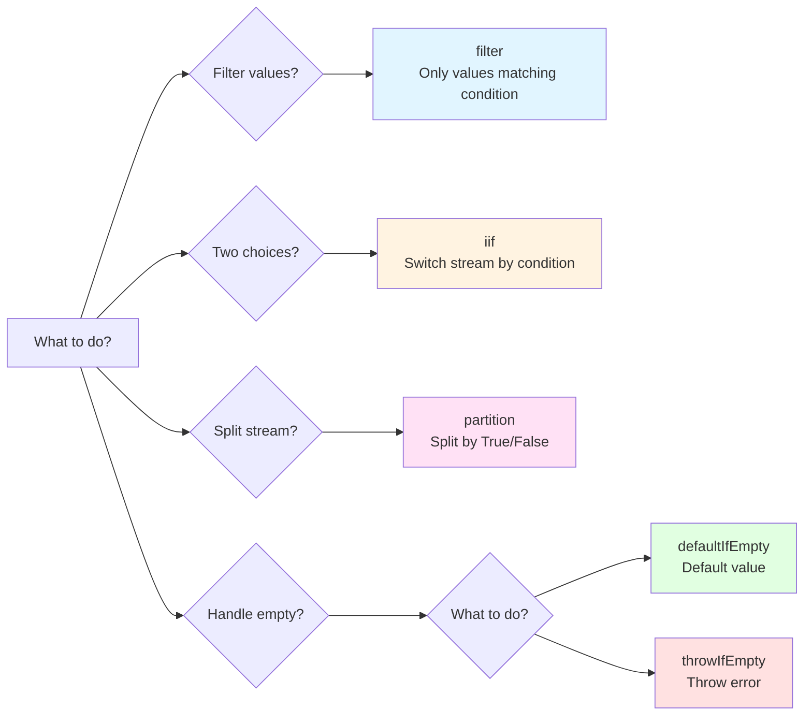

# Nested if Statement Hell within subscribe

## Why this is an Anti-pattern

"Complex conditional branching within subscribe" is a **clear anti-pattern** in RxJS. It is recognized as an implementation pattern that should be avoided for the following reasons.

### 1. Contradicts RxJS Design Philosophy

RxJS promotes **declarative programming**. You should express "what to do" in the pipeline and not write details of "how to do it" within subscribe.

```typescript
// ❌ Anti-pattern: Imperative programming (procedural)
userService.getUser(id).subscribe(user => {
  if (user.isActive) {
    if (user.role === 'admin') {
      console.log('Admin user');
    }
  }
});

// ✅ RxJS way: Declarative programming
userService.getUser(id).pipe(
  filter(user => user.isActive),
  filter(user => user.role === 'admin'),
  tap(user => console.log('Admin user'))
).subscribe();
```

### 2. Same Level Problem as Existing Anti-patterns

Like other anti-patterns covered in Chapter 10, it causes the following problems:

| Anti-pattern | Main Problem |
|---------------|---------|
| **Memory Leak** | Forgetting to unsubscribe |
| **Subscribe Hell** | Nested subscribes |
| **if Statement Hell within subscribe** ← This Page | Complex conditional branching |

### 3. Specific Problems

1. **Low readability** - Deep nesting makes the code's intent unclear
2. **Difficult to test** - Too many conditional branches cause test cases to explode
3. **Not reusable** - Logic is trapped within subscribe and cannot be used elsewhere
4. **Difficult to debug** - Hard to trace the flow of values, time-consuming to identify problem areas
5. **Complex error handling** - Difficult to track where errors occurred

### 4. Acceptable Range vs. Range to Avoid

```typescript
// ✅ Acceptable range: Simple branching (1-2 if statements)
subscribe(user => {
  if (user.isAdmin) {
    console.log('Admin user');
  } else {
    console.log('Regular user');
  }
});

// ⚠️ Caution: 2-3 levels of nesting
subscribe(user => {
  if (user) {
    if (user.isActive) {
      console.log('Active user');
    }
  }
});

// ❌ Anti-pattern: 3 or more levels of nesting
subscribe(user => {
  if (user) {
    if (user.isActive) {
      if (user.role === 'admin') {
        if (user.permissions.includes('write')) {
          // This is a clear anti-pattern
        }
      }
    }
  }
});
```

> [!IMPORTANT] Judgment Criteria
> - **1-2 if statements**: Acceptable range (though operators are preferable)
> - **3 or more nested levels**: Clear anti-pattern (must be refactored)
> - **Nested asynchronous processing**: Requires immediate refactoring


## Common Bad Patterns

### Pattern 1: Complex Conditional Branching within subscribe

```typescript
// ❌ Bad example: Nested if statements within subscribe
userService.getUser(id).subscribe(user => {
  if (user) {
    if (user.isActive) {
      if (user.role === 'admin') {
        // Processing for administrators
        console.log('Admin user:', user.name);
        adminService.loadAdminData().subscribe(adminData => {
          if (adminData) {
            // More nesting...
          }
        });
      } else {
        // Processing for regular users
        console.log('Regular user:', user.name);
      }
    } else {
      // Inactive user
      console.log('Inactive user');
    }
  } else {
    // User not found
    console.log('User not found');
  }
});
```

### Problems with This Code
1. **5 levels of nesting** - Readability significantly degraded
2. **Subscribe within subscribe** - Risk of memory leaks
3. **No error handling** - Unclear where errors might occur
4. **Impossible to test** - Difficult to test all paths
5. **Logic not reusable** - Cannot be used elsewhere


## Solutions Using RxJS Conditional Operators

### Solution 1: Conditional Branching with filter

**When to use?**: Filter values, exclude unwanted values

```typescript
import { filter, tap, switchMap } from 'rxjs';

// ✅ Good example: Separate conditions with filter
userService.getUser(id).pipe(
  filter(user => user !== null),           // null check
  filter(user => user.isActive),           // active check
  filter(user => user.role === 'admin'),   // role verification
  tap(user => console.log('Admin user:', user.name)),
  switchMap(user => adminService.loadAdminData())
).subscribe({
  next: adminData => console.log('Admin data loaded', adminData),
  error: err => console.error('Error:', err)
});
```

> [!NOTE] Advantages
> - ✅ Each condition is independent (readable)
> - ✅ Order is clear in the pipeline
> - ✅ Unified error handling

### Solution 2: Binary Branching with iif

**When to use?**: Execute different Observables based on conditions

```typescript
import { iif, of, switchMap } from 'rxjs';

// ✅ Good example: Switch streams based on condition with iif
userService.getUser(id).pipe(
  switchMap(user =>
    iif(
      () => user.role === 'admin',
      adminService.loadAdminData(),    // For administrators
      userService.loadUserData()       // For regular users
    )
  )
).subscribe(data => console.log('Data:', data));
```

> [!NOTE] Advantages
> - ✅ Binary branching is clear
> - ✅ Each process is an independent Observable
> - ✅ Easy to test

### Solution 3: Branch Processing with partition

**When to use?**: Split a stream into two and process separately

```typescript
import { partition, merge, tap, switchMap, map } from 'rxjs';

// ✅ Good example: Split stream into two with partition
const [activeUsers$, inactiveUsers$] = partition(
  userService.getUsers(),
  user => user.isActive
);

// Processing for active users
const processedActive$ = activeUsers$.pipe(
  tap(user => console.log('Active:', user.name)),
  switchMap(user => userService.loadProfile(user.id))
);

// Processing for inactive users
const processedInactive$ = inactiveUsers$.pipe(
  tap(user => console.log('Inactive:', user.name)),
  map(user => ({ ...user, status: 'archived' }))
);

// Merge the two streams
merge(processedActive$, processedInactive$).subscribe(
  result => console.log('Processed:', result)
);
```

> [!NOTE] Advantages
> - ✅ Active/inactive completely separated
> - ✅ Each can be processed independently
> - ✅ Easy to extend

### Solution 4: Default Value with defaultIfEmpty

**When to use?**: Provide a default value when empty

```typescript
import { defaultIfEmpty, filter } from 'rxjs';

// ✅ Good example: Provide default value when empty
userService.getUser(id).pipe(
  filter(user => user !== null),
  defaultIfEmpty({ id: 0, name: 'Guest', role: 'guest' })
).subscribe(user => {
  console.log('User:', user.name);
});
```

> [!NOTE] Advantages
> - ✅ No need for null check
> - ✅ Default value is clear
> - ✅ No branching needed within subscribe

### Solution 5: Error Handling with throwIfEmpty

**When to use?**: Treat empty as an error

```typescript
import { throwIfEmpty, catchError, filter } from 'rxjs';
import { of } from 'rxjs';

// ✅ Good example: Throw error when empty
userService.getUser(id).pipe(
  filter(user => user !== null),
  throwIfEmpty(() => new Error('User not found')),
  catchError(err => {
    console.error('Error:', err.message);
    return of(null);
  })
).subscribe(user => {
  if (user) {
    console.log('User found:', user.name);
  }
});
```

> [!NOTE] Advantages
> - ✅ Error handling is clear
> - ✅ Complete within pipeline
> - ✅ subscribe only handles success cases


## Practical Example: Refactoring Complex Conditional Logic

### Before: if Hell within subscribe

```typescript
// ❌ Bad example: Complex conditional logic (6 levels of nesting)
apiService.fetchData().subscribe(data => {
  if (data) {
    if (data.status === 'success') {
      if (data.result) {
        if (data.result.items.length > 0) {
          data.result.items.forEach(item => {
            if (item.isValid) {
              if (item.price > 0) {
                // Processing...
                console.log('Valid item:', item);
              }
            }
          });
        } else {
          console.log('No items found');
        }
      }
    } else {
      console.log('Request failed');
    }
  }
});
```

> [!WARNING] Problems
> - 6 levels of nesting
> - More conditional branching within forEach
> - No error handling
> - Impossible to test
> - Inefficient array processing

### After: Structured with Operators

```typescript
import { filter, map, defaultIfEmpty, switchMap, tap } from 'rxjs';
import { from } from 'rxjs';

// ✅ Good example: Organize conditions with operators
apiService.fetchData().pipe(
  // 1. Check data existence
  filter(data => data !== null),

  // 2. Check status
  filter(data => data.status === 'success'),

  // 3. Check result existence
  filter(data => data.result !== null),

  // 4. Expand array
  map(data => data.result.items),
  defaultIfEmpty([]),  // Default for empty array

  // 5. Process each item individually
  switchMap(items => from(items)),

  // 6. Only valid items
  filter(item => item.isValid),

  // 7. Check price
  filter(item => item.price > 0),

  // 8. Debug log
  tap(item => console.log('Valid item:', item))

).subscribe({
  next: item => console.log('Processing:', item),
  error: err => console.error('Error:', err),
  complete: () => console.log('All items processed')
});
```

> [!TIP] Improvements
> - ✅ Zero nesting (all flat)
> - ✅ Each condition is independent and readable
> - ✅ Error handling added
> - ✅ Easy to test (each operator can be tested individually)
> - ✅ Efficient array processing (stream-ified with from())


## Conditional Operator Selection Guide

Use the following flowchart to determine which operator to use.



| Condition | Operator to Use | Reason |
|-----|----------------|------|
| Filter values | `filter()` | Only pass values matching condition |
| Choose from 2 options | `iif()` | Switch stream based on condition |
| Split stream into two | `partition()` | Split into two streams by True/False |
| Default when empty | `defaultIfEmpty()` | Use default value when no value exists |
| Error when empty | `throwIfEmpty()` | Throw error when no value exists |
| Multiple options (3+) | Custom operator | When 3 or more branches are needed |


## Refactoring Steps

### Step 1: Identify Conditions
List all if statements within subscribe

```typescript
// Example: The following conditions exist
if (data)                        // ← Condition 1
if (data.status === 'success')   // ← Condition 2
if (data.result)                 // ← Condition 3
if (item.isValid)                // ← Condition 4
if (item.price > 0)              // ← Condition 5
```

### Step 2: Classify Conditions
- **Filtering conditions** → `filter()`
- **Binary branching** → `iif()`
- **Stream splitting** → `partition()`
- **Default value** → `defaultIfEmpty()`
- **Error condition** → `throwIfEmpty()`

### Step 3: Convert to Pipeline
Replace conditions with operators in pipe

```typescript
.pipe(
  filter(data => data !== null),              // Condition 1
  filter(data => data.status === 'success'),  // Condition 2
  filter(data => data.result !== null),       // Condition 3
  switchMap(data => from(data.result.items)),
  filter(item => item.isValid),               // Condition 4
  filter(item => item.price > 0)              // Condition 5
)
```

### Step 4: Simplify subscribe
subscribe only for side effects (log output, DOM manipulation, etc.)

```typescript
.subscribe({
  next: item => console.log('Valid item:', item),
  error: err => console.error('Error:', err),
  complete: () => console.log('Complete')
});
```

### Step 5: Write Tests
Verify each operator works as expected

```typescript
// Example: Testing filter
it('should filter out null values', () => {
  const source$ = of(null, { id: 1 }, null);
  const result$ = source$.pipe(
    filter(data => data !== null)
  );

  result$.subscribe(data => {
    expect(data).not.toBeNull();
  });
});
```


## Reuse with Custom Operators

Complex conditional logic can be extracted into custom operators for reuse.

```typescript
import { pipe } from 'rxjs';
import { filter } from 'rxjs';

// Custom operator: Only active admin users
function filterActiveAdmins<T extends { isActive: boolean; role: string }>() {
  return pipe(
    filter((user: T) => user.isActive),
    filter((user: T) => user.role === 'admin')
  );
}

// Usage example
userService.getUsers().pipe(
  filterActiveAdmins(),
  tap(user => console.log('Active admin:', user.name))
).subscribe();
```

> [!NOTE] Advantages
> - ✅ Reusable
> - ✅ Easy to test
> - ✅ Intent is clear from name


## Related Learning Resources

To understand this anti-pattern, please also refer to the following sections.

- **[Chapter 4: Conditional Operators](/en/guide/operators/conditional/)** - Details on filter, iif, defaultIfEmpty
- **[Chapter 10: Anti-Patterns](/en/guide/anti-patterns/)** - Other anti-patterns
- **[Chapter 11: Conceptual Understanding Barriers](/en/guide/overcoming-difficulties/conceptual-understanding)** - Understanding declarative programming
- **[Chapter 11: Operator Selection](/en/guide/overcoming-difficulties/operator-selection)** - How to choose appropriate operators


## Anti-pattern Avoidance Checklist

Check your own code.

```markdown
- [ ] No 3 or more nested if statements within subscribe
- [ ] Conditional branching is handled with operators in pipe
- [ ] subscribe only performs side effects (logs, DOM manipulation)
- [ ] Using filter to exclude unwanted values
- [ ] Handling empty cases with defaultIfEmpty or throwIfEmpty
- [ ] Complex conditions extracted into custom operators
- [ ] Error handling done with catchError
- [ ] No nested subscribes within subscribe
```

## Next Steps

After understanding this anti-pattern, learn practical patterns on the following pages.

1. **[Common Mistakes and How to Fix Them](/en/guide/anti-patterns/common-mistakes)** - Learn other anti-patterns
2. **[Chapter 11: Overcoming Difficulties](/en/guide/overcoming-difficulties/)** - Overcome RxJS-specific difficulties
3. **[Chapter 13: Practical Patterns](/en/guide/)** - Master correct implementation patterns (in preparation)

> [!TIP] Key Point
> Complex conditional branching within subscribe is a clear anti-pattern that contradicts RxJS's declarative programming philosophy. Use operators like filter, iif, and partition to handle conditions within the pipeline.
