# Relationship between Embedded Development and Reactive Programming

This presentation will discuss the possibilities and limitations of how reactive programming, especially asynchronous stream processing such as RxJS, can be utilized in embedded systems.

## What is Reactive Programming?

Reactive programming is a **declarative technique** that deals with asynchronous data streams over time. It views events and data streams as "values that change over time" and transforms, combines, and filters them.

In conventional imperative programming, it is necessary to explicitly describe "when" and "how" to process, but in reactive programming, "what" is processed is described declaratively.

```ts
// Conventional imperative approach
let sensorValue = 0;
setInterval(() => {
  sensorValue = readSensor();
  if (sensorValue > threshold) {
    handleAlert(sensorValue);
  }
}, 100);

// Reactive approach
sensorStream$
  .pipe(
    filter(value => value > threshold)
  )
  .subscribe(value => handleAlert(value));
```

The reactive approach clearly separates the data flow from the processing logic, improving readability and maintainability.

## Challenges in embedded development

Reactive programming is not widely used in embedded systems because of the following limitations.

### 1. performance limitation

Many embedded systems require **microsecond response**.

```ts
// ❌ Inappropriate for embedded control layer
motorControl$
  .pipe(
    map(signal => processSignal(signal)),  // Needs to be completed within tens of microseconds
    filter(value => value > threshold)
  )
  .subscribe(value => actuateMotor(value));
```

::: warning Challenges
- RxJS operator chain has high overhead
- Potential for garbage collection
- Response time is difficult to predict

:::

### 2. Memory limitations

Embedded systems operate with limited memory (a few KB to several MB).

::: warning Challenges
- Dynamic memory allocation is often prohibited
- Observable's internal state consumes memory
- Buffering operators (`buffer`, `window`) are especially memory intensive

:::

### 3. High level of abstraction

Reactive programming is highly abstract and unsuitable for hardware-level control.

::: warning Challenges
- Not suitable for register manipulation or DMA control
- Not suitable for processes requiring bit-level fine-grained control
- Debugging is complex (asynchronous streams are difficult to trace)

:::

### 4. Compatibility with RTOS

Real-Time Operating System (RTOS) performs priority-based task scheduling, while RxJS is event-loop based.

::: warning Issues
- Possibility of priority inversion
- Difficult to predict task execution timing
- Difficult to guarantee real-time performance

:::

## Optimal application layer: Event integration layer

In embedded systems, reactive programming is most effective at the **"Event Integration Layer"**.

### Where reactive models are most useful: on the "receiving end" of sensor inputs

In embedded systems, reactive programming shows its true value at the **receiving end** of data (sensor input).

#### Strengths of the reactive model on the receiving end (sensor input)
- Integrates asynchronous data from multiple sensors
- Declaratively describes correlations over time
- Event-driven processing can be expressed naturally
- Easy state management and filtering

#### Challenges of reactive models on the sender side (control output)
- Difficult to guarantee real-time performance (microsecond response required)
- Overhead is unacceptable
- Abstraction level too high for direct hardware control

### Sensor Input Stream Features and Benefits

| Features | Traditional imperative approach | Reactive approach | Advantages |
|------|---------------------|---------------------|------|
| **Integration of multiple sensors** | Polling and manual synchronization for each sensor | Declarative integration with `combineLatest`, `merge` | Concise code, clear intent |
| **Aggregation in a time window** | Manual management of timers and buffers | Automated with `bufferTime`, `windowTime` | Fewer implementation errors, improved maintainability |
| **Noise Reduction** | Implement moving average with loop and array operations | Declaratively written with `scan` + `map` | Highly readable and reusable |
| **Anomaly Detection** | Complex nesting of flags and conditionals | Clearly expressed with `pairwise` + `filter` | Easy to follow logic |
| **Event Correlation** | State variables to track events and make manual decisions | Pattern detection with `merge` + `bufferTime` | Declarative, easy to extend |
| **Unsubscription** | Manual flag management, leak-prone | Automatically released with `takeUntil` | Prevent memory leakage |

### Difference from control side (originating side)

It is important to understand the difference between the characteristics of the "receiving side" and the "sending side" in an embedded system.

| Viewpoint | Receiving side (sensor input) | Sending side (control output) |
|------|---------------------|------------------|
| **Real-Time** | Milliseconds (relatively loose) | Microseconds (rigorous) |
| **Processing nature** | Asynchronous, event driven | Synchronous, periodic execution |
| **Complexity** | Multiple source integration, state management | Simple output, speed oriented |
| **RxJS suitability** | ✅ **Optimal** - strong event integration | ❌ **Unsuitable** - high overhead |
| **Main processing** | Filtering, smoothing, correlation detection | PWM control, motor drive, DMA transfer |

::: tip Specializing in the "receiver" of sensor inputs
Reactive programming is most effective when **integrating and evaluating multiple asynchronous events over time**. Utilize it by specializing on the "receiving side" of sensor inputs rather than the "sending side" such as control outputs.
:::

### Layered system architecture

```mermaid
flowchart TB
    app["<b>Application layer</b><br/>(Receiver of sensor input)"]
    event["<b>Event Integration Layer ★</b><br/>(Integration and evaluation of multiple inputs)"]
    control["<b>Control layer</b><br/>(motor, actuator)"]
    hw["<b>Hardware access layer</b><br/>(registers, DMA, interrupts)"]

    noteApp["RxJS best suited"]
    noteEvent["RxJS best suited"]
    noteControl["RxJS unsuitable"]
    noteHw["RxJS unsuitable"]

    app --> event
    event --> control
    control --> hw

    app -.-> noteApp
    event -.-> noteEvent
    control -.-> noteControl
    hw -.-> noteHw

    classDef optimal fill:#c8e6c9,stroke:#2e7d32,stroke-width:2px,color:#333,font-size: 0.9rm
    classDef unsuitable fill:#ffcdd2,stroke:#c62828,stroke-width:2px,color:#333
    classDef note fill:#fff9c4,stroke:#f57f17,stroke-width:1px,stroke-dasharray: 5 5,color:#333

    class app,event optimal
    class control,hw unsuitable
    class noteApp,noteEvent,noteControl,noteHw note
```



#### Event Integration Layer Features
- Integrate inputs from multiple sensors and event sources
- Evaluates correlations over time
- Relatively loose real-time requirements (in milliseconds)
- Focuses on state management and condition evaluation

## Practical Applications

### 1. Smoothing of sensor values

Smoothes inputs from multiple sensors to remove noise.

```ts
import { interval, combineLatest } from 'rxjs';
import { map, scan, share } from 'rxjs';

// Simulation of sensor streams
const temperatureSensor$ = interval(100).pipe(
  map(() => 25 + Math.random() * 5), // 25-30℃
  share()
);

const humiditySensor$ = interval(100).pipe(
  map(() => 50 + Math.random() * 10), // 50-60%
  share()
);

// Smoothing with moving averages
function movingAverage(windowSize: number) {
  return scan<number, number[]>((acc, value) => {
    const newWindow = [...acc, value];
    if (newWindow.length > windowSize) {
      newWindow.shift();
    }
    return newWindow;
  }, []).pipe(
    map(window => window.reduce((sum, val) => sum + val, 0) / window.length)
  );
}

const smoothedTemperature$ = temperatureSensor$.pipe(
  movingAverage(5),
  map(value => Math.round(value * 10) / 10)
);

const smoothedHumidity$ = humiditySensor$.pipe(
  movingAverage(5),
  map(value => Math.round(value * 10) / 10)
);

// Integrated environmental data
combineLatest([smoothedTemperature$, smoothedHumidity$])
  .pipe(
    map(([temp, humidity]) => ({
      temperature: temp,
      humidity: humidity,
      heatIndex: calculateHeatIndex(temp, humidity),
      timestamp: Date.now()
    }))
  )
  .subscribe(data => {
    console.log('Environmental data:', data);
  });

function calculateHeatIndex(temp: number, humidity: number): number {
  // Simplified sensory temperature calculation
  return temp + (0.5555 * (6.11 * Math.exp(5417.753 * ((1/273.16) - (1/(273.15 + temp)))) - 10));
}
```

> [!NOTE] Advantages of Sensor Integration
> - Synchronized processing of multiple sensor values over time
> - Noise eliminated by moving average
> - Declaratively derive calculated values (e.g., temperature)

### 2. Event correlation detection

Detects when multiple events occur within a specific time window.

```ts
import { Subject, merge } from 'rxjs';
import { filter, bufferTime, map } from 'rxjs';

// Event Streams
const motionDetected$ = new Subject<{ sensor: string; timestamp: number }>();
const doorOpened$ = new Subject<{ door: string; timestamp: number }>();
const lightOn$ = new Subject<{ room: string; timestamp: number }>();

// Consolidate all events
const allEvents$ = merge(
  motionDetected$.pipe(map(e => ({ type: 'motion', ...e }))),
  doorOpened$.pipe(map(e => ({ type: 'door', ...e }))),
  lightOn$.pipe(map(e => ({ type: 'light', ...e })))
);

// Aggregate events in 1-second time windows
allEvents$
  .pipe(
    bufferTime(1000),
    filter(events => events.length > 0),
    map(events => {
      const hasMotion = events.some(e => e.type === 'motion');
      const hasDoor = events.some(e => e.type === 'door');
      const hasLight = events.some(e => e.type === 'light');

      return {
        timestamp: Date.now(),
        events,
        pattern: {
          hasMotion,
          hasDoor,
          hasLight
        }
      };
    }),
    filter(result =>
      // Detects patterns of people entering a room
      result.pattern.hasMotion && result.pattern.hasDoor
    )
  )
  .subscribe(result => {
    console.log('Entry detection:', result);
    // Automatic lighting if lights are not on
    if (!result.pattern.hasLight) {
      console.log('→ Automatically turn on lights');
    }
  });

// Simulation of event occurrence
setTimeout(() => motionDetected$.next({ sensor: 'entry', timestamp: Date.now() }), 100);
setTimeout(() => doorOpened$.next({ door: 'front', timestamp: Date.now() }), 200);
```

> [!TIP] Use of Event Correlation
> - Estimating the situation from multiple events within a time window
> - Anomaly detection in security systems
> - Automation logic for smart home

### 3. Abnormal detection

Detects abnormal patterns in sensor values.

```ts
import { interval } from 'rxjs';
import { map, pairwise, filter, share } from 'rxjs';

// Simulation of vibration sensor
const vibrationSensor$ = interval(50).pipe(
  map(() => {
    // Normally 0-10, 50 or more for anomalies
    const normal = Math.random() * 10;
    const isAbnormal = Math.random() < 0.05; // 5% probability of abnormality
    return isAbnormal ? 50 + Math.random() * 20 : normal;
  }),
  share()
);

// Abnormality detection logic
vibrationSensor$
  .pipe(
    pairwise(), // Pair two consecutive values
    map(([prev, current]) => ({
      prev,
      current,
      delta: Math.abs(current - prev),
      timestamp: Date.now()
    })),
    filter(data =>
      // Above threshold or sudden change
      data.current > 30 || data.delta > 20
    )
  )
  .subscribe(data => {
    console.log('⚠️ Anomaly detection:', {
      'Current value': data.current.toFixed(2),
      'Amount of change': data.delta.toFixed(2),
      'Time': new Date(data.timestamp).toISOString()
    });
  });
```

> [!WARNING] Cautions for anomaly detection
> - Threshold adjustment is important (depends on environment and equipment)
> - Filtering is necessary to reduce false positives
> - Effective to devise a method such as issuing an alert only when consecutive anomalies occur a certain number of times

### 4. state estimation

Estimates equipment status from multiple sensor values.

```ts
import { combineLatest, interval } from 'rxjs';
import { map, distinctUntilChanged, share } from 'rxjs';

// Sensor Stream
const current$ = interval(100).pipe(
  map(() => 1.5 + Math.random() * 0.5), // Current value 1.5-2.0A
  share()
);

const temperature$ = interval(100).pipe(
  map(() => 40 + Math.random() * 10), // Temperature 40-50°C
  share()
);

const vibration$ = interval(100).pipe(
  map(() => 5 + Math.random() * 5), // Vibration value 5-10
  share()
);

// State Definition
type MachineState = 'idle' | 'running' | 'overload' | 'warning';

interface MachineStatus {
  state: MachineState;
  current: number;
  temperature: number;
  vibration: number;
  timestamp: number;
}

// Condition Estimation Logic
combineLatest([current$, temperature$, vibration$])
  .pipe(
    map(([current, temperature, vibration]): MachineStatus => {
      let state: MachineState = 'idle';

      // Condition determination logic
      if (current > 1.8 && temperature > 45 && vibration > 8) {
        state = 'overload';
      } else if (temperature > 48 || vibration > 9) {
        state = 'warning';
      } else if (current > 1.6) {
        state = 'running';
      }

      return {
        state,
        current: Math.round(current * 100) / 100,
        temperature: Math.round(temperature * 10) / 10,
        vibration: Math.round(vibration * 10) / 10,
        timestamp: Date.now()
      };
    }),
    distinctUntilChanged((prev, curr) => prev.state === curr.state) // Notification only when state changes
  )
  .subscribe(status => {
    console.log(`Equipment condition: ${status.state}`, {
      'Current': `${status.current}A`,
      'Temperature': `${status.temperature}℃`,
      'Vibration': status.vibration
    });

    // Condition-based processing
    switch (status.state) {
      case 'overload':
        console.log('🔴 Overload detection - stops equipment');
        break;
      case 'warning':
        console.log('🟡 Alerts - intensify monitoring');
        break;
    }
  });
```

> [!IMPORTANT] Key Points for Condition Estimation
> - Combine values from multiple sensors to determine state
> - Process only when state changes with `distinctUntilChanged`
> - Start with simple threshold-based rules and incorporate machine learning as needed

## best practice

### 1. Selecting the Application Layer

```ts
// ✅ Good example: use at the event integration layer
const userActivity$ = merge(
  buttonClick$,
  sensorInput$,
  timerEvent$
).pipe(
  debounceTime(100),
  map(event => processEvent(event))
);

// ❌ Bad example: use in control layer
const motorControl$ = interval(10).pipe(  // 10ms is too slow for control layer
  map(() => readEncoder()),
  map(value => calculatePID(value))
);
```

### 2. memory management

```ts
// ✅ Ensure Unsubscription
import { Subject } from 'rxjs';
import { takeUntil } from 'rxjs';

class SensorManager {
  private destroy$ = new Subject<void>();

  start() {
    sensorStream$
      .pipe(
        takeUntil(this.destroy$)
      )
      .subscribe(data => this.process(data));
  }

  stop() {
    this.destroy$.next();
    this.destroy$.complete();
  }

  private process(data: any) {
    // Processing
  }
}
```

### 3. Buffer size limitation

```ts
// ✅ Explicitly limit buffer size
import { bufferTime } from 'rxjs';

sensorStream$
  .pipe(
    bufferTime(1000, null, 100) // Maximum of 100 buffers
  )
  .subscribe(batch => processBatch(batch));

// ❌ Avoid unlimited buffers
sensorStream$
  .pipe(
    bufferTime(10000) // Buffer for 10 seconds → risk of running out of memory
  )
  .subscribe(batch => processBatch(batch));
```

### 4. error handling

```ts
import { catchError, retry } from 'rxjs';
import { of } from 'rxjs';

sensorStream$
  .pipe(
    retry({ count: 3, delay: 1000 }),
    catchError(error => {
      console.error('Sensor error:', error);
      // Return default value or fallback handling
      return of({ value: 0, error: true });
    })
  )
  .subscribe(data => {
    if (data.error) {
      handleSensorFailure();
    } else {
      processNormalData(data);
    }
  });
```

## Summary

Key Points for Using Reactive Programming in Embedded Development

### Applicable Areas of Application
- ✅ **Event Integration Layer** - Sensor input integration, event correlation detection
- ✅ **Application Layer** - state estimation, anomaly detection, data visualization
- ❌ **Control Layer** - motor control, actuators (real-time requirements)
- ❌ **Hardware Access Layer** - register manipulation, DMA, interrupt handling

### Examples of Effective Applications
- ✅ Smoothing and integration of sensor values
- ✅ Event correlation detection over time
- ✅ Detection of anomaly patterns
- ✅ State estimation from multiple sensors

### Notes
- ⚠️ Monitoring and limiting memory usage
- ⚠️ Reliable unsubscription
- ⚠️ Explicit limits on buffer size
- ⚠️ Proper error handling

Reactive programming is not applicable to "all layers" of an embedded system, but it can be very effective at the **event integration layer**. Utilizing it at the appropriate layer can greatly improve code readability and maintainability.

## Looking Ahead: Reactivity Becomes Inevitable in Embedded

Embedded systems continue to evolve, and reactive programming will become even more important in the future.

### Explosive increase in the number of sensors

The number of sensors handled in modern embedded systems, especially IoT devices and smart systems, is rapidly increasing.

#### Increasing complexity of sensor integration
- Automotive: dozens to hundreds of sensors (ADAS, self-driving)
- Smart home: temperature, humidity, motion, doors, windows, cameras, and many more
- Industrial equipment: complex monitoring of vibration, temperature, current, pressure, position, etc.
- Wearable devices: heart rate, acceleration, gyro, GPS, barometric pressure, etc.

#### Limitations of the traditional imperative approach
```ts
// ❌ Integration of 10 or more sensors in an imperative approach breaks down
let temp1, temp2, temp3, humidity1, humidity2, motion1, motion2;
let lastUpdate1, lastUpdate2, lastUpdate3;
// ... Infinite number of variables

setInterval(() => {
  temp1 = readSensor1();
  temp2 = readSensor2();
  // ... Polling code becomes long

  if (temp1 > threshold1 && humidity1 > threshold2 && ...) {
    // ... Conditional branches become more complex
  }
}, 100);
```

#### The necessity of a reactive approach
```ts
// ✅ Can be described declaratively even if the number of sensors increases
const allSensors$ = combineLatest({
  temp1: temperatureSensor1$,
  temp2: temperatureSensor2$,
  temp3: temperatureSensor3$,
  humidity1: humiditySensor1$,
  humidity2: humiditySensor2$,
  motion1: motionSensor1$,
  motion2: motionSensor2$,
  // Just add lines when more sensors are added
});

allSensors$
  .pipe(
    map(sensors => evaluateConditions(sensors)),
    filter(result => result.shouldAlert)
  )
  .subscribe(result => handleAlert(result));
```

### The Rise of Edge Computing

Reducing reliance on the cloud, data processing on edge devices is becoming more important.

#### Requirements at the Edge
- Real-time data processing from multiple sensors
- Local anomaly detection and pattern recognition
- Execution of lightweight machine learning models
- Autonomous operation during network failures

These requirements are compatible with **asynchronous stream processing**, making reactive programming a natural choice.

### Hardware evolution

As the performance of embedded processors improves, the overhead of reactive programming is becoming acceptable.

| age | processor performance | memory | reactive applicability |
|------|-------------|--------|-------------------|
| 2000s | several MHz, 8bit | several KB | ❌ difficult - large overhead |
| 2010s | tens to hundreds of MHz, 32bit | tens of KB to several MB | △ Limited - event layer only |
| 2020's and beyond | GHz-class, 64bit, multi-core | Hundreds of MB to GB | ✅ **Practical** - applicable at many layers |

#### Examples of modern embedded processors
- Raspberry Pi 4: 1.5GHz quad core, up to 8GB RAM
- ESP32: 240MHz dual core, 520KB SRAM
- STM32H7: 480MHz, 1MB RAM

With these hardware, the overhead of RxJS is well within acceptable limits.

### The necessity of reactive programming

Reactive programming is becoming a **necessity** rather than an **option** in embedded systems for the following reasons.

::: info Reasons why reactive programming is becoming inevitable

1. **Increase in number of sensors** - command-and-control management of tens or hundreds of sensors is limited
2. **Importance of correlation detection over time** - Pattern recognition of events is essential
3. **Rise of edge AI** - ideal for pre-processing sensor data
4. **Code maintainability** - need to write complex systems declaratively
5. **Hardware evolution** - overhead is acceptable

:::

### Practical Transition Strategies

Strategies for introducing reactive programming into existing embedded systems

#### Phased introduction
1. **Phase 1**: Pilot reactive in new functionality (sensor integration layer)
2. **Phase 2**: Replace event processing with reactives
3. **Phase 3**: Make the entire application layer reactive
4. **Keep the control layer conventional** - do not change the parts that need real-time performance

**Hybrid approach:**
```ts
// Control layer: conventional imperative (microsecond response)
function controlMotor(speed: number) {
  // Direct register manipulation, high-speed processing
  writeRegister(MOTOR_CONTROL_REG, speed);
}

// Event integration layer: Reactive (millisecond response)
const motorSpeedCommand$ = combineLatest([
  targetSpeed$,
  currentLoad$,
  temperatureLimit$
]).pipe(
  map(([target, load, tempLimit]) => calculateOptimalSpeed(target, load, tempLimit))
);

motorSpeedCommand$.subscribe(speed => {
  // Values determined by reactive are passed to conventional control functions
  controlMotor(speed);
});
```

Thus, by properly combining **reactive programming (the receiving side)** and **traditional imperative control (the sending side)**, the advantages of both can be leveraged.

## Related Pages

- [Introduction to RxJS](/en/guide/introduction) - Basic concepts of RxJS
- [How to create an Observable](/en/guide/observables/creation) - Creating a sensor stream
- [Combination operators](/en/guide/operators/combination/) - combineLatest, merge details
- [Filtering operators](/en/guide/operators/filtering/) - filter, debounceTime utilization
- [Error handling](/en/guide/error-handling/strategies) - handling sensor errors
- [Performance debugging](/en/guide/debugging/performance) - monitor memory usage

## reference data

- [GitHub Discussions - Embedded Development and Reactive Programming](https://github.com/shuji-bonji/RxJS-with-TypeScript/discussions/13)
- [Official RxJS Documentation](https://rxjs.dev/)
