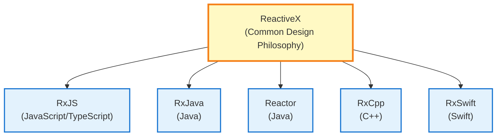
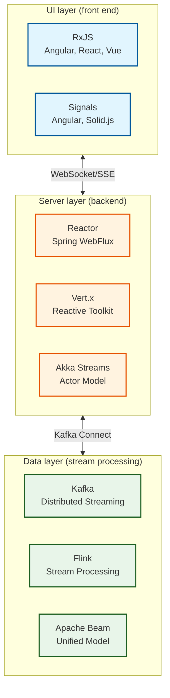
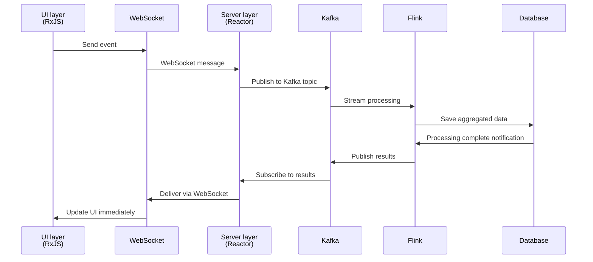

# RxJS and Reactive Streams Ecosystem

When learning RxJS, many developers ask, "How does RxJS fit into the overall picture of Reactive Programming?" When learning RxJS, many developers ask themselves the question, "How does RxJS fit into Reactive Programming?

This page explains **the difference between RxJS and the Reactive Streams standard**, **the overall technology stack from the UI layer to the data layer**, and **how the different technologies work together**.

## Positioning of RxJS

### What is RxJS?

**RxJS** (Reactive Extensions for JavaScript) is the primary implementation of Reactive Programming in the **browser and Node.js environment**.



::: info Features of RxJS
- Runs in browser and Node.js
- UI responsiveness is a top priority
- Lightweight and fast
- Back pressure is implicit
:::


## RxJS vs Reactive Streams standard

There are two major trends in Reactive Programming: **RxJS** and the **Reactive Streams standard**.

### What is the Reactive Streams standard?

[Reactive Streams](https://www.reactive-streams.org/) is a standard specification for stream processing on the JVM.

**Main implementations:**
- **Project Reactor** (Spring WebFlux)
- **RxJava 3**
- **Akka Streams**
- **Mutiny** (Quarkus)

**Four standardized interfaces:**
```java
public interface Publisher<T> {
    void subscribe(Subscriber<? super T> s);
}

public interface Subscriber<T> {
    void onSubscribe(Subscription s);
    void onNext(T t);
    void onError(Throwable t);
    void onComplete();
}

public interface Subscription {
    void request(long n);  // Back pressure control
    void cancel();
}

public interface Processor<T, R> extends Subscriber<T>, Publisher<R> {}
```

### Key difference: back pressure control

| Perspectives | RxJS | Reactive Streams Standard |
|------|------|---------------------|
| **Platform** | JavaScript/TypeScript (browser, Node.js) | JVM (Java, Scala, Kotlin) |
| **Backpressure** | Implicit (operator level) | Explicit (`request(n)` method) |
| **Priority** | UI responsiveness | Server throughput |
| **Standardization** | ReactiveX Common API | Reactive Streams Specification |

#### RxJS back pressure (implicit)

```typescript
import { interval } from 'rxjs';
import { bufferTime, take } from 'rxjs';

// Back pressure is controlled by operator
interval(10)  // issue a value every 10 ms
  .pipe(
    bufferTime(1000),  // buffering every 1 second (implicit control)
    take(5)
  )
  .subscribe(batch => console.log('batch:', batch.length));
```

#### Reactive Streams backpressure (explicit)

```java
// Project Reactor（Java）
Flux.range(1, 1000)
    .subscribe(new BaseSubscriber<Integer>() {
        @Override
        protected void hookOnSubscribe(Subscription subscription) {
            request(10);  // request first 10 (explicit)
        }

        @Override
        protected void hookOnNext(Integer value) {
            System.out.println("Processing: " + value);
            request(1);  // request next one after processing (explicit)
        }
    });
```

> [!IMPORTANT]
> **Difference in back pressure**
>
> - **RxJS**: Implicitly controlled by operators (`bufferTime`, `throttleTime`, `debounceTime`)
> - **Reactive Streams**: explicitly controlled by `request(n)` method
>
> This difference reflects the difference between UI (RxJS) and server (Reactive Streams) requirements.

## Technology Stack by Layer

Reactive Programming forms a technology stack that spans multiple layers, from the UI layer to the data layer.

### Overall Architecture



### 1. UI layer (front end)

**Major technologies: RxJS, Signals**

```typescript
// RxJS (UI layer standard)
import { fromEvent } from 'rxjs';
import { debounceTime, distinctUntilChanged, switchMap } from 'rxjs';

const searchInput$ = fromEvent(input, 'input').pipe(
  map(event => (event.target as HTMLInputElement).value),
  debounceTime(300),
  distinctUntilChanged(),
  switchMap(query => fetch(`/api/search?q=${query}`).then(r => r.json()))
);

searchInput$.subscribe(results => updateUI(results));
```

::: info Features:
- Works in browser environment
- UI responsiveness is a top priority
- Unified handling of user input, DOM events, and HTTP communication
:::

### 2. Server layer (backend)

**Major technologies: Project Reactor, Vert.x, Akka Streams**

#### Project Reactor (Spring WebFlux)

```java
// Project Reactor (server layer standard)
@RestController
public class UserController {

    @GetMapping("/users")
    public Flux<User> getUsers() {
        return userRepository.findAll()  // Reactive Repository
            .filter(user -> user.isActive())
            .map(user -> enrichUserData(user))
            .onErrorResume(error -> Flux.empty());
    }

    @GetMapping("/users/{id}")
    public Mono<User> getUser(@PathVariable String id) {
        return userRepository.findById(id)
            .switchIfEmpty(Mono.error(new UserNotFoundException(id)));
    }
}
```


::: info Features:
- Compliant with Reactive Streams standard
- Non-blocking I/O
- High throughput
- Explicit back pressure control
:::

#### Akka Streams (Actor Model)

```scala
// Akka Streams (for distributed systems)
val source = Source(1 to 100)
val flow = Flow[Int].map(_ * 2)
val sink = Sink.foreach[Int](println)

source.via(flow).to(sink).run()
```


::: info Features:
- Actor model based
- Ideal for distributed systems
- Fault isolation and recovery
:::

### 3. Data layer (stream processing)

**Main technologies: Kafka, Flink, Apache Beam**

#### Apache Kafka (event streaming)

```java
// Kafka Streams (data pipeline)
StreamsBuilder builder = new StreamsBuilder();

KStream<String, String> source = builder.stream("input-topic");

source
    .filter((key, value) -> value.length() > 10)
    .mapValues(value -> value.toUpperCase())
    .to("output-topic");

KafkaStreams streams = new KafkaStreams(builder.build(), config);
streams.start();
```


::: info Features:
- Distributed event streaming platform
- High throughput, low latency
- Event sourcing, foundation for CQRS pattern
:::

#### Apache Flink (stream processing)

```java
// Flink (real-time stream processing)
StreamExecutionEnvironment env = StreamExecutionEnvironment.getExecutionEnvironment();

DataStream<Event> events = env.addSource(new KafkaSource<>());

events
    .filter(event -> event.getValue() > threshold)
    .keyBy(Event::getSensorId)
    .timeWindow(Time.seconds(10))
    .reduce((e1, e2) -> new Event(e1.getSensorId(), e1.getValue() + e2.getValue()))
    .addSink(new DatabaseSink());

env.execute("Stream Processing Job");
```


::: info Features:
- Real-time stream processing engine
- Exactly Once (Exactly-once) Guarantee
- Event-time processing and watermarking
:::

## Bridging technology: coordination of different layers

How do we coordinate between different technology stacks?

### 1. UI layer ⇄ Server layer: WebSocket / SSE

#### WebSocket (bidirectional communication)

**Front end (RxJS):**
```typescript
import { webSocket } from 'rxjs/webSocket';

const socket$ = webSocket<Message>('wss://example.com/ws');

// Received
socket$.subscribe(message => console.log('Received:', message));

// Send
socket$.next({ type: 'subscribe', channel: 'notifications' });
```

**Backend (Spring WebFlux):**
```java
@Configuration
@EnableWebSocketMessageBroker
public class WebSocketConfig implements WebSocketMessageBrokerConfigurer {

    @Override
    public void configureMessageBroker(MessageBrokerRegistry config) {
        config.enableSimpleBroker("/topic");
        config.setApplicationDestinationPrefixes("/app");
    }

    @Override
    public void registerStompEndpoints(StompEndpointRegistry registry) {
        registry.addEndpoint("/ws").withSockJS();
    }
}

@Controller
public class NotificationController {

    @MessageMapping("/subscribe")
    public Flux<Notification> subscribe(@Payload SubscribeRequest request) {
        return notificationService.getNotificationStream(request.getChannel());
    }
}
```

#### Server-Sent Events (Server → Client)

**Front End (RxJS):**
```typescript
import { Observable } from 'rxjs';

function fromSSE<T>(url: string): Observable<T> {
  return new Observable(subscriber => {
    const eventSource = new EventSource(url);

    eventSource.onmessage = event => {
      subscriber.next(JSON.parse(event.data));
    };

    eventSource.onerror = error => {
      subscriber.error(error);
    };

    return () => eventSource.close();
  });
}

const notifications$ = fromSSE<Notification>('/api/notifications/stream');
notifications$.subscribe(n => console.log('Notification:', n));
```

**Backend (Spring WebFlux):**
```java
@GetMapping(value = "/notifications/stream", produces = MediaType.TEXT_EVENT_STREAM_VALUE)
public Flux<Notification> streamNotifications() {
    return notificationService.getNotificationStream()
        .delayElements(Duration.ofSeconds(1));
}
```

### 2. Server Layer ⇄ Data Layer: Kafka Connect

**Server Layer (Reactor) to Kafka:**
```java
// Spring WebFlux + Kafka
@Service
public class EventPublisher {

    private final KafkaTemplate<String, Event> kafkaTemplate;

    public Mono<Void> publishEvent(Event event) {
        return Mono.fromFuture(
            kafkaTemplate.send("events-topic", event.getId(), event)
                .completable()
        ).then();
    }
}
```

**Kafka to server layer (Reactor):**
```java
// Kafka Consumer (Reactive)
@Service
public class EventConsumer {

    @KafkaListener(topics = "events-topic")
    public Mono<Void> consume(Event event) {
        return processEvent(event)
            .then();
    }

    private Mono<Void> processEvent(Event event) {
        return Mono.fromRunnable(() -> {
            System.out.println("Event processing: " + event);
        });
    }
}
```

### 3. End-to-end reactive pipeline



## Technology Selection Guidelines

Which technology should be used at which layer?

### Selection of UI layer (front end)

| Requirements | Recommended Technology | Reasons |
|------|---------|------|
| Complex Asynchronous Flow | **RxJS** | Rich Operators, Unified API |
| Simple reactivity | **Angular Signals** / **Solid.js** | Low learning cost, intuitive |
| Framework standards | **React Hooks** / **Vue Composition API** | Framework integration |

```typescript
// Example of why you should choose RxJS: Complex asynchronous flow
combineLatest([
  userInput$,
  apiStatus$,
  validation$
]).pipe(
  debounceTime(300),
  distinctUntilChanged(),
  switchMap(([input, status, isValid]) =>
    isValid ? submitData(input) : of(null)
  )
).subscribe(/*...*/);

// Example of how Signals should be chosen: Simple state management
const count = signal(0);
const doubled = computed(() => count() * 2);
```

### Selection of server layer (backend)

| Requirements | Recommended Technology | Reasons |
|------|---------|------|
| High Throughput API | **Spring WebFlux** (Reactor) | JVM ecosystem, rich library |
| Micro Services | **Vert.x** / **Quarkus** (Mutiny) | Lightweight, fast startup |
| Distributed System | **Akka Streams** | Actor Model, Fault Isolation |
| Node.js Environment | **RxJS** / **Node.js Streams** | JavaScript Unification |

```java
// Spring WebFlux (high throughput API)
@GetMapping("/users")
public Flux<User> getUsers() {
    return userRepository.findAll()
        .filter(User::isActive)
        .map(this::enrichData);
}
```

### Selection of data layer (stream processing)

| Requirements | Recommended Technology | Reasons |
|------|---------|------|
| Event Streaming | **Apache Kafka** | High Throughput, Distributed, Persistent |
| Real-Time Processing | **Apache Flink** | Low Latency, State Management |
| Batch + stream integration | **Apache Beam** | Unified API model |
| IoT Data Processing | **Kafka + Flink** | Scalability, Reliability |

```java
// Kafka + Flink (IoT data processing)
StreamExecutionEnvironment env = StreamExecutionEnvironment.getExecutionEnvironment();

DataStream<SensorReading> sensorData = env
    .addSource(new FlinkKafkaConsumer<>("sensors", deserializer, properties));

sensorData
    .keyBy(SensorReading::getSensorId)
    .timeWindow(Time.minutes(5))
    .aggregate(new AverageAggregator())
    .addSink(new FlinkKafkaProducer<>("aggregated-data", serializer, properties));
```

## Commonality and Differences in Operator Syntax

RxJS, Reactor, and Kafka Streams have **similar syntax** but different **semantics**.

### Commonality: declarative pipeline

**RxJS (UI layer):**
```typescript
source$
  .pipe(
    filter(x => x > 10),
    map(x => x * 2),
    take(5)
  )
  .subscribe(console.log);
```

**Reactor (server layer):**
```java
source
    .filter(x -> x > 10)
    .map(x -> x * 2)
    .take(5)
    .subscribe(System.out::println);
```

**Kafka Streams (data layer):**
```java
stream
    .filter((key, value) -> value > 10)
    .mapValues(value -> value * 2)
    .to("output-topic");
```

### Difference: Execution Model and Semantics

| Viewpoint | RxJS | Reactor | Kafka Streams |
|------|------|---------|---------------|
| **Execution Environment** | Single Threaded (Event Loop) | Multithreadable | Distributed Processing |
| **Scheduling** | Implicit (default synchronization) | Explicit (Schedulers) | Auto-distributed |
| **Error Handling** | `catchError` | `onErrorResume` | Exactly-once Guarantee |
| **Backpressure** | Operator Level | `request(n)` | Automatic Control |

> [!WARNING]
> ** Just because the operator syntax is similar does not mean they work the same way. ** It is important to understand the execution model and semantics of each technology.

## RxJS Strengths and Areas of Application

### Areas where RxJS is strongest

1. **Browser UI processing**
   - Unified processing of user input, DOM events, and HTTP communication

2. **Node.js asynchronous I/O**
   - File operations, streaming network communications

3. **Integration of multiple asynchronous processes**
   - Complex flows in `combineLatest`, `merge`, `switchMap`, etc.

### Limitations of RxJS

1. **High throughput server processing**
   - JVM-based Reactor, Akka Streams are more advantageous

2. **Distributed stream processing**
   - Kafka, Flink are more suitable

3. **Strict backpressure control**
   - Requires explicit `request(n)` in Reactive Streams standard

> [!TIP]
> **RxJS is strongest at the UI layer, but other technologies may be more suitable at the server and data layers.** It is not necessary to use RxJS at all layers.

## Summary

### Positioning of RxJS

> [!IMPORTANT]
> RxJS is the primary implementation of **Reactive Programming in the **browser and Node.js environment**, prioritizing UI responsiveness and employing implicit backpressure control.

### Reactive Streams Ecosystem Overview

```
UI layer         : RxJS, Signals
Communication layer : WebSocket, SSE
Server Layer     : Reactor, Vert.x, Akka Streams
Data Layer       : Kafka, Flink, Apache Beam
```

### Technology Selection Guideline

| Layers | Recommended Techniques | Reasons |
|----|---------|------|
| **UI Layer** | RxJS, Signals | UI Responsiveness, Rich Operators |
| **Server Layer** | Reactor, Vert.x | High throughput, Reactive Streams standard |
| **Data Layer** | Kafka, Flink | Distributed processing, scalability |

### Bridging Technology

- **UI ⇄ Server**: WebSocket, SSE
- **Server ⇄ Data**: Kafka Connect, Reactive Kafka

### Commonality of operator syntax

RxJS, Reactor, and Kafka Streams have similar syntax, but **different execution models and semantics**. It is important to understand the characteristics of each technology and use them differently.

> [!TIP]
> ** There is no need to unify all layers with RxJS.** By selecting the most appropriate technology for each layer and linking them together with bridging technology, an end-to-end reactive system can be built.

## Related Pages

- [Reactive Architecture Map](/en/guide/appendix/reactive-architecture-map) - Details of the 7 layers
- [Reactive Programming Reconsidered](/en/guide/appendix/reactive-programming-reconsidered) - Strengths and limitations of RP
- [Combination Operators](/en/guide/operators/combination/) - Integration of multiple streams
- [Error Handling](/en/guide/error-handling/strategies) - RxJS error handling

## References

- [GitHub Discussion #16 - Reactive Streams Ecosystem and RxJS Positioning](https://github.com/shuji-bonji/RxJS-with-TypeScript/discussions/16)
- [Reactive Streams official website](https://www.reactive-streams.org/)
- [Project Reactor Official Documentation](https://projectreactor.io/docs)
- [Apache Kafka Official Documentation](https://kafka.apache.org/documentation/)
- [Apache Flink official documentation](https://flink.apache.org/docs/)
- [RxJS Official Documentation](https://rxjs.dev/)
