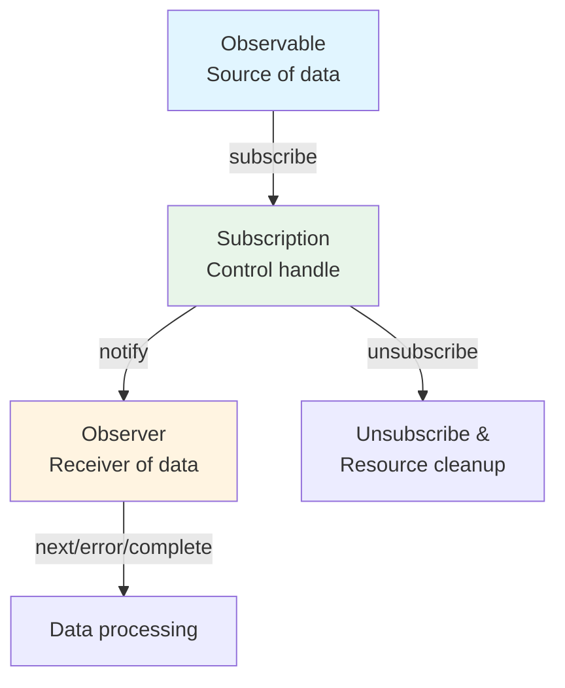

# What is a Stream?

## Definition of Stream

A "stream" refers to **a flow of data that occurs sequentially over time**. It can be viewed as a collection of data appearing one after another in a certain order.

### Examples of Typical Streams in Traditional Programming
- Data from file reads (e.g., ReadableStream in Node.js)
- Network communications (e.g., HTTP responses)
- User input and events (mouse moves, clicks, keyboard inputs)

## Streams in RxJS

RxJS uses **Observable** to handle such data that occurs over time as a stream. Observable is a mechanism for abstracting asynchronous data, synchronous data, events, and time-based processing as "streams".

### Advantages of Observable
- Can be described in a type-safe manner (TypeScript affinity)
- Declarative expression of data flow
- Operation chain by `pipe()` is possible
- Can subscribe explicitly by `subscribe()`
- Cancelable by `unsubscribe()`

## Comparison with Conventional Streams

| Feature | Conventional Streams | RxJS Observable |
|------|------------------|-------------------|
| Target | Tends to be limited to files/networks, etc. | Arbitrary asynchronous/event/state change |
| Event handling | Handled by event listeners on a case-by-case basis | Streaming with `fromEvent` |
| Cancel | Different methods | Unified management with `unsubscribe()` |
| Composition/Conversion | Separate implementation with procedural code | Concise description with operators (`map`, `filter`, etc.) |

## Relationship with Observer & Subscription

- **Observable**: Source of data (source of stream)
- **Observer**: Receiver of data (with next, error, complete)
- **Subscription**: Control handle for subscription (subscribe, unsubscribe, resource management)

Observable and Observer are connected through callbacks and controlled by Subscription.

### Basic Relationship Diagram

## Summary

The concept of "streams," which is at the core of RxJS, is a powerful weapon when dealing with asynchronous processing. Observable allows you to handle various data sources in a unified manner and describe data flows in a declarative and flexible manner.

## Relationship to Event Processing

In RxJS, DOM events can also be handled as streams using `fromEvent`.
The concept of a stream becomes clearer by comparing the differences with conventional event listeners.

> [!TIP]
> See [Streaming Events](/en/guide/observables/events.md#comparison-between-traditional-event-processing-and-rxjs) for a comparison of traditional event processing and RxJS with actual code.
