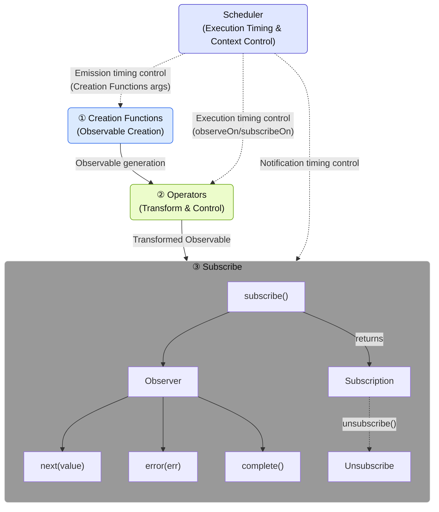
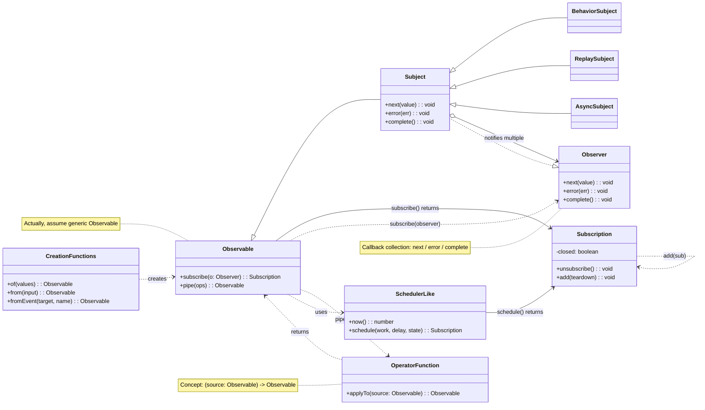

# What is RxJS?

## Overview
[RxJS (Reactive Extensions for JavaScript)](https://rxjs.dev) is a library for "reactive programming" in JavaScript.

> ### What is reactive programming?
> Reactive programming is a method of creating programs that are automatically updated in response to changes in data.
> It is a type of event-driven programming, with a particular focus on handling asynchronous data streams. It focuses on the flow (stream) of data and builds programs in a way that reacts (reactions) to that flow.

In other words, RxJS is a library for handling events and asynchronous data streams in a functional style, providing powerful tools for handling asynchronous data streams using the Observable pattern.

> Observable is the core building block of RxJS for representing events and asynchronous data streams. It is a source of values that "flow" and can be received by subscribing. An Observable is a "stream of data" that publishes values over time, and you can receive those values by subscribing to it.


> [!TIP]
> If you are asking, "What is a stream anyway?" Please refer to [What is a Stream?](/en/guide/basics/what-is-a-stream).


## Simple Usage Example

```ts
import { fromEvent } from 'rxjs';

fromEvent(document, 'click').subscribe(event => {
  console.log('Clicked:', event);
});
```

## Basic Components of RxJS

To master RxJS, it is important to understand the following core components.

| Component | Overview |
|------|------|
| [`Observable`](../observables/what-is-observable.md) | The source of the stream, which represents data that occurs asynchronously or along time. |
| [`Observer`](../observables/observable-lifecycle.md#observer)[^observer]| The entity that subscribes to and receives data from the Observable. |
| [`Subscription`](../observables/observable-lifecycle.html#subscription) | It manages the subscription and unsubscription of the Observable. |
| [`Creation Functions`](../creation-functions/index.md) | A set of functions for creating and binding an Observable. |
| [`Operator`](../operators/index.md) | A set of functions for converting and controlling an Observable. |
| [`Subject`](../subjects/what-is-subject.md)[^1] | It is a relay that has the properties of both Observable and Observer. |
| [`Scheduler`](../schedulers/async-control.md)[^2]| A mechanism to control the timing of Observable execution. |

[^observer]: The Subscriber class is used as an implementation. For details, see [Difference between Observer and Subscriber](../observables/observer-vs-subscriber.md).
[^1]: A Subject is a special entity that can act as both an Observable that issues values and an Observer that receives values.
[^2]: Scheduler is used to control the execution timing and context of asynchronous processing and is also useful for debugging and performance management.

They have their own independent functions, but work together.
For example, Creation Functions create and combine Observables, Operators transform and control them, Observers subscribe to them, and Schedulers control execution timing, thus constituting stream processing as a whole.

#### RxJS Components and Data Flow


※ Detailed usage and examples of each component are explained separately in their own dedicated chapters.

### Component Class Diagram



## Advantages of RxJS

| Advantage | Content |
|---|---|
| Declarative code[^3] | Describe "what you want to do" with `map`, `filter`, etc. and avoid procedural descriptions such as for loops |
| Simplify asynchronous processing | Avoid nested `Promise` and callbacks, and write in an intuitive flow |
| Error handling | Uniform handling of errors in streams with `.pipe(catchError(...))`, etc. |
| Cancelable | Stream can be suspended by `Subscription.unsubscribe()` |
| Various operators | Many operators such as `debounceTime`, `mergeMap`, `combineLatest`, etc. can be used for conversion and composition |

[^3]: > - Declarative code: straightforward code that says "what kind of result do you want?"
      > - Procedural code: code that describes "what kind of calculation should be performed to get the desired result"


## Use Cases

RxJS can be used in any situation where you are dealing with "data that changes over time". Below are some of the key use cases.

### Real-time Communication and Streaming

RxJS is especially powerful when dealing with real-time communications such as WebSockets and Server-Sent Events (SSE).

| Use Case | Description | Main Operators |
|------|------|-------------------|
| WebSocket communication | Chat, notifications, stock price updates, etc. | [`webSocket`](../operators/index.md), [`filter`](../operators/filtering/filter.md), [`map`](../operators/transformation/map.md) |
| Server-Sent Events | Push notifications from servers | [`fromEvent`](../observables/events.md), [`retry`](../operators/utility/retry.md) |
| IoT Sensor Monitoring | Continuous sensor data processing | [`debounceTime`](../operators/filtering/debounceTime.md), [`distinctUntilChanged`](../operators/filtering/distinctUntilChanged.md) |

#### Simple Example
```ts
import { webSocket } from 'rxjs/webSocket';
import { filter } from 'rxjs';

const socket$ = webSocket('wss://example.com/chat');

socket$.pipe(
  filter(msg => msg.type === 'message')
).subscribe(msg => console.log('New message:', msg.text));
```

### UI/State Management & Form Control

Reactive handling of user input and state changes.

> [!NOTE] Relationship with frameworks
> Modern front-end frameworks (Angular Signals, React hooks, Vue Composition API, Svelte Runes, etc.) each provide their own reactive systems. RxJS is a framework-independent library that can be used in conjunction with or separately from these. The integration of RxJS with framework-specific mechanisms will be discussed in detail in Chapter 15, "Framework Integration" (in preparation).

| Use Case | Description | Main Operators |
|------|------|-------------------|
| Input form control | Search completion, real-time validation | [`debounceTime`](../operators/filtering/debounceTime.md), [`distinctUntilChanged`](../operators/filtering/distinctUntilChanged.md), [`switchMap`](../operators/transformation/switchMap.md) |
| Linking of multiple form items | Update of dependent input items | [`combineLatest`](../creation-functions/combination/combineLatest.md), [`withLatestFrom`](../operators/combination/withLatestFrom.md) |
| Inter-component communication | Event bus and custom state management | [`Subject`](../subjects/what-is-subject.md), [`share`](../operators/multicasting/share.md) |
| UI event processing | Click, scroll, drag & drop | [`fromEvent`](../observables/events.md), [`takeUntil`](../operators/utility/takeUntil.md) |

#### Simple Example
```ts
import { fromEvent, combineLatest } from 'rxjs';
import { debounceTime, map, switchMap } from 'rxjs';

const searchInput = document.querySelector('#search') as HTMLInputElement;
const sortSelect = document.querySelector('#sort') as HTMLInputElement;

const search$ = fromEvent(searchInput, 'input').pipe(
  map(e => (e.target as HTMLInputElement).value)
);

const sort$ = fromEvent(sortSelect, 'change').pipe(
  map(e => (e.target as HTMLSelectElement).value)
);

combineLatest([search$, sort$]).pipe(
  debounceTime(300),
  switchMap(([query, order]) =>
    fetch(`/api/search?q=${query}&sort=${order}`).then(r => r.json())
  )
).subscribe(results => console.log(results));
```

### Offline Support & PWA

Can be used for offline support and network status management in Progressive Web App (PWA).

| Use Case | Description | Main Operators |
|------|------|-------------------|
| Network Condition Monitoring | Online/offline detection | [`fromEvent`](../observables/events.md), [`merge`](../creation-functions/combination/merge.md) |
| Retry when offline | Automatic resynchronization when connection is restored | [`retry`](../operators/utility/retry.md), [`retryWhen`](../error-handling/retry-catch.md) |
| Cache control | Service Worker integration | [`switchMap`](../operators/transformation/switchMap.md), [`catchError`](../error-handling/retry-catch.md) |

#### Simple Example
```ts
import { fromEvent, merge } from 'rxjs';
import { map, startWith } from 'rxjs';

const online$ = fromEvent(window, 'online').pipe(map(() => true));
const offline$ = fromEvent(window, 'offline').pipe(map(() => false));

merge(online$, offline$).pipe(
  startWith(navigator.onLine)
).subscribe(isOnline => {
  console.log(isOnline ? 'Online' : 'Offline');
});
```

### AI/Streaming API

This is also ideal for handling streaming API responses such as OpenAI.

| Use Case | Description | Main Operators |
|------|------|-------------------|
| Token sequential output | Real-time display of AI responses | [`concatMap`](../operators/transformation/concatMap.md), [`scan`](../operators/transformation/scan.md) |
| Streaming processing | Server-Sent Events processing | [`fromEvent`](../observables/events.md), [`map`](../operators/transformation/map.md) |
| Back-end integration | Use with NestJS (RxJS standard) | Various operators |

### HTTP Communication and Error Handling

Asynchronous HTTP communication can be handled elegantly.

| Use Case | Description | Main Operators |
|------|------|-------------------|
| API Requests | Communicating with RESTful APIs | [`switchMap`](../operators/transformation/switchMap.md), [`mergeMap`](../operators/transformation/mergeMap.md) |
| Error handling | Retries and fallbacks | [`catchError`](../error-handling/retry-catch.md), [`retry`](../operators/utility/retry.md) |
| Timeout control | Response time limits | [`timeout`](../operators/utility/timeout.md) |
| Cancellation | Aborting unnecessary requests | [`takeUntil`](../operators/utility/takeUntil.md), `unsubscribe()` |

### State Management & Architecture

It can also be used to design the overall application architecture.

| Use Case | Description | Main Operators |
|------|------|-------------------|
| State Management Libraries | NgRx, Redux-Observable, etc. | [`scan`](../operators/transformation/scan.md), [`share`](../operators/multicasting/share.md) |
| Event flow management | Utilization in DDD (Domain Driven Design) | [`Subject`](../subjects/what-is-subject.md), [`shareReplay`](../operators/multicasting/shareReplay.md) |
| Data layer separation | Clean architecture | Various operators |

---

> [!TIP]
> See also [the difference between Promise and RxJS](./promise-vs-rxjs.md) for more information on the use of Promise and RxJS.

## Summary

RxJS offers a powerful approach to asynchronous and event-based programming, and its Observable-centric data stream philosophy is particularly useful when dealing with complex asynchronous processing.
