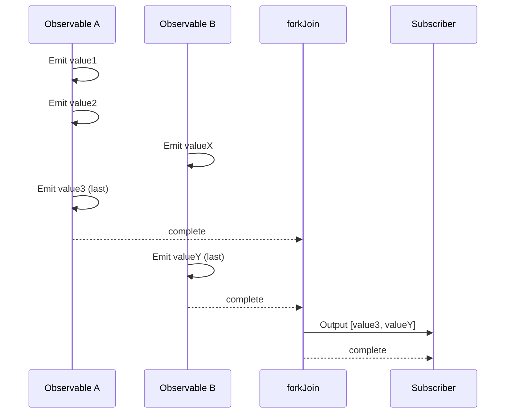
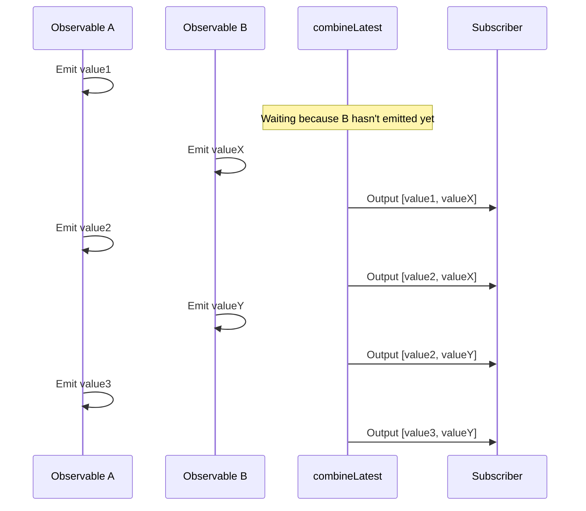
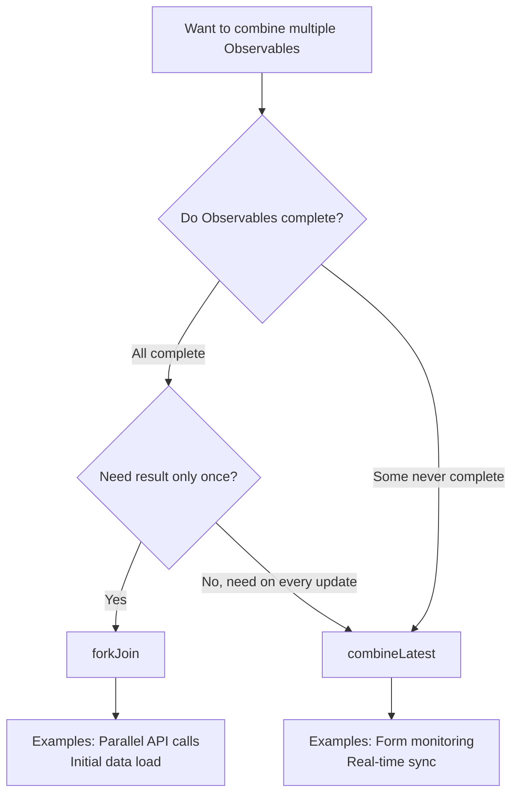

# Difference Between forkJoin and combineLatest

When combining multiple Observables in RxJS, `forkJoin` and `combineLatest` are the most commonly used Creation Functions. However, these two have **significantly different behaviors**, and using them incorrectly will not produce the expected results.

This page thoroughly compares both using diagrams and practical examples, making it clear "which one to use."

## Conclusion: Difference Between forkJoin and combineLatest

| Feature | forkJoin | combineLatest |
|---------|----------|---------------|
| **Output Timing** | **Once** after all complete | **Every time** a value is updated |
| **Output Value** | **Last value** of each Observable | **Latest value** of each Observable |
| **Completion Condition** | All Observables complete | All Observables complete |
| **Main Use Cases** | Parallel API calls, initial data load | Form monitoring, real-time sync |
| **Infinite Streams** | ❌ Cannot use (never completes) | ✅ Can use (emits values even without completion) |

> [!TIP]
> **Easy way to remember**
> - `forkJoin` = "Once everyone is ready, **depart once**" (similar to Promise.all)
> - `combineLatest` = "**Report the latest status** every time someone moves"

## Understanding Behavioral Differences with Diagrams

### forkJoin Behavior



**Key Point**: Waits until all Observables `complete`, then outputs **only the last values** once.

### combineLatest Behavior



**Key Point**: After all Observables emit their first value, **outputs the latest combination every time any updates**.

## Timeline View of Differences

```mermaid
gantt
    title forkJoin vs combineLatest Output Timing
    dateFormat X
    axisFormat %s

    section Observable A
    value1 :a1, 0, 1
    value2 :a2, 2, 1
    value3 :a3, 4, 1
    complete :milestone, a_done, 5, 0

    section Observable B
    valueX :b1, 1, 1
    valueY :b2, 3, 1
    complete :milestone, b_done, 4, 0

    section forkJoin Output
    [value3,valueY] :crit, fork_out, 5, 1

    section combineLatest Output
    [value1,valueX] :c1, 1, 1
    [value2,valueX] :c2, 2, 1
    [value2,valueY] :c3, 3, 1
    [value3,valueY] :c4, 4, 1
```



## Practical Comparison: Verify Behavior with Same Data Source

Apply both `forkJoin` and `combineLatest` to the same Observables and check the output differences.

```ts
import { forkJoin, combineLatest, interval, take, map } from 'rxjs';

// Create output area
const output = document.createElement('div');
output.innerHTML = '<h3>forkJoin vs combineLatest Comparison:</h3>';
document.body.appendChild(output);

// Create two Observables
const obs1$ = interval(1000).pipe(
  take(3),
  map(i => `A${i}`)
);

const obs2$ = interval(1500).pipe(
  take(2),
  map(i => `B${i}`)
);

// forkJoin result display area
const forkJoinResult = document.createElement('div');
forkJoinResult.innerHTML = '<h4>forkJoin:</h4><div id="forkjoin-output">Waiting...</div>';
output.appendChild(forkJoinResult);

// combineLatest result display area
const combineLatestResult = document.createElement('div');
combineLatestResult.innerHTML = '<h4>combineLatest:</h4><div id="combinelatest-output"></div>';
output.appendChild(combineLatestResult);

// forkJoin: Outputs once after all complete
forkJoin([obs1$, obs2$]).subscribe(result => {
  const el = document.getElementById('forkjoin-output');
  if (el) {
    el.textContent = `Output: [${result.join(', ')}]`;
    el.style.color = 'green';
    el.style.fontWeight = 'bold';
  }
});

// combineLatest: Outputs every time values update
const combineOutput = document.getElementById('combinelatest-output');
combineLatest([obs1$, obs2$]).subscribe(result => {
  if (combineOutput) {
    const item = document.createElement('div');
    item.textContent = `Output: [${result.join(', ')}]`;
    combineOutput.appendChild(item);
  }
});
```

**Execution Results**:
- `forkJoin`: Outputs `[A2, B1]` **once** after about 3 seconds
- `combineLatest`: Outputs **4 times** starting from about 1.5 seconds (e.g., `[A0, B0]` → `[A1, B0]` → `[A2, B0]` → `[A2, B1]`)

> [!NOTE]
> The output order of `combineLatest` depends on timer scheduling and may vary by environment. The key point is "it outputs every time any value is updated." In this example, 4 outputs occur, but the order may change like `[A1, B0]` → `[A1, B1]`.

## When to Use Which (Case-by-Case Guide)

### Cases to Use forkJoin

#### 1. Parallel API Calls

When you want to process only after all data is ready.

```ts
import { forkJoin } from 'rxjs';
import { ajax } from 'rxjs/ajax';

// Fetch user info and settings simultaneously
forkJoin({
  user: ajax.getJSON('/api/user/123'),
  settings: ajax.getJSON('/api/settings'),
  notifications: ajax.getJSON('/api/notifications')
}).subscribe(({ user, settings, notifications }) => {
  // Render dashboard after all data is ready
  renderDashboard(user, settings, notifications);
});
```

#### 2. Bulk Data Fetch on Initial Load

Fetch master data needed at app startup all at once.

```ts
import { forkJoin } from 'rxjs';
import { ajax } from 'rxjs/ajax';

function loadInitialData() {
  return forkJoin({
    categories: ajax.getJSON('/api/categories'),
    countries: ajax.getJSON('/api/countries'),
    currencies: ajax.getJSON('/api/currencies')
  });
}
```

> [!WARNING]
> `forkJoin` cannot be used with **Observables that never complete** (`interval`, WebSocket, event streams, etc.). It will wait forever if they don't complete.

### Cases to Use combineLatest

#### 1. Real-time Form Input Monitoring

Combine multiple input values for validation or display updates.

```ts
import { combineLatest, fromEvent } from 'rxjs';
import { map, startWith } from 'rxjs';

const name$ = fromEvent(nameInput, 'input').pipe(
  map(e => (e.target as HTMLInputElement).value),
  startWith('')
);

const email$ = fromEvent(emailInput, 'input').pipe(
  map(e => (e.target as HTMLInputElement).value),
  startWith('')
);

const age$ = fromEvent(ageInput, 'input').pipe(
  map(e => parseInt((e.target as HTMLInputElement).value) || 0),
  startWith(0)
);

// Run validation whenever any input changes
combineLatest([name$, email$, age$]).subscribe(([name, email, age]) => {
  const isValid = name.length > 0 && email.includes('@') && age >= 18;
  submitButton.disabled = !isValid;
});
```

#### 2. Real-time Sync of Multiple Streams

Integrated display of sensor data or status.

```ts
import { combineLatest, interval } from 'rxjs';
import { map } from 'rxjs';

const temperature$ = interval(2000).pipe(map(() => 20 + Math.random() * 10));
const humidity$ = interval(3000).pipe(map(() => 40 + Math.random() * 30));
const pressure$ = interval(2500).pipe(map(() => 1000 + Math.random() * 50));

combineLatest([temperature$, humidity$, pressure$]).subscribe(
  ([temp, humidity, pressure]) => {
    updateDashboard({ temp, humidity, pressure });
  }
);
```

#### 3. Combining Filter Conditions

Execute search whenever any filter condition changes.

```ts
import { combineLatest, BehaviorSubject } from 'rxjs';
import { debounceTime, switchMap } from 'rxjs';

const searchText$ = new BehaviorSubject('');
const category$ = new BehaviorSubject('all');
const sortOrder$ = new BehaviorSubject('asc');

combineLatest([searchText$, category$, sortOrder$]).pipe(
  debounceTime(300),
  switchMap(([text, category, sort]) =>
    fetchProducts({ text, category, sort })
  )
).subscribe(products => {
  renderProductList(products);
});
```

## Decision Flowchart



## Common Mistakes and Solutions

### Mistake 1: Using forkJoin with Non-completing Observables

```ts
// ❌ This will never output
forkJoin([
  interval(1000),  // Never completes
  ajax.getJSON('/api/data')
]).subscribe(console.log);

// ✅ Make it complete with take, or use combineLatest
forkJoin([
  interval(1000).pipe(take(5)),  // Completes after 5
  ajax.getJSON('/api/data')
]).subscribe(console.log);
```

### Mistake 2: combineLatest Without Initial Values

```ts
// ❌ Won't output even if email$ has value until name$ emits first
combineLatest([name$, email$]).subscribe(console.log);

// ✅ Set initial values with startWith
combineLatest([
  name$.pipe(startWith('')),
  email$.pipe(startWith(''))
]).subscribe(console.log);
```

## Summary

| Selection Criteria | forkJoin | combineLatest |
|-------------------|----------|---------------|
| Process once when all ready | ✅ | ❌ |
| Process every time values change | ❌ | ✅ |
| Non-completing streams | ❌ | ✅ |
| Promise.all-like usage | ✅ | ❌ |
| Real-time sync | ❌ | ✅ |

> [!IMPORTANT]
> **Principles for choosing**
> - **forkJoin**: "Once when everyone is ready" → Parallel API calls, initial load
> - **combineLatest**: "Update every time someone moves" → Form monitoring, real-time UI

## Related Pages

- **[forkJoin](/en/guide/creation-functions/combination/forkJoin)** - Detailed explanation of forkJoin
- **[combineLatest](/en/guide/creation-functions/combination/combineLatest)** - Detailed explanation of combineLatest
- **[zip](/en/guide/creation-functions/combination/zip)** - Pair corresponding values
- **[merge](/en/guide/creation-functions/combination/merge)** - Execute multiple Observables in parallel
- **[withLatestFrom](/en/guide/operators/combination/withLatestFrom)** - Only main stream triggers
