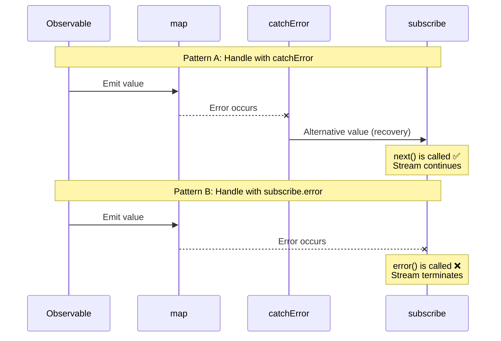
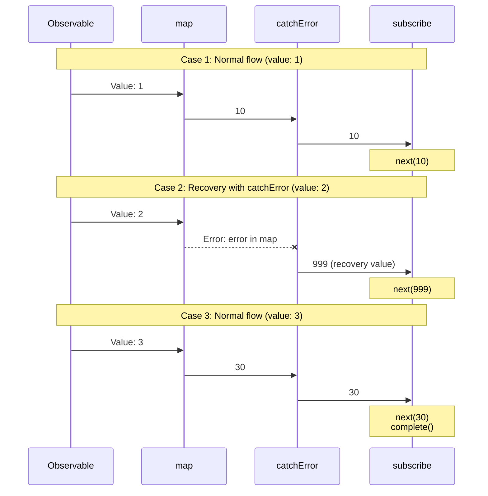
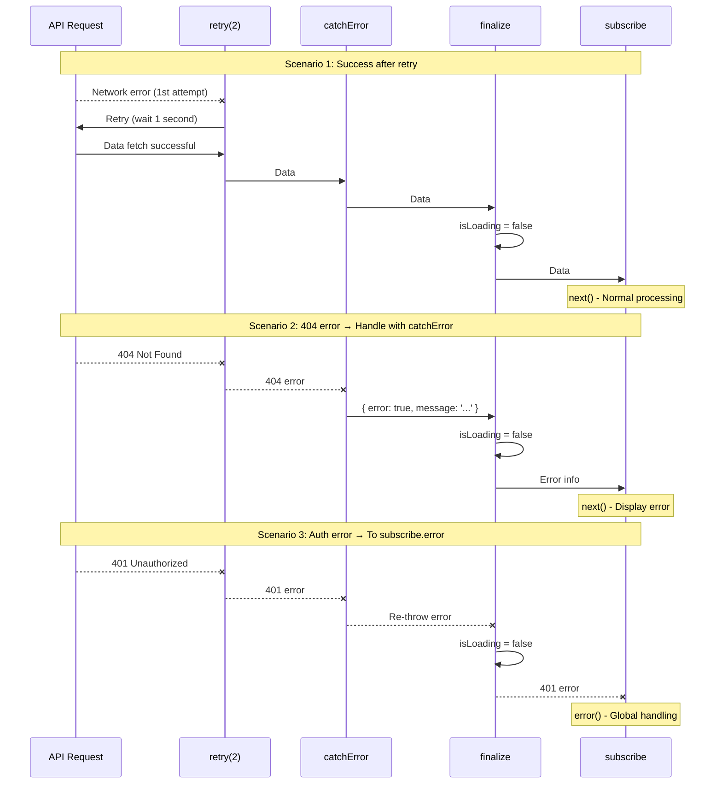
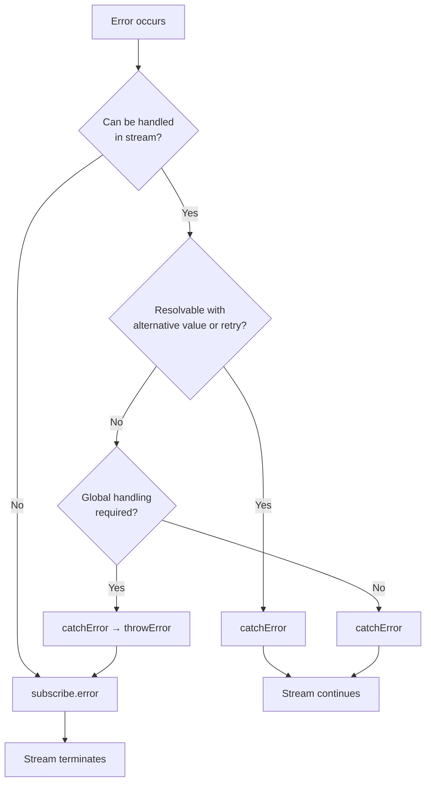

# Two Places for Error Handling

When handling errors in RxJS, "where" to catch errors is an important design decision. RxJS has two primary error handling locations: the `catchError` operator in the pipeline and the `error` callback in the final `subscribe`. This page explains the difference between the two and the proper use of both.

## Two Places for Error Handling

There are two primary locations for error handling in RxJS:

1. **In the pipeline** - `.pipe(catchError(...))`
2. **On subscription** - `subscribe({ error: ... })`

Understanding this difference will help you build a robust and maintainable error handling strategy.

## Comparison Table: catchError vs subscribe.error

The following table summarizes the key differences between the two approaches.

| Item | `.pipe(catchError(...))` | `subscribe({ error: ... })` |
|------|-------------------------|----------------------------|
| **Processing Timing** | In pipeline (intermediate processing) | Final subscription (endpoint) |
| **Error Type** | Errors occurring in the stream | Uncaught errors |
| **Primary Use** | Error recovery, conversion, retry | Final error notification, logging |
| **Stream Continuation** | Can continue with alternative Observable | Stream terminates (no more values) |
| **Recoverability** | ✅ Possible (alternative values or retry) | ❌ Not possible (termination) |
| **Multiple Placement** | ✅ Possible (multiple in pipeline) | ⚠️ One per subscribe |
| **Return Type** | Must return `Observable<T>` | `void` (returns nothing) |

### Sequence Diagram: Difference Between catchError and subscribe.error

The following diagram visually illustrates the difference between handling with `catchError` and handling with `subscribe.error`.



#### Important Points from This Diagram

**Pattern A (using catchError):**
- If an error occurs, `next()` of `subscribe` is called because `catchError` returns an alternate value
- Stream continues and subsequent values can be processed
- Errors are "recovered" and returned to the normal stream

**Pattern B (using subscribe.error):**
- When the error reaches `subscribe`, the `error()` callback is called
- The stream is terminated and no more values flow
- "Notify" the error and terminate the stream

## Understanding the Error Flow

Let's look at a real code example to see how errors flow.

```typescript
import { of, map, catchError } from 'rxjs';
of(1, 2, 3).pipe(
  map(x => {
    if (x === 2) throw new Error('Error in map');  // ①
    return x * 10;
  }),
  catchError(err => {
    console.log('Caught by catchError:', err.message);  // ②
    return of(999); // Recovery
  })
).subscribe({
  next: val => console.log('Value:', val),
  error: err => console.log('Caught by subscribe.error:', err), // ③
  complete: () => console.log('Complete')
});

// Output:
// Value: 10
// Caught by catchError: Error in map (← Processed at ②)
// Value: 999 (← Recovery successful)
// Value: 30
// Complete
```

In this example:
1. An error occurs in `map` (①)
2. `catchError` catches the error and recovers (②)
3. `subscribe.error` is not called (because the error was handled)

> [!TIP] Error Flow
> Errors handled by `catchError` do not reach `subscribe.error`. `catchError` has the role of "handling errors and returning to normal stream".

### Sequence Diagram: Error Flow (3 Cases)

The following diagram shows how errors propagate in three cases.



#### As You Can See from This Diagram
- **Cases 1 & 3**: When there are no errors, values flow in order: `map` → `catchError` → `subscribe`
- **Case 2**: When an error occurs in `map`, `catchError` catches it and returns recovery value (999)
- Errors handled by `catchError` do not reach `subscribe.error`

## Errors Caught by catchError

The `catchError` in the pipeline can catch the following types of errors:

| Error Source | Example | Processable by catchError |
|----------------|-----|---------------------|
| throw in operator | `map(x => { throw new Error() })` | ✅ |
| HTTP errors | `ajax.get('/api').pipe(catchError(...))` | ✅ |
| Errors in switchMap | `switchMap(() => throwError(...))` | ✅ |
| Custom Observable | `new Observable(sub => sub.error(...))` | ✅ |
| Promise reject | `from(Promise.reject(...))` | ✅ |

### Example: Staged Processing of API Errors

```typescript
import { of, throwError, catchError, switchMap } from 'rxjs';
import { ajax } from 'rxjs/ajax';

// Handle API errors with catchError
ajax.get('/api/user/123').pipe(
  catchError(err => {
    if (err.status === 404) {
      // 404 error → return default user
      return of({ id: 123, name: 'Default User' });
    }
    // Re-throw other errors (to subscribe.error)
    return throwError(() => err);
  }),
  switchMap(user => {
    // After getting user, get profile
    return ajax.get(`/api/profile/${user.id}`);
  }),
  catchError(err => {
    console.log('Profile fetch error:', err);
    // Continue without profile
    return of(null);
  })
).subscribe({
  next: profile => console.log('Profile:', profile),
  error: err => console.log('Final error:', err) // Only errors not handled by catchError
});
```

> [!IMPORTANT] Placing Multiple catchError Operators
> By placing multiple `catchError` operators in the pipeline, you can handle errors at different stages individually. This enables fine-grained error handling.

## Errors Caught by subscribe.error

The `error` callback of `subscribe` catches the following errors:

| Error Type | Description | Example |
|------------|------|-----|
| **Unhandled by catchError** | Errors not handled in pipeline | Error propagated as-is |
| **Re-thrown after catchError** | Errors explicitly re-thrown in catchError | `catchError(e => throwError(() => e))` |

### Example: Staged Error Processing and Re-throwing

```typescript
import { of, throwError, map, catchError } from 'rxjs';
// Pattern 1: Error not handled by catchError
throwError(() => new Error('Unhandled error')).subscribe({
  next: val => console.log('Value:', val),
  error: err => console.log('subscribe.error:', err.message)
  // Output: subscribe.error: Unhandled error
});

// Pattern 2: Re-throw in catchError
of(1).pipe(
  map(() => { throw new Error('Error in map'); }),
  catchError(err => {
    console.log('Caught by catchError:', err.message);
    // Log, then re-throw error
    return throwError(() => new Error('Re-thrown error'));
  })
).subscribe({
  next: val => console.log('Value:', val),
  error: err => console.log('subscribe.error:', err.message)
  // Output:
  // Caught by catchError: Error in map
  // subscribe.error: Re-thrown error
});
```

> [!WARNING] Errors Inside subscribe
> `throw` inside `subscribe`'s `next` or `complete` callbacks is **not recommended**. Error handling should always be done in the pipeline (`catchError`). Throwing in subscribe can lead to undefined behavior.

## Criteria for Determining Usage

Which one to use depends on "where you want to handle errors".

### Cases in Which catchError Should Be Used

Use `catchError` if any of the following conditions apply:

- ✅ **You want to complete the process in the stream**
- ✅ **An alternative value or fallback data can be provided**
- ✅ **May be resolved with retries**
- ✅ **Would like to convert errors and switch to another Observable**
- ✅ **Want to continue subsequent processing**

#### Pattern 1: Unified Format for Success and Error Cases

```typescript
import { of, throwError, catchError, map } from 'rxjs';
interface User {
  id: number;
  name: string;
}

interface ApiResult {
  success: boolean;
  data?: User[];
  error?: string;
}

// Simulate API call (example that generates error)
function fetchUsers(shouldFail: boolean) {
  if (shouldFail) {
    return throwError(() => new Error('Network error'));
  }
  return of<User[]>([
    { id: 1, name: 'Taro Yamada' },
    { id: 2, name: 'Hanako Sato' }
  ]);
}

fetchUsers(true).pipe(
  // On success: convert to { success: true, data: [...] }
  map(users => ({ success: true, data: users } as ApiResult)),
  // On error: convert to { success: false, error: '...' }
  catchError(err => {
    return of<ApiResult>({
      success: false,
      error: 'Failed to retrieve user'
    });
  })
).subscribe(result => {
  // Handle both success and error in same format
  if (result.success) {
    console.log('User:', result.data);
  } else {
    console.log('Error occurred:', result.error);
  }
});

// Output: Error occurred: Failed to retrieve user
```

#### Pattern 2: Simply Return Default Value

```typescript
import { of, throwError, catchError } from 'rxjs';
interface User {
  id: number;
  name: string;
}

// Simulate API call (example that generates error)
function fetchUsers(shouldFail: boolean) {
  if (shouldFail) {
    return throwError(() => new Error('Network error'));
  }
  return of<User[]>([
    { id: 1, name: 'Taro Yamada' },
    { id: 2, name: 'Hanako Sato' }
  ]);
}

fetchUsers(true).pipe(
  catchError(err => {
    console.error('An error has occurred:', err.message);
    // Return empty array as default value
    return of<User[]>([]);
  })
).subscribe(users => {
  if (users.length === 0) {
    console.log('No users found');
  } else {
    console.log('Users:', users);
  }
});

// Output:
// An error has occurred: Network error
// No users found
```

### Cases Where subscribe.error Should Be Used

Use `subscribe.error` if any of the following conditions apply:

- ✅ **You want to use a global error handler**
- ✅ **You need processing that affects the entire application**
- ✅ **I want to send error logs to the server**
- ✅ **I want to terminate the stream**
- ✅ **Error handling as a last line of defense**

```typescript
import { throwError, catchError, retry } from 'rxjs';
import { ajax } from 'rxjs/ajax';

ajax.getJSON('/api/critical-data').pipe(
  retry(2),
  catchError(err => {
    if (err.status === 401) {
      // Re-throw authentication errors (handle globally)
      return throwError(() => err);
    }
    // Handle others
    return throwError(() => new Error('Failed to retrieve data'));
  })
).subscribe({
  next: data => console.log('Data:', data),
  error: err => {
    // Global error handler
    globalErrorHandler.handle(err);
    // Navigate to error page
    router.navigate(['/error']);
  }
});
```

## Practice Pattern: Hierarchical Error Handling

In practice, hierarchical error handling combining `catchError` and `subscribe.error` is effective.

```typescript
import { of, throwError, catchError, retry, finalize } from 'rxjs';
import { ajax } from 'rxjs/ajax';

function fetchUserData(userId: string) {
  let isLoading = true;

  return ajax.getJSON(`/api/users/${userId}`).pipe(
    // Level 1: Retryable network errors
    retry({ count: 2, delay: 1000 }),

    // Level 2: Recoverable errors
    catchError((error) => {
      if (error.status === 404) {
        // 404 → continue with default data
        return of({
          error: true,
          message: 'User not found',
          data: null
        });
      } else if (error.status >= 500) {
        // 500s → continue with error message
        return of({
          error: true,
          message: 'A server error has occurred',
          data: null
        });
      }
      // Re-throw other errors (to subscribe.error)
      return throwError(() => error);
    }),

    // Level 3: Always execute cleanup
    finalize(() => {
      isLoading = false;
      console.log('Loading complete');
    })
  );
}

// Usage example
fetchUserData('123').subscribe({
  next: (result) => {
    if (result.error) {
      // Errors handled by catchError (display in UI)
      console.error('User error:', result.message);
      showUserFriendlyError(result.message);
    } else {
      // Normal data
      console.log('User data:', result.data);
      displayUserData(result.data);
    }
  },
  error: (err) => {
    // Fatal errors not handled by catchError
    console.error('Fatal error:', err);
    // Notify global error handler
    globalErrorHandler.handle(err);
    // Navigate to error page
    navigateToErrorPage();
  },
  complete: () => console.log('Processing complete')
});

// Helper functions
function showUserFriendlyError(message: string) {
  console.log('Display error in UI:', message);
}
function displayUserData(data: any) {
  console.log('Display data in UI:', data);
}
function navigateToErrorPage() {
  console.log('Navigate to error page');
}

// Global error handler
const globalErrorHandler = {
  handle(err: any) {
    console.error('Global error:', err);
    // Send error log to server
    // sendErrorLog(err);
  }
};
```

> [!TIP] Benefits of Hierarchical Error Handling
> - **Level 1 (retry)**: Automatically recover from temporary network errors
> - **Level 2 (catchError)**: Provide user-friendly error messages
> - **Level 3 (subscribe.error)**: Handle unexpected errors as last line of defense
> - **finalize**: Always clean up resources

### Sequence Diagram: Hierarchical Error Handling Flow

The following diagram shows the hierarchical error handling flow: retry → catchError → finalize → subscribe.



#### As You Can See from This Diagram
- **Scenario 1**: Temporary errors are recovered with `retry` and data is retrieved normally
- **Scenario 2**: 404 errors are caught by `catchError` and converted to user-friendly messages
- **Scenario 3**: Authentication errors are re-thrown with `catchError` and centrally managed with `subscribe.error`
- **All scenarios**: `finalize` is always executed to reset loading state

## Scenario-Based Selection Guide

Guidelines on which to use for actual scenarios.

| Scenario | Recommended | Reason |
|---------|------|------|
| 404 Not Found → Display default value | `catchError` | Can return alternative value in stream |
| Temporary network error → Retry | `catchError` | Continue processing after retry |
| Authentication error (401) → Login screen | Either possible | Redirect with catchError or centralize with subscribe.error |
| Server 500 error → Error page | Either possible | catchError for retry, subscribe.error for immediate termination |
| Validation error → Display in form | `catchError` | Pass error info to UI for display |
| Unexpected error → Send log | `subscribe.error` | Log as last line of defense |

### Flexible Authentication Error Handling Example

Authentication errors (401) can use both approaches depending on design.

```typescript
import { throwError, EMPTY, catchError } from 'rxjs';
import { ajax } from 'rxjs/ajax';

// Approach 1: Redirect with catchError (complete in stream)
ajax.getJSON('/api/protected-data').pipe(
  catchError(err => {
    if (err.status === 401) {
      // Handle authentication error with catchError
      router.navigate(['/login']);
      return EMPTY; // Empty stream and complete
    }
    return throwError(() => err);
  })
).subscribe({
  next: data => console.log('データ:', data)
});

// Approach 2: Centralize with subscribe.error
ajax.getJSON('/api/protected-data').pipe(
  catchError(err => {
    // Re-throw authentication errors (handle globally)
    if (err.status === 401) {
      return throwError(() => err);
    }
    // Handle others
    return throwError(() => err);
  })
).subscribe({
  next: data => console.log('Data:', data),
  error: err => {
    if (err.status === 401) {
      // Global authentication handler
      authService.handleUnauthorized();
    }
  }
});
```

> [!NOTE] Design Choices
> For application-wide errors like authentication errors, decide on handling location based on project design policy.
> - **Distributed processing**: Handle individually at each API call (catchError)
> - **Centralized management**: Unified handling with global error handler (subscribe.error)

## Flowchart: Error Handling Selection



## Best Practices

### 1. Catch Errors Early, Re-throw Late

```typescript
import { throwError, catchError, map } from 'rxjs';
import { ajax } from 'rxjs/ajax';

ajax.getJSON('/api/data').pipe(
  // Catch early
  catchError(err => {
    console.log('Log error:', err);
    // Re-throw if cannot handle
    return throwError(() => err);
  }),
  map(data => transformData(data)),
  // Catch transformation errors too
  catchError(err => {
    console.log('Transformation error:', err);
    return throwError(() => err);
  })
).subscribe({
  next: data => console.log('Data:', data),
  error: err => {
    // Final error handler
    globalErrorHandler.handle(err);
  }
});

function transformData(data: any) {
  return data;
}
```

### 2. Clearly Distinguish Error Types

```typescript
import { of, throwError, catchError } from 'rxjs';
import { ajax } from 'rxjs/ajax';

// Custom error types
class RecoverableError extends Error {
  constructor(message: string) {
    super(message);
    this.name = 'RecoverableError';
  }
}

class FatalError extends Error {
  constructor(message: string) {
    super(message);
    this.name = 'FatalError';
  }
}

ajax.getJSON('/api/data').pipe(
  catchError(err => {
    if (err.status === 404 || err.status === 500) {
      // Recoverable
      return throwError(() => new RecoverableError(err.message));
    }
    // Fatal error
    return throwError(() => new FatalError(err.message));
  })
).subscribe({
  next: data => console.log('Data:', data),
  error: err => {
    if (err instanceof RecoverableError) {
      // Recovery processing
      console.log('Recoverable error:', err.message);
    } else if (err instanceof FatalError) {
      // Fatal error processing
      console.error('Fatal error:', err.message);
    }
  }
});
```

### 3. Ensure Cleanup with finalize

```typescript
import { of, catchError, finalize } from 'rxjs';
import { ajax } from 'rxjs/ajax';

let isLoading = true;
let resourceHandle: any = null;

ajax.getJSON('/api/data').pipe(
  catchError(err => {
    console.log('Error handling:', err);
    return of(null);
  }),
  finalize(() => {
    // Always executed regardless of success or failure
    isLoading = false;
    if (resourceHandle) {
      resourceHandle.release();
      resourceHandle = null;
    }
    console.log('Cleanup complete');
  })
).subscribe({
  next: data => console.log('Data:', data),
  error: err => console.error('Error:', err)
});
```

## Frequently Asked Questions

::: info **Q: Do I need to write both catchError and subscribe.error?**
A: Yes, it is recommended to write both.
`catchError` handles "handleable errors",
`subscribe.error` acts as "last line of defense for unexpected errors".
:::

::: info **Q: If I throwError() in catchError, where does it go?**
A: If there is a subsequent `catchError`, it will be caught there; otherwise it reaches `subscribe.error`.
:::

::: info **Q: Can I place multiple catchError operators?**
A: Yes, you can place multiple in the pipeline. Different errors can be handled at each stage.
:::

::: info **Q: What happens if I omit subscribe.error?**
A: If an error occurs, `"Unhandled error"` will be displayed in the console and the application may behave unexpectedly. It is recommended to always write it.
:::

::: info **Q: What happens if catchError returns EMPTY?**
A: The stream completes immediately. `complete()` is called without emitting values. Use when you want to ignore errors.
```typescript
import { EMPTY, catchError } from 'rxjs';
source$.pipe(
  catchError(() => EMPTY) // Ignore error and complete
).subscribe({
  next: val => console.log(val),
  complete: () => console.log('Complete') // This is called
});
```
:::

::: info **Q: Does the stream always terminate if an error occurs?**
A: No. If handled by `catchError`, the stream continues. It terminates only when it reaches `subscribe.error`.
:::

::: info **Q: Should finalize be placed before or after catchError?**
A: Normally **after catchError**. This ensures cleanup is executed even after error handling.
```typescript
source$.pipe(
  retry(2),
  catchError(err => of(defaultValue)),
  finalize(() => cleanup()) // After catchError
)
```
:::

::: info **Q: What is the difference between catchError and try-catch?**
A: `try-catch` catches only **synchronous errors**, but `catchError` catches all errors in the stream, including **asynchronous errors** (HTTP requests, timers, etc.).
:::

## Summary

Understanding the two places in RxJS error handling will help you build an effective error handling strategy.

### Key Points

- **catchError**: Recovers errors in the stream and continues processing
- **subscribe.error**: Catches unhandled errors as a last line of defense
- **Hierarchical processing**: retry → catchError → finalize → subscribe.error combination is effective
- **Clear demarcation**: Determine if it can be completed in the stream

> [!IMPORTANT] Error Handling Design Principles
> 1. **Catch errors early, re-throw as needed**
> 2. **Handle recoverable errors with catchError**
> 3. **Handle application-level errors with subscribe.error**
> 4. **Ensure resource cleanup with finalize**
> 5. **Clearly distinguish and handle error types**

## Related Sections

- **[Error Handling Strategies](/en/guide/error-handling/strategies)** - Comprehensive RxJS error handling strategies
- **[retry and catchError](/en/guide/error-handling/retry-catch)** - Details on retry and error catching
- **[finalize and complete](/en/guide/error-handling/finalize)** - Resource release and stream completion processing
- **[Common Mistakes and Solutions](/en/guide/anti-patterns/common-mistakes#9-error-suppression)** - Error handling anti-patterns

## Reference Resources

- [RxJS Official Documentation - catchError](https://rxjs.dev/api/index/function/catchError)
- [RxJS Official Documentation - retry](https://rxjs.dev/api/index/function/retry)
- [Learn RxJS - Error Handling](https://www.learnrxjs.io/learn-rxjs/operators/error_handling)
