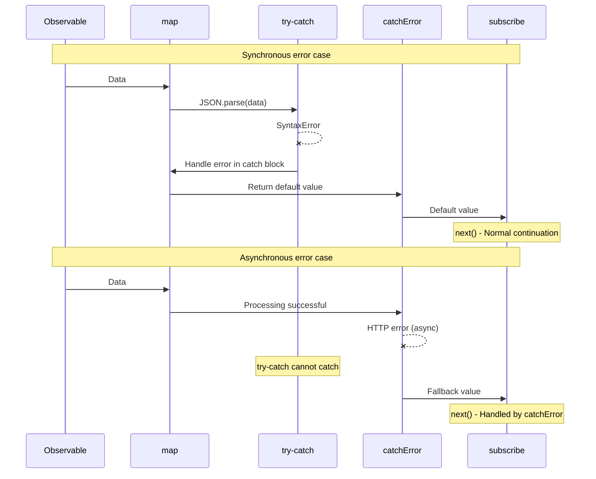

# Integrating try-catch and RxJS

JavaScript has `try-catch` as its standard error handling, while RxJS has its own error handling mechanisms such as `catchError` and `subscribe.error`. This page explains the difference between them and how to use them together appropriately.

## try-catch vs RxJS Error Handling

### Basic Differences

| Item | try-catch | catchError / subscribe.error |
|------|-----------|------------------------------|
| **Applies To** | Synchronous code | Asynchronous streams |
| **Error Type** | JavaScript exceptions | All errors in Observable |
| **Scope** | Within try-catch block only | Entire pipeline |
| **Async Support** | ❌ Cannot catch async errors | ✅ Can catch async errors |
| **Stream Continuation** | - | ✅ Can continue with catchError |

### Errors That try-catch Cannot Catch

Asynchronous errors like the following cannot be caught by `try-catch`.

```typescript
import { timer, throwError, mergeMap, catchError } from 'rxjs';
// ❌ try-catch cannot catch asynchronous errors
try {
  setTimeout(() => {
    throw new Error('Asynchronous error');
  }, 1000);
} catch (error) {
  // This will not be executed
  console.error('Caught:', error);
}

// ✅ RxJS can catch asynchronous errors

timer(1000).pipe(
  mergeMap(() => throwError(() => new Error('Asynchronous error'))),
  catchError(error => {
    console.error('Caught:', error.message); // ✅ Executed
    return of('Default value');
  })
).subscribe();
```

> [!IMPORTANT] Limitations of try-catch
> `try-catch` only targets **synchronous code**. It cannot catch errors that occur in asynchronous processing such as setTimeout, HTTP requests, Promises, Observables, etc.

## Cases Where try-catch Should Be Used

Even if you use RxJS, you need to use `try-catch` in the following cases.

### 1. Error Handling During Resource Cleanup

Use `try-catch` to catch errors when releasing resources in `finalize` or `using`.

```typescript
import { interval, take, finalize } from 'rxjs';
let ws: WebSocket | null = null;

interval(1000).pipe(
  take(5),
  finalize(() => {
    // Handle errors during resource release with try-catch
    try {
      if (ws) {
        ws.close();
        console.log('WebSocket closed successfully');
      }
    } catch (error) {
      // Continue application even if close fails
      console.error('WebSocket close error:', error);
    }
  })
).subscribe({
  next: val => console.log('Value:', val)
});
```

**Reason**: In many cases, you want to continue the application even if the resource release process itself fails.

### 2. Synchronous Error Handling in Custom Observable

When converting synchronous errors to RxJS errors within `new Observable()`.

```typescript
import { Observable } from 'rxjs';

interface User {
  id: number;
  name: string;
}

function parseUserData(json: string): Observable<User> {
  return new Observable<User>(subscriber => {
    try {
      // JSON.parse is synchronous, so catch with try-catch
      const data = JSON.parse(json);

      // Validation
      if (!data.id || !data.name) {
        throw new Error('Invalid user data');
      }

      subscriber.next(data);
      subscriber.complete();
    } catch (error) {
      // Convert synchronous error to RxJS error
      subscriber.error(error);
    }
  });
}

// Usage example
parseUserData('{"id": 1, "name": "Taro"}').subscribe({
  next: user => console.log('User:', user),
  error: err => console.error('Error:', err.message)
});

// Invalid JSON
parseUserData('invalid json').subscribe({
  next: user => console.log('User:', user),
  error: err => console.error('Error:', err.message) // Catch JSON.parse error
});
```

**Reason**: To propagate errors that occur in synchronous processing (JSON.parse, validation, etc.) as Observable errors.

### 3. Interfacing with External Libraries

Error handling when using external libraries that don't use RxJS.

```typescript
import { of, map, catchError } from 'rxjs';
// External library (e.g., image processing library)
declare const ExternalImageLib: {
  process(data: string): string;
};

of('image-data-1', 'image-data-2', 'invalid-data').pipe(
  map(imageData => {
    try {
      // External library may throw exceptions
      const processed = ExternalImageLib.process(imageData);
      return { success: true, data: processed };
    } catch (error) {
      // Catch synchronous error and return as value with error info
      console.error('Image processing error:', error);
      return { success: false, error: (error as Error).message };
    }
  })
).subscribe({
  next: result => {
    if (result.success) {
      console.log('Processing successful:', result.data);
    } else {
      console.log('Processing failed:', result.error);
    }
  }
});
```

**Reason**: To safely handle errors from external libraries within the stream and continue the stream.

### 4. Synchronous Processing Within Operators

When performing synchronous processing within operators like `map` and `tap`.

```typescript
import { of, map } from 'rxjs';
interface Config {
  apiUrl: string;
  timeout: number;
}

of('{"apiUrl": "https://api.example.com", "timeout": 5000}').pipe(
  map(jsonString => {
    try {
      const config: Config = JSON.parse(jsonString);

      // Validate config values
      if (config.timeout < 0) {
        throw new Error('Timeout must be a positive number');
      }

      return config;
    } catch (error) {
      console.error('Config parsing error:', error);
      // Return default config
      return { apiUrl: 'https://default.example.com', timeout: 3000 };
    }
  })
).subscribe({
  next: config => console.log('Config:', config)
});
```

**Reason**: To handle synchronous errors within operators and return default values without interrupting the stream.

## Practical Combined Patterns

### Pattern 1: Hierarchical Error Handling

A hierarchical approach where synchronous errors are handled by `try-catch` and asynchronous errors are handled by `catchError`.

```typescript
import { of, map, catchError, finalize } from 'rxjs';
import { ajax } from 'rxjs/ajax';

interface ApiResponse {
  data: string;
  timestamp: number;
}

let connection: any = null;

ajax.getJSON<ApiResponse>('https://api.example.com/data').pipe(
  // Level 1: Handle synchronous processing errors with try-catch
  map(response => {
    try {
      // Data transformation (synchronous processing)
      const decoded = atob(response.data);
      return { decoded, timestamp: response.timestamp };
    } catch (error) {
      console.error('Decode error:', error);
      throw new Error('Data transformation failed');
    }
  }),
  // Level 2: Handle asynchronous errors with catchError
  catchError(error => {
    console.error('API call error:', error);
    return of({ decoded: '', timestamp: Date.now() });
  }),
  // Level 3: Protect resource cleanup with try-catch
  finalize(() => {
    try {
      if (connection) {
        connection.close();
        console.log('Connection closed');
      }
    } catch (error) {
      console.error('Close error:', error);
    }
  })
).subscribe({
  next: result => console.log('Result:', result),
  error: err => console.error('Final error:', err)
});
```

### Pattern 2: Resource Management with using()

```typescript
import { using, interval, take } from 'rxjs';
interface ManagedResource {
  id: string;
  close: () => void;
}

function createManagedStream(resource: ManagedResource) {
  return using(
    // Resource factory
    () => {
      console.log('Resource created:', resource.id);

      return {
        unsubscribe: () => {
          // Handle errors during resource release with try-catch
          try {
            resource.close();
            console.log('Resource released successfully:', resource.id);
          } catch (error) {
            console.error('Resource release error:', resource.id, error);
            // Continue application even if error occurs
          }
        }
      };
    },
    // Observable factory
    () => interval(1000).pipe(take(3))
  );
}

// Usage example
const resource: ManagedResource = {
  id: 'resource-1',
  close: () => {
    // Close process may fail
    if (Math.random() > 0.5) {
      throw new Error('Close failed');
    }
  }
};

createManagedStream(resource).subscribe({
  next: val => console.log('Value:', val),
  complete: () => console.log('Complete')
});
```

### Pattern 3: Custom Error Transformation

Convert external API errors to application-specific errors.

```typescript
import { Observable, throwError, catchError, map } from 'rxjs';
import { ajax } from 'rxjs/ajax';

// Custom error classes
class ValidationError extends Error {
  constructor(message: string, public field: string) {
    super(message);
    this.name = 'ValidationError';
  }
}

class NetworkError extends Error {
  constructor(message: string, public statusCode: number) {
    super(message);
    this.name = 'NetworkError';
  }
}

interface UserData {
  email: string;
  age: number;
}

function validateAndFetchUser(userId: string): Observable<UserData> {
  return ajax.getJSON<UserData>(`https://api.example.com/users/${userId}`).pipe(
    map(user => {
      try {
        // Synchronous validation
        if (!user.email || !user.email.includes('@')) {
          throw new ValidationError('Invalid email address', 'email');
        }
        if (user.age < 0 || user.age > 150) {
          throw new ValidationError('Invalid age', 'age');
        }
        return user;
      } catch (error) {
        if (error instanceof ValidationError) {
          // Re-throw validation error as RxJS error
          throw error;
        }
        throw new Error('Data validation error');
      }
    }),
    catchError(error => {
      // Handle asynchronous errors (HTTP errors, etc.)
      if (error.status) {
        const networkError = new NetworkError(
          `HTTP ${error.status}: ${error.message}`,
          error.status
        );
        return throwError(() => networkError);
      }
      return throwError(() => error);
    })
  );
}

// Usage example
validateAndFetchUser('123').subscribe({
  next: user => console.log('User:', user),
  error: err => {
    if (err instanceof ValidationError) {
      console.error(`Validation error (${err.field}):`, err.message);
    } else if (err instanceof NetworkError) {
      console.error(`Network error (${err.statusCode}):`, err.message);
    } else {
      console.error('Unexpected error:', err);
    }
  }
});
```

## Sequence Diagram: Cooperative Operation of try-catch and catchError



#### As You Can See from This Diagram
- **Synchronous errors**: Caught by `try-catch` → Handled → Stream continues
- **Asynchronous errors**: Skip `try-catch` → Caught by `catchError`

## Anti-patterns

### ❌ Anti-pattern 1: Try to Catch Asynchronous Errors with try-catch

```typescript
// ❌ Bad example: Asynchronous errors cannot be caught
import { ajax } from 'rxjs/ajax';

try {
  ajax.getJSON('https://api.example.com/data').subscribe({
    next: data => console.log(data)
  });
} catch (error) {
  // HTTP errors are not caught here
  console.error('Error:', error);
}
```

```typescript
import { of, catchError } from 'rxjs';
// ✅ Good example: Handle with catchError or subscribe.error
import { ajax } from 'rxjs/ajax';

ajax.getJSON('https://api.example.com/data').pipe(
  catchError(error => {
    console.error('HTTPError:', error);
    return of(null);
  })
).subscribe({
  next: data => console.log(data)
});
```

### ❌ Anti-pattern 2: Silencing Errors with try-catch

```typescript
import { of, map } from 'rxjs';
// ❌ Bad example: Only log error and silence it

of('invalid-json').pipe(
  map(json => {
    try {
      return JSON.parse(json);
    } catch (error) {
      console.error('Error:', error);
      return null; // Error information is lost
    }
  })
).subscribe({
  next: data => {
    // Won't notice that data is null
    console.log(data);
  }
});
```

```typescript
import { of, map } from 'rxjs';
// ✅ Good example: Preserve error information

interface ParseResult {
  success: boolean;
  data?: any;
  error?: string;
}

of('invalid-json').pipe(
  map(json => {
    try {
      const data = JSON.parse(json);
      return { success: true, data } as ParseResult;
    } catch (error) {
      return {
        success: false,
        error: (error as Error).message
      } as ParseResult;
    }
  })
).subscribe({
  next: result => {
    if (result.success) {
      console.log('Data:', result.data);
    } else {
      console.error('パースError:', result.error);
    }
  }
});
```

### ❌ Anti-pattern 3: Unnecessary try-catch Overuse

```typescript
import { of, map } from 'rxjs';
// ❌ Bad example: Wrap errors that RxJS can handle with try-catch

of(1, 2, 3).pipe(
  map(x => {
    try {
      return x * 10;
    } catch (error) {
      // This code doesn't throw errors, so unnecessary
      return 0;
    }
  })
).subscribe();
```

```typescript
import { of, map } from 'rxjs';
// ✅ Good example: Use try-catch only where needed

of('{"value": 1}', 'invalid', '{"value": 2}').pipe(
  map(json => {
    try {
      // JSON.parse may throw exceptions, so try-catch is needed
      return JSON.parse(json);
    } catch (error) {
      console.error('JSON解析Error:', error);
      return { value: 0 };
    }
  })
).subscribe({
  next: data => console.log('Data:', data)
});
```

## Best Practices

### 1. Use Different Approaches Based on Error Type

```typescript
import { of, map, catchError, finalize } from 'rxjs';
import { ajax } from 'rxjs/ajax';

// Clear distinction of usage
ajax.getJSON<{ data: string }>('https://api.example.com/data').pipe(
  // Synchronous processing errors → try-catch
  map(response => {
    try {
      return JSON.parse(response.data);
    } catch (error) {
      console.error('パースError:', error);
      return {};
    }
  }),
  // Asynchronous errors → catchError
  catchError(error => {
    console.error('APIError:', error);
    return of({});
  }),
  // Errors during cleanup → try-catch
  finalize(() => {
    try {
      // Resource release processing
    } catch (error) {
      console.error('クリーンアップError:', error);
    }
  })
).subscribe();
```

### 2. Preserve Error Information

```typescript
import { of, map } from 'rxjs';
interface Result<T> {
  success: boolean;
  value?: T;
  error?: string;
}

function safeParse<T>(json: string): Result<T> {
  try {
    const value = JSON.parse(json);
    return { success: true, value };
  } catch (error) {
    return {
      success: false,
      error: error instanceof Error ? error.message : String(error)
    };
  }
}

of('{"name": "Taro"}', 'invalid').pipe(
  map(json => safeParse(json))
).subscribe({
  next: result => {
    if (result.success) {
      console.log('Success:', result.value);
    } else {
      console.error('Failed:', result.error);
    }
  }
});
```

### 3. Provide Detailed Information with Custom Errors

```typescript
import { of, map } from 'rxjs';
// Custom error class
class DataProcessingError extends Error {
  constructor(
    message: string,
    public readonly data: unknown,
    public readonly step: string
  ) {
    super(message);
    this.name = 'DataProcessingError';
  }
}


of({ raw: 'some-data' }).pipe(
  map(input => {
    try {
      // Complex processing
      const processed = processData(input.raw);
      return processed;
    } catch (error) {
      throw new DataProcessingError(
        'Data processing failed',
        input,
        'processing'
      );
    }
  })
).subscribe({
  next: data => console.log('Processed:', data),
  error: (err: DataProcessingError) => {
    console.error(`エラー (${err.step}):`, err.message);
    console.error('入力Data:', err.data);
  }
});

function processData(raw: string): any {
  return raw;
}
```

### 4. Logging and Monitoring

```typescript
import { of, map, catchError, tap } from 'rxjs';
import { ajax } from 'rxjs/ajax';

// Error monitoring function
function logError(context: string, error: Error): void {
  console.error(`[${context}]`, error.message);
  // Send to error monitoring service in production
  // errorMonitoringService.captureException(error, { context });
}

ajax.getJSON('https://api.example.com/data').pipe(
  tap(data => console.log('Received:', data)),
  map(data => {
    try {
      // Data transformation
      return transformData(data);
    } catch (error) {
      logError('Data Transformation', error as Error);
      throw error; // Propagate to catchError
    }
  }),
  catchError(error => {
    logError('API Request', error);
    return of(null);
  })
).subscribe();

function transformData(data: any): any {
  return data;
}
```

## Frequently Asked Questions

::: info **Q: Do I need to use both try-catch and catchError?**
A: Yes, you need to use them separately.
- **try-catch**: Synchronous processing errors (JSON.parse, validation, etc.)
- **catchError**: Asynchronous errors (HTTP, timers, Promises, etc.)
:::

::: info **Q: Is it better to throw in map or handle with try-catch?**
A: It depends on the situation.
- **throw**: When you want to propagate errors to the entire stream
- **Handle with try-catch**: When you want to recover on the spot and continue the stream
```typescript
// Example of throwing
map(x => {
  if (x < 0) throw new Error('Negative number');
  return x;
})

// Example of handling with try-catch
map(x => {
  try {
    return riskyOperation(x);
  } catch (error) {
    return defaultValue; // Recover on the spot
  }
})
```
:::

::: info **Q: What happens if an error occurs in finalize?**
A: If an error occurs in `finalize`, the error does not propagate to `subscribe.error` and is displayed as `Uncaught Error` in the console. Therefore, you should always catch errors with `try-catch` in `finalize`.
:::

::: info **Q: Can I use the combination of async/await and try-catch?**
A: Yes, it is effective when dealing with Promises.
```typescript
import { from, mergeMap } from 'rxjs';
async function fetchData(id: string): Promise<any> {
  try {
    const response = await fetch(`/api/data/${id}`);
    return await response.json();
  } catch (error) {
    console.error('Fetch error:', error);
    throw error;
  }
}

from([1, 2, 3]).pipe(
  mergeMap(id => from(fetchData(String(id))))
).subscribe({
  next: data => console.log('Data:', data),
  error: err => console.error('Error:', err)
});
```
:::

::: info **Q: Should I call subscriber.error() or throw in a custom Observable?**
A: Inside `new Observable()`, **use subscriber.error()**.
```typescript
// ✅ Correct
new Observable(subscriber => {
  try {
    const data = riskyOperation();
    subscriber.next(data);
  } catch (error) {
    subscriber.error(error); // Propagate as RxJS error
  }
})

// ❌ Wrong (throwing in Observable constructor can lead to unexpected behavior)
new Observable(subscriber => {
  const data = riskyOperation(); // Error may not be caught
  subscriber.next(data);
})
```
:::

## Summary

`try-catch` and RxJS error handling have different roles, and using them together enables robust error handling.

### Usage Principles

| Scenario | Recommended | Reason |
|---------|------|------|
| Synchronous processing (JSON.parse, validation) | try-catch | Catch synchronous errors immediately |
| Asynchronous processing (HTTP, timers) | catchError | Catch asynchronous errors |
| Resource release (finalize, using) | try-catch | Safely handle release failures |
| Inside custom Observable | try-catch + subscriber.error() | Convert synchronous errors to RxJS errors |
| External library integration | try-catch | Safely handle library errors |

> [!IMPORTANT] Important Principles
> 1. **Synchronous processing uses try-catch, asynchronous processing uses catchError/subscribe.error**
> 2. **Always catch errors with try-catch in finalize**
> 3. **Don't silence error information, propagate or log appropriately**
> 4. **Provide detailed information with custom error classes**
> 5. **Don't use unnecessary try-catch (code becomes complex)**

## Related Sections

- **[Two Places for Error Handling](/en/guide/error-handling/error-handling-locations)** - Difference between catchError and subscribe.error
- **[Error Handling Strategies](/en/guide/error-handling/strategies)** - Comprehensive RxJS error handling strategies
- **[using()](/en/guide/creation-functions/control/using)** - Example of using resource management with try-catch
- **[finalize and complete](/en/guide/error-handling/finalize)** - Error handling during resource release

## Reference Resources

- [RxJS Official Documentation - catchError](https://rxjs.dev/api/index/function/catchError)
- [MDN - try...catch](https://developer.mozilla.org/ja/docs/Web/JavaScript/Reference/Statements/try...catch)
- [RxJS Official Documentation - Error Handling](https://rxjs.dev/guide/error-handling)
