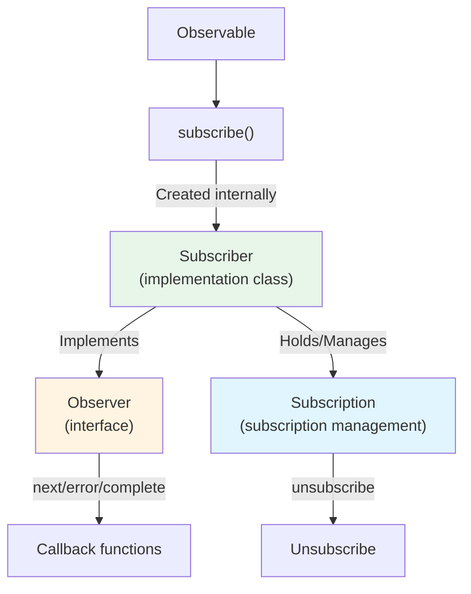
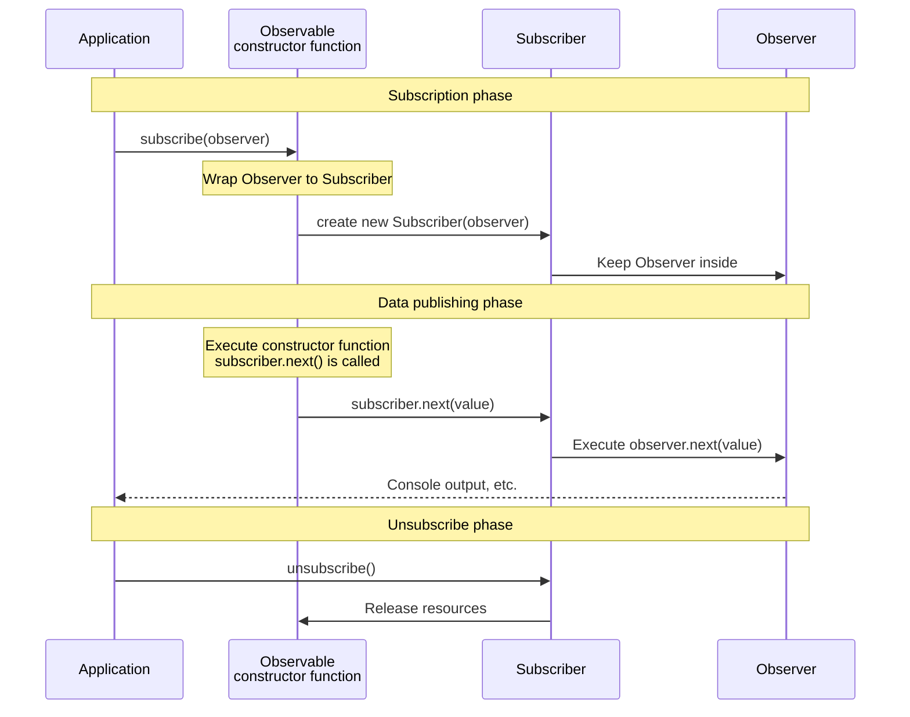

# Difference Between Observer and Subscriber

## Why They Are Confused

When learning RxJS, the terms "Observer" and "Subscriber" come up and can be confusing. These two are closely related, but they have distinctly different roles.

## What is an Observer?

An **Observer** is an **interface** to receive data.

### Observer's Definition

```typescript
interface Observer<T> {
  next: (value: T) => void;       // Receive a value
  error?: (err: any) => void;     // Receive an error
  complete?: () => void;          // Receive completion
}
```

### Observer's Role
- Defines "how" to receive data
- Has 3 callback functions
- Describes **what** to do

## What is a Subscriber?

**Subscriber** is a **class** that implements Observer and performs the actual subscription process.

### Subscriber's Role
- Executes Observer's callbacks
- Holds Subscription (subscription management)
- Manages unsubscription process
- Controls **how** to execute

## Two Situations Where Subscriber Appears

Subscriber actually appears in **two different situations**. However, **both are the same Subscriber object**. Understanding this difference is the key to avoiding confusion.

### Situation 1: When Creating an Observable (Received as a Parameter)

When creating an Observable with `new Observable()`, `subscriber` is passed as a parameter to the constructor function.

```typescript
import { Observable } from 'rxjs';

// Use subscriber to publish values (type is Subscriber<number>)
const observable$ = new Observable<number>(subscriber => {
  subscriber.next(1);      // Publish a value
  subscriber.next(2);
  subscriber.complete();   // Notify completion
});
```

::: tip Type of subscriber in this situation
- Type: `Subscriber<number>`
- Role: Used to publish data inside the Observable
- Developers use it directly (call `next()`, `error()`, `complete()`)
:::

### Situation 2: When Calling subscribe() (Observer → Converted to Subscriber)

When you call `subscribe()` on an Observable, **the Observer passed by the developer is internally converted to a Subscriber**.

```typescript
// Developer passes an Observer interface
observable$.subscribe({
  next: value => console.log('Next value:', value),
  error: err => console.error('Error:', err),
  complete: () => console.log('Complete')
});

// ↑ RxJS internally creates a Subscriber as follows
// const subscriber = new Subscriber(observer);
// And this subscriber is passed as the parameter in situation 1
```

::: tip Processing in this situation
1. Developer passes an `Observer` interface
2. RxJS internally wraps the `Observer` in a `Subscriber`
3. That `Subscriber` is passed to the Observable's constructor function (= `subscriber` in situation 1)
:::

### Important: Both Are the Same Subscriber Object

> [!IMPORTANT] The `Subscriber` in situations 1 and 2 is the same object
>
> ```typescript
> const observable$ = new Observable(subscriber => {
>   // This subscriber is the Subscriber object itself
>   // created when subscribe() was called
>   subscriber.next(1);
> });
>
> observable$.subscribe({
>   // This Observer is wrapped in a Subscriber,
>   // and passed to the constructor function above
>   next: v => console.log(v)
> });
> ```
>
> **In other words:**
> - Developer calls `subscribe(observer)`
> - RxJS creates `new Subscriber(observer)`
> - That Subscriber becomes the argument to the Observable's constructor function
> - Therefore, `subscriber` in situation 1 = `Subscriber` created in situation 2

## Illustration of Relationships



## Differences Seen in Code

### Complete Example: From Observable Creation to Subscription

```typescript
import { Observable } from 'rxjs';

// 1. When creating Observable: use subscriber to publish values
const observable$ = new Observable<number>(subscriber => {
  console.log('Subscription started');
  subscriber.next(1);
  subscriber.next(2);
  subscriber.next(3);
  subscriber.complete();
});

// 2. When subscribing: pass Observer (Subscriber is created internally)
observable$.subscribe({
  next: value => console.log('Next value:', value),
  error: err => console.error('Error:', err),
  complete: () => console.log('Complete')
});

// Output:
// Subscription started
// Next value: 1
// Next value: 2
// Next value: 3
// Complete
```

#### In This Example
- **`subscriber` at creation time**: Used to publish data inside the Observable
- **`Observer` at subscription time**: Defines the process to receive the published data

### When Passing an Observer

```typescript
import { interval } from 'rxjs';

const observer = {
  next: (value: number) => console.log(value),
  error: (err: any) => console.error(err),
  complete: () => console.log('Complete')
};

// Pass Observer to subscribe
const subscription = interval(1000).subscribe(observer);
// Internally, Subscriber is created and executes observer's callbacks
```

### When Passing Callbacks Directly (Simplified Notation)

```typescript
// This also creates a Subscriber internally
const subscription = interval(1000).subscribe(
  value => console.log(value),  // next
  err => console.error(err),    // error
  () => console.log('Complete')     // complete
);
```

## Actual Operation Flow

The following sequence diagram shows the flow from Observable creation to subscription and data publication.



**Important Points of This Flow:**
1. When `subscribe(observer)` is called, a `new Subscriber(observer)` is created
2. That Subscriber is passed as a parameter to the Observable's constructor function
3. When `subscriber.next()` is called in the constructor function, the internal `observer.next()` is executed
4. In other words, **`subscriber` in situation 1 = `Subscriber` created in situation 2**

## Important Points

> [!IMPORTANT] Observer is the "blueprint", Subscriber is the "executor"
> - **Observer**: An interface that **defines** how to receive data
> - **Subscriber**: A class that **implements** the Observer and actually **executes** the subscription
> - Subscriber appears in two situations

> [!TIP] Understand when to use Subscriber
> - **When creating Observable**: Use the `subscriber` parameter in `new Observable(subscriber => {...})` directly
> - **When subscribing**: When calling `subscribe(observer)`, a Subscriber is automatically created internally
>
> In both situations, Subscriber is the same object with `next()`, `error()`, `complete()` methods.

## Common Confusion Patterns

### ❌ Wrong Understanding #1

"The `subscriber` when creating an Observable and the `observer` when subscribing are different things"

### ❌ Wrong Understanding #2

"Subscriber is an internal implementation, so developers don't touch it"

### ✅ Correct Understanding

**Important Facts:**
- The **Observer** that the developer passes in `subscribe(observer)` is wrapped internally in a **Subscriber**
- That **Subscriber** is passed as a parameter to the constructor function when creating the Observable
- In other words, **`subscriber` in situation 1 = `Subscriber` created in situation 2 (same object)**

### Understanding with Complete Example

```typescript
import { Observable } from 'rxjs';

// 1. Create Observable (nothing is executed at this point)
const observable$ = new Observable<number>(subscriber => {
  console.log('Constructor function was executed!');
  subscriber.next(1);
  subscriber.next(2);
  subscriber.complete();
});

// 2. Subscribe (the constructor function is executed for the first time at this moment)
observable$.subscribe({
  next: v => console.log('Received:', v),
  complete: () => console.log('Complete')
});

// Output:
// Constructor function was executed!
// Received: 1
// Received: 2
// Complete
```

**Flow in This Example:**
1. `observable$.subscribe({...})` is called
2. RxJS creates `new Subscriber({next: ..., complete: ...})`
3. The constructor function `(subscriber => {...})` is executed with that `Subscriber` as a parameter
4. `subscriber.next(1)` is called in the constructor function
5. Internally, `observer.next(1)` is executed and "Received: 1" is output

**In Other Words:**
- `subscriber` in situation 1 ← this
- `Subscriber` created in situation 2 ← this
- **Same object!**

## Summary

### Comparison of Observer and Subscriber

| | Observer | Subscriber |
|---|----------|------------|
| **Type** | Interface | Class (implements Observer) |
| **Role** | Defines how to receive data | Executes actual subscription process |
| **Content** | next/error/complete callbacks | Observer + Subscription management |
| **When it appears** | Only at subscription time | At Observable creation & subscription time |

### Important: Relationship in Two Situations

| Situation | What the developer handles | Actual type | Relationship |
|------|------------------|----------|--------|
| **When creating Observable** | Parameter in `new Observable(subscriber => {...})` | `Subscriber<T>` | Developer uses directly |
| **When subscribing** | Object passed to `subscribe(observer)` | `Observer<T>` → Converted internally to `Subscriber<T>` | RxJS converts automatically |

> [!IMPORTANT] Core Point
> - The `Observer` that the developer passes in `subscribe(observer)` is wrapped in a `Subscriber` internally
> - That `Subscriber` is passed as a parameter to the Observable's constructor function
> - Therefore, **the `Subscriber` used in both situations is the same object**

## Next Steps

Now that you understand the difference between Observer and Subscriber, let's learn about actual subscription management.

- [Observable Lifecycle](/en/guide/observables/observable-lifecycle) - Flow from subscription start to end
- [Subscription Management](/en/guide/observables/observable-lifecycle#subscription-management) - Unsubscription and resource management

## Reference Resources

- [RxJS Official Documentation - Observer](https://rxjs.dev/guide/observer) - Detailed specification of Observer
- [RxJS Official Documentation - Subscription](https://rxjs.dev/guide/subscription) - Detailed specification of Subscription
- [Understanding the Difference Between Observer and Subscriber in RxJS](https://www.codingscenes.com/posts/92/Understanding-the-Difference-Between-Observer-and-Subscriber-in-RxJS) - Extended functionality of Subscriber and practical examples
