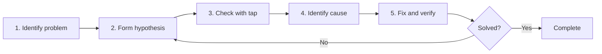

# Debugging Barrier

When you face problems in RxJS like **"values don't flow", "values are different than expected", or "there might be a memory leak"**, it takes time to resolve without knowing proper debugging methods. This page comprehensively explains RxJS-specific debugging techniques.

## Basic RxJS Debugging Strategy

### 5 Steps of Debugging



### Step 1: Identify the Problem

First, clarify **what the problem is**.

| Symptom | Possible Causes |
|---|---|
| No values flow at all | Forgot subscribe, ended before complete, excluded by filter |
| First value doesn't appear | combineLatest initial condition not met, BehaviorSubject not set |
| Order is wrong | Using mergeMap, asynchronous timing |
| Duplicate values appear | Multiple subscribes without share, shareReplay misuse |
| Memory leak | Forgot unsubscribe, shareReplay refCount: false |
| Values are delayed | debounceTime, throttleTime, asynchronous processing |

### Step 2: Form a Hypothesis

**Guess** the cause of the problem.

```typescript
// Example: "values don't appear" problem
// Hypothesis 1: Not subscribed?
// Hypothesis 2: complete/error too early?
// Hypothesis 3: Excluded by filter?
// Hypothesis 4: Taking time due to async?
```

### Step 3: Check with tap

Insert `tap` at each stage to confirm **what's actually happening**.

```typescript
import { of } from 'rxjs';
import { map, filter, tap } from 'rxjs';

of(1, 2, 3, 4, 5).pipe(
  tap(v => console.log('🔵 Input:', v)),
  filter(x => x > 10), // ❌ All excluded
  tap(v => console.log('✅ Passed filter:', v)),
  map(x => x * 10),
  tap(v => console.log('🟢 After map:', v))
).subscribe(result => {
  console.log('📦 Result:', result);
});

// Output:
// 🔵 Input: 1
// 🔵 Input: 2
// 🔵 Input: 3
// 🔵 Input: 4
// 🔵 Input: 5
// (None passed filter → filter is the cause)
```

## Common Debugging Scenarios

### Scenario 1: Values Don't Flow

#### Problem 1-1: Forgot subscribe

#### ❌ Bad Example: Not subscribed
```typescript
import { of } from 'rxjs';
import { map } from 'rxjs';

const result$ = of(1, 2, 3).pipe(
  map(x => x * 10)
);

console.log('Complete'); // Outputs immediately
// No values flow to result$ (because not subscribed)
```

#### ✅ Good Example: Subscribe
```typescript
import { of } from 'rxjs';
import { map } from 'rxjs';

const result$ = of(1, 2, 3).pipe(
  map(x => x * 10)
);

result$.subscribe(value => {
  console.log('Value:', value);
});

console.log('Complete');

// Output:
// Value: 10
// Value: 20
// Value: 30
// Complete
```

> [!IMPORTANT] Checkpoint
> - Nothing happens just by defining an Observable
> - **Must subscribe**
> - No need to subscribe when using async pipe (Angular, etc.)

#### Problem 1-2: complete/error Too Early

#### ❌ Bad Example: complete comes first
```typescript
import { EMPTY } from 'rxjs';
import { map } from 'rxjs';

EMPTY.pipe( // ❌ Completes immediately
  map(x => x * 10)
).subscribe({
  next: value => console.log('Value:', value),
  complete: () => console.log('Complete')
});

// Output:
// Complete
// (No values flow)
```

#### ✅ Good Example: Check with tap
```typescript
import { EMPTY } from 'rxjs';
import { map, tap } from 'rxjs';

EMPTY.pipe(
  tap(() => console.log('👁️ Value arrived')), // This doesn't output
  map(x => x * 10)
).subscribe({
  next: value => console.log('Value:', value),
  complete: () => console.log('Complete')
});

// Output:
// Complete
// (tap also not executed → EMPTY is the cause)
```

#### Problem 1-3: Excluded by filter

#### ❌ Bad Example: All excluded unknowingly
```typescript
import { of } from 'rxjs';
import { filter } from 'rxjs';

of(1, 2, 3, 4, 5).pipe(
  filter(x => x > 100) // ❌ All excluded
).subscribe(value => {
  console.log('Value:', value); // Nothing output
});
```

#### ✅ Good Example: Check with tap
```typescript
import { of } from 'rxjs';
import { filter, tap } from 'rxjs';

of(1, 2, 3, 4, 5).pipe(
  tap(v => console.log('Before filter:', v)),
  filter(x => x > 100),
  tap(v => console.log('After filter:', v)) // None output
).subscribe(value => {
  console.log('Value:', value);
});

// Output:
// Before filter: 1
// Before filter: 2
// Before filter: 3
// Before filter: 4
// Before filter: 5
// (None after filter → filter is too strict)
```

### Scenario 2: Values Different Than Expected

#### Problem 2-1: Type Conversion Mistake

#### ❌ Bad Example: String and number confusion
```typescript
import { of } from 'rxjs';
import { map } from 'rxjs';

const input = '5'; // String

of(input).pipe(
  map(x => x + 10) // ❌ '5' + 10 = '510' (string concatenation)
).subscribe(result => {
  console.log('Result:', result); // Result: 510
  console.log('Type:', typeof result); // Type: string
});
```

#### ✅ Good Example: Check type with tap
```typescript
import { of } from 'rxjs';
import { map, tap } from 'rxjs';

const input = '5';

of(input).pipe(
  tap(x => console.log('Input:', x, typeof x)),
  map(x => Number(x)), // Convert to number
  tap(x => console.log('After conversion:', x, typeof x)),
  map(x => x + 10)
).subscribe(result => {
  console.log('Result:', result); // Result: 15
});
```

#### Problem 2-2: Asynchronous Order

#### ❌ Bad Example: Order disrupted with mergeMap
```typescript
import { of } from 'rxjs';
import { mergeMap, delay } from 'rxjs';

of(1, 2, 3).pipe(
  mergeMap(x =>
    of(x * 10).pipe(
      delay(Math.random() * 1000) // Random delay
    )
  )
).subscribe(value => {
  console.log('Value:', value);
});

// Example output (order not guaranteed):
// Value: 20
// Value: 10
// Value: 30
```

#### ✅ Good Example: Guarantee order with concatMap
```typescript
import { of } from 'rxjs';
import { concatMap, delay, tap } from 'rxjs';

of(1, 2, 3).pipe(
  tap(x => console.log('Input:', x)),
  concatMap(x =>
    of(x * 10).pipe(
      delay(Math.random() * 1000),
      tap(v => console.log('Complete:', v))
    )
  )
).subscribe(value => {
  console.log('Value:', value);
});

// Output (always this order):
// Input: 1
// Complete: 10
// Value: 10
// Input: 2
// Complete: 20
// Value: 20
// Input: 3
// Complete: 30
// Value: 30
```

### Scenario 3: Detecting Memory Leaks

#### Problem 3-1: Forgot unsubscribe

#### ❌ Bad Example: Don't unsubscribe
```typescript
import { interval } from 'rxjs';

class Component {
  ngOnInit() {
    interval(1000).subscribe(n => {
      console.log('Value:', n); // Runs forever
    });
  }

  ngOnDestroy() {
    // Not unsubscribing → Memory leak
  }
}
```

#### ✅ Good Example: Auto-release with takeUntil
```typescript
import { interval, Subject } from 'rxjs';
import { takeUntil } from 'rxjs';

class Component {
  private destroy$ = new Subject<void>();

  ngOnInit() {
    interval(1000).pipe(
      takeUntil(this.destroy$)
    ).subscribe(n => {
      console.log('Value:', n);
    });
  }

  ngOnDestroy() {
    this.destroy$.next();
    this.destroy$.complete();
    console.log('Unsubscribe complete');
  }
}
```

#### Problem 3-2: shareReplay Memory Leak

#### ❌ Bad Example: Leak with refCount: false
```typescript
import { interval } from 'rxjs';
import { shareReplay, take, tap } from 'rxjs';

const data$ = interval(1000).pipe(
  take(100),
  tap(n => console.log('Generate:', n)),
  shareReplay({ bufferSize: 1, refCount: false })
  // ❌ refCount: false → Runs forever
);

const sub = data$.subscribe(n => console.log('Subscribe 1:', n));

setTimeout(() => {
  sub.unsubscribe();
  console.log('Unsubscribed but internally still running');
}, 5000);
```

#### ✅ Good Example: Auto-stop with refCount: true
```typescript
import { interval } from 'rxjs';
import { shareReplay, take, tap } from 'rxjs';

const data$ = interval(1000).pipe(
  take(100),
  tap(n => console.log('Generate:', n)),
  shareReplay({ bufferSize: 1, refCount: true })
  // ✅ refCount: true → Stops when all unsubscribe
);

const sub = data$.subscribe(n => console.log('Subscribe 1:', n));

setTimeout(() => {
  sub.unsubscribe();
  console.log('Unsubscribe → Stream also stops');
}, 5000);
```

## Debugging Tools and Techniques

### 1. Stepwise Debugging with tap

```typescript
import { of } from 'rxjs';
import { map, filter, tap } from 'rxjs';

const debugTap = <T>(label: string, color: string = '🔵') =>
  tap<T>({
    next: value => console.log(`${color} [${label}] next:`, value),
    error: error => console.error(`❌ [${label}] error:`, error),
    complete: () => console.log(`✅ [${label}] complete`)
  });

of(1, 2, 3, 4, 5).pipe(
  debugTap('Input'),
  filter(x => x % 2 === 0),
  debugTap('After filter', '🟢'),
  map(x => x * 10),
  debugTap('After map', '🟡')
).subscribe({
  next: value => console.log('📦 Final result:', value),
  complete: () => console.log('🏁 Complete')
});
```

### 2. Custom Debug Operator

```typescript
import { tap, timestamp, map } from 'rxjs';
import { MonoTypeOperatorFunction } from 'rxjs';

interface DebugOptions {
  label: string;
  showTimestamp?: boolean;
  showDiff?: boolean;
}

let lastTimestamp = 0;

function debug<T>(options: DebugOptions): MonoTypeOperatorFunction<T> {
  const { label, showTimestamp = true, showDiff = true } = options;

  return source => source.pipe(
    timestamp(),
    tap(({ value, timestamp }) => {
      const parts = [`[${label}]`, value];

      if (showTimestamp) {
        parts.push(`@${new Date(timestamp).toISOString()}`);
      }

      if (showDiff && lastTimestamp > 0) {
        const diff = timestamp - lastTimestamp;
        parts.push(`(+${diff}ms)`);
      }

      console.log(...parts);
      lastTimestamp = timestamp;
    }),
    map(({ value }) => value)
  );
}

// Usage
import { interval } from 'rxjs';
import { take } from 'rxjs';

interval(500).pipe(
  take(5),
  debug({ label: 'Timer' }),
  map(x => x * 10),
  debug({ label: 'After conversion', showDiff: false })
).subscribe();
```

### 3. RxJS DevTools (Browser Extension)

**Installation:**
1. Search "RxJS DevTools" in Chrome/Edge Web Store
2. Add extension
3. Open DevTools and click "RxJS" tab

**Main Features:**
- Monitor all Observables in real-time
- Visualization with Marble Diagrams
- Track subscribe/unsubscribe
- Performance analysis

**Usage Example:**
```typescript
import { interval } from 'rxjs';
import { map, take } from 'rxjs';

// Automatically detected by DevTools
const timer$ = interval(1000).pipe(
  take(10),
  map(x => x * 2)
);

timer$.subscribe(value => console.log(value));
```

### 4. Debugging Errors

#### Identify Error Location

```typescript
import { of, throwError } from 'rxjs';
import { map, catchError, tap } from 'rxjs';

of(1, 2, 3).pipe(
  tap(v => console.log('1. Input:', v)),
  map(x => {
    if (x === 2) {
      throw new Error('Cannot use 2');
    }
    return x * 10;
  }),
  tap(v => console.log('2. After map:', v)), // Not executed on error
  catchError(error => {
    console.error('3. Error caught:', error.message);
    return of(-1); // Return default value
  }),
  tap(v => console.log('4. After catchError:', v))
).subscribe({
  next: value => console.log('5. Result:', value),
  error: error => console.error('Subscribe error:', error),
  complete: () => console.log('6. Complete')
});

// Output:
// 1. Input: 1
// 2. After map: 10
// 5. Result: 10
// 1. Input: 2
// 3. Error caught: Cannot use 2
// 4. After catchError: -1
// 5. Result: -1
// 6. Complete
```

## Performance Debugging

### Problem 1: Excessive Recalculation

#### ❌ Bad Example: Frequent recalculation with combineLatest
```typescript
import { BehaviorSubject, combineLatest } from 'rxjs';
import { map } from 'rxjs';

const a$ = new BehaviorSubject(1);
const b$ = new BehaviorSubject(2);
const c$ = new BehaviorSubject(3);

combineLatest([a$, b$, c$]).pipe(
  map(([a, b, c]) => {
    console.log('Heavy calculation executed'); // Executed frequently
    return a + b + c;
  })
).subscribe(result => console.log('Result:', result));

// Frequent updates
setInterval(() => {
  a$.next(Math.random());
}, 100);
```

#### ✅ Good Example: Exclude duplicates with distinctUntilChanged
```typescript
import { BehaviorSubject, combineLatest } from 'rxjs';
import { map, distinctUntilChanged } from 'rxjs';

const a$ = new BehaviorSubject(1);
const b$ = new BehaviorSubject(2);
const c$ = new BehaviorSubject(3);

combineLatest([a$, b$, c$]).pipe(
  map(([a, b, c]) => Math.floor(a) + Math.floor(b) + Math.floor(c)),
  distinctUntilChanged(), // Pass only when value changes
  map(sum => {
    console.log('Heavy calculation executed'); // Only when value changes
    return sum * 2;
  })
).subscribe(result => console.log('Result:', result));

setInterval(() => {
  a$.next(Math.random());
}, 100);
```

### Problem 2: Monitor Memory Usage

```typescript
import { interval } from 'rxjs';
import { scan, tap } from 'rxjs';

let itemCount = 0;

interval(100).pipe(
  scan((acc, val) => {
    acc.push(val);
    itemCount = acc.length;
    return acc;
  }, [] as number[]),
  tap(() => {
    if (itemCount % 100 === 0) {
      console.log(`Item count: ${itemCount}`);
      if (itemCount > 10000) {
        console.warn('⚠️ Memory usage too high');
      }
    }
  })
).subscribe();
```

### Problem 3: Monitor Subscription Count

```typescript
import { Observable, Subject } from 'rxjs';

class MonitoredSubject<T> extends Subject<T> {
  private subscriptionCount = 0;

  subscribe(...args: any[]): any {
    this.subscriptionCount++;
    console.log(`Subscription count: ${this.subscriptionCount}`);

    const subscription = super.subscribe(...args);

    const originalUnsubscribe = subscription.unsubscribe.bind(subscription);
    subscription.unsubscribe = () => {
      this.subscriptionCount--;
      console.log(`Subscription count: ${this.subscriptionCount}`);
      originalUnsubscribe();
    };

    return subscription;
  }
}

// Usage
const data$ = new MonitoredSubject<number>();

const sub1 = data$.subscribe(v => console.log('Subscribe 1:', v));
const sub2 = data$.subscribe(v => console.log('Subscribe 2:', v));

sub1.unsubscribe();
sub2.unsubscribe();

// Output:
// Subscription count: 1
// Subscription count: 2
// Subscription count: 1
// Subscription count: 0
```

## Debugging Checklist

When a problem occurs, check the following in order.

```markdown
## Basic Check
- [ ] Calling `subscribe()`?
- [ ] `complete` or `error` not too early?
- [ ] Values not excluded by `filter` or `take`?
- [ ] Waiting for asynchronous processing completion?

## Timing Check
- [ ] Understanding synchronous/asynchronous?
- [ ] Confirmed impact of `delay`, `debounceTime`, `throttleTime`?
- [ ] Met `combineLatest` initial firing condition?

## Memory Check
- [ ] Using `unsubscribe` or `takeUntil`?
- [ ] Set `refCount: true` for `shareReplay`?
- [ ] Properly limiting infinite Observables?

## Performance Check
- [ ] Excessive recalculation not occurring? (consider `distinctUntilChanged`)
- [ ] Subscription count not too high?
- [ ] Heavy processing made asynchronous with `observeOn(asyncScheduler)`?
```

## Comprehension Checklist

Check if you can answer the following questions.

```markdown
## Basic Debugging
- [ ] Can debug value flow using tap
- [ ] Can identify error location
- [ ] Can confirm complete/error timing

## Tool Usage
- [ ] Know basic RxJS DevTools usage
- [ ] Can create custom debug operators
- [ ] Can measure timing with timestamp

## Problem Solving
- [ ] Can identify causes of values not flowing
- [ ] Can find memory leak signs
- [ ] Can identify performance problems

## Prevention
- [ ] Have habit of stepwise debugging with tap
- [ ] Properly implementing error handling
- [ ] Know memory leak countermeasures
```

## Next Steps

Once you understand debugging techniques, integrate all the knowledge you've learned and study **practical patterns**.

→ **Chapter 13: Practical Patterns** (in preparation) - Patterns for practical use

## Related Pages

- **[Chapter 8: RxJS Debugging Techniques](/en/guide/debugging/)** - Overall debugging techniques
- **[Chapter 9: Marble Testing](/en/guide/testing/marble-testing)** - Debugging with TestScheduler
- **[Understanding Timing and Order](/en/guide/overcoming-difficulties/timing-and-order)** - Debugging with tap
- **[Chapter 10: Common Mistakes and Solutions](/en/guide/anti-patterns/common-mistakes)** - Avoiding anti-patterns

## 🎯 Exercises

### Problem 1: Identifying Why Values Don't Flow

In the following code, identify why values are not output.

```typescript
import { Subject, combineLatest } from 'rxjs';

const a$ = new Subject<number>();
const b$ = new Subject<number>();

combineLatest([a$, b$]).subscribe(([a, b]) => {
  console.log('Values:', a, b);
});

a$.next(1);
console.log('Complete');
```

<details>
<summary>Solution</summary>

> [!NOTE] Cause
> `combineLatest` doesn't fire until all streams have emitted at least once
>
> Since `b$` hasn't emitted a value yet, just `a$.next(1)` won't fire.

#### Fix Method 1: Emit value to b$ too
```typescript
import { Subject, combineLatest } from 'rxjs';

const a$ = new Subject<number>();
const b$ = new Subject<number>();

combineLatest([a$, b$]).subscribe(([a, b]) => {
  console.log('Values:', a, b);
});

a$.next(1);
b$.next(2); // ← Fires here
console.log('Complete');

// Output:
// Values: 1 2
// Complete
```

#### Fix Method 2: Use BehaviorSubject
```typescript
import { BehaviorSubject, combineLatest } from 'rxjs';

const a$ = new BehaviorSubject<number>(0); // Initial value
const b$ = new BehaviorSubject<number>(0);

combineLatest([a$, b$]).subscribe(([a, b]) => {
  console.log('Values:', a, b);
});

// Output: Values: 0 0 (fires immediately)

a$.next(1);
// Output: Values: 1 0
```

> [!NOTE] Debugging Technique
> Using tap to check each stream's values shows where it's stuck.
> ```typescript
> a$.pipe(tap(v => console.log('a$:', v)))
> b$.pipe(tap(v => console.log('b$:', v)))
> ```

</details>

### Problem 2: Fixing Memory Leak

The following code has a memory leak. Fix it.

```typescript
import { interval } from 'rxjs';
import { Component } from '@angular/core';

class MyComponent implements Component {
  ngOnInit() {
    interval(1000).subscribe(n => {
      console.log('Timer:', n);
    });
  }

  ngOnDestroy() {
    console.log('Destroy');
  }
}
```

<details>
<summary>Solution</summary>

> [!NOTE] Problem
> Not unsubscribing in `ngOnDestroy`, so interval continues even after component is destroyed

#### Fix Method 1: Save Subscription and unsubscribe
```typescript
import { interval, Subscription } from 'rxjs';

class MyComponent {
  private subscription!: Subscription;

  ngOnInit() {
    this.subscription = interval(1000).subscribe(n => {
      console.log('Timer:', n);
    });
  }

  ngOnDestroy() {
    this.subscription.unsubscribe();
    console.log('Destroy & unsubscribe');
  }
}
```

#### Fix Method 2: Use takeUntil (recommended)
```typescript
import { interval, Subject } from 'rxjs';
import { takeUntil } from 'rxjs';

class MyComponent {
  private destroy$ = new Subject<void>();

  ngOnInit() {
    interval(1000).pipe(
      takeUntil(this.destroy$)
    ).subscribe(n => {
      console.log('Timer:', n);
    });
  }

  ngOnDestroy() {
    this.destroy$.next();
    this.destroy$.complete();
    console.log('Destroy & unsubscribe');
  }
}
```

> [!IMPORTANT] Key Points
> - Infinite Observables like interval always require unsubscribe
> - takeUntil pattern is recommended (can manage multiple subscriptions at once)
> - In Angular, using async pipe automatically unsubscribes

</details>

### Problem 3: Order Problem

In the following code, explain why order is not guaranteed and fix it.

```typescript
import { from, of } from 'rxjs';
import { mergeMap, delay } from 'rxjs';

from([1, 2, 3]).pipe(
  mergeMap(x =>
    of(x).pipe(
      delay(Math.random() * 1000)
    )
  )
).subscribe(value => console.log(value));

// Example output: 2, 1, 3 (order not guaranteed)
```

<details>
<summary>Solution</summary>

> [!NOTE] Problem
> `mergeMap` executes in parallel, so completion order depends on execution time

#### Fix Method: Use concatMap
```typescript
import { from, of } from 'rxjs';
import { concatMap, delay, tap } from 'rxjs';

from([1, 2, 3]).pipe(
  tap(x => console.log('Start:', x)),
  concatMap(x =>
    of(x).pipe(
      delay(Math.random() * 1000),
      tap(v => console.log('Complete:', v))
    )
  )
).subscribe(value => console.log('Result:', value));

// Output (always this order):
// Start: 1
// Complete: 1
// Result: 1
// Start: 2
// Complete: 2
// Result: 2
// Start: 3
// Complete: 3
// Result: 3
```

> [!NOTE] Reason
> - **mergeMap**: Parallel execution, completion order not guaranteed
> - **concatMap**: Sequential execution, always output in same order as input
> - **switchMap**: Latest only, old processing is cancelled
> - **exhaustMap**: Ignore new processing while executing

#### Comparison with Marble Diagram
```
Input:  --1--2--3----|

mergeMap:  --2--1--3--|  (completion order)
concatMap: --1--2--3-| (input order)
```

</details>

### Problem 4: Performance Improvement

The following code has frequent recalculation. Improve performance.

```typescript
import { fromEvent } from 'rxjs';
import { map } from 'rxjs';

const input = document.querySelector('input')!;

fromEvent(input, 'input').pipe(
  map(e => (e.target as HTMLInputElement).value),
  map(value => {
    console.log('Heavy calculation executed');
    return value.toUpperCase();
  })
).subscribe(result => console.log(result));

// User types "hello"
// Heavy calculation executed (h)
// Heavy calculation executed (he)
// Heavy calculation executed (hel)
// Heavy calculation executed (hell)
// Heavy calculation executed (hello)
```

<details>
<summary>Solution</summary>

#### Improvement Method 1: Wait for input completion with debounceTime
```typescript
import { fromEvent } from 'rxjs';
import { map, debounceTime } from 'rxjs';

const input = document.querySelector('input')!;

fromEvent(input, 'input').pipe(
  debounceTime(300), // Execute if no input for 300ms
  map(e => (e.target as HTMLInputElement).value),
  map(value => {
    console.log('Heavy calculation executed');
    return value.toUpperCase();
  })
).subscribe(result => console.log(result));

// Type "hello" and wait 300ms, executes only once
```

#### Improvement Method 2: Exclude duplicates with distinctUntilChanged
```typescript
import { fromEvent } from 'rxjs';
import { map, debounceTime, distinctUntilChanged } from 'rxjs';

const input = document.querySelector('input')!;

fromEvent(input, 'input').pipe(
  debounceTime(300),
  map(e => (e.target as HTMLInputElement).value),
  distinctUntilChanged(), // Ignore if same as previous value
  map(value => {
    console.log('Heavy calculation executed');
    return value.toUpperCase();
  })
).subscribe(result => console.log(result));
```

> [!TIP] Performance Improvement Techniques
> - **debounceTime**: Wait for input completion
> - **throttleTime**: Thin out at regular intervals
> - **distinctUntilChanged**: Exclude duplicates
> - **observeOn(asyncScheduler)**: Make heavy processing asynchronous
> - **shareReplay**: Cache results

</details>
