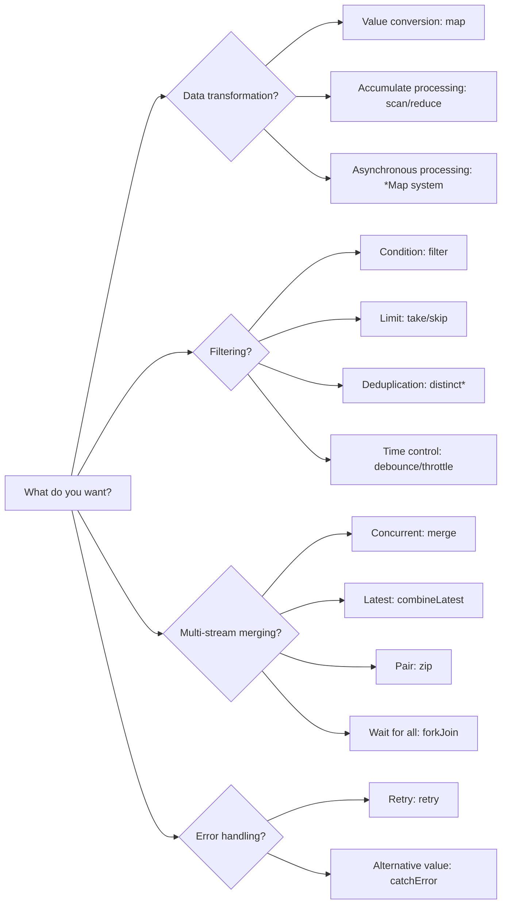
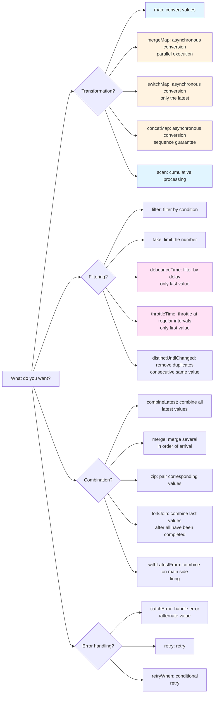
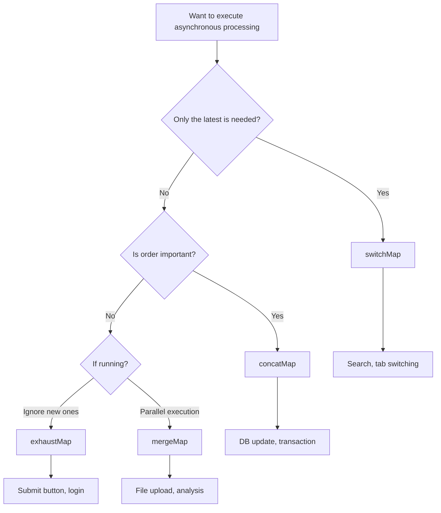

<style scoped>
.comparison-cards {
  display: grid;
  grid-template-columns: 1fr 1fr;
  gap: 1rem;
  margin-bottom: 2rem;
}

@media (max-width: 768px) {
  .comparison-cards {
    grid-template-columns: 1fr;
  }
}

/* Increase font size for title section */
.comparison-cards .tip .custom-block-title {
  font-size: 1.1rem;
  font-weight: 600;
}
</style>

# Confusion in Selecting Operators

There are over 100 different operators in RxJS, and getting **confused** about which one to use is a difficulty we all experience. This page provides practical selection criteria and a flowchart.

## Criteria for Choosing from Over 100 Operators

### Problem: Too Many Choices

```typescript
// I want to convert an array... map? scan? reduce? toArray?
// I want to call multiple APIs... mergeMap? switchMap? concatMap? exhaustMap?
// I want to filter values... filter? take? first? distinctUntilChanged?
// I want to combine multiple streams... merge? combineLatest? zip? forkJoin?
```

### Solution: Filter by Category + Purpose



### More Detailed Selection Flowchart

The following flowchart shows the procedure for selecting an operator for a specific purpose.



## 1. Transformation Operators

**When to use?** To change the form of data or to call asynchronous processing

| Operator | Usage | Common Use Cases |
|---|---|---|
| **map** | Convert values 1:1 | Property acquisition, calculation, type conversion |
| **scan** | Cumulative processing (flow intermediate values) | Counter, sum, history |
| **reduce** | Cumulative processing (only final value) | Array sum, max value |
| **mergeMap** | Asynchronous processing in parallel | Multiple API parallel invocation |
| **switchMap** | Switch asynchronous processing | Search API (latest only) |
| **concatMap** | Execute asynchronous processing in sequence | Order-critical processing |
| **exhaustMap** | Ignore new processes during execution | Prevent consecutive hits (submit button) |

### Practical Example: Selection by Use Case

#### Use Case 1: Get Properties

```typescript
import { of } from 'rxjs';
import { map } from 'rxjs';

interface User { id: number; name: string; }

of({ id: 1, name: 'Alice' }).pipe(
  map(user => user.name) // convert values 1:1 → map
).subscribe(name => console.log(name)); // 'Alice'
```

#### Use Case 2: Counter

```typescript
import { fromEvent } from 'rxjs';
import { scan } from 'rxjs';

const button = document.querySelector('button')!;

fromEvent(button, 'click').pipe(
  scan(count => count + 1, 0) // cumulative processing → scan
).subscribe(count => console.log(`Click count: ${count}`));
```

#### Use Case 3: Search API Call

```typescript
import { fromEvent } from 'rxjs';
import { debounceTime, map, switchMap } from 'rxjs';

const searchInput = document.querySelector('input')!;

fromEvent(searchInput, 'input').pipe(
  debounceTime(300),
  map(e => (e.target as HTMLInputElement).value),
  switchMap(query => searchAPI(query)) // only the latest → switchMap
).subscribe(results => console.log(results));
```

## 2. Filtering Operators

### When to Use?
I want to discard values and control timing

| Operator | Usage | Common Use Cases |
|---|---|---|
| **filter** | Only pass through values that match conditions | Only even numbers, only non-null values |
| **take** | Only the first N values | Get the first 5 |
| **first** | Only the first one | Get initial value |
| **distinctUntilChanged** | Only values different from last time | Exclude duplicates |
| **debounceTime** | Fires after a certain period of time has elapsed | Search input (after input is complete) |
| **throttleTime** | Throttle at a certain interval | Scrolling event |

### Practical Example: Selection by Use Case

#### Use Case 1: Retrieve Even Numbers Only

```typescript
import { of } from 'rxjs';
import { filter } from 'rxjs';

of(1, 2, 3, 4, 5).pipe(
  filter(n => n % 2 === 0) // only values that match the condition → filter
).subscribe(console.log); // 2, 4
```

#### Use Case 2: Search Input Optimization

```typescript
import { fromEvent } from 'rxjs';
import { debounceTime, distinctUntilChanged, map } from 'rxjs';

const input = document.querySelector('input')!;

fromEvent(input, 'input').pipe(
  debounceTime(300),              // wait for input completion → debounceTime
  map(e => (e.target as HTMLInputElement).value),
  distinctUntilChanged()          // exclude duplicates → distinctUntilChanged
).subscribe(query => console.log('Search:', query));
```

#### Use Case 3: Scroll Event Thinning

```typescript
import { fromEvent } from 'rxjs';
import { throttleTime } from 'rxjs';

fromEvent(window, 'scroll').pipe(
  throttleTime(200) // only once every 200ms → throttleTime
).subscribe(() => console.log('Scroll position:', window.scrollY));
```

## 3. Combination Operators

### When to Use?
I want to combine multiple streams

| Operator | Usage | Common Use Cases |
|---|---|---|
| **merge** | Multiple streams in parallel | Multiple event monitoring |
| **combineLatest** | Combine all the latest values | Form validation |
| **zip** | Pair corresponding values | Map results of two APIs |
| **forkJoin** | Array the results after everything is done | Parallel execution of multiple APIs |
| **withLatestFrom** | Main stream + auxiliary value | Event + current state |

### Practical Example: Selection by Use Case

#### Use Case 1: Monitor Multiple Events

```typescript
import { fromEvent, merge } from 'rxjs';

const clicks$ = fromEvent(document, 'click');
const keypresses$ = fromEvent(document, 'keypress');

merge(clicks$, keypresses$).pipe() // concurrent monitoring → merge
  .subscribe(() => console.log('Some event occurred'));
```

#### Use Case 2: Form Validation

```typescript
import { combineLatest } from 'rxjs';
import { map } from 'rxjs';

const email$ = getFormControl('email');
const password$ = getFormControl('password');

combineLatest([email$, password$]).pipe( // all latest values → combineLatest
  map(([email, password]) => email.length > 0 && password.length > 7)
).subscribe(isValid => console.log('Form valid:', isValid));
```

#### Use Case 3: Parallel Execution of Multiple APIs

```typescript
import { forkJoin } from 'rxjs';

forkJoin({
  user: getUserAPI(),
  posts: getPostsAPI(),
  comments: getCommentsAPI()
}).subscribe(({ user, posts, comments }) => { // wait for all completion → forkJoin
  console.log('All data acquisition completed', { user, posts, comments });
});
```

## 20 Most Frequently Used Operators

The following are the **most frequently used** operators in practice. Learn these 20 first.

<div class="comparison-cards">

::: tip 🥇 Most Frequent (Required)
1. **map** - convert values
2. **filter** - filter by condition
3. **switchMap** - search, etc., only needed for newest
4. **tap** - debug, side effects
5. **take** - first N
6. **first** - first one
7. **catchError** - error handling
8. **takeUntil** - unsubscribe
:::

::: tip 🥈 Frequently Used (Often)
9. **mergeMap** - parallel asynchronous processing
10. **debounceTime** - wait for input completion
11. **distinctUntilChanged** - de-duplicate
12. **combineLatest** - combine multiple values
13. **startWith** - set initial value
14. **scan** - accumulate
15. **shareReplay** - cache results
:::

::: tip 🥉 Frequently Used (Should Know)
16. **concatMap** - iterative processing
17. **throttleTime** - event thinning
18. **withLatestFrom** - get auxiliary values
19. **forkJoin** - multiple API queueing
20. **retry** - retry processing
:::

</div>

## switchMap vs mergeMap vs concatMap vs exhaustMap

These four are the **most confusing** operators. Let's clearly understand the differences.

### Comparison Table

| Operator | Execution Method | Previous Process | New Process | Usage |
|---|---|---|---|---|
| **switchMap** | Switch | **Cancel** | Start instantly | Search, autocomplete |
| **mergeMap** | Parallel execution | Continue | Start instantly | File upload, analysis |
| **concatMap** | Execute sequentially | Wait for completion | Start after **wait** | Order-critical processing |
| **exhaustMap** | Ignore during execution | Continue | **Ignore** | Prevent button mashing |

### Comparison with Marble Diagram

```
Outside: ----A----B----C----|

Inside: A → --1--2|
      B → --3--4|
      C → --5--6|

switchMap:  ----1--3--5--6|  (A cancels before 2, B cancels before 4)
mergeMap:   ----1-23-45-6|   (all executed in parallel)
concatMap:  ----1--2--3--4--5--6|  (execute sequentially)
exhaustMap: ----1--2|            (B and C are ignored)
```

### Practical Example: 4 Differences in the Same Process

**Situation**: API (takes 1 second) is called for every button click. User clicks every 0.5 seconds.

#### switchMap - Great for Search

```typescript
import { fromEvent } from 'rxjs';
import { switchMap } from 'rxjs';

fromEvent(button, 'click').pipe(
  switchMap(() => searchAPI()) // execute only the latest, cancel old requests
).subscribe(result => console.log(result));

// 0.0 sec: Click 1 → API1 start
// 0.5 sec: Click 2 → API1 canceled, API2 started
// 1.0 sec: Click 3 → API2 canceled, API3 started
// 2.0 sec: API3 complete → result displayed (API3 only)
```

::: tip 💡 Usage
- **Search/Autocomplete**: only the latest input value is needed
- **Tab Switching**: only the data of the currently displayed tab is needed
- **Pagination**: display only the latest page
:::

#### mergeMap - Great for Concurrency

```typescript
import { fromEvent } from 'rxjs';
import { mergeMap } from 'rxjs';

fromEvent(button, 'click').pipe(
  mergeMap(() => uploadFileAPI()) // all executed in parallel
).subscribe(result => console.log(result));

// 0.0 sec: Click 1 → API1 start
// 0.5 sec: Click 2 → API2 starts (API1 continues)
// 1.0 sec: Click 3 → API3 starts (API1, API2 continue)
// 1.0 sec: API1 complete → Result displayed
// 1.5 sec: API2 complete → result displayed
// 2.0 sec: API3 complete → display results
```

::: tip 💡 Usage
- **File Upload**: Upload multiple files simultaneously
- **Analysis and Log Sending**: Parallel execution of independent processes
- **Notification System**: Process multiple notifications simultaneously
:::

#### concatMap - Ideal for Order-Critical Processing

```typescript
import { fromEvent } from 'rxjs';
import { concatMap } from 'rxjs';

fromEvent(button, 'click').pipe(
  concatMap(() => updateDatabaseAPI()) // execute sequentially (waiting for previous completion)
).subscribe(result => console.log(result));

// 0.0 sec: Click 1 → API1 start
// 0.5 sec: Click 2 → wait (add to queue)
// 1.0 sec: Click 3 → wait (add to queue)
// 1.0 sec: API1 complete → display results, start API2
// 2.0 sec: API2 complete → display results, start API3
// 3.0 sec: API3 complete → display results
```

::: tip 💡 Usage
- **Database Update**: order-critical update process
- **Animations**: animations you want to execute in sequence
- **Transactions**: execute one at a time without fail
:::

#### exhaustMap - Great for Preventing Stacking

```typescript
import { fromEvent } from 'rxjs';
import { exhaustMap } from 'rxjs';

fromEvent(button, 'click').pipe(
  exhaustMap(() => submitFormAPI()) // ignore new clicks during execution
).subscribe(result => console.log(result));

// 0.0 seconds: Click 1 → API1 starts
// 0.5 sec: Click 2 → ignored (API1 running)
// 1.0 sec: Click 3 → Ignored (API1 running)
// 1.0 sec: API1 complete → Result displayed
// 1.5 sec: Click 4 → API4 started (completed last time)
```

::: tip 💡 Usage
- **Submit Button**: Prevent form submissions from being repeatedly clicked
- **Authentication**: Preventing consecutive hits to the login button
- **Billing Process**: Prevent double billing
:::

### Selection Flowchart



## Criteria in Practice

### Step 1: Clarify What You Want to Accomplish

```typescript
// ❌ Bad example: use mergeMap for now
observable$.pipe(
  mergeMap(value => someAPI(value))
);

// ✅ Good example: clarify purpose before choosing
// Purpose: For a user's search input, we want to display only the latest results
// → Old requests should be canceled → switchMap
searchInput$.pipe(
  switchMap(query => searchAPI(query))
);
```

### Step 2: Performance Considerations

#### debounceTime vs throttleTime Selection

```typescript
// Search input: run after user "completes" input
searchInput$.pipe(
  debounceTime(300), // run if no input for 300ms
  switchMap(query => searchAPI(query))
);

// Scroll: execute at regular intervals (to prevent too high frequency)
scroll$.pipe(
  throttleTime(200), // execute only once every 200ms
  tap(() => loadMoreItems())
);
```

### Step 3: Incorporate Error Handling

```typescript
import { of } from 'rxjs';
import { catchError, retry, switchMap } from 'rxjs';

searchInput$.pipe(
  debounceTime(300),
  switchMap(query =>
    searchAPI(query).pipe(
      retry(2),                          // retry up to 2 times
      catchError(err => {
        console.error('Search error:', err);
        return of([]);                   // return empty array
      })
    )
  )
).subscribe(results => console.log(results));
```

### Step 4: Prevent Memory Leaks

```typescript
import { Subject } from 'rxjs';
import { switchMap, takeUntil } from 'rxjs';

class SearchComponent {
  private destroy$ = new Subject<void>();

  ngOnInit() {
    searchInput$.pipe(
      debounceTime(300),
      switchMap(query => searchAPI(query)),
      takeUntil(this.destroy$)           // release when component is destroyed
    ).subscribe(results => console.log(results));
  }

  ngOnDestroy() {
    this.destroy$.next();
    this.destroy$.complete();
  }
}
```

## Comprehension Checklist

Make sure you can answer the following questions.

```markdown
## Basic Understanding
- [ ] Classify operators by category (transform, filter, merge)
- [ ] Describe at least 10 of the 20 most frequently used operators
- [ ] Explain the difference between switchMap, mergeMap, concatMap, and exhaustMap

## Practical Selection
- [ ] Select the appropriate operator for the search function (switchMap + debounceTime)
- [ ] Choose an operator suitable for parallel invocation of multiple APIs (forkJoin or mergeMap)
- [ ] Select operators for form validation (combineLatest)

## Performance
- [ ] Differentiate between debounceTime and throttleTime
- [ ] Know how to optimize for high frequency events
- [ ] Can implement patterns to prevent memory leaks

## Error Handling
- [ ] Able to use catchError and retry in combination
- [ ] Can implement fallback handling on errors
- [ ] Provide feedback to the user on errors
```

## Next Steps

Once you understand operator selection, the next step is to learn **timing and sequencing**.

→ **Understand Timing and Order** (in preparation) - understand when values flow, synchronous vs. asynchronous

## Related Pages

- **[Chapter 4: Understanding Operators](/en/guide/operators/)** - Details of all operators
- **[Chapter 13: Practical Patterns](/en/guide/)** - Actual use cases (in preparation)
- **[Chapter 10: Common Mistakes and Solutions](/en/guide/anti-patterns/common-mistakes)** - Anti-patterns for improper operator selection

## 🎯 Exercises

### Exercise 1: Select the Appropriate Operator

Choose the best operator for the following scenario.

1. User types in search box → API call
2. Multiple files uploaded at the click of a button
3. Determine if all fields in the form are valid
4. Preventing multiple clicks of the submit button

<details>
<summary>Example answer</summary>

**1. Search box → API call**
```typescript
searchInput$.pipe(
  debounceTime(300),      // wait for input completion
  distinctUntilChanged(), // remove duplicates
  switchMap(query => searchAPI(query)) // only the latest
).subscribe(results => displayResults(results));
```
> [!NOTE] Reason
> Search needs only the latest results, so `switchMap`. `debounceTime` because it waits for input completion.

---

**2. Upload multiple files**
```typescript
fromEvent(uploadButton, 'click').pipe(
  mergeMap(() => {
    const files = getSelectedFiles();
    return forkJoin(files.map(file => uploadFileAPI(file)));
  })
).subscribe(results => console.log('All file uploads complete', results));
```
> [!NOTE] Reason
> `forkJoin` because it uploads multiple files in parallel. Or `mergeMap` since it is an independent process.

---

**3. Validity check of all form fields**
```typescript
combineLatest([
  emailField$,
  passwordField$,
  agreeTerms$
]).pipe(
  map(([email, password, agreed]) =>
    email.valid && password.valid && agreed
  )
).subscribe(isValid => submitButton.disabled = !isValid);
```

> [!NOTE] Reason
> `combineLatest` because it combines the latest values of all fields.

---

**4. Preventing consecutive hit of submit button**
```typescript
fromEvent(submitButton, 'click').pipe(
  exhaustMap(() => submitFormAPI())
).subscribe(result => console.log('Submit complete', result));
```
> [!NOTE] Reason
> `exhaustMap` because it protects the running process and ignores new clicks.

</details>

### Exercise 2: Choosing Between switchMap and mergeMap

The following code uses `mergeMap`, but there is a problem. Please fix it.

```typescript
searchInput$.pipe(
  debounceTime(300),
  mergeMap(query => searchAPI(query))
).subscribe(results => displayResults(results));
```

<details>
<summary>Example solution</summary>

```typescript
searchInput$.pipe(
  debounceTime(300),
  switchMap(query => searchAPI(query)) // mergeMap → switchMap
).subscribe(results => displayResults(results));
```

> [!IMPORTANT] Problems
> - With `mergeMap`, all search requests are executed in parallel
> - If the user types "a", then "ab", then "abc", all three requests will be executed
> - Older requests (results for "a") may be returned later and overwrite the latest results

> [!NOTE] Reason for Fix
> - With `switchMap`, old requests are canceled when a new search is started
> - Only the latest search results are always displayed

</details>

### Exercise 3: Practical Scenario

Write a code that meets the following requirements.

> [!NOTE] Requirements
> - User clicks a button
> - Get 3 APIs (user information, post list, comment list) in parallel
> - Display data when all are complete
> - Return empty data if an error occurs
> - Unsubscribe when component is destroyed

<details>
<summary>Example solution</summary>

```typescript
import { fromEvent, forkJoin, of, Subject } from 'rxjs';
import { switchMap, catchError, takeUntil } from 'rxjs';

class DataComponent {
  private destroy$ = new Subject<void>();
  private button = document.querySelector('button')!;

  ngOnInit() {
    fromEvent(this.button, 'click').pipe(
      switchMap(() =>
        forkJoin({
          user: this.getUserAPI().pipe(
            catchError(() => of(null))
          ),
          posts: this.getPostsAPI().pipe(
            catchError(() => of([]))
          ),
          comments: this.getCommentsAPI().pipe(
            catchError(() => of([]))
          )
        })
      ),
      takeUntil(this.destroy$)
    ).subscribe(({ user, posts, comments }) => {
      console.log('Data acquisition complete', { user, posts, comments });
    });
  }

  ngOnDestroy() {
    this.destroy$.next();
    this.destroy$.complete();
  }

  private getUserAPI() { /* ... */ }
  private getPostsAPI() { /* ... */ }
  private getCommentsAPI() { /* ... */ }
}
```

> [!NOTE] Points
> - Execute 3 APIs in parallel with `forkJoin` and wait for all to complete
> - Set fallback value on error with `catchError` for each API
> - Switch to a new request with each button click with `switchMap`
> - `takeUntil` to automatically release when component is destroyed

</details>
