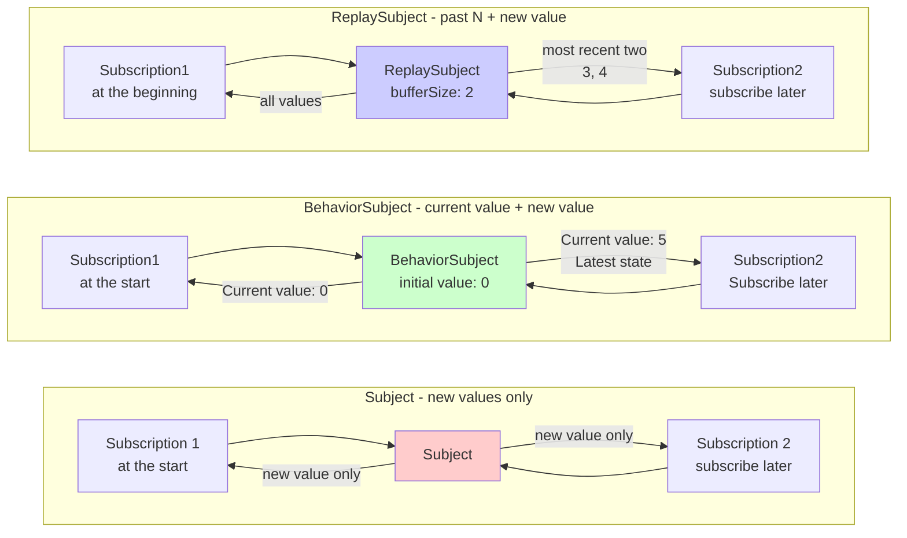

# Difficulties in State Management

In RxJS **"I want to share state with multiple components" and "I want to cache API results"** requirements are very common, but choosing the right method is difficult. This page describes practical patterns for state management and stream sharing.

## Subject vs BehaviorSubject vs ReplaySubject

### Types and Characteristics of Subject

| Subject | Initial value | Behavior when subscribed | Common use cases |
|---|---|---|---|
| **Subject** | None | Receive only the value after subscription | Event Bus, Notification System |
| **BehaviorSubject** | Required | Receive latest value immediately | Current state (logged in, selected item) |
| **ReplaySubject** | None | Receive last N values | History, log, operation record |
| **AsyncSubject** | None | Receive only the last value at completion | Single asynchronous result (not used much) |

### Visualize the Difference Between Subject Type and Operation

The following diagram shows what value each Subject receives upon subscription.



> [!TIP] Selection Criteria
> - **Subject**: Event notification (no past is needed)
> - **BehaviorSubject**: State management (current value needed)
> - **ReplaySubject**: History management (past N required)

### Practical Example 1: Subject (Event Bus)

#### ❌ Bad example: no values are accepted before subscription
```typescript
import { Subject } from 'rxjs';

const notifications$ = new Subject<string>();

notifications$.next('Notification 1'); // no one has subscribed yet

notifications$.subscribe(msg => {
  console.log('Received:', msg);
});

notifications$.next('Notification 2');
notifications$.next('Notification 3');

// Output:
// Received: Notification 2
// Received: Notification 3
// ('Notification 1' is not received)
```

#### ✅ Good example: use as event bus (only process events after subscription)
```typescript
import { filter, map, Subject } from 'rxjs';

class EventBus {
  private events$ = new Subject<{ type: string; payload: any }>();

  emit(type: string, payload: any) {
    this.events$.next({ type, payload });
  }

  on(type: string) {
    return this.events$.pipe(
      filter(event => event.type === type),
      map(event => event.payload)
    );
  }
}

const bus = new EventBus();

// start subscription
bus.on('userLogin').subscribe(user => {
  console.log('login:', user);
});

// event issued
bus.emit('userLogin', { id: 1, name: 'Alice' }); // ✅ Received
// login: {id: 1, name: 'Alice'}
```

> [!TIP] Subject Usage
> - **Event-driven architecture**: Loosely coupled communication between components
> - **Notification system**: Real-time notification delivery
> - **When past values are not needed**: Only post-subscription events need to be handled

### Practical Example 2: BehaviorSubject (State Management)

#### ❌ Bad example: Subject does not know current state
```typescript
import { Subject } from 'rxjs';

const isLoggedIn$ = new Subject<boolean>();

// user is logged in
isLoggedIn$.next(true);

// Subscribed component afterwards
isLoggedIn$.subscribe(status => {
  console.log('login status:', status); // nothing is output
});
```

#### ✅ Good example: get current status immediately with BehaviorSubject
```typescript
import { BehaviorSubject } from 'rxjs';

class AuthService {
  private isLoggedIn$ = new BehaviorSubject<boolean>(false); // initial value: false

  login(username: string, password: string) {
    // login process...
    this.isLoggedIn$.next(true);
  }

  logout() {
    this.isLoggedIn$.next(false);
  }

  // publish externally as read-only
  get isLoggedIn() {
    return this.isLoggedIn$.asObservable();
  }

  // Get current value synchronously (used only for special cases)
  get currentStatus(): boolean {
    return this.isLoggedIn$.value;
  }
}

const auth = new AuthService();

auth.login('user', 'pass');

// Subscribe later and immediately get the current status (true)
auth.isLoggedIn.subscribe(status => {
  console.log('login status:', status); // login status: true
});
```

> [!TIP] Where to Use BehaviorSubject
> - **Keep current state**: Login state, selected items, configuration values
> - **Requires immediate value upon subscription**: Current state is required for initial display in UI
> - **Monitor state changes**: Reactively update when state changes

### Practical Example 3: ReplaySubject (History Management)

#### ✅ Good example: Replay the past N values
```typescript
import { ReplaySubject } from 'rxjs';

class SearchHistoryService {
  // keep history of last 5 searches
  private history$ = new ReplaySubject<string>(5);

  addSearch(query: string) {
    this.history$.next(query);
  }

  getHistory() {
    return this.history$.asObservable();
  }
}

const searchHistory = new SearchHistoryService();

// Execute search
searchHistory.addSearch('TypeScript');
searchHistory.addSearch('RxJS');
searchHistory.addSearch('Angular');

// The last 3 results can be retrieved instantly, even if you subscribe later
searchHistory.getHistory().subscribe(query => {
  console.log('Search history:', query);
});

// Output:
// Search history: TypeScript
// Search history: RxJS
// Search History: Angular
```

> [!TIP] ReplaySubject Usage
> - **Action history**: Search history, edit history, navigation history
> - **Log/Audit Trail**: Record of past operations
> - **Late Subscribe Support**: If you want to receive past values even if your subscription starts late

## Differentiate Between share and shareReplay

### Problem: Duplicate Execution of Cold Observable

#### ❌ Bad example: API is called multiple times with multiple subscribe
```typescript
import { ajax } from 'rxjs/ajax';

const users$ = ajax.getJSON('/api/users');

// subscription1
users$.subscribe(users => {
  console.log('Component A:', users);
});

// Subscription 2
users$.subscribe(users => {
  console.log('Component B:', users);
});

// Problem: API is called twice
// GET /api/users (1st time)
// GET /api/users (2nd time)
```

#### ✅ Good example: convert to Hot with share (share execution)
```typescript
import { ajax } from 'rxjs/ajax';
import { share } from 'rxjs';

const users$ = ajax.getJSON('/api/users').pipe(
  share() // share execution
);

// subscribe1
users$.subscribe(users => {
  console.log('Component A:', users);
});

// Subscription 2 (if you subscribe immediately)
users$.subscribe(users => {
  console.log('Component B:', users);
});

// ✅ API is called only once
// GET /api/users (only once)
```

> [!WARNING] share Pitfalls
> `share()` resets the stream** when the **last subscription is unsubscribed. It will run again the next time you subscribe.
>
> ```typescript
> const data$ = fetchData().pipe(share());
>
> // subscription1
> const sub1 = data$.subscribe();
>
> // subscribe2
> const sub2 = data$.subscribe();
>
> sub1.unsubscribe();
> sub2.unsubscribe(); // everyone unsubscribe → reset
>
> // resubscribe → fetchData() is executed again
> data$.subscribe();
> ```

### shareReplay: Cache and Reuse Results

#### ✅ Good example: cache with shareReplay
```typescript
import { ajax } from 'rxjs/ajax';
import { shareReplay } from 'rxjs';

const users$ = ajax.getJSON('/api/users').pipe(
  shareReplay({ bufferSize: 1, refCount: true })
  // bufferSize: 1 → cache the latest single value
  // refCount: true → cache is cleared when all subscriptions are unsubscribed
);

// subscription1
users$.subscribe(users => {
  console.log('Component A:', users);
});

// Subscribe 1 second later Subscribe 2 (delayed subscription, but still retrieved from cache)
setTimeout(() => {
  users$.subscribe(users => {
    console.log('Component B:', users); // retrieve immediately from cache
  });
}, 1000);

// ✅ API is called only once, and the result is cached
```

### share vs shareReplay Comparison

| Feature | share() | shareReplay(1) |
|---|---|---|
| **New subscription while subscribed** | Share the same stream | Share the same stream |
| **Subscribe late** | Receive only new values | Receive latest cached values |
| **After all subscriptions are unsubscribed** | Reset stream | Retain cache (if refCount: false) |
| **Memory** | Do not retain | Retain cache |
| **Use case** | Real-time data sharing | Cache API results |

#### ✅ Good example: proper configuration of shareReplay
```typescript
import { shareReplay } from 'rxjs';

// Pattern 1: persistent cache (not recommended)
const data1$ = fetchData().pipe(
  shareReplay({ bufferSize: 1, refCount: false })
  // refCount: false → memory leak caution
);

// Pattern 2: cache with automatic cleanup (recommended)
const data2$ = fetchData().pipe(
  shareReplay({ bufferSize: 1, refCount: true })
  // refCount: true → Unsubscribe all and clear cache
);

// Pattern 3: Cache with TTL (RxJS 7.4+)
const data3$ = fetchData().pipe(
  shareReplay({
    bufferSize: 1,
    refCount: true,
    windowTime: 5000 // discard cache after 5 seconds
  })
);
```

> [!IMPORTANT] Memory Leak Caution
> `shareReplay({ refCount: false })` can cause memory leaks because the cache remains persistent. Basically, use **refCount: true**.

## Practical Use of Hot vs Cold

### Cold Features: Run Per Subscription

```typescript
import { Observable } from 'rxjs';

const cold$ = new Observable<number>(subscriber => {
  console.log('🔵 Execution started');
  subscriber.next(Math.random());
  subscriber.complete();
});

cold$.subscribe(v => console.log('Subscribe 1:', v));
cold$.subscribe(v => console.log('Subscription 2:', v));

// Output:
// 🔵 Start Execution
// Subscription 1: 0.123
// 🔵 Start Execution
// Subscription 2: 0.456
// (two runs, different values)
```

### Hot Features: Shared Execution

```typescript
import { Subject } from 'rxjs';

const hot$ = new Subject<number>();

hot$.subscribe(v => console.log('Subscription 1:', v));
hot$.subscribe(v => console.log('Subscription 2:', v));

hot$.next(Math.random());

// Output:
// subscription1: 0.789
// Subscription 2: 0.789
// (sharing the same value)
```

### Usage Criteria

| Requirements | Cold | Hot |
|---|---|---|
| **Need independent execution** | ✅ | ❌ |
| **Want to share execution** | ❌ | ✅ |
| **Different values for different subscribers** | ✅ | ❌ |
| **Real-time data distribution** | ❌ | ✅ |
| **Sharing of API calls** | ❌ (convert with share) | ✅ |

#### ✅ Good example: proper conversion
```typescript
import { interval, fromEvent } from 'rxjs';
import { share, shareReplay } from 'rxjs';

// Cold: each subscriber is an independent timer
const coldTimer$ = interval(1000);

// Cold → Hot: share timer
const hotTimer$ = interval(1000).pipe(share());

// Cold: click event (independent listener registration for each subscription)
const clicks$ = fromEvent(document, 'click');

// Cold → Hot: cache API results
const cachedData$ = ajax.getJSON('/api/data').pipe(
  shareReplay({ bufferSize: 1, refCount: true })
);
```

## Centralized State Management Pattern

### Pattern 1: State Management in the Service Class

```typescript
import { BehaviorSubject, Observable } from 'rxjs';
import { map } from 'rxjs';

interface User {
  id: number;
  name: string;
  email: string;
}

class UserStore {
  // private BehaviorSubject
  private users$ = new BehaviorSubject<User[]>([]);

  // read-only Observable for public use
  get users(): Observable<User[]> {
    return this.users$.asObservable();
  }

  // get a specific user
  getUser(id: number): Observable<User | undefined> {
    return this.users.pipe(
      map(users => users.find(u => u.id === id))
    );
  }

  // update status
  addUser(user: User) {
    const currentUsers = this.users$.value;
    this.users$.next([...currentUsers, user]);
  }

  updateUser(id: number, updates: Partial<User>) {
    const currentUsers = this.users$.value;
    const updatedUsers = currentUsers.map(u =>
      u.id === id ? { ...u, ...updates } : u
    );
    this.users$.next(updatedUsers);
  }

  removeUser(id: number) {
    const currentUsers = this.users$.value;
    this.users$.next(currentUsers.filter(u => u.id !== id));
  }
}

// Usage
const store = new UserStore();

// Subscribe
store.users.subscribe(users => {
  console.log('User list:', users);
});

// update status
store.addUser({ id: 1, name: 'Alice', email: 'alice@example.com' });
store.updateUser(1, { name: 'Alice Smith' });
```

### Pattern 2: State Management Using Scan

```typescript
import { Subject } from 'rxjs';
import { scan, startWith } from 'rxjs';

interface State {
  count: number;
  items: string[];
}

type Action =
  | { type: 'INCREMENT' }
  | { type: 'DECREMENT' }
  | { type: 'ADD_ITEM'; payload: string }
  | { type: 'RESET' };

const actions$ = new Subject<Action>();

const initialState: State = {
  count: 0,
  items: []
};

const state$ = actions$.pipe(
  scan((state, action) => {
    switch (action.type) {
      case 'INCREMENT':
        return { ...state, count: state.count + 1 };
      case 'DECREMENT':
        return { ...state, count: state.count - 1 };
      case 'ADD_ITEM':
        return { ...state, items: [...state.items, action.payload] };
      case 'RESET':
        return initialState;
      default:
        return state;
    }
  }, initialState),
  startWith(initialState)
);

// Subscribe
state$.subscribe(state => {
  console.log('Current state:', state);
});

// issue action
actions$.next({ type: 'INCREMENT' });
actions$.next({ type: 'ADD_ITEM', payload: 'apple' });
actions$.next({ type: 'INCREMENT' });

// Output:
// current state: { count: 0, items: [] }
// current state: { count: 1, items: [] }
// current state: { count: 1, items: ['apple'] }
// current state: { count: 2, items: ['apple'] }
```

## Common Pitfalls

### Pitfall 1: External Exposure of Subject

#### ❌ Bad example: publishing the Subject directly
```typescript
import { BehaviorSubject } from 'rxjs';

class BadService {
  // ❌ can be changed directly from the outside
  public state$ = new BehaviorSubject<number>(0);
}

const service = new BadService();

// can be changed from outside without permission
service.state$.next(999); // ❌ encapsulation is broken
```

#### ✅ Good example: protected by asObservable()
```typescript
import { BehaviorSubject } from 'rxjs';

class GoodService {
  private _state$ = new BehaviorSubject<number>(0);

  // publish as read-only
  get state() {
    return this._state$.asObservable();
  }

  // can only be changed by dedicated methods
  increment() {
    this._state$.next(this._state$.value + 1);
  }

  decrement() {
    this._state$.next(this._state$.value - 1);
  }
}

const service = new GoodService();

// ✅ read only
service.state.subscribe(value => console.log(value));

// ✅ Changes are made via dedicated methods
service.increment();

// ❌ Cannot be changed directly (compile error)
// service.state.next(999); // Error: Property 'next' does not exist
```

### Pitfall 2: shareReplay Memory Leak

#### ❌ Bad example: memory leak with refCount: false
```typescript
import { interval } from 'rxjs';
import { shareReplay, take } from 'rxjs';

const data$ = interval(1000).pipe(
  take(100),
  shareReplay({ bufferSize: 1, refCount: false })
  // ❌ refCount: false → cache remains forever
);

// the stream keeps running internally even after subscribing and unsubscribing
const sub = data$.subscribe();
sub.unsubscribe();

// cache remains → memory leakage
```

#### ✅ Good example: auto cleanup with refCount: true
```typescript
import { interval } from 'rxjs';
import { shareReplay, take } from 'rxjs';

const data$ = interval(1000).pipe(
  take(100),
  shareReplay({ bufferSize: 1, refCount: true })
  // ✅ refCount: true → auto cleanup with all unsubscribes
);

const sub1 = data$.subscribe();
const sub2 = data$.subscribe();

sub1.unsubscribe();
sub2.unsubscribe(); // unsubscribe all subscriptions → stop stream, clear cache
```

### Pitfall 3: Synchronous Value Retrieval

#### ❌ Bad example: too dependent on value
```typescript
import { BehaviorSubject } from 'rxjs';

class CounterService {
  private count$ = new BehaviorSubject(0);

  increment() {
    // ❌ too much reliance on value
    const current = this.count$.value;
    this.count$.next(current + 1);
  }

  // ❌ exposes synchronous acquisition
  getCurrentCount(): number {
    return this.count$.value;
  }
}
```

#### ✅ Good example: keep it reactive
```typescript
import { BehaviorSubject } from 'rxjs';
import { map } from 'rxjs';

class CounterService {
  private count$ = new BehaviorSubject(0);

  get count() {
    return this.count$.asObservable();
  }

  increment() {
    // ✅ It is OK to use value internally
    this.count$.next(this.count$.value + 1);
  }

  // ✅ Return with Observable
  isPositive() {
    return this.count$.pipe(
      map(count => count > 0)
    );
  }
}
```

## Comprehension Checklist

Make sure you can answer the following questions.

```markdown
## Basic Understanding
- [ ] Explain the difference between Subject, BehaviorSubject, and ReplaySubject
- [ ] Understand why BehaviorSubject needs an initial value
- [ ] Understand the meaning of bufferSize in ReplaySubject

## Hot/Cold
- [ ] Explain the difference between Cold Observable and Hot Observable
- [ ] Explain the difference between share and shareReplay
- [ ] Understand the role of shareReplay's refCount option

## State Management
- [ ] Can protect the Subject with asObservable() without exposing it to the outside world
- [ ] Implement state management patterns using BehaviorSubject
- [ ] Understand state management patterns using scan

## Memory Management
- [ ] Know how to prevent memory leaks in shareReplay
- [ ] Explain the difference between refCount: true and false
- [ ] Clear the cache at the appropriate time
```

## Next Steps

Once you understand state management and sharing, the next step is to learn how to **combine multiple streams**.

→ **[Multiple stream combination](/en/guide/overcoming-difficulties/stream-combination)** - How to use combineLatest, zip, withLatestFrom

## Related Pages

- **[Chapter 5: What is Subject](/en/guide/subjects/what-is-subject)** - Basics of Subject
- **[Chapter 5: Types of Subject](/en/guide/subjects/types-of-subject)** - Details of BehaviorSubject and ReplaySubject
- **[share() operator](/en/guide/operators/multicasting/share)** - Detailed explanation of share
- **[Misuse of shareReplay](/en/guide/anti-patterns/common-mistakes#4-sharereplay-)** - Common mistakes
- **[Cold vs Hot Observable](/en/guide/observables/cold-and-hot-observables)** - Cold/Hot details

## 🎯 Practice Problems

### Problem 1: Choosing an Appropriate Subject

Choose the best Subject for the following scenario.

1. **Manage user login status** (default: logout)
2. **Delivery of notification messages** (only display messages after subscription)
3. **Maintain history of the last 5 operations** (even if subscribed late, the last 5 are still visible)

<details>
<summary>Example of solution</summary>

**1. User login status**
```typescript
import { BehaviorSubject } from 'rxjs';

class AuthService {
  private isLoggedIn$ = new BehaviorSubject<boolean>(false);

  get loginStatus() {
    return this.isLoggedIn$.asObservable();
  }

  login() {
    this.isLoggedIn$.next(true);
  }

  logout() {
    this.isLoggedIn$.next(false);
  }
}
```

> [!NOTE] Reason
> **BehaviorSubject** is the best choice because we need the current state immediately upon subscription.

---

**2. Notification message delivery**
```typescript
import { Subject } from 'rxjs';

class NotificationService {
  private notifications$ = new Subject<string>();

  get messages() {
    return this.notifications$.asObservable();
  }

  notify(message: string) {
    this.notifications$.next(message);
  }
}
```

> [!NOTE] Reason
> **Subject** is sufficient since we only need to display the message after subscription.

---

**3. Last 5 operations history**
```typescript
import { ReplaySubject } from 'rxjs';

class HistoryService {
  private actions$ = new ReplaySubject<string>(5); // keep 5 actions

  get history() {
    return this.actions$.asObservable();
  }

  addAction(action: string) {
    this.actions$.next(action);
  }
}
```

> [!NOTE] Reason
> **ReplaySubject(5)** is the best way to keep the last 5 and retrieve them even if you subscribe late.

</details>

### Problem 2: Choosing Between share and shareReplay

In the following code, choose the appropriate operator.

```typescript
import { ajax } from 'rxjs/ajax';

// Scenario 1: Real-time data from WebSocket
const realTimeData$ = webSocket('ws://example.com/stream');

// Scenario 2: API call for user information (we want to cache the results)
const user$ = ajax.getJSON('/api/user/me');

// What should we use for both?
```

<details>
<summary>Example answer</summary>

**Scenario 1: Real-time data from WebSocket**
```typescript
import { share } from 'rxjs';

const realTimeData$ = webSocket('ws://example.com/stream').pipe(
  share() // no need to cache real-time data
);
```

> [!NOTE] Reason
> **share()** is used for real-time data such as WebSocket, because there is no need to cache past values. If you subscribe late, you will receive new data from that point in time.

---

**Scenario 2: API call for user information**
```typescript
import { shareReplay } from 'rxjs';

const user$ = ajax.getJSON('/api/user/me').pipe(
  shareReplay({ bufferSize: 1, refCount: true })
);
```

> [!NOTE] Reason
> Use **shareReplay()** to cache API results and share them among multiple components. Use `refCount: true` to prevent memory leaks.

</details>

### Problem 3: Fixing Memory Leaks

The following code has a memory leak problem. Please fix it.

```typescript
import { interval } from 'rxjs';
import { shareReplay } from 'rxjs';

const data$ = interval(1000).pipe(
  shareReplay(1) // problem: this is the same as shareReplay({ bufferSize: 1, refCount: false })
);

const sub = data$.subscribe(v => console.log(v));
sub.unsubscribe();

// interval keeps running after this → memory leak
```

<details>
<summary>Example solution</summary>

**Modified code:**
```typescript
import { interval } from 'rxjs';
import { shareReplay } from 'rxjs';

const data$ = interval(1000).pipe(
  shareReplay({ bufferSize: 1, refCount: true })
  // refCount: true → Stream stops when all subscriptions are unsubscribed
);

const sub = data$.subscribe(v => console.log(v));
sub.unsubscribe(); // stream is stopped
```

> [!IMPORTANT] Problems
> - `shareReplay(1)` is an abbreviation for `shareReplay({ bufferSize: 1, refCount: false })`
> - `refCount: false` means that the stream keeps running even after all subscriptions are unsubscribed
> - interval keeps running forever, resulting in a memory leak

> [!NOTE] Reason for fix
> With `refCount: true`, the stream also stops when the last subscription is unsubscribed and the cache is cleared.

</details>

### Problem 4: Implementation of State Management

Implement a TodoStore that meets the following requirements.

> [!NOTE] Requirements
> - Able to add, complete, and delete Todo items
> - Ability to retrieve todo lists externally in read-only mode
> - Ability to retrieve the number of completed Todo items

<details>
<summary>Example solution</summary>

```typescript
import { BehaviorSubject, Observable } from 'rxjs';
import { map } from 'rxjs';

interface Todo {
  id: number;
  text: string;
  completed: boolean;
}

class TodoStore {
  private todos$ = new BehaviorSubject<Todo[]>([]);
  private nextId = 1;

  // publish as read-only
  get todos(): Observable<Todo[]> {
    return this.todos$.asObservable();
  }

  // Number of completed Todos
  get completedCount(): Observable<number> {
    return this.todos$.pipe(
      map(todos => todos.filter(t => t.completed).length)
    );
  }

  // add todo
  addTodo(text: string) {
    const currentTodos = this.todos$.value;
    const newTodo: Todo = {
      id: this.nextId++,
      text,
      completed: false
    };
    this.todos$.next([...currentTodos, newTodo]);
  }

  // Todo completed
  toggleTodo(id: number) {
    const currentTodos = this.todos$.value;
    const updatedTodos = currentTodos.map(todo =>
      todo.id === id ? { ...todo, completed: !todo.completed } : todo
    );
    this.todos$.next(updatedTodos);
  }

  // remove todo
  removeTodo(id: number) {
    const currentTodos = this.todos$.value;
    this.todos$.next(currentTodos.filter(todo => todo.id !== id));
  }
}

// Usage
const store = new TodoStore();

store.todos.subscribe(todos => {
  console.log('Todo list:', todos);
});

store.completedCount.subscribe(count => {
  console.log('Completed:', count);
});

store.addTodo('Learn RxJS');
store.addTodo('Read documentation');
store.toggleTodo(1);
```

> [!NOTE] Points
> - Keep state in `BehaviorSubject`
> - Expose it externally as read-only with `asObservable()`
> - Use `value` to get current state and update it
> - Use `map` to compute derived state (completedCount)

</details>
