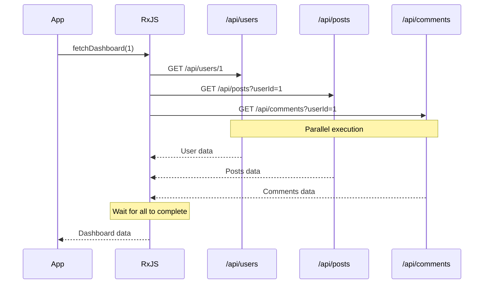
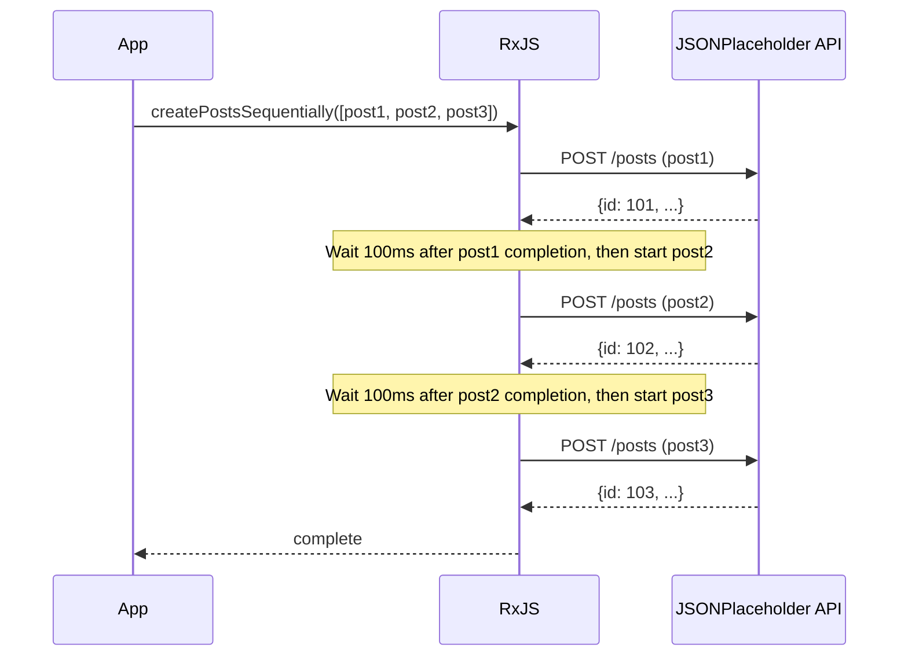
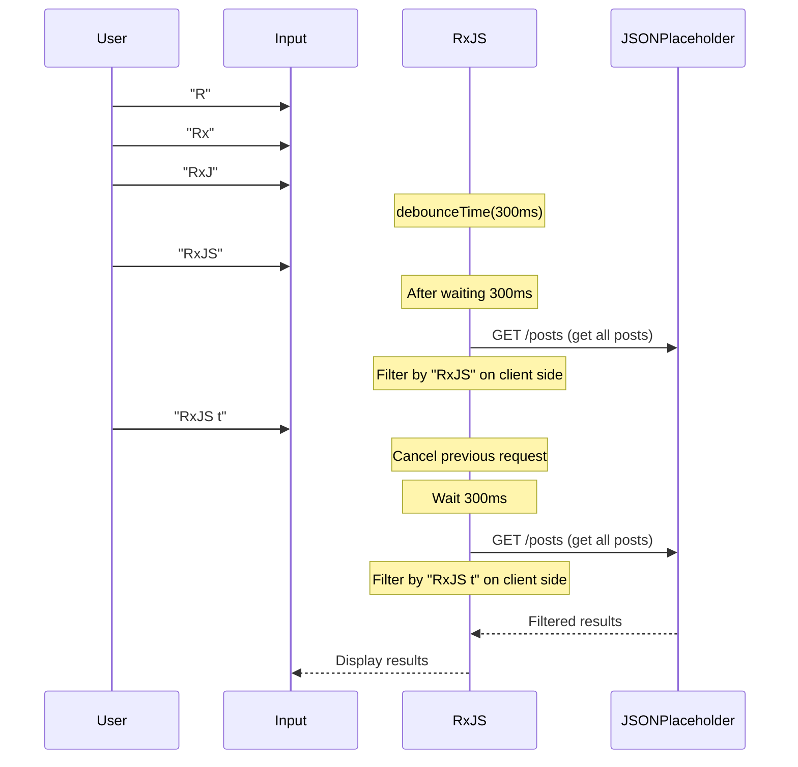

# API Call Patterns

API calls are one of the most frequently implemented processes in web development. RxJS allows you to implement complex asynchronous API calls declaratively and robustly.

This article describes concrete implementation patterns for various API call scenarios encountered in practice, including error handling and cancellation processes.

## What You Will Learn in This Article

- Basic GET/POST request implementation
- Parallel invocation of multiple APIs (forkJoin)
- Serial requests requiring sequential execution (concatMap)
- Chaining of requests with dependencies (switchMap)
- Retry and error handling
- Timeout handling
- Request cancellation

> [!TIP] Prerequisites
> This article assumes knowledge of [Chapter 4: Operators](../operators/index.md) and [Chapter 6: Error Handling](../error-handling/strategies.md).

## Basic API Calls

### Problem: Simple GET Request

The most basic case implements a single GET request.

### Implementation Example

```typescript
import { from, Observable, map, catchError, timeout } from 'rxjs';

// JSONPlaceholder API User type
// https://jsonplaceholder.typicode.com/users
interface User {
  id: number;
  name: string;
  username: string;
  email: string;
  address: {
    street: string;
    suite: string;
    city: string;
    zipcode: string;
    geo: {
      lat: string;
      lng: string;
    };
  };
  phone: string;
  website: string;
  company: {
    name: string;
    catchPhrase: string;
    bs: string;
  };
}

// Fetch a list of users
function fetchUsers(): Observable<User[]> {
  return from(
    fetch('https://jsonplaceholder.typicode.com/users')
      .then(response => {
        if (!response.ok) {
          throw new Error(`HTTP error! status: ${response.status}`);
        }
        return response.json();
      })
  ).pipe(
    timeout(5000), // Timeout in 5 seconds
    catchError(err => {
      console.error('User fetch error:', err);
      throw err;
    })
  );
}

// Usage example
fetchUsers().subscribe({
  next: users => {
    console.log('User list:', users);
    console.log('First user:', users[0].name); // Example: "Leanne Graham"
  },
  error: err => console.error('Error:', err)
});
```

> [!NOTE] from() vs ajax()
> This example wraps the standard `fetch` with `from()`, but you can also use the official RxJS `ajax()`. `ajax()` is more sophisticated and supports request cancellation and progress monitoring.

### POST Request

This pattern is for creating new data.

```typescript
import { from, Observable, catchError } from 'rxjs';

// JSONPlaceholder API Post type
// https://jsonplaceholder.typicode.com/posts
interface Post {
  id: number;
  userId: number;
  title: string;
  body: string;
}

interface CreatePostRequest {
  userId: number;
  title: string;
  body: string;
}

function createPost(postData: CreatePostRequest): Observable<Post> {
  return from(
    fetch('https://jsonplaceholder.typicode.com/posts', {
      method: 'POST',
      headers: {
        'Content-Type': 'application/json',
      },
      body: JSON.stringify(postData)
    }).then(response => {
      if (!response.ok) {
        throw new Error(`HTTP error! status: ${response.status}`);
      }
      return response.json();
    })
  ).pipe(
    catchError(err => {
      console.error('Post creation error:', err);
      throw err;
    })
  );
}

// Usage example
createPost({
  userId: 1,
  title: 'Learning RxJS',
  body: 'Learning API call patterns using RxJS.'
}).subscribe({
  next: post => {
    console.log('Post created:', post);
    console.log('Post ID:', post.id); // JSONPlaceholder automatically assigns an ID (e.g., 101)
  },
  error: err => console.error('Error:', err)
});
```

> [!TIP] Practical Tips
> - **Type Safety**: Clearly define response types
> - **Error Handling**: Check HTTP status codes properly
> - **Timeouts**: Avoid long waits

## Parallel Requests (forkJoin)

### Problem: I Want to Call Multiple APIs Simultaneously

You may want to call multiple independent APIs in parallel and proceed with processing after all responses have been received.

### Solution: Use forkJoin

`forkJoin` waits for multiple Observables to all complete and returns all results in an array (equivalent to Promise.all).

```typescript
import { forkJoin, from, Observable, map } from 'rxjs';

// JSONPlaceholder API Comment type
// https://jsonplaceholder.typicode.com/comments
interface Comment {
  postId: number;
  id: number;
  name: string;
  email: string;
  body: string;
}
interface Post {
  id: number;
  userId: number;
  title: string;
  body: string;
}
interface User {
  id: number;
  name: string;
  username: string;
  email: string;
  address: {
    street: string;
    suite: string;
    city: string;
    zipcode: string;
    geo: {
      lat: string;
      lng: string;
    };
  };
  phone: string;
  website: string;
  company: {
    name: string;
    catchPhrase: string;
    bs: string;
  };
}
interface Dashboard {
  user: User;
  posts: Post[];
  comments: Comment[];
}

function fetchUserById(id: number): Observable<User> {
  return from(
    fetch(`https://jsonplaceholder.typicode.com/users/${id}`).then(r => r.json())
  );
}

function fetchPostsByUserId(userId: number): Observable<Post[]> {
  return from(
    fetch(`https://jsonplaceholder.typicode.com/posts?userId=${userId}`).then(r => r.json())
  );
}

function fetchCommentsByPostId(postId: number): Observable<Comment[]> {
  return from(
    fetch(`https://jsonplaceholder.typicode.com/comments?postId=${postId}`).then(r => r.json())
  );
}

// Fetch dashboard data in parallel
function fetchDashboard(userId: number): Observable<Dashboard> {
  return forkJoin({
    user: fetchUserById(userId),
    posts: fetchPostsByUserId(userId),
    comments: fetchCommentsByPostId(1) // Get comments for post ID=1
  }).pipe(
    map(({ user, posts, comments }) => ({
      user,
      posts,
      comments
    }))
  );
}

// Usage example
fetchDashboard(1).subscribe({
  next: dashboard => {
    console.log('User:', dashboard.user.name); // Example: "Leanne Graham"
    console.log('Number of posts:', dashboard.posts.length); // Example: 10
    console.log('Number of comments:', dashboard.comments.length); // Example: 5
  },
  error: err => console.error('Dashboard fetch error:', err)
});
```

#### Execution Flow



> [!IMPORTANT] Characteristics of forkJoin
> - Waits for all Observables to complete
> - **If any one fails, the entire operation fails**
> - All Observables must emit at least one value

### Enhanced Error Handling

In parallel requests, you may want to retrieve other results even if some of them fail.

```typescript
import { forkJoin, of, catchError } from 'rxjs';

function fetchDashboardWithFallback(userId: number): Observable<Dashboard> {
  return forkJoin({
    user: fetchUserById(userId).pipe(
      catchError(err => {
        console.error('User fetch error:', err);
        return of(null); // Return null on error
      })
    ),
    posts: fetchPostsByUserId(userId).pipe(
      catchError(err => {
        console.error('Error fetching posts:', err);
        return of([]); // Return empty array on error
      })
    ),
    comments: fetchCommentsByUserId(userId).pipe(
      catchError(err => {
        console.error('Error fetching comments:', err);
        return of([]); // Return empty array on error
      })
    )
  }).pipe(
    map(({ user, posts, comments }) => ({
      user: user || { id: userId, name: 'Unknown', email: '' },
      posts,
      comments
    }))
  );
}
```

> [!TIP] Partial Error Handling
> By applying `catchError` to each Observable, the whole process can continue even if a part of it fails.

## Serial Requests (concatMap)

### Problem: I Want to Execute APIs in Order

You want to execute the next request after the previous request completes (e.g., multiple file uploads in sequence).

### Solution: Use concatMap

`concatMap` executes the next Observable after the previous one completes.

```typescript
import { from, Observable, concatMap, tap, delay, catchError } from 'rxjs';

// JSONPlaceholder API Post type
// https://jsonplaceholder.typicode.com/posts
interface Post {
  id: number;
  userId: number;
  title: string;
  body: string;
}

interface CreatePostRequest {
  userId: number;
  title: string;
  body: string;
}

function createPost(postData: CreatePostRequest): Observable<Post> {
  return from(
    fetch('https://jsonplaceholder.typicode.com/posts', {
      method: 'POST',
      headers: {
        'Content-Type': 'application/json',
      },
      body: JSON.stringify(postData)
    }).then(response => {
      if (!response.ok) {
        throw new Error(`HTTP error! status: ${response.status}`);
      }
      return response.json();
    })
  ).pipe(
    catchError(err => {
      console.error('Post creation error:', err);
      throw err;
    })
  );
}

// Create multiple posts sequentially (considering API rate limits)
function createPostsSequentially(posts: CreatePostRequest[]): Observable<Post> {
  return from(posts).pipe(
    concatMap((postData, index) =>
      createPost(postData).pipe(
        tap(result => console.log(`Post ${index + 1} creation complete:`, result.title)),
        delay(100) // Wait 100ms considering API rate limit
      )
    )
  );
}

// Usage example
const postsToCreate: CreatePostRequest[] = [
  {
    userId: 1,
    title: 'First post',
    body: 'This is the first post.'
  },
  {
    userId: 1,
    title: 'Second post',
    body: 'This is the second post.'
  },
  {
    userId: 1,
    title: 'Third post',
    body: 'This is the third post.'
  }
];

const results: Post[] = [];

createPostsSequentially(postsToCreate).subscribe({
  next: post => {
    results.push(post);
    console.log(`Progress: ${results.length}/${postsToCreate.length}`);
  },
  complete: () => {
    console.log('All post creation completed:', results.length, 'posts');
  },
  error: err => console.error('Post creation error:', err)
});
```

#### Execution Flow



> [!NOTE] concatMap vs mergeMap
> - **concatMap**: Execute in order (previous completes, then next)
> - **mergeMap**: Execute in parallel (multiple simultaneous executions possible)
>
> Use `concatMap` when order is important, `mergeMap` when order doesn't matter and speed is priority.

## Requests with Dependencies (switchMap)

### Problem: Calling the Next API Using the Previous API Response

One of the most common patterns, using the result of the first API response to call the next API.

### Solution: Use switchMap

`switchMap` takes the value of the previous Observable and converts it to a new Observable.

```typescript
import { from, Observable, switchMap, map } from 'rxjs';

interface UserProfile {
  user: User;
  posts: Post[];
}
interface Post {
  id: number;
  userId: number;
  title: string;
  body: string;
}
interface User {
  id: number;
  name: string;
  username: string;
  email: string;
  address: {
    street: string;
    suite: string;
    city: string;
    zipcode: string;
    geo: {
      lat: string;
      lng: string;
    };
  };
  phone: string;
  website: string;
  company: {
    name: string;
    catchPhrase: string;
    bs: string;
  };
}

function fetchUserById(id: number): Observable<User> {
  return from(
    fetch(`https://jsonplaceholder.typicode.com/users/${id}`).then(r => r.json())
  );
}

function fetchPostsByUserId(userId: number): Observable<Post[]> {
  return from(
    fetch(`https://jsonplaceholder.typicode.com/posts?userId=${userId}`).then(r => r.json())
  );
}

// Get user details and their posts
function fetchUserProfile(userId: number): Observable<UserProfile> {
  return fetchUserById(userId).pipe(
    switchMap(user =>
      // After getting user info, get their posts
      fetchPostsByUserId(user.id).pipe(
        map(posts => ({
          user,
          posts
        }))
      )
    )
  );
}

// Usage example
fetchUserProfile(1).subscribe({
  next: profile => {
    console.log('User:', profile.user.name);
    console.log('Posts:', profile.posts);
  },
  error: err => console.error('Error:', err)
});
```

### Practical Example: Search Functionality Implementation

A frequently encountered pattern in practice: calling APIs based on user search input.

```typescript
import { from, fromEvent, Observable, of, map, debounceTime, distinctUntilChanged, switchMap, catchError } from 'rxjs';

// Use JSONPlaceholder Post as search result
interface SearchResult {
  id: number;
  userId: number;
  title: string;
  body: string;
}

function searchAPI(query: string): Observable<SearchResult[]> {
  return from(
    fetch('https://jsonplaceholder.typicode.com/posts')
      .then(response => {
        if (!response.ok) {
          throw new Error(`HTTP error! status: ${response.status}`);
        }
        return response.json();
      })
  ).pipe(
    // Client-side filtering by title
    map((posts: SearchResult[]) =>
      posts.filter(post =>
        post.title.toLowerCase().includes(query.toLowerCase())
      )
    )
  );
}

// Traditional approach (commented for reference)
// const searchInput = document.querySelector<HTMLInputElement>('#search');

// Self-contained: creates search input and results container dynamically
const searchInput = document.createElement('input');
searchInput.id = 'search';
searchInput.type = 'text';
searchInput.placeholder = 'Enter search keywords (at least 2 characters)';
searchInput.style.padding = '10px';
searchInput.style.margin = '10px';
searchInput.style.width = '400px';
searchInput.style.fontSize = '16px';
searchInput.style.border = '2px solid #ccc';
searchInput.style.borderRadius = '4px';
searchInput.style.display = 'block';
document.body.appendChild(searchInput);

const resultsContainer = document.createElement('div');
resultsContainer.id = 'results';
resultsContainer.style.padding = '10px';
resultsContainer.style.margin = '10px';
resultsContainer.style.minHeight = '100px';
resultsContainer.style.border = '1px solid #ddd';
resultsContainer.style.borderRadius = '4px';
resultsContainer.style.backgroundColor = '#f9f9f9';
document.body.appendChild(resultsContainer);

const search$ = fromEvent(searchInput, 'input').pipe(
  map(event => (event.target as HTMLInputElement).value),
  debounceTime(300),           // Wait 300ms after input
  distinctUntilChanged(),      // Ignore if the value is the same as last time
  switchMap(query => {
    if (query.length < 2) {
      return of([]); // Empty array if less than 2 characters
    }
    return searchAPI(query).pipe(
      catchError(err => {
        console.error('Search error:', err);
        return of([]); // Empty array in case of error
      })
    );
  })
);

search$.subscribe(results => {
  console.log('Search results:', results);
  // Display results in UI
  displayResults(results, resultsContainer);
});

function displayResults(results: SearchResult[], container: HTMLElement): void {
  // Display results in the DOM
  container.innerHTML = results
    .map(r => `<div style="padding: 8px; margin: 4px; border-bottom: 1px solid #eee;">${r.title}</div>`)
    .join('');

  if (results.length === 0) {
    container.innerHTML = '<div style="padding: 8px; color: #999;">No search results</div>';
  }
}
```

> [!TIP] Client-side Filtering
> Since the JSONPlaceholder API does not have a search endpoint, all posts are retrieved and filtered on the client side. In practice, this pattern is used when the backend does not have a search function or when the amount of data is small.
>
> **Example searches**:
> - Search for "sunt" → Multiple posts hit
> - Search with "qui est esse" → Hits on titles containing "qui est esse"
> - Search with "zzz" → No results found (N/A)

#### Execution Flow



> [!IMPORTANT] Important Properties of switchMap
> **Automatically cancels the previous Observable when a new value arrives.**
> This causes responses to older API requests to be ignored even if they arrive later (avoiding Race Condition).

### switchMap vs mergeMap vs concatMap

This is the use of higher-order mapping operators.

| Operator | Behavior | Use Case |
|----------|----------|----------|
| `switchMap` | Cancel previous when new value arrives | **Search, autocomplete** (only the latest result is needed) |
| `mergeMap` | Execute all in parallel | **Parallel processing** (any order, need all results) |
| `concatMap` | Execute in order (previous one completes, then next) | **Processes where order is important** (e.g., file uploads) |
| `exhaustMap` | Ignore new values until the previous one completes | **Prevent double submission** (countermeasure against consecutive button presses) |

```typescript
// switchMap: Display only the latest search results
searchInput$.pipe(
  switchMap(query => searchAPI(query))
);

// mergeMap: Upload all files in parallel
from(files).pipe(
  mergeMap(file => uploadFile(file))
);

// concatMap: Upload files in sequence
from(files).pipe(
  concatMap(file => uploadFile(file))
);

// exhaustMap: Prevent double submission of form submissions
submitButton$.pipe(
  exhaustMap(() => submitForm())
);
```

## Retry and Error Handling

### Problem: I Want to Handle Temporary Network Errors

When a network error or timeout occurs, you may want to automatically retry.

### Solution: Use retry and retryWhen

```typescript
import { from, Observable, timer } from 'rxjs';
import { retry, retryWhen, mergeMap, catchError, of, timeout } from 'rxjs';

// JSONPlaceholder API User type
// https://jsonplaceholder.typicode.com/users
interface User {
  id: number;
  name: string;
  username: string;
  email: string;
  address: {
    street: string;
    suite: string;
    city: string;
    zipcode: string;
    geo: {
      lat: string;
      lng: string;
    };
  };
  phone: string;
  website: string;
  company: {
    name: string;
    catchPhrase: string;
    bs: string;
  };
}

function fetchUsers(): Observable<User[]> {
  return from(
    fetch('https://jsonplaceholder.typicode.com/users')
      .then(response => {
        if (!response.ok) {
          throw new Error(`HTTP error! status: ${response.status}`);
        }
        return response.json();
      })
  ).pipe(
    timeout(5000), // Timeout in 5 seconds
    catchError(err => {
      console.error('User fetch error:', err);
      throw err;
    })
  );
}

// Simple retry (up to 3 immediately)
function fetchWithSimpleRetry(): Observable<User[]> {
  return fetchUsers().pipe(
    retry(3), // Retry up to 3 times on error
    catchError(err => {
      console.error('Error after retry:', err);
      return of([]); // Return empty array if final error
    })
  );
}

// Retry with exponential backoff
function fetchWithExponentialBackoff(): Observable<User[]> {
  return fetchUsers().pipe(
    retryWhen(errors =>
      errors.pipe(
        mergeMap((error, index) => {
          const retryAttempt = index + 1;

          // Retry up to 3 times
          if (retryAttempt > 3) {
            throw error;
          }

          // Exponential backoff: 1, 2, 4 seconds
          const delayMs = Math.pow(2, index) * 1000;
          console.log(`Retry ${retryAttempt}/3 (after ${delayMs}ms)`);

          return timer(delayMs);
        })
      )
    ),
    catchError(err => {
      console.error('Error even after retry:', err);
      return of([]);
    })
  );
}

// Usage example
fetchWithExponentialBackoff().subscribe({
  next: users => console.log('User fetched successfully:', users),
  error: err => console.error('Final error:', err)
});
```

**Example of exponential backoff in action:**

```
1st attempt: Execute immediately
↓ Error
2nd attempt: Execute after 1 second wait
↓ Error
3rd attempt: Execute after 2 seconds wait
↓ Error
4th attempt: Execute after 4 seconds wait
↓ Success or Final error
```

> [!TIP] Select Retry Strategy
> - **Immediate retry**: `retry(3)` - Simple, useful for network breakdowns
> - **Fixed interval**: `retryWhen` + `delay(1000)` - Server load considered
> - **Exponential backoff**: `retryWhen` + `timer` - Best practice for AWS, etc.

### Retry Only on Specific Errors

Not all errors should be retried (e.g., 401 Unauthorized does not require a retry).

```typescript
import { throwError } from 'rxjs';

interface HttpError {
  status: number;
  message: string;
}

function shouldRetry(error: HttpError): boolean {
  // Status codes that should be retried
  const retryableStatuses = [408, 429, 500, 502, 503, 504];
  return retryableStatuses.includes(error.status);
}

function fetchWithConditionalRetry(): Observable<User[]> {
  return fetchUsers().pipe(
    retryWhen(errors =>
      errors.pipe(
        mergeMap((error: HttpError, index) => {
          const retryAttempt = index + 1;

          // Non-retryable error
          if (!shouldRetry(error)) {
            console.error('Non-retryable error:', error);
            return throwError(() => error);
          }

          // Up to 3 times
          if (retryAttempt > 3) {
            return throwError(() => error);
          }

          const delayMs = Math.pow(2, index) * 1000;
          console.log(`Retry ${retryAttempt}/3 (status: ${error.status})`);

          return timer(delayMs);
        })
      )
    ),
    catchError(err => {
      console.error('Final error:', err);
      return of([]);
    })
  );
}
```

> [!WARNING] Retry Notes
> - **POST request**: Risk of creating duplicates on retry if there is no idempotency
> - **Authentication Errors**: 401/403 do not retry, prompt for re-login
> - **Validation Error**: 400 no retry, prompt user to correct

## Timeout Handling

### Problem: I Want to Deal with Slow API Response

If the network is slow or the server is not responding, I want to time out after a certain amount of time.

### Solution: Use timeout Operator

```typescript
import { timeout, catchError, of, from, Observable, throwError } from 'rxjs';

// JSONPlaceholder API User type
// https://jsonplaceholder.typicode.com/users
interface User {
  id: number;
  name: string;
  username: string;
  email: string;
  address: {
    street: string;
    suite: string;
    city: string;
    zipcode: string;
    geo: {
      lat: string;
      lng: string;
    };
  };
  phone: string;
  website: string;
  company: {
    name: string;
    catchPhrase: string;
    bs: string;
  };
}

function fetchUsers(): Observable<User[]> {
  return from(
    fetch('https://jsonplaceholder.typicode.com/users')
      .then(response => {
        if (!response.ok) {
          throw new Error(`HTTP error! status: ${response.status}`);
        }
        return response.json();
      })
  ).pipe(
    timeout(5000), // Timeout in 5 seconds
    catchError(err => {
      console.error('User fetch error:', err);
      throw err;
    })
  );
}

// Timeout in 5 seconds
function fetchWithTimeout(): Observable<User[]> {
  return fetchUsers().pipe(
    timeout(5000), // Error if no response in 5 seconds
    catchError(err => {
      if (err.name === 'TimeoutError') {
        console.error('Request timed out');
        // Fallback processing on timeout
        return of([]); // Return empty array
      }
      throw err; // Other errors are re-thrown
    })
  );
}

// Custom timeout message
function fetchWithCustomTimeout(): Observable<User[]> {
  return fetchUsers().pipe(
    timeout({
      each: 5000,
      with: () => throwError(() => new Error('Custom timeout error'))
    }),
    catchError(err => {
      console.error('Error:', err.message);
      return of([]);
    })
  );
}
```

### Retries and Timeouts

In practice, timeouts and retries are used in combination.

```typescript
function fetchWithTimeoutAndRetry(): Observable<User[]> {
  return fetchUsers().pipe(
    timeout(5000),           // 5 second timeout on each retry
    retry(3),                // Retry 3 times after timeout
    catchError(err => {
      console.error('Error after timeout and retry:', err);
      return of([]);
    })
  );
}
```

> [!TIP] Set Timeout Value
> - **Normal API**: 5 - 10 seconds
> - **Fast API**: 2 - 3 seconds
> - **File Upload**: 30 - 60 seconds
> - **Background processing**: More than 60 seconds
>
> Set to balance user experience and server load.

## Request Cancellation

### Problem: I Want to Cancel an API Request That Is No Longer Needed

I want to cancel a running API request when a page transition or component is destroyed.

### Solution: Use takeUntil

```typescript
import { Subject, takeUntil, from, timeout, catchError } from 'rxjs';

// JSONPlaceholder API User type
// https://jsonplaceholder.typicode.com/users
interface User {
  id: number;
  name: string;
  username: string;
  email: string;
  address: {
    street: string;
    suite: string;
    city: string;
    zipcode: string;
    geo: {
      lat: string;
      lng: string;
    };
  };
  phone: string;
  website: string;
  company: {
    name: string;
    catchPhrase: string;
    bs: string;
  };
}

class UserListManager {
  private destroy$ = new Subject<void>();
  private users: User[] = [];


   fetchUsers(): Observable<User[]> {
    return from(
      fetch('https://jsonplaceholder.typicode.com/users')
        .then(response => {
          if (!response.ok) {
            throw new Error(`HTTP error! status: ${response.status}`);
          }
          return response.json();
        })
    ).pipe(
      timeout(5000), // Timeout in 5 seconds
      catchError(err => {
        console.error('User fetch error:', err);
        throw err;
      })
    );
  }

  init(): void {
    // Fetch a list of users at initialization
    this.fetchUsers().pipe(
      takeUntil(this.destroy$) // Auto-cancel on instance destruction
    ).subscribe({
      next: (users: User[]) => {
        this.users = users;
        console.log('User acquisition complete:', users);
      },
      error: (err: any) => console.error('Error:', err)
    });
  }

  destroy(): void {
    // Fired when instance is destroyed
    this.destroy$.next();
    this.destroy$.complete();
  }
}

// Usage example
const userList = new UserListManager();
userList.init();

// When cleanup is required
// userList.destroy();
```

### Cancel by User Action

Here is an example of implementing an explicit cancel button.

```typescript
// Traditional approach (commented for reference)
// const cancelButton = document.querySelector<HTMLButtonElement>('#cancel');
// const loadButton = document.querySelector<HTMLButtonElement>('#load');

// Self-contained: creates load and cancel buttons dynamically
const loadButton = document.createElement('button');
loadButton.id = 'load';
loadButton.textContent = 'Load Users';
loadButton.style.padding = '10px 20px';
loadButton.style.margin = '10px';
loadButton.style.fontSize = '16px';
loadButton.style.fontWeight = 'bold';
loadButton.style.color = '#fff';
loadButton.style.backgroundColor = '#4CAF50';
loadButton.style.border = 'none';
loadButton.style.borderRadius = '4px';
loadButton.style.cursor = 'pointer';
document.body.appendChild(loadButton);

const cancelButton = document.createElement('button');
cancelButton.id = 'cancel';
cancelButton.textContent = 'Cancel';
cancelButton.style.padding = '10px 20px';
cancelButton.style.margin = '10px';
cancelButton.style.fontSize = '16px';
cancelButton.style.fontWeight = 'bold';
cancelButton.style.color = '#fff';
cancelButton.style.backgroundColor = '#f44336';
cancelButton.style.border = 'none';
cancelButton.style.borderRadius = '4px';
cancelButton.style.cursor = 'pointer';
document.body.appendChild(cancelButton);

const statusDisplay = document.createElement('div');
statusDisplay.id = 'status';
statusDisplay.style.padding = '10px';
statusDisplay.style.margin = '10px';
statusDisplay.style.fontSize = '14px';
statusDisplay.style.minHeight = '20px';
document.body.appendChild(statusDisplay);

const cancel$ = fromEvent(cancelButton, 'click');

fromEvent(loadButton, 'click').pipe(
  switchMap(() => {
    statusDisplay.textContent = 'Loading...';
    statusDisplay.style.color = '#FF9800';
    return fetchUsers().pipe(
      takeUntil(cancel$) // Abort on cancel button click
    );
  })
).subscribe({
  next: users => {
    console.log('User acquisition complete:', users);
    statusDisplay.textContent = `Users loaded: ${users.length} items`;
    statusDisplay.style.color = '#4CAF50';
  },
  error: err => {
    if (err.name === 'AbortError') {
      console.log('Request canceled');
      statusDisplay.textContent = 'Request canceled';
      statusDisplay.style.color = '#999';
    } else {
      console.error('Error:', err);
      statusDisplay.textContent = `Error: ${err.message}`;
      statusDisplay.style.color = '#f44336';
    }
  }
});
```

> [!IMPORTANT] Cancellation Best Practices
> - **Always implement a cancel process** - Prevents memory leaks and network waste
> - **Use takeUntil** - More declarative and less forgettable than unsubscribe()
> - **When destroying components** - Fire destroy$ to unsubscribe all

## Practical Service Class Example

Here is an example of a complete service class that summarizes the previous patterns and can be used in practice.

```typescript
import { Observable, Subject, throwError, timer, catchError, retryWhen, mergeMap, timeout, shareReplay, takeUntil, from } from 'rxjs';

// JSONPlaceholder API User type
// https://jsonplaceholder.typicode.com/users
interface User {
  id: number;
  name: string;
  username: string;
  email: string;
  address: {
    street: string;
    suite: string;
    city: string;
    zipcode: string;
    geo: {
      lat: string;
      lng: string;
    };
  };
  phone: string;
  website: string;
  company: {
    name: string;
    catchPhrase: string;
    bs: string;
  };
}
interface Post {
  id: number;
  userId: number;
  title: string;
  body: string;
}

export class ApiService {
  private destroy$ = new Subject<void>();
  private cache = new Map<string, Observable<any>>();

  /**
   * Basic GET request
   */
  get<T>(url: string, options?: RequestOptions): Observable<T> {
    return this.request<T>('GET', url, options);
  }

  /**
   * POST request
   */
  post<T>(url: string, body: any, options?: RequestOptions): Observable<T> {
    return this.request<T>('POST', url, { ...options, body });
  }

  /**
   * Cached GET request
   */
  getWithCache<T>(url: string, options?: RequestOptions): Observable<T> {
    const cacheKey = url;

    if (this.cache.has(cacheKey)) {
      return this.cache.get(cacheKey) as Observable<T>;
    }

    const request$ = this.get<T>(url, options).pipe(
      shareReplay(1) // Cache the results
    );

    this.cache.set(cacheKey, request$);
    return request$;
  }

  /**
   * Clear cache
   */
  clearCache(url?: string): void {
    if (url) {
      this.cache.delete(url);
    } else {
      this.cache.clear();
    }
  }

  /**
   * Basic request processing
   */
  private request<T>(
    method: string,
    url: string,
    options?: RequestOptions
  ): Observable<T> {
    const config: RequestInit = {
      method,
      headers: {
        'Content-Type': 'application/json',
        ...options?.headers
      },
      body: options?.body ? JSON.stringify(options.body) : undefined
    };

    return from(
      fetch(url, config).then(response => {
        if (!response.ok) {
          throw {
            status: response.status,
            message: response.statusText
          };
        }
        return response.json();
      })
    ).pipe(
      timeout(options?.timeout || 10000), // Default 10 seconds
      this.retryStrategy(options?.retry),
      // Because public APIs such as JSONPlaceholder return data directly,
      // no need to unwrap response.data
      catchError(err => this.handleError(err)),
      takeUntil(this.destroy$) // Auto cancel when service is destroyed
    );
  }

  /**
   * Retry strategy
   */
  private retryStrategy(retryConfig?: RetryConfig) {
    return retryWhen<any>(errors =>
      errors.pipe(
        mergeMap((error, index) => {
          const retryAttempt = index + 1;
          const maxRetries = retryConfig?.maxRetries || 3;

          // Check if retries are possible
          if (!this.shouldRetry(error) || retryAttempt > maxRetries) {
            return throwError(() => error);
          }

          // Exponential backoff
          const delayMs = retryConfig?.useExponentialBackoff
            ? Math.pow(2, index) * 1000
            : (retryConfig?.delayMs || 1000);

          console.log(`Retry ${retryAttempt}/${maxRetries} (after ${delayMs}ms)`);
          return timer(delayMs);
        })
      )
    );
  }

  /**
   * Determine if there is an error that should be retried
   */
  private shouldRetry(error: any): boolean {
    if (error.name === 'TimeoutError') {
      return true; // Retry for timeout
    }

    // Retryable HTTP status codes
    const retryableStatuses = [408, 429, 500, 502, 503, 504];
    return retryableStatuses.includes(error.status);
  }

  /**
   * Error handling
   */
  private handleError(error: any): Observable<never> {
    let errorMessage = 'API error occurred';

    if (error.name === 'TimeoutError') {
      errorMessage = 'Request timed out';
    } else if (error.status) {
      errorMessage = `HTTP ${error.status}: ${error.message}`;
    }

    console.error(errorMessage, error);
    return throwError(() => new Error(errorMessage));
  }

  /**
   * Processing when service is destroyed
   */
  destroy(): void {
    this.destroy$.next();
    this.destroy$.complete();
    this.cache.clear();
  }
}

// Type definition
interface RequestOptions {
  headers?: Record<string, string>;
  body?: any;
  timeout?: number;
  retry?: RetryConfig;
}

interface RetryConfig {
  maxRetries?: number;
  delayMs?: number;
  useExponentialBackoff?: boolean;
}

// Note: ApiResponse type is used when the API response is wrapped
// Public APIs such as JSONPlaceholder return data directly, so this type is unnecessary
// Use this type when your own API uses the { data: T, status: number } format
interface ApiResponse<T> {
  data: T;
  status: number;
}

// Usage example
const apiService = new ApiService();

// Simple GET (using JSONPlaceholder API)
apiService.get<User[]>('https://jsonplaceholder.typicode.com/users').subscribe({
  next: users => console.log('Users:', users),
  error: err => console.error('Error:', err)
});

// POST with custom settings (using JSONPlaceholder API)
apiService.post<Post>(
  'https://jsonplaceholder.typicode.com/posts',
  { userId: 1, title: 'Test Post', body: 'This is a test post.' },
  {
    timeout: 5000,
    retry: {
      maxRetries: 3,
      useExponentialBackoff: true
    }
  }
).subscribe({
  next: post => console.log('Post created:', post),
  error: err => console.error('Error:', err)
});

// GET with cache
apiService.getWithCache<User[]>('https://jsonplaceholder.typicode.com/users').subscribe({
  next: users => console.log('Users (cache):', users)
});

// When service is destroyed
// apiService.destroy();
```

> [!TIP] Practical Service Design
> - **Configurable**: Flexible configuration of timeouts, retries, etc.
> - **Cache functionality**: Prevent duplicate requests
> - **Error Handling**: Uniform error handling
> - **Automatic cleanup**: destroy() ensures resource release

## Test Code

This is an example test of an API call pattern.

```typescript
import { TestScheduler } from 'rxjs/testing';
import { of, throwError } from 'rxjs';

describe('ApiService', () => {
  let testScheduler: TestScheduler;
  let apiService: ApiService;

  beforeEach(() => {
    testScheduler = new TestScheduler((actual, expected) => {
      expect(actual).toEqual(expected);
    });
    apiService = new ApiService();
  });

  afterEach(() => {
    apiService.destroy();
  });

  it('should fetch users successfully', () => {
    testScheduler.run(({ expectObservable, cold }) => {
      const mockResponse = { data: [{ id: 1, name: 'Test User', email: 'test@example.com' }] };

      // Mock fetch
      spyOn(window, 'fetch').and.returnValue(
        Promise.resolve({
          ok: true,
          json: () => Promise.resolve(mockResponse)
        } as Response)
      );

      const result$ = apiService.get<User[]>('/api/users');

      expectObservable(result$).toBe('(a|)', {
        a: mockResponse.data
      });
    });
  });

  it('should retry on timeout', () => {
    testScheduler.run(({ expectObservable, cold, flush }) => {
      let callCount = 0;

      spyOn(window, 'fetch').and.callFake(() => {
        callCount++;
        if (callCount < 3) {
          // First 2 calls time out
          return new Promise(() => {}); // Unresolved Promise
        }
        // Third time succeeds
        return Promise.resolve({
          ok: true,
          json: () => Promise.resolve({ data: [] })
        } as Response);
      });

      const result$ = apiService.get<User[]>('/api/users', {
        timeout: 100,
        retry: { maxRetries: 3, delayMs: 100 }
      });

      // Make sure retries are executed
      flush();
      expect(callCount).toBeGreaterThan(1);
    });
  });
});
```

## Summary

By mastering the API invocation pattern using RxJS, you can build robust and maintainable applications.

> [!IMPORTANT] Key Points
> - **forkJoin**: Execute multiple APIs in parallel, all waiting for completion
> - **concatMap**: Execute APIs in order (previous one completes, then next)
> - **switchMap**: Ideal for requests with dependencies, search functionality
> - **retry/retryWhen**: Automatic retry on error, exponential backoff recommended
> - **timeout**: Always set a timeout
> - **takeUntil**: Auto cancel when component is destroyed

> [!TIP] Best Practices
> - **Type Safety**: Define types for all API responses
> - **Error Handling**: Implement `catchError` for all requests
> - **Cancel Handling**: Ensure cleanup with `takeUntil`
> - **Retry strategy**: Retry appropriately depending on status code
> - **Caching**: Prevent duplicate requests with `shareReplay`

## Next Steps

Once you have mastered the API call pattern, move on to the following patterns:

- [Form Handling](./form-handling.md) - Real-time validation, autosave
- [UI Event Handling](./ui-events.md) - Integration of UI events and API calls
- [Real-time Data Processing](./real-time-data.md) - WebSocket, SSE
- [Caching Strategies](./caching-strategies.md) - Caching of API responses
- Error Handling Practices (in preparation) - More advanced error handling strategies

## Related Sections

- [Chapter 4: Operators](../operators/index.md) - switchMap, mergeMap, concatMap details
- [Chapter 6: Error Handling](../error-handling/strategies.md) - Basics of catchError, retry
- [Chapter 2: Cold/Hot Observable](../observables/cold-and-hot-observables.md) - Understanding shareReplay

## Reference Resources

- [RxJS Official: ajax](https://rxjs.dev/api/ajax/ajax) - ajax() details
- [MDN: Fetch API](https://developer.mozilla.org/ja/docs/Web/API/Fetch_API) - How to use fetch()
- [Learn RxJS: Higher-order Observables](https://www.learnrxjs.io/learn-rxjs/operators) - Comparison of switchMap etc.
