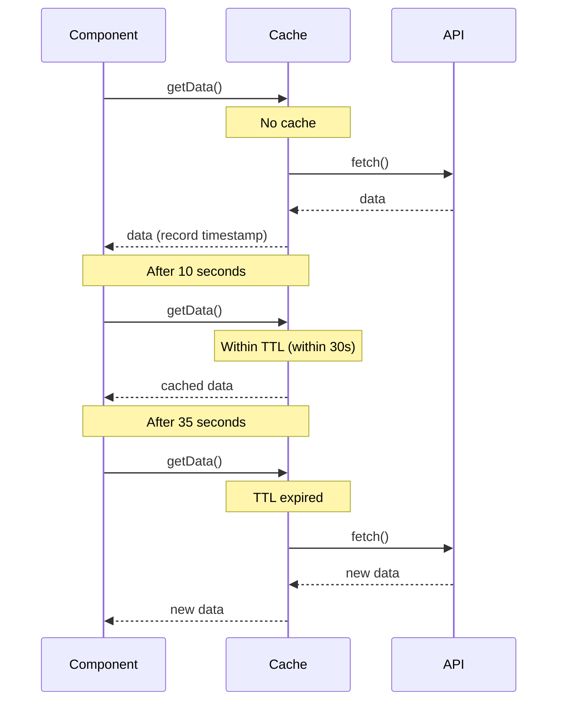
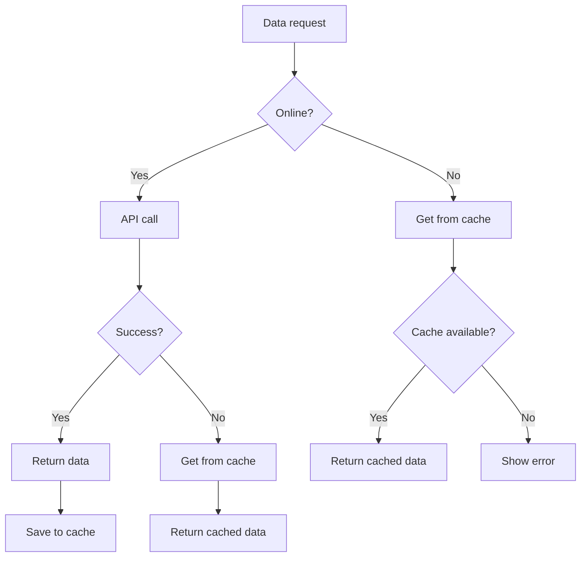

# Cache Strategy Patterns

Caching is one of the most important techniques in performance optimization, and with RxJS, you can implement declarative and flexible caching strategies.

This article describes specific patterns of caching strategies needed in practice, from basic caching with shareReplay to caching with TTL, cache invalidation, and local storage coordination.

## What you will learn in this article

- Basic caching with shareReplay
- Implementation of cache with TTL (time-to-live)
- Manual refresh and cache invalidation
- Interaction with local storage
- Offline support and cache fallback
- Cache monitoring and debugging

> [!TIP] Prerequisites
> This article is based on [Chapter 2: Cold/Hot Observable](../observables/cold-and-hot-observables.md) and [Chapter 4: Operators](../operators/index.md). An understanding of `shareReplay` and `share` is especially important.

## Basic Cache (shareReplay)

### Problem: Avoid calling the same API multiple times

When multiple components need the same API data, we want to avoid duplicate requests.

### Solution: Cache with shareReplay

```typescript
import { Observable, of, shareReplay, catchError, tap } from 'rxjs';

interface User {
  id: number;
  name: string;
  email: string;
}

class UserService {
  private users$: Observable<User[]> | null = null;

  getUsers(): Observable<User[]> {
    // Return cache if available
    if (this.users$) {
      console.log('Returning from cache');
      return this.users$;
    }

    // Create new request and cache
    console.log('Executing new request');
    this.users$ = this.fetchUsersFromAPI().pipe(
      tap(() => console.log('API call completed')),
      shareReplay(1), // Cache the last 1 value
      catchError(err => {
        // Clear cache on error
        this.users$ = null;
        throw err;
      })
    );

    return this.users$;
  }

  clearCache(): void {
    this.users$ = null;
    console.log('Cache cleared');
  }

  private fetchUsersFromAPI(): Observable<User[]> {
    return of([
      { id: 1, name: 'Taro Yamada', email: 'yamada@example.com' },
      { id: 2, name: 'Hanako Sato', email: 'sato@example.com' }
    ]);
  }
}

// Usage example
const userService = new UserService();

// First call (API execution)
userService.getUsers().subscribe(users => {
  console.log('Component 1:', users);
});

// Second call (from cache)
userService.getUsers().subscribe(users => {
  console.log('Component 2:', users);
});

// Output:
// Executing new request
// API call completed
// Component 1: [...]
// Returning from cache
// Component 2: [...]
```

> [!IMPORTANT] Notes on shareReplay
> - **Memory leak**: keeps cache even when subscriptions go to 0
> - **Reference type sharing**: objects are shared by reference, so changes affect all subscribers
> - **Error handling**: recommended to clear cache on error

### shareReplay Configuration Options

```typescript
import { shareReplay } from 'rxjs';

// Basic usage
source$.pipe(
  shareReplay(1) // Cache the last 1 value
);

// Detailed configuration
source$.pipe(
  shareReplay({
    bufferSize: 1,        // Number of values to cache
    refCount: true,       // Destroy cache when subscriber count reaches 0
    windowTime: 5000      // Destroy cache after 5 seconds (optional)
  })
);
```

> [!TIP] Different usage of refCount
> - `refCount: true` - discard cache when subscriber count reaches 0 (memory efficiency ◎)
> - `refCount: false` (default) - persistent cache (performance ◎)
>
> Choose according to your use case.

## Cache with TTL (Time To Live)

### Problem: I want to automatically invalidate old caches

I want to automatically destroy the cache after a certain period of time and retrieve new data.

### Solution: Combine timestamps and filters

```typescript
import { Observable, of, shareReplay, map, switchMap } from 'rxjs';

interface CachedData<T> {
  data: T;
  timestamp: number;
}

class TTLCacheService<T> {
  private cache$: Observable<CachedData<T>> | null = null;
  private ttl: number; // Time To Live (milliseconds)

  constructor(ttl: number = 60000) {
    this.ttl = ttl; // Default: 60 seconds
  }

  getData(fetchFn: () => Observable<T>): Observable<T> {
    if (this.cache$) {
      // Check if cache is valid
      return this.cache$.pipe(
        switchMap(cached => {
          const age = Date.now() - cached.timestamp;
          if (age < this.ttl) {
            console.log(`Returning from cache (expires in ${(this.ttl - age) / 1000}s)`);
            return of(cached.data);
          } else {
            console.log('Cache expired - fetching new');
            this.cache$ = null;
            return this.getData(fetchFn);
          }
        })
      );
    }

    // Fetch new data and cache
    console.log('Executing new request');
    this.cache$ = fetchFn().pipe(
      map(data => ({
        data,
        timestamp: Date.now()
      })),
      shareReplay(1)
    );

    return this.cache$.pipe(map(cached => cached.data));
  }

  clearCache(): void {
    this.cache$ = null;
    console.log('Cache cleared');
  }

  getCacheAge(): number | null {
    // Get cache elapsed time (for debugging)
    if (!this.cache$) return null;

    let timestamp = 0;
    this.cache$.subscribe(cached => {
      timestamp = cached.timestamp;
    });

    return Date.now() - timestamp;
  }
}

// Usage example
interface Product {
  id: number;
  name: string;
  price: number;
}

const productCache = new TTLCacheService<Product[]>(30000); // 30 seconds TTL

function fetchProducts(): Observable<Product[]> {
  console.log('API call');
  return of([
    { id: 1, name: 'Product A', price: 1000 },
    { id: 2, name: 'Product B', price: 2000 }
  ]);
}

// First time (new fetch)
productCache.getData(() => fetchProducts()).subscribe(products => {
  console.log('Fetched:', products);
});

// After 10 seconds (from cache)
setTimeout(() => {
  productCache.getData(() => fetchProducts()).subscribe(products => {
    console.log('After 10s:', products);
    console.log('Cache age:', productCache.getCacheAge(), 'ms');
  });
}, 10000);

// After 35 seconds (expired, re-fetch)
setTimeout(() => {
  productCache.getData(() => fetchProducts()).subscribe(products => {
    console.log('After 35s (expired):', products);
  });
}, 35000);
```

**TTL Cache Behavior:**



## Manual Refresh and Cache Invalidation

### Problem: User wants to refresh data arbitrarily

When the "Refresh" button is clicked, I want to discard the cache and get the latest data.

### Solution: Control by Subject and switch

```typescript
import { Observable, Subject, merge, of, switchMap, shareReplay, tap } from 'rxjs';

class RefreshableCacheService<T> {
  private refreshTrigger$ = new Subject<void>();
  private cache$: Observable<T>;

  constructor(fetchFn: () => Observable<T>) {
    this.cache$ = merge(
      this.refreshTrigger$.pipe(
        tap(() => console.log('Manual refresh'))
      ),
      // For initial execution
      of(undefined).pipe(tap(() => console.log('Initial load')))
    ).pipe(
      switchMap(() => fetchFn()),
      tap(data => console.log('Data fetch completed:', data)),
      shareReplay(1)
    );
  }

  getData(): Observable<T> {
    return this.cache$;
  }

  refresh(): void {
    this.refreshTrigger$.next();
  }
}

const refreshButton = document.createElement('button');
refreshButton.id = 'refresh-button';
refreshButton.textContent = 'Refresh News';
refreshButton.style.padding = '10px 20px';
refreshButton.style.margin = '10px';
refreshButton.style.fontSize = '16px';
refreshButton.style.fontWeight = 'bold';
refreshButton.style.color = '#fff';
refreshButton.style.backgroundColor = '#2196F3';
refreshButton.style.border = 'none';
refreshButton.style.borderRadius = '4px';
refreshButton.style.cursor = 'pointer';
document.body.appendChild(refreshButton);

const newsContainer = document.createElement('div');
newsContainer.id = 'news-container';
newsContainer.style.padding = '15px';
newsContainer.style.margin = '10px';
newsContainer.style.border = '2px solid #ccc';
newsContainer.style.borderRadius = '8px';
newsContainer.style.minHeight = '200px';
newsContainer.style.backgroundColor = '#f9f9f9';
document.body.appendChild(newsContainer);

const newsCache = new RefreshableCacheService<string[]>(() =>
  of(['News 1', 'News 2', 'News 3'])
);

// Subscribe to data
newsCache.getData().subscribe(news => {
  console.log('News list:', news);
  displayNews(news, newsContainer);
});

// Refresh button click
refreshButton.addEventListener('click', () => {
  console.log('User clicked refresh');
  refreshButton.textContent = 'Refreshing...';
  refreshButton.disabled = true;
  refreshButton.style.backgroundColor = '#999';
  newsCache.refresh();
  setTimeout(() => {
    refreshButton.textContent = 'Refresh News';
    refreshButton.disabled = false;
    refreshButton.style.backgroundColor = '#2196F3';
  }, 1000);
});

function displayNews(news: string[], container: HTMLElement): void {
  container.innerHTML = news
    .map(item => `<div style="padding: 10px; margin: 5px 0; border-bottom: 1px solid #ddd; font-size: 14px;">${item}</div>`)
    .join('');

  if (news.length === 0) {
    container.innerHTML = '<div style="padding: 20px; text-align: center; color: #999;">No news</div>';
  }
}
```

### Conditional Cache Invalidation

```typescript
import { BehaviorSubject, Observable, switchMap, shareReplay, distinctUntilChanged, of } from 'rxjs';

interface CacheOptions {
  forceRefresh: boolean;
  userId?: number;
}

class ConditionalCacheService {
  private options$ = new BehaviorSubject<CacheOptions>({
    forceRefresh: false
  });

  data$ = this.options$.pipe(
    distinctUntilChanged((prev, curr) => {
      // Re-fetch if forceRefresh or userId changes
      return !curr.forceRefresh && prev.userId === curr.userId;
    }),
    switchMap(options => {
      console.log('Fetching data:', options);
      return this.fetchData(options.userId);
    }),
    shareReplay(1)
  );

  getData(userId?: number): Observable<any> {
    this.options$.next({
      forceRefresh: false,
      userId
    });
    return this.data$;
  }

  refresh(userId?: number): void {
    this.options$.next({
      forceRefresh: true,
      userId
    });
  }

  private fetchData(userId?: number): Observable<any> {
    console.log('API call - userId:', userId);
    return of({ userId, data: 'sample data' });
  }
}

// Usage example
const conditionalCache = new ConditionalCacheService();

// Get user 1's data
conditionalCache.getData(1).subscribe(data => {
  console.log('User 1 data:', data);
});

// Same user, so from cache
conditionalCache.getData(1).subscribe(data => {
  console.log('User 1 data (cached):', data);
});

// Different user, so re-fetch
conditionalCache.getData(2).subscribe(data => {
  console.log('User 2 data:', data);
});

// Manual refresh
conditionalCache.refresh(1);
```

## Integration with Local Storage

### Problem: I want to keep the cache after page reload

I want to implement a persistent cache using the browser's local storage.

### Solution: Combine with local storage

```typescript
import { Observable, of, defer, tap, catchError } from 'rxjs';

interface StorageCacheOptions {
  key: string;
  ttl?: number; // milliseconds
}

interface CachedItem<T> {
  data: T;
  timestamp: number;
}

class LocalStorageCacheService {
  getOrFetch<T>(
    options: StorageCacheOptions,
    fetchFn: () => Observable<T>
  ): Observable<T> {
    return defer(() => {
      // Try to get from local storage
      const cached = this.getFromStorage<T>(options.key, options.ttl);

      if (cached) {
        console.log('Retrieved from local storage:', options.key);
        return of(cached);
      }

      // No cache, so fetch new
      console.log('New fetch:', options.key);
      return fetchFn().pipe(
        tap(data => {
          this.saveToStorage(options.key, data);
        }),
        catchError(err => {
          console.error('Fetch error:', err);
          throw err;
        })
      );
    });
  }

  private getFromStorage<T>(key: string, ttl?: number): T | null {
    try {
      const item = localStorage.getItem(key);
      if (!item) return null;

      const cached: CachedItem<T> = JSON.parse(item);

      // TTL check
      if (ttl) {
        const age = Date.now() - cached.timestamp;
        if (age > ttl) {
          console.log('Cache expired:', key);
          localStorage.removeItem(key);
          return null;
        }
      }

      return cached.data;
    } catch (error) {
      console.error('Local storage read error:', error);
      return null;
    }
  }

  private saveToStorage<T>(key: string, data: T): void {
    try {
      const item: CachedItem<T> = {
        data,
        timestamp: Date.now()
      };
      localStorage.setItem(key, JSON.stringify(item));
      console.log('Saved to local storage:', key);
    } catch (error) {
      console.error('Local storage save error:', error);
    }
  }

  clearCache(key?: string): void {
    if (key) {
      localStorage.removeItem(key);
      console.log('Cache cleared:', key);
    } else {
      localStorage.clear();
      console.log('All cache cleared');
    }
  }

  getCacheSize(): number {
    let size = 0;
    for (const key in localStorage) {
      if (localStorage.hasOwnProperty(key)) {
        size += localStorage[key].length;
      }
    }
    return size;
  }
}

// Usage example
interface Settings {
  theme: string;
  language: string;
  notifications: boolean;
}

const storageCache = new LocalStorageCacheService();

function fetchSettings(): Observable<Settings> {
  console.log('Fetching settings from API');
  return of({
    theme: 'dark',
    language: 'en',
    notifications: true
  });
}

// Get settings (from local storage or API)
storageCache.getOrFetch(
  { key: 'user-settings', ttl: 3600000 }, // 1 hour TTL
  fetchSettings
).subscribe(settings => {
  console.log('Settings:', settings);
  applySettings(settings);
});

// Same data retrieved after page reload (if within TTL)
// storageCache.getOrFetch(...) // from local storage

function applySettings(settings: Settings): void {
  document.body.className = `theme-${settings.theme}`;
  console.log('Settings applied:', settings);
}
```

### Storage Size Management

```typescript
class ManagedStorageCacheService extends LocalStorageCacheService {
  private maxSize = 5 * 1024 * 1024; // 5MB

  saveWithLimit<T>(key: string, data: T): boolean {
    const item: CachedItem<T> = {
      data,
      timestamp: Date.now()
    };

    const itemString = JSON.stringify(item);
    const itemSize = new Blob([itemString]).size;

    // If current size + new item size exceeds limit
    if (this.getCacheSize() + itemSize > this.maxSize) {
      console.log('Storage capacity limit - removing oldest item');
      this.removeOldestItem();
    }

    try {
      localStorage.setItem(key, itemString);
      return true;
    } catch (error) {
      console.error('Save failed:', error);
      return false;
    }
  }

  private removeOldestItem(): void {
    let oldestKey: string | null = null;
    let oldestTimestamp = Date.now();

    for (const key in localStorage) {
      if (localStorage.hasOwnProperty(key)) {
        try {
          const item = JSON.parse(localStorage[key]);
          if (item.timestamp < oldestTimestamp) {
            oldestTimestamp = item.timestamp;
            oldestKey = key;
          }
        } catch (error) {
          // Ignore parse errors
        }
      }
    }

    if (oldestKey) {
      localStorage.removeItem(oldestKey);
      console.log('Removed oldest item:', oldestKey);
    }
  }
}
```

## Offline Support

### Problem: I want to display cached data when offline

We want to improve UX by displaying cached data even when there is no network connection.

### Solution: Cache-first strategy

```typescript
import { Observable, of, throwError, fromEvent, merge, map, startWith, distinctUntilChanged, switchMap, catchError, tap } from 'rxjs';

class OfflineFirstCacheService {
  private onlineStatus$ = merge(
    fromEvent(window, 'online').pipe(map(() => true)),
    fromEvent(window, 'offline').pipe(map(() => false))
  ).pipe(
    startWith(navigator.onLine),
    distinctUntilChanged(),
    tap(online => console.log('Online status:', online))
  );

  getData<T>(
    cacheKey: string,
    fetchFn: () => Observable<T>
  ): Observable<T> {
    return this.onlineStatus$.pipe(
      switchMap(online => {
        if (online) {
          // Online: fetch from API and cache
          console.log('Online - fetching from API');
          return fetchFn().pipe(
            tap(data => {
              this.saveToCache(cacheKey, data);
            }),
            catchError(err => {
              console.error('API fetch error - falling back to cache');
              return this.getFromCache<T>(cacheKey);
            })
          );
        } else {
          // Offline: get from cache
          console.log('Offline - getting from cache');
          return this.getFromCache<T>(cacheKey);
        }
      })
    );
  }

  private saveToCache<T>(key: string, data: T): void {
    try {
      localStorage.setItem(key, JSON.stringify(data));
      console.log('Cache saved:', key);
    } catch (error) {
      console.error('Cache save failed:', error);
    }
  }

  private getFromCache<T>(key: string): Observable<T> {
    try {
      const cached = localStorage.getItem(key);
      if (cached) {
        const data = JSON.parse(cached);
        console.log('Retrieved from cache:', key);
        return of(data);
      }
    } catch (error) {
      console.error('Cache read error:', error);
    }

    return throwError(() => new Error('Cache not found'));
  }
}

// Traditional approach (commented for reference)
// const container = document.querySelector('#articles');
// const message = document.querySelector('#offline-message');

// Self-contained: creates articles display dynamically
const articlesContainer = document.createElement('div');
articlesContainer.id = 'articles';
articlesContainer.style.padding = '15px';
articlesContainer.style.margin = '10px';
articlesContainer.style.border = '2px solid #ccc';
articlesContainer.style.borderRadius = '8px';
articlesContainer.style.backgroundColor = '#f9f9f9';
document.body.appendChild(articlesContainer);

const offlineMessage = document.createElement('div');
offlineMessage.id = 'offline-message';
offlineMessage.style.padding = '15px';
offlineMessage.style.margin = '10px';
offlineMessage.style.backgroundColor = '#f8d7da';
offlineMessage.style.color = '#721c24';
offlineMessage.style.border = '1px solid #f5c6cb';
offlineMessage.style.borderRadius = '4px';
offlineMessage.style.display = 'none';
offlineMessage.style.textAlign = 'center';
offlineMessage.style.fontWeight = 'bold';
document.body.appendChild(offlineMessage);

// Usage example
const offlineCache = new OfflineFirstCacheService();

function fetchArticles(): Observable<any[]> {
  return of([
    { id: 1, title: 'Article 1', content: 'Content 1' },
    { id: 2, title: 'Article 2', content: 'Content 2' }
  ]);
}

offlineCache.getData('articles', fetchArticles).subscribe({
  next: articles => {
    console.log('Articles:', articles);
    displayArticles(articles, articlesContainer);
    offlineMessage.style.display = 'none';
  },
  error: err => {
    console.error('Data fetch failed:', err);
    showOfflineMessage(offlineMessage);
  }
});

function displayArticles(articles: any[], container: HTMLElement): void {
  container.innerHTML = articles
    .map(a => `
      <article style="padding: 15px; margin: 10px 0; border-bottom: 2px solid #ddd;">
        <h2 style="margin: 0 0 10px 0; font-size: 18px; color: #333;">${a.title}</h2>
        <p style="margin: 0; font-size: 14px; color: #666;">${a.content}</p>
      </article>
    `)
    .join('');

  if (articles.length === 0) {
    container.innerHTML = '<div style="padding: 20px; text-align: center; color: #999;">No articles</div>';
  }
}

function showOfflineMessage(message: HTMLElement): void {
  message.textContent = 'Offline. No cached data available.';
  message.style.display = 'block';
}
```

**Offline Support Strategy:**



## Cache Monitoring and Debugging

### Visualizing Cache Status

```typescript
import { BehaviorSubject, Observable, map } from 'rxjs';

interface CacheEntry {
  key: string;
  size: number;
  timestamp: number;
  hits: number;
}

interface CacheStats {
  entries: CacheEntry[];
  totalSize: number;
  hitRate: number;
}

class ObservableCacheService {
  private cacheEntries$ = new BehaviorSubject<Map<string, CacheEntry>>(new Map());
  private totalRequests = 0;
  private cacheHits = 0;

  stats$: Observable<CacheStats> = this.cacheEntries$.pipe(
    map(entries => {
      const entriesArray = Array.from(entries.values());
      const totalSize = entriesArray.reduce((sum, entry) => sum + entry.size, 0);
      const hitRate = this.totalRequests > 0
        ? (this.cacheHits / this.totalRequests) * 100
        : 0;

      return {
        entries: entriesArray,
        totalSize,
        hitRate
      };
    })
  );

  getData<T>(key: string, fetchFn: () => Observable<T>): Observable<T> {
    this.totalRequests++;

    const entries = this.cacheEntries$.value;
    const entry = entries.get(key);

    if (entry) {
      // Cache hit
      this.cacheHits++;
      entry.hits++;
      this.cacheEntries$.next(new Map(entries));
      console.log(`Cache hit: ${key} (${entry.hits} times)`);
      // Actual data fetch logic
    } else {
      // Cache miss
      console.log(`Cache miss: ${key}`);
      // New fetch and cache registration
      const newEntry: CacheEntry = {
        key,
        size: 0, // Calculate actual data size
        timestamp: Date.now(),
        hits: 1
      };
      entries.set(key, newEntry);
      this.cacheEntries$.next(new Map(entries));
    }

    return fetchFn();
  }

  clearStats(): void {
    this.totalRequests = 0;
    this.cacheHits = 0;
    this.cacheEntries$.next(new Map());
  }
}

// Traditional approach (commented for reference)
// const statsElement = document.querySelector('#cache-stats');

// Self-contained: creates cache stats element dynamically
const cacheStatsElement = document.createElement('div');
cacheStatsElement.id = 'cache-stats';
cacheStatsElement.style.padding = '20px';
cacheStatsElement.style.margin = '10px';
cacheStatsElement.style.border = '2px solid #ccc';
cacheStatsElement.style.borderRadius = '8px';
cacheStatsElement.style.backgroundColor = '#f9f9f9';
cacheStatsElement.style.fontFamily = 'monospace';
document.body.appendChild(cacheStatsElement);

// Usage example
const observableCache = new ObservableCacheService();

// Monitor cache statistics
observableCache.stats$.subscribe(stats => {
  console.log('=== Cache Statistics ===');
  console.log(`Entries: ${stats.entries.length}`);
  console.log(`Total size: ${(stats.totalSize / 1024).toFixed(2)} KB`);
  console.log(`Hit rate: ${stats.hitRate.toFixed(1)}%`);

  // Update UI
  updateCacheStatsUI(stats, cacheStatsElement);
});

function updateCacheStatsUI(stats: CacheStats, element: HTMLElement): void {
  element.innerHTML = `
    <div style="margin-bottom: 15px;">
      <h3 style="margin: 0 0 10px 0; color: #333;">Cache Statistics</h3>
      <div style="padding: 10px; background-color: #fff; border-radius: 4px; margin: 5px 0;">
        <strong>Entries:</strong> ${stats.entries.length}
      </div>
      <div style="padding: 10px; background-color: #fff; border-radius: 4px; margin: 5px 0;">
        <strong>Total size:</strong> ${(stats.totalSize / 1024).toFixed(2)} KB
      </div>
      <div style="padding: 10px; background-color: #fff; border-radius: 4px; margin: 5px 0;">
        <strong>Hit rate:</strong> ${stats.hitRate.toFixed(1)}%
      </div>
    </div>
    <div>
      <h4 style="margin: 10px 0; color: #666;">Entries:</h4>
      ${stats.entries.map(e => `
        <div style="display: flex; justify-content: space-between; padding: 8px; margin: 5px 0; background-color: #fff; border-radius: 4px; border-left: 3px solid #2196F3;">
          <span style="font-weight: bold;">${e.key}</span>
          <span style="color: #2196F3;">${e.hits} hits</span>
        </div>
      `).join('')}
    </div>
  `;

  if (stats.entries.length === 0) {
    element.innerHTML = '<div style="padding: 20px; text-align: center; color: #999;">No cache entries</div>';
  }
}
```

## Summary

Mastering the cache strategy pattern can significantly improve performance and user experience.

> [!IMPORTANT] Key Points
> - **shareReplay**: best for basic memory caching
> - **TTL**: automatic invalidation of stale data
> - **Manual refresh**: user-initiated update
> - **Local storage**: persistent cache
> - **Offline support**: cache-first strategy
> - **Monitoring**: Visualization of hit rates and sizes

> [!TIP] Best Practices
> - **Appropriate TTL**: expiration time based on the nature of the data
> - **Clear on Error**: Destroy cache on error
> - **Size management**: Set storage capacity limits
> - **Using refCount**: Prevent memory leaks
> - **Cache key**: Use a unique and easy-to-understand key

## Next Steps

Once you have mastered the cache strategy pattern, move on to the following patterns.

- [Real-time Data Processing](./real-time-data.md) - Cache real-time data
- [API Calls](./api-calls.md) - Cache API responses
- [UI Event Processing](./ui-events.md) - Cache event data
- Error Handling Practices (in preparation) - Handling cache errors

## Related Sections

- [Chapter 2: Cold/Hot Observable](../observables/cold-and-hot-observables.md) - shareReplay details
- [Chapter 4: Operators](../operators/multicasting/shareReplay.md) - How to use shareReplay
- [Chapter 10: Anti-patterns](../anti-patterns/common-mistakes.md) - Misuse of shareReplay

## Reference Resources

- [RxJS Official: shareReplay](https://rxjs.dev/api/operators/shareReplay) - More on shareReplay
- [MDN: Web Storage API](https://developer.mozilla.org/en-US/docs/Web/API/Web_Storage_API) - How to use local storage
- [Learn RxJS: Caching](https://www.learnrxjs.io/) - Practical examples of cache patterns
