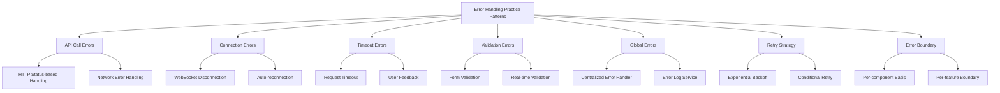

# Error Handling Practice Patterns

In RxJS applications, proper error handling is the foundation for building a reliable system. This article presents seven error handling patterns that can be used immediately in practice.

## Why is error handling important?

In an Observable stream, if an error occurs, the stream terminates and no further values flow. Failure to understand this characteristic and neglect error handling can cause the application to stop unexpectedly or fail to provide proper feedback to the user.

**Three objectives of error handling**:
1. **Ensure Continuity** - Ensure that the stream can continue after an error occurs
2. **Improve user experience** - provide appropriate error messages and means of recovery
3. **System Observability** - early detection of problems through error logging and monitoring

This article explains how to apply the basic knowledge learned in Chapter 6, "[Error Handling](/en/guide/error-handling/strategies.md)" to practical scenarios.

## Structure of this article



## Error handling in API calls

API calls are the most error-prone area; a variety of error scenarios must be handled, including HTTP status codes, network errors, and timeouts.

### Error handling by HTTP status

Depending on the HTTP status code, appropriate error handling is performed.

```typescript
import { Observable, throwError, catchError, retry, tap } from 'rxjs';
import { ajax, AjaxError } from 'rxjs/ajax';

/**
 * HTTP error details
 */
interface HttpErrorInfo {
  status: number;
  message: string;
  retryable: boolean;
  userMessage: string;
}

/**
 * HTTP error classification service
 */
class HttpErrorClassifier {
  /**
   * Generate error information from status code
   */
  classify(error: AjaxError): HttpErrorInfo {
    const status = error.status;

    // 4xx Client errors
    if (status >= 400 && status < 500) {
      return this.handleClientError(status, error);
    }

    // 5xx Server errors
    if (status >= 500) {
      return this.handleServerError(status, error);
    }

    // Network error (status = 0)
    if (status === 0) {
      return {
        status: 0,
        message: 'Network error',
        retryable: true,
        userMessage: 'Unable to connect to network. Please check the connection.'
      };
    }

    // Other errors
    return {
      status,
      message: 'Unknown error',
      retryable: false,
      userMessage: 'An unexpected error has occurred.'
    };
  }

  private handleClientError(status: number, error: AjaxError): HttpErrorInfo {
    switch (status) {
      case 400:
        return {
          status,
          message: 'Bad Request',
          retryable: false,
          userMessage: 'There is an error in the information you entered.'
        };

      case 401:
        return {
          status,
          message: 'Unauthorized',
          retryable: false,
          userMessage: 'Authentication required. Please log in.'
        };

      case 403:
        return {
          status,
          message: 'Forbidden',
          retryable: false,
          userMessage: 'You are not authorized to perform this operation.'
        };

      case 404:
        return {
          status,
          message: 'Not Found',
          retryable: false,
          userMessage: 'Data not found.'
        };

      case 422:
        return {
          status,
          message: 'Unprocessable Entity',
          retryable: false,
          userMessage: 'Input data could not be processed.'
        };

      case 429:
        return {
          status,
          message: 'Too Many Requests',
          retryable: true, // Retryable (requires waiting time)
          userMessage: 'Too many requests. Please wait a while and try again.'
        };

      default:
        return {
          status,
          message: `Client Error ${status}`,
          retryable: false,
          userMessage: 'Could not process the request.'
        };
    }
  }

  private handleServerError(status: number, error: AjaxError): HttpErrorInfo {
    switch (status) {
      case 500:
        return {
          status,
          message: 'Internal Server Error',
          retryable: true,
          userMessage: 'A server error has occurred. Please wait a moment and try again.'
        };

      case 502:
      case 503:
      case 504:
        return {
          status,
          message: 'Service Unavailable',
          retryable: true,
          userMessage: 'The server is temporarily unavailable. Please wait a moment and try again.'
        };

      default:
        return {
          status,
          message: `Server Error ${status}`,
          retryable: true,
          userMessage: 'A server error has occurred.'
        };
    }
  }
}

/**
 * HTTP client service
 */
class HttpClientService {
  private errorClassifier = new HttpErrorClassifier();

  /**
   * GET request (with error handling)
   */
  get<T>(url: string): Observable<T> {
    return ajax.get<T>(url).pipe(
      tap(() => console.log(`GET ${url} - Success`)),
      catchError(error => this.handleError(error, url))
    );
  }

  /**
   * POST request (with error handling)
   */
  post<T>(url: string, body: any): Observable<T> {
    return ajax.post<T>(url, body).pipe(
      tap(() => console.log(`POST ${url} - Success`)),
      catchError(error => this.handleError(error, url))
    );
  }

  /**
   * Unified error handler
   */
  private handleError(error: any, url: string): Observable<never> {
    console.error(`HTTP Error at ${url}:`, error);

    if (error instanceof AjaxError) {
      const errorInfo = this.errorClassifier.classify(error);

      // Log error information
      this.logError(errorInfo, url);

      // Throw user-friendly error
      return throwError(() => errorInfo);
    }

    // Non-AjaxError errors (e.g., programming errors)
    return throwError(() => ({
      status: -1,
      message: error.message || 'Unknown error',
      retryable: false,
      userMessage: 'An unexpected error has occurred.'
    }));
  }

  private logError(errorInfo: HttpErrorInfo, url: string): void {
    // Send to error log service (described later)
    console.error('HTTP Error:', {
      url,
      status: errorInfo.status,
      message: errorInfo.message,
      timestamp: new Date().toISOString()
    });
  }
}
```

> [!TIP] HTTP error classification criteria
> - **4xx Client Errors**: Normally not retriable (input correction required)
> - **5xx Server Error**: retry allowed (temporary server-side problem)
> - **429 Too Many Requests**: retry allowed but waiting time required
> - **0 (Network Error)**: Possible retry (connection problem)

### Usage example: Error handling by status

```typescript
import { Component, OnInit } from '@angular/core';
import { Subject, takeUntil } from 'rxjs';

interface User {
  id: number;
  name: string;
  email: string;
}

class UserDetailManager {
  private destroy$ = new Subject<void>();
  private httpClient = new HttpClientService();

  user: User | null = null;
  loading = false;
  errorMessage = '';
  canRetry = false;

  // Callback for UI updates (optional)
  onStateChange?: (state: { user: User | null; loading: boolean; errorMessage: string; canRetry: boolean }) => void;

  init(): void {
    this.loadUser();
  }

  loadUser(): void {
    this.loading = true;
    this.errorMessage = '';
    this.canRetry = false;
    this.updateUI();

    this.httpClient.get<User>('/api/users/1')
      .pipe(takeUntil(this.destroy$))
      .subscribe({
        next: user => {
          this.user = user;
          this.loading = false;
          this.updateUI();
        },
        error: (errorInfo: HttpErrorInfo) => {
          this.loading = false;
          this.errorMessage = errorInfo.userMessage;
          this.canRetry = errorInfo.retryable;
          this.updateUI();

          // Redirect to login screen for authentication errors
          if (errorInfo.status === 401) {
            setTimeout(() => {
              window.location.href = '/login';
            }, 2000);
          }
        }
      });
  }

  private updateUI(): void {
    if (this.onStateChange) {
      this.onStateChange({
        user: this.user,
        loading: this.loading,
        errorMessage: this.errorMessage,
        canRetry: this.canRetry
      });
    }
  }

  destroy(): void {
    this.destroy$.next();
    this.destroy$.complete();
  }
}

// Usage example
const userDetail = new UserDetailManager();
userDetail.onStateChange = (state) => {
  console.log('State updated:', state);
  // Add UI update logic here
};
userDetail.init();
```

> [!IMPORTANT] user experience considerations
> - Error messages are not technical details, but indicate **what the user should do next**
> - Retryable errors display a **Retry button**
> - Authentication errors **automatically take the user to the login screen**

## Handling network errors

Since network errors are often temporary problems, implement an appropriate retry strategy.

```typescript
import { Observable, timer, throwError, retryWhen, mergeMap, tap } from 'rxjs';
/**
 * Network error specific retry configuration
 */
interface NetworkRetryConfig {
  maxRetries: number;
  initialDelay: number;
  maxDelay: number;
  backoffMultiplier: number;
}

/**
 * Network retry operator
 */
function retryWithBackoff(config: NetworkRetryConfig) {
  const {
    maxRetries = 3,
    initialDelay = 1000,
    maxDelay = 16000,
    backoffMultiplier = 2
  } = config;

  return <T>(source: Observable<T>) => source.pipe(
    retryWhen(errors => errors.pipe(
      mergeMap((error, index) => {
        const retryAttempt = index + 1;

        // Throw error if max retries exceeded
        if (retryAttempt > maxRetries) {
          return throwError(() => ({
            ...error,
            message: `Network error: ${maxRetries} retries failed`,
            userMessage: 'Unable to connect to the network. Please wait a moment and try again.'
          }));
        }

        // Calculate delay with exponential backoff
        const delay = Math.min(
          initialDelay * Math.pow(backoffMultiplier, index),
          maxDelay
        );

        console.log(
          `Retry ${retryAttempt}/${maxRetries} - Retry after ${delay}ms...`
        );

        // Retry after delay
        return timer(delay).pipe(
          tap(() => console.log(`Retry ${retryAttempt} in progress...`))
        );
      })
    ))
  );
}

/**
 * Network-aware HTTP client
 */
class NetworkAwareHttpClient {
  private httpClient = new HttpClientService();
  private errorClassifier = new HttpErrorClassifier();

  /**
   * GET request with network error handling
   */
  get<T>(url: string, retryConfig?: Partial<NetworkRetryConfig>): Observable<T> {
    const defaultConfig: NetworkRetryConfig = {
      maxRetries: 3,
      initialDelay: 1000,
      maxDelay: 16000,
      backoffMultiplier: 2
    };

    const config = { ...defaultConfig, ...retryConfig };

    return this.httpClient.get<T>(url).pipe(
      catchError(error => {
        // Retry only for network errors (status = 0)
        if (error.status === 0) {
          return throwError(() => error);
        }
        // Fail immediately for other errors without retry
        return throwError(() => error);
      }),
      retryWithBackoff(config)
    );
  }
}
```

### Usage example: Offline support

```typescript
import { fromEvent, merge, map, startWith, switchMap, of } from 'rxjs';

/**
 * Online/offline status management
 */
class OnlineStatusService {
  /**
   * Observable for online status
   */
  online$ = merge(
    fromEvent(window, 'online').pipe(map(() => true)),
    fromEvent(window, 'offline').pipe(map(() => false))
  ).pipe(
    startWith(navigator.onLine)
  );
}

/**
 * Offline-capable data viewer
 */
class DataViewerManager {
  private destroy$ = new Subject<void>();
  private networkClient = new NetworkAwareHttpClient();
  private onlineStatus = new OnlineStatusService();

  isOnline$ = this.onlineStatus.online$;
  data: any = null;
  loading = false;
  errorMessage = '';

  // Callback for UI updates (optional)
  onStateChange?: (state: { isOnline: boolean; data: any; loading: boolean; errorMessage: string }) => void;

  init(): void {
    // Automatically load data when coming online
    this.isOnline$.pipe(
      switchMap(isOnline => {
        this.updateUI(isOnline);
        if (isOnline) {
          return this.loadData();
        }
        return of(null);
      }),
      takeUntil(this.destroy$)
    ).subscribe({
      next: data => {
        if (data) {
          this.data = data;
          this.loading = false;
          this.errorMessage = '';
        }
      },
      error: error => {
        this.loading = false;
        this.errorMessage = error.userMessage;
      }
    });
  }

  private loadData(): Observable<any> {
    this.loading = true;

    return this.networkClient.get('/api/data', {
      maxRetries: 5,
      initialDelay: 2000
    });
  }

  private updateUI(isOnline: boolean): void {
    if (this.onStateChange) {
      this.onStateChange({
        isOnline,
        data: this.data,
        loading: this.loading,
        errorMessage: this.errorMessage
      });
    }
  }

  destroy(): void {
    this.destroy$.next();
    this.destroy$.complete();
  }
}

// Usage example
const dataViewer = new DataViewerManager();
dataViewer.onStateChange = (state) => {
  if (!state.isOnline) {
    console.log('You are offline. Please check your internet connection.');
  }
  console.log('State updated:', state);
};
dataViewer.init();
```

> [!TIP] Best Practices for Offline Handling
> - **Monitor online status** and automatically retry when connection is restored
> - **Make offline state explicit** to users to reduce frustration
> - **Partially functional even when offline in combination with local cache**

## Handle timeout errors

Raise a timeout error if there is no response for an extended period of time and handle it appropriately.

```typescript
import { timeout, catchError, throwError, Observable } from 'rxjs';

/**
 * Timeout configuration
 */
interface TimeoutConfig {
  duration: number;
  message: string;
}

/**
 * Timeout-aware HTTP client
 */
class TimeoutAwareHttpClient {
  private networkClient = new NetworkAwareHttpClient();

  /**
   * GET request with timeout
   */
  get<T>(
    url: string,
    timeoutConfig: TimeoutConfig = {
      duration: 30000,
      message: 'Request timed out'
    }
  ): Observable<T> {
    return this.networkClient.get<T>(url).pipe(
      timeout({
        each: timeoutConfig.duration,
        with: () => throwError(() => ({
          status: -2, // Custom status indicating timeout
          message: 'Timeout',
          retryable: true,
          userMessage: timeoutConfig.message
        }))
      }),
      catchError(error => {
        if (error.status === -2) {
          console.error(`Timeout: ${url} (${timeoutConfig.duration}ms)`);
        }
        return throwError(() => error);
      })
    );
  }

  /**
   * Appropriate timeout settings by operation type
   */
  getWithOperationType<T>(
    url: string,
    operationType: 'fast' | 'normal' | 'slow'
  ): Observable<T> {
    const timeoutConfigs = {
      fast: {
        duration: 5000,
        message: 'Request timed out (5 seconds)'
      },
      normal: {
        duration: 30000,
        message: 'Request timed out (30 seconds)'
      },
      slow: {
        duration: 60000,
        message: 'Request timed out (60 seconds)'
      }
    };

    return this.get<T>(url, timeoutConfigs[operationType]);
  }
}
```

### Example of use: Timeout with user feedback

```typescript
import { Subject, interval, takeUntil, map, startWith } from 'rxjs';

/**
 * Manager for long-running operations
 */
class SlowOperationManager {
  private destroy$ = new Subject<void>();
  private timeoutClient = new TimeoutAwareHttpClient();

  loading = false;
  elapsedTime = 0;
  errorMessage = '';
  result: any = null;

  // Callback for UI updates (optional)
  onStateChange?: (state: {
    loading: boolean;
    elapsedTime: number;
    errorMessage: string;
    result: any;
  }) => void;

  startOperation(): void {
    this.loading = true;
    this.errorMessage = '';
    this.result = null;
    this.updateUI();

    // Elapsed time counter
    const timer$ = interval(1000).pipe(
      map(count => count + 1),
      startWith(0),
      takeUntil(this.destroy$)
    );

    timer$.subscribe(elapsed => {
      this.elapsedTime = elapsed;
      this.updateUI();
    });

    // Long-running operation (60 second timeout)
    this.timeoutClient.getWithOperationType('/api/slow-operation', 'slow')
      .pipe(takeUntil(this.destroy$))
      .subscribe({
        next: result => {
          this.result = result;
          this.loading = false;
          this.destroy$.next(); // Stop timer
          this.updateUI();
        },
        error: error => {
          this.errorMessage = error.userMessage;
          this.loading = false;
          this.destroy$.next(); // Stop timer

          // Show additional hint for timeout
          if (error.status === -2) {
            this.errorMessage += ' Server load may be high.';
          }
          this.updateUI();
        }
      });
  }

  retryOperation(): void {
    this.startOperation();
  }

  private updateUI(): void {
    if (this.onStateChange) {
      this.onStateChange({
        loading: this.loading,
        elapsedTime: this.elapsedTime,
        errorMessage: this.errorMessage,
        result: this.result
      });
    }
  }

  destroy(): void {
    this.destroy$.next();
    this.destroy$.complete();
  }
}

// Usage example
const slowOp = new SlowOperationManager();
slowOp.onStateChange = (state) => {
  if (state.loading) {
    console.log(`Processing... (${state.elapsedTime} seconds elapsed)`);
    if (state.elapsedTime > 10) {
      console.log('Processing is taking time. Please wait a moment.');
    }
  }
  if (state.errorMessage) {
    console.error(state.errorMessage);
  }
  if (state.result) {
    console.log('Processing is complete:', state.result);
  }
};
slowOp.startOperation();
```

> [!WARNING] Set timeout value
> - **Too short timeout**: causes even normal operations to fail
> - **Too long timeout**: makes the user wait too long
> - **Set an appropriate value** according to the nature of the operation and display the elapsed time to the user

## Global error handling

Centrally manage, log and monitor errors that occur throughout the application.

```typescript
import { Subject, Observable, share } from 'rxjs';
/**
 * Error severity levels
 */
enum ErrorSeverity {
  Info = 'info',
  Warning = 'warning',
  Error = 'error',
  Critical = 'critical'
}

/**
 * Application error information
 */
interface AppError {
  id: string;
  timestamp: Date;
  severity: ErrorSeverity;
  message: string;
  userMessage: string;
  context?: any;
  stack?: string;
}

/**
 * Global error handler service
 */
class GlobalErrorHandler {
  private errorSubject = new Subject<AppError>();

  /**
   * Stream of all errors
   */
  errors$: Observable<AppError> = this.errorSubject.asObservable().pipe(
    share()
  );

  /**
   * Record an error
   */
  handleError(
    error: any,
    severity: ErrorSeverity = ErrorSeverity.Error,
    context?: any
  ): void {
    const appError: AppError = {
      id: this.generateErrorId(),
      timestamp: new Date(),
      severity,
      message: error.message || 'Unknown error',
      userMessage: error.userMessage || 'An error has occurred',
      context,
      stack: error.stack
    };

    // Push error to stream
    this.errorSubject.next(appError);

    // Log to console
    this.logToConsole(appError);

    // Send to external log service for critical/error severities
    if (severity === ErrorSeverity.Critical || severity === ErrorSeverity.Error) {
      this.sendToLogService(appError);
    }
  }

  private generateErrorId(): string {
    return `err_${Date.now()}_${Math.random().toString(36).substr(2, 9)}`;
  }

  private logToConsole(error: AppError): void {
    const style = this.getConsoleStyle(error.severity);
    console.error(
      `%c[${error.severity.toUpperCase()}] ${error.message}`,
      style,
      {
        id: error.id,
        timestamp: error.timestamp.toISOString(),
        context: error.context,
        stack: error.stack
      }
    );
  }

  private getConsoleStyle(severity: ErrorSeverity): string {
    const styles = {
      [ErrorSeverity.Info]: 'color: #3498db',
      [ErrorSeverity.Warning]: 'color: #f39c12',
      [ErrorSeverity.Error]: 'color: #e74c3c',
      [ErrorSeverity.Critical]: 'color: #fff; background: #c0392b; font-weight: bold'
    };
    return styles[severity];
  }

  private sendToLogService(error: AppError): void {
    // Send to external log service (Sentry, LogRocket, etc.)
    // Example implementation:
    // Sentry.captureException(error);

    console.log('Send error to external log service:', error.id);
  }
}

/**
 * Error notification service
 */
class ErrorNotificationService {
  private notificationSubject = new Subject<{
    message: string;
    type: 'info' | 'warning' | 'error'
  }>();

  notifications$ = this.notificationSubject.asObservable();

  constructor(private globalErrorHandler: GlobalErrorHandler) {
    // Subscribe to global errors and display notifications
    this.globalErrorHandler.errors$.subscribe(error => {
      this.showNotification(error.userMessage, this.mapSeverityToType(error.severity));
    });
  }

  showNotification(
    message: string,
    type: 'info' | 'warning' | 'error' = 'info'
  ): void {
    this.notificationSubject.next({ message, type });
  }

  private mapSeverityToType(severity: ErrorSeverity): 'info' | 'warning' | 'error' {
    if (severity === ErrorSeverity.Info) return 'info';
    if (severity === ErrorSeverity.Warning) return 'warning';
    return 'error';
  }
}
```

### Usage Example: Application-Wide Error Management

```typescript
import { Subject, Observable, of, switchMap, delay, startWith, catchError, throwError } from 'rxjs';

/**
 * Application-wide error manager
 */
class AppErrorManager {
  private destroy$ = new Subject<void>();
  currentNotification$: Observable<any>;

  constructor(
    private errorNotificationService: ErrorNotificationService,
    private globalErrorHandler: GlobalErrorHandler
  ) {
    this.currentNotification$ = this.errorNotificationService.notifications$.pipe(
      switchMap(notification =>
        // Auto-dismiss after 5 seconds
        of(notification).pipe(
          delay(5000),
          startWith(notification)
        )
      )
    );
  }

  init(): void {
    // Catch unhandled Promise rejections
    window.addEventListener('unhandledrejection', event => {
      this.globalErrorHandler.handleError(
        { message: event.reason, userMessage: 'An unexpected error has occurred' },
        ErrorSeverity.Error,
        { type: 'unhandledRejection' }
      );
    });

    // Catch JavaScript errors
    window.addEventListener('error', event => {
      this.globalErrorHandler.handleError(
        { message: event.message, stack: event.error?.stack },
        ErrorSeverity.Critical,
        { filename: event.filename, lineno: event.lineno }
      );
    });

    // Subscribe to notifications for UI updates
    this.currentNotification$.subscribe(notification => {
      if (notification) {
        console.log(`[${notification.type}] ${notification.message}`);
      }
    });
  }

  dismissNotification(): void {
    // Dismiss notification (simplified implementation)
  }

  destroy(): void {
    this.destroy$.next();
    this.destroy$.complete();
  }
}

/**
 * User data management service
 */
class UserService {
  constructor(
    private httpClient: HttpClientService,
    private globalErrorHandler: GlobalErrorHandler
  ) {}

  loadUser(userId: number): Observable<User> {
    return this.httpClient.get<User>(`/api/users/${userId}`).pipe(
      catchError(error => {
        // Record in global error handler
        this.globalErrorHandler.handleError(
          error,
          ErrorSeverity.Error,
          { userId, operation: 'loadUser' }
        );

        // Re-throw error (allow caller to handle as well)
        return throwError(() => error);
      })
    );
  }
}

// Usage example
const globalErrorHandler = new GlobalErrorHandler();
const errorNotificationService = new ErrorNotificationService(globalErrorHandler);
const appErrorManager = new AppErrorManager(errorNotificationService, globalErrorHandler);
appErrorManager.init();

const userService = new UserService(new HttpClientService(), globalErrorHandler);
```

> [!IMPORTANT] Advantages of Global Error Handling
> - **Centralized Management**: Record and monitor all errors in one place
> - **Increased Observability**: Subscribe to error streams for statistics and dashboards
> - **User Experience Unification**: Consistent error notification UI
> - **Easier Debugging**: Record error IDs, context, and stack traces

## Implement retry strategy

Implement flexible retry strategies based on error type and situation.

```typescript
import { Observable, throwError, timer, range, retryWhen, mergeMap, tap, finalize } from 'rxjs';
/**
 * Retry strategy types
 */
enum RetryStrategy {
  Immediate = 'immediate',      // Retry immediately
  FixedDelay = 'fixed',        // Fixed interval
  ExponentialBackoff = 'exponential', // Exponential backoff
  LinearBackoff = 'linear'     // Linear backoff
}

/**
 * Retry configuration
 */
interface RetryConfig {
  strategy: RetryStrategy;
  maxRetries: number;
  initialDelay?: number;
  maxDelay?: number;
  shouldRetry?: (error: any) => boolean;
}

/**
 * Advanced retry operator
 */
function advancedRetry(config: RetryConfig) {
  const {
    strategy,
    maxRetries,
    initialDelay = 1000,
    maxDelay = 32000,
    shouldRetry = () => true
  } = config;

  return <T>(source: Observable<T>) => source.pipe(
    retryWhen(errors => errors.pipe(
      mergeMap((error, index) => {
        const retryAttempt = index + 1;

        // Check if error is retryable
        if (!shouldRetry(error)) {
          console.log('Non-retriable error:', error.message);
          return throwError(() => error);
        }

        // Check max retry attempts
        if (retryAttempt > maxRetries) {
          console.error(`Retry failure: Failed after ${maxRetries} attempts`);
          return throwError(() => ({
            ...error,
            message: `${error.message} (${maxRetries} retries failed)`,
            retriesExhausted: true
          }));
        }

        // Calculate delay based on retry strategy
        const delay = calculateDelay(strategy, index, initialDelay, maxDelay);

        console.log(
          `Retry strategy: ${strategy} | ` +
          `Attempt ${retryAttempt}/${maxRetries} | ` +
          `Retry after ${delay}ms...`
        );

        return timer(delay);
      })
    ))
  );
}

/**
 * Calculate delay by strategy
 */
function calculateDelay(
  strategy: RetryStrategy,
  attemptIndex: number,
  initialDelay: number,
  maxDelay: number
): number {
  switch (strategy) {
    case RetryStrategy.Immediate:
      return 0;

    case RetryStrategy.FixedDelay:
      return initialDelay;

    case RetryStrategy.ExponentialBackoff:
      return Math.min(
        initialDelay * Math.pow(2, attemptIndex),
        maxDelay
      );

    case RetryStrategy.LinearBackoff:
      return Math.min(
        initialDelay * (attemptIndex + 1),
        maxDelay
      );

    default:
      return initialDelay;
  }
}

/**
 * Example of conditional retry
 */
class SmartRetryHttpClient {
  private httpClient = new HttpClientService();

  /**
   * Retry based on error type
   */
  getWithSmartRetry<T>(url: string): Observable<T> {
    return this.httpClient.get<T>(url).pipe(
      advancedRetry({
        strategy: RetryStrategy.ExponentialBackoff,
        maxRetries: 3,
        initialDelay: 1000,
        maxDelay: 16000,
        shouldRetry: (error) => {
          // Determine if error should be retried

          // Network error -> retry
          if (error.status === 0) return true;

          // 5xx Server error -> retry
          if (error.status >= 500) return true;

          // 429 Too Many Requests -> retry
          if (error.status === 429) return true;

          // 4xx Client error -> don't retry
          if (error.status >= 400 && error.status < 500) return false;

          // Other -> don't retry
          return false;
        }
      }),
      tap({
        next: () => console.log('Request successful'),
        error: error => {
          if (error.retriesExhausted) {
            console.error('All retries failed');
          }
        }
      })
    );
  }
}
```

### Example of use: Comparison of retries by strategy

```typescript
import { Observable, finalize } from 'rxjs';

/**
 * Manager for testing retry strategies
 */
class RetryTestManager {
  strategies = [
    { type: RetryStrategy.Immediate, name: 'Retry immediately' },
    { type: RetryStrategy.FixedDelay, name: 'Fixed interval retry' },
    { type: RetryStrategy.ExponentialBackoff, name: 'Exponential backoff' },
    { type: RetryStrategy.LinearBackoff, name: 'Linear backoff' }
  ];

  log = '';

  // Callback for log updates (optional)
  onLogUpdate?: (log: string) => void;

  testStrategy(strategy: RetryStrategy): void {
    this.log = `Start testing ${strategy} strategy...\n`;
    this.updateLog();

    // Always-failing Observable (for testing)
    const failingRequest$ = new Observable(subscriber => {
      this.log += `Request in progress...\n`;
      this.updateLog();
      setTimeout(() => {
        subscriber.error({ status: 500, message: 'Test error' });
      }, 100);
    });

    const startTime = Date.now();

    failingRequest$.pipe(
      advancedRetry({
        strategy,
        maxRetries: 3,
        initialDelay: 1000,
        maxDelay: 8000
      }),
      finalize(() => {
        const elapsed = Date.now() - startTime;
        this.log += `Completed (Elapsed time: ${elapsed}ms)\n`;
        this.updateLog();
      })
    ).subscribe({
      error: () => {
        this.log += 'All retries failed\n';
        this.updateLog();
      }
    });
  }

  private updateLog(): void {
    if (this.onLogUpdate) {
      this.onLogUpdate(this.log);
    }
  }
}

// Usage example
const retryTest = new RetryTestManager();
retryTest.onLogUpdate = (log) => {
  console.log('Log:');
  console.log(log);
};
retryTest.testStrategy(RetryStrategy.ExponentialBackoff);
```

> [!TIP] Guidelines for Selecting a Retry Strategy
> - **Immediate**: Testing environment or temporary lock contention
> - **FixedDelay**: Rate limiting (429) or server load
> - **ExponentialBackoff**: Network error or temporary server error (recommended)
> - **LinearBackoff**: when gradual recovery is expected

## Error Boundary Design

Isolate errors on a per-component or per-module basis to prevent partial failures from spreading throughout the application.

```typescript
import { Subject } from 'rxjs';

/**
 * Error boundary manager
 *
 * Catches errors per section
 * and performs fallback handling
 */
class ErrorBoundaryManager {
  fallbackTitle = 'An error has occurred';
  fallbackMessage = 'Could not load this section. Please try again.';

  hasError = false;
  private destroy$ = new Subject<void>();
  private globalErrorHandler: GlobalErrorHandler;

  // Callback for UI updates (optional)
  onStateChange?: (state: { hasError: boolean; fallbackTitle: string; fallbackMessage: string }) => void;
  onErrorOccurred?: (error: any) => void;

  constructor(globalErrorHandler: GlobalErrorHandler, options?: { fallbackTitle?: string; fallbackMessage?: string }) {
    this.globalErrorHandler = globalErrorHandler;
    if (options?.fallbackTitle) this.fallbackTitle = options.fallbackTitle;
    if (options?.fallbackMessage) this.fallbackMessage = options.fallbackMessage;
  }

  /**
   * Catch error
   */
  catchError(error: any, context?: any): void {
    this.hasError = true;

    // Record in global error handler
    this.globalErrorHandler.handleError(
      error,
      ErrorSeverity.Warning,
      { ...context, boundaryLocation: 'ErrorBoundaryManager' }
    );

    // Notify parent
    if (this.onErrorOccurred) {
      this.onErrorOccurred(error);
    }

    this.updateUI();
  }

  /**
   * Reset error state
   */
  retry(): void {
    this.hasError = false;
    this.updateUI();
  }

  private updateUI(): void {
    if (this.onStateChange) {
      this.onStateChange({
        hasError: this.hasError,
        fallbackTitle: this.fallbackTitle,
        fallbackMessage: this.fallbackMessage
      });
    }
  }

  destroy(): void {
    this.destroy$.next();
    this.destroy$.complete();
  }
}

/**
 * Dashboard section manager
 */
class DashboardManager {
  private userBoundary: ErrorBoundaryManager;
  private statisticsBoundary: ErrorBoundaryManager;
  private notificationsBoundary: ErrorBoundaryManager;

  constructor(globalErrorHandler: GlobalErrorHandler) {
    this.userBoundary = new ErrorBoundaryManager(
      globalErrorHandler,
      { fallbackTitle: 'User information cannot be loaded' }
    );
    this.statisticsBoundary = new ErrorBoundaryManager(
      globalErrorHandler,
      { fallbackTitle: 'Cannot load statistics' }
    );
    this.notificationsBoundary = new ErrorBoundaryManager(
      globalErrorHandler,
      { fallbackTitle: 'Unable to load notification' }
    );

    // Error handling for user section
    this.userBoundary.onErrorOccurred = (error) => {
      console.log('An error has occurred in the user section:', error);
      // Load alternative data if needed
    };
  }

  getUserBoundary(): ErrorBoundaryManager {
    return this.userBoundary;
  }

  getStatisticsBoundary(): ErrorBoundaryManager {
    return this.statisticsBoundary;
  }

  getNotificationsBoundary(): ErrorBoundaryManager {
    return this.notificationsBoundary;
  }
}

/**
 * User info manager
 */
class UserInfoManager {
  private httpClient = new HttpClientService();
  private errorBoundary?: ErrorBoundaryManager;

  user: User | null = null;
  loading = false;

  // Callback for UI updates (optional)
  onStateChange?: (state: { user: User | null; loading: boolean }) => void;

  constructor(errorBoundary?: ErrorBoundaryManager) {
    this.errorBoundary = errorBoundary;
  }

  init(): void {
    this.loadUser();
  }

  loadUser(): void {
    this.loading = true;
    this.updateUI();

    this.httpClient.get<User>('/api/user/me').subscribe({
      next: user => {
        this.user = user;
        this.loading = false;
        this.updateUI();
      },
      error: error => {
        this.loading = false;
        this.updateUI();

        // Propagate error to error boundary
        if (this.errorBoundary) {
          this.errorBoundary.catchError(error, {
            component: 'UserInfoManager',
            operation: 'loadUser'
          });
        }
      }
    });
  }

  private updateUI(): void {
    if (this.onStateChange) {
      this.onStateChange({
        user: this.user,
        loading: this.loading
      });
    }
  }
}

// Usage example
const globalErrorHandler = new GlobalErrorHandler();
const dashboard = new DashboardManager(globalErrorHandler);

const userInfo = new UserInfoManager(dashboard.getUserBoundary());
userInfo.onStateChange = (state) => {
  if (state.loading) {
    console.log('Loading...');
  } else if (state.user) {
    console.log(`User: ${state.user.name} (${state.user.email})`);
  }
};
userInfo.init();
```

> [!IMPORTANT] Advantages of error bounds
> - **Localization of faults**: errors in one section do not affect other sections
> - **Improved User Experience**: Provides a partially functional UI
> - **Easier Debugging**: Clearly identifies where errors occur
> - **Staged recovery**: retry section by section

## Summary

This article described seven practical error handling patterns for RxJS applications.

### Key Points

> [!TIP] Error Handling Principles
> 1. **Predict errors**: Identify possible error scenarios in advance
> 2. **Categorize appropriately**: Implement a process for each type of error
> 3. **Consider the user**: indicate next actions, not technical details
> 4. **Ensure observability**: log all errors
> 5. **set boundaries**: limit the impact of errors

### Checklist for pattern application

- [ ] Classify HTTP errors by status code
- [ ] Implement appropriate retry strategies for network errors
- [ ] Set timeout values according to the nature of the operation
- [ ] Centralize management with a global error handler
- [ ] Distinguish between retriable and non-retriable errors
- [ ] Isolate per-component failures with error boundaries
- [ ] Display error messages in a user-friendly manner

### Related Sections

- **[Error Handling](/en/guide/error-handling/strategies.md)** - Basic error handling strategies
- **[API call patterns](/en/guide/practical-patterns/api-calls.md)** - Basic API communication patterns
- **[Real-time data processing](/en/guide/practical-patterns/real-time-data.md)** - Connection error handling in WebSocket
- **[Anti-patterns](/en/guide/anti-patterns/)** - Common mistakes in error handling

## Test code

Example test code to verify the behavior of error handling.

```typescript
import { TestBed } from '@angular/core/testing';
import { of, throwError } from 'rxjs';

describe('HttpErrorClassifier', () => {
  let classifier: HttpErrorClassifier;

  beforeEach(() => {
    classifier = new HttpErrorClassifier();
  });

  it('should classify 404 as client error', () => {
    const error = { status: 404 } as AjaxError;
    const result = classifier.classify(error);

    expect(result.status).toBe(404);
    expect(result.retryable).toBe(false);
    expect(result.userMessage).toContain('not found');
  });

  it('should classify 500 as retryable server error', () => {
    const error = { status: 500 } as AjaxError;
    const result = classifier.classify(error);

    expect(result.status).toBe(500);
    expect(result.retryable).toBe(true);
    expect(result.userMessage).toContain('server error');
  });

  it('should classify network error (status 0) as retryable', () => {
    const error = { status: 0 } as AjaxError;
    const result = classifier.classify(error);

    expect(result.status).toBe(0);
    expect(result.retryable).toBe(true);
    expect(result.userMessage).toContain('network');
  });
});

describe('SmartRetryHttpClient', () => {
  let client: SmartRetryHttpClient;
  let httpClientSpy: jasmine.SpyObj<HttpClientService>;

  beforeEach(() => {
    httpClientSpy = jasmine.createSpyObj('HttpClientService', ['get']);
    client = new SmartRetryHttpClient();
    (client as any).httpClient = httpClientSpy;
  });

  it('should retry on 500 error', (done) => {
    let attempts = 0;
    httpClientSpy.get.and.callFake(() => {
      attempts++;
      if (attempts < 3) {
        return throwError(() => ({ status: 500 }));
      }
      return of({ data: 'success' });
    });

    client.getWithSmartRetry('/api/test').subscribe({
      next: result => {
        expect(attempts).toBe(3);
        expect(result).toEqual({ data: 'success' });
        done();
      }
    });
  });

  it('should not retry on 404 error', (done) => {
    let attempts = 0;
    httpClientSpy.get.and.callFake(() => {
      attempts++;
      return throwError(() => ({ status: 404 }));
    });

    client.getWithSmartRetry('/api/test').subscribe({
      error: () => {
        expect(attempts).toBe(1);
        done();
      }
    });
  });
});

describe('GlobalErrorHandler', () => {
  let handler: GlobalErrorHandler;
  let receivedErrors: AppError[];

  beforeEach(() => {
    handler = new GlobalErrorHandler();
    receivedErrors = [];

    handler.errors$.subscribe(error => {
      receivedErrors.push(error);
    });
  });

  it('should emit error to stream', () => {
    handler.handleError(
      { message: 'Test error' },
      ErrorSeverity.Error
    );

    expect(receivedErrors.length).toBe(1);
    expect(receivedErrors[0].message).toBe('Test error');
    expect(receivedErrors[0].severity).toBe(ErrorSeverity.Error);
  });

  it('should generate unique error IDs', () => {
    handler.handleError({ message: 'Error 1' });
    handler.handleError({ message: 'Error 2' });

    expect(receivedErrors[0].id).not.toBe(receivedErrors[1].id);
  });
});
```

## Reference Resources

Here are some resources to help you learn more about error handling.

- [Official RxJS Documentation - Error Handling](https://rxjs.dev/guide/error-handling) - the official guide to error handling
- [Learn RxJS - catchError](https://www.learnrxjs.io/learn-rxjs/operators/error_handling/catch) - Details on the catchError operator
- [Learn RxJS - retry / retryWhen](https://www.learnrxjs.io/learn-rxjs/operators/error_handling/retry) - How to use the retry operator
- [Angular Error Handling Best Practices](https://angular.io/guide/http#error-handling) - HTTP error handling in Angular
